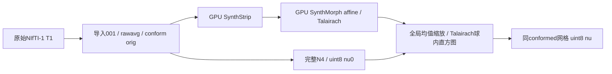
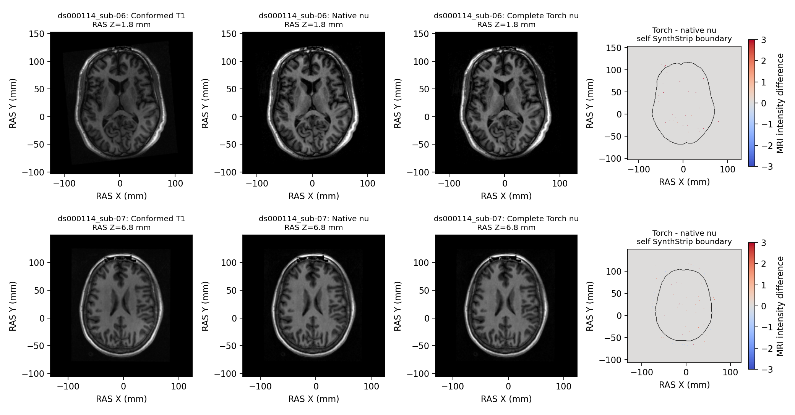

# 原始 T1 到完整 N4 与 nu 的输入链

## 1．功能和支持范围

`run_input_n4_chain()` 从一幅原始三维 NIfTI-1 T1 连续生成导入、conform、SynthStrip、Talairach、N4 `nu0.mgz` 和最终 `nu.mgz`。默认 `n4_backend="native"` 保留固定 Conda ITK 实现；显式 `torch` 复用已实现的完整固定 N4 配方，含直方图锐化、四层反馈、B-spline 拟合/细化/重建，最多 200 轮。



图表示数据依赖；当前代码依次完成前段后运行 N4，没有声称这些分支已经并行。单 T1 的 `001.mgz → rawavg.mgz` 复制符合当前流程语义。多 T1、T2/FLAIR、纵向和完整 recon-all 不在本接口范围。

本轮发现并修复成熟实现复用问题：完整 `n4_itk_torch_experimental.correct_volume()` 已存在，但原 Torch 分支仍调用旧 `n4_gpu.run()` 的平滑残差近似，且旧页误将其 float32 输出描述为当前流程。现在只替换该分支的绑定。独立旧近似 API 仍有直接调用和结构测试，不删其接口，也不将其输出用于 recon-all。

## 2．Python 调用、输入输出与空间

```python
from fnit.recon_all.input_n4_chain import run_input_n4_chain

report = run_input_n4_chain(
    t1="data/sub-07_T1w.nii.gz",  # 原始3D NIfTI-1影像，不是参考orig
    subject_dir="runs/sub-07-input-n4",  # 不存在或为空，所有中间与最终输出写入这里
    weights_dir="resources/weights",  # 已校验SynthStrip与SynthMorph affine权重
    assets_dir="resources/assets",  # 含average/mni305.cor.stripped.mgz的模板目录
    n4_binary=None,  # torch不需要；native必须为FNIT源码Conda构建程序路径
    device="cuda:0",  # 神经推理与Torch N4目标GPU；默认cpu，不自动回退
    threads=4,  # 前段CPU/Torch线程预算；native N4拟合和重建仍各1线程
    n4_backend="torch",  # 显式完整实验后端；默认native保持不变
    profile=False,  # 默认关闭；True同步N4子段用于剖析，并包含该开销
)
```

| 参数 | 类型、默认值和限制 |
|---|---|
| `t1` | 必填 str/Path；现有导入器只接受三维 nibabel `Nifti1Image`，原始体素网格/强度 |
| `subject_dir` | 必填 str/Path；须不存在或为空，不接受手动检查点冒充连续运行 |
| `weights_dir` | 必填 str/Path；须含已校验 `synthstrip.1.pt` 与 `synthmorph.affine.2.h5` |
| `assets_dir` | 必填 str/Path；须含 `average/mni305.cor.stripped.mgz` |
| `n4_binary` | str/Path/None，默认 None；native 必填独立源码构建产物，Torch 不使用 |
| `device` | str，默认 cpu；显式 CUDA 控制 SynthStrip、Talairach及Torch N4，不改变native CPU计算 |
| `threads` | int，默认4；沿用前段线程预算，CLI要求正整数；native N4仍固定单线程 |
| `n4_backend` | str，默认native；仅native/torch，非法值在加载模型前报错 |
| `profile` | bool，默认False；native写 `scripts/n4.profile.json`；Torch记录同步子段 |

返回前段原有字段加本轮 N4 字段，不只返回一个目录：

| 文件 / 返回字段 | 数据结构、空间与意义 |
|---|---|
| `original`，`mri/orig/001.mgz` | 导入后的原始网格；强度仍为原影像约定 |
| `rawavg`，`mri/rawavg.mgz` | 单输入时与001的数据和空间相同 |
| `conformed`，`mri/orig.mgz` | 当前固定conform网格，通常256³、1mm，uint8；以实际header为准 |
| `synthstrip`，`mri/synthstrip.mgz` | 与orig相同网格/dtype的去脑外强度图，不是图谱标签 |
| `talairach_xfm` | `(4,4)` 齐次RAS/mm→MNI305的线性变换文本；保持现有轴/单位约定 |
| `talairach_affine_lta` / `talairach_voxel_lta` | 有源/目标几何的RAS LTA和voxel LTA；不能混用两种矩阵空间 |
| `nu0`，`mri/tmp/nu0.mgz` | 完整N4后同orig网格、uint8；不是旧近似float32 |
| `nu`，`mri/nu.mgz` | 均值缩放、50mm Talairach球内直方图和uchar写出后，同orig网格uint8 |
| `n4_backend` / `n4_details` | 实际路由与算法；Torch含shape、dtype、iterations和耗时；native含固定线程及可选profile |
| `n4_seconds` / `n4_wrapper_seconds` | N4文件API和后处理完整墙钟，含相应加载/搬运/读写 |
| `n4_global_mean_scale` / `n4_histogram_bins` | 浮点均值缩放和两个int直方图索引；是强度参数，不是空间变换 |
| `actual_forwards` / `talairach_child_gpu` | 既有神经前向实际精度和隔离子进程观测，保留已验证FP32例外 |
| `total_seconds` | 从入口参数检查到nu写出的墙钟；含加载、传输、读写，不含调用者Python导入 |

`subject_dir/device/threads` 和 `import_seconds/single_run_copy_seconds/conform_and_xform_tag_seconds/synthstrip_seconds/talairach_seconds` 仍按前段返回。`production_default_changed=False` 表示本轮没有切换默认。

强度单位是任意MRI强度，不把它解释为标签概率。没有体积重采样到MNI；Talairach只参与变换/直方图选区。完整Torch N4有已记录的系统强度尾差，仍是显式实验后端。API保留调用者TF32策略，不启用FP16/BF16；SynthStrip cuDNN与Talairach affine的已验证FP32例外继续执行并记录。失败抛异常，可能留下部分输出；非法后端和缺失native binary参数在模型加载/输出创建前报错。

## 3．命令行和复现

```bash
# 原始影像、空输出目录与已声明资源；本命令只启用显式实验分支。
python -m fnit.recon_all.input_n4_chain \
  --t1 data/sub-07_T1w.nii.gz \
  --subject-dir runs/sub-07-input-n4 \
  --weights-dir resources/weights \
  --assets-dir resources/assets \
  --n4-backend torch \
  --device cuda:0 \
  --threads 4 \
  --report runs/sub-07-input-n4.json
```

CLI与Python同参数；`--report` 必填JSON，`--profile` 可选，native额外提供 `--n4-binary resources/native/bin/fnit_n4_itk`。本CLI只在其进程默认开启TF32，保留前段局部FP32例外，并报告调用前CUDA是否已初始化及恢复后的策略。外部进程墙钟还需包含导入，不能与API时间混用。当前主页Conda已包含全部生产依赖，无新依赖；pytest只是固定独立测试层。

真实复现脚本 `benchmark_input_chain.py` 位于 `validation/recon_all/optimizations/20261009_n4_torch_substages/`。`--config` 是 `case/input/public_source_url/sha256` 数组；`--weights/--assets/--native` 为声明资源；`--output` 必须不存在；`--profiling-module` 为带SHA的FNIT同期采样器；`--device cuda:0 --threads 4 --seed 1729` 固定资源/种子。它交替native/Torch顺序，每个backend从原始T1重新生成，GPU计时同步，比较仅在候选完成后进行。

## 4．对应原软件与实现

独立benchmark的原软件链包括 `mri_convert` 导入/conform、`mri_synthstrip`、SynthMorph affine/`rca-talairach`、`N4BiasFieldCorrection` 和 `mri_nu_correct.mni` 包装器的 `mri_segstats` / `mri_make_uchar`。它不是一个独立上游CLI，完整参考配方由 recon-all 单T1调度决定；不编造一条等价独立命令。

N4对应固定ITK5.4.7配置：三阶B-spline、shrink=4、200bins、四层各50次、convergence threshold=0、全1mask、Wiener FWHM .15/noise .01。原始和Torch参数语义见[完整N4实现](N4_COMPLETE_TORCH_20261009.md)，独立Conda程序见[N4 ITK](N4_ITK_CONDA.md)。生产不调用系统FreeSurfer/FSL或包装包；允许的Surfa读写/几何函数不启动原软件命令。

## 5．本版真实精度、时间与显存

本轮已完成公开ds000114 sub-06/sub-07，逐SHA原始T1、相同A100-SXM4-80GB/CPU0–3与4线程。两个backend各自从新空目录运行到nu；不是冻结orig阶段，也不是完整recon-all。前段冻结 `803aec50`，仅覆盖本模块，子N4直接运行仍采用父进程分配缓存关闭策略。输入/权重/模板/程序/算法均记录实际SHA。四项调用链路由契约测试1.93s通过；新增独立worker后的十项契约2.91s通过。两例自产orig和SynthStrip全部体素/几何相同，Talairach XFM和16个LTA矩阵元素全部相同，首个数据差异均在N4。

| 原始T1连续到nu | native完整墙钟，s | Torch完整墙钟，s | native N4文件API，s | Torch N4文件API，s |
|---|---:|---:|---:|---:|
| sub-06 | 221.776 | 152.322 | 174.589 | 91.105 |
| sub-07 | 239.504 | 150.198 | 179.601 | 76.874 |

同一资源预算，两例连续输入链观察分别缩短31.3%/37.3%，合计461.280→302.519s，缩短34.4%。其中模型加载、前段、传输和读写均包含；Python导入不在API时间内。这是到nu的mini-chain，不是recon-all整例提速。完整配对研究含校验、上下文、四链及诊断耗时801.989s另计；共享负载/首次导入/JIT边界保留，不将本组观察当稳定吞吐。

本组 `profile=False`；完整API边界已同步GPU，但报告内细分Torch子段是CPU提交墙钟，不能当成独立GPU kernel时间。两例各backend只运行一次，没有把本组观察称为重复ABBA性能门。

| 输出 | sub-06 不同体素 / 最大强度差 | sub-07 不同体素 / 最大强度差 |
|---|---:|---:|
| orig / SynthStrip | 0 / 0 | 0 / 0 |
| nu0 | 4016 / 1；全部+1 | 3259 / 1；全部+1 |
| nu | 3709 / 3；全部正差 | 9230 / 3；5987负、3243正 |

nu0脑内/外差异为1235/2781与1289/1970；nu脑内/外为1235/2474与1292/7938。这里“脑内”明确指本链自产native-run SynthStrip强度>0，不是图谱标签。nu最大6连接差异块为2/11体素，RMSE为0.039985/0.035390。全体积P99均为0，不能据此遗漏稀疏差异或宣称没有影响。N4产生同向+1，后续全局均值/uchar映射可放大到3，并在sub-07增加和改变差异方向。双方直方图bins分别同为[5,41]/[4,56]；scale分别为1.815934629→1.815886847与1.849379781→1.849327058。系统偏移独立保留，未称为随机性或无意义尾差。



图是RAS轴向切面，按脑内不同体素最多的切片选择；有符号强度色标固定±3，黑线为自产SynthStrip边界。不是最终脑区指标或表面质量验收。

先前完整N4冻结同输入的200次反馈、原生重复性和误差范围见[完整N4实测](N4_COMPLETE_TORCH_20261009.md)，不充当本次原始T1输入链结果。严格复现、优化新增退化、整体指标等效分别记录；整体等效尚未判定。不同强度体素用差异数/最大/P99/RMSE/方向和连通异常描述，不用标签数值Pearson替代Dice。

0.5秒父子树同期采样使用显式GPU，实际最大采样间隔8.784s；观测目标卡峰8,229,224,448字节、全部计算进程上界8,214,544,384字节。容器/驱动PID无法归属，tree峰值为null；这些是不同查询时刻的观测上界，可能漏瞬时峰，并非精确父子合计。关闭缓存时allocated/reserved不可用，不能记0。没有物理干净环境隔离或最终脑区/表面指标结论。

进一步复用同一个完整N4本体，在独立exec里仅对子进程开启缓存：两例冷CLI10–11s、已初始化父CUDA API也约11s，四组输出与上述cache-off完整nu0逐体素精确相同，没有新增差异。实际exec/读写、线程/精度与显存见[完整N4缓存隔离](N4_CACHED_WORKER.md)。这仍是自产orig冻结同输入阶段，不等于已经重新跑了cached-worker原始链；本函数的显式Torch分支目前仍直接调用完整实现，生产默认native不变。

完整机器报告见[报告索引](../../validation/recon_all/optimizations/20261009_n4_torch_substages/reports/input_chain_a100_20261009_v2/README.md)：[原始链JSON](../../validation/recon_all/optimizations/20261009_n4_torch_substages/reports/input_chain_a100_20261009_v2/raw_pair/summary.json)、[LTA补充与缓存隔离JSON](../../validation/recon_all/optimizations/20261009_n4_torch_substages/reports/input_chain_a100_20261009_v2/cached_worker/summary.json)、[测试XML](../../validation/recon_all/optimizations/20261009_n4_torch_substages/reports/input_chain_a100_20261009_v2/logs/unit_v2.xml)和[运行后程序/动态库核验](../../validation/recon_all/optimizations/20261009_n4_torch_substages/reports/input_chain_a100_20261009_v2/runtime_receipt.json)。固定原生N4程序SHA为 `5c6156bd2e05806dee387abea24050a4bbb92b16ea4988747ca1ddd60d9c437b`，14个已解析动态库另有SHA；这是同runtime核验，不是干净环境部署证明。公开导出26份收据，3800个数值/布尔/null字段与私有原件不变，PNG逐字节保留；公开目录/主机替换范围与原包SHA见[导出收据](../../validation/recon_all/optimizations/20261009_n4_torch_substages/reports/input_chain_a100_20261009_v2/publication_receipt.json)。

## 6．最近更新与验证记录

2026-10-09 v1：修复完整实现未被输入链复用的bug，显式Torch分支由旧平滑残差算法切换完整固定配方；默认native不变。补前置错误检查、详细返回/完整墙钟和具名CLI，完成四条空目录原始输入链。v2仅校正输入类型docstring为三维NIfTI-1，并以去docstring后的AST SHA证明执行代码与已测v1一致；原冻结v1不覆盖。另新增隔离缓存完整N4 worker并完成同输入两种父CUDA状态回归。原始链模块/资源和补充worker报告分别绑定真实SHA。旧近似独立API及其直接结构测试保留，历史旧近似benchmark不作为当前结果。

## 7．参考文献与源码

Tustison NJ等，N4ITK: Improved N3 Bias Correction，IEEE Transactions on Medical Imaging，2010。[DOI](https://doi.org/10.1109/TMI.2010.2046908)。

[固定ITK N4源码](https://github.com/InsightSoftwareConsortium/ITK/blob/v5.4.7/Modules/Filtering/BiasCorrection/include/itkN4BiasFieldCorrectionImageFilter.hxx)、[FreeSurfer固定recon-all调度](https://github.com/freesurfer/freesurfer/blob/d932c45b7941662ea380a05efef580568b98d41a/scripts/recon-all)、[公开ds000114](https://openneuro.org/datasets/ds000114)。神经前段参考与权重许可沿用仓库SynthStrip/SynthMorph专页；不重新发布权重、许可证或私人影像。
