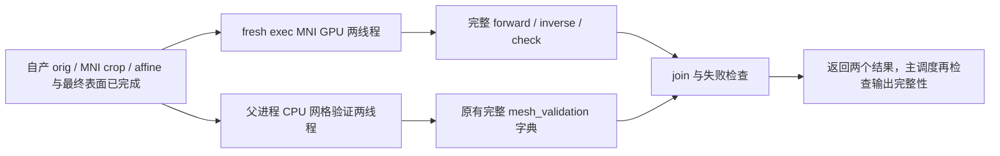
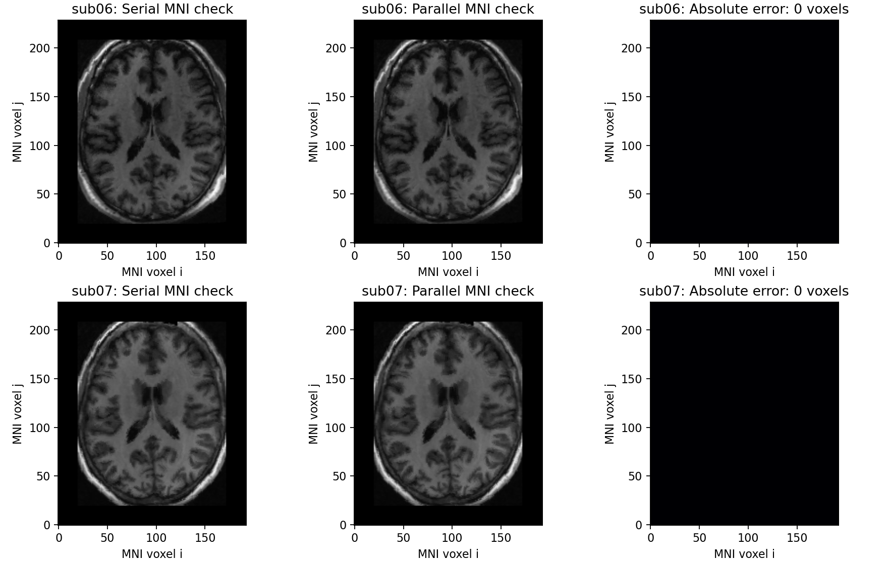

# MNI 非线性与末尾网格验证并行

## 1. 功能简介

`run_mni_and_validate` 复用完整 MNI 非线性 GPU 后处理与当前生产 CPU 网格验证。两项计算读取的文件互不依赖，合并墙钟可以减少；所有必要输出和验证保持。仅在双侧表面、指标和统计阶段全部完成后调用，不在半球目录复制期间启动。



子进程复用已有 `hemisphere_worker`，没有另写通用 worker。CPU 原有有序散射、全网格 Voronoi/soap 迭代与 FP32 deform 精度例外保留，不用形变取负或减迭代替代逆场。

## 2. Python 调用与全部输入输出

```python
from pathlib import Path
from fnit.recon_all.mni_mesh_parallel import run_mni_and_validate

parallel_result = run_mni_and_validate(
    subject=Path("subjects/sub06"),  # 已完成双侧表面与所有目录复制的自产被试目录
    weights=Path("resources/weights"),  # 经 SHA 校验的 SynthMorph deform 权重
    assets=Path("resources/assets"),  # 经 SHA 校验的完整及裁剪 MNI152 模板
    warp_binaries=(  # 兼容原链的三个独立源码构建路径；GPU后端只记哈希，不执行
        Path("resources/native/bin/mri_warp_convert"),
        Path("resources/native/bin/mri_ca_register"),
        Path("resources/native/bin/mri_convert"),
    ),
    report_path=Path("subjects/sub06/scripts/mni-mesh.json"),  # 新JSON，旁边保留worker日志
    device="cuda:1",  # 显式目标GPU；局部作用域处理当前设备可能为CUDA0的情况
    threads=4,  # 总计算线程预算；并行父2、子2
    execution="parallel",  # 并行候选；serial用于完整串行配对诊断
    profile_stages=True,  # 剖析时同步目标GPU；生产默认False
    code_version="frozen-candidate",  # 源码标识；报告同时记录实际源码SHA
)
```

参数：

- `subject`：路径，必须包含 conform `mri/orig.mgz`、MNI目录中的 `invol.crop.nii.gz/aff.lta` 和双侧 `orig/white/pial/sphere.reg` 八个表面。orig 为原有 1 mm conform 网格；crop 保留 scanner RAS；表面为原有 surface RAS/mm 和有序面结构。
- `weights`：路径，包含 `synthmorph.deform.3.h5`。不下载或修改权重。
- `assets`：路径，包含既有 MNI152 cropped/full 1 mm模板。不替换空间或资产。
- `warp_binaries`：三个路径，按转换/逆场/检查图的兼容顺序。只记录 SHA 和 `executed=false`，GPU 后处理不调用这些程序；文件须存在以完成版本记录。
- `report_path`：不存在的新 JSON。创建旁边的 `.request.json/.worker.json/.worker.log`；不覆盖已有报告。
- `device`：显式 `cuda:N`，必填，不静默回退 CPU。子进程保留调用者的可见设备映射。
- `threads`：整数，默认4且至少2。parallel 使父进程取向下整除一半，子进程取余数；serial 两项各用全部预算。现有线程预算会恢复父 Torch/Numba 设置；子进程在导入库前约束 OMP/BLAS/Numba/ITK环境。控制/采样线程另有诊断范围，不据此保证每个库实际活跃线程都恒为预算值。
- `execution`：`parallel` 默认，或用于诊断的 `serial`。不改变 MNI计算与网格检查定义。
- `profile_stages`：默认False；True在测量阶段同步显式目标GPU，计时包含等待。子进程退出前的完成同步始终保留。
- `code_version`：源码版本标签，默认 `FNIT-source-hashes`；不能替代报告中的逐文件 SHA。

返回字典包含 `mni_nonlinear`（原 forward/inverse/check 路径、实际前向精度及分步时间）、`mesh_validation`（原生产字典）、两侧线程预算、执行区间、实际重叠、完整组墙钟及同期显存采样。MNI位移仍是 NIfTI `(X,Y,Z,1,3)` scanner RAS 毫米；检查图为既有完整 MNI网格 uint8。`group_wall_seconds` 包含校验、哈希、fresh exec/import、加载、传输、写出与join；不是原始T1整例时间。

两侧成功并join后才返回 `status="complete"`。mesh质量不通过、子失败或同步失败抛异常；已启动任务保留失败JSON及子日志，只取消本helper新建的进程树。初始参数或文件校验失败发生在任务创建前，不保证已经生成JSON。主调度仍需在返回后执行标准输出清单与整例验收。

## 3. 命令行验证

完整recon-all入口已提供`--mni-execution parallel-late`（默认in-process），在所有半球写出后使用本helper，join后检查138输出；要求显式cuda:N、总threads至少2及caller autocast关闭。单例、批量与benchmark接线通过39项契约，见[接线收据](../../validation/recon_all/optimizations/20261009_mni_execution_integration/README.md)。此helper没有单独生产CLI。可用阶段脚本做相同输入诊断，所有路径显式指定：

```bash
python benchmark/recon_mni_mesh_parallel.py \
  --source-dir frozen/base/src \
  --overlay frozen/candidate \
  --subject checkpoints/sub06/subject \
  --weights resources/weights \
  --assets resources/assets \
  --native-bin resources/native/bin \
  --output runs/sub06-parallel \
  --device cuda:1 --threads 4 --execution parallel \
  --parent-preinitialized \
  --code-version frozen-candidate \
  --reference runs/sub06-serial
```

`--source-dir` 为只读既有包；`--overlay` 只含明确候选模块；`--subject` 为自产带哈希检查点，`--reference` 仅在执行结束后比较，不进入算法。`--output` 为新目录。`--parent-preinitialized` 创建一个真实存活的 4 MiB CUDA张量，验证已有CUDA的Python API；省略时检查冷CLI调用。脚本复制最小前置与八个表面供诊断，副本准备单列外计，两侧组计时含自身读取/哈希/写出。源影像和已有参考保持。

## 4. 原软件与成熟子函数修复

并行调度属于 FNIT 内部步骤，没有独立 FreeSurfer CLI。MNI算法对应 `mri_synthmorph -m deform`、`mri_warp_convert`、`mri_ca_register -invert-and-save` 和 `mri_convert -rt nearest`，原有固定参数见 [MNI非线性页](MNI_NONLINEAR_CHAIN.md)及[GPU后处理页](MNI_WARP_GPU.md)。CPU网格验证复用当前 FNIT `_validate_meshes`，不编造官方同名命令。

本轮特别修复已有 GPU 子函数 `fill_inverse_fields`：`torch.as_tensor(..., device="cuda:1")` 只决定张量存储，Triton launch 仍使用当前设备/stream。当前CUDA0、张量CUDA1时原函数报 `Pointer argument ... cannot be accessed`。修复仅将输入校验后的 CUDA分配、expand/soap launch 和下载放入 `with torch.cuda.device(selected)`；正常与异常退出都恢复原设备，公式、控制点阈值、迭代与停止条件、返回数组及统计不变。helper也为整个成熟MNI调用使用同样局部作用域，不采用全局set_device。父TF32/allocator策略不修改。

## 5. 最新真实精度、耗时与显存

本轮公开 ds000114 sub06/sub07 的自产输入来自冻结 `803aec50` 原始T1链，候选文件以逐文件SHA绑定。相同A100 GPU1、CPU四核亲和性和总四计算线程，执行串行→并行→并行→串行。GPU计时同步，阶段包含模型加载、哈希、传输、worker导入、读写和退出；未将fixture复制或检查图绘制计入算法组。完整报告与脑图见本轮机器记录。

| 被试 | 串行中位，秒 | 并行中位，秒 | 组加速 | 墙钟减少 |
| --- | ---: | ---: | ---: | ---: |
| sub06 | 160.421 | 94.287 | 1.701× | 41.23% |
| sub07 | 142.240 | 72.892 | 1.951× | 48.75% |

两例完整两阶段共8次执行均完成；6个对照（3个正式输出各一次）均体素/最大/P99差为0，affine、shape、dtype、NIfTI头和文件SHA相同，完整现有mesh_validation字典相同。两例公共完整逆场API：旧current1与新current0均在同一GPU1，输出SHA及迭代统计相同。两例冷CLI完整组98.857/97.674秒，输出同样0差异，父CUDA保持未初始化。5项helper合同和2项双GPU正常/异常恢复合同通过。

完整 [JSON/CSV与失败记录](../../validation/recon_all/optimizations/20261009_mni_mesh_parallel/README.md)绑定实际输入、资产、程序及源码；所有ABBA调用保留，不根据共享负载漂移筛选结果。性能仅属于这个MNI+网格组，尚未执行接线后的原始T1空目录整例，也没有新的官方运行。已有官方对照仍单独见MNI GPU旧版专项及803原始T1整例报告。



图为完整MNI目标网格的轴向体素切片；零差异面板不代替表格中的全域比较。父子进程显存若因host/container PID映射不可解析则为null；整卡上界包括其他任务。缓存关闭时allocated/reserved不可用，不记为零，不声称同期20 GB预算已验证。

## 6. 最近版本与benchmark

- v1：生命周期测试通过；真实启动因环境无GNU time而退出127，尚未运行算法。改用标准库冷进程计时，旧失败保留。
- v2：真实串行MNI目标设备不匹配，54.664秒退出1；这不是OOM。原日志保留，不改标完成。
- v3：局部设备作用域修复；helper5项、双GPU正常/异常恢复2项合同通过，真实两例配对另列。
- v4/v5：分别用于同前向场公共完整逆场API对照和未初始化父CUDA的冷CLI验证，单列证据范围。

本轮阶段验证不替代原始T1空目录端到端提速；765c0fe9已提供显式接线且保持默认in-process。该提交wheel构建、独立目标安装和CLI已通过，见[安装收据](../../validation/recon_all/optimizations/20261009_mni_execution_integration/package/package_report.json)；现有Conda安装验证不能算物理隔离或安装产物MRI整例验收。现有模型FP32例外、CPU有序散射与整体指标验收保持。

## 7. 原代码与参考文献

- [FNIT helper源码](../../src/fnit/recon_all/mni_mesh_parallel.py)、[公共逆场函数](../../src/fnit/recon_all/mni_warp_inverse.py)。
- [FreeSurfer 固定源码 mri_ca_register](https://github.com/freesurfer/freesurfer/blob/d932c45b7941662ea380a05efef580568b98d41a/mri_ca_register/mri_ca_register.cpp)。生产使用FNIT GPU后处理，不读取官方输出。
- Hoffmann M, et al. SynthMorph. *IEEE Transactions on Medical Imaging*. 2022;41:543–558. [doi:10.1109/TMI.2021.3116879](https://doi.org/10.1109/TMI.2021.3116879)。
