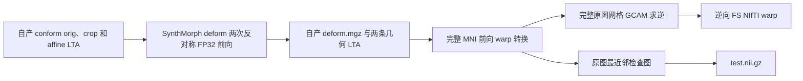

# MNI152 非线性变换和检查图

[返回 recon-all](README.md) · [真实 T1 配对结果](../../validation/recon_all/python_gpu_port/mni_nonlinear_real_20260929.json)

标准单 T1 流程先以 PyTorch SynthMorph affine 生成个体 `aff.lta`，再用 PyTorch 的 deform 模型优化同一裁剪 T1 到 MNI152 的非线性变换。这里只需模型产生的变换，已跳过没有后续消费者的 `moved` 和 `fixed_moved` 两张重采样图。当前CUDA recon-all显式使用 `postprocess_backend="gpu"`，调用FNIT已有的完整转换、求逆与检查图算子；CPU recon-all和独立函数的兼容默认值仍为 `conda`。Conda路径使用固定FreeSurfer源码独立编译的 `mri_warp_convert`、`mri_ca_register` 和 `mri_convert`，不调用系统安装程序。最新参数与真实验证范围见 [GPU 后处理说明](MNI_WARP_GPU.md)和[两例原始T1整例结果](../../validation/recon_all/optimizations/20261002_parallel/FINAL_RESULTS.md)。



`run_mni_nonlinear_chain(...)` 的参数如下。`subject_dir` 指向已含 `mri/orig.mgz`、`mri/transforms/synthmorph.1.0mm.1.0mm/invol.crop.nii.gz` 与 `aff.lta` 的被试目录；前者是 1 mm conform 网格，裁剪 NIfTI 保留其 scanner RAS。`weights_dir` 必须有经大小和 SHA-256 校验的 `synthmorph.deform.3.h5`；`assets_dir` 必须有同一固定 MNI152 版本的裁剪及完整 1 mm 模板。`warp_convert`、`ca_register`、`mri_convert` 分别是当前 Conda 环境中这三个源码构建程序的绝对路径。`device` 指定 PyTorch 设备，独立函数默认 `cpu`；recon-all 调度随主流程选择 CUDA 或 CPU。CUDA 的非线性模型使用经过两例同输入验证的 FP32 例外，返回时恢复调用方 TF32 设置；`threads` 指定 CPU 线程数，默认 4。`postprocess_backend` 默认 `conda`，此时需设置本人有效的 `FS_LICENSE` 路径；`gpu` 要求显式 CUDA 设备，三个原生路径参数保留调用兼容但不消费。`chunk_slices` 默认 16，为 GPU 转换与检查图的 X 方向正整数分块大小，不改变求逆网格、迭代或停止规则。

```python
from fnit.recon_all.mni_nonlinear_chain import run_mni_nonlinear_chain

nonlinear_outputs = run_mni_nonlinear_chain(
    subject_dir="/data/subjects/sub01",  # 已生成 orig、裁剪 T1 和 affine LTA 的被试目录
    weights_dir="/data/fnit-weights",  # 已校验的 SynthMorph deform 权重目录
    assets_dir="/data/fnit-assets",  # 已校验的裁剪及完整 MNI152 模板目录
    warp_convert="/data/conda/envs/fnit/bin/mri_warp_convert",  # 位移到 FS warp
    ca_register="/data/conda/envs/fnit/bin/mri_ca_register",  # 求逆变换
    mri_convert="/data/conda/envs/fnit/bin/mri_convert",  # 生成最近邻检查图
    device="cuda:0",  # GPU 模型使用 FP32 例外；无 GPU 时为 cpu
    threads=4,  # CPU 算子线程数
    postprocess_backend="gpu",  # 与当前CUDA recon-all相同；独立API省略时仍默认conda
    chunk_slices=16,  # GPU 转换和检查图的 X 轴分块大小
)
print(nonlinear_outputs["forward"])  # 目标 MNI152 网格上的前向变换绝对路径
```

返回字典还含 `inverse`、`check`、`model`、`device`、`precision`（CUDA FP32 例外及未启用半精度）和四个子步骤的 `timings_seconds`，另有 `postprocess_backend` 及 GPU `postprocess` 分步报告。三个正式输出分别位于被试的 `mri/transforms/synthmorph.1.0mm.1.0mm/`：前向 `warp.to.mni152.1.0mm.1.0mm.nii.gz` 的结构为 `(193,229,193,1,3)`，逆向同名加 `.inv` 的结构为 `(256,256,256,1,3)`；两者为 NIfTI 位移向量，intent 1006，单位为 mm。`test.nii.gz` 是完整 MNI152 的 `(193,229,193)` uint8 最近邻检查图。`tmp/deform.mgz` 及两个 LTA 是中间文件。输入缺失、程序失败或网格不符时抛出异常，主流程在运行 JSON 中记录失败阶段。

对应官方 8.2 链的主要命令依次是 `mri_synthmorph -m deform -i aff.lta -t deform.mgz invol.crop.nii.gz mni152.1.0mm.cropped.nii.gz`、`mri_warp_convert --inras deform.mgz --insrcgeom invol.crop.nii.gz --outfswarp warp.to.mni152.1.0mm.1.0mm.nii.gz --vg-thresh 1e-4 --lta1-inv reg.crop-to-invol.lta --lta2 reg.1.0mm.cropped.to.1.0mm.lta`、`mri_ca_register -invert-and-save 前向变换 逆向变换`、`mri_convert -rt nearest orig.mgz -at 前向变换 test.nii.gz`。FNIT 用 nibabel 几何生成两个等价的 LTA，避免让这一阶段依赖系统安装的模板目录。[固定版本的 mri_synthmorph](https://github.com/freesurfer/freesurfer/blob/d932c45b7941662ea380a05efef580568b98d41a/mri_synthmorph/mri_synthmorph)、[mri_warp_convert](https://github.com/freesurfer/freesurfer/blob/d932c45b7941662ea380a05efef580568b98d41a/mri_warp_convert/mri_warp_convert.cpp)可查阅。

去标识真实 `sub-01` 的阶段原型在 CPU 上完成 PyTorch deform 推理用时 91.50 s；相同官方存档与 FNIT 输出的前向位移相关性超过 0.9999999999999、平均绝对差 0.0000084 mm。逆向位移相关性超过 0.9999999999、最大局部差 0.233 mm；检查图非零区域相关性 0.9999973，有 127 个不同体素。详细值见[机器记录](../../validation/recon_all/python_gpu_port/mni_nonlinear_real_20260929.json)。该阶段结果是同一真实 T1 的阶段比较，不能替代全流程 138 项验收。

2026-09-30 的两例新连续链输入对照显示：跳过未使用的重采样图后，前向 warp、逆向 warp 和检查图的 **SHA-256 均与原 CPU 阶段完全相同**。`sub-02` 同在 headcw 上用时 282.33→253.95 秒；`sub-01` 同在 gpucw1 上用时 339.99→343.26 秒，共享负载使单次时间不能证明稳定提速。配对分解显示耗时还集中在 deform 模型和原生 warp 求逆。[逐例机器报告](../../validation/recon_all/python_gpu_port/performance_20260930/README.md)保留模型、转换、求逆及检查图秒数。

TF32 CUDA 的正向/逆向 warp 相对 CPU 的 P99 差为 0.075/1.108 mm，检查图相差 220,314 个体素，父子进程采样峰值 20,308,819,968 字节。本阶段采用 FP32 CUDA：两例正向/逆向 P99 差均为约 0.000015/0.000031 mm，最大逆向差分别为 0.000473/0.000183 mm；最近邻检查图分别相差 19/17 个体素。这些差异全部保留在严格复现诊断中，不能以文件不一致单独否定 GPU 路径。

CUDA FP32 的第一例独立链用时 161.73 秒，CPU 为 339.99 秒，进程采样峰值约 13.00 GB；这份试验包含原先的两张未使用重采样图。当前封装还会跳过它们，并在原生 warp 转换前释放模型引用；其阶段与整例实测另见[当前性能报告](../../validation/recon_all/python_gpu_port/performance_20260930/README.md)。

三个 MNI 非线性输出属于固定输出范围，后续 white/pial 依赖的是另一条 affine/辅助分割链；其实际调用关系见 `native_free.py`、`mni_aux_chain.py` 和 `aux_seg.py`。完整运行仍单列分区 Dice、双向表面距离和脑区指标，整体指标等效在尚无正式门槛时保持未判定。当前尚未定位全部与官方的历史局部位移差，不能将这些差异一概归因于随机性。

参考文献：Hoffmann M, et al. SynthMorph: learning contrast-invariant registration without acquired images. *IEEE Trans Med Imaging*. 2022;41:543–558. [doi:10.1109/TMI.2021.3116879](https://doi.org/10.1109/TMI.2021.3116879)。

串行候选省去未消费的网络逆向积分/合成，反对称velocity两次前向及原生数值求逆保留。两例固定自产输入的forward、inverse、check与旧GPU路径SHA-256完全相同；阶段136.720→123.601秒、121.549→129.343秒，尚未证明稳定整阶段加速。实际前向与复现见[串行说明](SERIAL_OPTIMIZATION.md)。

2026-10-02 新增GPU后处理并接入CUDA recon-all；成熟散射最后半体素的native rint兼容修复、向量编码和scanner RAS校验详见 [专项说明](MNI_WARP_GPU.md)。本页上述历史性能与精度记录仍绑定各自原版本；当前同输入阶段见 [task_05 报告](../../validation/recon_all/optimizations/20261002_parallel/task_05/README.md)，当前整例见 [五任务结果](../../validation/recon_all/optimizations/20261002_parallel/FINAL_RESULTS.md)。

最新 GPU 后处理的两例、两轮完整自产 MNI 阶段实测为 36.173–38.675 秒，新运行 Conda 对照为 122.813–130.526 秒，四个配对加速 3.247×–3.608×，直接输出比较数值零差异；过程采样峰值 13.103 GB。完整分步、缓存范围及整例验收边界见上述 task_05 报告。

运行源码 `8d750e2` 的原始T1整例中，完整MNI阶段sub01为126.497→46.024秒，sub02为129.062→58.258秒。该时间包含模型加载、传输和读写，不能与冻结输入阶段的秒数互换。sub01与基线的三个正式输出体素、dtype和空间矩阵相同，NIfTI生产者描述、四元数负零和scalar图未使用的 `pixdim[4]` 仍在严格文件诊断中报告；没有伪造FreeSurfer描述以提高文件通过数。两例最终比较详情见五任务结果。
