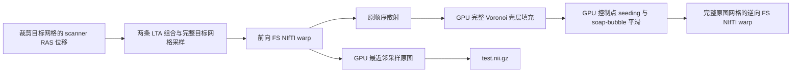

# MNI warp 的 GPU 后处理

## 功能与流程

从 FNIT 自产 SynthMorph `deform.mgz` 生成完整 MNI152 网格的前向位移、完整原图网格的逆向位移和最近邻检查图。SynthMorph 的反对称两次网络前向与已有 FP32 例外不变。本接口不调用脑影像软件命令，不读取官方结果。



求逆保留 GCAM 的定义：按 z/y/x 顺序把每个目标节点投到原图八个邻点，用 FP32 累加；累计权重达到 0.1 的节点为控制点。控制点坐标按权重归一化，其余节点逐层填满。随后保留原半径 2 的控制点 seeding、半径 1 的平滑、逐轮扩张范围，以及最多 50 轮、最大改变小于 1 体素的停止规则。三个分量分别停止。散射仍复用成熟 Numba，GPU 邻域核逐项累加；不使用原子累加、负位移近似或固定点替代。

## Python 调用和输入输出

```python
from fnit.recon_all.mni_warp_postprocess import run_mni_warp_postprocess

warp_outputs = run_mni_warp_postprocess(
    ras_warp="/data/sub01/mri/transforms/synthmorph.1.0mm.1.0mm/tmp/deform.mgz",  # 自产变换
    cropped_source="/data/sub01/mri/transforms/synthmorph.1.0mm.1.0mm/invol.crop.nii.gz",  # 裁剪个体 T1
    original="/data/sub01/mri/orig.mgz",  # 完整 conform 个体 T1
    full_target="/data/assets/average/mni_icbm152_nlin_asym_09c/reg-targets/mni152.1.0mm.nii.gz",  # 完整 MNI 网格
    crop_to_original_lta="/data/sub01/mri/transforms/synthmorph.1.0mm.1.0mm/tmp/reg.crop-to-invol.lta",  # crop source → 原图
    crop_to_full_lta="/data/sub01/mri/transforms/synthmorph.1.0mm.1.0mm/tmp/reg.crop-to-full.lta",  # crop target → 完整 MNI
    output_dir="/data/sub01/mni_gpu_postprocess",  # 新目录；已有目录时报错
    device="cuda:0",  # 显式逻辑 GPU；进程启动前绑定物理 UUID
    chunk_slices=16,  # X 轴分块大小；正整数
)
print(warp_outputs["forward"])  # 完整目标网格上的 pull 位移路径
```

输入及参数说明：

| 参数 | 输入格式与约定 | 默认值或限制 |
| --- | --- | --- |
| `ras_warp` | `(crop_target_X,crop_target_Y,crop_target_Z,3)` FP32 MGZ；目标到源的 scanner RAS 毫米位移 | 必填；三个通道顺序为 R/A/S |
| `cropped_source` | 3D 裁剪个体 T1 NIfTI；与 warp 声明的源空间相符 | 必填；无 shear |
| `original` | 3D conform 个体 T1，保持原 dtype | 必填；当前逆场 writer 限定源网格 256³、负方向行列式及 native y quaternion 分支 |
| `full_target` | 3D 完整 MNI152 模板；只用几何，不用灰度提高配准质量 | 必填；当前固定模板为 193×229×193、1 mm |
| `crop_to_original_lta` | 完整几何 LTA，crop source→original | 必填；type 0 voxel 或 type 1 world |
| `crop_to_full_lta` | 完整几何 LTA，crop target→full target | 必填；type 0 或 1 |
| `output_dir` | 输出目录路径 | 必填；不得已存在 |
| `device` | PyTorch 逻辑 CUDA 设备 | `cuda:0`；无 GPU/初始化/计算失败抛异常 |
| `chunk_slices` | 前向转换与检查图的 X 分块大小 | `16`；必须为正整数；不改变求逆范围或迭代 |

返回字典包含 `forward`、`inverse`、`check` 路径，`conversion`、`inverse_report`、`check_report` 分步秒数。三个正式文件分别为：

- `warp.to.mni152.1.0mm.1.0mm.nii.gz`：完整目标网格 `(193,229,193,1,3)`，FP32；每个目标体素指向原图的 RAS 位移，单位 mm。
- `warp.to.mni152.1.0mm.1.0mm.inv.nii.gz`：完整原图网格 `(256,256,256,1,3)`，FP32；每个原图体素指向 MNI 的 RAS 位移，单位 mm。
- `test.nii.gz`：完整目标网格，原图 dtype 的最近邻检查图；conform `orig.mgz` 输入时为 uint8。

两个 warp 使用 NIfTI displacement-vector intent，并带 FS ecode 14 的 source/target 几何、位移解释、节点间距及零标签扩展；逆场交换 source/target。NIfTI source 几何沿用原生 sform 列归一化和普通 FP32 `MatrixMultiply` 的中心累加顺序，再恢复 voxel-to-RAS 矩阵。转换采样范围为 crop 网格 `[0,size)`，最后一个单元内复制最后邻点，真正越界时把**绝对源体素坐标**置零，随后转换为位移。检查图在双精度上执行 native `nint`（半整数远离零）；先按 `rint` 检查边界，再夹到合法体素索引，保留 `GCAMmorphToAtlas` 的源坐标域检查，真正越界填零。坐标先提升为双精度再加 0.5，避免 FP32 加法把邻近半整数的值提前舍入。输入必须是单向量帧 `(X,Y,Z,1,3)`、NIfTI intent 1006、FS `DISP_RAS` 编码且 spacing=1；其他编码不会被当成毫米位移。检查图还要求原图 scanner RAS affine 与 source 几何在 1e-4 容差内相符，不能只比较 shape。MGZ 大端多字节数据转成本机字节序后传入 Torch，保留 nibabel 已应用的 scale/intercept 和输出 dtype。缺失文件、非有限值、空控制点、不支持的扩展/几何或运行失败均明确报错，不静默回退 CPU。

现有 `run_mni_nonlinear_chain` 新增 `postprocess_backend="conda" | "gpu"` 和 `chunk_slices=16`。默认保留 Conda 路径；GPU 选项调用上述三个算子。模型、文件名、原有计时键和其余参数保持兼容。调度由任务 1/协调者接入，本任务不修改 `native_free.py`、batch 或全局精度策略。

## 命令行

```bash
python -m fnit.recon_all.mni_warp_postprocess \
  --ras-warp /data/sub01/tmp/deform.mgz \
  --cropped-source /data/sub01/invol.crop.nii.gz \
  --original /data/sub01/orig.mgz \
  --full-target /data/templates/mni152.1.0mm.nii.gz \
  --crop-to-original-lta /data/sub01/tmp/reg.crop-to-invol.lta \
  --crop-to-full-lta /data/sub01/tmp/reg.crop-to-full.lta \
  --output-dir /data/sub01/mni_gpu_postprocess \
  --device cuda:0 \
  --chunk-slices 16
```

全部具名选项与 Python 同名参数相对应。入口只做后处理，不生成模型变换；完整阶段仍用 `run_mni_nonlinear_chain`。PyTorch 2.5.1、Triton 3.1.0、Numba、nibabel 已在项目主页 Conda 环境中，无额外构建或依赖。

## 原软件调用与算法来源

对应固定源码程序的隔离参考命令：

```bash
mri_warp_convert --inras deform.mgz --insrcgeom invol.crop.nii.gz \
  --outfswarp forward.nii.gz --vg-thresh 1e-4 \
  --lta1-inv reg.crop-to-invol.lta --lta2 reg.crop-to-full.lta
mri_ca_register -invert-and-save forward.nii.gz inverse.nii.gz
mri_convert -rt nearest orig.mgz -at forward.nii.gz test.nii.gz
```

`GCAMinvert`、`MRIbuildVoronoiDiagram`、`MRIsoapBubble` 是内部步骤，没有独立官方 CLI。对应 [mri_warp_convert](https://github.com/freesurfer/freesurfer/blob/d932c45b7941662ea380a05efef580568b98d41a/mri_warp_convert/mri_warp_convert.cpp)、[GCAM](https://github.com/freesurfer/freesurfer/blob/d932c45b7941662ea380a05efef580568b98d41a/utils/gcamorph.cpp)、[warpfield](https://github.com/freesurfer/freesurfer/blob/d932c45b7941662ea380a05efef580568b98d41a/utils/warpfield.cpp)；固定提交 `d932c45b7941662ea380a05efef580568b98d41a`。只参照算法定义，未复制上游源码到交付文件。

外置权重/模板继续走项目现有 manifest、来源和许可路线。安装前核查固定 Release 清单；无法确认再分发权的模板仍用项目原作者来源。专项报告只保存哈希与数值，不发布影像、模板、权重或许可证。

## 成熟子函数的兼容修复

本轮核对固定源码后修正 `ca_register_inverse.py` 的最后半个体素边界：原实现过早夹到 `size-1`，漏掉 `MRIindexNotInVolume` 的 `rint` 拒绝步骤；原生只在坐标达到 `size` 后夹取。修复 counts 和三个坐标 sums 的相同判断，保留公共接口和有序累加。专项单元测试涵盖最后半体素、半整数奇偶边界及真正越界后的夹取；真实两例上新旧散射的差异另记于报告。该文件是本任务唯一必要的既有逆场兼容修改。

## 当前版本、真实 benchmark 与验证

最新专项证据见 [任务 5 报告](../../validation/recon_all/optimizations/20261002_parallel/task_05/README.md)。必须先通过同输入回归再接入生产；这份接口不把旧 188–196 秒总阶段估计改标为新结果。两个完整原始 T1 整例与 138 项严格诊断由协调者执行。

版本记录：2026-10-02 增加独立 GPU 后处理候选；之前版本继续使用固定源码 Conda 转换/求逆/检查图，其真实阶段记录见 [现有 MNI 链说明](MNI_NONLINEAR_CHAIN.md)。候选严格复现、新增退化、整体指标等效分别报告，整体无正式阈值时为 `not_assessed`。

参考文献：Hoffmann M, et al. SynthMorph: learning contrast-invariant registration without acquired images. *IEEE Transactions on Medical Imaging*. 2022;41:543–558. [DOI](https://doi.org/10.1109/TMI.2021.3116879)；[FreeSurfer 源码库](https://github.com/freesurfer/freesurfer)。
