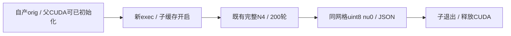

# 完整 N4 的缓存隔离执行

## 1．功能与范围

`run_isolated_n4()` 在新exec进程中复用现有 `n4_itk_torch_experimental.correct_volume()`。固定算法、200轮、重建和uint8写出保持相同，仅子进程开启CUDA分配缓存，退出后释放其CUDA上下文。父进程分配器/TF32和当前recon-all默认不改。



本轮真实cache-off输入链的Torch N4需要76.9–91.1s，既有缓存开启冻结算法仅数秒，因此优先验证局部执行策略。没有用新近似、更少轮次、半精度或全局缓存开关换速度。

## 2．Python输入、输出与参数

```python
from fnit.recon_all.n4_torch_worker import run_isolated_n4

report = run_isolated_n4(
    input_path="subject/mri/orig.mgz",  # 自产3D非负原网格T1，不是官方参考
    output_path="diagnostic/nu0.mgz",  # 新路径，同网格uint8，不重采样
    report_path="diagnostic/n4-worker.json",  # 新JSON路径，与输入/输出不同
    device="cuda:0",  # 必须显式逻辑GPU；保留CUDA_VISIBLE_DEVICES映射
    threads=4,  # 新子进程Torch/OpenMP/BLAS预算，默认4
    profile=False,  # 默认False，True同步N4子段计时
    code_version="frozen-code-label",  # 标签；报告另有实际源码SHA作为依据
)
```

输入由nibabel读取NIfTI/MGH，三维FP32解析、非负、每轴≥8；固定recipe限定见[完整N4](N4_COMPLETE_TORCH_20261009.md)。输出 `(X,Y,Z)` uint8、原affine/mm和体素尺寸；MGH输入保持MGH类，NIfTI保持其类。两个输出须不存在，三路径不同。`device`必填且为cuda:N，不回退CPU；`threads`正整数默认4；`profile`默认False；`code_version`默认FNIT-source-hashes，不代替哈希。

返回`api`含200轮/shape/dtype/同步总时间，`input_sha256/output_sha256/source_sha256`、实际`cuda_allocator/precision/threads`、worker PID与GPU、`allocated_peak_bytes/reserved_peak_bytes`，以及父API新增的 `parent_cuda_initialized_before_exec/isolated_cli_wall_seconds/isolation`。完整外部墙钟含exec、导入、哈希、校验、初始化、加载、传输、计算、压缩写出及子退出。父GPU张量仍保留；子张量峰值不等于父子同期占用。

`run_worker()` 是新进程CLI内部入口，默认cuda:0、4线程、不开剖析，matmul/cudnn TF32默认True；父API传入父进程实际策略。CUDA已初始化时拒绝更改分配器。无FP16/BF16，算法既有FP64拟合/归约与FFT例外保留。非法资源/路径、CUDA、完整N4、exec失败或哈希错误抛异常，可能留部分输出；不改默认、不复制参考、不调用原生命令。

## 3．命令行与复现

```bash
python -m fnit.recon_all.n4_torch_worker \
  --input subject/mri/orig.mgz \
  --output diagnostic/nu0.mgz \
  --report diagnostic/n4-worker.json \
  --device cuda:0 \
  --threads 4 \
  --matmul-tf32 1 \
  --cudnn-tf32 1 \
  --code-version frozen-code-label
```

两项TF32参数只接受0/1，默认1；`--profile`可选；其余同Python。CLI是独立新进程，缓存只在该进程开启。主页Conda已声明全部依赖，未新增生产包。

`benchmark_input_n4_worker.py` 接受 `--raw-pair` 完成的原始链报告/输出、`--output`新目录、`--source-root`当前冻结源码、`--previous-source`原始链冻结源码、`--profiling-module`固定采样器、`--device cuda:0 --threads 4`。先冷CLI两例（父CUDA未初始化），再已初始化父API两例；父保留该例真实orig的64MiB FP32 GPU张量，不用模拟影像当benchmark。先证明两条原始链的orig数据/几何相同，再做缓存策略同输入对照。参考只用于输出完成后的比较。

## 4．对应原实现

固定ITK5.4.7 N4与recon-all包装器见[ITK Conda实现](N4_ITK_CONDA.md)。本接口只执行完整N4到nu0，后续全局缩放/Talairach直方图由 `make_nu()` 完成；不能把nu0和nu混称。原软件参考命令是固定参数 `N4BiasFieldCorrection`，本新exec接口属于执行策略，没有另外的原软件CLI。

## 5．两例真实数据的精度、耗时与资源

A100-SXM4-80GB，同一CPU0–3/4线程，TF32开启，无半精度。输入来自[两例原始T1→nu](INPUT_N4_CHAIN.md)各自产orig，逐SHA核验；不是原始空目录整例。

| 病例 / 调用方式 | 含exec/退出完整墙钟，s | 子完整N4文件API，s | 迭代 | 对cache-off完整实现新增体素差 |
|---|---:|---:|---:|---:|
| sub-06 冷CLI | 11.037 | 5.106 | 200 | 0 |
| sub-07 冷CLI | 9.978 | 4.317 | 200 | 0 |
| sub-06 已初始化父API | 10.749 | 4.291 | 200 | 0 |
| sub-07 已初始化父API | 11.041 | 4.589 | 200 | 0 |

四组nu0所有体素、affine、shape、dtype均保持。相对同输入native仍为4016/3259体素全+1，严格复现未过；没有把已有偏移掩盖或称整体等效。初始化父API的完整N4阶段分别由91.105→10.749s、76.874→11.041s，观察缩短88.2%/85.6%；这里仅算固定输入N4，不能据此从历史recon-all时间相减宣称整例提速。

每例/方式各一次，固定线程预算下的观察不是重复吞吐门；`profile=False`内部子段未逐次同步，不单独声称kernel加速。新的exec完整边界包含导入和退出，直接API阶段含加载、传输与写出。

子峰allocated/reserved四组同为1,295,297,024/1,384,120,320字节。0.5秒同期采样实际最大间隔3.380s，观测目标卡峰3,021,996,032字节、所有计算进程上界3,001,024,512字节；查询时刻不同且含共享负载。容器/驱动PID归属未解决，父子树峰值null，不能写0，也不保证捕获连续瞬时峰。没有隔离干净环境或完整recon-all指标等效结论。

[完整机器报告](../../validation/recon_all/optimizations/20261009_n4_torch_substages/reports/input_chain_a100_20261009_v2/cached_worker/summary.json)保留四组子收据、两例输入/output SHA、200次迭代、实际精度/线程及采样序列。[源码manifest](../../validation/recon_all/optimizations/20261009_n4_torch_substages/reports/input_chain_a100_20261009_v2/source/worker_v2_patch_manifest.json)与docstring-only AST桥接绑定实际v2，不把旧冻结v1覆盖。[报告索引及导出校验](../../validation/recon_all/optimizations/20261009_n4_torch_substages/reports/input_chain_a100_20261009_v2/README.md)记录26份白名单收据原件/公开SHA；没有影像、权重、许可证或服务器地址。

## 6．更新和验证记录

2026-10-09复用完整N4新增exec策略；不改原核心数学或全局allocator。六项worker契约检查参数/父策略/exec/输出哈希/初始化状态，与四条原始输入链契约合计十项2.91s通过。两例两种父CUDA状态同输入回归完成，已有严格N4差异独立记录。当前为可显式调用阶段，尚未把cached worker接入生产默认或再次运行该策略的原始T1整例。

## 7．参考文献和源码

Tustison等，N4ITK，IEEE TMI，2010。[DOI](https://doi.org/10.1109/TMI.2010.2046908)。[固定ITK源码](https://github.com/InsightSoftwareConsortium/ITK/blob/v5.4.7/Modules/Filtering/BiasCorrection/include/itkN4BiasFieldCorrectionImageFilter.hxx)。FNIT完整数学实现与数值限制见[完整N4](N4_COMPLETE_TORCH_20261009.md)，执行策略复用项目既有GCA/WM新exec与同期采样方案，无额外原软件代码复制。
