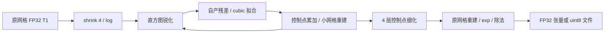
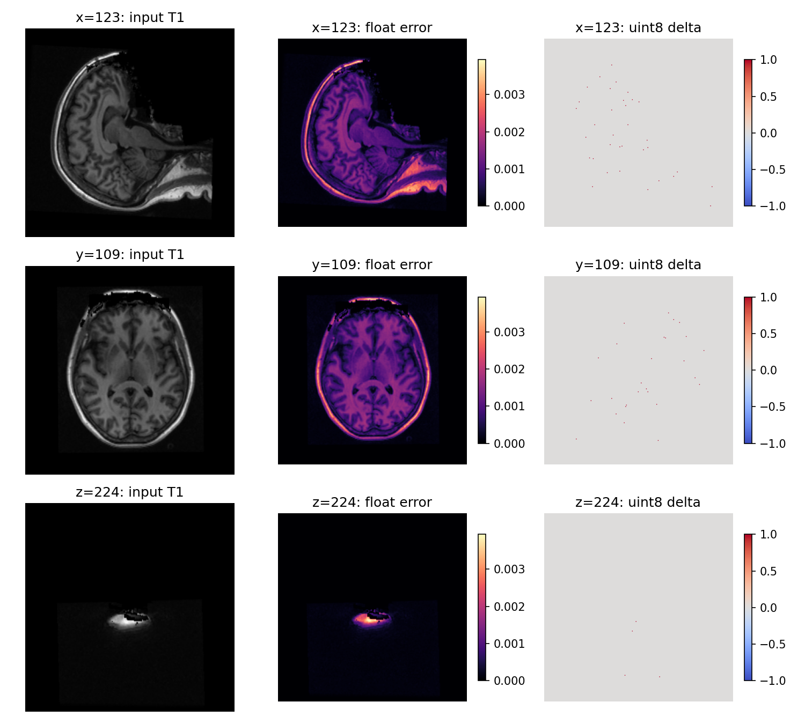
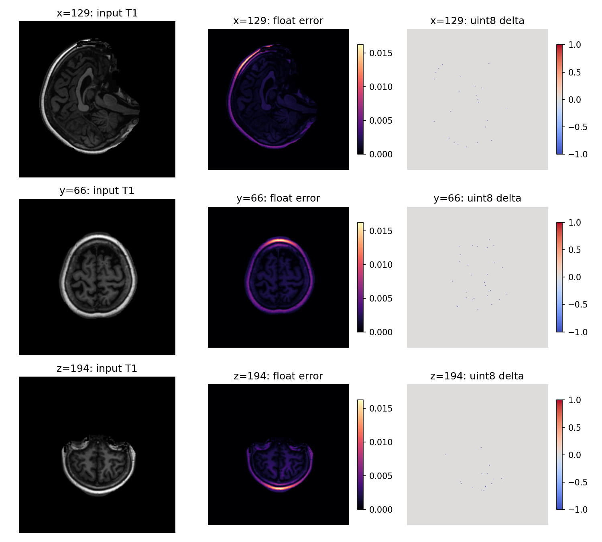

# 完整 N4 Torch 实验后端与真实输入验证

## 1．功能和支持范围

`n4_itk_torch_experimental.correct_tensor()` 用 PyTorch 完成固定 recon-all N4 配方：shrink=4、全 1 掩膜、200-bin triangular histogram、Wiener sharpening、三阶 B-spline 拟合、四层各最多 50 次反馈、控制点细化和原网格重建。它读取每轮自产的残差，完成了本例的全部 200 次迭代，没有使用模糊残差近似，也不调用原生程序或读取参考结果。

**这是实验后端，生产默认没有改变。** 控制点和直方图归约、FFT、log/exp 等浮点计算与 ITK 串行实现存在差异。两例真实输入仍有方向一致的强度偏差：一例偏低，另一例偏高，尚不能判定整体指标等效。该结果不能作为 recon-all 已全部改写为 GPU 或整例达到十分钟的证据。



当前支持三维、非负有限值、每轴至少 8 个体素、开放 cubic 参数域、零起始索引、全 1 掩膜、无 confidence。图像数据按 `(x,y,z)` 排列，spacing 单位为 mm。参数域使用单位方向，体素校正不重采样影像；文件接口保留输入 affine、空间和头信息。暂不提供其他掩膜、非零收敛阈值、任意迭代配方或任意阶次。N4 不需要模型权重或图谱。

## 2．Python 调用、输入和输出

```python
import nibabel as nib
import numpy as np
import torch
from fnit.recon_all.n4_itk_torch_experimental import correct_tensor

input_image = nib.load("subject/mri/orig.mgz")  # FNIT 自产 conformed T1；不能读取官方参考作为生产输入
input_array = np.asarray(input_image.dataobj, dtype=np.float32)  # 三维 xyz，非负强度
input_tensor = torch.from_numpy(input_array.copy()).to("cuda:0")  # 显式选择目标 GPU，使用 FP32
result = correct_tensor(
    image=input_tensor,  # 原网格 FP32 张量，输出仍处于该网格
    spacing=input_image.header.get_zooms()[:3],  # 各轴体素尺寸，单位 mm
    profile=True,  # 对 CUDA 子段同步计时；测量时开启，日常调用可关闭
    callback=None,  # 可选回调接收 level、iteration、自产 residual 和 phi；默认不导出
)
corrected_tensor = result.corrected  # FP32 xyz，校正后的原网格强度
log_bias_tensor = result.log_bias_field  # FP32 xyz，原网格的 log bias field
control_lattice = result.lattice  # FP32 xyz，固定配方完成后的 11×11×11 参数网格
```

| 参数 | 类型、默认值与作用 |
|---|---|
| `image` | 必填三维 FP32 Tensor；CPU 或明确的 CUDA 设备，有限、非负，各轴至少 8 |
| `spacing` | 三个正有限浮点数；默认 `(1,1,1)`，单位 mm |
| `profile` | bool，默认 False；True 在子段前后同步 CUDA，用于剖析 |
| `callback` | 可调用对象或 None，默认 None；每次拟合后接收 `(level, iteration, residual, phi)`，张量仍在目标设备；回调不能修改算法输入 |

`N4TorchResult` 返回 `corrected`、`log_bias_field`、`lattice`、整数 `iteration_count`、每轮收敛值 `convergence` 列表及 `timings` 字典。强度与输入使用相同无量纲尺度，bias 是 log intensity。结束时同步目标设备以记录完整张量墙钟；收敛决策本身也需读取标量。非有限值、负值、错误维度、错误 spacing 或非有限收敛值会抛异常；没有近似替代、参考复制或 OOM 后的隐式 CPU 回退。

文件接口如下。两例真实 MGZ 的已初始化 CUDA API 和冷 CLI 已完成回归；NIfTI 文件路径尚未单独实测。

```python
from fnit.recon_all.n4_itk_torch_experimental import correct_volume

report = correct_volume(
    input_path="subject/mri/orig.mgz",  # 三维 NIfTI、MGH 或 MGZ，FNIT 自产输入
    output_path="diagnostic/nu_torch.mgz",  # 调用者明确指定的原网格 uint8 输出
    device="cuda:0",  # 默认 cuda:0，也可显式指定 cpu
    profile=True,  # 默认 False；本轮诊断启用同步剖析
)
```

文件输出采用 `floor(clip(FP32,0,255)+0.5)` 转 uint8，使用 nibabel 写入同一图像类型和 affine。返回字典包含后端、设备、输入输出路径、shape、dtype、迭代数、张量时间及包含读取、传输和写出的 `total_seconds`。失败抛异常，不保证返回失败字典，可能留有部分输出。当前文件接口只提供 uint8 输出；需要浮点输出时使用张量接口。

`N4DenseBSplineFit` 是可单独复用的固定几何缓存。其 `field_shape`、`control_shape` 是 xyz 整数三元组，分别每轴至少 2/4；`spacing` 默认 `(1,1,1)`，`origin` 默认 `(0,0,0)`，均为物理 mm；`device` 默认 `cuda:0`。`fit(residual=..., validate=True)` 接收同设备同形状 FP32 log 残差并返回 FP32 xyz 控制点。`validate=False` 仅用于外部已校验的连续迭代。缓存不能跨不同网格或控制点数量复用，`cache_bytes` 只记录持久张量，不包含 CUDA context 和临时内存。

`N4CubicReconstruction` 接收控制点形状、输出形状、spacing 和设备，保持 z→y→x 的各轴四项 FP32 求和顺序；`refine_lattice(lattice)` 将开放 cubic 控制点各轴 `n→2n−3`，保留固定 ITK/VNL 生成系数中的微小非零项。`N4HistogramSharpening(device=...)` 接收小网格 FP32 log 强度，返回同形状校正 log 强度；直方图范围为零或非有限时抛异常。

## 3．命令行和复现

```bash
PYTHONPATH=src python tools/run_n4_torch_experimental.py \
  --input subject/mri/orig.mgz \
  --output diagnostic/nu_torch.mgz \
  --report diagnostic/nu_torch.json \
  --device cuda:0 \
  --threads 1 \
  --profile
```

各参数对应上述具名文件 API；`--report` 保存程序、输入和输出 SHA-256。`--threads` 是正整数，默认 1，同时固定 CLI 自身的 Torch interop 为 1；它不修改其他进程。CLI 在自己的进程开启 matmul/cuDNN TF32，并记录实际值、不使用半精度；可复用的 Python API 保留调用者精度策略。本 N4 配方没有矩阵乘法或卷积。冷进程报告另外包含导入、API 和文件哈希时间，该值不等于仅张量计时。该命令是实验入口，不改变 `fnit recon-all` 的生产 N4。

完整真实阶段复现脚本位于 [20261009_n4_torch_substages](../../validation/recon_all/optimizations/20261009_n4_torch_substages/)。`prepare_volume.py` 只进行 nibabel 解码和 FP32 x-fast 导出；`prepare_diagnostic.py` 从固定 ITK 头文件生成独立的计时构建，不修改生产二进制；`benchmark_fit.py` 比较冻结残差；`benchmark_full.py` 从同一完整 N4 输入执行自产反馈；`characterize_errors.py` 仅在候选完成后使用参考 mask/aseg 做位置诊断；`collect_receipts.py` 保存实际程序、输入和源文件哈希。每个脚本的全部参数由 `--help` 提供，路径由运行者明确传入。官方交叉输入仅存在于诊断目录。

无需新增运行依赖，使用主页 Conda 环境已有的 PyTorch、NumPy、nibabel；独立比较使用已有 Numba、SciPy 和 Matplotlib。Conda 内的诊断编译仅用于定位，Torch 实验算法不调用它。已初始化 CUDA 的 MGZ API 已测；未完成干净安装或整例隔离验收。

## 4．对应原命令和算法

FreeSurfer 的单 T1 前段参考为：

```bash
AntsN4BiasFieldCorrectionFs -i orig.mgz -o nu.mgz
```

具体选项应以固定版本 recon-all 的调用和本仓库 wrapper 为准。本实验移植的是 FNIT 独立构建程序的固定 ITK 5.4.7 recipe，不能声称与所有 ANTs/FreeSurfer N4 参数等价。输入是 conformed T1，输出是同网格 bias-corrected 强度。独立源码构建和执行符合生产依赖边界；系统 FreeSurfer 程序仅作为 benchmark 参考身份核对。

源码依据：[ITK N4 filter](https://github.com/InsightSoftwareConsortium/ITK/blob/v5.4.7/Modules/Filtering/BiasCorrection/include/itkN4BiasFieldCorrectionImageFilter.hxx)、[scattered B-spline fitting](https://github.com/InsightSoftwareConsortium/ITK/blob/v5.4.7/Modules/Filtering/ImageGrid/include/itkBSplineScatteredDataPointSetToImageFilter.hxx)、[control-point reconstruction](https://github.com/InsightSoftwareConsortium/ITK/blob/v5.4.7/Modules/Filtering/ImageGrid/include/itkBSplineControlPointImageFilter.hxx)。实际安装头文件 SHA-256 以收据为准。

## 5．2026-10-09 最新真实数据结果

### 同节点 A100 两例完整 N4

新节点已完成公开 ds000114 sub-02/sub-07 的冻结同输入阶段配对。首例为官方 conformed 诊断输入，第二例为 FNIT 自产 conformed 输入；都不是原始 T1 recon-all 整例。输入均为 256³、1 mm、FP32 xyz；首例 raw SHA 为 `df36b2f6…b98a7`，第二例为 `dfeeee66…af566`，完整哈希保留在数据 manifest 和每份报告。CPU 为 Xeon Platinum 8369B，线程固定 1、CPU affinity 为 0–3，目标为 A100-SXM4-80GB，matmul/cuDNN TF32=True，不用半精度。冻结完整源码基线 `a756fffb`，实际算法仍以 loaded-module SHA 绑定。

两例的原生 N4 各重跑两次，输出 SHA 精确一致；重新编译的最终导出诊断也分别与原生输出精确一致。原生 RPATH 重定位后 SHA 为 `5c6156bd…c437b`，新诊断 SHA 为 `998f6595…b6ac`。首例新节点原生输出与旧 gpucw1 存档的浮点最大/P99 差为 `7.63×10⁻⁵/3.05×10⁻⁵`，uint8 有 36 个 −1 差异；这是跨环境对照，不能视为随机性或预先归因某个编译器。此轮没有重跑 FreeSurfer ITK4.8 官方程序。

| 输入 / 后端 | 完整 raw API 秒，含加载、传输与写出 | FP32 最大差 / P99，对同节点 native | uint8 不同体素 / 最大差 |
|---|---:|---|---|
| sub-02 / 当前 native 两次 | 163.251 / 163.545，进程墙钟 | 参考 | 参考 |
| sub-02 / Torch CPU | 46.460 | 0.003204 / 0.001625 | 1714 / 1 |
| sub-02 / Torch GPU v1 | 1.459 | 0.016190 / 0.003693 | 3772 / 1 |
| sub-02 / device-divisor GPU | 1.526 | 0.003220 / 0.001625 | 1719 / 1 |
| sub-07 / 当前 native 两次 | 163.352 / 163.611，进程墙钟 | 参考 | 参考 |
| sub-07 / Torch CPU | 45.673 | 0.004196 / 0.002388 | 3425 / 1 |
| sub-07 / Torch GPU v1 | 1.452 | 0.003937 / 0.002274 | 3259 / 1 |
| sub-07 / device-divisor GPU | 1.424 | 0.004105 / 0.002327 | 3336 / 1 |

GPU 表格采用每组第二次、不开逐子段同步剖析的完整 API；GPU 初始化/监控另计，冷脚本还包括导入和事后比较。各 CPU/GPU 路径均完成 200 次自产反馈，两次 GPU 输出分别逐字节重现。变体将 cubic `/6`、网格坐标除数和 histogram `/199` 改为同设备 FP32 Tensor；首例误差改善、第二例略增，不能据第一例提升为默认，也没有进行按被试选择。尚未完成完整 N4 ABBA 或新的整例提速评价。

同节点时钟诊断仍确认 B-spline fit 是主要热点：

| 原生子段，200 次累计 | sub-02 秒 | sub-07 秒 |
|---|---:|---:|
| B-spline fit | 157.694 | 157.857 |
| 小网格重建 | 3.303 | 3.154 |
| histogram sharpening | 0.589 | 0.590 |
| convergence | 0.500 | 0.513 |
| lattice refine，4 次 | 0.0033 | 0.0018 |

`update_bias_total` 为 161.482/161.517s，包含上述部分子段；不能重复相加。最终字段导出 I/O 为 0.030/0.030s，单独计时，不作为原生生产耗时。Torch 已迁移全部固定配方，而非只移植最后一秒的重建；剩余问题是反馈过程中误差的累积与方向性。

固定最终 native lattice 的重建仍有 FP32 最大差 `1.64×10⁻⁷`；GPU device-divisor 的重建与 Torch CPU 比较指标完全相同。使用完全相同 exp field 的除法在 CPU/GPU 均精确一致，而相同 log field 的 GPU exp 仍有最多 1 ULP 差异。因此不能把完整反馈差异全部归因最终除法；控制点/直方图归约、锐化和累积反馈仍需要定位。

两例文件 API/CLI 的 4 项真实 MGZ 回归均通过：shape、uint8、affine、zooms、图像类型和同版张量量化值一致，API 与 CLI 文件 SHA 相同。v1 相对 native 的变化分别为 3772 个 −1 和 3259 个 +1。文件 API 墙钟为 2.505/2.383s，冷 CLI 为 6.359/35.630s；第二例 CLI 自报完整 API 为 16.426s，明确为共享负载观察，不能当作稳定吞吐。

GPU 张量 allocated 峰值约 1.295 GB、reserved 约 1.384 GB。CFFF 的 Python PID 和 `nvidia-smi` PID 不匹配，原 raw benchmark 自身 PID 采样无值；文件回归复用 FNIT namespace 采样器，父子占用标为 `ownership_unresolved`、峰值 null。实际目标 UUID 整卡采样达 **27,468,496,896 字节**，包含归属未决进程，不能认定 N4 自身超限，也不能据 allocated 宣布父子进程低于 20 GB。请求间隔 0.1s，实际最大间隔分别为 1.114/9.240s；这组采样不能保证捕获连续峰值。

sub-07 的 v1 差异中脑内 1289、脑外 1970 个体素，变体为脑内 1317、脑外 2019；两者最大六连通簇都为 2 个体素。脑内量化变化位置的浮点最大差分别为 0.001812/0.001842。sub-02 本轮未迁移同网格 mask，未报其脑内分组。sub-02 全部正前景浮点差偏负，sub-07 全部偏正，这是强度的系统性尾差，尚未证明无实质影响。该归因在候选完整计算之后进行，不能直接解释为分割标签变化或最终指标退化。

完整阶段、文件接口、收据和 CSV 见 [A100 报告目录](../../validation/recon_all/optimizations/20261009_n4_torch_substages/reports/cfff_20261009_v1/)、[完整配对 JSON](../../validation/recon_all/optimizations/20261009_n4_torch_substages/reports/cfff_20261009_v1/complete_pair/summary.json) 与 [指标 CSV](../../validation/recon_all/optimizations/20261009_n4_torch_substages/reports/cfff_20261009_v1/summary_metrics.csv)。原始私有报告包 1,907,898 字节，88 个导出文件 SHA 校验通过；不包含 raw/MGZ MRI、许可证或凭据。公开副本只将私有目录前缀和容器主机名替换为 `FNIT_ROOT`/`BENCHMARK_HOST`，所有数值、算法、输入及程序 SHA 保留；[公开导出映射](../../validation/recon_all/optimizations/20261009_n4_torch_substages/reports/cfff_20261009_v1/public_export_manifest.json) 分别记录原始与公开文件 SHA，不能用原始文件 SHA 校验脱敏后的文件。收据逐项记录实际库与源码，另外保留一个显式不可用的预期头文件名，不把缺失记录伪装为全项通过。



严格完整 N4 复现仍未通过；文件接口合同通过；整体指标等效、N4 优化对最终分割/网格/脑区指标的影响及原始 T1 整例提速均未判定。下面 H100 记录保留其旧版本和单例范围，不能与新节点耗时合并。

### H100 单例历史阶段：范围和版本

这是**一例真实 conformed T1 的冻结同输入 N4 阶段测试**，不是原始 T1 recon-all 整例。输入为 256³、1 mm、FP32，raw SHA-256 为 `df36b2f6b46f4ca815f68eff285997c087a8917fcff9b93712ac05e3150b98a7`。对应 MRI 文件 SHA 为 `18336675b248b38b32094482081dec9ab47efebe4cded9dfa4285adee88a28f9`；两种 SHA 属于不同数据表示，解码后 raw 已核对一致。

代码基线为 `8801f4fa1c7036f80982e2f87efec5f9b3979df0`，当时未提交的算子由每份 JSON 的 loaded-module SHA 绑定。主机为 gpucw1，CPU 为 Intel Xeon Gold 6430，GPU 为 H100，Torch 2.5.1/CUDA 11.8，CPU 与 ITK fitting/reconstruction 都设为 1 线程；未固定 N4 进程 affinity，共享负载存在。精度为 FP32 图像/权重，FP64 分段归约和 complex128 FFT，不用 FP16/BF16。该过程无 GEMM/卷积，TF32 不影响本算子；实际进程记录 matmul TF32=False、cuDNN TF32=True，没有通过修改全局策略宣称启用了 TF32。

当前 native bundle SHA 为 `6ccbd262a68941d97cebe6247d497d05f400d783607411517656099612eba72e`；只增加时钟的诊断二进制 SHA 为 `50b6f380212bc7b70e2761de25e2b4975d4e8360ef26bc7dc54614ab922bd656`。两者本轮完整 FP32 输出 SHA 都为 `c61c8bfad3a00c8e760281416291146eff3260e359c8c678264ccb46bfe761c3`，逐字节一致，支持计时诊断未改算法。原官方 ITK4.8 同输入重复稳定性沿用带哈希历史记录，本轮没有重新启动官方 N4；与当前 ITK5.4.7 对照单列，不能混称当前官方重跑。

### 实际热点

| 当前 ITK 诊断子段 | 200 次累计秒 | 说明 |
|---|---:|---|
| B-spline fit | 113.839 | 诊断 fitting 的 95.42%，本轮迁移的实际热点 |
| 小网格 reconstruction | 3.249 | 每轮自产 field 重建 |
| histogram sharpening | 0.713 | 200 次累计 |
| convergence | 0.752 | 200 次累计 |
| lattice refine | 0.002 | 计时包含最后一次源内部调用 |

`update_bias_total=117.673s` 包含上述部分子段，不能与子段再次相加。前四次捕获 I/O 为 0.049s。原生生产 profile 总和为 124.589s，包含读取准备 0.051s、fitting 123.006s、最终重建 0.992s、exp/divide 0.409s 和写出 0.130s。

### 完整反馈与数值

| 同输入 N4 后端 | 包含 raw 读取/传输/写出的秒 | FP32 最大差 / P99，对当前 native | uint8 不同体素数 / 最大差 |
|---|---:|---|---|
| 当前 ITK5.4.7 native | 124.589，profile 子段总和 | 参考 | 参考 |
| 完整 Torch CPU | 83.905 | 0.003250 / 0.001648 | 1750 / 1 |
| 完整 Torch CUDA0 | 4.332 | 0.016235 / 0.003723 | 3808 / 1 |

Torch CPU/GPU 各完整执行 200 次自产反馈。CUDA 同步张量墙钟为 3.609s，其中几何缓存 0.252s、sharpening 1.463s、fitting 0.692s、小网格重建 0.286s、refine 0.054s、最终重建 0.004s。GPU benchmark 冷脚本墙钟（含导入和事后比较）为 12.289s，不等于生产文件 CLI 墙钟。当前这是一对共享主机观察，未做完整 N4 ABBA；不能以 124.589→4.332s 推断 recon-all 提速比例。

相对冻结、已验证重复性的旧官方 ITK4.8：CPU uint8 差异 1720 个，CUDA 差异 3778 个，均最大 1；完整表和浮点数见 [CPU JSON](../../validation/recon_all/optimizations/20261009_n4_torch_substages/reports/full_cpu/report.json) 与 [CUDA JSON](../../validation/recon_all/optimizations/20261009_n4_torch_substages/reports/full_cuda0/report.json)。

**空间和方向性差异需要继续定位：** CUDA 相对当前 native 的 3808 个 uint8 差异全部为 −1，其中脑内 1932、脑外 1876。2497914 个正强度前景体素的浮点差异全部为负，均值 −0.001538、相对误差 P99 为 5.779×10⁻⁵。脑内发生 uint8 变化的体素最大浮点差 0.004150，脑外最大 0.015900。差异形成 3779 个六连通簇，最大 2 个体素。详细组织标签、强度分组和坐标见 [位置 JSON](../../validation/recon_all/optimizations/20261009_n4_torch_substages/reports/error_locations_cuda0.json)。不能将这种一致方向的偏差概括为无意义尾差，也不能据此断言已影响最终脑区指标。



### 冻结残差回归、显存和状态

四个完整 level 的首轮冻结残差比较，预先采用开发门 `phi maxabs≤1e-5、P99≤1e-6`。CUDA 四项通过，最大差分别为 `3.53e-9、6.50e-7、3.77e-7、4.34e-7`；各次重复输出精确。该门仅针对单层控制点拟合，不是完整 N4 或整体指标等效标准。独立 NumBa 源公式与 ITK 最大差 ≤5.59e-9，也并非逐位相同。

CUDA 缓存后单次 fit 约 0.877–0.942ms，CPU NumBa 约 16.86–24.70ms；构造缓存第一次 0.192s，不能省略该成本。完整 N4 GPU 峰值 allocated=1,295,297,024 字节、reserved=1,384,120,320 字节；同 PID 的 nvidia-smi 采样峰值=1,937,768,448 字节，请求采样间隔 0.1s，实际时间戳保留在 JSON。没有将 reserved 当作全进程占用，也没有把不同进程不同时刻的峰值相加。

| 验证项目 | 状态 |
|---|---|
| 一例完整固定配方、自产 200 次反馈 | 已完成 |
| 单层拟合预定开发门 | 四项通过 |
| 当前 native 与 clock-only 输出一致 | 逐字节通过 |
| 严格完整 N4 复现 | 未通过 |
| 优化是否使最终分割/网格/脑区指标退化 | 未完成连续链评价 |
| 整体指标等效 | 未判定；没有事后设门 |
| 第二例、完整 GPU 重复及 MGZ API/CLI | 后续 A100 两例已验证，见本节首表；NIfTI 未单独验证 |
| 原始 T1 整例提速、隔离安装 | 尚未验证 |

## 6．更新记录和下一步

2026-10-09 新增完整 Torch 固定配方、四级拟合缓存、源序重建/细化、独立时钟构建、真实阶段 JSON 和误差位置图。保留已有生产 N4 和旧实验说明的用途边界，未删除正在承担参考功能的实现。CPU/GPU 单层测试 4 项通过，完整模块 CPU 测试 3 项通过；合成测试只是结构回归，真实证据在本页上述报告。

后续新增 `prepare_stage_bundle.py`、`prepare_final_diagnostic.py`、`benchmark_frozen_fields.py` 和 `run_complete_pair.py`。两例公开 ds000114 sub-02/sub-07 的原 MGZ、FP32 冻结输入、几何与首例历史参考已经在获授权的新私有目录迁移，7 个数据文件逐项 SHA 校验通过；压缩包为 24,849,100 字节。第二例的原有 `nu` 已包含后处理，明确排除为直接 N4 参考，本轮已经用同主机 native 新生成参考并重复验证。冻结 v1 的 20 个源文件重新校验一致，最新控制脚本独立保存，没有把旧 H100 结果改写为新 A100 结果。

新诊断只增加最终 control lattice、log field、exp field 的 FP32 x-fast 导出及 shape、spacing、origin、direction JSON；只链接实际需要的 ITK BiasCorrection/ImageGrid/ImageIntensity 模块。必须比较导出程序与普通 native 的完整输出 SHA，诊断 I/O 不用于原生性能声明。冻结阶段脚本分别评价同一 lattice 的重建、同一 log field 的 exp、同一 exp field 的除法，以及组合 exp/divide；CPU/GPU 与数学变体分别运行。每个比较都保留不同元素数、最大/P99、RMSE和有符号方向。

两例完整配对调用如下；路径需替换为现场核验的声明安装目录，不包含登录地址：

```bash
python validation/recon_all/optimizations/20261009_n4_torch_substages/run_complete_pair.py \
  --python /private/fnit/env/bin/python \
  --environment /private/fnit/env \
  --native /private/fnit/native/bin/fnit_n4_itk \
  --diagnostic /private/fnit/n4_diagnostic/build/fnit_n4_profile \
  --workspace /private/fnit/n4_workspace \
  --data /private/fnit/n4_stage_bundle \
  --output /private/fnit/runs/n4_pair_new \
  --device cuda:0 \
  --threads 1
```

`--python`/`--environment` 指定 Conda Python 和实际库 prefix；`--native` 是 FNIT 源码构建的参考，`--diagnostic` 是同源码最终导出版本；`--workspace` 含冻结 `v1/` 和独立 `control/`，`--data` 必须含带哈希 manifest，`--output` 必须是新目录。设备默认 `cuda:0`，线程默认 1；native fitting/reconstruction 固定 1。可选 `--cpu-list` 是当前允许 CPU 的逗号列表；可选 `--skip-cpu-torch` 会在报告明确标记省略完整 CPU 反馈。本轮没有省略。脚本不调用预装原软件，任一作业失败保留日志和失败状态；参考重复或导出程序不一致时停止解释候选结果。

完整测试控制脚本增加可选 `--export-final-fields`（单独计时最终 lattice/field 导出）和 `--capture-level-trace`（首轮回调，仅诊断使用）。常规性能配对不读取/比较首轮参考；完整 FP32/uint8 对照在候选计算结束后执行。GPU 初始化与监控设置、完整 API 墙钟、冷脚本墙钟分开记录；缓存策略、显式设备和 allocated/reserved/进程采样同时保留，缓存关闭后的计数 0 不解释为零显存。

新节点的固定版本诊断已用 Conda GCC 11.4/ITK 5.4.7 编译完成，独立 pytest 8.3.5 工具层的现有 7 项测试全部通过。测试层不改运行环境的 NumPy、Torch 或原生库。完整两例和 MGZ API/CLI 作业已完成；旧 H100 结果保留其原有范围。

`validate_file_interfaces.py` 在完成 raw 配对后，先初始化目标 CUDA 再调用文件 API，并独立运行冷 CLI。它检查 shape、uint8、原 affine、zooms、图像类型及同版张量量化值；与当前 native 的数值差异单列，不将文件接口一致误写成 native 复现。CLI 复用 FNIT 采样器尝试按目标 GPU UUID 和进程树归属统计同一时刻占用；归属不可解析时写 null，并单列整卡及全部计算进程上界，不按各自峰值相加。报告保留请求采样间隔、实际最大间隔和失败采样。

```bash
PYTHONPATH=/private/fnit/n4_workspace/v1/src python \
  validation/recon_all/optimizations/20261009_n4_torch_substages/validate_file_interfaces.py \
  --data /private/fnit/n4_stage_bundle \
  --pair-directory /private/fnit/runs/n4_pair_new \
  --cli-source tools/run_n4_torch_experimental.py \
  --profiling-source src/fnit/recon_all/profiling.py \
  --output /private/fnit/runs/n4_file_interfaces_new \
  --device cuda:0 \
  --threads 1
```

`--data` 提供原 MGZ 和输入 manifest；`--pair-directory` 必须已完成，提供相同版本的张量输出及事后 native 比较；`--cli-source` 明确绑定实验 CLI 源码，`--profiling-source` 指向冻结的 FNIT 进程树采样模块，并记录其 SHA。`--output` 必须不存在，设备默认 `cuda:0`，线程默认 1。报告保存 `interface_contract_pass` 和每例 API/CLI 检查项；失败保留已写产物并抛异常，不用参考补写输出。`collect_pair_receipt.py` 另将生成源码、CMake/Ninja、编译器、ITK 头文件、实际动态库和测试工具版本绑定到收据；这不构成整例隔离部署证明。

目前可验证的尾差线索包括 FP64 替代串行 FP32 归约、不同 log/exp/FFT，以及 [PyTorch 2.5.1 CUDA scalar division](https://github.com/pytorch/pytorch/blob/v2.5.1/aten/src/ATen/native/cuda/BinaryDivTrueKernel.cu) 会将 CPU 标量除法改成乘倒数；同算法的 device tensor divisor 变体已独立测试两例。这是源码确认的运算分支，**还没有证明它是上述强度偏差的唯一或主要原因**。

最终 lattice→field、exp/divide、第二例完整反馈及文件接口已经完成，下一步应冻结同一轮 sharpening 输出和拟合残差，分开定位归约与反馈放大的偏差，再从 FNIT 自产 orig 连续运行 nu→注册/归一化→filled。该链未完成之前，保持原生 N4 默认；不按被试选择变体，不事后降低门槛，也不据阶段结果推测原始 T1 整例。

`publish_reports.py` 接收明确的私有 `--source` 目录、新 `--output` 目录，以及可重复的 `--private-prefix`/`--hostname`。它仅输出 JSON、CSV、日志、JUnit XML 和未改字节的 PNG；拒绝符号链接、影像格式、覆盖输出或 PNG 中的私有文本。原始报告另行私有保留，公开映射记录两个版本的 SHA；这项导出不重新计算或修改 benchmark 数值。

## 7．参考文献

Tustison NJ 等，N4ITK: Improved N3 Bias Correction，IEEE Transactions on Medical Imaging，2010；[DOI](https://doi.org/10.1109/TMI.2010.2046908)。原实现来自 [ITK](https://github.com/InsightSoftwareConsortium/ITK)；FreeSurfer 的独立 benchmark 程序与版本通过本轮 [收据](../../validation/recon_all/optimizations/20261009_n4_torch_substages/reports/receipt.json) 绑定。
