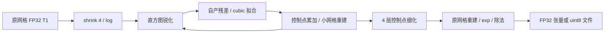

# 完整 N4 Torch 实验后端与真实输入验证

## 1．功能和支持范围

`n4_itk_torch_experimental.correct_tensor()` 用 PyTorch 完成固定 recon-all N4 配方：shrink=4、全 1 掩膜、200-bin triangular histogram、Wiener sharpening、三阶 B-spline 拟合、四层各最多 50 次反馈、控制点细化和原网格重建。它读取每轮自产的残差，完成了本例的全部 200 次迭代，没有使用模糊残差近似，也不调用原生程序或读取参考结果。

**这是实验后端，生产默认没有改变。** 控制点和直方图归约、FFT、log/exp 等浮点计算与 ITK 串行实现存在差异。此次真实输入的 GPU 输出具有持续偏低的强度差异，尚不能判定整体指标等效。该结果不能作为 recon-all 已全部改写为 GPU 或整例达到十分钟的证据。



当前支持三维、非负有限值、每轴至少 8 个体素、开放 cubic 参数域、零起始索引、全 1 掩膜、无 confidence。图像数据按 `(x,y,z)` 排列，spacing 单位为 mm。参数域使用单位方向，体素校正不重采样影像；文件接口保留输入 affine、空间和头信息。暂不提供其他掩膜、非零收敛阈值、任意迭代配方或任意阶次。N4 不需要模型权重或图谱。

## 2．Python 调用、输入和输出

```python
import nibabel as nib
import numpy as np
import torch
from fnit.recon_all.n4_itk_torch_experimental import correct_tensor

input_image = nib.load("subject/mri/orig.mgz")  # FNIT 自产 conformed T1；不能读取官方参考作为生产输入
input_array = np.asarray(input_image.dataobj, dtype=np.float32)  # 三维 xyz，非负强度
input_tensor = torch.from_numpy(input_array.copy()).to("cuda:0")  # 显式选择目标 GPU，使用 FP32
result = correct_tensor(
    image=input_tensor,  # 原网格 FP32 张量，输出仍处于该网格
    spacing=input_image.header.get_zooms()[:3],  # 各轴体素尺寸，单位 mm
    profile=True,  # 对 CUDA 子段同步计时；测量时开启，日常调用可关闭
    callback=None,  # 可选回调接收 level、iteration、自产 residual 和 phi；默认不导出
)
corrected_tensor = result.corrected  # FP32 xyz，校正后的原网格强度
log_bias_tensor = result.log_bias_field  # FP32 xyz，原网格的 log bias field
control_lattice = result.lattice  # FP32 xyz，固定配方完成后的 11×11×11 参数网格
```

| 参数 | 类型、默认值与作用 |
|---|---|
| `image` | 必填三维 FP32 Tensor；CPU 或明确的 CUDA 设备，有限、非负，各轴至少 8 |
| `spacing` | 三个正有限浮点数；默认 `(1,1,1)`，单位 mm |
| `profile` | bool，默认 False；True 在子段前后同步 CUDA，用于剖析 |
| `callback` | 可调用对象或 None，默认 None；每次拟合后接收 `(level, iteration, residual, phi)`，张量仍在目标设备；回调不能修改算法输入 |

`N4TorchResult` 返回 `corrected`、`log_bias_field`、`lattice`、整数 `iteration_count`、每轮收敛值 `convergence` 列表及 `timings` 字典。强度与输入使用相同无量纲尺度，bias 是 log intensity。结束时同步目标设备以记录完整张量墙钟；收敛决策本身也需读取标量。非有限值、负值、错误维度、错误 spacing 或非有限收敛值会抛异常；没有近似替代、参考复制或 OOM 后的隐式 CPU 回退。

文件接口如下。该接口代码和语法检查已完成，**本轮实测使用 raw/张量 benchmark，尚未实测此 MGZ/NIfTI 文件接口及 CLI**。

```python
from fnit.recon_all.n4_itk_torch_experimental import correct_volume

report = correct_volume(
    input_path="subject/mri/orig.mgz",  # 三维 NIfTI、MGH 或 MGZ，FNIT 自产输入
    output_path="diagnostic/nu_torch.mgz",  # 调用者明确指定的原网格 uint8 输出
    device="cuda:0",  # 默认 cuda:0，也可显式指定 cpu
    profile=True,  # 默认 False；本轮诊断启用同步剖析
)
```

文件输出采用 `floor(clip(FP32,0,255)+0.5)` 转 uint8，使用 nibabel 写入同一图像类型和 affine。返回字典包含后端、设备、输入输出路径、shape、dtype、迭代数、张量时间及包含读取、传输和写出的 `total_seconds`。失败抛异常，不保证返回失败字典，可能留有部分输出。当前文件接口只提供 uint8 输出；需要浮点输出时使用张量接口。

`N4DenseBSplineFit` 是可单独复用的固定几何缓存。其 `field_shape`、`control_shape` 是 xyz 整数三元组，分别每轴至少 2/4；`spacing` 默认 `(1,1,1)`，`origin` 默认 `(0,0,0)`，均为物理 mm；`device` 默认 `cuda:0`。`fit(residual=..., validate=True)` 接收同设备同形状 FP32 log 残差并返回 FP32 xyz 控制点。`validate=False` 仅用于外部已校验的连续迭代。缓存不能跨不同网格或控制点数量复用，`cache_bytes` 只记录持久张量，不包含 CUDA context 和临时内存。

`N4CubicReconstruction` 接收控制点形状、输出形状、spacing 和设备，保持 z→y→x 的各轴四项 FP32 求和顺序；`refine_lattice(lattice)` 将开放 cubic 控制点各轴 `n→2n−3`，保留固定 ITK/VNL 生成系数中的微小非零项。`N4HistogramSharpening(device=...)` 接收小网格 FP32 log 强度，返回同形状校正 log 强度；直方图范围为零或非有限时抛异常。

## 3．命令行和复现

```bash
PYTHONPATH=src python tools/run_n4_torch_experimental.py \
  --input subject/mri/orig.mgz \
  --output diagnostic/nu_torch.mgz \
  --report diagnostic/nu_torch.json \
  --device cuda:0 \
  --profile
```

各参数对应上述具名文件 API；`--report` 保存程序、输入和输出 SHA-256。该命令是实验入口，不改变 `fnit recon-all` 的生产 N4。

完整真实阶段复现脚本位于 [20261009_n4_torch_substages](../../validation/recon_all/optimizations/20261009_n4_torch_substages/)。`prepare_volume.py` 只进行 nibabel 解码和 FP32 x-fast 导出；`prepare_diagnostic.py` 从固定 ITK 头文件生成独立的计时构建，不修改生产二进制；`benchmark_fit.py` 比较冻结残差；`benchmark_full.py` 从同一完整 N4 输入执行自产反馈；`characterize_errors.py` 仅在候选完成后使用参考 mask/aseg 做位置诊断；`collect_receipts.py` 保存实际程序、输入和源文件哈希。每个脚本的全部参数由 `--help` 提供，路径由运行者明确传入。官方交叉输入仅存在于诊断目录。

无需新增运行依赖，使用主页 Conda 环境已有的 PyTorch、NumPy、nibabel；独立比较使用已有 Numba、SciPy 和 Matplotlib。Conda 内的诊断编译仅用于定位，Torch 实验算法不调用它。未完成干净安装、已初始化 CUDA 的文件 API 或整例隔离验收。

## 4．对应原命令和算法

FreeSurfer 的单 T1 前段参考为：

```bash
AntsN4BiasFieldCorrectionFs -i orig.mgz -o nu.mgz
```

具体选项应以固定版本 recon-all 的调用和本仓库 wrapper 为准。本实验移植的是 FNIT 独立构建程序的固定 ITK 5.4.7 recipe，不能声称与所有 ANTs/FreeSurfer N4 参数等价。输入是 conformed T1，输出是同网格 bias-corrected 强度。独立源码构建和执行符合生产依赖边界；系统 FreeSurfer 程序仅作为 benchmark 参考身份核对。

源码依据：[ITK N4 filter](https://github.com/InsightSoftwareConsortium/ITK/blob/v5.4.7/Modules/Filtering/BiasCorrection/include/itkN4BiasFieldCorrectionImageFilter.hxx)、[scattered B-spline fitting](https://github.com/InsightSoftwareConsortium/ITK/blob/v5.4.7/Modules/Filtering/ImageGrid/include/itkBSplineScatteredDataPointSetToImageFilter.hxx)、[control-point reconstruction](https://github.com/InsightSoftwareConsortium/ITK/blob/v5.4.7/Modules/Filtering/ImageGrid/include/itkBSplineControlPointImageFilter.hxx)。实际安装头文件 SHA-256 以收据为准。

## 5．2026-10-09 最新真实数据结果

### 范围和版本

这是**一例真实 conformed T1 的冻结同输入 N4 阶段测试**，不是原始 T1 recon-all 整例。输入为 256³、1 mm、FP32，raw SHA-256 为 `df36b2f6b46f4ca815f68eff285997c087a8917fcff9b93712ac05e3150b98a7`。对应 MRI 文件 SHA 为 `18336675b248b38b32094482081dec9ab47efebe4cded9dfa4285adee88a28f9`；两种 SHA 属于不同数据表示，解码后 raw 已核对一致。

代码基线为 `8801f4fa1c7036f80982e2f87efec5f9b3979df0`，当时未提交的算子由每份 JSON 的 loaded-module SHA 绑定。主机为 gpucw1，CPU 为 Intel Xeon Gold 6430，GPU 为 H100，Torch 2.5.1/CUDA 11.8，CPU 与 ITK fitting/reconstruction 都设为 1 线程；未固定 N4 进程 affinity，共享负载存在。精度为 FP32 图像/权重，FP64 分段归约和 complex128 FFT，不用 FP16/BF16。该过程无 GEMM/卷积，TF32 不影响本算子；实际进程记录 matmul TF32=False、cuDNN TF32=True，没有通过修改全局策略宣称启用了 TF32。

当前 native bundle SHA 为 `6ccbd262a68941d97cebe6247d497d05f400d783607411517656099612eba72e`；只增加时钟的诊断二进制 SHA 为 `50b6f380212bc7b70e2761de25e2b4975d4e8360ef26bc7dc54614ab922bd656`。两者本轮完整 FP32 输出 SHA 都为 `c61c8bfad3a00c8e760281416291146eff3260e359c8c678264ccb46bfe761c3`，逐字节一致，支持计时诊断未改算法。原官方 ITK4.8 同输入重复稳定性沿用带哈希历史记录，本轮没有重新启动官方 N4；与当前 ITK5.4.7 对照单列，不能混称当前官方重跑。

### 实际热点

| 当前 ITK 诊断子段 | 200 次累计秒 | 说明 |
|---|---:|---|
| B-spline fit | 113.839 | 诊断 fitting 的 95.42%，本轮迁移的实际热点 |
| 小网格 reconstruction | 3.249 | 每轮自产 field 重建 |
| histogram sharpening | 0.713 | 200 次累计 |
| convergence | 0.752 | 200 次累计 |
| lattice refine | 0.002 | 计时包含最后一次源内部调用 |

`update_bias_total=117.673s` 包含上述部分子段，不能与子段再次相加。前四次捕获 I/O 为 0.049s。原生生产 profile 总和为 124.589s，包含读取准备 0.051s、fitting 123.006s、最终重建 0.992s、exp/divide 0.409s 和写出 0.130s。

### 完整反馈与数值

| 同输入 N4 后端 | 包含 raw 读取/传输/写出的秒 | FP32 最大差 / P99，对当前 native | uint8 不同体素数 / 最大差 |
|---|---:|---|---|
| 当前 ITK5.4.7 native | 124.589，profile 子段总和 | 参考 | 参考 |
| 完整 Torch CPU | 83.905 | 0.003250 / 0.001648 | 1750 / 1 |
| 完整 Torch CUDA0 | 4.332 | 0.016235 / 0.003723 | 3808 / 1 |

Torch CPU/GPU 各完整执行 200 次自产反馈。CUDA 同步张量墙钟为 3.609s，其中几何缓存 0.252s、sharpening 1.463s、fitting 0.692s、小网格重建 0.286s、refine 0.054s、最终重建 0.004s。GPU benchmark 冷脚本墙钟（含导入和事后比较）为 12.289s，不等于生产文件 CLI 墙钟。当前这是一对共享主机观察，未做完整 N4 ABBA；不能以 124.589→4.332s 推断 recon-all 提速比例。

相对冻结、已验证重复性的旧官方 ITK4.8：CPU uint8 差异 1720 个，CUDA 差异 3778 个，均最大 1；完整表和浮点数见 [CPU JSON](../../validation/recon_all/optimizations/20261009_n4_torch_substages/reports/full_cpu/report.json) 与 [CUDA JSON](../../validation/recon_all/optimizations/20261009_n4_torch_substages/reports/full_cuda0/report.json)。

**空间和方向性差异需要继续定位：** CUDA 相对当前 native 的 3808 个 uint8 差异全部为 −1，其中脑内 1932、脑外 1876。2497914 个正强度前景体素的浮点差异全部为负，均值 −0.001538、相对误差 P99 为 5.779×10⁻⁵。脑内发生 uint8 变化的体素最大浮点差 0.004150，脑外最大 0.015900。差异形成 3779 个六连通簇，最大 2 个体素。详细组织标签、强度分组和坐标见 [位置 JSON](../../validation/recon_all/optimizations/20261009_n4_torch_substages/reports/error_locations_cuda0.json)。不能将这种一致方向的偏差概括为无意义尾差，也不能据此断言已影响最终脑区指标。


### 冻结残差回归、显存和状态

四个完整 level 的首轮冻结残差比较，预先采用开发门 `phi maxabs≤1e-5、P99≤1e-6`。CUDA 四项通过，最大差分别为 `3.53e-9、6.50e-7、3.77e-7、4.34e-7`；各次重复输出精确。该门仅针对单层控制点拟合，不是完整 N4 或整体指标等效标准。独立 NumBa 源公式与 ITK 最大差 ≤5.59e-9，也并非逐位相同。

CUDA 缓存后单次 fit 约 0.877–0.942ms，CPU NumBa 约 16.86–24.70ms；构造缓存第一次 0.192s，不能省略该成本。完整 N4 GPU 峰值 allocated=1,295,297,024 字节、reserved=1,384,120,320 字节；同 PID 的 nvidia-smi 采样峰值=1,937,768,448 字节，请求采样间隔 0.1s，实际时间戳保留在 JSON。没有将 reserved 当作全进程占用，也没有把不同进程不同时刻的峰值相加。

| 验证项目 | 状态 |
|---|---|
| 一例完整固定配方、自产 200 次反馈 | 已完成 |
| 单层拟合预定开发门 | 四项通过 |
| 当前 native 与 clock-only 输出一致 | 逐字节通过 |
| 严格完整 N4 复现 | 未通过 |
| 优化是否使最终分割/网格/脑区指标退化 | 未完成连续链评价 |
| 整体指标等效 | 未判定；没有事后设门 |
| 第二例、完整 GPU 重复及 file API/CLI | 尚未验证 |
| 原始 T1 整例提速、隔离安装 | 尚未验证 |

## 6．更新记录和下一步

2026-10-09 新增完整 Torch 固定配方、四级拟合缓存、源序重建/细化、独立时钟构建、真实阶段 JSON 和误差位置图。保留已有生产 N4 和旧实验说明的用途边界，未删除正在承担参考功能的实现。CPU/GPU 单层测试 4 项通过，完整模块 CPU 测试 3 项通过；合成测试只是结构回归，真实证据在本页上述报告。

目前可验证的尾差线索包括 FP64 替代串行 FP32 归约、不同 log/exp/FFT，以及 [PyTorch 2.5.1 CUDA scalar division](https://github.com/pytorch/pytorch/blob/v2.5.1/aten/src/ATen/native/cuda/BinaryDivTrueKernel.cu) 会将 CPU 标量除法改成乘倒数；固定同算法的 device tensor divisor 变体应单独验证。这是源码确认的运算分支，**还没有证明它是上述整体负偏差的唯一或主要原因**。

优先继续冻结最终 lattice→field 重建的 CPU/GPU/ITK 对照，然后执行同输入完整数学变体、第二例和自产前段连续链。gpucw1 的新 SSH 连接当前被拒绝，已有报告可经 headcw 的共享存储访问；未完成项如实保留，不据已完成子段推测服务器结果。

## 7．参考文献

Tustison NJ 等，N4ITK: Improved N3 Bias Correction，IEEE Transactions on Medical Imaging，2010；[DOI](https://doi.org/10.1109/TMI.2010.2046908)。原实现来自 [ITK](https://github.com/InsightSoftwareConsortium/ITK)；FreeSurfer 的独立 benchmark 程序与版本通过本轮 [收据](../../validation/recon_all/optimizations/20261009_n4_torch_substages/reports/receipt.json) 绑定。
