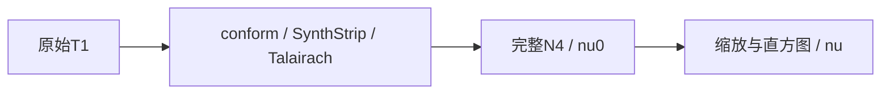

# N4 的 PyTorch 实验入口

## 1．功能与流程

`run_input_n4_chain(n4_backend="torch")` 现已复用完整固定 N4，实现直方图锐化、四层 B-spline 拟合/细化和最多 200 次自产反馈。输入链的完整空间/文件约定见[原始 T1 到 nu](INPUT_N4_CHAIN.md)，算法见[完整 N4](N4_COMPLETE_TORCH_20261009.md)。生产默认仍为独立 Conda ITK。



## 2．Python 输入与输出

```python
from fnit.recon_all.input_n4_chain import run_input_n4_chain

result = run_input_n4_chain(
    t1="data/sub-07_T1w.nii.gz",  # 原始三维NIfTI-1
    subject_dir="runs/sub-07-input-n4",  # 新空输出目录
    weights_dir="resources/weights",  # SynthStrip和affine权重
    assets_dir="resources/assets",  # MNI305模板
    n4_binary=None,  # 显式Torch不需要原生程序；native必须指定
    device="cuda:0",  # 目标GPU，不启用半精度
    threads=4,  # 前段预算，native N4仍单线程
    n4_backend="torch",  # 完整反馈实验后端，默认native
    profile=False,  # 可选同步剖析，默认关闭
)
```

`nu0` 和 `nu` 均为同conformed网格的uint8 MGH/MGZ；不是旧近似float32。输入/输出、全部返回字段、单位、默认值、失败行为及精度例外在[输入链参数表](INPUT_N4_CHAIN.md#2python-调用输入输出与空间)。

## 3．命令行

```bash
python -m fnit.recon_all.input_n4_chain \
  --t1 data/sub-07_T1w.nii.gz \
  --subject-dir runs/sub-07-input-n4 \
  --weights-dir resources/weights \
  --assets-dir resources/assets \
  --n4-backend torch \
  --device cuda:0 \
  --threads 4 \
  --report runs/sub-07-input-n4.json
```

这是独立显式实验接口，没有切换 recon-all 默认。参数解释与复现脚本见[输入链命令](INPUT_N4_CHAIN.md#3命令行和复现)。已有主页Conda覆盖所需依赖。

## 4．原软件与固定实现

对应固定 `N4BiasFieldCorrection` 和 `mri_nu_correct.mni` 的后处理链；ITK5.4.7 recipe与独立Conda源码路径见[ITK说明](N4_ITK_CONDA.md)。原程序只用于独立benchmark，生产Torch分支不启动它，不读取参考影像。

## 5．精度、耗时和资源

本轮两例原始T1→nu已从新空目录完成native/Torch配对，合计输入链墙钟461.280→302.519s；这是到nu的mini-chain，未测完整recon-all提速。nu0分别有4016/3259体素全部+1，nu最大差3；系统偏移及后处理误差传播独立保留。结果绑定实际源码/资源SHA并写在[输入链结果](INPUT_N4_CHAIN.md#5本版真实精度时间与显存)。进一步的[缓存隔离N4](N4_CACHED_WORKER.md)四组完整阶段约10–11s，与cache-off完整实现新增体素差为0；不改变全局allocator或native默认。此前200次完整N4冻结同输入结果见[完整N4实测](N4_COMPLETE_TORCH_20261009.md)，不能代替本次连续输入链。整体等效尚未判定，未宣布整例十分钟。

## 6．近期更新与旧接口

2026-10-09修复入口复用bug：以前输入链仍指向 `n4_gpu.run()` 的平滑残差算法；现指向完整 `n4_itk_torch_experimental.correct_volume()`。旧近似仅保留独立实验函数和直接结构测试，不能称为ITK N4或用于recon-all输出。旧近似的历史误差/耗时不再作为本版结果，Git历史可查。

## 7．参考

Tustison等，N4ITK: Improved N3 Bias Correction，IEEE TMI，2010。[DOI](https://doi.org/10.1109/TMI.2010.2046908)。[ITK源码](https://github.com/InsightSoftwareConsortium/ITK/blob/v5.4.7/Modules/Filtering/BiasCorrection/include/itkN4BiasFieldCorrectionImageFilter.hxx)、[FreeSurfer](https://github.com/freesurfer/freesurfer)。
