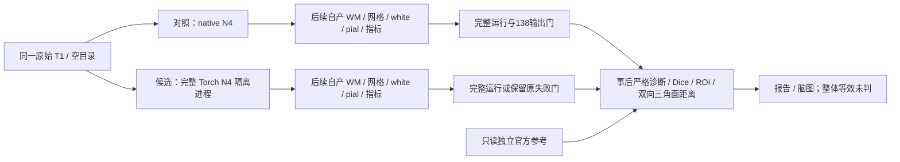
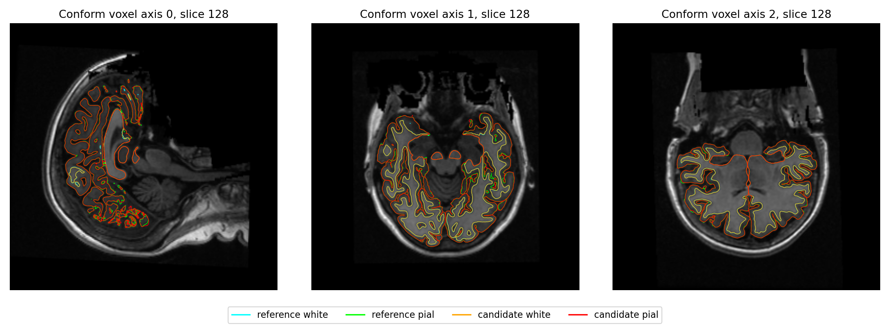
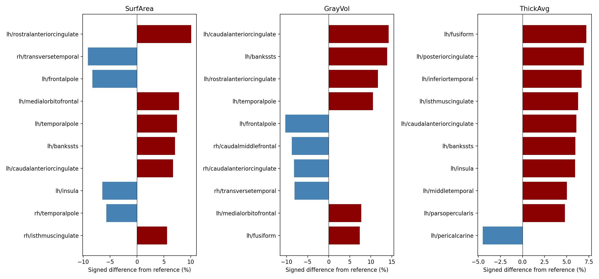
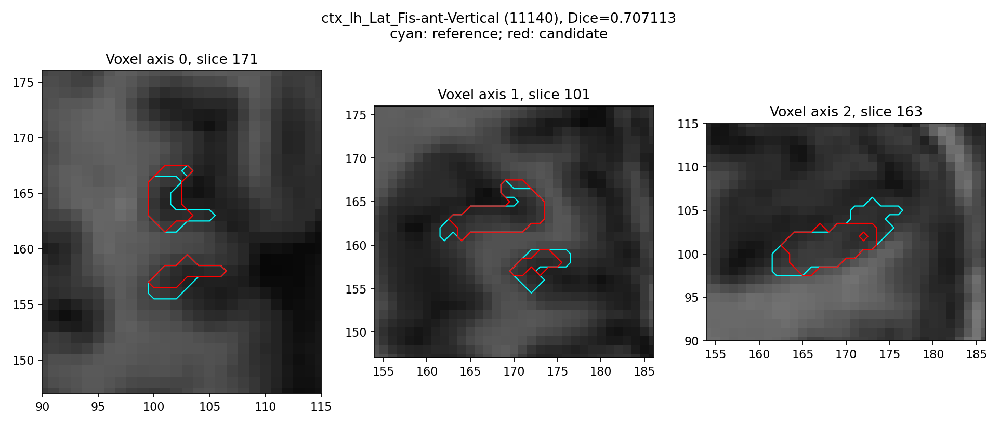

# 完整 Torch N4 的原始 T1 整例下游诊断

## 1．功能和支持范围

本页评价完整 Torch N4 替换对 recon-all 后续输出的影响。使用两份公开 ds000114 原始 T1，从空目录完成实际生产调用；比较代码只在运行结束后读取 FNIT 自产结果和独立保存的官方参考，不参与生产、不修补被试。

生成源码固定为 `e34a1829`，归档 SHA-256 为 `145f0f656ea3a97101b2d43a96a7c5c5e3f0849a990401216e41a65f871f7933`。候选只显式开启完整 `n4_backend="torch"`、`n4_execution="isolated"`；对照仍用 Conda 内独立编译的 ITK N4。两例均完成 N4 自产反馈，但 **sub-06 整例成功，sub-07 整例因右侧 white 自相交失败**。生产默认仍为 native N4。

本轮新增的是只读失败输出诊断和来源核验，不是另一个 N4 算法。复用的严格138文件比较用于定位；最终脑区、标签和几何指标另列。整体指标等效没有已确认的前瞻门槛，保持 `not_assessed`。



## 2．Python 调用、输入和输出

新增脚本位于 [20261010_n4_whole_diagnostics](../../validation/recon_all/optimizations/20261010_n4_whole_diagnostics/)。它们使用主页 Conda 已有依赖；来源与状态契约只用 Python 标准库。

```python
import json
from pathlib import Path
from diagnose_failed_outputs import validate_failed_producer, inventory_outputs
from fnit.recon_all.expected_outputs import paths

reference_manifest = json.loads(
    Path("benchmark/official/TRANSFER_MANIFEST.private.json").read_text()
)  # 独立参考输入和文件 SHA 清单；不作为生产输入
benchmark, runtime, mesh_failure = validate_failed_producer(
    benchmark_path=Path("runs/n4/sub07-candidate/benchmark.json"),  # 原始失败运行收据
    source_root=Path("frozen/e34a1829"),  # 该次实际使用的完整冻结源码根
    case="ds000114_sub-07",  # 清单中的公开原始 T1 标识
    reference_manifest=reference_manifest,  # 绑定同一原始 T1 SHA
)
inventory = inventory_outputs(
    subject=Path("runs/n4/sub07-candidate/subject"),  # 保留失败运行自己的结果
    expected_paths=paths(),  # 冻结单 T1 清单，不删失败项以增加通过数
)
```

全部输入均为现存文件和明确路径，不接收随机种子、算法修补开关或参考覆盖路径。

| 输入 | 格式、空间与限制 |
|---|---|
| `benchmark_path` / CLI `--benchmark` | 原始整例 JSON；保留实际代码版本、552项模块SHA、资源、原始T1 SHA、硬件与进程退出码 |
| `source_root` / `--source-root` | 实际冻结仓库根，含 `src/fnit`；逐项校验全部声明源码，拒绝改动或越界路径 |
| `case` / `--case` | 官方参考清单中一个公开被试标识；原始 T1 SHA 必须相同 |
| `reference_manifest` | `TRANSFER_MANIFEST.private.json` 解码字典；官方参考是独立事后诊断输入 |
| `subject` | 自产被试目录，体积为各文件声明的 conform 网格，表面为 surface RAS，单位mm |
| `expected_paths` | 固定138个相对路径；重复、越界或改变数量直接报错 |
| `--control-benchmark` / `--control-source-root` | 真正完成的同被试对照收据与冻结源码；核对原始T1、源码、权重资产程序、主机、CPU亲和性、线程和目标GPU |
| `--complete-validator` | 现有 `tools/evaluate_recon_torch_run.py`；仍拒绝失败整例，没有修改成功验收门 |
| `--reference-root` | 独立官方参考根，含 manifest 和 `subjects/<case>`；不调用官方程序 |
| `--reference-kind` | 必填 `control` 或 `official`，决定本组数值比较对象；两组均先核对完成对照的身份 |
| `--driver` / `--scripts-dir` | 固定既有 `compare_whole_cases.py` 与完整比较脚本目录；保存实际脚本SHA |
| `--label-table` | 声明的 `FreeSurferColorLUT.txt`，保存SHA；Dice按标签语义报告，不用标签值Pearson相关 |
| `--output` | 必须不存在的新诊断目录；不会在原被试目录创建或覆盖任何结果 |
| `--threads` | 默认4，本轮固定只接受4；CUDA隐藏，诊断不占GPU |
| 恢复入口 `--preserved-diagnostic` | 原失败事后诊断目录；必须是已定位的临时模块Numba缓存错误。原生产、完整距离检查点、固定比较源码和138输出SHA必须仍匹配；不接受其他错误或仍在运行的目录 |

`validate_failed_producer()` 返回 `(benchmark, runtime, mesh_failure)` 三个JSON可序列化字典，生产状态仍是failed。它只支持 `failed_stage="mni_mesh_parallel"` 且真实非零整数退出码；其他阶段失败、仍在运行、源码/原T1/失败网格哈希变化都报错。`inventory_outputs()` 返回 `expected`、`present`、`missing`、逐文件 `bytes/SHA256`；存在性不代表网格门通过。

输出包括：

- `diagnosis.json`：诊断状态、实际生产失败、源码/输入/资源身份、输出清点和原失败计时；`successful_whole_speedup=null`。
- `preserved_failed_mesh_receipt.json`：原失败网格报告的副本，原报告不改；八张实际网格SHA仍核对。
- `strict_*.json`、`geometry_*.json`、`local_*.json`：138诊断、空间与顶点对应性、局部逐元素比较的适用范围。
- `region_*.json`、`dice_*.json`、`no_th3_*.json`：68区厚度/面积/体积、离散标签Dice，以及各自white/pial/thickness/annotation上的共同no-th3体积定义。
- `surface_*.json`：不同网格的两向源顶点到完整目标三角面距离，单位mm，保留mean/P99/max和超过0.1mm的数量。它是顶点采样距离，不是连续Hausdorff距离。无对应关系时不比较同索引顶点图。
- `quality_candidate/report.json`：失败目录独立拓扑、顶点link、球面翻折和white/pial相互穿越。自相交引用带输入SHA的原生产门。完整覆盖、超时与候选预算不足分别记录。
- `figures/`：真实T1表面叠加、最差脑区指标、最差分区边界PNG及输入/绘图SHA。

文件格式/读错误直接传播；诊断出错保留 `diagnostic_failed_producer_still_failed`，不改生产失败。缺任何固定输出时只保存清点并退出2，不执行一个伪完整比较。

`complete_failed_diagnostic.py` 的其余参数与上表一致。它将已有完整距离、Dice、ROI、no-th3和候选QC报告按SHA复制到新诊断目录，只新运行参考QC与绘图。返回码0表示事后诊断补齐，生产退出码仍为1；`diagnosis.json.recovery` 保留旧诊断状态、旧墙钟、全部检查点SHA、新脚本SHA和单独的恢复墙钟。原失败诊断和原脚本不会被覆盖。

`execute_quality_reference(command=..., log=..., commands=..., cache_directory=..., write=...)` 为参考QC子进程创建一个独立Numba缓存目录。`command` 是完整CLI参数字符串列表；`log` 是追加日志路径；`commands` 是可修改的命令收据列表；`cache_directory` 必须不存在；`write` 是既有JSON写出函数。该函数没有科学影像输出和独立官方CLI；返回`None`，非零退出码抛`RuntimeError`，缓存目录已存在抛`FileExistsError`。只修改子环境的`NUMBA_CACHE_DIR`，不修改父环境或质量算法。

## 3．命令行与复现

先使用未修改的两个完整运行比较入口评价成功的sub-06：`tools/evaluate_recon_optimization_pair.py` 和 `tools/evaluate_recon_torch_run.py`。失败sub-07使用以下独立入口，所有路径由调用者指定：

```bash
python validation/recon_all/optimizations/20261010_n4_whole_diagnostics/diagnose_failed_outputs.py \
  --benchmark runs/n4/sub07-candidate/benchmark.json \
  --source-root frozen/e34a1829 \
  --control-benchmark runs/control/sub07-candidate/benchmark.json \
  --control-source-root frozen/e34a1829 \
  --complete-validator tools/evaluate_recon_torch_run.py \
  --reference-root benchmark/official \
  --reference-kind control \
  --driver validation/recon_all/optimizations/20261002_parallel/compare_whole_cases.py \
  --scripts-dir validation/recon_all/python_gpu_port \
  --label-table declared_assets/FreeSurferColorLUT.txt \
  --case ds000114_sub-07 \
  --threads 4 \
  --output diagnostics/sub07_failed_vs_control
```

上述参数的中文含义见第2节；使用 `--reference-kind official`、新的输出目录得到官方对照，仍保留失败生产语义。Python调用示例逐项注释与CLI参数一一对应。

`collect_identity.py` 的 `--source-root`、`--reference-root`、`--native-bin-dir`、`--weights-dir`、`--assets-dir` 和 `--output` 必填；可重复 `--benchmark` 指定四份控制/候选收据。它重新校验全部源/参考/权重资产/程序SHA及大小，只复制JSON收据，不复制影像、表面或许可证。`verify_files(root=..., expected=...)` 返回逐相对文件的大小和SHA；任何清单路径或内容变化报错。

`summarize_diagnostics.py` 的 `--report-root`、`--control-official-sub06`、`--control-official-sub07`、`--output` 必填。只有四组诊断结束且身份核验通过才生成 `summary.json` 和 `regional_metrics.csv`；控制官方比较直接复用其已完成的真实报告。逐区误差变化同时保留改善、变大和不变项，不根据结果新增阈值。

本轮第二例使用以下恢复入口。参数含义沿用第2节，`--preserved-diagnostic` 指向原失败事后诊断，`--output` 指向新目录；它不重新运行生产或完整三角面距离：

```bash
python validation/recon_all/optimizations/20261010_n4_whole_diagnostics/complete_failed_diagnostic.py \
  --preserved-diagnostic diagnostics/sub07_failed_vs_control \
  --benchmark runs/n4/sub07-candidate/benchmark.json \
  --source-root frozen/e34a1829 \
  --control-benchmark runs/control/sub07-candidate/benchmark.json \
  --control-source-root frozen/e34a1829 \
  --complete-validator tools/evaluate_recon_torch_run.py \
  --reference-root benchmark/official \
  --reference-kind control \
  --driver validation/recon_all/optimizations/20261002_parallel/compare_whole_cases.py \
  --scripts-dir validation/recon_all/python_gpu_port \
  --label-table declared_assets/FreeSurferColorLUT.txt \
  --case ds000114_sub-07 \
  --threads 4 \
  --output diagnostics/sub07_control_recovery
```

摘要脚本可用`--sub07-control-report`和`--sub07-official-report`显式指定两组已完成恢复目录；省略时仍读取原目录。原目录保持失败，本轮实际摘要明确指定恢复目录。公开副本仅用于阅读；恢复核验使用服务器保留的原始未脱敏收据和路径，公开文件的对应关系由导出清单给出。

原始收据留服务器。复用 [publish_reports.py](../../validation/recon_all/optimizations/20261009_n4_torch_substages/publish_reports.py) 在服务器生成仅替换私有路径/主机字符串的公开副本，再下载报告。源码、程序及输入SHA和全部数值/类型保持；PNG字节不变。公开清单区分原始与公开文件SHA。依赖仍来自主页Conda，测试用标准库unittest，不要求额外安装pytest。

## 4．原软件调用与算法边界

整例官方参考由独立 benchmark 的 `recon-all -i <原始T1> -s <被试> -all` 生成，固定实际版本与历史环境信息在官方来源收据中。本轮重新验证581个存档参考文件的SHA/大小，没有在新节点重跑官方程序或重新证明其整例重复性；不拿跨环境历史耗时计算当前配对加速。

N4原命令、固定ITK配方及完整Torch算法见 [完整N4实验后端](N4_COMPLETE_TORCH_20261009.md)。生产Torch路径复用项目已有完整200轮算法和隔离worker，不调用预装FreeSurfer，不使用旧平滑残差近似。其他原生阶段仍为固定源码Conda独立构建；本页不能证明整条recon-all已经纯PyTorch。

事后诊断没有独立的官方等价CLI；不编造一个重建命令作为距离或质量算子的对应项。TH3顶点volume图与no-th3脑区GrayVol分别报告，不能相互替代。

## 5．2026-10-10真实整例结果

完整公开报告见 [机器可读摘要](../../validation/recon_all/optimizations/20261010_n4_whole_diagnostics/reports/summary_v2/summary.json)、[68区指标CSV](../../validation/recon_all/optimizations/20261010_n4_whole_diagnostics/reports/summary_v2/regional_metrics.csv)、[实际来源核验](../../validation/recon_all/optimizations/20261010_n4_whole_diagnostics/reports/identity/identity.json) 和 [导出校验](../../validation/recon_all/optimizations/20261010_n4_whole_diagnostics/reports/numeric_preservation.json)。共121份报告/脑图，服务器导出核验365,960个数值、布尔与null叶的类型和值不变，PNG字节不变；下载后逐公开文件大小和SHA再次核验。

两份原始T1 SHA分别为 `7e33afb28f631fac31d81e2428a6144f61aba4102859c694eeb49ee584de04f7`、`59ef7bed60d4db64d56d947ebed2ef62a9257c26fe879848fe24d10a490f74fc`。同一主机Xeon Platinum8369B/A100-SXM4-80GB、总4线程；sub-06控制/候选亲和性40–43、GPU逻辑0/物理可见6，sub-07为44–47、可见7。默认TF32和经验证阶段FP32例外由实际forward报告保留，无FP16/BF16。

| 输入 | 控制CLI秒 | Torch N4 CLI秒 | 实际生产状态 | 输出存在性 | 原生产网格门 |
|---|---:|---:|---|---|---|
| sub-06 | 2122.900 | 2148.430 | 完成 / exit0 | 138/138 | 双侧white/pial自相交0，passed |
| sub-07 | 2056.372 | 2101.373，失败前耗时 | 失败 / exit1 | 独立清点138/138 | RH white相交10面，failed |

sub-06这对完整墙钟增加约1.20%；N4局部提速没有使此次整例变快。共享负载下只有一对整例，不能当稳定吞吐。sub-07不计算成功加速或将失败前耗时称整例完成时间。计时包含CLI启动、校验、模型加载、传输、计算和读写；事后比较计时独立，不加到原始运行墙钟。

| 网格 | sub-06控制顶点/面 | sub-06候选顶点/面 |
|---|---:|---:|
| LH | 130679 / 261354 | 129830 / 259656 |
| RH | 132459 / 264914 | 132236 / 264468 |

网格变化使同索引比较不成立。N4前段传播见根任务的 [当前连续前段诊断](../../validation/recon_all/optimizations/20261010_n4_continuous_prefix/)；量化阶段的少量±1变化已经传播到WM、网格和最终统计，不能称为无实质影响，也不一概归因随机性。

### 最终68区统计和标签

下表每格为绝对相对误差的中位数 / P90，单位%。sub-07仅描述失败目录保留的统计，不能当通过验收。厚度仍保留全部绝对差与最差脑区，不只报告相关性。

| 比较对象 | 厚度 | 面积 | GrayVol |
|---|---:|---:|---:|
| sub-06，Torch N4 vs 同例native N4整例 | 0.7703 / 3.3352 | 1.4302 / 3.9244 | 1.5445 / 3.8015 |
| sub-07失败保留输出 vs 同例完整对照 | 2.0307 / 5.3107 | 1.6428 / 6.5360 | 2.9779 / 8.1299 |
| sub-06，Torch N4 vs 独立官方 | 1.0350 / 3.8688 | 1.1659 / 4.0894 | 2.1154 / 4.7524 |
| sub-07失败保留输出 vs 独立官方 | 1.1212 / 2.2853 | 1.4180 / 4.3626 | 1.7283 / 4.2629 |

相对同例对照，sub-06厚度MAE=0.033206mm、最大0.277mm，面积MAE=35.838mm²、最大203mm²，GrayVol MAE=104.853mm³、最大400mm³。失败sub-07分别为0.058882/0.161mm、38.779/168mm²、179.338/658mm³。相对官方sub-06厚度最大差0.364mm；sub-07最大0.076mm。即便部分官方指标改善，原生产网格门仍失败，不作整体等效结论。

| 分区图，Dice中位数 / 最低值 | sub-06 vs 完整对照 | sub-07失败输出 vs 完整对照 | sub-06 vs 官方 | sub-07失败输出 vs 官方 |
|---|---:|---:|---:|---:|
| aparc+aseg | 0.9544 / 0.8355 | 0.9495 / 0.8686 | 0.9525 / 0.8315 | 0.9552 / 0.6667 |
| aparc.a2009s+aseg | 0.9180 / 0.6628 | 0.9096 / 0.7071 | 0.9193 / 0.5946 | 0.9159 / 0.6667 |
| aparc.DKTatlas+aseg | 0.9574 / 0.8927 | 0.9550 / 0.9083 | 0.9563 / 0.8889 | 0.9614 / 0.6667 |

分区表包含非零解剖标签，包含子皮层；全部逐标签体素数、Dice、最差脑区另存。相对完整对照aseg.mgz不同体素为26729/22568，不能用其中位Dice=1掩盖。两例vs对照严格文件为13/138，vs官方为5/138；这只是原138诊断，不是功能完成比例或指标等效门。

### 双向表面距离和局部质量

下表用当前完整三角面查询，方向分别为Torch N4网格→对照网格、对照→Torch N4。单位mm；不是同索引位移。最早变化已经发生在filled之后的orig.nofix：sub-06 LH顶点126952→126412，RH127626→127278，后续orig.premesh和orig也不同，不能直接把最终形状差异解释成white/pial算子自身误差。

| sub-06 vs 完整对照 | 两向mean | 两向P99 | 两向最大 |
|---|---:|---:|---:|
| LH white | 0.06641 / 0.06761 | 0.39702 / 0.41621 | 3.73925 / 2.56637 |
| RH white | 0.07074 / 0.06847 | 0.42118 / 0.39102 | 2.74889 / 3.63218 |
| LH pial | 0.08911 / 0.08979 | 0.64760 / 0.62732 | 2.67238 / 2.96825 |
| RH pial | 0.09420 / 0.09383 | 0.61134 / 0.64458 | 2.55340 / 3.28404 |

相对官方sub-06白面两向P99为LH0.44393/0.40514、RH0.40193/0.38996mm；pial为LH0.69726/0.64181、RH0.62823/0.63997mm。完整mean/max、每个阶段、超过0.1mm的数量与几何头均保留在机器报告。

| sub-07失败保留输出 vs 完整对照 | 两向mean | 两向P99 | 两向最大 |
|---|---:|---:|---:|
| LH white | 0.06038 / 0.05797 | 0.41031 / 0.34923 | 2.91495 / 1.73685 |
| RH white | 0.05764 / 0.05526 | 0.33040 / 0.33618 | 5.65252 / 1.44874 |
| LH pial | 0.12149 / 0.12409 | 0.63564 / 0.74260 | 3.05199 / 3.02419 |
| RH pial | 0.09379 / 0.09552 | 0.57893 / 0.59173 | 1.96562 / 3.35436 |

第二例相对官方white两向P99为LH0.29289/0.30889、RH0.33352/0.34354mm，pial为LH0.50902/0.50751、RH0.57130/0.57389mm；white最大距离LH反向5.98711mm、RH正向5.73527mm。该例首次网格变化也在orig.nofix：LH110534→111686、RH111546→111752顶点，不能按索引比较后续网格或声称这些距离已隔离white/pial本体误差。

sub-06的独立质量测量完成：双侧单连通、Euler=2，boundary/nonmanifold/degenerate-index/duplicate-face/link异常均0，sphere/sphere.reg负面均0。**生产自相交门通过不等于white/pial没有相互穿越。** 同一完整候选对查询得到Torch N4的white/pial proper transverse pairs为LH424、RH185；控制为567/260，官方为441/269。其中Torch N4的完全皮层内面对为353/114。各项保留空间候选预算、容差、位置与深度；不把接触/重合算作proper穿越，也不据数量较少自动判为等效。

sub-07的独立QC也已测量：双侧单连通、Euler=2，boundary/nonmanifold/degenerate-index/duplicate-face/link异常均0；候选LH sphere/sphere.reg负面0/0，RH为103/95，最小有向面积分别−0.193781/−0.015030mm²。候选white/pial proper transverse pairs为LH185、RH245，完全皮层内面对为128/183。这些局部异常与原RH white自相交10面一并保留，不用部分ROI更接近官方掩盖网格失败。

相同扩展QC对sub-07对照的sphere/sphere.reg负面为LH47/37、RH0/0，官方存档为LH58/26、RH27/35。候选RH新增翻折与对照LH已有翻折分开记录。该表采用固定有向面积谓词；阶段比较器的另一种几何判据也保留在原表面JSON，不混用两种计数。

下列图来自sub-07失败保留目录与同例native N4完整对照，不是验收成功图。第一张使用conform网格的三个体素轴中心切片：青/绿是对照white/pial，橙/红是Torch N4候选。第二张显示最差脑区有符号偏差，第三张显示a2009s最差标签边界（Dice=0.707113），青为对照、红为候选。中心切片只用于观察，完整表面局部异常仍以报告为准。







sub-06两个事后诊断用时1364.893/1482.513秒；采用原比较器逐源点完整三角面搜索，这个时间不属于生产整例，也不能用它推导算法变慢。sub-07原诊断在1902.537/2073.845秒后完成全部完整距离和候选QC，但参考QC失败；独立恢复分别用51.410/56.785秒，仅补参考QC和绘图。这是分段事后诊断，不能称为重新完成原始T1整例或连续诊断。

已完成来源核验：四生产各552项源码、581份独立官方参考、16权重、102资产及15个独立native程序；原始源/输入/结果未修改。原九项失败状态/输入/source/mesh/138存在性契约在实际环境通过，用时0.067秒；新增参考QC子缓存边界后11项契约通过，用时0.223秒。一次测试启动命令遗漏`taskset -c`之后的空格，原错误日志保留；修正启动语法后运行的11项契约结果单独记录。

显存采样请求0.5秒，但实际最大间隔约14秒且有查询超时；host/container PID归属未决，任务父子进程峰值为null。sub-06整卡峰47,255,126,016字节、sub-07整卡峰26,929,528,832字节包括其他进程，不能当自身峰或据此宣布已满足20GB。PyTorch缓存关闭的统计可用性与隔离N4worker统计另在原始收据保留。本轮没有干净独立安装/文件访问隔离验收。

## 6．更新与验证记录

本轮只新增独立失败输出诊断、身份重校验、摘要脚本、契约和本页；生产调度/默认/冻结source与旧比较器未改。sub-06走现有完整运行门；sub-07保持退出1、runtime.failed和原mni-mesh失败门，不修补参考、不强制验收成功。

特别修复一个事后诊断器bug：候选QC动态导入的临时模块名`_failed_existing_quality`被Numba写入缓存，随后参考QC独立CLI复用该缓存时无法导入模块。原因由真实报错栈定位，不属于生产N4或OOM。修复只为参考子进程指定新的缓存目录，保持所有数值算子、阈值与父进程设置。实际测得的旧v1源码SHA为`15f1bd867eb4e07b12b18ba50584a44d0b436e8f50e98b419e753c7fc5933d5f`，在`source_snapshots/diagnose_failed_outputs_v1.py`和服务器原路径保留；新恢复脚本绑定完成距离检查点SHA后补齐两组QC/脑图，原失败日志与生产失败仍保持。没有重复计算约30分钟的完整距离，也没有将补跑标为连续整例。

此前完整N4冻结同输入阶段和mini-chain结果分别见 [N4完整实验](N4_COMPLETE_TORCH_20261009.md)、[缓存隔离worker](N4_CACHED_WORKER.md)、[原始T1前段](INPUT_N4_CHAIN.md)。它们有各自版本、输入与计时范围，不作为本页当前整例结论。历史报告继续承担参考作用，不误删真实影像、权重或他人代码。

下一步优先定位相同N4几何/参数下自产反馈的方向性强度差异，再验证WM/filled和RH white的传播。整体等效、完整速度稳定性和低于20GB的父子进程峰值仍未判；本轮不将Torch N4设为默认。

## 7．文献与源码

- [FNIT完整Torch N4](../../src/fnit/recon_all/n4_itk_torch_experimental.py)、[隔离worker](../../src/fnit/recon_all/n4_torch_worker.py)。
- [既有完整比较驱动](../../validation/recon_all/optimizations/20261002_parallel/compare_whole_cases.py)、[表面距离](../../validation/recon_all/python_gpu_port/compare_surface_chain.py)、[标签Dice](../../validation/recon_all/python_gpu_port/compare_parcellation_dice.py)、[脑区指标](../../validation/recon_all/python_gpu_port/compare_region_stats.py)、[扩展质量](../../validation/recon_all/python_gpu_port/benchmark_surface_quality_extended.py)。
- [ITK固定N4源码](https://github.com/InsightSoftwareConsortium/ITK/blob/v5.4.7/Modules/Filtering/BiasCorrection/include/itkN4BiasFieldCorrectionImageFilter.hxx)。Tustison等，N4ITK: Improved N3 Bias Correction，IEEE Transactions on Medical Imaging，2010。
- [FreeSurfer源码](https://github.com/freesurfer/freesurfer)、[公开ds000114数据](https://openneuro.org/datasets/ds000114)。参考生成环境与版本以带输入SHA的实际清单为准。
