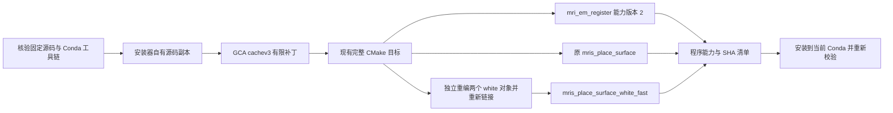

# GCA 与 white 原生热点的 Conda 安装

现有原生安装入口同时构建完整 GCA 注册和 white 放置的有限优化。GCA 保留完整原生优化器、候选次序、停止条件和上游 ROMP 分块规约；white 只省去未被 repulsive term 消费的面哈希表。安装器从固定上游源码和当前 Conda 工具链构建，不复制系统安装的软件二进制。

## 1. 安装流程与程序用途



| 安装到 `$CONDA_PREFIX/bin` 的程序 | 用途与行为 |
| --- | --- |
| `mri_em_register` | 完整 GCA 注册；能力版本为 2。调用者设置 `FNIT_GCA_SCORER=cpu_cached` 后使用单输入 uint8 缓存评分；未设置或输入类型不支持时沿用原评分。 |
| `mris_place_surface_white_fast` | white.preaparc 和 final white。保留动态碰撞 MHT、vertex repulse 表、试步拒绝恢复、固定顶点和最后清理。 |
| `mris_place_surface` | 未施加 white 热点补丁的原放置程序，用于 pial 和既有原生表面图计算。 |

white 程序在原完整构建之后，只重编 `mrisurf_mri.cpp` 和带能力查询的 `mris_place_surface.cpp`，再链接独立的 `libutils.a` 副本。安装器不为此构建 benchmark control。GCA 补丁在安装器的源码副本中应用；源码时间戳为解决 NFS 时钟差异而归一化后，明确移除自有构建目录中的单个 EM utility 对象，保证旧构建不会漏编新补丁。

本轮另修复成熟 white 构建 helper 的实际输出副作用：旧 helper 保留 `-Wl,-Map,ld_map.txt`，在原构建目录执行链接时会覆盖那里已有的诊断 map。现在先解析 `build/source/output` 的绝对路径，再把 map 写到该候选的 `output/ld_map.txt`。函数参数、编译和链接标志、输入对象与运行算法保持兼容；改变的是诊断文件地址。协调者已通过一项逐文件检查原 build 未改变的副作用 mock 回归；它不代替实际 C++ 编译或影像 benchmark。

服务器已部署的 `1dd6df8` 仍使用旧 helper。最初私有 white 重编计划将 map 重定向到 `private_install_v1/white_build/ld_map.txt`；该阶段等待锁期间尚未启动计算，随后被已授权的自建产物复用替代，记录为 `superseded_not_run`。实际 bundle 复用 task02 已通过真实阶段回归的独立 Conda 构建，不再执行 white 编译或链接；原 helper、固定源码、原链接 archive、完整编译/链接 argv 和程序 SHA 均重新核验，见 [安装验证报告](../../validation/recon_all/optimizations/20261002_parallel/root_install/REPORT.md)。

## 2. 主页 Conda 安装调用

在 FNIT 仓库 checkout 中运行。先按主页创建、激活 Conda 环境，并确保该环境包含 C/C++/Fortran 编译器、CMake、Ninja、ITK 和 patchelf。普通 wheel 中的 Python 包不能代替包含 `tools/` 的仓库安装入口。 普通 sdist 当前也未收录 shell 安装器和 N4 CMake/C++ 文件；原生安装请使用完整 Git checkout。

```bash
conda activate fnit

# 可选：复用已核验、未修改的固定上游源码树，避免重复获取源码。
fnit_freesurfer_source_dir=/data/build-sources/freesurfer-d932c45
export FNIT_RECON_ALL_SOURCE="$fnit_freesurfer_source_dir"

# 编译并安装到已激活环境；两个热点由同一入口构建和校验。
bash tools/setup_recon_all_native_conda.sh
```

不设置 `FNIT_RECON_ALL_SOURCE` 时，现有安装器在环境内取得固定 GitHub 源码；Git 获取失败时使用原有 codeload archive 路径，并核验固定 archive SHA-256。权重、模板、个人运行许可证和被试数据不包含在此构建中，继续使用项目既有资源安装规则。

只构建到指定独立目录时：

```bash
fnit_freesurfer_source_dir=/data/build-sources/freesurfer-d932c45  # 干净、固定版本源码
fnit_native_output_dir=/data/fnit-builds/recon-native-current    # 安装器独占构建目录

bash tools/build_recon_all_fs_cpp_conda.sh \
  "$fnit_freesurfer_source_dir" \
  "$fnit_native_output_dir"
```

| 参数或环境变量 | 输入格式、默认值与作用 |
| --- | --- |
| `FREESURFER_SOURCE` | 构建脚本第一个位置参数，必填目录；必须是根目录正确、干净的固定 Git checkout，或通过固定 tree SHA 的源码 archive。 |
| `OUTPUT_DIR` | 第二个位置参数，必填目录；保存安装器源码副本、构建对象、程序和清单。与原始源码目录分开；不得指向别人使用的构建目录。 |
| `CONDA_PREFIX` | 由激活的 Conda 环境提供，必需；Python、编译器、CMake、Ninja 和安装目标绑定该环境。 |
| `CC`、`CXX`、`FC` | 环境内可执行文件路径，必需；分别是 C、C++、Fortran 编译器，路径必须在 `CONDA_PREFIX` 内。 |
| `FNIT_RECON_ALL_SOURCE` | setup 的可选源码目录；默认 `$CONDA_PREFIX/share/fnit/recon_all_fs_source_d932c45_full`。显式目录未验证时直接报错。 |
| `FNIT_GCA_SCORER` | 运行时由 GCA 调用者设置，构建不激活它；`cpu_cached` 启用缓存，其他值或未设置保留原评分。 |
| `FNIT_GCA_QUERY_CAPABILITIES` | 安装器只在能力查询子进程中设为 `1`；正式计算环境应清除这个变量。 |

构建并行度维持 4。glibc 2.17 主机继续要求 Conda `sysroot_linux-64=2.17`。源码偏移、固定 SHA 不符、补丁后的源码或 header 被修改、能力版本不符、工具链越界、链接缺库或启动失败均报错；不会静默使用旧程序。已有 white 构建只在 builder、输入源码、原 archive 和程序 SHA 全部匹配时复用；不匹配时使用新的独立 `OUTPUT_DIR`。

## 3. Python 接口与运行示例

安装器复用 `apply_native_search_patch(source_root=...)`，其参数是安装器自有源码副本目录；输出是补丁清单字典，同时写入有限修改和 `.fnit-cached-gca.json`。它不是影像处理函数，没有独立原软件命令。普通使用者调用 setup，无需手工应用该补丁。

安装后可以显式选择 white 程序：

```python
from pathlib import Path
import os
from fnit.recon_all.final_white_conda import run_final_white

fnit_conda_prefix = Path(os.environ["CONDA_PREFIX"])  # 已完成安装的环境
final_white_result = run_final_white(
    subject_dir="/data/fnit_subject",               # FNIT 自产的 MRI、标签和前置表面
    hemi="lh",                                     # 左侧；右侧填写 rh
    binary=str(fnit_conda_prefix / "bin/mris_place_surface_white_fast"),
    assets_dir="/data/fnit_fixed_assets",            # 已核验大小和 SHA 的固定资源
    threads=4,                                     # 完整步骤的 CPU 线程预算
)
```

输入与输出契约沿用 [white.preaparc](WHITE_PREAPARC_CONDA_CHAIN.md)、[final white](FINAL_WHITE_CONDA.md) 和 [pial](NATIVE_PIAL_PLACEMENT.md)：表面坐标为 surface RAS/mm，保留有序顶点、三角面和 volume geometry；MRI 保留既有 MGZ 网格。pial 调用者选择 `$CONDA_PREFIX/bin/mris_place_surface`。安装脚本提供程序，具体 pipeline 的选择由运行入口传递。

```bash
# 只查询能力，不加载影像或执行注册。
FNIT_GCA_QUERY_CAPABILITIES=1 "$CONDA_PREFIX/bin/mri_em_register"
"$CONDA_PREFIX/bin/mris_place_surface_white_fast" --fnit-placement-capabilities
```

GCA 返回 `version=2`、`full_native_em=true`、`reduction=upstream_ROMP_partials`；white 返回 `skip-unconsumed-repulse-face-table` 功能。white 能力对象内部的 `program` 字段沿用 builder 名称 `mris_place_surface_fnit_hotspot`，安装别名及限定用途另记在清单中。

## 4. 输出与来源清单

构建目录新增以下 JSON，数值构建对象和完整上游源码留在安装器目录，不进入 FNIT Git 仓库。

| 文件 | 内容 |
| --- | --- |
| `gca-search-patch.json` | 上游 commit、原/修改后 EM 源码 SHA、评分 header SHA、实际 patcher SHA、补丁版本和启用方式。 |
| `white-placement-patch.json` | 六份固定输入源码 SHA、修改后源码/对象/程序 SHA、原 archive SHA、编译与链接命令、能力及 white 专用安装名。 |
| `native-optimizations.json` | 构建程序 SHA、用途、能力、有限补丁版本、源码校验方式、许可证 SHA 和两份安装脚本 SHA。 |
| `installed-native-optimizations.json` | 安装后的程序路径、实际 SHA、RPATH 修改前的构建 SHA、重新查询的能力和 Conda prefix。 |
| `bin.sha256`、`installed-bin.sha256` | 构建/安装后所有指定程序的 SHA；后者含独立 white 程序。 |

清单用于确认安装身份和能力；真实数据精度、连续链和整例性能仍由相应验证报告确认。`ldd`、能力查询或安装成功不代表原始 T1 整例通过。

## 5. 当前真实回归与版本

| 功能 | 已有完整阶段结果 | 对应范围 |
| --- | --- | --- |
| GCA cachev3 | sub01 原始/缓存 219.740/187.703 秒，下降 14.6%；sub02 185.731/163.217 秒，下降 12.1%；两例 LTA 矩阵零差异。 | 同一程序、两例完整注册、相反执行顺序；保持上游 ROMP 规约。见 [任务3结果](../../validation/recon_all/optimizations/20261002_parallel/task_03/RESULTS.md)。 |
| white 未消费面 MHT | white.preaparc 当前/候选 215.676/187.169 秒，下降 13.2%；final white 193.708/171.721 秒，下降 11.4%；control/candidate 完整产物精确。 | 单个真实冻结左半球，每个程序完整阶段一次；见 [任务2摘要](../../validation/recon_all/optimizations/20261002_parallel/task_02/native_three_stage_v1/summary.json)。 |
| pial 使用同一热点 | 当前/候选 181.396/188.863 秒，慢 4.1%，完整产物精确。 | 保留原 pial 程序；不将 white 收益外推到 pial。 |

2026-10-02 安装补丁版本：`native-hotspots-20261002-v1`，包含 `gca-cachev3-capability2` 和 `white-unused-face-mht-v1`。此前 GCA v1/v2 的普通规约候选不启用。上述结果绑定各自原始报告，不改标成这份安装器的新构建结果；私有 wheel 和部分原生 bundle 已通过安装检查，见下段；完整新 Conda 创建、全部组件正向 setup、物理隔离部署和整例影像比较分别验收。阶段收益不能相加。

当前安装验收已在 gpucw1 完成最终 `8d750e2` 的 wheel 构建、私有 target 安装、CLI 和七项 API 导入；171 个安装后的 recon-all Python 文件与冻结源码 SHA 完全相同，GCA helper/header 和实际 FastPD 扩展随 wheel 安装。固定 FreeSurfer archive/tree 也已实核 SHA。私有原生 bundle 于 UTC 2026-10-02 16:21:18 实际通过：本轮重编 GCA，复用 task02 独立固定源码 white 候选，另外 13 个程序复用原独立 Conda 构建且 SHA 不变；pial 保留原程序。能力查询、私有 RPATH、缺库检查和 15 项安装 SHA 均通过；详见 [安装验证报告](../../validation/recon_all/optimizations/20261002_parallel/root_install/REPORT.md)。

white 原二进制 SHA 为 `88b09e3cff560e2ef09cddf16213a34540b09f72c7b66723da0de1fa5c9ab1db`，调整 RPATH 后安装 SHA 为 `c99fd5ffdaa6c65219272cd94211fd45c59fafc19b8750917e53bae29a7d6e02`。实际原链接输入来自 `$CONDA_PREFIX/share/fnit/recon_all_native_full/build/utils/libutils.a`，SHA 为 `e682f769892616f4cdbe35168017808bad4eb7b2aab8c802c120eca87184d8ad`；它与另一个 codeload-probe 构建 archive 不同，清单保留各自实际来源。`rebuilt=false`、`reused_kind=task02_independent_fixed_source_conda`、`rpath_adjusted=true` 明确记录本次操作。完整新 Conda 环境、全部原生组件正向 setup 和无预装软件的物理隔离尚未验收；这些安装检查不代替影像精度和整例性能验收；实际安装产物的两例原始T1完整运行及误差范围另见[当前结果](../../validation/recon_all/optimizations/20261002_parallel/FINAL_RESULTS.md)。

## 6. 原软件调用、许可证与参考

对应原软件完整命令仍为 `mri_em_register -uns 3 -mask brainmask.mgz nu.mgz atlas.gca transforms/talairach.lta` 及既有 white/pial `mris_place_surface` 命令，完整参数见各阶段文档。新增能力查询属于 FNIT 安装接口，不是原软件命令。

固定上游 commit 为 `d932c45b7941662ea380a05efef580568b98d41a`。使用仓库 `licenses/FreeSurfer.txt`、`THIRD_PARTY_NOTICES.md` 和原源码 `LICENSE.txt` 的适用条款；构建保留许可证副本及 SHA。有限补丁与 FNIT header 随项目发布，上游完整源码、编译对象、程序、被试影像和个人许可证不加入这次 Git 交付。外置权重和模板继续先核验固定 FNIT Release 清单；无明确再分发许可的资源从原作者网站取得。

- [GCA 原注册源码](https://github.com/freesurfer/freesurfer/blob/d932c45b7941662ea380a05efef580568b98d41a/mri_em_register/emregisterutils.cpp)
- [表面放置控制流](https://github.com/freesurfer/freesurfer/blob/d932c45b7941662ea380a05efef580568b98d41a/utils/mrisurf_mri.cpp)
- [原 repulsive term](https://github.com/freesurfer/freesurfer/blob/d932c45b7941662ea380a05efef580568b98d41a/utils/mrisurf_compute_dxyz.cpp)
- [面 MHT 实现](https://github.com/freesurfer/freesurfer/blob/d932c45b7941662ea380a05efef580568b98d41a/utils/mrishash.cpp)
- Fischl B, Dale AM. Measuring the thickness of the human cerebral cortex from magnetic resonance images. PNAS 97:11050–11055 (2000). [doi:10.1073/pnas.200033797](https://doi.org/10.1073/pnas.200033797)。
