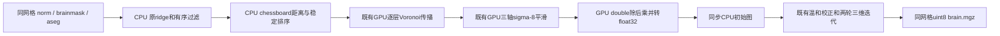
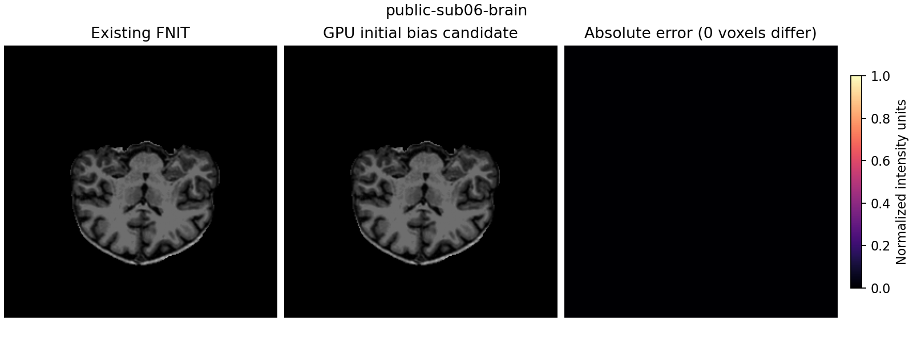

# aseg 归一化初始偏场的 GPU 复用

## 1. 功能简介

第二次强度归一化的 CPU 初始偏场占据显著时间。本候选把它接入仓库已有的
`voronoi_fill_torch`、`smooth_bias_torch`，保留传播层次、邻居顺序、sigma-8、边界、
全零平滑控制图以及 double 除法后乘法再转 float32 的原规则。
默认 `initial_bias_backend="cpu"`，候选通过 `"torch"` 启用；不改变 ridge 和有序过滤。
空间距离和稳定索引排序仍用 CPU，传播、平滑和校正在目标 GPU。



## 2. Python 调用、输入输出与参数

```python
from fnit.recon_all.normalization import normalize_t1_aseg

report = normalize_t1_aseg(
    norm_file="/subjects/sub06/mri/norm.mgz",  # 同个体1mm conform网格的uint8强度
    aseg_file="/subjects/sub06/mri/aseg.presurf.mgz",  # 同网格整数解剖标签
    brainmask_file="/subjects/sub06/mri/brainmask.mgz",  # 同网格脑掩膜，非零为脑
    output_file="/results/sub06/brain.mgz",  # 同网格uint8输出，父目录须存在
    device="cuda:1",  # 显式GPU；不修改调用方当前设备或精度策略
    three_d_iterations=2,  # 原两轮完整更新，不跳步骤
    controls_neighbor_backend="torch",  # 已验证邻域候选，默认cpu
    initial_bias_backend="torch",  # 本页初始偏场候选，默认cpu
)
```

`norm_file`、`aseg_file`、`brainmask_file` 为三维 MGH/MGZ，shape 和 scanner RAS affine
须相同，affine单位毫米。输出保留norm头与网格，dtype为uint8，强度非标签。
返回dict含 `device`、`three_d_iterations`、两个backend、`ridge_seconds`、
`initial_bias_seconds`、`ridge`、`removed_controls`、`wm_peak`、`completion.steps`和
`total_seconds`。时间单位秒，嵌套父子项不可重复相加；外层完整API另外计入校验和读写。

- `device=None`：可用CUDA时选cuda:0，否则CPU；GPU候选拒绝CPU设备。
- `three_d_iterations=2`：仅0/1/2；本次完整回归固定2。
- `controls_neighbor_backend="cpu"`：cpu/torch，独立选择三维控制点邻域。
- `initial_bias_backend="cpu"`：cpu/torch，独立选择初始偏场；cpu保留完整旧路径。

内部 `apply_initial_aseg_bias(source, controls, *, backend="cpu", device=None)` 接受同shape
的(x,y,z)NumPy源强度与非零控制图，源图转float32，不负责文件或affine。
返回同shape CPU NumPy float32图；不修改输入。sigma固定8体素，110为原归一化目标强度。
GPU候选要求显式cuda:N；底层接口复用条件及字段见[既有归一化说明](NORMALIZATION.md)。
平滑必须传全零控制图；以真实controls恢复强度会改变aseg初始偏场的语义。

无效backend/设备、形状不符、空控制集或网格不符抛异常，读写和CUDA异常原样传播；
不静默回退、不开启FP16/BF16、不全局修改TF32。GPU初始图先同步下载，继续原迭代。

## 3. 命令行调用

```bash
fnit-normalize-aseg \
  --norm /subjects/sub06/mri/norm.mgz \
  --aseg /subjects/sub06/mri/aseg.presurf.mgz \
  --brainmask /subjects/sub06/mri/brainmask.mgz \
  --output /results/sub06/brain.mgz \
  --device cuda:1 --three-d-iterations 2 \
  --controls-neighbor-backend torch --initial-bias-backend torch
```

所有参数对应上表，打印返回dict。`apply_initial_aseg_bias`为内部步骤，没有独立CLI。
没有新增依赖；PyTorch/Triton、NumPy/SciPy、Numba和nibabel已在主页环境中声明。

## 4. 原软件调用

```bash
mri_normalize -seed 1234 -mprage -aseg aseg.presurf.mgz -mask brainmask.mgz norm.mgz brain.mgz
```

参考固定FreeSurfer源码 `d932c45b7941662ea380a05efef580568b98d41a` 的aseg初始化分支。
生产函数不启动上述命令。本轮比较已有FNIT实现，没有重新生成官方参考。

## 5. 当前真实数据精度、耗时和显存

公开ds000114 sub06/sub07的8次完整API均完成，最终不同体素0，最大/P99误差0；
shape/dtype、affine、MGH头、完整MGZ SHA一致。初始float32源图、控制图、输出以及
后续每轮source/control SHA和选择计数也全相同。小网格精度/设备/输入/TF32回归2/2通过。

| 输入 | CPU初始API两次 / 秒 | GPU初始API两次 / 秒 | 完整API中位数CPU→GPU / 秒 | 初始偏场中位数CPU→GPU / 秒 |
| --- | ---: | ---: | ---: | ---: |
| sub06 | 134.485 / 123.390 | 73.863 / 67.291 | 128.937→70.577 | 53.634→6.595 |
| sub07 | 119.862 / 148.260 | 88.285 / 76.627 | 134.061→82.456 | 52.122→5.803 |

完整第二次归一化观察加速1.827×/1.626×，时间缩短45.26%/38.49%；
初始偏场观察加速8.132×/8.982×，包含其CPU距离、排序、传输和SHA诊断。
共享负载下未改动ridge各次26.51–44.46秒，保留全部数据，不把上述比值当作稳定吞吐。
它现在是第二次归一化最主要的CPU热点。



图是原网格第三轴中间切片，没有重采样为标准解剖轴位；候选只替换初始偏场。

缓存关闭的ABBA中PyTorch统计不可用，NVML容器PID归属无法确认，进程峰值为null。
整卡上界最高32.229 GB含其他任务，请求采样间隔0.5秒，实际最大间隔12.96秒。
另外一次启用缓存的相同候选完整API输出同样全一致；allocated754,974,720字节、
reserved773,849,088字节。该单次API91.922秒只用于显存诊断，不据此评价缓存速度。
其整卡上界24.767 GB、实际最大间隔3.93秒，依然包含其他任务。
这些是独立阶段证据，原始T1整例合计显存/指标等效没有在本次阶段配对中验收。

[完整JSON、CSV、原件/发布件SHA和复现脚本](../../validation/recon_all/optimizations/20261009_normalization_initial_bias/README.md)
绑定实际加载的14个归一化模块、驱动和输入/输出SHA，不将0c8872b2祖先提交当作未提交v7覆盖的完整版本。

比较用同一A100-SXM4 80GB、显式GPU1、CPU亲和4–7、四线程及缓存关闭策略。
旧新两侧均使用已验证的GPU邻域，只替换初始偏场。完整文件API包含加载、检查、传输、
首次JIT、两轮更新和压缩写出；GPU初始化/导入、SHA收集与结果比较单列。
输入来自 `803aec50` 两例原始T1链的自产检查点，原brain只在计算完成后比较。
每次保留初始float32图、控制图、后续每轮source/control SHA和完整输出比较。
共享CPU/GPU负载与采样局限分别报告；不把局部阶段提速当作整例提速。

## 6. 更新和 benchmark 记录

- `0c8872b2`：GPU邻域两例first/second完整API16/16逐字节一致，初始偏场仍CPU。
- 本候选：复用已有GPU传播/平滑，单独保留初始zero-control与double校正规则。
- 冻结v4/v6保持不变；新v7只包含两个明确模块、验证脚本和测试，依赖只读复用冻结源。

原CPU实现仍用作当前诊断参考；原始T1整例和整体指标等效另外验收。

## 7. 参考文献和代码

- [FNIT初始aseg偏场](../../src/fnit/recon_all/normalization/normalize_aseg_source.py)、[完整第二次归一化](../../src/fnit/recon_all/normalization/aseg_pipeline.py)。
- [FreeSurfer固定源码](https://github.com/freesurfer/freesurfer/tree/d932c45b7941662ea380a05efef580568b98d41a)、`utils/mrinorm.cpp`。
- Fischl B. FreeSurfer. *NeuroImage*. 2012;62:774–781. [DOI](https://doi.org/10.1016/j.neuroimage.2012.01.021)。
