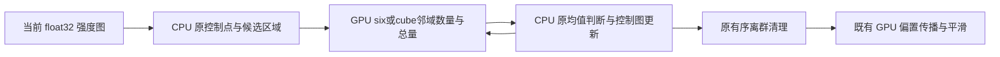
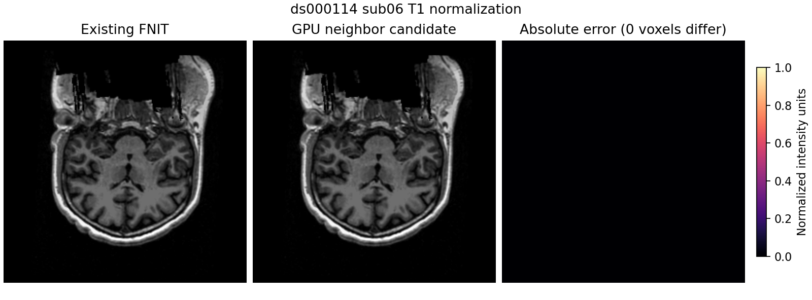

# 归一化控制点邻域的 GPU 缓冲复用

## 1. 功能简介

`normalize_t1` 和 `normalize_t1_aseg` 已使用 FNIT 的 GPU 偏置传播、平滑和强度校正。
本次复用它们的完整流程，只把三维控制点扩展中重复的邻域统计接入 PyTorch/Triton。
固定源图与 ROI 在每个扩展阶段上传一次；当前控制图逐轮上传，数量/总量缓冲重复使用。
CPU 的组织峰值、阈值、逐轮扩展、终止条件和有序离群清理保持原规则。



默认仍为 `controls_neighbor_backend="cpu"`；`"torch"` 是显式候选。
这不是整条归一化都在 GPU 上，也不改变 recon-all 的默认调度。
第二次归一化默认的 ridge 和初始偏置仍使用已有 CPU 路径。
初始偏场另有独立显式候选，见[已有GPU偏场复用](NORMALIZATION_ASEG_INITIAL_GPU.md)。

## 2. Python 调用、输入与输出

```python
from fnit.recon_all.normalization import normalize_t1, normalize_t1_aseg

first_report = normalize_t1(
    input_file="/subjects/sub06/mri/nu.mgz",  # conform 1mm 网格的 uint8 强度图
    xfm_file="/subjects/sub06/mri/transforms/talairach.xfm",  # 同图像的 Talairach RAS 变换，单位毫米
    output_file="/results/sub06/T1.mgz",  # 同网格 uint8 强度图；父目录须存在
    device="cuda:1",  # 显式目标 CUDA 设备
    three_d_iterations=2,  # 保留原流程的两轮控制点/偏置更新
    diagnostic_dir=None,  # 正式计时不额外写诊断图
    controls_neighbor_backend="torch",  # 只迁移独立邻域统计，其余选择规则不变
)
second_report = normalize_t1_aseg(
    norm_file="/subjects/sub06/mri/norm.mgz",  # GCA 归一化 uint8 强度图
    aseg_file="/subjects/sub06/mri/aseg.presurf.mgz",  # 同网格整数分割标签
    brainmask_file="/subjects/sub06/mri/brainmask.mgz",  # 同网格脑掩膜，非零为脑
    output_file="/results/sub06/brain.mgz",  # 同网格 uint8 归一化脑强度图
    device="cuda:1",  # 显式 CUDA 设备；CPU ridge 和初始偏置保持原实现
    three_d_iterations=2,  # 同样保留两轮更新
    controls_neighbor_backend="torch",  # 复用相同 GPU 邻域实现
)
```

| 参数 | 含义、默认值与限制 |
| --- | --- |
| `input_file` / `xfm_file` | 第一轮的三维 uint8 MGH/MGZ 和配套 3×4 Talairach 变换文本；影像的 scanner RAS affine 单位毫米 |
| `norm_file` / `aseg_file` / `brainmask_file` | 第二轮的三维强度、整数标签、掩膜；shape 和 affine 必须逐项相同 |
| `output_file` | 同网格、同 MGH 头的 uint8 MGH/MGZ；不改变坐标空间 |
| `device` | `None` 默认有 CUDA 时选 `cuda:0`，否则 CPU；候选只允许 CUDA；本次均显式指定设备 |
| `three_d_iterations` | 默认 2，仅接受 0、1、2；性能/完整流程回归使用 2 |
| `diagnostic_dir` | 第一轮默认 `None`；目录非空时保存 `srcN.mgh`、`ctrlN.mgh`、`biasN.mgh`；诊断写出不混入本次性能表 |
| `controls_neighbor_backend` | 默认 `cpu`，仅可 `cpu` / `torch`；后者拒绝 CPU 设备，不静默回退 |

第一轮返回 dict 中的 `steps` 是具名步骤秒数，另含 `device`、`three_d_iterations`、
`controls_neighbor_backend`、`total_seconds`、`peaks`、`controls`、`propagation`、
`smoothing`、`three_d_passes`。第二轮返回 ridge/初始偏置秒数、控制点信息、
`completion.steps` 和 `total_seconds`。第二轮内部 `total_seconds` 从读头与网格校验后
开始；本页比较使用包含这些校验、读写和 CUDA 同步的外层完整 API 墙钟。
嵌套步骤不能与父阶段重复相加。

内部 `controls_3d(source, wm_peak=None, gm_peak=None, *, neighbor_backend="cpu", device=None)`
接受同网格 float32 NumPy 强度图；两峰任一未指定就重新估计两者。
返回同 shape uint8 0/1 控制图及选择计数/组织峰值 dict。GPU 邻域用 double 累加
原 float32 邻居，再存成 float32，与 SciPy 卷积的存储约定相同；最终强度仍为 float32，
没有 FP16/BF16。TF32 设置保持调用方策略，此算子不使用矩阵乘法。

`NeighborSumTorch(image, kernel, region, *, device)` 是该循环的内部上下文。
`image` 必须三维、有限、float32；`kernel` 只接受原 six 或 3³ 全1模板；
`region` 为三个非空、有界、步长1的 slice。每次 `context(control=...)` 接受当前 CPU
bool 控制图，返回 int16 数量、float32 总量 NumPy 视图；下次调用会覆写视图。
上下文固定源图版本，不能跨不同轮的强度图或 ROI 复用。邻域和 sigma 的单位是体素。

底层 `neighbor_sum(*, source, control, count, total, shape, start, six)` 由该上下文调用：
`source`为halo区域的CUDA float32张量，`control`为同shape uint8控制图；
`count`/`total`为核心ROI的预分配int16/float32输出张量，四者须连续且同设备。
`shape`为核心ROI三维长度，`start`为其相对halo的零起始体素偏移；
`six=True`使用六个轴邻居，`False`使用3³全部邻居。它只写输出缓冲，返回None，
内核异步提交；上层同步下载后才能在CPU消费。不改变空间或控制图。
这些受内部上下文约束的参数没有单独CLI，设备/内核错误向上抛出。

参数、维度、设备、网格或可用组织区域不符合要求时抛出异常；读写和 CUDA 错误原样传播。
Triton 内核进入目标设备作用域后恢复调用方当前设备，适用于已初始化另一 GPU 的 API。
输出图不含新标签语义，也不用于替代 WM/aseg 分割。

## 3. 命令行调用

```bash
fnit-normalize \
  --input /subjects/sub06/mri/nu.mgz \
  --xfm /subjects/sub06/mri/transforms/talairach.xfm \
  --output /results/sub06/T1.mgz \
  --device cuda:1 --three-d-iterations 2 --controls-neighbor-backend torch

fnit-normalize-aseg \
  --norm /subjects/sub06/mri/norm.mgz \
  --aseg /subjects/sub06/mri/aseg.presurf.mgz \
  --brainmask /subjects/sub06/mri/brainmask.mgz \
  --output /results/sub06/brain.mgz \
  --device cuda:1 --three-d-iterations 2 --controls-neighbor-backend torch
```

参数逐项对应上表，命令打印返回 dict。候选仅依赖主页环境已有的 PyTorch、Triton、
NumPy、SciPy、Numba、nibabel，没有新增安装依赖或调用外部软件。此阶段不读取权重或模板。

剖析命令使用 [完整文件 API 配对脚本](../../benchmark/recon_normalization_allocator.py)。
`--stage t1/aseg` 选择第一/二轮，`--cache disabled/enabled` 必须与解释器启动前的
分配器环境一致，`--source-dir` 指冻结源码的 `src`，`--mri-dir` 指自产检查点目录，
`--reference` 只在候选完成后比较，`--output-dir` 必须为新目录；`--device` 显式 CUDA、
`--threads` 默认4、`--code-commit` 配合实际源码 SHA 绑定版本。
`--controls-neighbor-backend` 默认 `cpu`。零体素/几何/头信息回归失败会保留 JSON 并报错。
脚本不清缓存、不修改生产默认，不把缓存关闭时的零计数当成零显存。

## 4. 原软件调用

```bash
mri_normalize -g 1 -seed 1234 -mprage nu.mgz T1.mgz
mri_normalize -seed 1234 -mprage -aseg aseg.presurf.mgz -mask brainmask.mgz norm.mgz brain.mgz
```

邻域上下文是 `MRInormFindControlPoints` 内部算子，没有独立官方 CLI。
参考固定 FreeSurfer 源码提交 `d932c45b7941662ea380a05efef580568b98d41a`。
本次速度对照为同输入的已有 FNIT CUDA 流程；没有重新生成上述官方参考。
历史官方阶段证据与[归一化功能页](NORMALIZATION.md)中的记录分开保留。

## 5. 当前真实数据精度、耗时与显存

公开 ds000114 的 sub06/sub07，A100-SXM4 80GB、同主机/设备1、CPU亲和4–7、
Torch/Numba/OpenMP/BLAS均4线程。输入为 `803aec50` 原始 T1 连续链的自产检查点。
基线绑定完整803源码；候选为该完整冻结包加本页归一化模块SHA覆盖，
报告中的0eb92099是候选祖先提交，不是尚未提交覆盖文件的完整版本。每个运行记录实际已加载源码SHA；
最终提交的代码须与这些SHA核对。参考文件只做结果比较，不作为算法输入。
完整 API 含校验、加载、H2D/D2H、首次 JIT/缓存加载、两轮更新及压缩写出，计时同步目标 GPU。
解释器/导入/CUDA初始化另计，不把此阶段配对当作原始 T1 整例提速。

缓存单独的 disabled/enabled/enabled/disabled 配对有12份完整输出，全部逐字节相同：

| 函数与输入 | 缓存关闭中位数 | 缓存启用中位数 |
| --- | ---: | ---: |
| 第一轮 sub06 | 94.477 s | 92.496 s |
| 第一轮 sub07 | 74.870 s | 72.016 s |
| 第二轮 sub06 | 106.047 s | 105.391 s |

这组收益较小；第一轮157/209次 CPU 邻域统计占33–50秒。
第二轮的 CPU ridge 为26–30秒，初始偏置31–38秒，邻域15–17秒。
不能把这里的冷文件 API 秒数与原始链内已加载/共享 JIT 的阶段秒数直接比较。

缓存关闭的 CPU→GPU→GPU→CPU 完整 API 配对：

| 函数与输入 | CPU邻域两次 / 秒 | GPU邻域两次 / 秒 | 中位数 CPU→GPU / 秒 |
| --- | ---: | ---: | ---: |
| 第一轮 sub06 | 93.348 / 98.695 | 49.908 / 47.326 | 96.022→48.617 |
| 第一轮 sub07 | 75.502 / 66.406 | 38.697 / 42.453 | 70.954→40.575 |
| 第二轮 sub06 | 131.088 / 63.003 | 101.508 / 73.917 | 97.045→87.712 |
| 第二轮 sub07 | 101.140 / 121.347 | 105.212 / 99.468 | 111.243→102.340 |

第一轮观察加速分别为1.975×、1.749×，完整API时间分别缩短49.37%、42.82%。
第二轮 sub06 的未改动CPU ridge由31.71变为11.13秒，初始偏置48.04变为18.79秒，
四次负载/JIT情况波动明显；其9.62%的中位缩短不能视为稳定整步提速。
GPU邻域本身包含上传、内核、同步下载，sub06第一轮209次由约49秒降至3.83/1.90秒，
第二轮159次降至2.16/0.41秒。CPU组织峰、阈值、动态扩展和有序更新保持原规则。

上述16次输出均0差异体素、最大/P99误差0、shape/dtype、affine、MGH头和完整MGZ文件SHA一致。
每轮float32输入、uint8控制图SHA以及选择计数在四次调用间完全相同。
nearest边界、六邻域/3³模板、缓冲覆写、动态反馈、初始化CUDA0后目标CUDA1的回归4/4通过。
初版设备作用域失败日志也保留，不能把该失败算作通过的真实数据测试。



图为公开输入原网格第三轴中间切片；右图为绝对误差，没有把原网格重采样或声称标准轴位。

额外两次启用缓存的候选诊断中，第一轮 allocated/reserved 为822,088,192 / 824,180,736字节，
第二轮为721,424,896 / 773,849,088字节。这两次仅补充分配统计，没有独立缓存ABBA，
不据其30.539 / 48.272秒的单次低负载API时间宣称缓存收益。
关闭缓存时计数不可用。NVML进程树在容器中无法确认宿主PID归属，进程峰值为null。
GPU邻域ABBA的整卡上界最高33.007 GB，包含其他任务；请求采样间隔0.5秒，实际最大间隔
首组最高29.41秒，sub07第二轮补测最高35.20秒。额外显存诊断的整卡上界最高11.469 GB，最大间隔12.08秒，也不是连续峰值。
原始 T1 整例提速、合计显存及整体指标等效仍由协调者单独验收。

## 6. 更新与 benchmark 记录

- `803aec50`：本次固定原流程；12次分配缓存剖析，完整输出0差异。
- 邻域初版：小网格测试发现张量 cuda:1 与 Triton 当前 stream cuda:0 不一致，
  保留失败日志；修复仅进入目标设备作用域，恢复父设备，不全局设置精度。
- 当前候选：源图/邻域缓冲复用、相同循环接入，默认仍CPU；GPU边界、动态反馈、
  已初始化其他设备的回归与完整文件配对见[机器可读报告](../../validation/recon_all/optimizations/20261009_normalization_neighbors/README.md)。

已有控制点选择、CPU参考与偏置 GPU 实现仍承担验证作用，没有删除或复制参考文件补结果。
本次冻结同输入阶段不替代连续整例；sub07第二轮在当前自产检查点生成后补齐4次，
同样完整文件SHA和每轮控制图均一致。两例均只对冻结同输入算子作结论。

## 7. 参考文献与代码

- [FNIT 归一化实现](../../src/fnit/recon_all/normalization/pipeline.py)、[aseg 归一化](../../src/fnit/recon_all/normalization/aseg_pipeline.py)。
- [FreeSurfer 固定源码](https://github.com/freesurfer/freesurfer/tree/d932c45b7941662ea380a05efef580568b98d41a)、`utils/mrinorm.cpp`。
- Fischl B. FreeSurfer. *NeuroImage*. 2012;62:774–781. [DOI](https://doi.org/10.1016/j.neuroimage.2012.01.021)。
