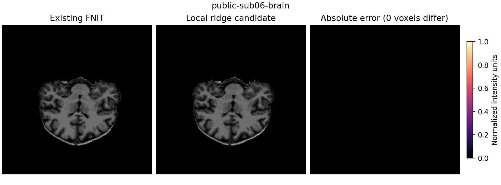

# aseg归一化：保留有序传播，省去未读取的远背景

## 1. 功能简介

第二次归一化的medial ridge只需要WM内部距离和外侧一个体素的26邻域。
原实现却先传播完整背景，处理约一千六百万体素，再提取控制点。
`medial_ridge_local`复用原Numba堆，在所有必要背景点已settled后结束外侧传播；
WM内侧仍完整传播，非极大值选择与有序异常点过滤不变。
这是CPU消费范围优化，没有将有序堆改成并行Jacobi，也没有重新实现距离算法。
通用 `signed_distance` 的完整场语义和默认调用保持原样。


消费范围的依据：

1. WM边界的轴向相邻点由原初始化固定为0.5；未初始化的内侧点六个轴向邻居都在WM中。
   因此内侧试探值不会读取远处背景距离。
2. 非极大值选择只处理距离至少1的点。梯度由轴向一个体素差分得到；
   分母为绝对值最大的分量，所以三个位移分量均位于[-1,1]。
3. 双向采样的floor/ceil角点因此只在当前点的26邻域内。整数采样、边界夹取
   以及越界返回-1均不增加有效网格读取范围。
4. 以WM的3×3×3最大过滤结果确定外侧查询。堆完全复用原同分顺序和动态更新，
   每个query在状态变为settled后不再被更新；提前结束只省略后续未消费的传播。

真实回归同时比较全部WM和查询带的float32距离，以及ridge、删除图、控制图和完整brain。
远处背景并未计算，不能把局部辅助图称为完整有符号距离场。

## 2. Python调用、输入输出与参数

```python
import nibabel as nib
import numpy as np
from fnit.recon_all.normalization.normalize_ridge_local import medial_ridge_local

aseg_image = nib.load("/subjects/sub06/mri/aseg.presurf.mgz")  # 个体1mm conform网格
aseg_labels = np.asarray(aseg_image.dataobj)  # XYZ数值标签；MGH可用float32存储整数
ridge_mask, ridge_details = medial_ridge_local(
    aseg=aseg_labels,  # 2/41为双侧WM；不输入官方结果
)
```

- `aseg`：非空三维NumPy数值标签，各维至少2；接受整数或保存整数标签的float32。
  2/41按原精确标签比较识别。调用方保证1mm conform网格，函数不处理affine或重采样。
- `ridge_mask`：同shape CPU NumPy uint8，0/1为候选控制点，不修改输入。
- `ridge_details`：`marching`记录两pass的(alive,实际processed)，`ridge_voxels`为候选数，
  `outside_query_voxels`为必要背景查询数，`marching_backend="local-consumer"`说明限域。
  processed计数与完整距离场不同，不能写成原完整场访问数。

内部 `ridge_required_distance(aseg=...)` 返回同shape CPU float32辅助距离和计数。
距离单位体素；WM和外侧查询带是完整结果，远背景为负limit哨兵。
图像scanner RAS毫米affine、网格、标签语义和顺序不变。
参数只有aseg，没有可调距离截断阈值，不按被试设置常数。
无效维度/dtype或查询未settled抛异常；不静默回退。无新依赖。

## 3. 命令行调用

本函数是内部算子，没有生产独立CLI。先用明确的冻结源码和自产输入运行同输入回归：

```bash
python benchmark/recon_normalization_ridge_local.py \
  --mode stage \
  --source-dir /frozen/baseline/src \
  --ridge-overlay /frozen/candidate/src/fnit/recon_all/normalization \
  --mri-dir /subjects/sub06/mri \
  --output-dir /results/new-sub06-ridge \
  --code-commit ACTUAL_CANDIDATE_COMMIT \
  --threads 4 --repetitions 2
```

`source-dir`是只读对照依赖；`ridge-overlay`仅装载明确两个ridge文件；
`mri-dir`需同网格norm/brainmask/aseg.presurf；`output-dir`必须尚不存在；
`code-commit`绑定实际版本并另记源码SHA；`threads`固定CPU总预算；
`repetitions`第一次含JIT，其后暖调用。API模式委托已有归一化计时/显存驱动，
包含文件加载、完整反馈和写出，不复制实现。

## 4. 原软件调用

```bash
mri_normalize -seed 1234 -mprage -aseg aseg.presurf.mgz -mask brainmask.mgz norm.mgz brain.mgz
```

`MRIdistanceTransform`和medial ridge属于该命令内部步骤，没有独立CLI。
参考固定FreeSurfer提交`d932c45b7941662ea380a05efef580568b98d41a`；生产不调用命令。
本轮主要回归原有FNIT完整算法，没有重新生成官方输入或将参考插入生产。

## 5. 当前真实数据精度与耗时

本轮冻结公开OpenNeuro ds000114 sub06/sub07自产的norm/brainmask/aseg.presurf，
同A100主机、CPU亲和4–7、四线程；CPU计时不占GPU。初始剖析显示：

| 输入 | 原外侧传播三次 / 秒 | 原内侧传播三次 / 秒 | 非极大值 / 秒 | 有序过滤 / 秒 |
| --- | --- | --- | --- | --- |
| sub06 | 28.331 / 29.060 / 17.836 | 1.346 / 0.872 / 0.428 | 0.032–0.055 | 0.134–0.158 |
| sub07 | 16.429 / 16.258 / 16.012 | 0.384 / 0.447 / 0.312 | 0.028–0.036 | 0.116–0.124 |

第一次包括缓存加载或JIT，全部观察值保留，共享负载未固定。
背景分别处理16,158,505与16,227,609体素，是真正热点。
限域同输入回归4/4通过：WM和实际采样带752,491/664,231个float32距离全部逐位
相同，ridge、控制图、删除图和WM峰也一致。外侧实际处理体素分别降到179,549/156,319，
内侧传播计数不变。预加载数据的完整ridge+过滤由25.157/11.584降到1.347/1.408秒，
另一例由23.691/12.593降到1.395/1.505秒；首次缓存/JIT和暖调用分别保留。

随后完整第二次归一化按full→local→local→full执行；旧新两侧都启用已有GPU邻域和初始偏场：

| 输入 | full完整API两次 / 秒 | local完整API两次 / 秒 | 完整API中位数full→local / 秒 |
| --- | --- | --- | --- |
| sub06 | 40.523 / 79.602 | 38.367 / 39.549 | 60.063→38.958 |
| sub07 | 62.740 / 56.666 | 30.340 / 37.554 | 59.703→33.947 |

8/8完整MGZ逐字节一致，最大/P99误差0，dtype/shape/affine/MGH头一致；初始float32和
后续每轮source/control SHA及选择细节全相同。观察到完整API缩短35.14%/43.14%，
共享CPU/GPU负载和baseline传播波动保留；不据此宣称稳定吞吐或原始T1整例收益。
计时包括校验、读取、传播、搬运、完整反馈和压缩写出；导入/GPU初始化及结果比较另计。
默认完整距离接口额外9种小网格的所有体素/计数兼容测试1/1通过，限域4项测试通过。



图是原网格第三轴中间切片，没有重采样为标准解剖轴位。
单次缓存启用显存诊断同样输出逐字节一致，allocated754,974,720、reserved773,849,088字节；
只用于显存，不用于缓存性能结论。缓存关闭统计不可用，NVML宿主PID归属不明，
进程树峰值null，整卡上界包含其他任务，不能作为自身显存或整例20GB验证。
[完整JSON、SHA、CSV、脑图和复现脚本](../../validation/recon_all/optimizations/20261009_normalization_ridge/README.md)
绑定实际冻结v4/v7依赖及v10两文件覆盖；没有新的官方重复运行或原始T1整例证据。

## 6. 更新与benchmark记录

- 完整场Numba路径保留为当前诊断参考；没有删掉通用距离功能。
- 新限域候选只改变外侧停止条件，原堆和更新函数共享，默认调用仍完整。
- 小网格测试覆盖随机非立方、边界/断开/孔洞、空WM与全WM、float32存储及输入不变。
- 本轮阶段、完整归一化和原始T1整例分别报告；两例整例由协调者验收。

## 7. 参考文献和代码

- [FNIT完整有序传播](../../src/fnit/recon_all/normalization/normalize_aseg_ridge.py)、[限域消费](../../src/fnit/recon_all/normalization/normalize_ridge_local.py)。
- [FreeSurfer固定源码](https://github.com/freesurfer/freesurfer/tree/d932c45b7941662ea380a05efef580568b98d41a)、`utils/mrinorm.cpp`。
- Fischl B. FreeSurfer. *NeuroImage*. 2012;62:774–781. [DOI](https://doi.org/10.1016/j.neuroimage.2012.01.021)。
- [OpenNeuro ds000114，CC0](https://openneuro.org/datasets/ds000114)。
