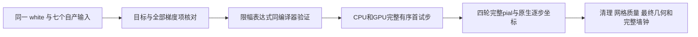
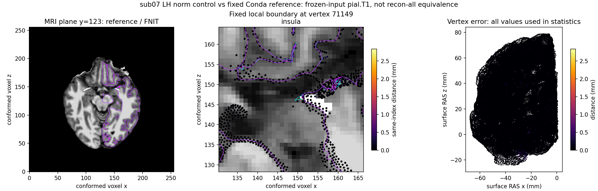
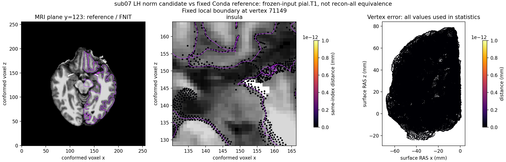

# pial 步长限幅的浮点规则与真实回归

## 1. 功能

`unconstrained_step_with_offsets()` 将当前坐标与梯度转换为限幅后的试步。
它由已有完整 Python white/pial 复用，不做碰撞判断、表面清理或文件复制。
生产 recon-all 的 white/pial 默认仍使用独立 Conda 源码构建程序。

本次修复一个成熟子函数的数值语义错误：原函数对 float32 范数平方和先升
float64 再开方；固定源码及其实际编译器的 `sqrt(float)` 先返回 float32，
随后赋给 double 范数并计算限幅比例。前者使真实首步 1,417 个坐标元素
相差至多 0.0000076294 mm，后续退化局部的法向变化会放大误差。



## 2. Python 调用与数据结构

```python
from fnit.recon_all.place_surface_step import unconstrained_step_with_offsets

proposal, offsets = unconstrained_step_with_offsets(
    vertices=vertices,       # (N,3) float32，surface RAS，单位mm
    gradient=gradient,       # (N,3) float32，当前完整梯度
    ripped=ripped,           # (N,) bool，True为固定顶点
    dt=0.5,                 # 无量纲优化步长，默认0.5
    max_mm=0.3,              # 每顶点最大试步长度，默认0.3mm
)
```

返回两个 `(N,3)` float32 数组：`proposal` 是坐标舍入后的终点，
`offsets` 是加入坐标之前的限幅位移。固定顶点保留原坐标并返回零位移。
输入会转换为上述类型；此内部函数不检查所有形状和范围，调用方须提供
相同顶点数、有限坐标及梯度和非负限幅。类型转换失败会传播TypeError或
ValueError；Numba默认没有越界检查，非法形状不能依赖稳定异常，不读取或写出影像。
完整 API 的失败条件、七个输入和输出表面见
[pial 放置说明](PYTHON_PIAL_PLACEMENT.md)。不增加低精度、近似碰撞或新依赖。

## 3. 命令行与诊断工具

内部限幅没有独立官方 CLI。真实回归通过完整 pial API 运行：

```bash
# 固定源码目录须直接包含place_pial_python.py；原生参考仅在API结束后比较。
CUDA_VISIBLE_DEVICES=2 OMP_NUM_THREADS=4 OPENBLAS_NUM_THREADS=4 MKL_NUM_THREADS=4 \
python validation/recon_all/python_gpu_port/benchmark_pial_norm_fix.py \
  --subject /data/fnit/sub07 \
  --source-directory /data/frozen-code/fnit/recon_all \
  --reference-surface /data/benchmark/native/subject/surf/lh.pial.T1 \
  --output-directory /data/runs/pial-norm-fix-candidate \
  --hemisphere lh --variant candidate --device cuda:0 --threads 4 \
  --source-base-commit ACTUAL_SOURCE_BASE_COMMIT
```

subject、冻结源码目录、原生参考表面、新输出目录、variant 和源码基线必填；
hemisphere 默认 lh，device 默认 cuda:0，threads 默认4。CUDA目标必须明确，
TF32开启，不使用半精度。输出为完整 pial 表面和 JSON，包含四轮 trial、
每步坐标 SHA、分项墙钟、输入及源码 SHA、allocated/reserved峰和原生几何误差。
目录已存在会报错；优化或最终 source 相交门失败会保留失败报告并抛异常。
完整 API 计时包括校验、影像读写、传输及同步，CUDA初始化另计。

透明诊断工具包括：

| 工具 | 输入 | 输出与限制 |
|---|---|---|
| `native_probe_build.py` | 固定 CMake source/build、复制 TU、新对象/程序路径 | 复用原编译器、宏、优化参数及静态库；支持 Make/Ninja，不改原构建；缺少或未展开参数报错 |
| `build_place_surface_first_iteration_probe.py` | source/build/out、iterations默认1 | 诊断main对象/程序及构建SHA；本次iterations显式100，与原生默认一致 |
| `build_place_surface_optimizer_probe.py` | source/build/main-object/out、capture-through、basic-terms-only | 只插入各项状态写出；每步单独保存目标强度与sigma，不截断本次39步运行 |
| `diagnose_pial_first_difference.py` | 原生probe、自产subject、冻结Python源码、稳定原生参考、assets及新输出目录 | 私有逐步float32坐标/法向/目标/梯度和JSON；先要求probe最终坐标及有序面0差异 |
| `build_placement_norm_expression_probe.py` | 固定source/build及新out目录 | 使用原TU headers/flags编译小型表达式诊断；不是表面阶段替代程序 |
| `replay_pial_norm_first_trial.py` | 带哈希原生/Python检查点、subject、候选源码、device/threads、新JSON | 完整CPU/GPU有序首试步对原生；先核对梯度和同编译器位移完全一致 |
| `collect_pial_first_difference.py` | 完整原生/Python诊断目录、表达式与首试步收据、新JSON | 只读汇总39步；不修改冻结报告，也不输出原生私有日志内容 |
| `benchmark_pial_native_repeat.py` | subject、声明的native-binary/assets、新输出目录、hemisphere/threads | 两次新隔离目录原生输出及SHA/完整CLI时间/重复性；日志保留私有目录 |
| `publish_pial_norm_receipts.py` | run-root、新的output JSON | 汇总原报告及SHA；删除私有路径、主机和逐PID记录，完整私有采样不修改 |

复制的上游源码、影像、检查点和构建命令中的私有路径不放入Git。
各工具的 `--help` 提供全部具名参数；已存在输出目录/文件不覆盖。
`--existing-native-diagnostic-directory` 可复用输入、程序、参考 SHA 完全一致
且完整几何通过的原生检查点，仅供诊断。Python每步NPZ保留 `(N,3)` float32
surface RAS/mm坐标、法向、梯度及 `(N,)` bool固定mask/float32目标强度与sigma。

## 4. 对应原生步骤

完整命令与生产参数见 [pial 的原软件调用](PYTHON_PIAL_PLACEMENT.md)。
本函数对应 `mrisAsynchronousTimeStep_update_odxyz()` 中的试步限幅；
有序碰撞继续使用既有完整候选及 live MHT，保留接受次序、拒绝状态及清理。
本机参考是固定源码独立 Conda 构建，不把它称为本机官方发行版 benchmark。
本次表达式使用该构建的编译器、TU头文件和优化参数。旧GDB冻结fixture对应
double开方公式，本次fixture按实际Conda TU重测更新；系统官方发行程序及
不同headers/flags的跨环境结果应单独比较，不外推所有官方版本。

## 5. 最新真实精度与时间

公开 ds000114 的 sub07 自产 final white 及七输入，LH有114,247个顶点。
本机 A100、四线程、TF32开启、无半精度。原生双重复坐标/有序面一致，
透明probe完整四轮最终几何也与该参考0差异。

- 修复前首步：目标、sigma、法向及六项梯度检查全部0差异；首次差异在接受坐标。
- 相同 compiler/headers/flags 的表达式：float sqrt规则的全部范数与位移0差异；
  旧double sqrt有108,442个范数、82,452个位移元素不同，位移最大2.98×10⁻⁸ mm。
- 修复后完整首试步：CPU树路径与GPU完整候选/compiled路径均与原生坐标0差异。
- LH两次完整候选：四轮39个接受状态坐标SHA全部与原生一致；最终坐标、有序面
  0差异，mean/P99/max均0。清理14→0、23顶点、100次SOAP，也与原生一致。
- 修复前完整结果：平均0.004235 mm、P99 0.084470 mm、最大2.838423 mm，
  901顶点超过0.1 mm。该旧误差是本次明确修复的累积误差，不能称为无影响尾差。

完整同输入结果如下。原生双重复均有相同坐标及有序面；表面文件中的描述头
可不同。阶段时间包含输入校验、加载、传输与读写，CUDA初始化另计。

| 公开T1/半球 | 修复后完整pial/API秒 | 实际接受步数 | 原生独立重复/秒 | 最终mean/P99/max坐标误差 |
|---|---:|---:|---:|---:|
| sub07/LH | 229.349、248.342 | 39 | 141.031、138.214 | 0/0/0 mm |
| sub07/RH | 245.762 | 40 | 154.267、147.891 | 0/0/0 mm |
| sub06/LH | 317.708 | 44 | 196.489、250.511 | 0/0/0 mm |
| sub06/RH | 313.509 | 43 | 199.468、207.129 | 0/0/0 mm |

sub07 LH完整BAAB中，旧API中位230.530秒、新API中位238.846秒，观察增加
3.61%。目标卡同期占用从3,850 MiB上升至40,972 MiB，含其他进程；这是共享
负载观察，不能作为稳定性能变化的归因。当前GPU候选仍比上述原生pial慢，
生产默认保持原生。四侧最终source相交计数均为0，输入SHA在执行前后不变。

同一子函数由完整white.preaparc复用。在sub07自产orig上，旧版34步/API
393.967秒，对原生mean0.019287、P99 0.158262、max1.207718 mm，3,012顶点
超过0.1 mm；修复后33步/API374.650秒，最终坐标及有序面0差异。两版预处理
MRI均与原生逐体素一致。当前同输入原生双重复500.977/521.503秒、几何一致，
同样是共享负载下完整阶段观察，不能套用此前另一冻结输入的188–235秒。

公开机器可读[完整收据](../../validation/recon_all/optimizations/20261010_pial_step_rounding/complete_report.json)
保留各原始报告SHA、七输入及实际导入源码SHA、逐步接受记录、数值与采样汇总。
该结果是固定同输入几何复现；本轮修复未接入原始T1整例，整体指标等效未判定。
allocated峰706,536,960字节、reserved峰2,908,749,824字节；进程树外部采样
归属未解析时为null。前两次目标卡3,850 MiB是同期总占用上界，后续其他项目
增加占用不能归给FNIT；不能把PyTorch峰当作整例或进程树20 GB验收。

修复前脑图保留于pial说明页，绑定v13/v14的真实局部误差；本次完成的
39步逐坐标检查不使用旧图作为修复后证据。下列新图使用相同参考顶点71149
对应的MRI平面；全体顶点进入统计，显示位置不影响算法或验收。




## 6. 更新与证据版本

- v13：完整GPU候选与compiled有序MHT；对优化前Python0差异，原生误差尚存在。
- v14：完整source Torch清理；保留上述原生误差。
- v15：透明原生39步诊断；定位第1步限幅错误，比第19步日志RMS分歧更早。
- v16：仅修复成熟 `_step` 开方晋升顺序，既有碰撞和清理不变；首试步和LH
  两例四侧最终几何、LH两次完整39步及完整preaparc同输入回归已通过。
  最终white的独立注释/rip-surface分支另行验证，不把preaparc当作最终white。

首次诊断的源码目录多写一层而失败，后续校验为目录必须直接含阶段模块；
该失败保留。另一个诊断变量原为原地更新的接受位移缓冲区，不是原始梯度；
最新collector从不可变分项数组重建正确梯度，旧报告未改标。

## 7. 原始代码与参考文献

- [固定 FreeSurfer 源码的时间步函数](https://github.com/freesurfer/freesurfer/blob/d932c45b7941662ea380a05efef580568b98d41a/utils/mrisurf_timeStep.cpp)。
- [固定 pial 调度及默认参数](https://github.com/freesurfer/freesurfer/blob/d932c45b7941662ea380a05efef580568b98d41a/mris_make_surfaces/mris_place_surface.cpp)。
- [PyTorch与完整放置参考文献](PYTHON_PIAL_PLACEMENT.md)。
