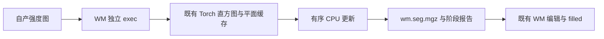

# recon-all 的阶段缓存与计时

## 1. 功能简介

GPU 实现频繁创建临时张量时，关闭 CUDA 分配缓存会增加运行时间。本轮将完整 GCA、WM 的缓存放在独立 exec 子进程中，子进程结束后释放资源；父进程已有的低显存策略和精度设置保持。计算复用现有函数，必要的有序 CPU 反馈保留。WM 为可选接入，默认仍使用独立 Conda 构建的程序。



这只是标准流程中 WM 阶段的执行方式。它不代表完整纯 GPU recon-all 已通过验收。

## 2. Python 调用和输入输出

```python
from pathlib import Path
from fnit.recon_all.native_free import run_recon_all_python

reconstruction_report = run_recon_all_python(
    t1=Path("input/T1w.nii.gz"),  # 原始三维单 T1，不读取官方结果
    subject_dir=Path("output/subject"),  # 新建空目录，连续生成全部标准输出
    weights_dir=Path("resources/weights"),  # 已核对 SHA-256 的模型权重
    assets_dir=Path("resources/assets"),  # 已声明的图谱、模板和 LUT
    native_bin_dir=Path("environment/bin"),  # 固定源码在 Conda 内独立构建的程序
    device="cuda:0",  # 显式逻辑设备，遵循 CUDA_VISIBLE_DEVICES
    threads=4,  # 被试总线程预算
    wm_backend="torch-optimized",  # 复用完整 WM，保持有序更新
    wm_execution="isolated",  # 仅子进程开启缓存，父 CUDA 状态保持
    normalization_controls_backend="torch",  # 两轮复用GPU邻域缓冲，不改变有序选择
    normalization_initial_bias_backend="torch",  # 第二轮复用GPU传播/平滑；原除乘/输出精度保持
    profile_stages=True,  # 阶段首尾同步并记录完整墙钟，生产默认 False
)
```

新增 `wm_execution` 默认 `'in-process'`；`'isolated'` 必须与 `wm_backend='torch-optimized'` 同用。单例、batch 和 CLI 含义相同，其他参数见[完整参数表](README.md)。默认 `wm_backend='native'`，避免未经整例检查改变分割后续输入。

WM 读取自产 `mri/antsdn.brain.mgz`，写 `mri/wm.seg.mgz`。输入输出均为同一 conform XYZ 网格的三维 uint8 体积，affine 使用毫米；不会重采样。隔离模式增加 `scripts/wm-isolated.json`，记录源强度、输出和模块 SHA-256，实际设备、线程、TF32、分配缓存策略，以及完整 exec 秒数。完整重建仍返回标准路径清单和执行、输出完整性、网格检查等状态。

参数组合非法在创建输出前抛 `ValueError`；读取、计算、写出与子进程错误向上传递，不退回原生程序。WM worker 要求新输出和报告路径。TF32 默认开启，无 FP16/BF16。

报告增加 `stages[*].algorithm_substep_seconds`：保留已有函数的顶层秒数、`steps`、`completion.steps`，例如初次归一化的控制点/传播/平滑，以及第二次归一化的 ridge/初始 bias/后续迭代。来源路径保留，内部计时可能异步或嵌套，不与阶段墙钟相加，也不额外同步 GPU。

`normalization_controls_backend` 默认 `'cpu'`；`'torch'` 复用现有两轮归一化的 PyTorch/Triton 邻域计数与求和。固定源图、ROI 和输出缓冲驻留 GPU，控制图按原迭代上传；有序控制点选择、离群清理、ridge 和其他偏置步骤保持原实现。仅接受显式 `cuda:N`，非法组合在校验资源或创建输出前报错，无静默 CPU 回退。单例、batch、CLI 和整例 benchmark 原样传递选项，报告增加 `normalization_configuration`。函数的全部输入、uint8 同网格输出、内部接口及坐标说明见[归一化 GPU 邻域](NORMALIZATION_GPU_NEIGHBORS.md)。新增依赖为零，使用主页环境既有 Triton。

`normalization_initial_bias_backend` 默认 `'cpu'`，`'torch'` 只在第二轮复用已有 Voronoi 传播和高斯平滑。距离和稳定排序仍为 CPU；零控制图平滑、float64 的除后乘及 float32 返回保持。它独立于邻域选项，同样须显式 `cuda:N`，失败不回退。完整第二轮 API 的两例 ABBA 中位数128.937→70.577秒、134.061→82.456秒，8次输出和所有中间浮点/控制图一致；这组测量两边都使用GPU邻域，只改变初始偏置。新接线的整例尚未完成，完整输入、输出、逐项参数、脑图和显存范围见[初始偏置GPU页](NORMALIZATION_ASEG_INITIAL_GPU.md)。

```python
from fnit.recon_all.stage_metadata import extract_algorithm_seconds

step_times = extract_algorithm_seconds(
    result={"steps": {"smoothing_seconds": 3.0}},  # 原函数已有计时字典，单位秒
)
# 返回 {"steps/smoothing_seconds": 3.0}；不修改输入，不读取图像。
```

该报告函数没有坐标空间；非字典返回空字典，布尔值、负值和非有限计时跳过。它不建立整例性能结论。

## 3. 命令行调用

```bash
# 输入原始 T1 和新输出目录；使用已安装的 FNIT 资源。
python -m fnit.recon_all.native_free input/T1w.nii.gz output/subject \
  --weights-dir resources/weights \
  --assets-dir resources/assets \
  --native-bin-dir environment/bin \
  --device cuda:0 \
  --threads 4 \
  --wm-backend torch-optimized \
  --wm-execution isolated \
  --normalization-controls-backend torch \
  --normalization-initial-bias-backend torch \
  --profile-stages
```

`tools/benchmark_recon_torch_end_to_end.py` 接受相同的 WM 和归一化邻域选项，原始 T1 加空目录运行，记录解释器启动、加载、传输、读写和进程树显存。`--output-root` 必须不存在；失败保留检查点，不补跑。内部报告提取函数没有独立 CLI。

已完成整例的评估入口为 `tools/evaluate_recon_torch_run.py`，复用原比较器，不重新运行生产：

```bash
# 所有路径为 benchmark 配置，官方结果只供比较。
python tools/evaluate_recon_torch_run.py \
  --benchmark runs/candidate/benchmark.json \
  --source-root frozen/generator \
  --reference-root benchmark/reference_pair \
  --case ds000114_sub-06 \
  --driver validation/recon_all/optimizations/20261002_parallel/compare_whole_cases.py \
  --scripts-dir validation/recon_all/python_gpu_port \
  --label-table resources/assets/FreeSurferColorLUT.txt \
  --output runs/candidate_vs_official \
  --threads 4
```

前三路径分别为实际完成的整例收据、实际冻结源码和带 `TRANSFER_MANIFEST.private.json` 的已校验官方目录；`case` 必须绑定相同原始 T1 的 SHA。`driver` 与 `scripts-dir` 为原比较器，`label-table` 为标签语义 LUT，`output` 必须是新目录，线程默认且固定为4。运行状态不完整、源码哈希改变、输入错配时失败；计算/读写异常保留评估报告并传播。输出为 strict138、几何对应门、分区 Dice、逐脑区厚度/面积/体积、no-th3 统计、双向顶点到三角面距离、质量覆盖和脑图；体积单位 mm³、表面 surface RAS/mm，原网格不同不能同索引比较。它不制定整体等效阈值，单候选与官方比较也不能判定优化相对控制是否退化。

## 4. 官方参考调用

对应 WM 配方为 `mri_segment -wsizemm 13 -mprage antsdn.brain.mgz wm.seg.mgz`。官方命令只用于独立 benchmark。生产隔离 worker 不调用它。缓存策略和计时整理属于执行/报告实现，没有独立的 FreeSurfer 算法命令。

归一化分别对应 `mri_normalize -g 1 -seed 1234 -mprage nu.mgz T1.mgz` 和 `mri_normalize -seed 1234 -mprage -aseg aseg.presurf.mgz -mask brainmask.mgz norm.mgz brain.mgz`。邻域缓存是这些命令内部步骤，没有独立官方 CLI。

## 5. 当前真实数据证据

同 A100、四线程、两例公开 ds000114 T1 的完整 WM 文件接口结果：

| 数据 | Conda 原生 ABBA 中位数（s） | 缓存 GPU API ABBA 中位数（s） | 关闭缓存 GPU API 单次（s） | 隔离完整 API：未初始化父 / 已初始化父（s） |
| --- | ---: | ---: | ---: | ---: |
| sub-07 | 43.3871 | 23.6881 | 68.5310 | 34.6650 / 32.6214 |
| sub-06 | 50.5808 | 29.0407 | 85.2088 | 39.8800 / 35.2188 |

完整隔离 API 包含 exec、导入、哈希、初始化、图像读取/传输、全部计算、压缩写出及退出。隔离的四次测量为接口回归，不是 ABBA。四份图像与旧 cached GPU 输出 SHA 相同，体素差 0、Dice 1、头和 affine 相同；已有 GPU 对原生的 64/235 个 uint8 差异及 WM 掩膜差异仍保留，不能称原生逐位复现。

隔离子进程 allocated 峰值为 211–214 MB、reserved 为 254–258 MB。已初始化父进程保留 64,000,000 字节活跃张量，状态保持测试通过。容器 PID 无法映射宿主 NVML PID，父子同期归属显存为未知；整卡采样上界另列，不能用计数 0 代替显存，也不保证捕获连续尖峰。详细 JSON、采样和图像示例见 [WM 说明](WM_PLANAR_TORCH.md)与[完整报告](../../validation/recon_all/optimizations/20261009_wm_planar_torch/README.md)。

冻结 `803aec50` 的 sub-06 候选从原始 T1、新空目录连续完成，CLI 墙钟2255.064秒，138/138输出完整，双侧white/pial自相交为0、封闭网格检查通过；该候选仅改变GCA局部缓存/分块求逆及有序fill，尚未使用后续WM或N4实验。相同硬件/线程的该例控制以及sub-07配对仍在运行，整例实际提速暂未给出。官方参考来自既有FreeSurfer 8.2.0 d932c45，原始输入SHA相同，但生成主机与当前候选不同，历史秒数不能作为本轮配对速度。当前候选的完整独立比较已完成：严格6/138，68区厚度MAE0.044824mm；完整Dice、表面距离、white/pial相互穿越和脑图见[本次结果](../../validation/recon_all/optimizations/20261009_whole_a100_803aec50/README.md)。生产自相交门不覆盖所有相互穿越，扩展质量状态单列。以上阶段数据不等于整例提速；整体指标等效未判定。干净 Conda 安装/物理隔离部署尚未验收。新增执行入口只使用主页已声明的 Python/PyTorch/Numba/nibabel 依赖。

## 6. 最近更新和 benchmark

2026-10-09：显式接入两轮归一化的已有 GPU 邻域，入口契约24/24通过；首次测试夹具错误及修正收据完整保留于[接线报告](../../validation/recon_all/optimizations/20261009_normalization_integration/README.md)。两例完整首次文件 API 的 ABBA 中位数为96.022→48.617秒、70.954→40.575秒；共16次两轮 API 的输出、几何、逐轮强度/控制图及报告算法计数一致。第二轮邻域算子更快，但整体耗时波动，尚不能声称第二轮稳定提速。本次接线尚未完成原始T1整例回归；不能将旧803aec50整例改标为该接口的验证。完整数据及采样限制见[阶段报告](NORMALIZATION_GPU_NEIGHBORS.md)。

2026-10-09：复用完整隔离 WM worker，接入单例、batch、CLI 与整例测量脚本；保留默认后端。修复归一化 `steps` / `completion.steps` 在整例报告中丢失的问题，新增字段不改变计算、同步和原有计时。

本轮 frozen 同输入 GCA 证据见 [GCA 隔离执行](GCA_ISOLATED_TORCH_20261009.md)。各记录绑定实际执行提交/模块 SHA 和资源，不能把后续文档或接线提交改标成旧测试代码。

## 7. 原代码和参考文献

- [FreeSurfer mri_segment](https://github.com/freesurfer/freesurfer/tree/d932c45/mri_segment)
- [PyTorch CUDA memory management](https://pytorch.org/docs/stable/notes/cuda.html#cuda-memory-management)
- Fischl et al. (2002), *Whole brain segmentation: automated labeling of neuroanatomical structures in the human brain*, Neuron, 33:341–355.
