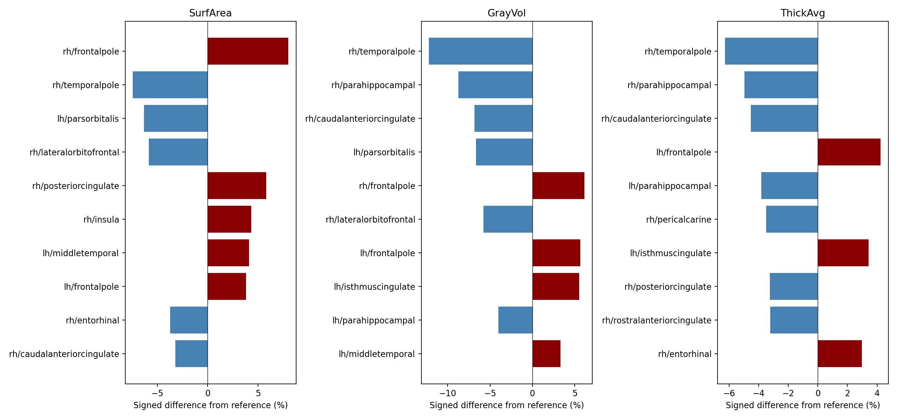
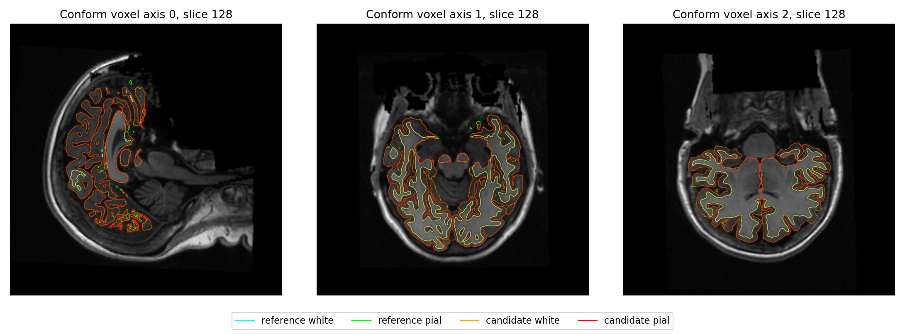

# 精度候选 3a：整例、OOM 恢复与官方对照

## 2026-10-07：九例完整官方比较已取回

冻结生产提交 `3a0c9aba6321b4981fd8174b4b191515459aa38b` 的原始T1执行及生产网格通过9/10，全部十例生成138项输出。完整18阶段官方比较已完成9/10；此前四例API只是allocator记录校验失败，新ed16评估工具已完成比较，没有重跑或覆盖原始重建。sub-10206左侧white/pial各16个独立相交面，保留失败状态，不能计为整例通过。

九例成功整例FNIT入口中位数2669.520秒，原官方中位数5839.091秒；逐例官方/FNIT比中位数2.248。这些是原始运行观测，本次未重做受控性能测量。自身父子同期采样峰6.143–13.571GB，连续显存峰与干净隔离部署均未验证。

68区aparc的厚度/面积/灰质体积MAE分别为0.013397–0.039662mm、19.911765–46.235294mm²、58.955882–159.308824mm³；最大单区厚度差0.221mm、面积差364mm²、体积差924mm³。aparc最低Dice在各例为0.79413–0.92162，a2009s最差0.64692；表面局部最大距离仍近6mm。这些差异不能统称浮点尾差。严格复现未通过，整体指标等效仍为`not_assessed`，未更改门槛。

[完整九例指标与耗时表](../../validation/recon_all/accuracy_20261003/runtime/server_refresh_20261007/README.md)包含逐脑区、逐标签、双向点到面距离、球面翻折和white/pial穿越；[机器报告](../../validation/recon_all/accuracy_20261003/runtime/server_refresh_20261007/public_summary.json)保留原始报告及程序绑定SHA。本地工作分支正在整合main@dbb64858，尚未从原始T1验证这个新的合并源码；上述MRI结果不会重标为合并版。


## 当前结果

实际计算源码为 `3a0c9aba6321b4981fd8174b4b191515459aa38b`，基于主线 `cc940273`；源码归档 SHA-256 为 `03cc806fb449a8620c8caa78b1af86dfaff6b64ab9e9e7c5210cf12184aa7f31`。2026-10-05现场读取实际完成回执和已结束队列：合并候选原始T1执行验收为 **9/10**、完整官方数值比较为 **5/10**。四例API比较仅在旧allocator记录校验失败；ed16评估工具已逐例通过原gpucw1完整来源、精度与网格预检，独立比较已启动。第十例sub-10206输出138/138齐全，末端左侧white/pial自相交验收失败。冻结基线和官方分别为8/10、10/10成功；没有按候选结果调整验收标准。

## 2026-10-05十例现场状态（历史快照）

下表为冻结3a从原始T1和空目录运行的入口墙钟，包含校验、加载、传输及读写。成功九例中位数2669.520秒；失败例耗时单列，不纳入成功例中位数。官方比较耗时独立记录，不并入生产耗时。

| 公开T1 | 入口秒 | 必需输出 | 生产网格 | 官方数值比较 |
| --- | ---: | --- | --- | --- |
| ds000114/sub-06 | 2948.559 | 138/138 | 通过 | 完成，严格6/138 |
| ds000114/sub-07 | 2656.930 | 138/138 | 通过 | 完成，严格7/138 |
| ds000030/sub-10159 | 2769.720 | 138/138 | 通过 | 独立重评估中 |
| ds000030/sub-10171 | 2669.520 | 138/138 | 通过 | 独立重评估中 |
| ds000030/sub-10189 | 2691.730 | 138/138 | 通过 | 独立重评估中 |
| ds000030/sub-10193 | 2988.228 | 138/138 | 通过 | 独立重评估中 |
| ds000030/sub-10206 | 3078.458，失败 | 138/138 | 左侧未通过 | 未执行 |
| ds000114/sub-04 | 2571.814 | 138/138 | 通过 | 完成，严格7/138 |
| ds000114/sub-05 | 2588.626 | 138/138 | 通过 | 完成，严格8/138 |
| ds000114/sub-08 | 2597.888 | 138/138 | 通过 | 完成，严格5/138 |

sub-10206末端white/pial各16个面涉及相交，是相交面数量，不是16个相交面对。其orig、white.preaparc、white、pial的坐标原始字节及有序面均与旧816基线相同；文件SHA差异来自几何区外的头尾字节。少量已绑定面对的精确诊断已证实white.preaparc保存阶段出现严格穿越，pial继续保留局部穿越；该诊断不替代全网格检测。原生清理在无进展超过15轮后可保留残余并成功返回，生产最终检查因此仍然必要。全部旧失败记录和零相交门槛保留。

完整官方数值比较完成不表示严格复现通过，也不表示整体指标等效；生产网格检查通过不代替sphere翻折和white/pial相互穿越检查。以下既有逐区、Dice与表面距离仍绑定实际3a结果。

[五例公开机器摘要及证据范围](../../validation/recon_all/accuracy_20261003/runtime/server_refresh_20261005/README.md)保存原队列SHA、逐例严格结果和可读取的详细指标。04、05、08的详细Dice、脑区偏差、表面距离及显存尚未成功取回，均标为`unknown`，不由严格文件通过数补推。

| 检查 | 实测 |
| --- | --- |
| 执行及输出 | complete，138/138 |
| 生产网格检查 | 双侧通过；white/pial 各自自相交 0 |
| 严格复现诊断 | 6/138，未通过 |
| 优化是否引入整体退化 | 未判定；源码间还包含其他主线变化 |
| 整体指标等效 | 未判定；正式整例等效阈值尚未确认 |

本候选复用已有实现，包含 SynthStrip 强度图原生 dtype 写出、CA 归一化 FP32 坐标累计、Python pial 终轮拒绝时的状态返回及图谱面积归约修正。SynthStrip 修复的是 pipeline 使用已有 PyTorch 函数后的写出契约，未改变网络前向；Python pial 的修正通过同输入回归，当前生产 pial 仍保留经 Conda 独立源码构建的实现。各项冻结源码、CPU 回归和真实阶段结果见[候选证据](ACCURACY_10_T1_20261003.md)。

## OOM 边界与实际恢复

原错误发生在 worker 首次 float32 标量分配、算法函数进入前。独立最小实验进一步定位到 CUDA 上下文建立；驱动内部为何返回 OOM 尚未确定。当前调度要求同批 worker 完成真实 CUDA 初始化并保持上下文，再通过 READY/GO 屏障开始算法；只允许可信的算法前 CUDA OOM 在限时内重新 exec，算法失败不重试。

本次最终表面组左右首次启动均失败，`operation_entered=false`；第二次均完成，每侧算法仅进入一次。四组共 8 次算法进入，保存 10 份启动响应。这是一次真实整例成功恢复，不是模拟结果。

故障 UTC 根据当前同机单调时钟锚回推；邻近整卡采样推导约 43.09 GB 空闲。原文件 mtime 锚不可信，已弃用。请求 2 秒的采样不能排除瞬时压力，也不能证明具体驱动资源原因。完整边界、时钟限制及逐进程证据见[恢复说明](../../validation/recon_all/accuracy_20261003/runtime/precision_candidate_3a_sub06_whole_metadata_v1/README_RECOVERY_V3.md)与[调度参数](CUDA_STARTUP_RESOURCE_WAIT.md)。

## 耗时与显存

两次 FNIT 和既有官方参考使用同一原始 T1、gpucw1、H100 GPU0、总线程 4。GPU 默认 TF32，保留已验证的局部 FP32 例外，无 FP16/BF16。现有分配缓存策略保持。

| 版本与范围 | 入口墙钟秒 | 自身父子同期采样峰字节 |
| --- | ---: | ---: |
| 8f，仅启动修复的旧隔离候选 | 2755.779 | 10,951,327,744 |
| 3a，本次合并精度候选 | 2948.559 | 13,570,670,592 |
| 官方 FreeSurfer 8.2.0 d932c45，既有参考 | 5735.363 | 此表未汇总 |

3a 入口墙钟包含校验、加载、传输、计算和读写；内部 API 总墙钟为 2945.173 秒，pipeline 为 2939.521 秒。CLI 内的 API 时钟不代表另做了一次已初始化 CUDA 的 Python API 整例。官方完整参考本轮没有重复重建；运行时间和共享负载不同，表中单次观测不能证明稳定提速或归因于随机性。

本次相对 8f 多 192.780 秒，约 7.00%。60 个顺序父阶段解释其中 191.344 秒；并行 worker 和内部指标不得重复累加。主要变化如下：

| 顺序父阶段或组 | 3a 减 8f，秒 |
| --- | ---: |
| 最终 GPU 指标，两侧合计 | +52.503 |
| 双侧 annotation 组 | +35.467 |
| 双侧初始表面组 | +35.069 |
| MNI 辅助及非线性链 | +17.547 |
| 网格检查 | +14.458 |
| 双侧球面配准组 | −46.153 |
| 最终 white/pial 组，含启动恢复 | −3.686 |

最终指标算子源码没有改变。首个 white/pial 图谱统计也增加 CPU 时间，后续图谱仍复用缓存；不能将全差额归因精度修复。完整 60 阶段、CPU、同步及源码比较见[计时审查](../../validation/recon_all/accuracy_20261003/sub06_3a_8f_timing_review_20261004_v1/README.md)。

自身采样峰 13.571 GB（12.639 GiB），低于 20,000,000,000 字节；1402 次采样，请求 2 秒、最大实际间隔 4.622 秒、应用查询失败 0，连续峰未验证。关闭分配缓存时 allocated/reserved 不可用，不能以计数 0 宣称显存为零。CPU 官方评估另用 1281.449 秒，锁等待 0.003 秒，排除于整例墙钟。

### 同输入指标与多图谱回归

使用 sub-06 同一自产左侧 white/pial、有序面、注释和已绑定的十份输入，分别在独立进程加载 8f 与 3a；每臂冷、暖两轮均重新计算指标和六套图谱统计。固定 H100 GPU1、4线程、TF32、关闭分配缓存、不使用半精度；GPU计时同步，包含读取及写出。

| 版本 | 冷 / 暖 metrics 秒 | 冷 / 暖 metrics 加六套统计墙钟秒 | 自身同期采样峰字节 |
| --- | ---: | ---: | ---: |
| 8f | 33.557 / 30.219 | 56.066 / 52.014 | 2,046,820,352 |
| 3a | 33.154 / 30.547 | 55.484 / 52.908 | 2,046,820,352 |

两臂请求0.5秒采样，实际最大间隔分别0.710/0.668秒，连续峰未验证。这里没有复现整例左侧约25.8秒的版本差，不能据此认定整例差额的原因或宣布整例加速。

四组冷暖及跨版本比较的五个既有算子门槛均通过，越界点数0。厚度逐点全同；跨版本 pial 曲率最大绝对差冷/暖为0.00001705/0.00004745 mm⁻¹。六套统计的全部命名行和九个文本数值列相同，不代表舍入前浮点累加逐位相同。area.mid/TH3 volume 仅报告差异，没有新设门槛；TH3 不替代脑区 no-th3 体积定义。本测试仅覆盖左半球同输入，不等于整例指标等效。

算法后比较仅读取固定NPZ和文本、隐藏CUDA且使用1个CPU线程，耗时排除于性能表；原不必要的GPU准入等待及取消记录保留。第一版诊断脚本误用具名线程接口，在算法前失败；修正后的独立冻结工具先通过接口检查，再运行本表真实阶段。完整参数、输入空间、输出结构、失败记录和复现示例见[同输入说明](../../validation/recon_all/accuracy_20261003/METRICS_ROI_SAME_INPUT_STAGE.md)及[数值报告](../../validation/recon_all/accuracy_20261003/metrics_roi_sameinput_sub06_v2_results/NUMERICAL_RESULTS.md)。

## 最终指标与局部差异

以下为 68 个 aparc 脑区，与同一官方参考比较；保留全部逐脑区有符号差异和最差脑区，没有按结果增设阈值。

| 指标 | MAE | 绝对相对误差中位数 / P90 | 最大绝对误差 |
| --- | ---: | ---: | ---: |
| 厚度 | 0.036015 mm | 1.088% / 3.296% | 0.176 mm |
| 面积 | 31.705882 mm² | 1.092% / 3.893% | 165 mm² |
| 灰质体积 | 109.808824 mm³ | 1.226% / 5.571% | 483 mm³ |
| 平均曲率 | 0.001794 mm⁻¹ | 0.924% / 2.889% | 0.011 mm⁻¹ |

旧 8f 同例的厚度、面积、灰质体积、平均曲率 MAE 分别为 0.032426 mm、29.882353 mm²、103.323529 mm³、0.002324 mm⁻¹。本次变化有增有减，不能声称全部指标已提高；两源码也包含其他主线差异。严格诊断由 5/138 变为 6/138不代表整体改善程度。

| 体积分区 | 非背景 Dice 中位数 / P05 / 最低 |
| --- | --- |
| aseg | 1.00000 / 0.98332 / 0.96876 |
| aparc+aseg | 0.95195 / 0.90370 / 0.85355 |
| a2009s+aseg | 0.91626 / 0.82742 / 0.71191 |
| DKT+aseg | 0.95625 / 0.91553 / 0.88491 |
| wmparc | 0.95009 / 0.89852 / 0.85355 |

标签按类别比较，未使用标签数值 Pearson r。最低 a2009s 标签为 12171；官方最终分割存储为 `>i4`，候选为 `>f4`，数据类型差异单列，未隐藏。

双方顶点数及有序面不同，不做同索引比较。所有源顶点到目标完整三角面的双向距离如下，坐标是 surface RAS，单位 mm；不是连续 Hausdorff 距离。

| 表面 / 半球 | FNIT→官方 mean / P99 / max | 官方→FNIT mean / P99 / max |
| --- | --- | --- |
| white LH | 0.07244 / 0.42906 / 3.17434 | 0.07042 / 0.40297 / 2.47033 |
| white RH | 0.06929 / 0.40291 / 3.00895 | 0.06964 / 0.40506 / 1.97207 |
| pial LH | 0.09574 / 0.67847 / 5.23317 | 0.09007 / 0.64515 / 2.47033 |
| pial RH | 0.09052 / 0.61807 / 2.33007 | 0.09212 / 0.62306 / 3.09885 |

双方单连通、无非流形边，sphere/sphere.reg 负面积面均为0。white/pial proper相互穿越面对应数：FNIT左296/右197，官方左441/右269；原始同索引重合面及非proper接触另列，不合并成穿越。生产单张表面的自相交通过不代替这项相互穿越检查；没有据数量增设验收阈值。[全部当前报告](../../validation/recon_all/accuracy_20261003/runtime/precision_sub06_official_evaluation_v1/)包括实际程序版本、各阶段/脑区/标签以及局部差异。




## 第二例 sub-07

同一冻结源3a在原始T1、空目录完成：CLI入口2656.930秒，内部API2653.814秒，pipeline2647.709秒；138/138输出存在。八个半球worker均首次初始化成功、算法各进入一次，没有新OOM。双侧white/pial各自自相交0、Euler=2、单连通、无非流形边；这些检查不代替下列球面翻折检查。

自身同期父子进程采样峰12,027,166,720字节（12.027GB / 11.201GiB），1264次采样、请求2秒、最大实际间隔4.733秒、查询失败0；连续峰未验证。准入等待11.465秒单列。既有同主机、总线程4的官方参考入口6138.304秒；这是不同时间的单次观测，不能宣布稳定加速。完整官方比较18阶段完成，另用1376.110秒、锁等0.004897秒，均排除于整例计时；严格诊断7/138、整体指标等效未判定。

| 68区指标 | MAE | 绝对相对误差中位数 / P90 | 最大绝对误差 |
| --- | ---: | ---: | ---: |
| 厚度 | 0.019676 mm | 0.381% / 2.408% | 0.101 mm |
| 面积 | 30.117647 mm² | 1.384% / 4.214% | 169 mm² |
| 灰质体积 | 79.838235 mm³ | 1.363% / 4.347% | 425 mm³ |
| 平均曲率 | 0.001265 mm⁻¹ | 0.794% / 1.803% | 0.013 mm⁻¹ |

| 体积分区 | 非背景 Dice 中位数 / P05 / 最低 |
| --- | --- |
| aseg | 1.00000 / 0.99076 / 0.97966 |
| aparc+aseg | 0.96326 / 0.91978 / 0.89368 |
| a2009s+aseg | 0.92625 / 0.82503 / 0.70504 |
| DKT+aseg | 0.96716 / 0.93434 / 0.92187 |
| wmparc | 0.95959 / 0.90804 / 0.86149 |

顶点数和有序面不对应，仍用双向顶点到完整三角面距离。white双侧两个方向的均值范围0.03906–0.04401mm，P99范围0.24716–0.28420mm；pial均值0.06847–0.07217mm，P99为0.47091–0.51031mm。局部white最大值仍有5.99673mm（官方左侧到候选），pial最大3.10306mm；不能以小均值掩盖这些点。aparc厚度相对误差最差脑区为右entorhinal，a2009s最低Dice标签为11140。完整方向、超过0.1mm顶点数和全部脑区有符号差值保留在原报告中。

球面负面积面按既有零阈值检测：候选左侧sphere/sphere.reg分别49/56、右侧0/0；官方左侧58/26、右侧27/35。这是待定位的质量现象，不能因官方也存在而视为全部质量验收通过，也不能仅凭异网格数量认定本轮引入退化。white/pial proper相互穿越面对应数候选左265/右227，官方左240/右213，接触与重合面单列。

[完整第二例报告](../../validation/recon_all/accuracy_20261003/runtime/precision_sub07_official_evaluation_v1/RESULTS.md)绑定实际输入、双方程序/源版本、18阶段、逐脑区、标签、表面距离和质量数据；[真实整例元数据](../../validation/recon_all/accuracy_20261003/runtime/sub07_3a_status_20261004_v1/README.md)保留原始完成回执、精度设置、同步、GPU采样和全部worker启动结果。旧冻结队列在后续评估结束前没有将整例完成状态写盘，导致磁盘状态暂时滞后；本地已修正并通过12项CPU回归，当时服务器执行的冻结脚本保持原字节；该历史快照中的实际完成以原始回执和评估checkpoint核对，不作为当前队列状态。



## 第三例 sub-10159：预初始化CUDA API

第三例 ds000030/sub-10159 的[归档原始回执](../../validation/recon_all/accuracy_20261003/runtime/sub10159_3a_api_complete_20261004_v1/summary.json)绑定同一冻结生产源3a。原始T1和空目录整例完成，入口墙钟 **2769.71966387704秒**，内部API 2766.121300884988秒，pipeline 2760.63337273011秒；138/138输出存在，双侧生产网格检查通过。2026-10-05本例已通过修复后工具的现场完整预检与评估来源校验，正在进行独立官方比较。

自身父子进程同一时刻合计采样峰 **10,947,133,440字节**（10.947GB），共1321次采样，请求间隔2秒、最大实际间隔3.5076937531121075秒；连续峰未验证。预初始化API入场策略实际为 `preserved_preinitialized_unknown`：初始化前driver选择disabled，调用API前保留4字节CUDA标量，但生产入口保留已初始化上下文的未知allocator语义。PyTorch计数为0或不可用不表示设备显存为0，同PID调用顺序由冻结源码证明，原运行回执没有独立记录API子进程PID。细节见[归档API上下文审计](../../validation/recon_all/accuracy_20261003/runtime/sub10159_3a_api_complete_20261004_v1/API_CONTEXT_AUDIT.md)。

旧冻结helper的 `verify_binding` 因不接受该API实际策略而失败，原失败checkpoint及日志保留。2026-10-05的helper修复与CPU回归说明见[API入口绑定修正](../../validation/recon_all/accuracy_20261003/cohort/pair/INITIALIZED_API_ALLOCATOR_BINDING.md)。新的独立比较已越过原失败阶段，最终官方Dice、表面距离、脑区偏差和严格138项数值结果尚待完成，工具预检不计作数值评估完成。本次耐久恢复逐字节核对81份archive原件（80份manifest条目及manifest），另保留4份派生审计文件；没有改写原报告数值。

## 报告复现与输入输出

本页汇总工具仅重读已完成 JSON；没有影像计算或独立官方单步命令。输入目录包含当前 18 阶段评估、旧同例评估、当前整例元数据和已独立审计的旧绑定纠正。输出新 JSON 记录输入/代码/原报告 SHA、逐指标两版数值、Dice、表面距离、墙钟及三个独立验收状态；输出已存在、绑定不一致或评估未完成时抛异常。距离使用 mm，面积 mm²，体积 mm³；原始网格和存储类型由原报告声明。

```bash
python validation/recon_all/accuracy_20261003/summarize_precision_sub06.py \
  --current-evaluation validation/recon_all/accuracy_20261003/runtime/precision_sub06_official_evaluation_v1/evaluation \
  --previous-evaluation validation/recon_all/accuracy_20261003/runtime/startup_sub06_official_evaluation_v1 \
  --whole-metadata validation/recon_all/accuracy_20261003/runtime/precision_candidate_3a_sub06_whole_metadata_v1 \
  --previous-binding-correction validation/recon_all/accuracy_20261003/runtime/startup_pair_binding_correction_v1 \
  --report /tmp/new-sub06-summary.json
```

等价的 Python 调用使用相同已完成报告：

```python
from pathlib import Path
from validation.recon_all.accuracy_20261003.summarize_precision_sub06 import summarize

summary = summarize(
    current_evaluation=Path("validation/recon_all/accuracy_20261003/runtime/precision_sub06_official_evaluation_v1/evaluation"),  # 当前18阶段官方评估
    previous_evaluation=Path("validation/recon_all/accuracy_20261003/runtime/startup_sub06_official_evaluation_v1"),  # 旧8f同例评估
    whole_metadata=Path("validation/recon_all/accuracy_20261003/runtime/precision_candidate_3a_sub06_whole_metadata_v1"),  # 当前真实整例计时和资源
    previous_binding_correction=Path("validation/recon_all/accuracy_20261003/runtime/startup_pair_binding_correction_v1"),  # 旧绑定纠正审计
    report=Path("/tmp/new-sub06-python-summary.json"),  # 尚不存在的新输出JSON
)
```

每个具名参数含义依次为：本次完成评估、旧版本同例评估、真实整例资源元数据、修复工具变量遮蔽后已审计的输入绑定、新输出路径。[已生成机器摘要](../../validation/recon_all/accuracy_20261003/runtime/precision_sub06_official_evaluation_v1/current_vs_8f_summary.json)绑定全部来源；本地报告汇总字段统计JSON读取与摘要构造，不含末尾JSON写入，不当影像 benchmark。

原队列与新的独立比较队列使用[明确角色和失败协议](../../validation/recon_all/accuracy_20261003/PRECISION_CANDIDATE_QUEUE.md)。五例CLI已完成；五例预初始化CUDA API中四例完成，一例末端网格未通过，四例新的官方比较仍待结束。本次没有新增生产依赖，主页 Conda 安装路径不变；未在物理没有预装脑影像软件的干净环境完成本次整例隔离验收。既有运行路径不移动，全部新源码/产物位于统一 FNIT workspaces/runs。工作分支保留，尚未推送 main。

## 更新与参考

2026-10-05现场核查：冻结3a原始整例执行验收9/10、完整官方比较5/10；修复后的ed16工具逐例预检通过并启动四例API独立比较，定位sub-10206延续旧基线的左侧网格异常。没有改写原失败、冻结生产源码或验收门槛。

2026-10-05早期恢复快照：耐久恢复第三例预初始化CUDA API的完成元数据，当时本地归档raw为3/10、完整官方数值比较为2/10；保留旧helper绑定失败，当时未执行第三例数值重评估。

2026-10-04：完成合并候选前两例及各18阶段官方比较与脑图，首例实际启动恢复、第二例首次启动成功；完成同输入左侧冷暖指标/六图谱回归，记录第二例球面翻折。另纠正原两例参考绑定的元数据，未重算或覆盖原数值。

- [FreeSurfer recon-all 官方流程](https://surfer.nmr.mgh.harvard.edu/fswiki/recon-all)
- [FreeSurfer 固定参考代码](https://github.com/freesurfer/freesurfer/tree/d932c45b7941662ea380a05efef580568b98d41a)
- Fischl B. FreeSurfer. NeuroImage 2012;62:774–781，[doi](https://doi.org/10.1016/j.neuroimage.2012.01.021)。
