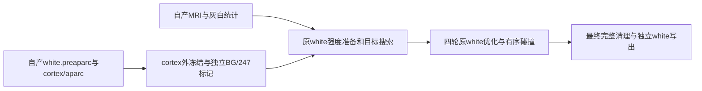
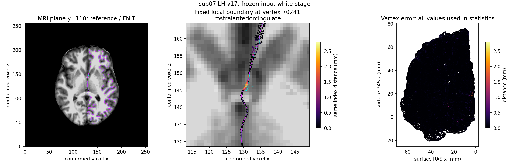
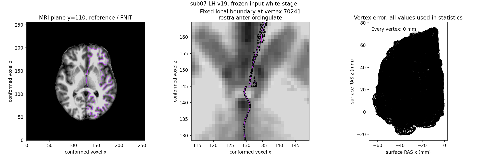

# Python最终white四轮实验接口

## 1. 功能

`place_final_white()` 从已有white.preaparc、cortex标签与aparc注释执行最终
white四轮。它复用已写好的完整白质优化器、强度/目标、原生有序试步、完整
候选与相交清理，不把preaparc的无注释冻结规则用到最终white。

固定原生命令中，`--rip-label`会设置`RipMidline=0`。当前surface先冻结
cortex标签外顶点，另从独立white.preaparc的坐标/法向，根据aparc选择
medialorbitofrontal、rostralanteriorcingulate、insula、lateralorbitofrontal，
沿法向−2到+2mm、步长0.5mm查询BG标签；247不要求BG注释。独立rip-surface
只把ripflags并回当前surface，其目标强度不传回。固定输入的冻结mask只计算
一次；每轮的边界目标和优化状态仍按完整white顺序更新。



生产recon-all的最终white默认仍是固定Conda源码构建路径。本接口是显式
实验入口；数值和性能是否支持替换由同输入完整阶段记录判断。

## 2. Python调用、输入输出和参数

```python
from pathlib import Path
from fnit.recon_all.place_final_white_python import place_final_white

final_white_report = place_final_white(
    subject_dir=Path("/data/fnit/sub07"),             # 自产前置文件目录
    hemi="lh",                                      # lh或rh，匹配文件前缀
    output=Path("/data/diagnostic/lh.white.python"),    # 独立输出，不能覆盖输入
    max_steps=400,                                   # 四轮总保护上限
    output_volume=Path("/data/diagnostic/lh.mrisps.white.mgz"), # 可选uint8强度图
    regularization_backend="cpu",                    # 原完整梯度；torch显式可选
    sampling_backend="cpu",                          # cpu/torch/triton，沿用已有采样
    candidate_backend="torch_snapshot",              # GPU生成完整空间候选
    candidate_grid_cells_per_axis=3,                 # 显式较小网格，不删候选
    retained_mht_backend="compiled",                 # 拒绝重试保留原有序MHT规则
    cleanup_marking_backend="source_torch",          # 固定源有向标记/清理
    cleanup_candidate_grid_cells_per_axis=3,          # 完整清理索引，最终门不变
    collision_profile=True,                          # 保存候选/接受分项时间
    device="cuda:0",                                 # 显式目标GPU；不启用半精度
    trace_callback=None,                             # 可选只读逐步接收函数
)
```

全部输入如下，须来自同一自产surface顶点顺序和MRI网格：

| 文件 | 数据结构、空间和用途 |
|---|---|
| `surf/H.white.preaparc` | 有序(N,3)坐标、(M,3)面，surface RAS/mm；不再平滑，独立rip-surface亦读原文件 |
| `surf/autodet.gw.stats.H.dat` | 文本键值，MID_GRAY和五个white阈值；灰白强度目标 |
| `label/H.cortex.label` | 与表面同序的顶点索引；索引外冻结 |
| `label/H.aparc.annot` | (N,)编码、(K,5)颜色表、K个名称；BG区域筛选 |
| `mri/brain.finalsurfs.mgz` | 3D conformed MRI及头几何；强度准备/采样 |
| `mri/wm.mgz` | 同形状/affine的WM图；复用white预处理 |
| `mri/aseg.presurf.mgz` | 同网格整数标签；BG/247及white边界规则 |

`output`保存最终white的float32 surface RAS/mm坐标，面顺序和输入几何元数据
保留。`output_volume=None`默认不写诊断体积；指定后输出同MRI网格的uint8
强度图。返回dict含output/output_volume、hemisphere、white_stage、vertices/
faces、四轮passes/pass_ends、steps、per_step的所有试步接受/拒绝/步长/RMS/
SSE、initial_cleanup/cleanup、各后端、stage_seconds及完整API seconds。

后端默认cpu采样/cpu正则/tree候选/tree保留MHT/legacy清理，网格默认2；
Torch候选及source_torch清理须明确device，网格3只允许对应Torch后端。
`max_steps=400`总上限，每轮最多100步，sigma2/1/0.5/0.25、averages4/2/1/0。
其余后端和限制见[完整preaparc优化器](PYTHON_WHITE_PREAPARC.md)，接受顺序相同。
`trace_callback(step, pass_index, coordinates_copy, diagnostics)`接收坐标副本。

缺失文件、半球/后端/设备/网格参数错误、MRI网格不一致、非法注释尺寸、
非有限rip几何、输出覆盖输入、四轮未完成或最终非零相交均抛异常。未完成
表面不写出；错误报告由benchmark保存。不同半球诊断体积应使用独立路径。

`final_white_rip_flags()`是内部子函数，输入vertices/normals为(N,3)float32，
segmentation为3D整数conform标签，sras2vox为(4,4)surface RAS→体素矩阵；
annotation是nibabel `orig_ids=True`编码，color_table为(K,5)、names为K个名称。
hemisphere必填lh/rh，返回(N,)int32冻结标记。它不读文件、写体积或设置目标。

## 3. 命令行

隔离完整阶段benchmark通过同一API执行，标准生产CLI默认不变：

```bash
CUDA_VISIBLE_DEVICES=0 OMP_NUM_THREADS=4 OPENBLAS_NUM_THREADS=4 MKL_NUM_THREADS=4 \
python validation/recon_all/python_gpu_port/benchmark_placement_full_white.py \
  --subject /data/fnit/sub07 \
  --candidate-directory /data/frozen-code/fnit/recon_all \
  --output-directory /data/runs/final-white-candidate \
  --code-base-commit ACTUAL_SOURCE_BASE_COMMIT \
  --hemisphere lh --white-stage final --backends torch --device cuda:0 --threads 4 \
  --candidate-backend torch_snapshot --candidate-grid-cells-per-axis 3 \
  --retained-mht-backend compiled --candidate-regularization-backend cpu \
  --sampling-backend cpu --cleanup-marking-backend source_torch --cleanup-grid-cells-per-axis 3
```

`--white-stage`默认preaparc，显式final才执行本接口。其余具名参数保持
原完整白质benchmark含义；目录已存在不覆盖，输入与实际源码SHA写JSON。
同输入native-only可加具名conda-binary、assets-directory及reference-repeat=2。

## 4. 原软件调用

只在隔离benchmark中执行相同固定源码构建程序：

```bash
mris_place_surface \
  --adgws-in surf/autodet.gw.stats.lh.dat --seg mri/aseg.presurf.mgz \
  --threads 4 --wm mri/wm.mgz --invol mri/brain.finalsurfs.mgz --lh \
  --i surf/lh.white.preaparc --o /data/reference/lh.white \
  --white --nsmooth 0 --rip-label label/lh.cortex.label --rip-bg \
  --rip-surf surf/lh.white.preaparc --aparc label/lh.aparc.annot \
  --restore-255 --restore-255 --outvol /data/reference/mrisps.white.mgz --rip-bg-lof
```

`RIP_MNGR::RipVertices()`与异步试步是命令内部步骤，无独立等价CLI。

## 5. 真实精度与时间

公开ds000114的sub06/sub07使用FNIT自产冻结前置，在同机A100/四线程执行。
每个半球重新运行两次固定Conda源码构建参考；解码坐标、有序面及预处理MRI
逐元素稳定。候选直接读取七个自产输入，参考文件只供比较器读取。

| 被试/侧 | 四轮总步数 | 候选完整API/s | 原始Conda参考两次完整调用/s | 坐标/有序面/MRI |
|---|---:|---:|---|---|
| sub07 LH | 31 | 173.577 | 158.639 / 155.285 | 0差异 |
| sub07 RH | 29 | 180.302 | 199.459 / 203.160 | 0差异 |
| sub06 LH | 35 | 220.791 | 271.849 / 266.600 | 0差异 |
| sub06 RH | 35 | 248.108 | 296.885 / 303.769 | 0差异 |

四侧均1个连通分量、Euler=2，边界边、非流形边、索引退化面和重复面为0；
最终source相交计数为0。候选API计时同步显式GPU，包含参数检查、
MRI读入、当前进程JIT、传输、四轮优化、清理、表面和MRI写出，以及逐步收据
写出；CUDA上下文建立另计。原生列为子程序完整调用。导入/冷CLI与整例耗时
不由该API列推断。共享设备负载在各次运行中不同，单次候选对双重复参考的
时间仅是本组观察，尚未建立稳定提速结论。

候选是CPU梯度/边界搜索和有序Numba更新，配合PyTorch GPU保守候选及完整
source清理的混合实现；没有更改全局精度。实测TF32开启，不启用半精度；
独立候选进程未设置cache-off环境变量，不能用本组代替生产cache-off评测。
显存、同步采样和进程归属情况随完整JSON逐次保存。
四侧PyTorch allocated峰值0.691–0.708GB，reserved峰值1.277–3.733GB。
外部采样请求间隔0.25秒，实际最大间隔2.17–2.97秒；容器与主机PID归属
尚未解析，进程树峰值为null。两张卡同期整卡上界13.405/27.653GB含其他
项目，因此既不能当作本接口占用，也不能据此宣布FNIT进程树20GB门通过。

本表的参考是标准`mris_place_surface`，SHA-256为
`78b64b7395aa0db0592ab6912fc026128b221c56d9f802db225fa59c18ceda44`。
当前生产auto另选`mris_place_surface_white_fast`，SHA-256为
`810c8086eb1b3088a1952be6f205500d99de2f3feff8c29476c99a5e67b8b427`，
其能力为跳过未消费face-MHT。v20追加当前生产程序四侧完整同输入运行，
没有重跑或改写v19的候选与标准参考收据：

| 被试/侧 | 生产white_fast本次完整调用/s | 先前v19候选API/s | 候选对生产坐标/有序面/MRI |
|---|---:|---:|---|
| sub07 LH | 200.892 | 173.577 | 0差异 |
| sub07 RH | 183.400 | 180.302 | 0差异 |
| sub06 LH | 235.019 | 220.791 | 0差异 |
| sub06 RH | 225.571 | 248.108 | 0差异 |

生产fast与原始标准参考亦全部0差异，候选源码与七个输入SHA前后不变。
fast每侧只运行一次，其独立重复性未由本组确认；标准参考双重复证据保留。
两组在同主机、四线程和相同每侧CPU亲和性下执行，但发生在不同时段、
共享负载不同，且候选API与原生子程序计时边界不同。这不是ABBA性能门，
不能用单次比值决定默认替换或宣称整例提速。生产默认保持white_fast。
四侧完整收据见[生产对照报告](../../validation/recon_all/optimizations/20261010_final_white/production_fast_report_v20.json)。

sub07 LH的完整API分项如下；它们已包含在173.577秒内：

| 分项 | 秒 | 实现 |
|---|---:|---|
| 准备 | 34.333 | nibabel读入、CPU准备/首边界与拓扑、GPU初始清理 |
| 梯度 | 11.580 | 原有CPU/Numba算子 |
| 有序碰撞 | 87.062 | GPU保守候选，CPU/Numba即时有序接受 |
| 边界更新 | 33.051 | 原有CPU/Numba逐顶点搜索 |
| 初始和试步目标 | 4.594 | 原有目标函数 |
| 最终清理 | 2.140 | source_torch完整源规则 |
| 写出及控制 | 0.816 | nibabel/表面I/O与调度 |

v17首次完整32步/API167.176秒，MRI一致，但表面mean0.024661、P99 0.197927、
max2.803446 mm，4,205顶点超过0.1 mm。v18透明完整probe先与稳定原生最终
几何0差异，随后首步定位到117个多余冻结顶点、553个目标强度差异。原因是
v17保留了`--rip-label`已关闭的midline步骤。v19修正解析和循环语义后，保留
完整四轮、边界、步长接受/拒绝和零相交门，未调整阈值或读取参考来修补。
这些诊断含额外检查点I/O，不能当作性能数据。

修复前后图为最终white自身的同输入比较，使用同一参考顶点的MRI平面；
青色为参考、品红为候选。零误差图直接标出全部顶点0mm。




[完整机器报告及复现说明](../../validation/recon_all/optimizations/20261010_final_white/README.md)
保留两例四侧原生双重复、实际输入/源码/程序SHA、逐轮候选轨迹、清理和分项。
[限幅修复](PIAL_STEP_NORM_DIAGNOSTIC.md)的两例四侧pial和完整preaparc记录另列。
本节是冻结同输入最终white阶段，未运行以本实验分支开始的原始T1整例，
也未据此判定整例指标等效或独立部署。生产最终white默认保持原生。

## 6. 更新记录

- v17：复用四轮优化器并接入独立annotation/rip-surface，完整运行发现额外midline错误，保留失败。
- v18：复用已有原生透明probe、固定原生双参考和首步目标/梯度检查。
- v19：按`--rip-label`关闭midline的实际解析语义修正，只保留BG/247标记；两例四侧逐元素匹配本机标准原生双参考，生产默认不变。
- v20：追加当前生产white_fast四侧完整同输入对照，解码坐标、有序面和MRI全部0差异；保留各次实际时间，不把跨时段单次结果当作稳定提速。

## 7. 源码和参考文献

- [固定调度与RIP_MNGR源码](https://github.com/freesurfer/freesurfer/blob/d932c45b7941662ea380a05efef580568b98d41a/mris_make_surfaces/mris_place_surface.cpp)。
- [固定时间步内部实现](https://github.com/freesurfer/freesurfer/blob/d932c45b7941662ea380a05efef580568b98d41a/utils/mrisurf_timeStep.cpp)。
- 表面重建参考文献见[white.preaparc说明](PYTHON_WHITE_PREAPARC.md)和[pial说明](PYTHON_PIAL_PLACEMENT.md)。
