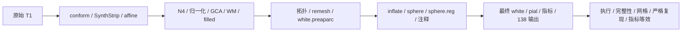

# recon-all 纯 Python GPU 迁移状态

## 1. 功能与支持范围

入口核对版本为 `79a41cdd`；本页最近完成自产配对及官方评分的两例原始 T1 benchmark 冻结为 `e34a1829`。二者分别记录代码接线和实际影像运行，不能混为同一测试版本。当前可运行的是完整单 T1 混合流程；严格 `backend="python-gpu"` 仍未开放。



| 阶段 | 已有实现与生产接入 | 尚存边界 |
|---|---|---|
| conform、SynthStrip、affine、SynthSeg、brainmask | FNIT PyTorch CUDA；保留已验证 FP32 例外 | 网络实际前向精度单独记录，不启用半精度 |
| 完整固定 N4 | 已有完整四层、最多 200 次反馈的 Torch 实验后端；可用隔离缓存 worker | 两例raw整例已运行：sub06完成2148.430秒，sub07最终RH white自相交10面而失败；默认Conda ITK，官方/形状诊断进行中 |
| 两轮归一化 | 已有 GPU 邻域和第二轮初始偏置，显式后端；0cd9 两例原始 T1 整例回归通过 | 有序控制选择、距离和部分偏置步骤仍在 CPU |
| 完整 GCA/EM | 候选评分与批量求逆用 Torch，隔离缓存 worker 已有两例原始 T1 回归 | EM 顺序更新仍在 CPU；不是纯 GPU |
| 完整 WM segmentation | Torch 直方图、平面几何与有序 CPU 核心；完整文件 API、缓存隔离已测 | 对 native 仍有 64/235 个 uint8 差异；默认 native，整例替换尚待测 |
| WM/aseg 核心编辑 | 静态 Torch 与有序 Numba 混合候选，两例冻结完整输入体素差为 0 | 有序核心仍为 CPU；生产默认 native |
| filled、finalsurfs、EntoWM/ACJ | CUDA 边界与 mask、Numba 顺序反馈；803 两例整例回归已测 | 有序 fill 仍在 CPU |
| 标准 inflated/sulc | 完整 Torch 后端已接入；589 两例原始 T1 整例回归通过 | nofix inflation 默认 native |
| 标准 sphere 与配准 | 已有 GPU 有序法向/平均；完整 dense GPU 收尾已接入显式选项 | 主优化仍有 CPU；同输入完整链与e34两例整例均已测；未观察到可靠整例提速 |
| 拓扑 GA / remesh / intersection | GA保留固定源码Conda C++；remesh为Python/Numba，双精度存储候选四侧同输入保持并已接入口 | 动态拓扑转写仍未完成，不以投射缺陷代替拓扑修复 |
| white.preaparc / final white / pial | 预白质与pial已有完整四轮Python候选及GPU子阶段；生产默认独立Conda构建 | 最终white的annotation/rip分支尚未转写；预白质不能替代final white。候选同输入精度/性能持续验证 |
| 缺陷体积投射 | 完整 Torch 显式后端，两例冻结双侧标签及空间一致 | 约 3 秒的完整 GPU API 无稳定收益；原始 T1 接入另测 |
| 厚度/面积/平均曲率与统计 | CUDA默认复用自有Torch顶点图函数；多图谱统计缓存与TH3顶点体积已接入 | CPU设备仍用原生顶点图；smoothwm曲率衍生图/curv.stats尚有C++。TH3不替代-no-th3脑区体积 |
| MNI 非线性与后处理 | FNIT GPU 实现；parallel-late 已接入、保持完整算法 | 两例完整组 ABBA 与原始 T1 765 整例、独立官方评分均已完成 |

这些混合实现的进展不会自动将严格 capability matrix 的 blocked 移入 ready。`n4_gpu.py` 的旧平滑残差实验不是完整 ITK N4；完整后端为 `n4_itk_torch_experimental.py`。

## 2. Python 调用、输入和输出

```python
from fnit.recon_all.python_gpu_profile import capability_report, require_complete

migration_status = capability_report(
    device="cuda:0",  # 请求设备描述；不初始化 CUDA、不读取影像
)
# require_complete(device="cuda:0")  # 当前抛 PurePythonGpuUnavailable，附同一状态表
```

`capability_report(device=...)` 默认设备为 `cuda:0`，返回 profile、device、native_programs、complete 以及 ready/blocked 列表。每行包含 stage、implementation、device、complete、reason。它描述实现状态，不接受 T1 或输出目录、不执行 benchmark，也不判精度或整体等效。

`require_complete(device=...)` 使用同一参数和结构；完整时返回字典，未完整时抛 `PurePythonGpuUnavailable`，异常携带 capabilities。重建入口选择 `backend="python-gpu"` 时在创建输出前执行该检查，不自动回退或生成近似文件。完整单 T1 混合入口、全部路径/参数、conform XYZ 与 surface RAS/mm 约定见[主说明](README.md#2python-调用)。

## 3. 命令行

```bash
# 只读取当前实现状态，不执行影像重建。
python -c 'import json; from fnit.recon_all.python_gpu_profile import capability_report; print(json.dumps(capability_report(device="cuda:0"), ensure_ascii=False, indent=2))'
```

实际重建参数及含原始输入、空目录、目标 GPU、四线程预算的完整复现命令见[整例说明](TORCH_INTEGRATION_20261009.md)。`--backend python-gpu` 当前会失败并列出缺口；`--backend native` 是现有混合生产 profile 的历史名称，使用声明资源及独立 Conda 构建产物，不调用系统安装的软件。

## 4. 原软件调用

```bash
recon-all -i input/T1w.nii.gz -s subject -sd reference -all -openmp 4
```

官方只在独立 benchmark 环境生成参考。状态检查是 FNIT 的内部交付检查，没有独立等价官方命令。每个候选算法的原始命令、固定源码、参数与真实阶段证据见对应功能页。

## 5. 最新真实精度、时间与显存

e34两例原始T1、新空目录、同A100/四线程完整CLI为 **2122.900/2056.372秒**；相对765分别慢0.2653%/快0.2485%，没有可靠整例提速。138输出与生产网格通过；新旧16张有序表面、七张标签和68区统计保持，20/44顶点图有零容差尾差。实际官方严格复现仍为6/138、7/138；五组完整指标逐字段与765相同，整体指标等效未判定，扩展穿越/球面负向面异常保留。

| e34当前阶段墙钟，秒 | sub-06 | sub-07 |
|---|---:|---:|
| N4 | 171.212 | 168.317 |
| 初始双侧表面组 | 687.041 | 728.750 |
| 双侧球面配准组 | 281.788 | 288.875 |
| 双侧注释组 | 103.918 | 89.796 |
| 双侧最终white/pial组 | 377.466 | 308.161 |
| 末尾MNI/网格并行组 | 81.871 | 72.544 |

组内时间重叠，不累加成整例；全部输入、源码/程序SHA、线程和精度保存。目标整卡峰47.255/41.619GB包含其他共享任务，树归属未知，父子合计峰为null，最大采样间隔7.933/6.198秒；尚未证明FNIT连续20GB预算。完整官方指标、局部距离、脑图与采样见[e34两例完整报告](../../validation/recon_all/optimizations/20261010_whole_sphere_finish_a100_e34a1829/README.md)。十分钟与纯PyTorch全流程均未完成。

标准 dense GPU 收尾在已实现 inflation→sphere 完整冷链中为 245.389→173.390 秒，全部逐步轨迹和有序输出相同；这是阶段证据，不能叠加成整例提速。完整 N4 与 WM 的既有实验差异见[N4](N4_COMPLETE_TORCH_20261009.md)、[WM](WM_PLANAR_TORCH.md)，不将其近似解释为随机性。

完整缓存Torch N4在e34的原始连续前段中，nu0不同4016/3259体素、最大1；filled则不同4671/2291体素，最低半球Dice0.995364/0.997221。此处T1、brainmask、norm、brain和WM的局部放大均[单独保留](../../validation/recon_all/optimizations/20261010_n4_continuous_prefix/README.md)，不能按N4 P99为零认定其下游无影响，尚未判整体等效。

## 6. 更新和 benchmark 记录

- 79a41cdd：复用已有完整有序Numba Gibbs与CPU双精度remesh存储，61入口契约通过，两例原始T1空目录整例运行中；不追标到e34结果。
- e34a1829：完整GPU收尾两例原始T1与实际官方评分均完成；45入口契约及独立wheel安装通过；仍采用 dense 算法，实验 marked 更新独立保留。更新 capability 的说明，ready/blocked 和 fail-fast 行为未变。
- 765c0fe9：[完整MNI末尾并行的两例原始T1及实际官方评分](../../validation/recon_all/optimizations/20261009_whole_late_mni_a100_765c0fe9/README.md)，保留MNI正逆场与完整网格门。
- 589e2749：完整标准 Torch inflation 的两例原始 T1 回归；旧性能、官方误差与局部质量分别记录。
- 0cd9cbd5：[两轮 GPU 归一化完整接线](../../validation/recon_all/optimizations/20261009_whole_normalization_a100_0cd9cbd5/README.md)，两例 CLI 为 2151.856/2129.266 秒，表面/标签/脑区统计保持。
- 803aec50：[GCA 隔离与 fill 的两例完整配对](../../validation/recon_all/optimizations/20261009_whole_pair_a100_803aec50/README.md)，旧缓存控制 6137.234/6040.677 秒→2255.064/2281.571 秒；这个比值不是相对官方的同机提速。
- a756fffb 两例 SIGBUS 和更早 SSH 中断保留[原始失败记录](TORCH_INTEGRATION_20261009.md#5-最新实测及范围)，不作为当前执行结果或确定 OOM 原因。九例 raw3a 和 CPU v3 见[主说明历史表](README.md#6-最近版本和-benchmark)。

## 7. 参考文献和源码

- [状态表实现](../../src/fnit/recon_all/python_gpu_profile.py)、[重建入口](../../src/fnit/recon_all/native_free.py)、[真实整例工具](../../tools/benchmark_recon_torch_end_to_end.py)。
- [FreeSurfer 固定原实现](https://github.com/freesurfer/freesurfer/tree/d932c45b7941662ea380a05efef580568b98d41a)。
- Fischl B. FreeSurfer. *NeuroImage*. 2012;62:774–781。
