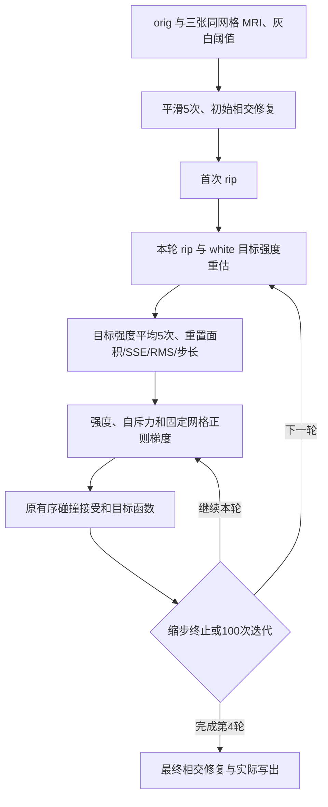

# Python white.preaparc 四轮放置

## 1. 功能与流程

`place_white_preaparc()` 把已有白质首轮实现接成完整四轮实验接口。它从同一
组 MRI、灰白阈值和 `orig` 开始，执行初始平滑与相交修复、逐轮冻结顶点、
白质目标强度搜索、四轮顺序优化及最终相交修复。MRI、rip、边界搜索、
强度梯度、自斥力、目标函数和碰撞规则均复用已有模块，没有复制另一套
pial 优化器。

本接口显式选择实验路径，生产 recon-all 默认仍调用独立 Conda 构建组件。
它对应 `white.preaparc`；带 aparc、`rip-label` 和独立 `rip-surf` 的最终
`white` 是另一个调用分支，尚未由本接口完成。PyTorch 可处理 signed
averaging、normal/tangent spring 和两跳二次曲率，强度项可显式复用已实现
的 `PlacementSampling` PyTorch/Triton GPU 采样；边界搜索、自斥力、
目标函数、有序 Gauss–Seidel 碰撞接受及相交清理仍在 CPU。它尚不是完整
纯 GPU 表面放置。



四轮梯度平均次数是 **4/2/1/0**，sigma 是 **2/1/0.5/0.25 mm**，每轮至多
100 次迭代。拒绝试步达到缩步上限时恢复本步起点并正常结束该轮；后续轮
重新计算冻结集合、目标强度和初始 SSE/RMS。固定网格邻接只创建一次；
rip 改变时重建 PyTorch 正则上下文。初始参考坐标始终保持在起始清理之后
的状态，不随轮间更新变化。最后清理复用已实现的完整 soap-bubble 修复，
残余相交会抛异常。

初始化清理沿用原流程语义：`MRISremoveIntersections` 可以带少量残余正常
返回，再由 white 放置继续调整几何。接口记录这项中间残余，继续执行四轮；
最终写出仍要求相交面数为0。不能把初始化残余误当成最终网格合格。

依赖均已在主页 Conda 环境中声明：PyTorch、NumPy、Numba、SciPy 和
nibabel。函数自身不执行 FreeSurfer 或其他外部程序，不自动启用 FP16/BF16，
也不改变调用方的全局 TF32 策略。

## 2. Python 调用、输入与输出

```python
from pathlib import Path
from fnit.recon_all.place_white_preaparc_python import place_white_preaparc

white_report = place_white_preaparc(
    subject_dir=Path("/data/fnit/sub-07"),  # 下表五项前置文件的目录
    hemi="lh",  # 左侧；右侧指定 rh
    output=Path("/data/diagnostic/sub-07/lh.white.preaparc"),  # 独立实验表面
    max_steps=400,  # 四轮总迭代保护上限；每轮仍至多100步
    output_volume=Path("/data/diagnostic/sub-07/mrisps.wpa.lh.mgz"),  # 可选预处理MRI
    regularization_backend="torch",  # 显式接入已有 PyTorch 固定网格正则梯度
    sampling_backend="torch",  # 复用已有 GPU 强度采样，MRI与变换只缓存一次
    candidate_backend="tree",  # 原完整动态候选与有序接受；默认保留
    device="cuda:0",  # 当前进程内明确的目标 GPU
    trace_callback=None,  # 可选每步诊断回调；坐标和记录是独立副本
)
```

### 五项前置文件

| 文件 | 数据结构、空间和含义 |
|---|---|
| `surf/H.orig` | FreeSurfer 三角表面：`(N,3)` 坐标、`(F,3)` 有序面和体积几何尾部；坐标为 surface RAS，单位 mm；要求已修复拓扑 |
| `surf/autodet.gw.stats.H.dat` | 文本键值；至少包含 `MID_GRAY` 与 `white_inside_hi/border_hi/border_low/outside_low/outside_hi`，用于白质强度准备和边界搜索 |
| `mri/brain.finalsurfs.mgz` | 三维放置强度图；conformed MRI 网格，强度经既有规则转为 uint8 |
| `mri/wm.mgz` | 同一网格的 WM 编辑图；用于白质强度准备，保留 255 恢复语义 |
| `mri/aseg.presurf.mgz` | 同一网格的离散解剖标签；用于白质 midline/BG rip 与边界限制 |

三张 MRI 的 shape 和 affine 必须相同；表面尾部提供从 surface RAS 到 MRI
体素坐标的变换。`orig.premesh` 属于上游灰白阈值生成输入，本函数读取
冻结阈值，不再重复生成阈值。生产数据链必须使用 FNIT 自产前置文件；
官方上游交叉输入只用于独立诊断目录。

### 全部参数

| 参数 | 默认值与限制 |
|---|---|
| `subject_dir` | 必填，包含上述五项前置文件的目录 |
| `hemi` | 必填，`"lh"` 或 `"rh"`；决定半球标签规则 |
| `output` | 必填，独立 FreeSurfer 三角表面路径；禁止覆盖任一输入 |
| `max_steps` | 400，正整数；达到上限但未完成四轮时抛异常 |
| `output_volume` | `None`；指定时写 uint8 MGZ，保留 `brain.finalsurfs` 的 shape、affine、体素大小；不能覆盖输入或表面输出 |
| `regularization_backend` | `"cpu"`；`"torch"` 使用已实现的固定网格正则上下文，并要求明确 `device` |
| `sampling_backend` | `"cpu"`；`"torch"`/`"triton"` 复用现有 GPU 强度梯度，要求显式 CUDA 编号；每步读取实际 rip、目标、顶点 sigma，MRI/affine 仅缓存一次；目标函数仍沿用 CPU 原算法 |
| `candidate_backend` | `"tree"`；`"snapshot"` 和 `"torch_snapshot"` 是保守预候选实验，仍保留实时顺序窄相接受；后者要求明确 `device` |
| `device` | `None`；PyTorch 后端须显式指定如 `"cuda:0"` 或 `"cpu"`，不静默回退 CPU |
| `trace_callback` | `None`；接收 `(step, pass_index, vertices_copy, record_copy)`；记录包含实际试步、SSE/RMS、接受/拒绝和步长；回调耗时计入墙钟 |

表面输出保留输入顶点数、有序面与几何尾部，只替换坐标。返回 `dict`：

| 字段 | 结构与单位 |
|---|---|
| `output/output_volume` | 实际输出路径；未指定体积时为 `None` |
| `hemisphere/regularization_backend/sampling_backend/candidate_backend/device` | 实际选择 |
| `complete_four_passes` | 成功返回时为 `True`；仅表示四轮计算完成，不表示官方数值验收通过 |
| `vertices/faces/ripped_vertices/held_vertices/steps` | 网格大小、最终冻结和最近一次试步受阻顶点数、总迭代数 |
| `pass_ends` | 四个全局迭代终点 |
| `passes` | 四条轮级记录：平均次数、sigma、迭代数、冻结顶点数、初末 SSE/RMS 和停止原因 |
| `per_step` | 每步记录；`trial_trace` 保存每次试步的实际 dt、SSE/RMS、缩步、拒绝和终止决定 |
| `initial_sse/initial_rms/step_sse/step_rms` | 初始及最后一次接受坐标对应的目标值；SSE 为既有加权目标，RMS 为影像强度误差 |
| `initial_cleanup/cleanup` | 起始/最终相交修复记录：相交面数、平滑周期和实际修复信息 |
| `seconds/stage_seconds` | 函数墙钟及分项秒；包含校验、读取、准备、传输、梯度、碰撞、目标函数、轮间重估、清理、写出与回调；各项和为墙钟 |

失败抛异常，不返回伪造完成状态。缺文件、无效参数、MRI 网格不一致、
未完成四轮、最终残余相交、CUDA 不可用或 OOM 均保留原异常；算法失败前不写
表面。实际 I/O 失败可能留下部分输出，调用者应保留异常及运行日志。

旧 `place_white_preaparc_prefix()`/`first_white_preaparc_step()` 继续作为
首轮 1–17 步诊断，不执行完整清理，也不改为完整 white 输出。

## 3. 命令行调用

```bash
python -m fnit.recon_all.place_white_preaparc_python \
  /data/fnit/sub-07 lh /data/diagnostic/sub-07/lh.white.preaparc \
  --complete \
  --max-steps 400 \
  --output-volume /data/diagnostic/sub-07/mrisps.wpa.lh.mgz \
  --regularization-backend torch \
  --sampling-backend torch \
  --candidate-backend tree \
  --device cuda:0
```

三个位置参数依次是前置目录、半球和独立输出；其余参数对应 Python 参数表。
不加 `--complete` 保持原首轮诊断调用，使用 `--steps 1`–`17` 和可选
`--diagnostics` NPZ。首轮选项与完整四轮选项不能混用。

## 4. 原软件调用

固定 FreeSurfer 源码提交 `d932c45b7941662ea380a05efef580568b98d41a` 的
对应 `white.preaparc` 调用如下；只在隔离 benchmark 环境执行参考程序。

```bash
mris_place_surface \
  --adgws-in /data/frozen/sub-07/surf/autodet.gw.stats.lh.dat \
  --wm /data/frozen/sub-07/mri/wm.mgz --threads 4 \
  --invol /data/frozen/sub-07/mri/brain.finalsurfs.mgz --lh \
  --i /data/frozen/sub-07/surf/lh.orig \
  --o /data/reference/sub-07/lh.white.preaparc \
  --white --seg /data/frozen/sub-07/mri/aseg.presurf.mgz \
  --restore-255 --nsmooth 5 --rip-bg-no-annot --rip-bg --rip-bg-lof \
  --outvol /data/reference/sub-07/mrisps.wpa.lh.mgz
```

`--rip-bg-no-annot` 的 preaparc 分支不依赖 aparc，`--rip-bg-lof` 仅在
RequireAnnot 分支影响区域选择。最终 white 使用的 annotation、label 和
独立 rip surface 不能被此命令或本接口省略。

本轮现场读取并核对的源码 SHA-256：

| 文件 | SHA-256 |
|---|---|
| `mris_make_surfaces/mris_place_surface.cpp` | `b57f6e18f2e3215fc99fb1a8720aa345459585e4618ed2b8fa2779c2ee0f9dcf` |
| `utils/mrisurf_mri.cpp` | `16740fce04268f8d4e7841592acf3ff89e394bf211e6c0ab0a7b541527a7c092` |

## 5. 当前精度、耗时与可视化

**完整四轮真实数据 benchmark 尚未完成，不能报告完整 white 提速或官方
等效。** 本轮本地 CPU 控制契约 10/10 通过，包括四轮平均次数/sigma、目标
与 SSE 重估、rip 掩膜更新、终止拒绝恢复、100 次每轮上限、未完成不写出、
保留有序面/几何以及输出体积空间，GPU sampler 缓存与逐轮新状态绑定。
GPU sampler 的控制契约使用替身，不是实际 CUDA 数值验收；白质真实数据
采样回归尚待执行。模拟契约不替代真实影像验收。

2026-10-09在同一A100节点的真实sub-07 LH测试中，v1接口在初始化额外要求
零相交，53.112秒后抛错，尚未进入white迭代。独立诊断复现初始6面，修复后
仍有4面；同输入固定源码Conda程序则在初始化明确记录剩1面后继续迭代。
因此修正版移除这个中间阶段的额外阻断，保留最终零相交要求；v1失败记录
保留，不能改称完整四轮。当前NumPy标记按无序面对同时标两面，而源谓词
存在反向差异：最终诊断候选2,139对中有5对反向结果不同，单向NumPy/源谓词
本身0差异，逐有序源谓词标记8面。该检测语义问题另列排错，不归因于随机性。
修正版CPU/PyTorch完整对照已在独立队列执行，尚未完成；同输入Conda重复结果见下表。
完整日志摘要与源码/输入SHA见[v1失败记录](../../validation/recon_all/optimizations/20261009_placement_torch/white_sub07_lh_a100_v1_failed.json)
和[初始化诊断](../../validation/recon_all/optimizations/20261009_placement_torch/white_initial_cleanup_sub07_lh_a100_v2.json)。

同一A100主机、四线程、相同五项输入与相同源码构建程序的新参考验证：

| 验证 | 完整墙钟 | 执行/几何结果 |
|---|---:|---|
| v2 首次原生调用 | 85.601 s | 第10步附近 `SIGBUS`，未生成表面；保留失败 |
| v4 致命信号追踪 | 264.325 s | 四轮完成，无致命信号；该时间包含追踪开销，不作性能基线 |
| v5 无追踪重复1 | 235.183 s | 完成 |
| v5 无追踪重复2 | 188.737 s | 完成；与重复1有序面与全部坐标一致，文件头不同 |

该程序SHA为 `78b64b7395aa0db0592ab6912fc026128b221c56d9f802db225fa59c18ceda44`。
v4每250ms采样一次，1,056个样本的原生RSS峰为1,260,244,992字节；整个
共享cgroup同期峰为189,507,588,096字节，故障计数增量为0。两者是CPU
内存，不是CUDA显存。v4追踪输出与两次无追踪输出的有序面、全部坐标和256³ uint8输出体积也均无差异。
本次成功不能证明此前SIGBUS原因，也不能称已修复
原生故障或完成独立部署。未将原生软件认作PyTorch候选的数值真值，独立
官方程序在该主机的同输入比较仍未执行。
[v2失败](../../validation/recon_all/optimizations/20261009_placement_torch/white_native_failed_a100_v2.json)、
[v4追踪](../../validation/recon_all/optimizations/20261009_placement_torch/white_native_signal_a100_v4.json)与
[v5重复](../../validation/recon_all/optimizations/20261009_placement_torch/white_native_repeat_a100_v5.json)和
[追踪/无追踪数值对照](../../validation/recon_all/optimizations/20261009_placement_torch/white_native_cross_trace_a100_v5.json)
分别绑定实际输入、程序、脚本和模块SHA；运行负载不同，不能把两次时间
差当成加速结果。

诊断工具 `trace_placement_native_signal.py` 仅支持Linux x86-64，跟踪本次
新启动的子进程及其线程，不附加已有任务。输入是具名程序、完整参数、
新建报告/日志路径和工作目录；输出JSON保存致命信号、故障PC与所在映射、
输入/程序SHA、250ms cgroup/RSS样本和退出标记，原生日志独立保存。
失败原样保留原生信号；新子进程core大小限制为0，不输出MRI、许可证内存或原始core。本地自己的成功退出与线程SIGBUS契约均通过，
见[诊断契约](../../validation/recon_all/optimizations/20261009_placement_torch/native_tracer_cpu_contracts_v6.json)。故障PC符号
使用系统已有的 `addr2line`，没有完整栈回溯；这是benchmark诊断工具，没有
对应影像处理CLI。完整参数示例：

```bash
# 环境中的SUBJECTS_DIR和FREESURFER_HOME必须对应本次冻结输入与声明资产。
# report.json/native.log必须不存在；下列程序只在隔离参考路径调用。
python validation/recon_all/python_gpu_port/trace_placement_native_signal.py \
  --output /data/diagnostic/native-signal/report.json \
  --log /data/diagnostic/native-signal/native.log \
  --working-directory /data/diagnostic/native-signal -- \
  /data/conda-bin/mris_place_surface \
  --adgws-in /data/frozen/sub-07/surf/autodet.gw.stats.lh.dat \
  --wm /data/frozen/sub-07/mri/wm.mgz --threads 4 \
  --invol /data/frozen/sub-07/mri/brain.finalsurfs.mgz --lh \
  --i /data/frozen/sub-07/surf/lh.orig \
  --o /data/diagnostic/native-signal/lh.white.preaparc \
  --white --seg /data/frozen/sub-07/mri/aseg.presurf.mgz \
  --restore-255 --nsmooth 5 --rip-bg-no-annot --rip-bg --rip-bg-lof \
  --outvol /data/diagnostic/native-signal/mrisps.wpa.mgz
```

[本轮机器可读契约记录](../../validation/recon_all/optimizations/20261009_placement_torch/white_complete_contracts_v2.json)
绑定实际测试的模块 SHA；相关既有回归合计 20 项通过，2 项实际 CUDA 测试
因本地 CUDA 不可用跳过。

此前同输入 `sub-07` 左侧**首步**在 H100 上测得 CPU 68.221 s、PyTorch
62.148 s，坐标/有序面/接受决定无差异。记录绑定当次 `4939d41c` 加模块
SHA，不是本轮完整四轮结果，也不能推断本轮完整耗时。
[首步原报告](../../validation/recon_all/optimizations/20261009_placement_torch/white_prefix_sub07_lh_final_v2_gpu0.json)
和[已实现梯度的分项结果](PYTORCH_PLACEMENT_REGULARIZATION.md)继续作为
组件证据。

复现脚本
[benchmark_placement_full_white.py](../../validation/recon_all/python_gpu_port/benchmark_placement_full_white.py)
固定五项输入 SHA，绑定实际导入源码与脚本 SHA、线程、主机、TF32 和显式
GPU，逐步保存坐标摘要及决策。本轮完整GPU碰撞配对分别设置
`control_candidate_backend=tree`、`candidate_backend=torch_snapshot`，
正则与采样均固定CPU，避免把其他后端差异混入碰撞优化。CPU/PyTorch 完整几何与轨迹分开比较；可选
官方与 Conda 程序在相同五项输入重跑，默认参考重复两次。参考输出不会被
候选读取。

```bash
# 四线程预算必须在启动 NumPy/Numba 之前设置；输出目录必须尚不存在。
OMP_NUM_THREADS=4 OPENBLAS_NUM_THREADS=4 MKL_NUM_THREADS=4 NUMBA_NUM_THREADS=4 \
python validation/recon_all/python_gpu_port/benchmark_placement_full_white.py \
  --subject /data/frozen/sub-07 \
  --candidate-directory /data/frozen-code/src/fnit/recon_all \
  --output-directory /data/runs/white-sub07-lh-v1 \
  --code-base-commit ACTUAL_TESTED_COMMIT \
  --hemisphere lh --backends cpu torch --device cuda:0 --threads 4 \
  --max-steps 400 --candidate-backend tree \
  --sampling-backend cpu \
  --official-binary /data/reference-bin/mris_place_surface \
  --conda-binary /data/conda-bin/mris_place_surface \
  --assets-directory /data/declared-assets --reference-repeat 2
```

脚本包含坐标哈希和增量报告写入的实际墙钟；GPU 测量前后同步明确目标
设备。allocated/reserved 仅是 PyTorch 分配器峰值，整个进程及并发进程
同时显存仍需外部采样，不能据分配器值宣布满足 20,000,000,000 字节整例
预算。完整 brain overlay/异常区域图待真实四轮结果生成；此时不附模拟
脑图冒充当前 benchmark。不同硬件的历史记录分开报告。

## 6. 更新记录

| 日期/版本 | 修改与证据 |
|---|---|
| 2026-10-09，本轮实验接线 | 接通 preaparc 四轮、初始/最终清理、轮间冻结与目标重估、完整试步记录、uint8 诊断体积；模拟控制契约另列；真实四轮待测 |
| 2026-10-09，`4939d41c` 及模块 SHA | 首步 PyTorch 正则同输入无新差异；仅首步阶段证据 |
| 既有白质首轮诊断 | 1–17 步对照接口保留，承担定位参考作用；没有删除仍使用的诊断算子 |

完整四轮同输入回归通过之后，才考虑生产接线；最终 white 的独立 rip 与
annotation 分支仍需实现、同输入验证及两例双侧复核。严格复现、优化新
退化和整例指标等效分别报告，不降低既有门槛。

## 7. 参考文献与源码

- [固定版本 mris_place_surface.cpp](https://github.com/freesurfer/freesurfer/blob/d932c45b7941662ea380a05efef580568b98d41a/mris_make_surfaces/mris_place_surface.cpp)：外层白质调度、rip 与命令参数。
- [固定版本 mrisurf_mri.cpp](https://github.com/freesurfer/freesurfer/blob/d932c45b7941662ea380a05efef580568b98d41a/utils/mrisurf_mri.cpp)：边界搜索和放置内部步骤；这些函数没有独立 CLI。
- [固定版本 mrisurf_deform.cpp](https://github.com/freesurfer/freesurfer/blob/d932c45b7941662ea380a05efef580568b98d41a/utils/mrisurf_deform.cpp)：MRISpositionSurface 与相交清理。
- Dale, Fischl and Sereno. Cortical surface-based analysis. I. Segmentation and surface reconstruction. *NeuroImage* 9, 179–194 (1999). [DOI](https://doi.org/10.1006/nimg.1998.0395)。
- Fischl and Dale. Measuring the thickness of the human cerebral cortex from magnetic resonance images. *PNAS* 97, 11050–11055 (2000). [DOI](https://doi.org/10.1073/pnas.200033797)。
