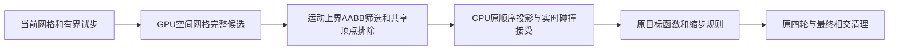

# PyTorch 表面碰撞候选与谓词

## 1. 功能与流程

本模块复用现有 placement 碰撞规则，提供完整 GPU 空间候选和固定面对的
FP64 Möller 谓词。`place_pial_t1(candidate_backend="torch_snapshot")` 是
显式实验选项：只迁移首试步的保守候选构建，随后按原顶点次序执行 close
neighbor 投影、读取已经接受的坐标、碰撞判断和更新。拒绝后的 retained-MHT
重试仍执行原树查询与保留桶规则。默认 `tree` 保持现有行为。



`triangle_pairs_intersect_torch()` 可以批量回放实际迭代中的面对。它不根据
初始几何预先决定动态接受。静态面对回放与完整首试步接受是两项独立验证。
新增代码只依赖主页已有的 PyTorch、NumPy、Numba、SciPy、nibabel。

## 2. Python 调用与输入输出

```python
from pathlib import Path
from fnit.recon_all.place_pial_python import place_pial_t1

pial_report = place_pial_t1(
    subject=Path("/data/fnit/sub-01"),  # FNIT自产MRI、white、标签和阈值
    hemisphere="lh",  # 左半球；右半球使用rh
    output=Path("/data/diagnostic/lh.pial.T1"),  # 独立诊断输出
    max_steps=200,  # 四轮总迭代保护上限，达到时抛异常
    sampling_backend="cpu",  # 强度采样沿用当前实现
    regularization_backend="cpu",  # 独立于碰撞候选的正则梯度后端
    candidate_backend="torch_snapshot",  # GPU完整空间候选，CPU有序接受
    device="cuda:0",  # 明确进程内目标设备编号
    trace_callback=None,  # 每轮只读诊断回调
    profile=True,  # 完整分项墙钟，诊断模式同步明确的目标设备
)
```

七项前置文件、MRI 网格、surface RAS/mm、完整返回结构与四轮语义见
[Python pial](PYTHON_PIAL_PLACEMENT.md)。本选项返回实际 `candidate_backend`；
输入缺失、非法参数、运行时运动超过候选上界、CUDA/OOM 异常均传播，
不会截断候选或静默换成近似表面。

### 完整空间候选接口

`conservative_face_candidates_torch()` 的参数如下。

| 参数 | 格式、默认值和含义 |
|---|---|
| `source_centers` | `(F,3)` float64，初始源三角面中心，surface RAS/mm |
| `query_centers` | `(Q,3)` float64，查询中心，同一坐标空间 |
| `radii` | `(Q,)` float64，非负查询半径/mm |
| `device` | 默认 `cuda:0`，须明确CUDA编号；`cpu`仅用于回归 |
| `query_chunk_size` | 默认2048，初始查询分块数 |
| `maximum_chunk_candidates` | 默认4000000，限制临时候选内存；超限减小块，单查询仍超限抛MemoryError，不删候选 |
| `source_low/source_high` | 可选 `(F,3)` float32/float64，初始源面AABB下/上界 |
| `query_low/query_high` | 可选 `(Q,3)` float32/float64，初始查询面AABB；四项须同时提供 |
| `motion_bound` | 默认None；配合AABB，调用方须保证并检查每个顶点相对初始位置的位移不超过此值/mm |
| `source_faces/query_faces` | 默认None；成对提供整数 `(F/Q,3)` 顶点编号时，排除共享顶点的面对 |

返回 `offsets:int64(Q+1,)`、`candidates:int32(M,)` NumPy CSR 和诊断字典。
半径过滤只保守增加浮点边界候选；AABB在双方均可能移动时使用两倍运动
上界。首试步运行时检查实际投影终点上界，失败直接报错。
空间索引使用整数格编码和 `searchsorted`，没有全体顶点 `cdist`。
候选顺序可与KD树不同，只有首试步相交bool的OR不依赖此顺序；retained-MHT
重试不能把该候选序列用于决定先命中哪个桶。

### 批量固定面对接口

```python
from fnit.recon_all.place_surface_collision_torch import triangle_pairs_intersect_torch

collision_mask, collision_diagnostics = triangle_pairs_intersect_torch(
    first=first_triangles,  # float32(P,3,3)，实际有序状态中的移动三角面
    second=second_triangles,  # float32(P,3,3)，逐项对应的候选三角面
    device="cuda:0",  # 明确目标GPU
    chunk_size=65536,  # 内存分块，不删除面对
    source_recheck=True,  # 共面、阈值和接触模糊区使用原FP64谓词复核
)
```

返回目标设备 `bool(P,)` Tensor 与面对数量、源规则复核数量、设备、精度
和分块诊断。输入必须有限、float32、同长度，坐标为surface RAS/mm。
全量谓词用float64计算，保留源程序不对称的 `1e-5/1e-6` 平面阈值和共面
规则；保护范围只选择需要源规则复核的面对，不放宽相交判定。False只供
原始GPU谓词诊断。它不修改全局TF32，不启用FP16/BF16。

## 3. 命令行

两项子算子没有独立生产CLI。真实首轮首试步脚本如下，读写都在独立目录。

```bash
python validation/recon_all/python_gpu_port/benchmark_placement_collision_torch.py \
  --subject /data/fnit/sub-01 \
  --hemisphere lh \
  --candidate-directory /data/candidate/src/fnit/recon_all \
  --output-directory /data/benchmark/pial_collision_lh \
  --device cuda:0 \
  --threads 4 \
  --code-commit <实际候选提交> \
  --capture
```

`--subject`是冻结自产输入；`--candidate-directory`指定候选源码；可选
`--dependency-directory`声明另一个只读冻结依赖目录，不复制或修改其内容。
`--output-directory`保存输入/接受检查点、实际面对、逐顶点碰撞参考和报告；
`--capture`完整捕获原有序状态中的AABB有效面对，捕获成本另计。代码、输入
和检查点SHA绑定报告。GPU计时显式同步，ABBA包含索引建立、传输、接受和
结果回传；MRI准备和首次JIT单列。

已保存完整首试步输入时，可以直接重放该迭代，避免重复MRI边界准备：

```bash
OMP_NUM_THREADS=4 OPENBLAS_NUM_THREADS=4 MKL_NUM_THREADS=4 NUMBA_NUM_THREADS=4 \
python validation/recon_all/python_gpu_port/benchmark_placement_collision_trial_replay.py \
  --input /data/frozen/first_trial_input.npz \
  --historical-reference /data/frozen/first_trial_reference.npz \
  --candidate-directory /data/frozen-code/src/fnit/recon_all \
  --output-directory /data/runs/collision-first-trial-v1 \
  --code-commit ACTUAL_TESTED_COMMIT --device cuda:0 --threads 4
```

`--input`包含当前顶点、面、建议位置、rip、动量、offsets和有序邻接；
它只提供该次迭代的起点。当前CPU原树与GPU候选均从相同起点重新执行完整
有序接受。可选`--historical-reference`只在计算完成后比较，不参与候选或
接受；不同主机的历史差异独立记录。输出冷pair、热ABBA、实际坐标/动量/
接受顺序、候选诊断、源码和输入SHA。完整首试步与面对谓词回放仍分开
报告；这也不是完整四轮或整例验收。真实sub-07 LH完整当轮回放结果见下。

需要同时记录进程显存时，可用标准库监测器包裹上述命令：

```bash
CUDA_VISIBLE_DEVICES=2 \
python validation/recon_all/python_gpu_port/monitor_placement_benchmark.py \
  --physical-gpu 2 \
  --output /data/runs/collision-first-trial-v1-memory.json \
  --interval-seconds 0.25 \
  -- python validation/recon_all/python_gpu_port/benchmark_placement_collision_trial_replay.py \
     --input /data/frozen/first_trial_input.npz \
     --candidate-directory /data/frozen-code/src/fnit/recon_all \
     --output-directory /data/runs/collision-first-trial-v1 \
     --code-commit ACTUAL_TESTED_COMMIT --device cuda:0 --threads 4
```

`--physical-gpu`是机器物理编号，`CUDA_VISIBLE_DEVICES`映射后的`cuda:0`是
内部计算设备；二者都要明确指定。`--output`是新JSON路径，记录命令、代码
SHA、分配缓存环境、每次采样的目标设备总占用和本次命令父子进程的合计
占用；`--interval-seconds`默认0.25秒，实际间隔和查询成本同时保存。
`--`后是完整benchmark命令。使用系统GPU驱动附带的`nvidia-smi`，不增加
Python依赖。采样值以整数MiB保存，乘以1,048,576换算字节；这是同时占用
的采样峰值，可能遗漏短峰。查询错误单列，不以零替代。命令非零退出码
原样传播，已有报告路径会报错。外部报告与阶段allocator计数一起解读；
不能将各进程不同时间的最大值相加。
若驱动PID与容器PID无法对应，进程树字段为`null`，记录归属未解决；
此时只用同期设备总占用作为显存上界，不解释为本次任务零显存。

### 完整阶段外部显存采样

`monitor_placement_benchmark.py`复用FNIT的`ProcessTreeDeviceSampler`，不自行
按宿主机PID数值猜测归属。`physical_gpu`明确物理卡编号；`profiling_source`
可指定冻结的`profiling.py`，未指定时使用已安装FNIT并记录实际SHA；
`interval_seconds`默认0.25秒。监测器不建立CUDA上下文，UUID来自显式
物理卡查询。输出保留整卡同期占用、可确认的进程树占用、未知归属和
失败采样；空采样或未知归属为`null`，不能称零显存。这个工具是剖析
包装器，没有独立原软件影像处理命令。CPU契约3项通过，真实整例内存
仍由独立整例报告给出。

```bash
# 子命令显式限制到物理GPU2；监测器按同一物理卡查询UUID。
CUDA_VISIBLE_DEVICES=2 python validation/recon_all/python_gpu_port/monitor_placement_benchmark.py \
  --physical-gpu 2 \
  --interval-seconds 0.25 \
  --profiling-source /data/frozen-code/src/fnit/recon_all/profiling.py \
  --output /data/runs/white-collision.memory.json -- \
  python validation/recon_all/python_gpu_port/benchmark_placement_full_white.py \
  --subject /data/frozen/sub-07 \
  --candidate-directory /data/frozen-code/src/fnit/recon_all \
  --output-directory /data/runs/white-collision \
  --code-base-commit ACTUAL_TESTED_COMMIT \
  --hemisphere lh --backends cpu torch --device cuda:0 --threads 4 \
  --max-steps 400 --control-candidate-backend tree \
  --candidate-backend torch_snapshot \
  --candidate-regularization-backend cpu --sampling-backend cpu
```

## 4. 原软件对应

对应 `mris_place_surface` 的内部碰撞步骤，没有独立官方CLI。完整pial
官方命令及全部参数见[Python pial](PYTHON_PIAL_PLACEMENT.md)。原实现来自
固定FreeSurfer源码 `d932c45` 的 `tritri.cpp`、`mrisurf_mri.cpp`、MHT和
有序placement更新；许可证见仓库 `licenses/FreeSurfer.txt`。生产不调用
预装FreeSurfer，也不读取官方结果。官方参考只能由独立benchmark产生。

## 5. 当前精度与耗时

最新同输入GPU测试在同一A100-SXM4-80GB节点、Xeon Platinum8369B、
四线程、固定CPU8–11和物理GPU2完成，实际算法源`a756fffb`及逐文件SHA
绑定报告。CPU与GPU都重新计算，不读取保存的参考接受状态。

| 实测范围 | 原CPU热ABBA中位数 | GPU候选热ABBA中位数 | 加速 | 不同输出 |
|---|---:|---:|---:|---:|
| 65,572对真实面对谓词 | 0.039440 s | 0.015689 s | 2.514倍 | 0 |
| 65,536对真实面对谓词 | 0.039827 s | 0.008204 s | 4.854倍 | 0 |
| sub-07 LH完整首试步，有序接受 | 15.053547 s | 3.423716 s | 4.397倍 | 0 |

前两行共131,108对，源判断相交864对，GPU边界CPU复核0对，分别见
[面对完整报告](../../validation/recon_all/optimizations/20261009_placement_torch/collision_replay_a100_gpu2_v1.json)。
完整首试步为114,342顶点、228,680面，输出坐标、接受offsets及108,597顶点
接受顺序全部逐项相同；冷pair和热ABBA均通过。GPU完整候选10,527,436对，
热候选建立约2.01秒，有序实时接受约1.13秒，GPU宽相位没有截断候选。
历史H100同输入检查点比较也为0差异，作为跨环境结果单列，见
[完整当轮报告](../../validation/recon_all/optimizations/20261009_placement_torch/collision_first_trial_a100_gpu2_v1.json)。
这项计时包括本轮索引建立、传输、顺序接受及结果回传，MRI准备和四轮
placement未包含其中；不能据此宣称完整pial、white或recon-all提速。

外部显存采样请求250ms，面对/完整首试步目标卡同期峰值分别553/1,937MiB，
后者为2,031,091,712字节。容器驱动PID归属未能解析，原监测器的进程树0
值不可解释为零显存；保留私有原报告，公开解释报告将未归属值记为`null`，
并记录原报告SHA。采样可能漏掉短峰，allocator计数另见每次运行，见
[外部显存报告](../../validation/recon_all/optimizations/20261009_placement_torch/collision_memory_a100_gpu2_v1.json)。

CPU算子和有序首试步单元回归7/7通过，包含阈值两侧、共面、接触、退化、
零半径、完整候选、投影、rip和retained-MHT回退。模拟几何用于排错；
不替代真实脑影像benchmark。真实sub-07 LH的v3作业已生成输入、有序接受
和两块实际面对检查点，但连接结束时没有最终报告；此时新worker SSH也
出现连接拒绝。中断原因未确认，不能把检查点当成通过或引用丢失的ABBA
时间，见[中断记录](../../validation/recon_all/optimizations/20261009_placement_torch/collision_sub07_lh_v3_interrupted.json)。
完整pial、第二例双侧、整例显存和整例提速尚未由该碰撞选项验证。

保留实际面对后，在headcw的Xeon Gold6418H、同一Conda环境、四线程、
CUDA未初始化的条件下完成固定面对CPU回放。候选代码 `85b85837`，实际
Torch谓词源码SHA为 `adac1598f162d5c0fb27afeac6d8625c8da7d66ae781205c1153b00403ba799a`。
两块共131,108对、源相交864对，逐对bool和SHA全部一致；源边界复核0对，
没有靠全量CPU复核掩盖算子差异。

| 实际面对 | 源Numba热ABBA中位数 | Torch CPU热ABBA中位数 | 不同谓词 |
|---|---:|---:|---:|
| 65,572对，491对相交 | 0.034877 s | 0.036486 s | 0 |
| 65,536对，373对相交 | 0.031787 s | 0.033302 s | 0 |

CPU Torch子算子在这两块略慢约4.6%；不据此判断GPU性能。首次源JIT/cache
加载和Torch调用单列在[完整机器报告](../../validation/recon_all/optimizations/20261009_placement_torch/collision_replay_cpu_v5.json)。
这是中断作业留下的**部分真实动态状态面对**，不是完整当轮接受回归，
也不是完整pial或整例。GPU allocator字段为null；不把它记录为零显存。

已有正则梯度的完整同输入pial配对见
[正则项结果](PYTORCH_PLACEMENT_REGULARIZATION.md)：最终几何/接受轨迹相同，
整步却慢6.22%，因此仍为显式选项。这项结果不能用于证明新碰撞选项提速。

## 6. 更新与验证记录

- 2026-10-09：新增完整空间候选、保守运动AABB、FP64批量面对谓词和源边界
  复核；新增 `torch_snapshot` 显式选项，保留有序接受和原重试路径。
- 对大规模host面对改为只上传当前块，避免先上传全体输入后才分块计算。
  真实benchmark新增每个完成测量边界的原子JSON写出，外部中断时保留
  已完成的测量和明确状态；完整状态只有 `execution_status="complete"`。
- 验证脚本对 `@torch.no_grad` 和Numba包装进行unwrap后记录实际算法文件SHA，
  避免把Torch装饰器文件当成候选kernel；v5真实回放已绑定实际源码。
- 完整GPU接受仍需处理Gauss-Seidel依赖：当前顶点的近邻投影读取先前已接受
  顶点，碰撞读取候选三角面当前状态。共享面、近邻、完整候选面的顶点均属
  依赖边；不能只按左右半球或互不邻接顶点组批，更不能用Jacobi取代。
  本版只批量预计算安全宽相位和回放实际状态谓词，没有绕过依赖。

## 7. 参考文献与源码

- [FreeSurfer源代码](https://github.com/freesurfer/freesurfer)，固定源码及
  完整placement来源见现有pial页面。
- Möller T. A Fast Triangle-Triangle Intersection Test. J Graph Tools. 1997.
- Dale AM, Fischl B, Sereno MI. Cortical surface-based analysis I. NeuroImage. 1999.
