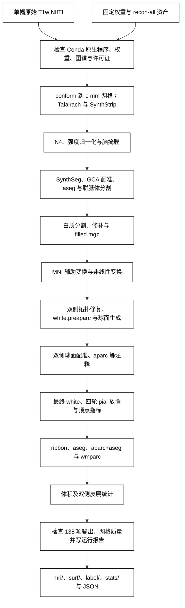

# 单幅 T1w 的 recon-all 重建

2026-10-02 两例原始 T1 整例从 **3440.4→2248.7 秒、3669.0→2322.5 秒**，墙钟分别减少 **34.64% 和36.70%**；候选父子进程同期显存采样峰值 **8.75 GB、10.90 GB**。两例各输出138/138项，生产网格检查通过；严格复现与整体指标等效单独报告，不由输出数量推断。

五任务已完成接入，实际测试源码固定为 `8d750e25d4d067a43edb788a96b2086a1c031ba0`，配对基线为 `6f67cc0`。两例使用同一H100、线程预算4和相同权重/资产，显式启用2个半球worker。[本轮结果与复现](../../validation/recon_all/optimizations/20261002_parallel/FINAL_RESULTS.md)汇总端到端与分阶段时间、实现归属、显存、误差及验证范围；[生产接入](PERFORMANCE_INTEGRATION.md)说明参数、设备和原生程序选择。138项诊断及脑区/表面/扩展质量的三方比较另存版本绑定报告。

两例三方比较已经完成：相对优化前基线，最终white/pial、7类分割和脑区统计一致，部分顶点图浮点差通过既有门槛；严格135/138，3项仅为MNI输出头字节差。相对官方的严格结果为6/138、2/138，厚度MAE为0.04184、0.02169 mm。已有局部低Dice、非零white/pial穿越及双向距离极值均保留，整体指标等效尚未判定，详见本轮结果及脑图。

[返回首页](../../README.md) · [安装与原生程序](CONDA_CPP_BUILD.md) · [阶段与官方命令](CONDA_CPP_STAGES.md) · [验收范围](../../validation/recon_all/python_gpu_port/RELEASE_GATES.md) · [半球启动前父进程缓存释放](HEMISPHERE_GPU_MEMORY.md)

`fnit-recon-all` 从一幅 T1w 生成体积分割、双侧皮层表面、顶点指标、脑区标注和统计。标准路径依次执行[MNI152 非线性变换](MNI_NONLINEAR_CHAIN.md)、拓扑修复、`white.preaparc`、球面生成与配准、最终 white、[Conda 源码构建的四轮 pial 放置](NATIVE_PIAL_PLACEMENT.md)和后处理。必要程序或资产缺失时，入口在运行前报错；阶段失败时抛出异常并保存报告。当前支持单幅 T1w；多 T1、T2/FLAIR 和纵向重建不在此接口的范围内。

执行完成、138 项输出完整性、网格质量、严格复现和整体指标等效分别记录。138 项逐文件比较用于诊断；整体指标等效阈值尚未正式确认，结果保持 `not_assessed`。优化前后还检查离散分区 Dice、双向点到三角面距离、厚度/面积/体积偏差和局部异常。具体口径见[比较方法](BENCHMARK_METHODS.md)与[验收说明](../../validation/recon_all/python_gpu_port/RELEASE_GATES.md)。

CUDA 默认允许 TF32，不自动使用 FP16/BF16。SynthStrip、SynthSeg、辅助网络的卷积及 Talairach/MNI 仿射矩阵乘法保留同输入验证后的局部 FP32 例外；MNI deform 的 CUDA 路径也保留矩阵乘法与 cuDNN 的 FP32 例外；作用域结束后恢复设置，其他 GPU 阶段继续允许 TF32。构造和前向实际设置见[SynthSeg 精度](SYNTHSEG_PRECISION.md)与[辅助 Synth 精度](SYNTH_AUX_PRECISION.md)。

本轮复用并优化已有[有序归一化](NORMALIZATION.md)、[球面几何](CPU_GEOMETRY_PERFORMANCE.md)及[PyTorch 指标函数](SURFACE_METRICS.md)。多图谱共享[同版本几何缓存](SURFACE_STATS_CACHE.md)，厚度使用[完整空间候选](SURFACE_THICKNESS.md)。完整 Python pial 已做同输入回归，但仍比当前 C++ 慢，生产路径保留 Conda 源码构建实现。不得将冻结同输入加速写成整例提速。

本轮复用已有PyTorch WM后编辑与MNI完整warp求逆，优化已有Numba有序网格/球面实现，接入半球独立进程和私有发布；GCA和white保留完整Conda源码构建流程并消除重复工作。默认半球worker仍为1，本页示例显式使用2；Python pial尚无生产速度优势，保留原生pial。

## 流程策略



图中的原生阶段使用当前 Conda 环境内从固定源码构建的程序；图末的完整性检查不代表已通过与官方结果的数值验收。

## 安装

在仓库根目录创建[主页 Conda 环境](../../environment.yml)，然后运行[原生程序安装脚本](../../tools/setup_recon_all_native_conda.sh)。脚本从固定 FreeSurfer 源码提交编译所需程序并安装至当前 Conda 环境；不会调用系统安装的 FreeSurfer。模型、模板及个人许可证单独提供。

```bash
conda env create -f environment.yml
conda activate fnit
bash tools/setup_recon_all_native_conda.sh
fnit-setup-weights --model recon-all --dest /data/fnit-weights
fnit-setup-recon-all-assets --dest /data/fnit-assets
fnit-setup-weights --model recon-all --dest /data/fnit-weights --verify-only
fnit-setup-recon-all-assets --dest /data/fnit-assets --verify-only
```

默认资产组包含标准单 T1 流程所需的 98 个文件，入口逐项检查大小及 SHA-256。`recon-all` 权重组包含非线性 SynthMorph 权重；其来源已对照固定的 [FNIT assets-v1 Release 与清单](https://github.com/weikanggong1/Fudan-Neuroimaging-toolkit/releases/tag/assets-v1)。安装器优先从该 Release 获取获准再分发的权重，再校验原文件大小和 SHA-256；未获再分发许可的第三方图谱仍从原作者网站获取。安装脚本也支持开发者用 `FNIT_RECON_ALL_SOURCE` 指向已准备好的固定源码。构建的命令、补丁、哈希和 Conda 记录见[安装说明](CONDA_CPP_BUILD.md)。2026-09-29 已从主页环境文件创建新 Conda 环境，并从已校验的固定源码归档编译安装所需程序；98 项标准资产已全新下载并复核；[两例当前安装产物的连续整例](../../validation/recon_all/python_gpu_port/current_full_runs_20260930.json)输出和网格检查通过，严格数值验收仍未通过。

## 运行

```bash
export FS_LICENSE=/private/license.txt
fnit-recon-all /data/sub01_T1w.nii.gz /data/subjects/sub01 \
  --weights-dir /data/fnit-weights \
  --assets-dir /data/fnit-assets \
  --device cuda:0 --threads 4 --hemisphere-workers 2 --native-optimizations auto
```

`FS_LICENSE` 指向用户自己的许可证文件。默认从激活的 Conda 环境 `bin/` 寻找原生程序；`--native-bin-dir` 可指定已核验的开发者构建目录。没有 GPU 时可使用 `--device cpu`。`subject_dir` 须不存在或为空。

```python
from fnit.recon_all.native_free import run_recon_all_python

report = run_recon_all_python(
    t1="/data/sub01_T1w.nii.gz",  # 一幅原始 T1w NIfTI 的路径
    subject_dir="/data/subjects/sub01",  # 空的被试输出目录
    weights_dir="/data/fnit-weights",  # 已校验的模型权重目录
    assets_dir="/data/fnit-assets",  # 已校验的模板和图谱目录
    device="cuda:0",  # PyTorch 阶段的设备；无 GPU 时为 "cpu"
    threads=4,  # 当前被试计算预算；双半球并行时各2线程，报告线程设置与恢复
    hemisphere_workers=2,  # 显式启用左右侧独立进程；默认1，共享缺陷体积仍顺序累计
    native_optimizations="auto",  # 按已验证能力选择完整GCA缓存及white快速程序；pial保留原程序
    native_bin_dir=None,  # None 表示使用当前 Conda 环境的 bin/
    profile_stages=False,  # 生产默认不增加阶段 CUDA 同步；True 记录同步等待
    cuda_allocator_cache="auto",  # 首次 CUDA 默认关闭缓存；已初始化 API 保留实际策略
)
# report 是运行报告字典；仅在全部阶段与文件完整性检查通过后返回。
```

`run_recon_all_python(...) -> dict` 的输入参数均在上例中列出。入口把原始 T1 重采样到 1 mm、256³ 的 conform 网格；`mri/orig.mgz`、分割图与最终体积图均在该网格上。`surf/lh.*`、`surf/rh.*` 使用该被试的 surface RAS，网格文件保存有序顶点和三角面；`surf/H.thickness` 等顶点图及 `label/H.*.annot` 与对应半球的顶点顺序对齐。原始 NIfTI 仿射和 conform 网格不能互换使用。

`hemisphere_workers` 只允许1或2，默认1；设2时在表面生成、球面配准、注释和最终放置中使用私有被试目录，阶段成功后按既定规则发布。最终GPU指标保持串行；缺陷体积按左、右顺序累计。`native_optimizations` 默认为`auto`，只选择能力、固定源码及线程预算已验证的完整原生优化；`original` 用于同程序控制。详细参数、程序选择及当前验证范围见[性能接入](PERFORMANCE_INTEGRATION.md)。

主要输出位于被试目录下：

| 路径 | 内容与结构 |
| --- | --- |
| `mri/*.mgz`、`mri/transforms/*` | 体积分割、强度图和配准变换；MGH 体积为 conform 网格，部分 MNI 辅助 NIfTI 为图谱网格。 |
| `surf/H.white`、`H.pial`、`H.sphere.reg` | 双侧有序三角网格；`H` 为 `lh` 或 `rh`。 |
| `surf/H.thickness`、`H.area`、`H.volume`、`H.curv` 等 | 每顶点标量，顺序与同侧表面一致；厚度与几何位置单位为 mm，面积为 mm²，体积为 mm³。 |
| `label/H.*.annot` | 每顶点脑区编码及颜色表。 |
| `stats/*.stats` | 体积和皮层分区统计。 |
| `fnit-native-free-run.json` | 阶段耗时、原生程序哈希、输出清单、文件完整性、网格质量和数值验收状态。 |

固定单 T1 profile 的全部 138 个相对路径由[清单](../../src/fnit/recon_all/expected_outputs.py)定义。`report["outputs"]` 是实际存在的 `{相对路径: 绝对路径}` 映射；`report["output_validation"]` 给出 138 项存在性检查；`report["mesh_validation"]` 逐侧检查闭合球面拓扑、顶点顺序、有限坐标及 white/pial 自相交；`report["numeric_validation"]` 单独记录参考结果的数值验收，默认是 `not_run`。`report["stages"]` 为按执行顺序排列的阶段名、秒数和可得的 PyTorch GPU 峰值字节数。默认关闭 CUDA 分配缓存时，父进程的 PyTorch 峰值接口不可用，以 `gpu_memory_mode` 说明，整例显存仍需进程级外部采样。`status="complete"` 只表示全部阶段执行、输出存在性和网格质量检查通过，不表示已与官方结果达到数值门槛。运行失败会抛出异常，部分失败信息写在 JSON 中；入口前置校验失败时可能尚未创建 JSON。

批量 Python API `run_recon_all_python_batch(jobs=..., weights_dir=..., assets_dir=..., devices=("cuda:0",), threads=4, native_bin_dir=None, profile_stages=False, cuda_allocator_cache="auto", hemisphere_workers=1, native_optimizations="auto")` 中，`jobs` 是按顺序排列的 `{"t1": 路径, "subject_dir": 空目录}` 列表；`devices` 是互不重复的设备列表。`threads` 是每个子进程的预算，多设备并行时总预算随进程数量增加。每个设备一次运行一例，新子进程重新应用 recon-all 精度策略，不继承父进程已经初始化的 CUDA flags 或 allocator；`auto` 按子进程初始化前环境选择。其余参数与单被试一致。返回值为同序的报告列表；任一被试失败时抛出 `RuntimeError`。

## 最近版本与 benchmark

| 版本 | 记录与用途 |
| --- | --- |
| `8d750e2`，2026-10-02 五任务整合 | [当前完整结果](../../validation/recon_all/optimizations/20261002_parallel/FINAL_RESULTS.md)：两例原始T1空目录、CLI与已初始化CUDA API；保留成功重跑、首次CUDA失败和正式三方比较。 |
| `ff372d7`，2026-10-01 串行整合版本 | [前轮完整结果](../../validation/recon_all/optimizations/20261001_serial/FINAL_RESULTS.md)：两例原始 T1、完整耗时及最终指标；报告保留实际计算提交。 |
| `3faa938`，辅助网络卷积精度修复 | [中间版原始报告](../../validation/recon_all/optimizations/20261001_serial/whole/precision_policy/whole_reports/)：两例完成，各 138 项齐全，相对优化前严格诊断均为 135/138；MNI 仿射矩阵乘法误差随后另行定位。 |
| `61926c7`，五阶段首次整合 | [历史整例与原因定位](../../validation/recon_all/optimizations/20261001_serial/WHOLE_RESULTS.md)：保留 MRI/WM 输入变化导致表面变化的四组控制，不能代替当前版结果。 |
| `c248520`，上一直接性能基线 | [整例热点优化](../../validation/recon_all/python_gpu_port/performance_hotspots_20261001/WHOLE_RESULTS.md)：20261001_serial轮次的sub-01配对复用其完整GPU API记录，生产源码与 `0c8ab32` 相同。 |
| `1b8c36d`，指标与缓存接入 | [精度与时间记录](../../validation/recon_all/python_gpu_port/performance_20261001/README.md)：厚度、统计缓存、实际前向精度与剖析接口。 |
| `e036f57`，法向优化 | [绑定该版的两例结果](../../validation/recon_all/python_gpu_port/current_full_runs_20260930.json)及[最终指标](../../validation/recon_all/python_gpu_port/final_metric_consistency_20260930.json)。历史 CPU/GPU 时间不与当前整例混算。 |

对应版本的结果、脑图和最差脑区统一放在各轮结果页。历史记录仅用于复现和原因定位；已替代的“当前仍在运行”等说法不再作为现版结论。

## 验证与边界

```bash
python validation/recon_all/python_gpu_port/compare_complete_subject.py \
  /data/reference-sub01 /data/subjects/sub01 \
  --report /data/sub01-comparison.json
```

比较需要单独生成的真实 T1 官方参考目录。[固定 138 项比较器](../../validation/recon_all/python_gpu_port/compare_complete_subject.py)检查体积、表面、顶点图和统计；同输入阶段、自产前段连续链、原始 T1 整例分别记录。整例另外保存各分区 Dice、双向点到三角面距离和逐脑区偏差；顶点数或有序面不同时不进行同索引比较。资源报告与外部进程采样分开，单位为字节并展示 GB/GiB。标准流程默认允许 TF32，SynthStrip、SynthSeg、辅助网络卷积、Talairach/MNI affine 与 MNI 非线性有已验证的 FP32 例外；不自动启用 FP16/BF16。

各阶段的输入、输出、官方命令和真实数据记录见[阶段索引](CONDA_CPP_STAGES.md)。

`aseg.stats`、`wmparc.stats` 的参数、原软件命令及真实 CON04 单体素警告修复见[体积与强度统计](SEGMENTATION_STATS.md)。修复后完整统计文件与冻结 `1128bc52` 的原保存文件逐字节相同；正式十人执行来源仍保留该冻结版本。

## 参考文献与原实现

- Fischl B. FreeSurfer. *NeuroImage*. 2012;62(2):774–781. [doi:10.1016/j.neuroimage.2012.01.021](https://doi.org/10.1016/j.neuroimage.2012.01.021)。
- [FreeSurfer 官方 recon-all 说明](https://www.freesurfer.net/fswiki/recon-all)。
- [FreeSurfer 原实现代码库](https://github.com/freesurfer/freesurfer/tree/d932c45b7941662ea380a05efef580568b98d41a)。
