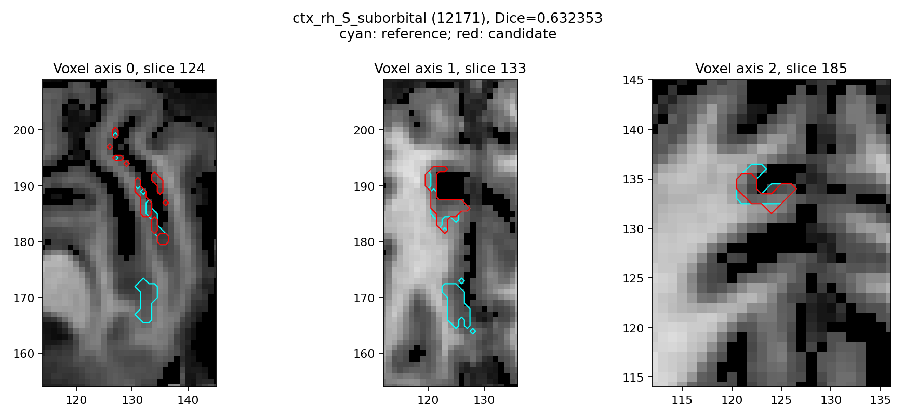

# 单幅 T1w 的 recon-all 重建

**2026-10-07现存GPU验证**：冻结3a的原始T1执行和生产网格通过9/10，完整官方比较9/10，十例输出各138项齐全。九例FNIT入口中位数2669.520秒、原官方5839.091秒；本次只收集已有结果，不宣称新的受控提速。68区厚度MAE0.0134–0.0397mm，自身同期采样峰6.143–13.571GB；sub-10206左侧自相交仍失败，严格复现与整体指标等效分别未通过/未判定。见[九例完整指标、耗时和局部问题](../../validation/recon_all/accuracy_20261003/runtime/server_refresh_20261007/README.md)及[版本绑定](PRECISION_CANDIDATE_BENCHMARK_20261004.md)。以下CPU与历史GPU记录继续保留原版本。

[返回首页](../../README.md) · [完整旧文档与更早证据](../../validation/recon_all/readme_archive_20261005.md)

| 项目 | 内容 |
|---|---|
| 输入 | 原始单幅3D T1w、校验权重/图谱、用户许可证 |
| 输出 | 138项体积/表面/顶点图/标注/统计及JSON |
| 对应原软件 | FreeSurfer8.2 recon-all单T1默认路径 |
| Python / CLI | fnit.recon_all.native_free.run_recon_all_python；fnit-recon-all |
| CPU / GPU | 默认是混合CPU/PyTorch CUDA/Numba/固定源码Conda native程序；严格 `python-gpu` profile 只在全部替代阶段完成后开放 |

<a id="流程策略"></a>


当前十分钟目标的热点和五个优化任务见 [2026-10-07 性能热点与任务](HOTSPOT_ACCELERATION_20261007.md)。
当前纯 Python GPU 迁移矩阵和阻断项见 [2026-10-08 迁移状态](PYTHON_GPU_STATUS_20261008.md)。
完整固定N4 PyTorch实验及真实误差见 [本轮N4](N4_COMPLETE_TORCH_20261009.md)；
显式N4缓存隔离与原始输入链见 [N4输入链](INPUT_N4_CHAIN.md) 和 [阶段worker](N4_CACHED_WORKER.md)；
GCA局部缓存与CLI/API验证见 [GCA阶段隔离](GCA_ISOLATED_TORCH_20261009.md)；
GCA候选评分及新批量求逆见 [GCA说明](MRI_EM_TORCH_BACKEND.md)。
N4默认仍为ITK，GCA新批量求逆尚未替换已存在的CUDA评分路径。

2026-10-09的阶段迁移见 [有序GPU法向](SURFACE_NORMALS_TORCH_20261009.md)、
[white/pial正则项](PYTORCH_PLACEMENT_REGULARIZATION.md)、
[WM/aseg编辑](WM_ASEG_TORCH.md)、[WM直方图](WM_HISTOGRAM_TORCH.md)及[完整缺陷投射](DEFECTS_TORCH.md)。
[固定主曲率的GPU衍生图](CURVATURE_DERIVATIVES_TORCH_20261009.md)单列算子精度，
不替代离散主曲率计算；新的[离散八图实验](DISCRETE_CURVATURE_TORCH_20261009.md)
已完成两例双侧同输入回归，尚未满足全部探索门，不替代完整curv.stats。
原始T1空目录配对采用[整例复现脚本](TORCH_INTEGRATION_20261009.md)。
容器 PID 与 GPU 显存归属的记录规则见[进程显存说明](GPU_PROCESS_MEMORY.md)。
局部内核收益与完整阶段、整例收益分别记录，纯GPU全流程仍未完成。
## 1. 功能简介

`fnit-recon-all`从一幅原始T1w生成体积分割、双侧white/pial表面、顶点指标、脑区标注与统计。标准单T1入口目前不支持多T1、T2/FLAIR或纵向重建。

当前是Python调度、PyTorch/NumPy/Numba计算与固定FreeSurfer源码在Conda内构建的原生辅助程序组成的流程；运行不启动系统安装的FreeSurfer，但仍会调用这些源码构建程序，并需要个人许可证。它不是全PyTorch或全GPU实现。所需native程序、资源和license缺失会提前报错。

CUDA默认TF32，SynthStrip/SynthSeg/辅助网络及Talairach/MNI相关阶段保留同输入验证的FP32例外，不启用FP16/BF16。CPU入口不改调用方CUDA策略。执行完成、输出完整性、网格质量和数值等价是分别记录的状态。


## 2. Python 调用

```python
from fnit.recon_all.native_free import run_recon_all_python

reconstruction_report = run_recon_all_python(
    t1="/data/sub01_T1w.nii.gz",  # 一幅原始 T1w NIfTI 的路径
    subject_dir="/data/subjects/sub01",  # 空的被试输出目录
    weights_dir="/data/fnit-weights",  # 已校验的模型权重目录
    assets_dir="/data/fnit-assets",  # 已校验的模板和图谱目录
    device="cuda:0",  # PyTorch 阶段的设备；无 GPU 时为 "cpu"
    threads=4,  # 当前被试计算预算；双半球并行时各2线程，报告线程设置与恢复
    hemisphere_workers=2,  # 显式启用左右侧独立进程；默认1，共享缺陷体积仍顺序累计
    native_optimizations="auto",  # auto在CUDA上启用FNIT CUDA候选评分；original为Conda GCA；torch强制启用候选评分
    n4_backend="native",  # torch显式使用完整200轮N4，已知强度偏移单列
    n4_execution="in-process",  # isolated仅配torch/cuda:N，缓存子exec保持父策略
    normalization_controls_backend="cpu",  # torch复用两轮同规则GPU邻域；仅显式cuda:N
    normalization_initial_bias_backend="cpu",  # torch复用第二轮初始偏置GPU传播/平滑，保持原除乘精度
    inflate_backend="native",  # torch复用完整标准inflated/sulc；须cuda:N和两个半球worker
    sphere_finish_backend="cpu",  # torch复用完整dense GPU球面收尾；须cuda:N和两个隔离worker
    annotation_gibbs_backend="python",  # numba复用完整有序重分类；GPU几何/随机序列不变
    remesh_scalar_storage="numpy",  # python优化已有CPU remesh双精度存储；拆缩/平滑顺序不变
    mni_execution="in-process",  # parallel-late在末尾将完整MNI与CPU网格检查并行；总线程至少2
    wm_backend="native",  # torch启用FNIT PyTorch/CPU有序混合WM分割
    wm_execution="in-process",  # isolated仅配torch-optimized，子exec局部缓存、父策略保持
    defects_backend="native",  # torch启用完整PyTorch缺陷投射；标签相同，颜色表不同
    wm_edit_backend="native",  # torch-hybrid启用静态CUDA编辑，有序核心仍用Numba CPU
    sphere_normals_backend="numba",  # torch只迁移标准sphere法向；其余算法和finish保留
    gca_inverse_backend="cpu",  # torch显式复用相同公式的批量求逆；完整注册仍需回归
    gca_candidate_chunk=64,  # 完整候选的分块大小；较大块增加显存
    gca_execution="in-process",  # isolated以独立exec复用缓存，不改变父allocator/精度
    fill_backend="python",  # numba为有序CPU堆；torch-numba另把初始边界放到GPU
    backend="native",  # native为当前可验收混合流程；python-gpu缺少完整替代时在创建输出前明确失败
    native_bin_dir=None,  # None 表示使用当前 Conda 环境的 bin/
    profile_stages=False,  # 生产默认不增加阶段 CUDA 同步；True 记录同步等待
    cuda_allocator_cache="auto",  # 首次 CUDA 默认关闭缓存；已初始化 API 保留实际策略
)
# reconstruction_report 是运行报告字典；仅在全部阶段与文件完整性检查通过后返回。
```

### 输入数据格式

- `t1`：原始3D `(X,Y,Z)` T1w NIfTI路径，有限值、有效4×4 affine和体素间距，不要求输入orientation固定。无外部脑mask前提；入口生成1mm、256³conform网格。强度无固定物理单位。
- `subject_dir`：不存在或为空的单被试目录；不得与其他并行job目录嵌套或重叠。批量jobs每项只含t1与subject_dir。
- `weights_dir`及`assets_dir`：逐文件大小/SHA通过的外置目录；模型权重与图谱是不同资源，不可混用。个人许可证通过FS_LICENSE提供，不复制到仓库或报告。
- `native_bin_dir`：当前激活Conda bin或已核验的固定源码构建目录；构建、安装和许可说明见[安装页](CONDA_CPP_BUILD.md)。

### 单被试公开入口

| 参数 | 必需 | 类型 | 默认值 | 含义 |
|---|---|---|---|---|
| `t1` | 是 | `str 或 Path` | `—` | 一幅原始 3D T1w；格式见输入数据格式 |
| `subject_dir` | 是 | `str 或 Path` | `—` | 不存在或为空的单被试重建输出目录 |
| `weights_dir` | 是 | `str 或 Path` | `—` | 已通过大小与 SHA-256 校验的模型权重目录 |
| `assets_dir` | 是 | `str 或 Path` | `—` | 已校验的模板和图谱目录 |
| `device` | 否 | `str` | `'cuda:0'` | 计算设备，cpu 或 cuda:N；编号遵循 CUDA_VISIBLE_DEVICES |
| `threads` | 否 | `int 或 None` | `4` | 正整数CPU线程预算；具体每阶段并行度及恢复见输入说明 |
| `native_bin_dir` | 否 | `str 或 Path 或 None` | `None` | None 使用当前 Conda bin；也可指定核验过的源码构建目录 |
| `profile_stages` | 否 | `bool` | `False` | 记录阶段 CUDA 同步等待；生产默认不增加同步 |
| `cuda_allocator_cache` | 否 | `str` | `'auto'` | auto、enabled 或 disabled；首次 CUDA 前选择，auto 保留已初始化 API 策略 |
| `hemisphere_workers` | 否 | `int` | `1` | 1串行；2以独立进程运行左右半球，总线程预算平分 |
| `native_optimizations` | 否 | `str` | `'auto'` | auto在CUDA上使用FNIT CUDA候选评分；original为Conda GCA；torch强制启用候选评分，EM仍为Python FP32 |
| `n4_backend` | 否 | `str` | 'native' | torch显式复用完整N4；已知系统强度差异单列，不改变默认 |
| `n4_execution` | 否 | `str` | 'in-process' | isolated仅Torch/cuda:N，在新exec局部缓存；非法组合输出前报错，子完整报告保留 |
| `normalization_controls_backend` | 否 | `str` | `'cpu'` | torch复用两轮的GPU邻域计数/求和与缓冲；显式cuda:N，有序选择/其余偏置步骤不变 |
| `normalization_initial_bias_backend` | 否 | `str` | `'cpu'` | torch只迁移第二轮初始偏置传播/平滑；距离/排序仍CPU，原float64除后乘/float32输出保持，显式cuda:N |
| `inflate_backend` | 否 | `str` | `'native'` | torch复用完整标准inflated/sulc；须cuda:N与hemisphere_workers=2，仅surface子exec局部启用缓存；nofix和后续球面算法保持 |
| `sphere_finish_backend` | 否 | `str` | `'cpu'` | torch复用完整dense GPU标准sphere收尾，全部设备须cuda:N与hemisphere_workers=2，surface子exec局部缓存；原负面标记/SOAP/全投影/停止保持，不选择实验marked |
| `remesh_scalar_storage` | 否 | `str` | 'numpy' | python复用已有CPU完整remesh的双精度标量存储；拆缩/堆/平滑保持同序，首次JIT与I/O计入 |
| `annotation_gibbs_backend` | 否 | `str` | `'python'` | numba复用完整有序Gibbs重分类；共用GPU几何缓存，保持随机序列、标签/坐标及总线程，首次JIT/打包计入阶段 |
| `mni_execution` | 否 | `str` | `'in-process'` | parallel-late须cuda:N及整数threads≥2，caller autocast关闭；全部半球写出后，完整MNI与CPU网格检查分配同一线程预算并行，join后检查输出；返回完整mni_mesh_parallel报告 |
| `wm_backend` | 否 | `str` | `'native'` | native调用Conda mri_segment；torch为已有混合分割，torch-optimized另复用Torch直方图和缓存平面几何 |
| `wm_execution` | 否 | `str` | `'in-process'` | isolated只允许torch-optimized，在新exec启用缓存，返回完整阶段报告；父CUDA/TF32保持 |
| `defects_backend` | 否 | `str` | `'native'` | torch使用完整缺陷投射；保持双侧顺序/标签，采用确定性颜色 |
| `wm_edit_backend` | 否 | `str` | `'native'` | torch-hybrid用CUDA静态编辑及Numba有序核心；要求CUDA，证明失败报错 |
| `sphere_normals_backend` | 否 | `str` | `'numba'` | torch迁移标准sphere法向；要求CUDA，完整优化与CPU finish保持 |
| `gca_inverse_backend` | 否 | `str` | `'cpu'` | torch批量求逆；非默认设置仅允许CUDA的Torch GCA |
| `gca_candidate_chunk` | 否 | `int` | `64` | 正整数完整候选分块，不删候选；非默认仅用于CUDA Torch GCA |
| `gca_execution` | 否 | `str` | `'in-process'` | isolated为新exec中的局部CUDA缓存，父策略保持；仅Torch GCA |
| `fill_backend` | 否 | `str` | `'python'` | numba为有序CPU堆；torch-numba另用CUDA初始边界，要求CUDA |
| `backend` | 否 | `str` | `'native'` | `native` 为当前混合流程；`python-gpu` 为严格纯 Python/CUDA profile，未完成阶段会在输出前抛出结构化错误 |

### 批量公开入口

| 参数 | 必需 | 类型 | 默认值 | 含义 |
|---|---|---|---|---|
| `jobs` | 是 | `list[dict]` | `—` | 顺序job列表，每项仅含t1路径和subject_dir空目录；目录不得重叠 |
| `weights_dir` | 是 | `str 或 Path` | `—` | 已通过大小与 SHA-256 校验的模型权重目录 |
| `assets_dir` | 是 | `str 或 Path` | `—` | 已校验的模板和图谱目录 |
| `devices` | 否 | `tuple[str, ...]` | `('cuda:0',)` | 互不重复的cpu/cuda:N设备tuple，每个设备一次一例，启动独立子进程 |
| `threads` | 否 | `int 或 None` | `4` | 正整数CPU线程预算；具体每阶段并行度及恢复见输入说明 |
| `native_bin_dir` | 否 | `str 或 Path 或 None` | `None` | None 使用当前 Conda bin；也可指定核验过的源码构建目录 |
| `profile_stages` | 否 | `bool` | `False` | 记录阶段 CUDA 同步等待；生产默认不增加同步 |
| `cuda_allocator_cache` | 否 | `str` | `'auto'` | auto、enabled 或 disabled；首次 CUDA 前选择，auto 保留已初始化 API 策略 |
| `hemisphere_workers` | 否 | `int` | `1` | 1串行；2以独立进程运行左右半球，总线程预算平分 |
| `native_optimizations` | 否 | `str` | `'auto'` | auto在CUDA上使用FNIT CUDA候选评分；original为Conda GCA；torch强制启用候选评分，EM仍为Python FP32 |
| `n4_backend` | 否 | `str` | 'native' | torch显式复用完整N4；已知系统强度差异单列，不改变默认 |
| `n4_execution` | 否 | `str` | 'in-process' | isolated仅Torch/cuda:N，在新exec局部缓存；非法组合输出前报错，子完整报告保留 |
| `normalization_controls_backend` | 否 | `str` | `'cpu'` | torch复用两轮同规则GPU邻域；所有目标设备须为cuda:N，非法组合调度前拒绝 |
| `normalization_initial_bias_backend` | 否 | `str` | `'cpu'` | torch复用第二轮初始偏置GPU算子，所有目标设备须为cuda:N，非法组合调度前拒绝 |
| `inflate_backend` | 否 | `str` | `'native'` | torch使用完整标准inflated/sulc GPU算法；所有设备须cuda:N且hemisphere_workers=2，非法组合调度前拒绝 |
| `sphere_finish_backend` | 否 | `str` | `'cpu'` | torch复用完整dense GPU标准sphere收尾，全部设备须cuda:N与hemisphere_workers=2，surface子exec局部缓存；原负面标记/SOAP/全投影/停止保持，不选择实验marked |
| `mni_execution` | 否 | `str` | `'in-process'` | parallel-late须cuda:N及整数threads≥2，caller autocast关闭；全部半球写出后，完整MNI与CPU网格检查分配同一线程预算并行，join后检查输出；返回完整mni_mesh_parallel报告 |
| `wm_backend` | 否 | `str` | `'native'` | native调用Conda mri_segment；torch为已有混合分割，torch-optimized另复用Torch直方图和缓存平面几何 |
| `wm_execution` | 否 | `str` | `'in-process'` | isolated只允许torch-optimized，在新exec启用缓存，返回完整阶段报告；父CUDA/TF32保持 |
| `wm_edit_backend` | 否 | `str` | `'native'` | torch-hybrid复用CUDA静态编辑与Numba有序核心，要求CUDA |
| `defects_backend` | 否 | `str` | `'native'` | torch完整缺陷投射；半球共享输出仍按左、右顺序 |
| `sphere_normals_backend` | 否 | `str` | `'numba'` | torch仅迁移标准球面法向，要求CUDA |
| `gca_inverse_backend` | 否 | `str` | `'cpu'` | torch批量求逆；非默认设置仅允许CUDA的Torch GCA |
| `gca_candidate_chunk` | 否 | `int` | `64` | 正整数完整候选分块，不删候选；非默认仅用于CUDA Torch GCA |
| `gca_execution` | 否 | `str` | `'in-process'` | isolated为新exec中的局部CUDA缓存，父策略保持；仅Torch GCA |
| `fill_backend` | 否 | `str` | `'python'` | numba为有序CPU堆；torch-numba另用CUDA初始边界，要求CUDA |
| `backend` | 否 | `str` | `'native'` | native为混合流程；python-gpu未完成时提前失败 |

### 输出

```text
subjects/sub01/
├── mri/                 # conform MGZ、分割与辅助图谱网格NIfTI
│   └── transforms/      # Talairach、MNI LTA/非线性变换
├── surf/                # lh/rh white、pial、sphere.reg及顶点指标
├── label/               # lh/rh *.annot及label
├── stats/               # aseg/wmparc及左右皮层*.stats
└── fnit-native-free-run.json
```

### 主要输出路径

```text
subjects/sub01/
├── mri/
│   ├── orig.mgz / rawavg.mgz / T1.mgz
│   ├── synthstrip.mgz / brainmask.mgz / nu.mgz / norm.mgz
│   ├── aseg.mgz / wmparc.mgz / ribbon.mgz
│   ├── aparc+aseg.mgz / aparc.a2009s+aseg.mgz
│   ├── aparc.DKTatlas+aseg.mgz
│   └── transforms/synthmorph.1.0mm.1.0mm/
│       ├── test.nii.gz
│       ├── warp.to.mni152.1.0mm.1.0mm.nii.gz
│       └── warp.to.mni152.1.0mm.1.0mm.inv.nii.gz
├── surf/
│   ├── lh.white / lh.pial / lh.sphere.reg
│   ├── rh.white / rh.pial / rh.sphere.reg
│   └── lh/rh.thickness / area / area.pial / volume / curv / sulc
├── label/
│   └── lh/rh.aparc.annot / aparc.a2009s.annot / aparc.DKTatlas.annot
├── stats/
│   ├── aseg.stats / wmparc.stats / brainvol.stats
│   ├── lh/rh.aparc.stats / aparc.a2009s.stats / aparc.DKTatlas.stats
│   └── synthseg.vol.csv / synthseg.tiv.dat
└── fnit-native-free-run.json
```

`lh/rh`在上图表示左右各一份文件。固定138项输出包含多个辅助体积和顶点曲率，不等于上述简略树的文件数；以固定清单和`output_validation`为准。体积标签编号保留FreeSurfer编码，颜色/名称采用对应资源LUT。

| 路径 | 内容与结构 |
| --- | --- |
| `mri/*.mgz`、`mri/transforms/*` | 体积分割、强度图和配准变换；重建体积主要为 conform 网格，rawavg及原始输入存档可保留原始网格；MNI辅助NIfTI为图谱网格。 |
| `surf/H.white`、`H.pial`、`H.sphere.reg` | 双侧有序三角网格；`H` 为 `lh` 或 `rh`。 |
| `surf/H.thickness`、`H.area`、`H.volume`、`H.curv` 等 | 每顶点标量，顺序与同侧表面一致；厚度与几何位置单位为 mm，面积为 mm²，体积为 mm³。 |
| `label/H.*.annot` | 每顶点脑区编码及颜色表。 |
| `stats/*.stats` | 体积和皮层分区统计。 |

体积图按各自用途保存：conform强度图常为MGH uint8/float32，分割为整数标签；rawavg和mri/orig/001.mgz需读取自身几何；完整138相对路径见[固定清单](../../src/fnit/recon_all/expected_outputs.py)。部分MNI辅助NIfTI在图谱网格，不能与原生/conform图直接按数组重叠。LTA需保留source/target几何；表面为surface-RAS毫米坐标，有序顶点与三角面；指标及annot必须与同侧顶点顺序一致。

返回字典记录outputs路径、output_validation、mesh_validation、numeric_validation、stages和total_seconds。status=complete只表示流程、存在性和生产网格检查通过，数值参考默认not_run。失败抛异常并尽可能写JSON；前置校验失败可能没有报告。阶段时间含内部子步骤，不应重复相加。

### 运行报告字段

| 字段 | 类型 / 单位 | 含义 |
|---|---|---|
| `outputs` | `dict[str,str]` | 138清单中存在的相对名到实际文件路径 |
| `output_validation` | `dict` | expected、present、missing和完整性状态 |
| `mesh_validation` | `dict` | 生产表面质量检查，与数值参考比较分开记录 |
| `numeric_validation` | `dict` | 默认not_run，需要独立参考比较才能判定 |
| `stages` | `list[dict]` | 阶段名称、秒数及阶段报告；父子范围可嵌套 |
| `total_seconds` | `float`，s | 公开API含校验、线程设置/恢复、加载、计算、传输和输出写出 |
| `timing` | `dict`，s | 内部pipeline及wrapper剩余开销；最终公开元数据写出不在API计时内 |
| `precision` | `dict` | 实际CUDA策略、调用方autocast和FP32局部例外 |
| `thread_budget` | `dict` | 当前预算、原值及恢复结果 |
| `n4_configuration` / `n4_runtime` | `dict` | 实际N4后端/执行策略、完整迭代；isolated另含输入输出/源码SHA、父状态、子allocated/reserved；不等于父子同期峰 |
| `normalization_configuration` | `dict` | 两轮控制点邻域后端、请求设备、原有序规则及未迁移步骤；完整子步骤耗时见stages，不把阶段提速相加为整例提速 |
| `hemisphere_scheduling` | `dict` | worker数、总线程预算及各并行组wall |
| `native_optimizations` | `dict` | 选择的原生程序、能力与实现归属 |

`profile_stages=True`增加观察所需同步，不能将该次阶段秒数直接当作默认生产路径耗时。错误时先查看`failed_stage`与`error`；输入前置校验失败可能不创建新报告，不以此前目录中的JSON代表本次运行。

### 多被试入口示例

```python
from fnit.recon_all.batch import run_recon_all_python_batch

reconstruction_jobs = [  # 每项只包含输入和空输出目录
    {"t1": "/data/sub01_T1w.nii.gz", "subject_dir": "/data/subjects/sub01"},
    {"t1": "/data/sub02_T1w.nii.gz", "subject_dir": "/data/subjects/sub02"},
]
reconstruction_reports = run_recon_all_python_batch(
    jobs=reconstruction_jobs,  # 按此顺序返回报告
    weights_dir="/data/fnit-weights",  # 全部已校验权重
    assets_dir="/data/fnit-assets",  # 全部已校验标准资产
    devices=("cuda:0",),  # 每设备一次一例，当前一张GPU顺序处理
    threads=4,  # 每被试总CPU预算
    hemisphere_workers=2,  # 每侧分得2线程，需要总预算至少2
    native_optimizations="auto",  # CUDA上用FNIT GCA候选评分；CPU按已验证能力选择
    backend="native",  # 严格 python-gpu 尚未完成，不能静默回退
    normalization_controls_backend="cpu",  # torch仅显式cuda:N；保留原控制点选择与偏置规则
    normalization_initial_bias_backend="cpu",  # torch复用第二轮初始偏置；保留原float64除乘与float32输出
    inflate_backend="native",  # torch仅支持显式CUDA和两个半球worker，标准表面输出同序
    sphere_finish_backend="cpu",  # torch在表面子exec复用完整GPU收尾；父精度和缓存保持
    annotation_gibbs_backend="python",  # numba原样传给每例CLI，有序反馈不改标签
    remesh_scalar_storage="numpy",  # python原样传入，每侧完整remesh保持原有堆顺序
    mni_execution="in-process",  # parallel-late要求全部cuda:N；完整MNI与末尾网格检查并行
    wm_edit_backend="native",  # torch-hybrid为同输入已验证的WM/aseg混合候选
    defects_backend="native",  # torch保持完整缺陷标签投射；不等于拓扑GA
    sphere_normals_backend="numba",  # torch仅替换标准sphere法向
)
```

批量调用使用独立子进程；`devices=("cpu",)`可顺序CPU执行。设备数增多会增加同时运行被试数和总内存/CPU需求。输出目录不得相同、互相嵌套，或与已有运行重叠。

批量入口按jobs顺序返回报告列表；每设备一个独立子进程，每job threads预算，失败汇总抛RuntimeError。示例默认单例；批量的设备数增加时总CPU预算也增加。

## 3. 命令行调用

```bash
export FS_LICENSE=/private/license.txt
fnit-recon-all subject_T1w.nii.gz subjects/sub01 \
  --weights-dir /data/fnit-weights --assets-dir /data/fnit-assets \
  --device cuda:0 --threads 4 --hemisphere-workers 2
```

### fnit-recon-all

| CLI 参数 | Python 参数 / 输出 | 含义 |
|---|---|---|
| `t1` | `t1` | 一幅原始 3D T1w；格式见输入数据格式 |
| `subject_dir` | `subject_dir` | 不存在或为空的单被试重建输出目录 |
| `--weights-dir` | `weights_dir` | 已通过大小与 SHA-256 校验的模型权重目录 |
| `--assets-dir` | `assets_dir` | 已校验的模板和图谱目录 |
| `--device` | `device` | 计算设备，cpu 或 cuda:N；编号遵循 CUDA_VISIBLE_DEVICES |
| `--threads` | `threads` | 正整数CPU线程预算，默认4；双侧并行平分此预算 |
| `--native-bin-dir` | `native_bin_dir` | None 使用当前 Conda bin；也可指定核验过的源码构建目录 |
| `--hemisphere-workers` | `hemisphere_workers` | 1串行；2以独立进程运行左右半球，总线程预算平分 |
| `--native-optimizations` | `native_optimizations` | auto在CUDA上使用FNIT CUDA候选评分；original为Conda GCA；torch强制启用候选评分 |
| `--n4-backend` | `n4_backend` | native为Conda ITK；torch为完整200轮N4，系统强度差异单列 |
| `--n4-execution` | `n4_execution` | in-process保留父策略；isolated仅Torch/cuda:N，完整缓存子exec |
| `--normalization-controls-backend` | `normalization_controls_backend` | cpu保留原邻域；torch复用两轮GPU缓冲，显式cuda:N，其余算法不变 |
| `--normalization-initial-bias-backend` | `normalization_initial_bias_backend` | cpu保留第二轮初始偏置；torch复用GPU传播/平滑，保持算术顺序和精度，显式cuda:N |
| `--inflate-backend` | `inflate_backend` | 默认native；torch仅替换标准inflated/sulc，须cuda:N和两个半球worker，surface子exec局部启用缓存 |
| `--sphere-finish-backend` | `sphere_finish_backend` | 默认cpu；torch仅迁移既有完整dense标准sphere收尾，须cuda:N和两个缓存surface worker；注册收尾保持 |
| `--remesh-scalar-storage` | `remesh_scalar_storage` | 默认numpy；python仅优化CPU完整remesh双精度存储，算法及三轮平滑不变 |
| `--annotation-gibbs-backend` | `annotation_gibbs_backend` | 默认python；numba复用完整有序重分类，三图谱共享原特征，首次JIT/打包/读写计入墙钟 |
| `--mni-execution` | `mni_execution` | 默认in-process；parallel-late在末尾并行完整MNI/CPU网格检查，明确cuda:N与至少2个总线程，join后检查138输出 |
| `--wm-backend` | `wm_backend` | native调用Conda mri_segment；torch为已有混合分割，torch-optimized另复用Torch直方图和缓存平面几何 |
| `--wm-execution` | `wm_execution` | in-process保留父缓存；isolated为完整WM缓存worker，须配torch-optimized |
| `--defects-backend` | `defects_backend` | native调用Conda mri_label2vol；torch使用完整PyTorch投射，不要求该原生程序 |
| `--wm-edit-backend` | `wm_edit_backend` | native调用Conda编辑程序；torch-hybrid用CUDA静态编辑及Numba有序核心 |
| `--sphere-normals-backend` | `sphere_normals_backend` | numba保留已有标准sphere法向；torch用同设备有序Torch法向 |
| `--gca-inverse-backend` | `gca_inverse_backend` | cpu为原求逆，torch为同公式批量求逆；仅CUDA Torch GCA |
| `--gca-candidate-chunk` | `gca_candidate_chunk` | 完整候选的正整数分块；默认64 |
| `--gca-execution` | `gca_execution` | in-process保留父缓存；isolated使用新exec局部缓存 |
| `--fill-backend` | `fill_backend` | python、numba、torch-numba；保留有序距离场和标签规则 |
| `--backend` | `backend` | `native` 为当前混合流程；`python-gpu` 要求所有阶段都有完整 Python/CUDA 实现，否则提前失败 |
| `--profile-stages` | `profile_stages` | 记录阶段 CUDA 同步等待；生产默认不增加同步 |
| `--cuda-allocator-cache` | `cuda_allocator_cache` | auto、enabled 或 disabled；首次 CUDA 前选择，auto 保留已初始化 API 策略 |

CLI与Python默认差异：同为device=cuda:0、threads=4、hemisphere_workers=1；示例显式2。

## 4. 原软件调用

以下命令用于独立原软件参考环境；FNIT生产入口不执行它。

```bash
recon-all -i subject_T1w.nii.gz -s sub01 -sd reference/subjects -all -openmp 4
```

| FNIT参数 / 产物 | 原软件参数 / 产物 |
|---|---|
| t1 / subject_dir | -i / -s配合-sd |
| threads | -openmp（相同预算，具体阶段并行度不同） |
| weights_dir / assets_dir | 原发行版models/average等；FNIT外置核验 |
| hemisphere_workers=2 | FNIT私有半球worker调度，无一对一同名原参数 |
| native_optimizations / profile_stages | FNIT程序能力选择 / 分步观察开关 |

原版命令只在独立参考环境运行；FNIT对应单T1默认路径，不覆盖原命令的所有flag。每阶段官方命令和native/PyTorch归属见[阶段页](CONDA_CPP_STAGES.md)，源码构建程序不因mri_*名称被省略，现阶段实现边界已在功能简介明确。

<a id="运行"></a>
<a id="验证与边界"></a>

## 5. 最新精度和运行时间

最新已完成自产配对及官方评分的A100原始T1整例冻结为 `e34a1829`：完整dense GPU球面收尾接入后，两例CLI **2122.900/2056.372秒**。相对 `765c0fe9`，sub-06慢0.2653%、sub-07快0.2485%，没有测到可靠整例提速。完整138输出、16张同序表面、七张分割和68区统计保持；20/44顶点图有零容差尾差。实际官方严格复现仍为6/138、7/138，厚度MAE **0.044824/0.050676mm**，整体指标等效未判定；扩展穿越和球面负向面问题保留。完整阶段、实际官方指标、脑图、47.26/41.62GB整卡峰与任务归属未知的边界见[GPU球面收尾两例整例报告](../../validation/recon_all/optimizations/20261010_whole_sphere_finish_a100_e34a1829/README.md)。十分钟目标尚未达到，阶段收益不叠加成整例提速。

后续完整Torch N4的原始连续链已检查到filled：少量N4量化差异在注册/归一化与WM链放大，默认仍为ITK；完整结果见[本次前段诊断](../../validation/recon_all/optimizations/20261010_n4_continuous_prefix/README.md)。

2026-10-09 A100 整例冻结 `803aec50`：两例原始T1空目录控制/候选均完成，CLI **6137.234→2255.064秒、6040.677→2281.571秒**，同硬件/四线程配对提速 **2.72×、2.65×**。四次138输出与生产网格完整；新旧138项容差比较通过，有序面、表面坐标、分割及68区统计相同，零容差顶点图尾差仍完整保留。与官方严格复现为6/138、7/138，整体指标等效未判定。全部阶段、官方误差、局部质量、显存限制和脑图见[两例完整配对结果](../../validation/recon_all/optimizations/20261009_whole_pair_a100_803aec50/README.md)。该整例未包含后续N4、WM和GPU归一化实验；新接线的整例另行验证，十分钟目标尚未达到。

最新2026-10-04正式CPU全链为冻结v3（e91dd25，实际归档/逐文件SHA见[身份](../../validation/smri_cpu/task5/recon_complete_cpu_v3/manifest.public.json)），公开CC0 OpenNeuro ds000114 snapshot1.0.2一例原始T1。参考FreeSurfer8.2.0-1默认-all-openmp8；CPU评测节点 Xeon Gold6418H同8物理核预算、8线程，CPU未启用CUDA。完整wall含新进程、校验、读写和全部计算，排除锁等待及事后评分；非ABBA且共享负载。

### 端到端 benchmark

| 指标 | FNIT | 原软件 | 差异 |
|---|---|---|---|
| 完整进程wall | 4829.697 s | 4600.035 s | FNIT本例慢4.99% |
| 采样进程树RSS | 20.183 GB | 28.066 GB | 采样峰值非连续测量 |
| 138输出完整性 | 138/138 | 参考目录 | 严格文件诊断3/138；整体等价未判定 |
| 68区厚度/面积/GM体积MAE | 0.017mm /30.559mm² /75.529mm³ | 同名统计参考 | 局部边界与表面仍有差异 |

### 分步骤 benchmark

| 阶段 | FNIT | 原软件 |
|---|---|---|
| 左右球面配准父阶段 | 977.904 /779.323 s | 原命令165.880 /255.980 s；范围不同 |
| 左右初始表面链 | 546.834 /496.518 s | FSTIME嵌套子命令，不累加 |
| 左右最终white/pial和指标 | 319.185 /340.307 s | 未生成相同父阶段 |
| MNI完整非线性 / SynthSeg / N4 | 205.866 /202.935 /118.109 s | 实际FSTIME见CSV；非同边界 |

44份顶点图和12份annotation因两端顶点/有序面不对应，逐点差异记NA；另报告全顶点到完整三角面双向距离。七张标签图含601条非背景记录，小区不剔除；a2009s最低Dice0.632353。生产自相交门通过，独立扫描仍有white↔pial穿越，见[完整几何和脑图](../../validation/smri_cpu/task5/recon_complete_cpu_v3/README.md)。本次不重标为后续main。此前GPU冻结3a九例及8d750e2两例仍为各版本的历史证据；8d750e2父子采样峰8.75/10.90GB见第6节。



<a id="最近版本与-benchmark"></a>


<!-- FNIT-UNIFIED-BENCHMARK-20261008 -->
### 本轮统一 benchmark 摘要（2026-10-08）

完整 T1 链 CPU：官方 **76.67 min**，FNIT **80.50 min**；68 个皮层区平均厚度绝对差 **0.017 mm**，顶点网格未建立有效对应，不能写成表面逐点等价。原始 T1 全亚区 FNIT **104.02 min**，原网格 4/105、高分辨率 5/105 分区通过；GCSA cache 优化本轮没有新的端到端 H100 时钟。见 [统一 benchmark 索引](../BENCHMARK_INDEX.md)。

## 6. 最近版本和 benchmark

| 日期 | commit / version | 变化 | benchmark |
|---|---|---|---|
| 2026-10-10 | e34a1829 / A100 | 完整dense GPU球面收尾；其余规则保持 | [两例原始T1完整对照与实际官方评分](../../validation/recon_all/optimizations/20261010_whole_sphere_finish_a100_e34a1829/README.md)：2122.900/2056.372秒，无可靠整例提速，指标/有序几何保持 |
| 2026-10-09 | 765c0fe9 / A100 | 完整MNI与末尾CPU网格检查并行 | [两例原始T1完整结果](../../validation/recon_all/optimizations/20261009_whole_late_mni_a100_765c0fe9/README.md)：2117.283/2061.494秒，相对589缩短1.148%/2.344% |
| 2026-10-09 | 589e2749 / A100 | 完整PyTorch标准inflation接入、只启用surface worker缓存；nofix和后续算法保持 | [两例原始T1整例与官方回归](../../validation/recon_all/optimizations/20261009_whole_inflate_a100_589e2749/README.md)：2141.872/2110.975秒，比0cd9缩短0.464%/0.859%；16表面/标签/脑区统计相同，局部质量问题保留 |
| 2026-10-09 | 0cd9cbd5 / A100 | 两轮GPU邻域和第二轮初始偏置显式接入；其余链保持 | [两例原始T1整例回归](../../validation/recon_all/optimizations/20261009_whole_normalization_a100_0cd9cbd5/README.md)：2151.856/2129.266秒，相对上一候选缩短4.58%/6.68%；表面、标签和脑区统计相同，整体等效未判定 |
| 2026-10-09 | 803aec50 / A100 | GCA独立缓存、分块GPU求逆与有序fill；未包含后续阶段实验 | [两例原始T1完整配对与官方比较](../../validation/recon_all/optimizations/20261009_whole_pair_a100_803aec50/README.md)，配对2.72×/2.65×，整体等效未判定 |
| 2026-10-07 | raw3a / API比较工具ed16 | 取回九例完整比较，未重跑原始T1 | [九例精度、耗时、显存与局部问题](../../validation/recon_all/accuracy_20261003/runtime/server_refresh_20261007/README.md) |
| 2026-10-04 | e91dd25/v3 | CPU完整链、异常报告与缺失依赖补测 | 138输出与完整表面/统计评分；本例慢4.99% |
| 2026-10-02 | 8d750e2 | 半球独立进程、WM/MNI/几何热点整合 | [两例完整GPU三方比较](../../validation/recon_all/optimizations/20261002_parallel/FINAL_RESULTS.md) |
| 2026-10-01 | ff372d7 | 串行优化及辅助网络精度整合 | [两例完整结果](../../validation/recon_all/optimizations/20261001_serial/FINAL_RESULTS.md) |
| 2026-10-01 | 3faa938 | 辅助卷积精度修复 | [版本绑定整例报告](../../validation/recon_all/optimizations/20261001_serial/whole/precision_policy/whole_reports/) |

每条记录保留真实冻结源码、输入与时间边界；逐例、debug/profiling和更早脑图见[完整归档](../../validation/recon_all/readme_archive_20261005.md)。文档整理不重跑MRI，不把执行成功或--help核验作为精度benchmark。

<a id="安装"></a>
<a id="参考文献与原实现"></a>

本轮缓存策略、WM隔离接入及内部计时说明见[阶段执行说明](PIPELINE_STAGE_EXECUTION_20261009.md)。整例优化前后仍按实际源码和原始T1新目录分别测量。

标准inflation可显式选择`inflate_backend="torch"`，复用[完整inflated/sulc GPU算法](INFLATE_TORCH_20261009.md)。要求明确cuda:N与两个半球worker，只在surface组子exec启用缓存；nofix和后续球面/配准算法保持。非法组合在创建输出前失败；默认仍native。该选项的同输入完整链与589整例分别记录，不能叠加阶段收益。

完整MNI与末尾CPU网格检查可选`mni_execution="parallel-late"`，算法与输出语义见[MNI并行说明](MNI_MESH_PARALLEL.md)。在所有表面/统计写出后使用独立GPU进程，父子分配同一线程预算，join后才检查138输出。两例同输入完整组ABBA为160.421→94.287秒和142.240→72.892秒；同输入组与765两例原始T1整例分别验证，不能相加；默认in-process保持。

## 7. 参考文献、原软件和资源

- Fischl B. FreeSurfer. *NeuroImage*. 2012;62(2):774–781. [doi:10.1016/j.neuroimage.2012.01.021](https://doi.org/10.1016/j.neuroimage.2012.01.021)。
- [FreeSurfer 官方 recon-all 说明](https://www.freesurfer.net/fswiki/recon-all)。
- [FreeSurfer 原实现代码库](https://github.com/freesurfer/freesurfer/tree/d932c45b7941662ea380a05efef580568b98d41a)。

模型使用下列官方原始文件，Git/wheel不包含。固定[assets-v1 Release](https://github.com/weikanggong1/Fudan-Neuroimaging-toolkit/releases/tag/assets-v1)及公开asset-manifest与当前weights.py逐项大小/SHA记录一致；本轮未重新下载所有大文件。安装器先Release再原站；完整清单见[资源文件清单](../RESOURCE_MANIFEST.md)。

```bash
fnit-setup-weights --model recon-all --dest /data/fnit-weights
fnit-setup-weights --model recon-all --dest /data/fnit-weights --verify-only
```

| 资源 | 用途 | 官方来源 | 大小 | SHA-256 | 是否允许 FNIT 再分发 |
|---|---|---|---|---|---|
| `synthstrip.1.pt` | 官方推理权重 / 标签数组 | [原站](https://surfer.nmr.mgh.harvard.edu/docs/synthstrip/requirements/synthstrip.1.pt) | 30,851,709 B | `37417f802196186441aae3e7f385d94f8a98c64a88acaeaa2723af995c653e33` | 允许；CC BY 4.0，保留归属 |
| `synthmorph.affine.2.h5` | 官方推理权重 / 标签数组 | [原站](https://surfer.nmr.mgh.harvard.edu/docs/synthmorph/synthmorph.affine.2.h5) | 51,455,312 B | `1ac5304b683036e5177f5b4ad38fa09fcbbe7883e742d6fa5bdaedd0e619ced6` | 允许；CC BY 4.0，保留归属 |
| `synthmorph.deform.3.h5` | 官方推理权重 / 标签数组 | [原站](https://surfer.nmr.mgh.harvard.edu/docs/synthmorph/synthmorph.deform.3.h5) | 3,508,630,424 B | `95b367cd30788cc647e4704b650642fc1d70d7e419c20c04f1ba1b2902bc6536` | 允许；CC BY 4.0，保留归属 |
| `synthseg_2.0.h5` | 官方推理权重 / 标签数组 | [原站](https://surfer.nmr.mgh.harvard.edu/pub/dist/freesurfer/repo/annex.git/annex/objects/bee/241/SHA256E-s53079152--f190bfd742f450ef3ca2c9df9ed4d2e0232b3a74471da5e51b7770bacdf80c3e.0.h5/SHA256E-s53079152--f190bfd742f450ef3ca2c9df9ed4d2e0232b3a74471da5e51b7770bacdf80c3e.0.h5) | 53,079,152 B | `f190bfd742f450ef3ca2c9df9ed4d2e0232b3a74471da5e51b7770bacdf80c3e` | 允许；FreeSurfer许可，保留条款与归属 |
| `synthseg_segmentation_labels_2.0.npy` | 官方推理权重 / 标签数组 | [原站](https://raw.githubusercontent.com/freesurfer/freesurfer/v8.2.0/mri_synthseg/synthseg_segmentation_labels_2.0.npy) | 348 B | `5ef25ec33fe917ac99f30b8f2185b2d77121136ee411b9c4970c0b59be615ed8` | 允许；FreeSurfer许可，保留条款与归属 |
| `synthseg_segmentation_names_2.0.npy` | 官方推理权重 / 标签数组 | [原站](https://raw.githubusercontent.com/freesurfer/freesurfer/v8.2.0/mri_synthseg/synthseg_segmentation_names_2.0.npy) | 7,168 B | `234eb6d514e10d6ebd748a8b30a1d12d9426fd874c607e37852406fae8f290fc` | 允许；FreeSurfer许可，保留条款与归属 |
| `synthseg_topological_classes_2.0.npy` | 官方推理权重 / 标签数组 | [原站](https://raw.githubusercontent.com/freesurfer/freesurfer/v8.2.0/mri_synthseg/synthseg_topological_classes_2.0.npy) | 348 B | `650b4b96834485c1e6d7421de4af74da80d861e6b2a39ef1164389bde3a5e14a` | 允许；FreeSurfer许可，保留条款与归属 |
| `entowm.fsm31.t1.nstd00-30.nstd21-108.h5` | 官方推理权重 / 标签数组 | [原站](https://raw.githubusercontent.com/freesurfer/freesurfer/v8.2.0/mri_sclimbic_seg/entowm.fsm31.t1.nstd00-30.nstd21-108.h5) | 3,296,904 B | `9be55798498331f655acd75d4f0cd5036463e0f497bbb239be0167d6a9129a07` | 允许；FreeSurfer许可，保留条款与归属 |
| `entowm.ctab` | 官方推理权重 / 标签数组 | [原站](https://raw.githubusercontent.com/freesurfer/freesurfer/v8.2.0/mri_sclimbic_seg/entowm.ctab) | 318 B | `fa46a74e7c5385b6e474553acbb34f536dac640c52586ec4193a0ea9739948f1` | 允许；FreeSurfer许可，保留条款与归属 |
| `mca-dura.both-lh.nstd21.fhs.h5` | 官方推理权重 / 标签数组 | [原站](https://raw.githubusercontent.com/freesurfer/freesurfer/v8.2.0/mri_sclimbic_seg/mca-dura.both-lh.nstd21.fhs.h5) | 3,294,856 B | `da6a7b994e3e804cc3dc0e98e965c28a802ddcd38fd9b5c680d75cef285657b0` | 允许；FreeSurfer许可，保留条款与归属 |
| `vsinus.no-sp.m.all.nstd10-070.h5` | 官方推理权重 / 标签数组 | [原站](https://raw.githubusercontent.com/freesurfer/freesurfer/v8.2.0/mri_sclimbic_seg/vsinus.no-sp.m.all.nstd10-070.h5) | 3,296,904 B | `3d78948741306a31337468c86be55821913edb73855116fcb063b61135b90f12` | 允许；FreeSurfer许可，保留条款与归属 |

本页列出的模型/数组共11个，3,653,913,443 B。原始文件许可及归属见[统一资源规则](../WEIGHTS.md#权重许可与归属)。模型推理从本地加载已准备资源。

重建还需98项标准资产和本机源码构建程序。逐文件大小/SHA及原作者来源见[assets.py](../../src/fnit/recon_all/assets.py)；安装器对已发布并收录[发布目录](../../src/fnit/_release_asset_catalog.json)的资源优先使用固定Release，保留固定来源回退。17项VPNL资源也已补充Release，来源与适用条款见[统一安装说明](../ASSETS.md)。固定源码与图谱保留各自许可及归属，个人FreeSurfer运行许可证由用户提供，不上传Release。

```bash
bash tools/setup_recon_all_native_conda.sh
fnit-setup-recon-all-assets --dest /data/fnit-assets
fnit-setup-recon-all-assets --dest /data/fnit-assets --verify-only
```

源码固定d932c45b7941662ea380a05efef580568b98d41a；构建安装器优先使用核验过的Release源码归档，未命中或下载失败时回退固定上游源码。[构建说明](CONDA_CPP_BUILD.md)列程序、源码归档校验和安装哈希；所需C/C++/Fortran工具链与tifffile按主页Conda环境安装。
