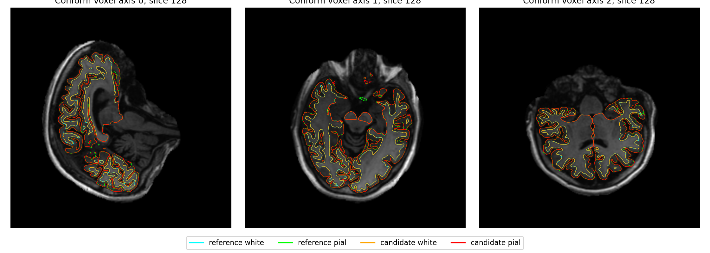
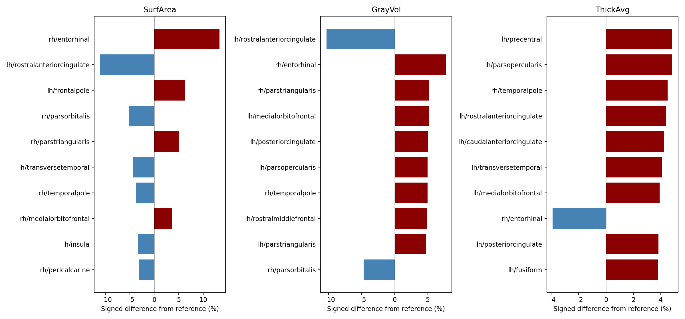
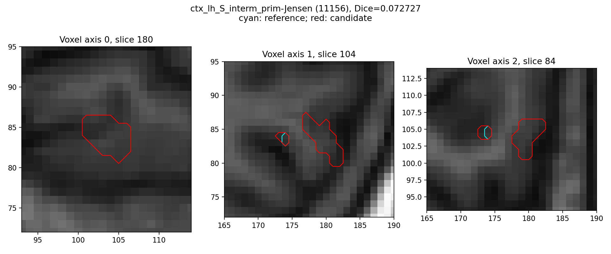

# 单幅 T1w 的 recon-all 重建

[返回首页](../../README.md) · [安装与原生程序](CONDA_CPP_BUILD.md) · [阶段与官方命令](CONDA_CPP_STAGES.md) · [验收范围](../../validation/recon_all/python_gpu_port/RELEASE_GATES.md)

`fnit-recon-all` 从一幅 T1w 生成体积分割、双侧皮层表面、顶点指标、脑区标注和统计。标准路径依次执行[MNI152 非线性变换](MNI_NONLINEAR_CHAIN.md)、拓扑修复、`white.preaparc`、球面生成与配准、最终 white、[Conda 源码构建的四轮 pial 放置](NATIVE_PIAL_PLACEMENT.md)和后处理。必要程序或资产缺失时，入口在运行前报错；阶段失败时抛出异常并保存报告。当前支持单幅 T1w；多 T1、T2/FLAIR 和纵向重建不在此接口的范围内。

本页描述当前源码的调用方式。[2026-10-01 修复与实测](../../validation/recon_all/python_gpu_port/performance_20261001/README.md)绑定本次实际计算提交；[此前完成的整例](../../validation/recon_all/python_gpu_port/current_full_runs_20260930.json)继续作为配对基线，不能代替新版本结果。执行完成、138 项完整性、网格质量、严格复现诊断与优化前后指标分别记录。整体指标等效阈值尚未正式确认，当前为 `not_assessed`；严格逐文件比较保留用于排错。具体口径见[比较方法](BENCHMARK_METHODS.md)与[验收说明](../../validation/recon_all/python_gpu_port/RELEASE_GATES.md)。

本轮先修正 conform 单精度矩阵求逆的乘法顺序，再用同一原始 T1 连续验证前段；未增加体素或被试特例。[前段逐阶段报告](VOLUME_PREFIX_PARITY_20260930.md)保留修复前后体素、N4 浮点首差、四组 EM 交叉输入及资源记录。历史精度问题与性能优化新增差异分别记录。

CUDA 流程已接入既有第二次归一化、SynthMorph 非线性配准和[厚度、面积、曲率](SURFACE_METRICS.md)函数；SynthMorph 跳过无人使用的两幅重采样图，MNI 保留已验证的 FP32 例外。两例归一化同输入体素一致；20 张表面指标图全部通过已有算子容差。warp 的 CPU/CUDA 浮点尾差及检查图差异完整保留，阶段加速不当作整例提速。实测见[性能记录](../../validation/recon_all/python_gpu_port/performance_20260930/README.md)。

此前按真实剖析优化[球面法向的面关联索引](SURFACE_NORMALS.md)，八张真实网格逐元素一致；该版本两例整例的结果在本页历史配对节中保留。

2026-10-01 进一步复用已有厚度和统计函数：[完整空间候选厚度](SURFACE_THICKNESS.md)取消密集全顶点距离及逐顶点 Python 搜索，两例双侧八轮与原函数逐值相同；[多图谱缓存](SURFACE_STATS_CACHE.md)让图谱共享同版本几何基础量，48 份统计文本相同。SynthSeg 在前向作用域应用并记录[实际精度策略](SYNTHSEG_PRECISION.md)，修正构造函数覆盖设置的问题。新增[可选剖析](PROFILING.md)及[Torch/Numba 预算](THREAD_BUDGET.md)。这些阶段结果与当前整例状态分别报告，未据此宣称整例提速。

## 安装

在仓库根目录创建[主页 Conda 环境](../../environment.yml)，然后运行[原生程序安装脚本](../../tools/setup_recon_all_native_conda.sh)。脚本从固定 FreeSurfer 源码提交编译所需程序并安装至当前 Conda 环境；不会调用系统安装的 FreeSurfer。模型、模板及个人许可证单独提供。

```bash
conda env create -f environment.yml
conda activate fnit
bash tools/setup_recon_all_native_conda.sh
fnit-setup-weights --model recon-all --dest /data/fnit-weights
fnit-setup-recon-all-assets --dest /data/fnit-assets
fnit-setup-weights --model recon-all --dest /data/fnit-weights --verify-only
fnit-setup-recon-all-assets --dest /data/fnit-assets --verify-only
```

默认资产组包含标准单 T1 流程所需的 98 个文件，入口逐项检查大小及 SHA-256。`recon-all` 权重组包含非线性 SynthMorph 权重；其来源已对照固定的 [FNIT assets-v1 Release 与清单](https://github.com/weikanggong1/Fudan-Neuroimaging-toolkit/releases/tag/assets-v1)。安装器优先从该 Release 获取获准再分发的权重，再校验原文件大小和 SHA-256；未获再分发许可的第三方图谱仍从原作者网站获取。安装脚本也支持开发者用 `FNIT_RECON_ALL_SOURCE` 指向已准备好的固定源码。构建的命令、补丁、哈希和 Conda 记录见[安装说明](CONDA_CPP_BUILD.md)。2026-09-29 已从主页环境文件创建新 Conda 环境，并从已校验的固定源码归档编译安装所需程序；98 项标准资产已全新下载并复核；[两例当前安装产物的连续整例](../../validation/recon_all/python_gpu_port/current_full_runs_20260930.json)输出和网格检查通过，严格数值验收仍未通过。

## 运行

```bash
export FS_LICENSE=/private/license.txt
fnit-recon-all /data/sub01_T1w.nii.gz /data/subjects/sub01 \
  --weights-dir /data/fnit-weights \
  --assets-dir /data/fnit-assets \
  --device cuda:0 --threads 4
```

`FS_LICENSE` 指向用户自己的许可证文件。默认从激活的 Conda 环境 `bin/` 寻找原生程序；`--native-bin-dir` 可指定已核验的开发者构建目录。没有 GPU 时可使用 `--device cpu`。`subject_dir` 须不存在或为空。

```python
from fnit.recon_all.native_free import run_recon_all_python

report = run_recon_all_python(
    t1="/data/sub01_T1w.nii.gz",  # 一幅原始 T1w NIfTI 的路径
    subject_dir="/data/subjects/sub01",  # 空的被试输出目录
    weights_dir="/data/fnit-weights",  # 已校验的模型权重目录
    assets_dir="/data/fnit-assets",  # 已校验的模板和图谱目录
    device="cuda:0",  # PyTorch 阶段的设备；无 GPU 时为 "cpu"
    threads=4,  # Torch intraop 与当前调用线程的 Numba 掩码；不代表进程总线程数
    native_bin_dir=None,  # None 表示使用当前 Conda 环境的 bin/
    profile_stages=False,  # 生产默认不增加阶段 CUDA 同步；True 记录同步等待
    cuda_allocator_cache="auto",  # 首次 CUDA 默认关闭缓存；已初始化 API 保留实际策略
)
# report 是运行报告字典；仅在全部阶段与文件完整性检查通过后返回。
```

`run_recon_all_python(...) -> dict` 的输入参数均在上例中列出。入口把原始 T1 重采样到 1 mm、256³ 的 conform 网格；`mri/orig.mgz`、分割图与最终体积图均在该网格上。`surf/lh.*`、`surf/rh.*` 使用该被试的 surface RAS，网格文件保存有序顶点和三角面；`surf/H.thickness` 等顶点图及 `label/H.*.annot` 与对应半球的顶点顺序对齐。原始 NIfTI 仿射和 conform 网格不能互换使用。

主要输出位于被试目录下：

| 路径 | 内容与结构 |
| --- | --- |
| `mri/*.mgz`、`mri/transforms/*` | 体积分割、强度图和配准变换；MGH 体积为 conform 网格，部分 MNI 辅助 NIfTI 为图谱网格。 |
| `surf/H.white`、`H.pial`、`H.sphere.reg` | 双侧有序三角网格；`H` 为 `lh` 或 `rh`。 |
| `surf/H.thickness`、`H.area`、`H.volume`、`H.curv` 等 | 每顶点标量，顺序与同侧表面一致；厚度与几何位置单位为 mm，面积为 mm²，体积为 mm³。 |
| `label/H.*.annot` | 每顶点脑区编码及颜色表。 |
| `stats/*.stats` | 体积和皮层分区统计。 |
| `fnit-native-free-run.json` | 阶段耗时、原生程序哈希、输出清单、文件完整性、网格质量和数值验收状态。 |

固定单 T1 profile 的全部 138 个相对路径由[清单](../../src/fnit/recon_all/expected_outputs.py)定义。`report["outputs"]` 是实际存在的 `{相对路径: 绝对路径}` 映射；`report["output_validation"]` 给出 138 项存在性检查；`report["mesh_validation"]` 逐侧检查闭合球面拓扑、顶点顺序、有限坐标及 white/pial 自相交；`report["numeric_validation"]` 单独记录参考结果的数值验收，默认是 `not_run`。`report["stages"]` 为按执行顺序排列的阶段名、秒数和可得的 PyTorch GPU 峰值字节数。默认关闭 CUDA 分配缓存时，父进程的 PyTorch 峰值接口不可用，以 `gpu_memory_mode` 说明，整例显存仍需进程级外部采样。`status="complete"` 只表示全部阶段执行、输出存在性和网格质量检查通过，不表示已与官方结果达到数值门槛。运行失败会抛出异常，部分失败信息写在 JSON 中；入口前置校验失败时可能尚未创建 JSON。

批量 Python API `run_recon_all_python_batch(jobs=..., weights_dir=..., assets_dir=..., devices=..., threads=..., native_bin_dir=None)` 中，`jobs` 是按顺序排列的 `{"t1": 路径, "subject_dir": 空目录}` 列表；`devices` 是可用设备列表；其余参数与单被试一致。返回值为同序的报告列表；任一被试失败时抛出 `RuntimeError`。每个设备一次运行一例。

## 历史整例配对：e036f57（2026-09-30）

本节结果仅属于 `e036f57` 法向优化版本。2026-10-01 的代码、阶段回归、资源记录和新整例状态见[当前验证目录](../../validation/recon_all/python_gpu_port/performance_20261001/README.md)。

本轮候选计算源码固定为 `e036f57b62b99d2af4cd8853ab2f1e6d2a9f8c68`，直接基线为 `279e09f0d2a166237871b3d683a6be75bd5e99b4`。两例均从原始 T1 和新空目录连续运行，使用相同主页 Conda 安装产物；两幅输入、11 项权重、102 项已安装资产、14 个 Conda 程序与 6 个参考程序重新核验，哈希变化数为 0。源码归档及逐报告 SHA-256 见[机器可读整例记录](../../validation/recon_all/python_gpu_port/current_full_runs_20260930.json)。GPU 例验证预初始化 CUDA 的 Python API，CUDA 可见设备与 NVML 采样均固定到 GPU 1 的 UUID；CPU 例验证 CLI。两者的 PyTorch/支持该选项的原生程序均设置 4 线程；Numba 默认分别为 128/192，没有全局限制 BLAS/OpenMP。

| 真实 T1 与设备 | 基线函数全程 | 当前函数全程 | 本次观察变化 | 当前外层命令全程 | 输出与网格 |
| --- | ---: | ---: | ---: | ---: | --- |
| sub-01，gpucw1 H100 GPU | 6303.79 s | 7422.34 s | 慢 17.74% | 7437.40 s | 138/138，双侧通过 |
| sub-02，nodecw10 CPU | 6099.80 s | 5756.04 s | 快 5.64% | 5764.93 s | 138/138，双侧通过 |

两例均完成 66 阶段、退出码 0。CPU 整例本次缩短 343.76 秒；GPU 双侧 surface 从 1117.56/935.27 s 降到 832.94/735.07 s，但整例变慢。WM 编辑、wm_pretess 和 MNI 分别增加约 633、281、652 秒，这些前段实现没有因法向优化而改变；延迟原因尚未确认，所有等待保留在实际总时间中。同一 WM 输入在整例结束后独立重跑为 31.68/31.94 秒，体素与几何一致，但该诊断未重建父进程 CUDA 状态，不能据此认定慢在 CUDA 同步。当前 GPU 最慢阶段为 MNI 1018 s、双侧 surface 833/735 s、WM 编辑 666 s 与 GCA 注册 654 s；CPU 为双侧 surface 829/796 s、最终表面 633/640 s。[完整阶段与诊断](../../validation/recon_all/python_gpu_port/performance_20260930/README.md)。

函数全程包括加载、传输、计算和读写；外层时间另含导入、资源校验和初始化。最初 `b8cd17b` 的函数全程为 5884.96/6080.80 s，本次相对它为慢 26.12% / 快 5.34%。共享硬件单次观察不能证明稳定吞吐，未把局部提速或扣除等待后的时间称为 GPU 整例提速。

整例结束后，冻结同一 FNIT 输入重跑 MNI 为 166.33 s，其中求逆 110.46 s；三个输出的数组、dtype、仿射与头全部一致。[重放报告](../../validation/recon_all/python_gpu_port/performance_20260930/sub01/mni_e036f57_after_full_report.json)与[逐值回归](../../validation/recon_all/python_gpu_port/performance_20260930/sub01/mni_e036f57_after_full_comparison.json)确认计算结果未变；独立新进程不复现原整例状态，该时间没有替代整例的 1018.06 s。

GPU 显存最大采样父子进程合计为 **19,411,238,912 字节（19.41 GB，18.08 GiB）**，2611 行的间隔中位数 2 s、最大 656 s，五个间隔超过 30 s。最大观察值低于预算，但采样存在长空窗，整例持续低于 20,000,000,000 字节**未验证**。已初始化 CUDA 的 API 显式关闭分配缓存；缓存开启的完整 API 和无预装软件的干净环境仍未验证。[显存口径](GPU_MEMORY.md)。

### 严格复现与优化退化

| 比较 | sub-01 GPU | sub-02 CPU |
| --- | ---: | ---: |
| 相对直接优化前基线，138 项严格诊断 | 138/138 | 138/138 |
| 相对独立官方参考，138 项严格诊断 | 5/138 | 2/138 |
| 相对基线，七张离散分割图全部标签 Dice | 1 | 1 |
| 相对基线，68/45/70 区统计差 | 0 | 0 |
| 相对基线，同网格 white/pial 坐标差 | 0 mm | 0 mm |

本次法向优化没有新增严格失败。此前 `279e09f` 相对最初 `b8cd17b` 的 GPU 五项差异仍保留：MNI 前向/逆向 warp、检查图及双侧 w-g.pct。warp 的 P99 差约 0.000015/0.000031 mm，逆向最大差 0.000473 mm；最近邻检查图有 19 个体素不同、最大 42 灰度级。w-g.pct 有 123/89 个顶点改变，最大 0.000683/0.000973 百分点，P99 为 0；冻结体积、white、cortex，仅交换厚度后完全重现候选图，确认厚度尾差经采样坐标传播。对应[直接基线记录](../../validation/recon_all/python_gpu_port/performance_20260930/summary_279e09f/current_full_runs_20260930.json)继续用于诊断，严格阈值没有放宽；整体指标等效仍为 `not_assessed`。

### 相对官方的最终指标与局部差异

官方参考独立生成，生产计算没有读取参考。参考命令为 `recon-all -i T1w.nii.gz -s subject -sd subjects -all -parallel -openmp 4 -itkthreads 1`。本轮复用原参考和已有同主机 N4/EM 重放证据，没有重新执行官方整例重复性测试；历史官方日志约 6790/4144 s 不作为本轮的配对速度基线。

[当前最终指标汇总](../../validation/recon_all/python_gpu_port/final_metric_consistency_20260930.json)保留最差脑区及逐指标报告链接。下表百分比为同名脑区绝对相对误差中位数，参考值为零的区单独列出；`r` 是跨匹配脑区的相关性。

| 当前指标相对官方参考 | sub-01 | sub-02 |
| --- | ---: | ---: |
| 皮层灰质总体积有符号差 | +1.115% | +0.535% |
| aparc 68 区面积 | r=0.999734；中位误差 1.439% | r=0.999759；中位误差 1.060% |
| aparc 68 区灰质体积 | r=0.999428；中位误差 1.658% | r=0.999767；中位误差 1.183% |
| aparc 68 区平均厚度 | MAE 0.037515 mm；最大 0.158 mm | MAE 0.021691 mm；最大 0.121 mm |
| aseg 45 结构体积 | 中位误差 0.151% | 中位误差 0.035% |
| wmparc 70 区体积 | 中位误差 1.894% | 中位误差 1.397% |
| aparc+aseg 各标签 Dice 中位数 / 最低值 | 0.949967 / 0.864957 | 0.964191 / 0.873358 |
| Destrieux+aseg 各标签 Dice 中位数 / 最低值 | 0.914060 / 0.072727 | 0.935199 / 0.737984 |

候选和官方网格不同，不能将同名区域统计写成逐顶点一致。双向点到三角面距离的 white 均值为 0.071–0.084 / 0.035–0.041 mm，pial 均值为 0.081–0.109 / 0.060–0.073 mm；局部最大值仍达 6.339 / 3.185 mm。sub-01 的最低 Dice 为左侧 `S_interm_prim-Jensen`，该区及局部边界差异不能被平均相关性掩盖。球面与 sphere.reg 向内/退化面数为 0；white/pial 各自自相交通过，二者相互穿越尚未单独验收。







图示分别显示 conform T1 切面上的参考/候选表面、最差十区有符号偏差和最低 Dice 分区边界。实际文件名、输入及脚本哈希见[完整 sub-01 配对](../../validation/recon_all/python_gpu_port/performance_20260930/sub01/full_e036f57_pair/summary.json)与[sub-02 配对](../../validation/recon_all/python_gpu_port/performance_20260930/sub02/full_e036f57_pair/summary.json)。图用于定位，不替代逐值报告或整体等效判定。

## 验证与边界

```bash
python validation/recon_all/python_gpu_port/compare_complete_subject.py \
  /data/reference-sub01 /data/subjects/sub01 \
  --report /data/sub01-comparison.json
```

比较需要单独生成的真实 T1 官方参考目录。[固定 138 项比较器](../../validation/recon_all/python_gpu_port/compare_complete_subject.py)检查体积、表面、顶点图和统计；同输入阶段、自产前段连续链、原始 T1 整例分别记录。整例另外保存各分区 Dice、双向点到三角面距离和逐脑区偏差；顶点数或有序面不同时不进行同索引比较。资源报告与外部进程采样分开，单位为字节并展示 GB/GiB。标准流程默认允许 TF32，SynthStrip、SynthSeg、Talairach affine 与 MNI 非线性有已验证的 FP32 例外；不自动启用 FP16/BF16。

各阶段的输入、输出、官方命令和真实数据记录见[阶段索引](CONDA_CPP_STAGES.md)。

## 参考文献与原实现

- Fischl B. FreeSurfer. *NeuroImage*. 2012;62(2):774–781. [doi:10.1016/j.neuroimage.2012.01.021](https://doi.org/10.1016/j.neuroimage.2012.01.021)。
- [FreeSurfer 官方 recon-all 说明](https://www.freesurfer.net/fswiki/recon-all)。
- [FreeSurfer 原实现代码库](https://github.com/freesurfer/freesurfer/tree/d932c45b7941662ea380a05efef580568b98d41a)。
