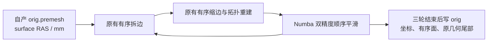
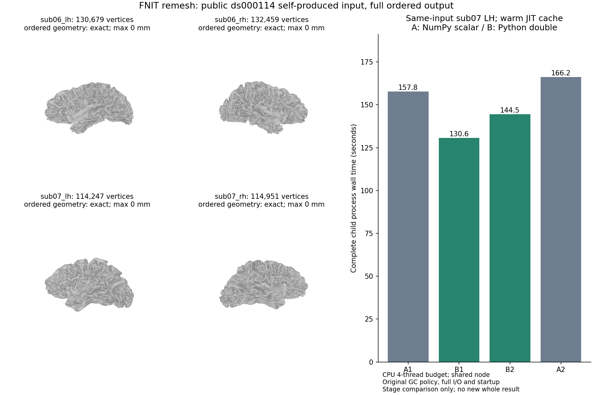

# remesh 的双精度标量存储优化

## 1. 功能与实现范围

FNIT 现有 `mris_remesh_python.py` 是固定 FreeSurfer 源码规则的
Python/Numba CPU 实现。它按边长和原边编号逐边拆分、收缩，再按原顶点顺序
执行 Gauss–Seidel 平滑。此次复用完整实现，增加显式
`scalar_storage="python"`：只把控制流中的坐标标量从 NumPy 双精度对象
变成 Python 双精度对象，避免逐坐标 NumPy 标量 dispatch。
Numba 平滑的数组、表达式、累加顺序和输出精度保持原值。

默认 `scalar_storage="numpy"` 保留原路径。动态拓扑没有改成同时更新，
没有新增 GPU 后端；20 GB 显存门不适用于这个 CPU 阶段。生产调度尚未
选择此候选，不将阶段结果称为原始 T1 整例提速或整体指标等效。



## 2. Python 调用、输入输出与限制

```python
from fnit.recon_all.mris_remesh_python import remesh_surface

remesh_surface(
    input_path="/data/subject/surf/lh.orig.premesh",  # FNIT 自产三角表面，surface RAS/mm
    output_path="/data/remesh_diagnostic/lh.orig",   # 已创建的新诊断目录，避免覆盖既有输出
    iterations=3,                                  # 标准三轮拆边、缩边和顺序平滑
    scalar_storage="python",                       # 显式 CPU 双精度标量候选；默认 numpy
)
```

| 函数与参数 | 输入、默认值和意义 | 输出 |
| --- | --- | --- |
| `remesh_geometry(vertices, faces, iterations=3, *, scalar_storage="numpy")` | `vertices` 为有限 `(N,3)` surface RAS/mm 坐标；`faces` 为有序 `(F,3)` 三角面顶点编号；内部坐标为 float64。`iterations` 为非负整数，标准为 3；`scalar_storage` 只允许 `numpy` 或 `python` | `(float32(Nnew,3), int32(Fnew,3))`，按原算法产生的新编号；不修改输入数组、不读写文件 |
| `remesh_surface(input_path, output_path, iterations=3, *, scalar_storage="numpy")` | 输入是 FreeSurfer 三角表面文件；输出父目录须存在；迭代数和标量策略同上 | 返回 `None`；nibabel 写出 float32 坐标、int32 有序面，保留输入原始 volume-info 等几何尾部 |
| `Mesh(points, faces, *, scalar_storage="numpy")` | 内部 `(N,3)` 双精度坐标三元组列表、整数面列表；默认保留输入坐标表示，`python` 创建 Python 双精度坐标三元组 | 可变 Mesh，含原有有序边、面、顶点邻接；没有独立官方 CLI |
| `smooth(mesh, repeats=2)` | 完整 Mesh；默认两轮；采用 `mesh.scalar_storage`，缺失属性按旧路径处理 | 原位更新 `mesh.points`；Numba 始终使用 float64 数组，结束后恢复指定标量表示；返回 `None` |

目标边长仍为初始平均边长的 0.8；拆分门为目标的 4/3，收缩门为目标的
4/5。每轮初始面法线、连接性和角度约束、同长度边编号排序、动态重新入堆、
顶点与面压缩规则以及全部平滑步骤保持原值。

非法 `scalar_storage` 抛 `ValueError`；文件接口在读写前检查该参数。
负迭代数抛 `ValueError`。无效索引、非流形拓扑、退化法线和零邻接总面积
沿用原有异常或断言；文件读写失败抛异常。失败文件不能视为完整结果。
本函数不负责后续自相交修复，不能以完成 remesh 代替网格质量验收。

## 3. 命令行与复现报告

remesh 库没有独立安装的 CLI。阶段测量复用仓库现有完整 benchmark worker，
下列诊断驱动只增加粗粒度时钟，不替换算法：

```bash
# SOURCE 是冻结源码中的 src；INPUT 是真实自产 orig.premesh。
# OUTPUT 必须不存在；固定全部 CPU 线程预算并隐藏 CUDA。
PYTHONPATH=validation/recon_all/python_gpu_port \
CUDA_VISIBLE_DEVICES="" OMP_NUM_THREADS=4 OPENBLAS_NUM_THREADS=4 \
MKL_NUM_THREADS=4 NUMBA_NUM_THREADS=4 \
python validation/recon_all/optimizations/20261009_inflate_torch/profile_remesh_current.py \
  --source "$SOURCE" \
  --input "$INPUT" \
  --output "$OUTPUT" \
  --version "$VERSION" \
  --threads 4 \
  --scalar-storage python \
  --gc-policy inherit
```

`--scalar-storage` 默认 `numpy`；`--gc-policy` 默认 `inherit`。`suspend`
只在独立诊断进程临时关闭自动垃圾回收，恢复前的 `gc.collect()` 耗时计入
完整驱动墙钟，**不是库或生产策略**。`--profile` 输出 cProfile，
`--decision-trace` 记录每个 heap pop/push、拆边、收缩接受/拒绝、
中点及每次完整 pass 的坐标/有序面 SHA；两者的观察开销单独报告，不能
当作无剖析性能成绩。

输出包括原 worker 的 `report.json`、新增 `detail.json` 和 `surface`。
阶段墙钟包含读写和 JIT；驱动墙钟另外包含参数、导入、报告读写和延后回收；
外部进程墙钟包含解释器启动与退出。这三层互相包含，不能相加。
`max_rss_kib` 另以字节保存，正文同时展示 GB/GiB；没有初始化 CUDA，不记录虚假的
PyTorch allocated/reserved=0。

四网格与独立新进程 ABBA 的可复现入口如下。`INPUT_DIRECTORY` 须含
`sub06_lh.orig.premesh`、`sub06_rh.orig.premesh`、`sub07_lh.orig.premesh`
和 `sub07_rh.orig.premesh` 四个已核对 SHA 的真实网格：

```bash
# SOURCE 是候选冻结 src；PAIR_OUTPUT 必须不存在；WARM_CACHE 指同源码的预热 Numba 缓存。
# 另用 taskset 绑定实际可用的四个 CPU 核，不能与别的任务共用同一线程预算。
python validation/recon_all/optimizations/20261009_inflate_torch/run_remesh_scalar_pair.py \
  --source "$SOURCE" \
  --input-dir "$INPUT_DIRECTORY" \
  --output "$PAIR_OUTPUT" \
  --version "$VERSION" \
  --threads 4 \
  --numba-cache "$WARM_CACHE"
```

此入口复现参数与顺序；本次实际私有控制脚本 SHA 为
`ed2cd062f583168ff7e3146231908187d23bcdded8215b68cb9862e30d05e441`，
源码和驱动 SHA 另存于各条收据。新公开入口不改标为当时私有脚本的 SHA。

四网格配对结束后通过
[`summarize_remesh_scalar.py`](../../validation/recon_all/optimizations/20261009_inflate_torch/summarize_remesh_scalar.py)
汇总，同索引误差仅在顶点数及有序面一致时计算。汇总读取冻结真实结果，
不补跑、不修改原报告：

```bash
# 各路径均指已完成的独立诊断目录；PRODUCTION 是原 589 整例结果的只读根目录。
PYTHONPATH=validation/recon_all/python_gpu_port \
python validation/recon_all/optimizations/20261009_inflate_torch/summarize_remesh_scalar.py \
  --baseline "$BASELINE" \
  --candidate "$CANDIDATE" \
  --production "$PRODUCTION" \
  --output "$SUMMARY"
```

## 4. 对应官方调用

隔离 benchmark 的对应命令为：

```bash
# 同一个真实 orig.premesh；官方输出只能用于比较，不进入 FNIT 生产输入链。
mris_remesh --remesh --iters 3 "$INPUT" "$OFFICIAL_OUTPUT"
```

本轮 CFFF 没有已声明的独立官方 `mris_remesh` 程序，未补测官方同输入
运行。生产 native bundle 不能冒充官方安装程序。此处的实测对照是
FNIT 已有实现与显式候选；历史官方阶段比较继续绑定其原版本。

## 5. 最新真实数据精度与耗时

实测使用公开 ds000114 sub06/sub07 在 `589e2749` 原始 T1 整例中自产的
双侧 `orig.premesh`。输入、源码、驱动、完整几何和创建记录均保存 SHA。
机器为 Xeon Platinum 8369B/A100 节点；本阶段仅使用 CPU 核 64–67、
固定四线程，CUDA 不可见。节点同时存在其他 CPU/GPU 工作，因此报告
是本次配对观察，不能当作独占硬件吞吐。

当前剖析：sub07 LH 的无 cProfile 冷阶段 143.088 s、后续热阶段
123.991 s。热阶段拆边 19.833 s、缩边 82.591 s、完整顺序平滑 2.222 s。
拓扑重建包含在缩边与总阶段内，不重复相加。

cProfile 诊断约 201 s，记录 89,803,377 次调用：14 次 rebuild 的累计
71.160 s，168 次 `.tolist()` 累计 40.804 s，12,434,522 次
`edge_length()` 累计 22.009 s。垃圾回收观察开销与容器转换可能重叠；
这些数值不是可直接从总阶段减去的加速空间。

sub07 LH 使用同一候选源码、预热 Numba 缓存、原 GC 策略和独立新进程的
ABBA 已完成。A 为默认 NumPy 标量，B 为显式 Python 双精度标量：

| 完整回归 | A1 | B1 | B2 | A2 | A 中位数 → B 中位数 |
| --- | ---: | ---: | ---: | ---: | ---: |
| 阶段，含读写/JIT（s） | 153.484 | 126.818 | 140.155 | 161.644 | 157.564 → 133.486（缩短 15.28%） |
| 新进程，含启动/退出（s） | 157.807 | 130.617 | 144.462 | 166.235 | 162.021 → 137.540（缩短 15.11%） |

独立逐边回放与原冻结源码一致：241,808 次拆边、237,217 次收缩检查
（236,271 次接受）、916,601 次 heap pop 和 299,009 次 heap push，
完整流 SHA 为 `d05043d52b37ed74c4c461f857e649518376e2228f4bd71282f8ba51bf53b588`。
全部 27 个 pass 的 float64 坐标和有序面 SHA 相同。这不是只比较最终 shape
或最近顶点距离；每次实际接受、拒绝、重新入堆及中点都参与回放。

其余三个真实网格的完整单对如下。它们每种策略只测一次，不把单对结果
称为稳定吞吐：

| 网格 | 顶点/面 | 含读写阶段 A→B（s） | 含启动/退出进程 A→B（s） | 同索引最大/P99 位移 |
| --- | --- | ---: | ---: | --- |
| sub07 RH | 114,951 / 229,898 | 162.601 → 113.359 | 166.282 → 119.846 | 0 / 0 mm |
| sub06 LH | 130,679 / 261,354 | 218.856 → 165.394 | 222.773 → 169.959 | 0 / 0 mm |
| sub06 RH | 132,459 / 264,914 | 197.474 → 126.035 | 202.557 → 129.292 | 0 / 0 mm |

sub07 LH 输出 114,247 顶点、228,490 面，同索引最大/P99 位移也是 0。
四网格的全部 pass 接受次数、最终坐标、有序面和原始尾部一致，且与
原 `589e2749` 实际完整生产链保存的 `orig` 一致。原始二进制坐标、面及尾部
payload SHA 也相同；整个文件 SHA 因 nibabel 创建记录的时间不同而不同，
不能称全文件逐字节相同。只保存创建记录的 SHA 和字节数，不发布运行账号。

此次 ABBA 的 coarse/GC 观察器在两策略中相同，观察开销包含在时间内；
未执行去观察器的原始 T1 新整例，不把这些收益改写成整例收益。RSS 峰值
在 1,936,674,816–2,182,524,928 字节之间，约 1.937–2.183 GB（1.804–2.033 GiB）。
这是 CPU 内存，不能用作整例显存验收。

严格回归门在运行前固定为坐标、有序面、原始尾部及完整逐边决策一致，
未降低阈值。执行和阶段严格回归通过；自相交/非流形等全部网格质量没有
在本次摘要重新运行，阶段不替代生产门控；整体指标等效为 `not_assessed`。

完整数据见[机器可读汇总](../../validation/recon_all/optimizations/20261009_inflate_torch/reports/a100_remesh_scalar_20261010_v1/paired/summary_v4.json)、
[逐次阶段/进程/CPU 内存 CSV](../../validation/recon_all/optimizations/20261009_inflate_torch/reports/a100_remesh_scalar_20261010_v1/paired/timing_metrics.csv)和
[完整公开收据](../../validation/recon_all/optimizations/20261009_inflate_torch/reports/a100_remesh_scalar_20261010_v1/public_export_manifest.json)。
大 `detail.json` 以无损 `.json.gz` 保存所有 GC 事件，解压内容 SHA 保持原值，
不删事件；存储映射见
[压缩清单](../../validation/recon_all/optimizations/20261009_inflate_torch/reports/a100_remesh_scalar_20261010_v1/compressed_report_manifest.json)。



## 6. 本轮版本与记录

- 既有几何模块冻结 SHA：`1dd2d706d3d753e87d6c4f77dd7b69951affbd977e289c9018fcfeb1bcb1af28`。
- 显式标量候选实际 SHA：`17288a05177fd09fa3e757b9c84cc56466e3e2c9f6acaf6998aba1d32fa83706`。
- 同输入算子与原 Gauss–Seidel 指纹：9/9 通过，5.76 s；小网格测试只验证接口和顺序规则，真实四网格另报。
- 初步 GC 探索中，临时关闭回收没有稳定收益；保留原默认和反例，不据此全局关闭 GC。
- 没有新增依赖。NumPy、Numba、nibabel 已在主页 Conda 安装路径声明。
- 旧 remesh/quick-sphere 与完整原始 T1 报告见 [CPU 几何优化](CPU_GEOMETRY_PERFORMANCE.md)，保留其原版本绑定；本轮未覆盖旧 benchmark。

## 7. 原软件代码与参考

固定源码：[FreeSurfer `mris_remesh`](https://github.com/freesurfer/freesurfer/blob/d932c45b7941662ea380a05efef580568b98d41a/mris_remesh/mris_remesh.cpp)。
FNIT 实现：[mris_remesh_python.py](../../src/fnit/recon_all/mris_remesh_python.py)。
Numba 顺序平滑与前次热点说明：[CPU 几何优化](CPU_GEOMETRY_PERFORMANCE.md)。

表面重建背景：Dale AM, Fischl B, Sereno MI. *Cortical surface-based
analysis. I. Segmentation and surface reconstruction.* NeuroImage 9,
179–194 (1999). 本轮只改变内部双精度标量表示，没有另定义表面算法。
