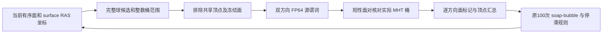
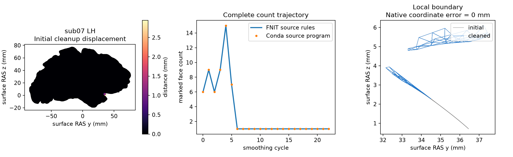

# 源规则有向相交标记与 PyTorch 清理

## 1. 功能与流程

`mark_source_intersections()` 按固定 FreeSurfer 源码逐面查询的方向，复用
FNIT 已有 FP64 三角面对谓词和 1 mm MHT 桶采样。PyTorch 后端复用已有
完整空间候选索引，不截断候选；soap-bubble 坐标更新仍使用源顺序 CPU
实现。它是表面放置内部算子，不是完整 white 或 pial 的 GPU 替代。

本轮定位了成熟清理子函数的一个检测规则问题：旧实现对无序面对只判断
一次，并把阳性同时赋给两个面；源命令分别查询两个方向，只标当前查询
面。源平面阈值和共面分支存在方向差异。新实现还保留共享顶点排除、面
rip 标志与实际共享 MHT 桶条件，避免用普通几何 AABB 排除源容差阳性。



`repair_intersections(marking_backend="source_torch")` 显式选择该路径；默认
`legacy` 和既有 pial 生产路径保持原行为。新后端只在一次清理中复用
完全相同坐标的标记，任一坐标变化即失效。仍执行所有平滑周期和原停止
规则，不通过少跑迭代提高速度。已有依赖足够，无新安装项，无半精度。

## 2. Python 调用、输入与输出

```python
import nibabel.freesurfer.io as freesurfer_io
import numpy as np
from fnit.recon_all.place_surface_intersection_marking import mark_source_intersections
from fnit.recon_all.place_surface_final_cleanup import repair_intersections

surface_vertices, surface_faces = freesurfer_io.read_geometry("/data/fnit/lh.orig")
marked_vertices, intersecting_face_count = mark_source_intersections(
    vertices=surface_vertices,  # (N,3)，surface RAS，单位mm
    faces=surface_faces,  # (F,3)，有序整数顶点编号
    face_ripped=None,  # 可选(F,)面冻结标志；与顶点rip不同
    predicate_backend="torch",  # 完整候选与双方向源谓词
    device="cuda:0",  # 明确进程内CUDA设备
    block_faces=256,  # CPU候选的查询分块；不限制候选总量
    block_pairs=65536,  # 面对谓词分块；不截断面对
    candidate_grid_cells_per_axis=2,  # 默认完整2桶索引；3是显式加速实验
)
cleaned_vertices, cleanup_report = repair_intersections(
    vertices=surface_vertices,  # 该清理阶段实际输入坐标
    faces=surface_faces,  # 相同有序拓扑
    ripped=np.zeros(len(surface_vertices), dtype=bool),  # (N,)顶点冻结标志
    marking_backend="source_torch",  # 明确实验有向标记后端
    device="cuda:0",  # 标记用GPU；有序soap更新仍在CPU
    candidate_grid_cells_per_axis=2,  # 初始和最终清理均保持所选完整候选规则
)
```

标记器的全部参数：

| 参数 | 格式、默认值与限制 |
|---|---|
| `vertices` | 必填有限 `(N,3)` 数组，surface RAS/mm，按原顶点存储转换为 float32 |
| `faces` | 必填 `(F,3)` 整数数组，编号位于 `[0,N)`；不改变有序面 |
| `face_ripped` | `None`，等价全 False；可选 `(F,)` bool，排除冻结面 |
| `predicate_backend` | `"numba"`；可选 `"torch"`，两者均使用既有固定 FP64 源规则 |
| `device` | `None`；Torch 必须明确 `cpu` 或有编号的 `cuda:0`，不静默回退 |
| `block_faces` | 256，正整数；CPU 候选查询分块 |
| `block_pairs` | 65536，正整数；CPU/GPU 谓词分块 |
| `candidate_grid_cells_per_axis` | 2；显式3仅用于Torch较小的完整空间单元。查询仍覆盖全部3³相邻桶，并保留原FP64范围、方向和MHT检查；非法值或用于非Torch后端抛ValueError |

返回 `(marked_vertices, intersecting_face_count)`：前者为 `(N,)` bool，
后者为被源规则标记的面数，不能以标记顶点数代替。非法参数、索引或
非有限坐标抛 `ValueError`；CUDA/OOM 和完整候选预算失败原样传播。

清理器另接收 `(N,)` bool 顶点 `ripped`。`marking_backend` 默认 `legacy`，
另有 `source_numba` 与 `source_torch`；后者要求 `device`。返回 float32
`(N,3)` 坐标和 `dict`，包括初末相交面数、逐轮轨迹、标记/平滑顶点数、
周期及迭代数。有向后端另给出 `marker_calls`、`marker_evaluations` 和
`marker_identical_geometry_cache_hits`。停滞时按源规则返回最佳状态；
是否允许残余由调用阶段决定。完整 white 最终写出仍要求零相交。
清理器的 `candidate_grid_cells_per_axis` 也默认2；显式3只接受
`marking_backend="source_torch"`。不改变soap更新或停滞规则。

## 3. 命令行与复现

子算子没有独立生产 CLI。完整真实初始清理的诊断命令：

```bash
CUDA_VISIBLE_DEVICES=2 \
OMP_NUM_THREADS=4 OPENBLAS_NUM_THREADS=4 MKL_NUM_THREADS=4 NUMBA_NUM_THREADS=4 \
python validation/recon_all/python_gpu_port/benchmark_source_intersection_cleanup.py \
  --orig /data/frozen/sub07/surf/lh.orig \
  --candidate-directory /data/frozen-code/src/fnit/recon_all \
  --output-directory /data/runs/source-cleanup-v1 \
  --code-commit ACTUAL_TESTED_COMMIT \
  --native-binary /data/benchmark-native/bin/mris_remove_intersection \
  --cleanup-marking-backend source_torch --device cuda:0
```

`--orig` 是冻结真实表面；脚本重新平滑5次；可选 `--initial-checkpoint`
指定包含 `initial`、`faces` 的 NPZ，脚本核对与现场重算完全相同。
`--candidate-directory` 是冻结 FNIT 模块目录；`--output-directory` 必须
不存在；`--code-commit` 与实际模块 SHA 同时记录。原生程序只用于隔离
benchmark 的 `-map` 和完整清理。报告、诊断表面和 NPZ 不进入生产链。

GPU计时同步指定设备；CUDA初始化、诊断和完整清理分别记录。最新版
脚本另给出包含网格读取、计算和写出的文件 API 墙钟；进程启动和冷导入
另计。外部显存监测可复用 `monitor_placement_benchmark.py`，不可把
PyTorch allocated 当作整个进程占用。

较小空间单元的完整文件API ABBA使用 `benchmark_source_cleanup_grid.py`：

```bash
CUDA_VISIBLE_DEVICES=2 OMP_NUM_THREADS=4 OPENBLAS_NUM_THREADS=4 MKL_NUM_THREADS=4 \
python validation/recon_all/python_gpu_port/benchmark_source_cleanup_grid.py \
  --input-surface /data/frozen/sub07/lh.smoothed-orig.surface \
  --candidate-directory /data/frozen-code/src/fnit/recon_all \
  --output-directory /data/runs/cleanup-grid-abba \
  --code-base-commit ACTUAL_TESTED_COMMIT \
  --device cuda:0 --threads 4 \
  --native-binary /data/benchmark-native/bin/mris_remove_intersection \
  --native-repeat 2
```

输入是已经冻结的清理前表面，本脚本不重复平滑。`--candidate-directory`
指定实际候选模块；`--output-directory`须不存在；版本字符串和模块SHA
一并记录。`--threads`默认4，`--device`默认cuda:0且必须有CUDA编号。
`--native-binary`默认None，指定后仅在诊断目录重复同输入原生参考；
`--native-repeat`默认2且须为正整数。先记录两个冷调用，再执行2/3/3/2
完整配对。返回JSON、六个诊断表面、可选原生表面和私有日志；不进入生产链。

## 4. 原软件调用与规则来源

以下命令仅用于独立 benchmark：

```bash
mris_remove_intersection -map /data/frozen/smoothed-orig.surface /data/reference/marks.mgz
mris_remove_intersection /data/frozen/smoothed-orig.surface /data/reference/cleaned.surface
```

`-map` 读取相同表面，输出原生逐面标记汇总后的顶点图。两条命令默认
`FillHoles=0`，与本轮源规则一致。核心 `mrisMarkIntersections` 没有独立
CLI；`-map` 是固定源码已有的验证入口。

固定源码提交 `d932c45b7941662ea380a05efef580568b98d41a`：

| 源文件 | 现场 SHA-256 |
|---|---|
| `utils/mrisurf_metricProperties.cpp` | `458f896e7d2bdcbcdd7c9e73b2a396823d2015c723117d604bb06e3e8f27ba17` |
| `utils/mrishash.cpp` | `fbb99a00df194d82b1ca0c7965767a38c38d67c884ecc14a25bd8342cc79397c` |
| `mris_fix_topology/mris_remove_intersection.cpp` | `76c6e82d0bdfa5b4076cf2fb16c70d65103b2456f68d8926e831a8a2b40e87bf` |

本机 Conda 独立源码构建的验证程序 SHA 为
`f1ffce58956f9089e15f4709af0d3b64ddcced3c16943d6f522439351c3f2b47`。
不调用或复制系统预装 FreeSurfer 二进制。

## 5. 当前真实数据精度与时间

同一 A100 主机、公开 ds000114 sub07 LH、四线程，冻结 `orig` 平滑5次。
下列是初始清理子阶段，不能视为最终 white 或 recon-all 验收。

| 实现与冻结版本 | 计算墙钟 | 完整清理结果 |
|---|---:|---|
| 源 Numba v2，无坐标复用 | 621.139 s | 22周期/2200次soap；最终1面 |
| GPU完整候选 v3，无坐标复用 | 47.011 s | 同轨迹、同坐标；最终1面 |
| GPU完整候选 v4，相同坐标复用 | 18.015 s | 23次标记、7次计算、16次复用；同轨迹、同坐标 |

三版均与同输入原生完整清理的有序面和坐标元素完全相同，P99/最大距离
均为0 mm；初始13个顶点标记与原生 `-map` 完全相同。完整计数轨迹为
`6,9,6,9,15,7`，随后17次为1。原生清理同样残余1面，允许后续放置继续；
它不代表最终零相交门通过。

v3对应原生子进程墙钟26.506 s；它包含程序启动和表面读写，而表中GPU
数字是已导入算子的计算墙钟，不能据此宣布完整命令或整例提速。
v4相对同一GPU未复用版减少61.7%计算时间。v7追加两例双侧完整文件API，
时间包含表面读取、相交清理和输出写入：

| 固定真实网格 | FNIT已导入文件API | 原生冷子进程 | 有序面与全部坐标 |
|---|---:|---:|---|
| sub06 LH | 2.114 s | 4.026 s | 0差异 |
| sub06 RH | 2.358 s | 4.072 s | 0差异 |
| sub07 LH | 21.577 s | 37.625 s | 0差异 |
| sub07 RH | 2.043 s | 4.273 s | 0差异 |

两列启动/导入范围不同，不能直接称完整CLI提速。完整文件API报告分别
记录读取、计算、写入和冷benchmark墙钟；sub07 LH仍保留源停止规则允许的
1个中间残余面。两例双侧报告见同目录
`source_ordered_fileapi_a100_v7_{sub06,sub07}_{lh,rh}.json`。GPU allocated峰703,111,680字节、reserved峰1,608,515,584字节。
外部采样的进程树归属未解，树峰为null；整卡占用上界单列，不写成零显存。
CUDA缓存未全局关闭，TF32策略未被改写，没有FP16/BF16。

v11在同一真实sub07 LH清理前表面上比较2桶/3桶完整空间索引。表格范围为
已导入文件API，包含网格读取、同步计算与写出；不把冷JIT混入ABBA中位数。

| 顺序 | 默认2桶 | 显式3桶 |
|---|---:|---:|
| 第一组 | 18.886 s | 13.612 s |
| 反向组 | 18.747 s | 14.378 s |
| 中位 | 18.817 s | 13.995 s |

观察中位减少25.62%。六次完整清理均为相同23次标记、22周期和2200次
soap，全部坐标、有序面、完整清理记录0差异。同期两次同输入Conda源码
构建程序为30.990/30.765秒，重复几何一致，FNIT与参考全部坐标一致；
原生文件头不同，不能称整文件逐字节一致。原生列包含冷子进程启动，
不以这两列直接宣布CLI提速。中间1面残余仍按源流程返回。

[v11完整报告](../../validation/recon_all/optimizations/20261009_placement_torch/source_cleanup_grid_a100_v11_sub07_lh.json)
与外部采样记录包含实际源码、程序和输入SHA。新索引已在v12完整四轮
white验证34步及最终表面/MRI SHA不变、最终相交数0；该单次245.176秒
是集成回归，未建立整体提速或最终white对原生等效。

v14将相同现有source清理接入公开sub07 LH的完整pial，固定GPU候选3桶、
compiled实时有序MHT及CPU采样/梯度，仅改变最终标记后端。完整API
source_numba347.802秒、source_torch221.206秒；清理分项117.603→10.831秒。
两次39步/四轮的trial和坐标SHA、清理前xyz/faces/rip、清理轨迹、最终
表面字节均相同，独立source最终相交数0。

对实际清理前NPZ做CPU→GPU→GPU→CPU完整文件API回放，CPU为
121.493/130.998秒，GPU为11.267/11.048秒，中位126.246→11.158秒，本组
11.31倍。四次均15→0个面、24个顶点、1轮100次SOAP，全部坐标与清理
记录0差异。原CPU逐面cKDTree候选与筛选占用仍存在于重复调用，首次JIT
不足以解释差距；GPU复用完整索引及双向源谓词，未减少必要迭代。

完整pial是单配对1.572倍，仍慢于本机Conda原生138–141秒。对v13 legacy
的最终坐标及39步轨迹0差异，已有对原生的局部误差不变；默认仍legacy。
allocated706,536,960字节、reserved2,908,749,824字节，进程树占用因PID
归属未解为null，同期整卡上界3273 MiB。TF32和精度策略保持，没有新依赖。
[完整v14报告](../../validation/recon_all/optimizations/20261009_placement_torch/pial_source_cleanup_a100_v14_sub07_lh.json)
和[显存收据](../../validation/recon_all/optimizations/20261009_placement_torch/pial_source_cleanup_a100_v14_sub07_lh.memory.json)
绑定实际源/输入SHA；全部输入输出、具名参数、复现命令与真实T1叠加见
[完整pial说明](PYTHON_PIAL_PLACEMENT.md#复用源清理的完整pial对照v14)。

实际输入、源码、程序和报告SHA及逐轮坐标SHA分别见
[CPU源规则报告](../../validation/recon_all/optimizations/20261009_placement_torch/source_ordered_cleanup_a100_v2.json)、
[GPU完整候选报告](../../validation/recon_all/optimizations/20261009_placement_torch/source_ordered_cleanup_a100_v3.json)、
[GPU坐标复用报告](../../validation/recon_all/optimizations/20261009_placement_torch/source_ordered_cleanup_a100_v4.json)。
修正有向标记后的完整四轮white已通过最终零相交，CPU/GPU坐标和轨迹无
差异，仍与原生white有局部数值差异；见[完整white说明](PYTHON_WHITE_PREAPARC.md)。
生产默认、pial完整输出和整体指标等效尚未改判。

下图使用本次真实检查点绘制初始清理移位、与原生程序重合的逐轮计数和
局部网格边界。坐标为surface RAS，图中移位不是FNIT对原生的误差；两者
最终坐标误差为0。它不是T1叠加，也不代表最终white质量。



复现图用 `plot_source_intersection_cleanup.py --checkpoint <本次NPZ>
--comparison-report <本次JSON> --output <PNG路径> --label "sub07 LH"`；
图旁JSON绑定检查点、报告与绘图源码SHA。

## 6. 更新与 benchmark 范围

- 2026-10-09 v2：源码有向规则、MHT桶和完整停止轨迹首次同输入验证；CPU过慢。
- v3：复用既有PyTorch空间索引，完整清理坐标与原生一致，但计算仍有重复。
- v4：仅复用完全相同坐标的标记，保留所有周期与清理规则，真实完整回归通过。
- v7：两例双侧完整文件API与当前Conda原生有序面/坐标0差异。
- v11：显式3桶完整空间索引，真实完整清理ABBA中位减少25.62%；保留默认2桶。
- v12：完整white四轮接线回归34步及表面/MRI SHA与v10相同、最终0相交。
- v14：完整pial只替换source标记，39步及输出0差异；真实清理ABBA中位11.31倍，pial单配对1.572倍，默认保持。
- 本地32项控制测试覆盖方向、桶、共享顶点/rip、GPU接口、缓存失效及white四轮状态；模拟测试不替代上表真实数据。

旧v1/v2失败或慢版报告保留为排错证据，不替换其SHA或改写为当前成功。
本轮没有原始T1整例、最终white、跨被试整体等效或干净环境部署结论。

## 7. 原代码与参考文献

- [FreeSurfer固定源码：逐面标记](https://github.com/freesurfer/freesurfer/blob/d932c45b7941662ea380a05efef580568b98d41a/utils/mrisurf_metricProperties.cpp)
- [FreeSurfer固定源码：MHT与有向查询](https://github.com/freesurfer/freesurfer/blob/d932c45b7941662ea380a05efef580568b98d41a/utils/mrishash.cpp)
- [FreeSurfer固定源码：清理验证CLI](https://github.com/freesurfer/freesurfer/blob/d932c45b7941662ea380a05efef580568b98d41a/mris_fix_topology/mris_remove_intersection.cpp)
- Möller T. A fast triangle-triangle intersection test. *Journal of Graphics Tools* 2(2), 1997.
- Fischl B. FreeSurfer. *NeuroImage* 62, 774–781, 2012.
