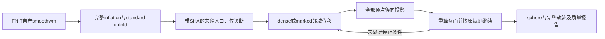

# standard sphere 末段清理：复用 GPU 与标记行候选

## 1．功能与范围

球面末段清理检测径向负面，在原规则下标记角点、必要时扩张一环，以有序邻域位移平滑，再对**全部顶点**投影到半径100 mm的球面。它检查径向翻折，不代替三维自相交或white/pial穿越检查。

现有`remove_overlap_sphere()`已是完整PyTorch实现，生产调度此前固定CPU；本轮先复用它的CUDA设备参数，未重新发明清理算法。新增显式`marked`候选只计算实际标记行的邻域位移，并省去判负不需要的平方根/单位法向，保留dtype、求和顺序、FP32平方下溢的`-0`、标记扩张、dt更新、停止顺序和全体径向投影。整数邻居复用已有inflation的有序CSR/Numba构造。



默认实现仍为`dense`，默认设备仍为CPU。`marked`是显式实验接口，不能凭单阶段提速宣布原始T1整例达到600秒或整体指标等效。

## 2．Python调用、输入与输出

```python
import numpy as np
from fnit.recon_all.sphere_standard_finish import finish_standard_sphere

finished_coordinates, negative_counts = finish_standard_sphere(
    vertices=np.asarray(unfold_coordinates, dtype=np.float32),  # (N,3)，surface RAS/mm，同序unfold输出
    faces=np.asarray(ordered_triangles, dtype=np.int32),  # (F,3)，保持原有序三角面
    start_iteration=completed_unfold_iterations,  # 实际已完成轮数，影响原停止规则；必填
    device="cuda:0",  # 默认cpu；显式CUDA设备，不静默回退
    overlap_backend="dense",  # 默认dense，复用已验证完整实现；marked为实验候选
)
```

| 参数或返回值 | 结构、默认值与意义 |
|---|---|
| `vertices` | NumPy `(N,3)`坐标，surface RAS/mm；先执行原径向投影，再转FP32张量 |
| `faces` | NumPy `(F,3)`整数有序面，合法顶点索引；转换同设备int64张量 |
| `start_iteration` | 必填int，真实已完成轮数；不能为提速改成0或减小 |
| `device` | str，默认`cpu`；显式`cuda:N`复用完整GPU清理 |
| `overlap_backend` | str，默认`dense`；`marked`只省略不会参与更新的计算，其他值在计算前报错 |
| `finished_coordinates` | CPU NumPy `(N,3)` FP32，同序最终球面坐标，包含D2H下载 |
| `negative_counts` | `list[int]`，每次更新前的负面计数；无负面时为空，不代表没有读取/投影工作 |

更底层的`remove_overlap_sphere_marked(positions=...,faces=...,start_iteration=0,max_iterations=1000,topology=None)`接收同设备Torch坐标/整数面，返回同设备新FP32坐标和同样的计数列表，不原地修改输入。`max_iterations`默认1000，完整保留原比较位置，实际可以执行1001次；还有与最小负面轮数相关的停止条件，不以名字推断实际轮数。

`OverlapTopology(triangles=...,nvertices=...)`返回完整int64邻居矩阵、度数及有效掩膜，原面顺序、完整邻域和孤立行保留；仅缓存整数拓扑。显式缓存必须匹配顶点数、同设备和有序面，否则报错。`negative_sphere_faces(positions=...,faces=...)`返回`(F,)bool`，要求FP32坐标；保留原零面积、平方下溢和非有限比较行为，不加epsilon/clamp。无效索引、设备、CUDA运行或非匹配缓存会抛异常；没有占位输出、CPU静默回退、全局TF32修改或自动半精度。

这些API不写文件，不读任何官方产物。输入有限性和最终质量仍须单独验收；底层判定沿用原NaN比较不等于质量通过。

## 3．命令行与复现

首先从原完整链透明保存清理入口，不能用最终sphere冒充真实入口：

```bash
python validation/recon_all/optimizations/20261009_inflate_torch/benchmark_sphere_finish.py \
  --data public_smoothwm_package \
  --native declared_native_bin/mris_inflate \
  --assets declared_recon_assets \
  --native-free-sha256 ACTUAL_FROZEN_NATIVE_FREE_SHA256 \
  --case ds000114_sub07 \
  --hemisphere lh \
  --output new_finish_dense_pair \
  --device cuda:0 \
  --threads 4
```

`--data`为逐SHA公开smoothwm清单；`--native/--assets`为声明源码构建程序和资产；`--native-free-sha256`为实际冻结源码SHA；`--case/--hemisphere`明确选择同序公开输入；`--output`必须是新目录；`--device`默认`cuda:0`且要求显式编号；`--threads`默认4，固定本进程预算。运行实际`_run_accurate_sphere_pair`，仅在入口保存FP32坐标、int32面和真实start_iteration的NPZ，原清理继续执行。然后CPU/GPU/GPU/CPU从相同NPZ完整回放。

标记行候选的独立八次回归为：

```bash
python validation/recon_all/optimizations/20261009_inflate_torch/benchmark_sphere_finish_marked.py \
  --checkpoint new_finish_dense_pair/finish_input.npz \
  --checkpoint-sha256 ACTUAL_CHECKPOINT_SHA256 \
  --case ds000114_sub07 \
  --hemisphere lh \
  --inflated-template new_finish_dense_pair/captured_subject/surf/lh.inflated \
  --dense-reference new_finish_dense_pair/1_cpu.sphere \
  --output new_finish_marked_pair \
  --device cuda:0 \
  --threads 4
```

NPZ以`allow_pickle=False`读取且核对SHA；`--inflated-template`只提供原输出的几何文本，`--dense-reference`仅在候选计算完成后读取用于比较，不修补候选。CPU dense、CPU marked、GPU dense、GPU marked之后反向重复，各两次完整执行。输出`summary.json`、同序sphere及逐轮负面/marked/实际标记行SOAP位移/全体投影SHA、dt/扩张/停止状态。

实际调度接线的完整双侧冷链使用另一个脚本，两组均完整Torch inflation和子缓存开启，只通过真实`sphere_finish_backend`选择原dense CPU/GPU：

```bash
python validation/recon_all/optimizations/20261009_inflate_torch/benchmark_sphere_finish_group.py \
  --data public_smoothwm_package \
  --native declared_native_bin/mris_inflate \
  --assets declared_recon_assets \
  --native-free-sha256 ACTUAL_ROOT_NATIVE_FREE_SHA256 \
  --code-version ACTUAL_CODE_VERSION_AND_OVERLAY_SHA \
  --case ds000114_sub07 \
  --output new_actual_finish_chain_pair \
  --device cuda:0 \
  --threads 4
```

`--code-version`为实际commit与未提交overlay身份；其余参数与入口脚本含义相同。两侧fresh exec各分配2线程，总预算4；父进程预先初始化CUDA并保留live张量，父分配缓存仍关闭，子策略局部开启。返回完整JSON、双侧inflated/sulc/sphere及逐轮unfold和finish只读SHA，包含复制/exec/导入/JIT/传输/读写/publish。此脚本不猴补丁修改生产设备，也不加载marked实现。

质控图使用`plot_sphere_finish_quality.py --left-sphere LH_SPHERE --right-sphere RH_SPHERE --left-inflated LH_INFLATED --right-inflated RH_INFLATED --output NEW_PNG`；四个路径分别是左右同序最终球面和同序膨胀皮层，输出为新PNG。先核对完整顶点和有序面，再将完整FP64球面翻折位置画到inflated surface RAS/mm坐标，红色显示全部异常面。背景每八面显示一面只用于绘图，数值仍使用全网格，不代替T1叠加或三维相交验收。

两个脚本只在自己的新进程局部开启CUDA分配缓存和TF32，不修改父策略。GPU完整阶段前后同步，API包含输入传输及结果下载、只读trace成本；捕获整条链的启动/JIT、checkpoint读写、表面写出及同期显存另外保存。首个marked调用包含CSR首次JIT。名义显存采样0.5秒，实际间隔/查询失败/未知PID归属另报；不把allocated/reserved为0解释为整进程零显存。

非法输入/源SHA/迭代捕获不完整时保留失败JSON/日志并返回1；执行完成返回0，严格复现与质量字段分别判断。示例中的所有路径为具名参数，真实case/RAS/面序不能靠文件名猜测。主页现有Torch、NumPy、Numba、nibabel环境覆盖实现，无新增生产依赖；Pytest8.3.5仅为独立测试工具。

## 4．对应原软件

独立benchmark中完整标准球面命令为：

```bash
mris_sphere subject/surf/lh.inflated diagnostic/lh.sphere
```

输入目录同时提供相同有序面的`lh.smoothwm`原度量。这里的末段清理属于`mris_sphere`及`mris_register`内部步骤，没有独立等价CLI。本轮阶段对照首先以已验证的FNIT完整dense CPU路径为同输入参考；不将CPU/GPU候选相同直接说成新一次官方完整球面或recon-all验收。官方软件只在独立benchmark使用，FNIT生产不调用系统FreeSurfer。

## 5．最新真实精度、耗时与资源

v1使用803aec50原始T1候选整例自产sub-07双侧smoothwm，重新运行实际冻结be1完整球面链，捕获真正的清理入口，不读官方上游。从smoothwm起的单侧实际捕获链为LH207.393s、RH132.266s；包含native inflation、球面/JIT、入口NPZ写出和CPU清理，不是新原始T1整例。

同A100-SXM4-80GB、CPU64–67、4线程、Torch2.5.1/CUDA11.8、TF32开启，无半精度，现有dense路径CPU/GPU/GPU/CPU完整配对：

| 冻结清理输入 | CPU两次，s | GPU两次，s | 实际清理轮数 |
|---|---:|---:|---:|
| sub-07 LH | 82.024885 / 53.788186 | 9.472575 / 7.090744 | 各1001 |
| sub-07 RH | 0.054651 / 0.065100 | 0.193180 / 0.017687 | 各0，原早退 |

双方全部坐标、文件SHA、几何头及每一步负面/marked/邻域位移/投影/步长/扩张/停止状态相同，最大/P99同索引距离0；CPU自身重复也相同。LH最终FP64径向检查均47个负面/0.0559604954 mm²，RH均0；未新增翻折，但既有翻折未修复，三维自相交不在本阶段检查范围。

LH中位数67.906536→8.281660s，是固定清理阶段共享节点上的ABBA观察，不是完整球面链或recon-all提速；RH无循环的早退不会获得同样收益。旧[完整双侧球面链](INFLATE_TORCH_20261009.md)当时仍在CPU清理，不能追改它的265.534→248.455s记录为本次GPU清理成绩。整体指标等效未判定，600秒整例目标尚未达到。

v2在同一真实入口，依次运行CPU dense、CPU marked、GPU dense、GPU marked，再反向重复；每半球八次完整回放。

| 输入 | CPU dense两次，s | CPU marked两次，s | GPU dense两次，s | GPU marked两次，s |
|---|---:|---:|---:|---:|
| sub-07 LH，全部1001轮 | 58.204128 / 59.242726 | 25.111142 / 23.702664 | 8.346204 / 7.281930 | 4.346198 / 4.364702 |
| sub-07 RH，全部0轮 | 0.056201 / 0.039303 | 0.023292 / 0.018534 | 0.204157 / 0.007774 | 0.010566 / 0.007842 |

16/16最终坐标、有序面、文件SHA和九项几何头相同，最大/P99误差0；每一轮共同marked位移、负面、marked、全体projection、dt、扩张和停止轨迹也相同。LH CPU dense中位数58.723427s、CPU marked24.406903s；GPU dense7.814067s、GPU marked4.355450s。GPU标记行候选相对GPU原路径缩短44.26%，仅为该固定阶段的共享节点观察；首次marked包含完整CSR首次JIT。RH无负面早退，首次CUDA成本仍存在，不能套用LH加速比。

8/8 CPU/GPU契约通过4.78s，覆盖完整邻域顺序、平方下溢/-0、孤立未标顶点继续投影、输入不变、缓存身份及默认路径。这些模拟网格合同与上述真实回放分别报告；marked未进入生产默认。

[完整JSON、CSV、源/输入哈希与失败启动日志](../../validation/recon_all/optimizations/20261009_inflate_torch/reports/a100_sphere_finish_v1_v2/README.md)保留原始收据的数值。v2 GPU allocated峰值dense49,766,912字节、marked54,639,616字节，reserved均71,303,168字节；目标卡同期占用上界594,542,592字节（0.595GB/0.554GiB），全部计算进程上界585,105,408字节。父子树归属未知为null；不是把allocator的CPU行0误称整进程零显存。v2名义采样0.5s，实际最大间隔3.219151s，零失败查询；v1实际最大间隔6.228536s。短阶段采样不保证连续峰值，也不能把不同时间的峰值相加。当前阶段不承担物理无预装软件的隔离验收。

### v3：实际双侧完整冷链

v3使用765c0fe9与root显式接线冻结源，实际调度SHA`ee088f75b3f624f39a5fa5a676ba9be1ec7d167cf4c182d2f26b54a84eecf56a`，原dense finish源SHA`9ba0ce2e7dd6ab0a731a45266f3e7fd8e67b48a39ed7117c65d68cc2a74f9825`。只变真实`sphere_finish_backend=cpu/torch`，未包含v2标记行源；两个组的子缓存均enabled，完整inflation后端均Torch。

| 完整实测范围 | CPU finish，s | dense GPU finish，s |
|---|---:|---:|
| 双侧完整组：启动/复制/JIT/读写/发布及只读观察 | 245.388585 | 173.390478 |
| LH完整inflation | 7.288094 | 5.363822 |
| LH完整standard sphere，168步unfold＋1001步finish | 222.862722 | 154.304327 |
| RH完整inflation | 7.377300 | 5.381736 |
| RH完整standard sphere，189步unfold＋0步finish | 150.072260 | 147.172748 |

这是一次共享节点的完整冷组配对，墙钟缩短29.34%；子项已包含在完整组中，不能相加或将差额全部归为清理kernel。双侧inflated、sulc、sphere有序坐标/面/九项几何头与整个sphere文件SHA相同，误差0；每轮unfold坐标、梯度、完整SSE/步长搜索以及每轮finish SOAP、marked、负面、投影、dt/扩张/停止相同。10/10父live、父策略、实际子缓存、线程与精度合同通过；既有LH47负面保持，RH0。

两组目标卡采样上界均2,290,089,984字节（2.290GB/2.133GiB），全部计算进程上界2,269,118,464字节，树归属null；LH阶段allocated/reserved分别315,037,184/408,944,640字节，不是双侧合计。名义采样0.5s，CPU实际最大间隔4.933216s；GPU实际最大间隔8.411019s，保留两次3秒查询超时。采样无法保证连续峰值，未将不同worker峰值相加。

[完整v3机器收据和源码绑定](../../validation/recon_all/optimizations/20261009_inflate_torch/reports/a100_actual_sphere_finish_root_v3/README.md)。图中红色为既有LH球面翻折在同序自产inflated皮层的位置，CPU/GPU坐标相同：


v3不是原始T1整例，整体等效未判定，600秒目标未达；完整调度后的原始T1整例由统一冻结版本另测。

## 6．更新和验证记录

2026-10-09 v1复用现有完整Torch设备参数，实际双侧输入捕获及同输入CPU/GPU全流程严格相同，首次定位LH1001步CPU清理的性能机会。启动脚本前两次只因执行权限和taskset参数空格退出，没有进入算法，失败日志保留；随后实际链/ABBA完整完成。

v2新增独立marked候选与显式`overlap_backend`，默认dense/CPU不变；复用成熟整数CSR，不截断候选邻居，不跳过全体projection，不改变负面扩张或停止顺序。原dense实现继续作为当前参考，未误删。真实双侧各八次完整回放通过，既有LH47个负面及其面积保持相同。

v1实际原调度SHA为`be1e044e2db43a4d59c9b6752f997643a4d7e5f9749ba6b30b464b37b557002b`；v2标记行模块SHA为`608db8a10022b88ec16f9439b4b2da5eebe342707cc1280d13232c2ce02f84f9`，finish显式接口SHA为`ea000ac45f4008b1635c8c7e04af161ac937758e97cbd0ab980af3b8b04b15fc`。LH/RH checkpoint完整SHA为`c57976d9da6e1be0c5f0fe6dda2c382440a67124d41a7ead754ac9368c3e1f6f`/`9475a8b6aa61f931eab6a94b99c7a4f9a6a0a5bd2881431e676bf29e8a52ab34`。源、输入、程序、脚本分别绑定真实产物，后续文字提交不重标旧测试。

v3完整实际接线验证CPU/GPU双侧冷链通过，观察脚本SHA`7cadd697dcf283a85e9aee7c96c3be42552d5f0c27670c9997ee3871b6c8316c`；root源包SHA`397859dec9dcf5a296841bfa9d8fd597f2d67f0e8509c2d60197f85cd8fb1890`。不把旧v9或765原始整例改标为带新清理后端的运行。

## 7．参考文献与源码

[FreeSurfer固定源码d932c45b](https://github.com/freesurfer/freesurfer/tree/d932c45b7941662ea380a05efef580568b98d41a)；[mris_sphere入口](https://github.com/freesurfer/freesurfer/blob/d932c45b7941662ea380a05efef580568b98d41a/mris_sphere/mris_sphere.cpp)、[mris_register入口](https://github.com/freesurfer/freesurfer/blob/d932c45b7941662ea380a05efef580568b98d41a/mris_register/mris_register.cpp)。本阶段成熟FNIT参考为`mris_register_overlap.py`与`mris_register_kernels.py`，实验候选为`mris_register_overlap_marked.py`，共享输入输出见`sphere_standard_finish.py`。

Fischl B、Sereno MI、Dale AM，Cortical surface-based analysis II: inflation, flattening, and a surface-based coordinate system，NeuroImage，1999。[DOI](https://doi.org/10.1006/nimg.1998.0396)。
