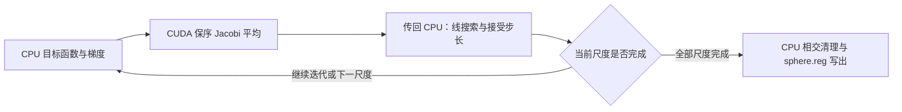

# 球面配准的性能优化与验证

## 功能与流程

FNIT 的 `run_register_sphere(...)` 连续执行 sulc 配准、smoothwm 配准和末尾
相交清理，写出 `sphere.reg`。它是固定 FreeSurfer 8.2 配准算法的
Python/PyTorch 移植；本轮优化计算方式和重复开销，没有改变目标函数、
邻域、平滑轮数、步长选择或停止规则。生产函数不运行 FreeSurfer 命令。

独立阶段 API 的 `averaging_device="cpu"` 默认保留。标准 recon-all
调度根据 `device` 选择平均后端；CUDA 使用明确的目标 GPU。`overlap_device`
独立选择末尾清理设备；本页示例和配对验证保持它为 CPU。

本页阶段优化对照对应生产提交 **`c24852054f3321c1142b1ae88fa3d2bf68329bb3`**，
使用下面记录的不可变源码归档；已完成的 1b 整例作为冻结输入和精度基线。
后续 source1128 正式 CON07 的实际球面仍有残留负面，原记录与时钟均保留，
其清理停止语义、判据、保存最终状态及脑图见[独立质量诊断](../../validation/fmri/public_ten_20261003/CON07_sphere_quality_diagnostic.md)。



CPU 调用把图中平均后端换为既有 Numba。GPU 只执行保序平均；目标函数、
步长决策、全部迭代和末尾清理仍按同一算法执行，球面输出供后续图谱标注。

## 真实剖析找到了什么

本轮在 `gpucw1` 对 sub01 左半球的 FNIT 自产冻结输入运行 cProfile，实际
代码是 **`1b8c36d25a68e253a1e59b6d02114890afa467de`**，Torch/Numba 均为
4 线程，`CUDA_VISIBLE_DEVICES` 为空。本次读取 `sphere`、`smoothwm`、
`sulc` 和声明的 folding TIFF；保存的旧 `sphere.reg` 只参与结果比较。

| 剖析范围 | 调用数 | 观察时间 |
| --- | ---: | ---: |
| 完整 `run_register_sphere` | 1 | 524.378 s |
| `average_gradients_exact_cpu`，含被调用内核 | 103 | 241.165 s |
| `blur_atlas_frame`，含内部 `torch.roll` | 27 | 117.288 s |
| `torch.roll`，已包含在上行 blur 中 | 10,773,744 | 51.763 s |

这是**包含 cProfile 开销的热点定位**，不是 CPU/GPU 配对性能结果。
嵌套时间不能重复相加，不能据此宣布新代码或整例已经提速。该次输出与
保存的同输入 FNIT 配准结果，有序面、坐标 shape 和全部坐标分量相同，
最大/P99 坐标误差均为 0；这项比较不是官方整例指标等效验收。

原始 [JSON 报告](../../validation/recon_all/python_gpu_port/performance_hotspots_20261001/baseline_register_profile/report.json)
保留输入、脚本及实际源代码 SHA-256；[cProfile 热点文本](../../validation/recon_all/python_gpu_port/performance_hotspots_20261001/baseline_register_profile/profile.txt)
可复查调用数和嵌套关系。报告 SHA-256 为
`073f1b516e9561b956b950ddc1bb5832f1d6c81d3217d1c5604255d35d45c768`，
热点文本 SHA-256 为
`112273d725678bb1a3d7e8241e4fecde70539cf54cff0397f210d297199ec10d`。
这些哈希绑定旧 1b 剖析，不能当作本轮候选已完成实测的版本。

## 真实梯度的 GPU 平均算子验证

已从相同 sub01 LH 自产输入捕获首个 sulc 配准更新的实际梯度和邻接，
验证完整 **16,384 轮**平均：梯度为 float32(105,598,3)，邻接为
int64(105,598,12)，有效列数为 int64(105,598)。运行前后输入文件、捕获
张量和计算源码均未改变。实际候选为 `764607c` 加工作树快照，归档 SHA 为
`f7691862c3161c2f4b68f6a667f8feb16ef0bec3f6706ec54974af0253b336de`，
不是已提交的新版整例结果。

主机为 gpucw1，CPU 为 Xeon Gold 6430，目标 GPU 为 H100 PCIe，UUID
`GPU-e25cac06-0ce8-a833-abf9-09ab18c9c9ba`；Torch intraop/Numba 均为
4，Torch interop 64 沿用原值。使用 Torch 2.5.1、Numba 0.67.0、
Triton 3.1.0、CUDA 11.8；float32，matmul/cuDNN TF32 开启，autocast 关闭。

| 同一实际梯度的平均轮数 | CPU 中位数 | GPU 中位数，含 H2D/D2H | 四次 AB/BA 比较 |
| --- | ---: | ---: | --- |
| 0 | 0.000429 s | 0.000154 s | 数值/位模式差异均 0 |
| 1 | 0.003233 s | 0.002085 s | 数值/位模式差异均 0 |
| 64 | 0.155291 s | 0.003149 s | 数值/位模式差异均 0 |
| 16,384 | 39.495550 s | 0.318110 s | 数值/位模式差异均 0 |

每个轮数各有四次 CPU/GPU 调用，按 AB/BA/AB/BA 交替。16,384 轮的
中位数比值为 **124.16 倍，仅表示这个平均算子**。它不能乘到 241.165 s
剖析累计时间上，也不能解释为完整配准或 recon-all 的提速。

本进程首调用 CPU 为 39.572796 s，GPU 为 2.805313 s；GPU 静态邻接
构造/搬运另为 0.206877 s，因此构造加首调用为 3.012190 s。首次 CUDA
context 设置的 0.916718 s 单列，未包括在算子时间中；持久 Triton 缓存
可能已有条目，未清空。因此“首调用”不是保证全新编译环境的冷启动。
算子时间包含分配、传输、全部轮次及目标 GPU 同步，完整捕获、比较及
诊断写出由外层记录；被监控命令墙钟为 249.234883 s。

算子报告预先声明绝对/相对容差均为 0，并要求有限输出；首调用和 16 组
配对的最大/P99 误差、不同数值及不同位模式均为 0。这是同输入平均算子
的精度结果，没有建立整体指标等效阈值，也没有验证完整配准轨迹。

NVML 请求每 0.5 s 采样，共 366 个有效样本、0 次查询失败，实际最大间隔
1.727623 s；该任务的最大采样进程显存为 **486,539,264 字节**。这不是连续
峰值或整例显存验收。此运行关闭 CUDA 分配缓存，allocator 的
allocated/reserved/peak 以 `None` 标记，不能将它们当成零 GPU 占用。

[算子原始报告](../../validation/recon_all/python_gpu_port/performance_hotspots_20261001/gpu_average_sub01_lh.json)
SHA-256 为 `a550d39f0c98a6ed6fcf7ee4af8c61f0a22e120052f67d1a801e086a7d8e9afc`；
[显存及外层计时报告](../../validation/recon_all/python_gpu_port/performance_hotspots_20261001/gpu_average_sub01_lh_monitor.json)
SHA-256 为 `f5977a9417052565df6f40588c802f9d80c0e206bbc450177c91c9ac1d3bf86e`。
已完成一组真实完整 LH 配准的 CPU/GPU 独立进程配对，见下节；其余三个
半球的冻结结果回归均已通过坐标、有序面、尾部、sulc-seed 和全部保存轨迹检查。

## 本轮接入与计算规则

### 图谱平滑：减少 Python 循环与小张量操作

[`blur_atlas_frame`](../../src/fnit/recon_all/mris_register_blur.py) 对 CPU
float32 帧使用有序 Numba 内核。按同一 `(极角维度, 方位角维度, sigma)`
缓存 double 权重和分母，最多保留 8 组；不缓存图像或混用不同网格。
每个极角列独立并行，但每个输出像素仍按原 `uk`、`vk` 次序执行 double
乘加，再写回 float32。极点反射、半个方位角周期偏移和周期索引保持原值，
`fastmath=False`，线程预算沿用调用环境。

CUDA 帧、非 float32 帧或需要梯度的输入保留既有 PyTorch 路径；这次没有
把原 CPU `torch.roll` 循环机械地搬到 GPU。旧路径继续承担适用输入和同输入
参考验证作用。

### 三跳邻域：复用整数标记和队列

[`three_hop_neighbor_total`](../../src/fnit/recon_all/mris_register_average_numba.py)
用整数戳和 FIFO 队列代替逐顶点 Python `set`。保留三跳广度遍历、重复
邻点去重和排除自身；两个 O(N) 工作数组只分配一次，没有固定候选上限。

[`three_hop_avg_nbrs`](../../src/fnit/recon_all/mris_register_nonlinear.py)
复用该整数内核，将总数按既有 float32 存储/除法顺序转换为顶点均值。
它仅用于静态邻域准备，不缓存会随顶点位置变化的几何量。

### 关联面索引：共享稳定排序的 CSR

[`ordered_face_csr`](../../src/fnit/recon_all/place_surface_normals.py) 用稳定排序
构建每顶点的 face/corner 序列，保留原面顺序、重复角点与孤立顶点的空行。
配准的 [`ordered_face_incidence`](../../src/fnit/recon_all/mris_register_nonlinear.py)
复用该 CSR，再用整数向量索引填入 padded 表，代替逐顶点 Torch 标量写入。
法向计算继续使用已有 float32 顺序内核；关联索引的 int64 dtype 不降低
精度，也不改变浮点加法次序。每遍优化构建一次静态索引，不跨网格复用。

### 梯度平均：共享邻接，显式选择 CPU 或 CUDA

`RegistrationGradientAverager` 接入已有的 sulc 和 smoothwm 完整配准函数。
每遍构造一次平均器，复用该表面的静态有序邻接和 CPU 原规则计算的
float32 倒数。CPU 调用原有顺序 Numba 平均；CUDA 调用
[`average_on_cuda`](../../src/fnit/recon_all/mris_register_average_gpu.py) 的
Triton 内核。目标函数与线搜索仍使用既有 CPU 路径。

GPU 每轮读取旧缓冲区、写入新缓冲区，然后交换两者，完整执行指定轮数。
顶点/坐标分量可并行，各顶点内部仍按原邻接次序逐项 float32 相加，再乘
相同倒数；没有原子归约、截断邻居、跳轮或修改接受规则。调用内部以
`torch.cuda.device(current.device)` 保护实际目标设备，内核采用
`enable_fp_fusion=False`。输入已在目标 GPU 且会共享存储时先复制，避免
后续缓冲交换修改调用者的梯度。

`iterations=0` 直接在输入设备返回 `gradient.clone()`，这次梯度不做
H2D/D2H 或 kernel launch；平均器构造时的静态邻接搬运仍单独存在。
CPU 梯度交给 CUDA 平均时，返回 CPU 的结果包含必要 D2H，同输入完整阶段
计时必须包含这些传输。

这个标量加法/乘法内核不进行 Tensor Core 矩阵运算，TF32 对它不适用；
本内核不改变调用者的全局 TF32 策略，验证脚本按项目默认开启 TF32。
没有启用 FP16/BF16。Numba 和
Triton 3.1.0 已在主页 [Conda 环境](../../environment.yml) 声明，本轮无新增
运行依赖。实现来源是 FNIT 对固定上游平均算法的 CUDA/Triton 实现，
不能把执行内核优化描述为新的配准算法。

## 函数输入、输出与默认值

### 完整球面配准 `run_register_sphere`

| 参数 | 类型、结构及含义 | 默认值 |
| --- | --- | --- |
| `sphere` | 三角表面路径；float32(N,3) 球面坐标、int32(F,3) 有序面；surface RAS/mm | 必填 |
| `smoothwm` | 同顶点/面编号的皮层几何表面路径；surface RAS/mm，提供原几何和曲率 | 必填 |
| `sulc` | FreeSurfer 顶点图路径；(N,) 浮点 sulc 特征，与 sphere 顶点对应；配准内部归一化 | 必填 |
| `atlas` | 对应半球的 folding TIFF 路径；固定资产含九张 512×256 32-bit 帧，按原位模式解释 float32 | 必填 |
| `output` | 写出 `sphere.reg` 的路径；父目录须存在 | 必填 |
| `overlap_device` | 末尾负面积/相交清理设备，与 averaging 分别选择 | `"cpu"` |
| `averaging_device` | 仅有序梯度平均的执行设备，CPU 或 CUDA；验证时显式写 `cuda:N` | `"cpu"` |

返回 dict 的结构：

- `sphere/smoothwm/sulc/atlas/output`：实际路径；`input_sha256`：四份输入的哈希。
- `overlap_device/averaging_device`：所选设备；`output_sha256`：最终表面哈希；
  `sulc_seed_sha256`：两遍之间临时表面的哈希，临时目录结束后删除。
- `sulc_pass`：刚体角度（三个弧度值）、分数与搜索次数、设置耗时、
  `last_iteration`、有序 `updates` 和包含读写的总耗时。
- `smoothwm_pass`：继承的 `seed_iteration`、设置/积分/清理耗时、
  有序 `updates`、清理的 `negative_counts` 和包含读写的总耗时。
- `total_seconds_including_io`：完整两遍配准、临时读写/删除及输出写出的秒数；
  子阶段时间已经包含其中。

`negative_counts` 是每次清理更新之前的负面数量，不包含末次更新后的保存状态。
source1128 CON07 的 LH `sphere`/`sphere.reg` 清理 history 均有 1001 项，
最后更新前为 27/22，独立保存检查为 28/23；RH 最后一项为 1，但保存为 0。
固定原软件在有限清理后允许剩余负面并返回成功；完整文件写出与几何质量通过
分别记录，不将 history 的最后一项当作保存最终数量。

`updates` 每项包含迭代编号、phase 或 stage、sigma、平均轮数、选中 `dt`、
`next_state` 和秒数。`next_state` 是阶段/尺度/计数结构或 `None`。当前 API
保存选中步长与状态，没有保存每个 rejected trial，比较报告须说明这个范围。
输出保留顶点、有序面及输入球面的几何尾部，球面坐标约定不变；不能把
`sphere.reg` 的球面距离直接当成原皮层 white/pial 的物理形状距离。

输入网格不对应、sulc 数量不符或配准在内部默认 `max_updates=1024` 上限内
不收敛会抛异常；文件、TIFF 解码、设备及 JIT 编译错误也直接抛出。上限
是异常保护，不能减小正常算法轮数换取速度。失败文件不能作为成功配准。

### 内部可复用算子

| 函数 | 全部输入 | 输出与限制 |
| --- | --- | --- |
| `blur_atlas_frame(frame, sigma)` | 二维非空 Tensor，轴顺序为方位角/极角；`sigma` 必填、正且有限，配准尺度为 4/2/1/0.5 | 同 shape/dtype/device 的新张量；不改输入。sigma 是参数化网格尺度，不是 MRI 的 mm；数值单位继承原帧。无效维度或 sigma 抛 ValueError |
| `three_hop_neighbor_total(neighbors, degrees)` | CPU NumPy int64(N,K) 保序邻接、int64(N) 有效列数 | 三跳内去重邻点总数整数，不计自身；支持断连/孤立点。内部调用者须保证合法索引和列数 |
| `three_hop_avg_nbrs(neighbors, degrees)` | Torch int64(N,K)、int64(N)；合法非空静态邻接 | 按原 float32 舍入生成 Python float 均值；CUDA 邻接搬回 CPU 后计算；该内部函数不单独验证邻接 |
| `average_gradients_exact_cpu(gradient, neighbors, degrees, iterations)` | 全部为CPU Tensor；float32(N,3)梯度、int64(N,K)/(N)邻接/degree、非负整数轮数，均必填 | 新CPU float32(N,3)梯度；非CPU梯度抛ValueError，低层邻接合法性由平均器核验；不改输入 |
| `RegistrationGradientAverager(neighbors, degrees, device="cpu")` | Torch int64(N,K) 保序邻接、int64(N) 有效列数、CPU/CUDA 设备 | 可调用对象，缓存本表面邻接与倒数；shape/dtype/有效邻点索引或列数错误抛 ValueError |
| `averager(gradient, iterations)` | float32(N,3) 梯度、非负平均轮数；梯度分量采用原球面坐标方向 | 返回同 shape/dtype/device 新张量，不改梯度；负轮数/梯度结构错误抛 ValueError；CUDA 不可用或编译失败抛异常 |
| `average_on_cuda(current, following, neighbors, degrees, reciprocals, iterations)` | 两份连续 float32(N,3) 缓冲、int64(N,K)/(N) 邻接/列数、float32(N) CPU 原规则倒数、完整轮数；同一 CUDA 设备 | 返回最终 CUDA 缓冲；内部算子，输入校验由平均器负责；默认调度不直接调用 |
| `ordered_face_csr(faces, nvertices)` | NumPy 整数(F,3) 面、非负顶点总数 N；二者必填 | int64 `offsets`(N+1,)、`face_ids`(3F,)、`corners`(3F,)；每行包含原序关联面/0–2角点，无坐标或物理单位。保留重复项和空行，非法形状/dtype/索引/顶点数抛 ValueError |
| `ordered_face_incidence(faces, nvertices)` | 任意 CPU/CUDA 整数 Tensor(F,3)、非负 N；二者必填 | 原设备的 int64 `face_indices/corner_indices`(N,K)、`degrees`(N,)；K 为最大 degree，非有效列填零，无面时 K=0。CPU 建 CSR 后向量化填表；非法输入抛 ValueError |
| `initial_vertex_normals(vertices, triangles)` | NumPy (N,3) 坐标、整数(F,3)三角面；二者必填，内部转 float32/int64 | float32(N,3)单位法向，无单位，孤立点为零；非法数组/面索引抛 ValueError。几何有限性由阶段调用者检查 |

这些 blur、BFS 和平均器是 `mris_register` 的内部步骤，没有各自独立的
官方 CLI。不能用同名的 reciprocal distance 平均或无序 scatter 替换这里
的邻接梯度平均；不同算子的定义和依赖顺序需要分别验证。
CPU 平均后端要求梯度及邻接/degree 都在CPU；CUDA平均器可接收CPU梯度，
返回同输入设备。`iterations` 是非负整数轮数，不支持用小数轮数近似执行。

## Python 调用

以下独立 API 显式请求 CUDA averaging；标准 recon-all 则随 `device` 选择。
先创建独立输出目录，
只使用 FNIT 自产表面和声明图谱。

```python
from pathlib import Path
from fnit.recon_all.mris_register_run import run_register_sphere

output_directory = Path("/data/validation/sub01_lh_register")  # 新的诊断输出目录
output_directory.mkdir(parents=True, exist_ok=False)          # 保留已有结果，目录存在则报错
report = run_register_sphere(
    sphere="/data/fnit_subject/surf/lh.sphere",               # 自产标准球面；surface RAS/mm
    smoothwm="/data/fnit_subject/surf/lh.smoothwm",           # 同序皮层几何；surface RAS/mm
    sulc="/data/fnit_subject/surf/lh.sulc",                   # 同序 (N,) sulc 特征
    atlas="/data/fnit_assets/average/lh.folding.atlas.acfb40.noaparc.i12.2016-08-02.tif",  # 声明的 LH 图谱
    output=output_directory / "lh.sphere.reg",               # 写有序球面，保留几何尾部
    overlap_device="cpu",                                   # 末尾清理沿用 CPU
    averaging_device="cuda:0",                               # 仅平均内核使用明确目标 GPU
)
```

共享索引和法向的独立调用使用同一三角网格：

```python
from nibabel.freesurfer.io import read_geometry
from fnit.recon_all.place_surface_normals import ordered_face_csr, initial_vertex_normals

surface_vertices, surface_triangles = read_geometry(
    filepath="/data/fnit_subject/surf/lh.sphere",          # 有序三角面；surface RAS/mm
)
face_offsets, face_ids, corner_ids = ordered_face_csr(
    faces=surface_triangles,                              # (F,3)整数面，保留面/角点次序
    nvertices=len(surface_vertices),                      # N包含无关联面的孤立顶点
)
surface_normals = initial_vertex_normals(
    vertices=surface_vertices,                            # (N,3)mm坐标；内部转float32
    triangles=surface_triangles,                          # 同一有序面；返回float32(N,3)单位法向
)
```

GPU 性能测试在指定设备调用前后同步；报告显式保存 GPU UUID、线程、TF32
和 allocator 设置。上述 API 返回耗时不能代替包含 Python 导入/CUDA 初始化
的进程墙钟，也不能把禁用缓存后的 allocator 统计 0 解释为零显存。

## CLI 调用

完整函数自带模块 CLI；三个表面/顶点图输入、图谱和输出都是必填的位置
参数，顺序与 Python 接口一致，不能写成不存在的 `--sphere` 等选项。
两个设备选项均默认 `cpu`；`--report` 默认不写独立文件，JSON 仍输出到
标准输出。父目录须提前创建，已有输出可能被覆盖，建议使用新诊断目录。

```bash
# 完整 sulc+smoothwm 配准；输入依次为自产球面、同序 smoothwm、sulc、声明图谱。
python -m fnit.recon_all.mris_register_run \
  /data/fnit_subject/surf/lh.sphere \
  /data/fnit_subject/surf/lh.smoothwm \
  /data/fnit_subject/surf/lh.sulc \
  /data/fnit_assets/average/lh.folding.atlas.acfb40.noaparc.i12.2016-08-02.tif \
  /data/validation/register_new/lh.sphere.reg \
  --overlap-device cpu \
  --averaging-device cuda:0 \
  --report /data/validation/register_new/api_report.json
```

`overlap-device` 保持已测 CPU 清理；`averaging-device` 明确仅平均内核使用
逻辑 GPU 0；`report` 保存返回字典，含两遍轨迹及输入/输出哈希。模块 CLI
没有线程参数；需要严格 4 线程、GPU 前后同步和源码核验的测量使用下节
独立 benchmark CLI，它会在模型/内核导入前设置线程预算。

## 完整配准的同输入验证

使用 [benchmark_register_pair.py](../../validation/recon_all/python_gpu_port/benchmark_register_pair.py)
分别加载旧/新源码到独立进程，固定 4 线程。默认一轮，`--repetitions 2`
执行 AB/BA；各实现的 Numba/Triton 缓存隔离，首轮编译计入时间，第二轮
可复用该实现缓存。候选可选 CPU 或显式 CUDA averaging，overlap 均为 CPU。

脚本保存阶段墙钟（含读写/JIT/传输、CUDA 初始化和指定设备同步）、进程
墙钟（还含导入）、输入/源码/输出 SHA、实际设备 UUID、有序坐标/面/尾部
差异以及已记录的选中 `dt`/状态/相交轨迹。官方表面只通过
`--official-surface` 作额外诊断，不进入生产或配准输入。

sub01 LH 在同一 gpucw1、同输入、Torch/Numba 4 线程预算下完成一次
CPU→GPU 配对。基线实际代码为 `1b8c36d25a68e253a1e59b6d02114890afa467de`；
候选为 `764607c` 工作树快照，归档 SHA
`f7691862c3161c2f4b68f6a667f8feb16ef0bec3f6706ec54974af0253b336de`。
两者独立进程、JIT 缓存隔离，overlap 均为 CPU；候选显式使用上述 H100
UUID 的 `cuda:0` averaging，float32/TF32，无 autocast 或半精度。

| 验证范围 | CPU 基线 | GPU 候选 | 精度/轨迹 | 当前状态 |
| --- | ---: | ---: | --- | --- |
| sub01 LH 完整配准阶段，含初始化/同步/读写/JIT | 503.817845 s | 168.823989 s | 坐标/面/尾部及全部保存轨迹一致 | complete |
| 同次独立进程，另含 Python 导入 | 506.790789 s | 171.645117 s | 同上 | complete |
| sub01 RH，对保存的 1b 精度基线 | 未重测 | 155.726229 s | 坐标/面/尾部、seed 与保存轨迹一致 | complete |
| sub02 LH，对保存的 1b 精度基线 | 未重测 | 167.211978 s | 同上 | complete |
| sub02 RH，对保存的 1b 精度基线 | 未重测 | 180.185278 s | 同上 | complete |
| 加共享 CSR 后 sub01 LH，对保存的 1b 精度基线 | 未重测 | 150.171479 s | 同上 | complete |
| c248520 原始T1整例，sub01 GPU | 4972.667 s | 4242.884 s | 同序表面相同，严格137/138；采样14.508 GB | complete；整体等效not_assessed |
| c248520 原始T1整例，sub02 CPU | 5295.422 s | 5274.884 s | 严格138/138 | complete；整体等效not_assessed |

完整配准阶段时间比为 **2.9843 倍**，减少 334.993856 s（66.49%）。这是
共享机器上的一次同机阶段配对观察，没有重复轮次或整例加速结论。两份
输出含 105,598 个顶点、211,192 个有序面，坐标最大/P99 误差、不同分量数
均为 0，文件尾部相同；`reported_trajectory_equal=true`。保存的是实际
选中 dt/state、刚体结果、迭代和清理轨迹，不包括未记录的 rejected trials。
完整 `sphere.reg` 文件 SHA 均为
`7a86c0ba586ea0e182b50e30d5d1e473d7056373c49d1791d4db8e4c68c3ef39`。

本次外层命令 678.954855 s 包含两个进程、比较和报告写出，不能当成 GPU
单侧阶段时间。NVML 请求 0.5 s 间隔，1,005 个样本、0 次查询失败，最大
实际间隔 2.127792 s，最大采样进程显存 486,539,264 字节；连续峰值未验证。
[完整配对原始 JSON](../../validation/recon_all/python_gpu_port/performance_hotspots_20261001/register_pair_sub01_lh.json)
SHA 为 `64305cb719d13fa6b7fd7e49f531f6da6c0bee4ee52af4c41432f9e1dd5e6a1e`；
[外层监控 JSON](../../validation/recon_all/python_gpu_port/performance_hotspots_20261001/register_pair_sub01_lh_monitor.json)
SHA 为 `343a045870a1c4f7820672e5d20502e012858f066a1e896bcfe87e44d82e187e`。

后三侧使用与第一次 LH 配对相同的 GPU 源码归档 `f7691862…`，同一 H100、
Torch intraop/Numba 4、interop 1，目标设备前后同步、float32/TF32、
autocast 关闭。坐标最大/P99 误差和不同分量数均为 0，有序面、尾部、
sulc-seed SHA 及全部保存轨迹一致，四份阶段输入 SHA 与原记录相同。
包含导入的独立候选进程墙钟分别为 159.223020、170.396617、183.249422 s。
以下报告同时保存输入和源码前后哈希；旧阶段耗时没有与本次 GPU 测量配对。

| 保存基线回归报告 | SHA-256 |
| --- | --- |
| [sub01 RH](../../validation/recon_all/python_gpu_port/performance_hotspots_20261001/register_saved_sub01_rh.json) | `9a6800d369d65f8621865ced167683622fb74ad8bc3ed4e886c6051b95e497ab` |
| [sub02 LH](../../validation/recon_all/python_gpu_port/performance_hotspots_20261001/register_saved_sub02_lh.json) | `41b29f277a0ca4313c7915fbf56f4591c2a0da65d7d028f8f4eb90562b8af2a3` |
| [sub02 RH](../../validation/recon_all/python_gpu_port/performance_hotspots_20261001/register_saved_sub02_rh.json) | `4bbb9a1c090928305e86e261dfc98ab191fbe0a1670003e95dd1674fa20c9659` |

### 最终共享 CSR 的范围

最终候选归档为
`098ccb63a3931a4f749710fb76dd9beb4751f7b8b14c0f130fa922f9698b708e`。
四张真实 sphere 每张做一次 CPU 顺序配对，face/corner/degrees 与 CSR
整数数组逐元素一致，已有 float32 法向逐位一致，最大/P99 误差为 0。

| 冻结网格 | 旧 incidence 构造 | 新 incidence 构造 | 旧/新法向，含各自 CSR |
| --- | ---: | ---: | ---: |
| sub01 LH | 5.731256 s | 0.098330 s | 2.817187 / 0.798715 s |
| sub01 RH | 6.525221 s | 0.084628 s | 0.222737 / 0.213711 s |
| sub02 LH | 7.466030 s | 0.099341 s | 0.274457 / 0.251923 s |
| sub02 RH | 7.464913 s | 0.096381 s | 0.247978 / 0.244793 s |

这是内部构造/法向的单次函数计时，文件读入另外记录，完整测试 33.476354 s。
首次法向调用包括各自 JIT/缓存加载，不能将首行时间比推广为暖法向速度。
[四侧原始报告](../../validation/recon_all/python_gpu_port/performance_hotspots_20261001/ordered_face_csr_four_pair.json)
SHA 为 `24ff496f54f0031ed6740134d89c00db8a565e8e21af20a635d84a181f2df52d`。

该最终归档又执行一次 sub01 LH 完整配准，阶段 150.171479 s，进程含导入
153.257819 s；输出 SHA、seed、坐标/面/尾部与保存轨迹严格一致。
[完整 LH 回归](../../validation/recon_all/python_gpu_port/performance_hotspots_20261001/register_final_csr_sub01_lh.json)
SHA 为 `0aee5e878f9a77ea9a2920febf9f158a6bbce45810ad2d2a3edf6f3ea23dbd55`。
这次没有同时 CPU 或前一 GPU 版本重跑，不能将 168.824 与 150.171 s 的
差直接解释为 CSR 的因果提速。最终共享 CSR 的后三侧完整配准尚未另跑；
四侧整数/法向回归和旧 GPU 归档的四侧完整回归分开保留。

其余三个半球使用
[benchmark_register_saved_pair.py](../../validation/recon_all/python_gpu_port/benchmark_register_saved_pair.py)
执行一次当前 API，并比较已完成 1b 整例中的 `sphere.reg` 和
`fnit-native-free-run.json` 的 `sphere_registration.reports[hemi]`。计算前后
均核对 sphere/smoothwm/sulc/atlas 四个 SHA 和保存输出 SHA；源码、参考或
输入发生改写则报错。旧运行 JSON 不嵌入提交号，版本必须同时绑定既有
[源码指纹](../../validation/recon_all/python_gpu_port/performance_20261001/whole/candidate_source_fingerprint.json)
和报告哈希，不能仅由目录名推断。保存的历史时间只作元数据，不作为这次
GPU 测试的同时 CPU 对照；脚本不计算历史/当前速度比。完整命令示例：

```bash
# 显式选择目标 GPU，沿用本次已测的关闭 allocator 缓存策略。
CUDA_VISIBLE_DEVICES=GPU-e25cac06-0ce8-a833-abf9-09ab18c9c9ba \
PYTORCH_NO_CUDA_MEMORY_CACHING=1 \
python validation/recon_all/python_gpu_port/benchmark_register_saved_pair.py \
  --subject /data/full_sub01_1b8c36d_retry1 \
  --hemi rh \
  --atlas /data/fnit_assets/average/rh.folding.atlas.acfb40.noaparc.i12.2016-08-02.tif \
  --source /data/frozen_gpu_candidate/src \
  --source-version commit-plus-archive-sha256 \
  --device cuda:0 \
  --gpu-uuid GPU-e25cac06-0ce8-a833-abf9-09ab18c9c9ba \
  --output /data/validation/sub01_rh_register_saved_new \
  --threads 4
```

逐项说明：`subject` 是已有冻结自产被试；`hemi` 选择同半球输入与轨迹；
`atlas` 是声明图谱；`source/source-version` 指实际候选快照及版本；
`device/gpu-uuid` 明确 averaging 的逻辑设备与物理设备；`output` 必须是新
目录，保存报告、候选表面及日志；`threads` 固定为 4。overlap 保持 CPU。
运行/哈希/结构失败退出 1；运行完成但严格阶段比较失败退出 2并保留结果；
严格阶段通过退出 0，不将它视为整例指标等效通过。
CLI 参数或新输出目录的前置检查失败时，可能尚未创建 report.json。

严格复现保留为诊断；本页没有新增或放宽数值容差。优化是否引入退化按
实际同输入报告单独判断，整体脑区指标等效仍为 `not_assessed`。已测旧
cProfile 不能填写成新候选的 CPU/GPU 配对结果。

## 版本记录

| 实际代码 | 已完成验证 | 与当前提交的关系 |
| --- | --- | --- |
| `1b8c36d25a68e253a1e59b6d02114890afa467de` | 旧整例、LH cProfile 与本轮 CPU 配对基线 | 冻结基线 |
| `764607c` + [GPU 快照](../../validation/recon_all/python_gpu_port/performance_hotspots_20261001/gpu_candidate_source_snapshot.json)，归档 `f7691862…` | 实际梯度算子、LH 完整性能配对、其余三侧保存结果回归 | 尚无共享 CSR |
| `764607c` + [最终快照](../../validation/recon_all/python_gpu_port/performance_hotspots_20261001/final_candidate_source_snapshot.json)，归档 `098ccb63…` | 四侧 CSR/法向、LH 完整保存结果回归 | 与 c248520 的相关生产源文件 SHA 相同 |
| `c24852054f3321c1142b1ae88fa3d2bf68329bb3` | 已提交相同源码及按 recon-all device 选择 averaging | 两例66阶段、138项齐全；GPU墙钟减少14.676%，CPU0.388%；不改写以上阶段实测版本 |

所有具体源码和输入 SHA 见各原始 JSON。当前资源另经
[运行资源指纹](../../validation/recon_all/python_gpu_port/performance_hotspots_20261001/runtime_fingerprints_hotspot_candidate.json)
复核，权重/资产/候选程序/输入没有哈希不符；这是资源复核，没有证明无预装
软件的干净部署。整体指标等效标准未获正式确认，阶段严格通过不构成整体
等效批准。新提交原始T1整例的实际耗时、精度、显存及局部异常见[完整结果](../../validation/recon_all/python_gpu_port/performance_hotspots_20261001/WHOLE_RESULTS.md)。

## 官方调用、原代码与文献

固定参考工作流的完整阶段命令为：

```text
mris_register -curv -threads 4 \
  surf/lh.sphere \
  average/lh.folding.atlas.acfb40.noaparc.i12.2016-08-02.tif \
  surf/lh.sphere.reg
```

它还读取同被试的 `smoothwm` 与 `sulc`；LH/RH 使用各自 folding 图谱。
这个命令仅在独立 benchmark 环境使用，FNIT 运行不依赖系统安装的程序。
算法依据是固定 FreeSurfer 源码
[`d932c45b7941662ea380a05efef580568b98d41a`](https://github.com/freesurfer/freesurfer/tree/d932c45b7941662ea380a05efef580568b98d41a)，
入口位于 [`mris_register`](https://github.com/freesurfer/freesurfer/tree/d932c45b7941662ea380a05efef580568b98d41a/mris_register)，
调用 [`utils`](https://github.com/freesurfer/freesurfer/tree/d932c45b7941662ea380a05efef580568b98d41a/utils)
中的 `mrisurf_integrate.cpp`、`mrisurf_deform.cpp` 等内部计算。
FNIT 已有阶段对照和命令记录见
[球面配准验证资料](../../validation/recon_all/python_gpu_port/MRIS_REGISTER_STATUS.md)。

参考文献：Fischl B, Sereno MI, Tootell RBH, Dale AM. *High-resolution
intersubject averaging and a coordinate system for the cortical surface.*
Human Brain Mapping 8(4), 272–284 (1999).
[原论文索引](https://pubmed.ncbi.nlm.nih.gov/10619420/)。
