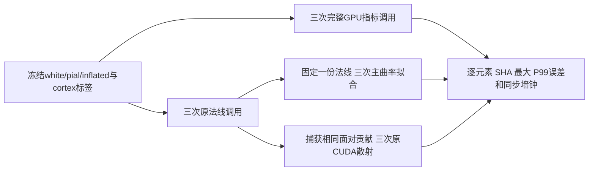

# GPU 表面指标的同输入重复性

## 1. 功能与诊断流程

本页记录现有GPU指标在相同真实几何、设备与TF32设置下的重复性。
它不替换任何成熟指标函数，不改变生产精度，不把自身重复性当作对官方
等效。检测脚本只读冻结源码与被试文件，在独立目录写诊断结果。



本轮两例复现了整例中观察到的曲率尾差：法线的CUDA原子累加顺序能改变
末位，曲率拟合会放大部分法线尾差。固定同一法线后，两例各三次主曲率
拟合完全相同。该证据只适用于下面的固定输入，不能解释全部官方差异，
也没有据此判定局部差异可接受或整体指标等效。

## 2. Python 调用、输入与输出

生产函数的调用与单位见[SURFACE_METRICS](SURFACE_METRICS.md)及
[统计缓存](SURFACE_STATS_CACHE.md)。诊断脚本复用相同函数：

```python
from fnit.recon_all.surface_roi_curvature_gpu import principal_curvatures

principal_high, principal_low = principal_curvatures(
    vertices=surface_vertices,  # (N,3)，surface RAS，单位mm，有限坐标
    faces=surface_faces,  # (F,3)，与坐标相同编号的有序整数三角面
    device="cuda:0",  # 明确当前进程GPU；不启用半精度
)
# 两个返回数组均为(N,) float32，单位mm⁻¹；按绝对值较大者排为high。
```

重复性输入为已经完成的FNIT被试目录。必需的 `surf/H.white`、`H.pial`
顶点顺序和有序面必须相同；`H.inflated`仅作选定主曲率诊断。全部表面
坐标为surface RAS/mm。`label/H.cortex.label`为同顺序顶点编号，限定TH3
顶点体积；该图不是`-no-th3`脑区GrayVol，不能相互替代。

输出是独立的 `caseN-repeatN/surf` 下五张现有指标、TH3顶点体积和诊断
H/K图，以及 `report.json`。指标依次为厚度mm、面积mm²、平均曲率mm⁻¹、
体积mm³、H mm⁻¹及K mm⁻²，全部为float32顶点图。JSON记录逐图不同元素数、
最大/P99/平均绝对误差、数组SHA、文件/模块SHA、线程、实际前后精度和秒数。
三次法线为 `(N,3)` 单位向量，冻结法线拟合为 `(N,2)` 主曲率。

参数或文件错误、设备/OOM/I/O异常会保存失败报告并抛出。输出目录已存在
即拒绝；不覆盖输入。不向原函数传参考输出，也不启用随机算法。

## 3. 命令行调用与全部参数

```bash
CUDA_VISIBLE_DEVICES=3 OMP_NUM_THREADS=4 MKL_NUM_THREADS=4 OPENBLAS_NUM_THREADS=4 \
python validation/recon_all/python_gpu_port/probe_surface_metric_repeatability.py \
  --case /data/fnit/sub07 lh inflated \
  --case /data/fnit/sub06 rh pial \
  --source-root /data/frozen-code \
  --output-directory /data/runs/metric-repeat \
  --native-binary /data/fnit-native/bin/mris_place_surface \
  --assets-directory /data/fnit-assets \
  --code-base-commit 803aec50 \
  --device cuda:0 --threads 4 --repeat 3
```

| 参数 | 输入意义、默认值和限制 |
|---|---|
| `--case` | 必填，可多次；依次指定被试目录、lh/rh、主曲率诊断white/pial/inflated |
| `--source-root` | 必填；冻结仓库，含src；实际模块SHA须与报告核对 |
| `--output-directory` | 必填；不存在的独立诊断目录，输出全部图与JSON |
| `--native-binary` | 必填；现有私有Conda程序路径，传入现有API契约；本次CUDA分支不执行该程序 |
| `--assets-directory` | 必填；已声明资产目录，同样保持API契约 |
| `--code-base-commit` | 必填；实际基线版本字符串，模块SHA另作精确绑定 |
| `--device` | cuda:0；须明确CUDA编号，不回退CPU |
| `--threads` | 4，正整数；Torch及CPU空间索引使用该预算；外部BLAS环境须同时固定 |
| `--repeat` | 3；只接受2或3，避免无目的长重复 |

分离散射的只读过程诊断：

```bash
CUDA_VISIBLE_DEVICES=3 \
python validation/recon_all/python_gpu_port/probe_surface_normal_scatter.py \
  --input-surface /data/fnit/sub07/surf/lh.inflated \
  --source-root /data/frozen-code \
  --output /data/runs/fixed-normal-scatter.json \
  --device cuda:0
```

四个参数分别是实际表面、冻结仓库、不可覆盖的JSON路径和有编号的CUDA
设备（默认cuda:0）。脚本临时观察本进程 `Tensor.index_add_` 的三个实际
corner输入，始终调用原算子，finally恢复方法，再固定这些原贡献重复
相同累加。索引/贡献SHA和实际逐元素差异一并写出；不修改FNIT源码。
没有主张该观察器的运行时间代表生产法线性能。

## 4. 对应原软件

以下是现有指标的独立benchmark参考命令，本轮重复性探针未调用它们：

```bash
mris_place_surface --thickness lh.white lh.pial 20 5 lh.thickness
mris_place_surface --area-map lh.white lh.area
mris_place_surface --area-map lh.pial lh.area.pial
mris_place_surface --curv-map lh.white 2 10 lh.curv
mris_place_surface --curv-map lh.pial 2 10 lh.curv.pial
```

主曲率拟合属于 `mris_anatomical_stats` 的内部计算，没有对应单独CLI。
这些命令由隔离benchmark的固定源码构建程序执行，不使用预装软件。

## 5. 2026-10-09真实数据结果

实际冻结源码 `803aec50`，同一A100/四线程/TF32开启，float32不变；输入
是完整FNIT自产公开ds000114两例的最终网格。完整调用包括五图、TH3图和
所选表面的H/K诊断、加载/传输/读写，CUDA初始化2.593秒另列。

| 输入 | 三次完整API墙钟 | 相对首次调用的最大重复尾差 |
|---|---|---|
| sub07 LH，诊断inflated | 7.319 / 5.284 / 5.709 s | K 0.01171875 mm⁻²；H 0.000379205 mm⁻¹ |
| sub06 RH，诊断pial | 6.186 / 5.695 / 5.438 s | curv.pial 0.000878081 mm⁻¹；H 0.000820875 mm⁻¹ |

两例厚度三次全部0差异。面积/外表面积最大4.76837×10⁻⁷mm²、TH3体积
9.53674×10⁻⁷mm³。曲率较大的最大误差集中在少量顶点，完整报告保留P99
与不同元素数，没有只报平均相关性。未在此重算脑区统计或设定等效阈值。

原法线三次最大尾差1.78814×10⁻⁷至3.12924×10⁻⁷；冻结同一法线后，
两例各三次完整主曲率拟合逐元素一致。进一步捕获sub07 LH三个corner
索引与面对贡献，三次全部一致；固定同一贡献重复原CUDA散射，累加分别
16,686/16,846元素不同，最大9.53674×10⁻⁷，归一化法线最大1.78814×10⁻⁷。
因此本次同输入尾差的源头已定位到原子累加顺序；不是输入变化，也未发现
同法线下SVD重复性失稳。生产GPU指标和TF32设置保持原样。

allocator峰最多123,185,664字节，reserved146,800,640字节。外部采样
进程树PID归属未解，峰值为null；整卡占用含其他项目，不能当FNIT实际峰，
也不是整例20GB证据。冷启动与热调用分开记录，不从这组数字宣称提速。

机器报告：[完整指标重复](../../validation/recon_all/optimizations/20261009_placement_torch/surface_metric_repeatability_803_a100_v1.json)、
[外部采样](../../validation/recon_all/optimizations/20261009_placement_torch/surface_metric_repeatability_803_a100_v1.memory.json)、
[固定贡献因果诊断](../../validation/recon_all/optimizations/20261009_placement_torch/surface_normal_scatter_803_a100_v1.json)。
本轮已有真实[T1与表面叠加例](PYTHON_WHITE_PREAPARC.md)；探针未另生成新几何，
该图不作为指标尾差定位或整体等效证据。

## 6. 更新记录与范围

- 803整例配对：观察到部分GPU顶点图尾差，几何和最终主要脑区指标另由整例报告评价。
- 本次v1：两例三次完整GPU指标、固定法线三次拟合与固定贡献散射诊断，所有输入/源码SHA绑定。
- 不修改成熟法线、曲率、面积、体积或厚度实现；无新增依赖，主页Conda已有所有必要包。

本页结论是严格重复性诊断。官方同输入重复、指标容差和整体等效仍需
各自的证据，不以CUDA累加尾差统括历史精度问题。

## 7. 原代码与参考文献

- [FNIT表面法线与厚度](../../src/fnit/recon_all/surface_thickness_gpu.py)
- [FNIT主曲率拟合](../../src/fnit/recon_all/surface_roi_curvature_gpu.py)
- [FreeSurfer固定指标命令](https://github.com/freesurfer/freesurfer/blob/d932c45b7941662ea380a05efef580568b98d41a/mris_make_surfaces/mris_place_surface.cpp)
- [FreeSurfer曲率内部实现](https://github.com/freesurfer/freesurfer/blob/d932c45b7941662ea380a05efef580568b98d41a/utils/mrisurf_metricProperties.cpp)
- Fischl B. FreeSurfer. *NeuroImage* 62, 774–781, 2012.
