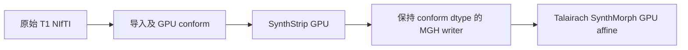

# recon-all 前段 SynthStrip 输出类型

`run_input_talairach_chain` 从原始 T1 生成 conform 图像、SynthStrip 去脑外组织图和 Talairach affine。SynthStrip 使用 FNIT PyTorch CUDA 模型，继承前段声明的 cuDNN FP32 例外。2026-10-03 修复仅改变去脑外组织图的保存类型：与 `orig.mgz` 保持一致。对于默认 conform，输出为 uint8；网络和掩膜不变。



## Python 与输入输出

```python
from fnit.recon_all.input_talairach_chain import run_input_talairach_chain

result = run_input_talairach_chain(
    t1="/data/sub-10159_T1w.nii.gz",       # 输入：单幅原始三维 T1
    subject_dir="/work/sub-10159",        # 输出：空被试目录，创建 mri/scripts
    weights_dir="/assets/weights",       # SynthStrip/SynthMorph 权重目录
    assets_dir="/assets/freesurfer",      # 含 average/mni305.cor.stripped.mgz
    device="cuda:0",                     # 显式 CUDA 设备；库接口默认 cpu
    threads=4,                           # CPU 线程预算；默认 4
)
```

输入 T1 格式、conform 参数和空间说明见已有 [前段说明](VOLUME_PREFIX_PARITY_20260930.md)。`result` 返回原始导入、rawavg、conform、SynthStrip、XFM、RAS LTA 和 voxel LTA 文件路径，阶段秒数、实际网络前向精度和 affine 子进程显存记录。默认输出 `mri/synthstrip.mgz` 是 conform 网格的三维 uint8，scanner RAS affine 以 mm 表示；脑外填充值及掩膜仍由成熟 SynthStrip 接口决定。XFM/LTA 接口保持兼容。

内部 `save_synthstrip_mgh(source_file, stripped_image, output_file) -> None` 的三个参数均必填。`source_file` 是三维 conform MGH/MGZ；`stripped_image` 是同形状、同 scanner RAS affine 的 nibabel 图像；`output_file` 是 MGH/MGZ 输出路径。函数复制输入 MGH header 和 dtype，写入去脑外组织后的值；不返回数组。非 MGH、非三维、网格不符、非有限强度、整数类型无法无损表示的输出抛 `ValueError`。网络权重缺失和子进程失败沿用前段原有异常行为。

## 命令行

```bash
python -m fnit.recon_all.input_talairach_chain \
  /data/sub-10159_T1w.nii.gz /work/sub-10159 \
  --weights-dir /assets/weights --assets-dir /assets/freesurfer \
  --device cuda:0 --threads 4
```

内部 writer 没有独立 CLI，使用前段 CLI 调用。

## 对应原软件

独立 benchmark 的去脑外组织步骤：

```bash
mri_synthstrip -i orig.mgz -o synthstrip.mgz
mri_synthmorph -m affine -t aff.lta \
  synthstrip.mgz mni305.cor.stripped.mgz -j 4
```

这些命令仅作为原实现说明和隔离 benchmark，不进入 FNIT 生产调用链。

## 验证与历史

本轮机器报告位于 `validation/recon_all/accuracy_20261003/task_02`。`frozen.json` 是重新读取历史阶段文件的诊断，明确标记并非当前基线重新执行：旧两例 `orig` 与官方体素、空间一致；SynthStrip 强度一致，候选 float32 与官方 uint8 不同；`nu` 分别差 2 和 29 体素。此证据定位保存类型问题，不能宣称新十例整例验收通过。

writer AB/BA 同冻结真实图像回归、完整 CUDA 前段回归、源码及程序 SHA、运行时间与显存结果在同目录报告更新。N4 浮点差异单独比较拟合 lattice、logfield、expfield 和 corrected；版本号不是根因证据。默认 N4、conform 及 Synth 的计算策略未因该 writer 修复改变。最新整例和脑图由协调者的十例统一报告提供。

- 2026-10-03：修复前段 writer 未保持 conform dtype 的 bug，加入整数强度无损表示检查；接口与模型推理兼容。
- `816e5610`：本轮冻结基线，已含 GPU conform、Synth GPU 和阶段 FP32 例外。
- `b8cd17b`：历史 conform VNL 行列式求值顺序修复；两例结果仅为诊断线索。

## 参考和源码

- [FNIT 前段](https://github.com/weikanggong1/Fudan-Neuroimaging-toolkit/blob/816e5610417a4c587caf321049438a9554139016/src/fnit/recon_all/input_talairach_chain.py)。
- [FreeSurfer 固定源码](https://github.com/freesurfer/freesurfer/tree/d932c45b7941662ea380a05efef580568b98d41a)。
- Hoopes et al. SynthStrip: Skull-stripping for any brain image. NeuroImage 260, 119474 (2022). DOI: 10.1016/j.neuroimage.2022.119474。
- Hoffmann et al. SynthMorph: Learning contrast-invariant registration without acquired images. IEEE Transactions on Medical Imaging 41, 543–558 (2022). DOI: 10.1109/TMI.2021.3116879。
