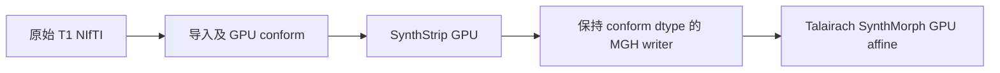
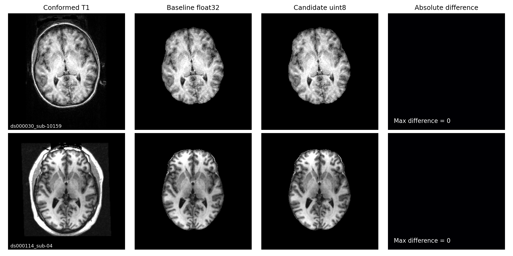

# recon-all 前段 SynthStrip 输出类型

`run_input_talairach_chain` 从原始 T1 生成 conform 图像、SynthStrip 去脑外组织图和 Talairach affine。SynthStrip 使用 FNIT PyTorch CUDA 模型，继承前段声明的 cuDNN FP32 例外。2026-10-03 修复仅改变去脑外组织图的保存类型：与 `orig.mgz` 保持一致。对于默认 conform，输出为 uint8；网络和掩膜不变。



## Python 与输入输出

```python
from fnit.recon_all.input_talairach_chain import run_input_talairach_chain

result = run_input_talairach_chain(
    t1="/data/sub-10159_T1w.nii.gz",       # 输入：单幅原始三维 T1
    subject_dir="/work/sub-10159",        # 输出：空被试目录，创建 mri/scripts
    weights_dir="/assets/weights",       # SynthStrip/SynthMorph 权重目录
    assets_dir="/assets/freesurfer",      # 含 average/mni305.cor.stripped.mgz
    device="cuda:0",                     # 显式 CUDA 设备；库接口默认 cpu
    threads=4,                           # CPU 线程预算；默认 4
)
```

输入 T1 格式、conform 参数和空间说明见已有 [前段说明](VOLUME_PREFIX_PARITY_20260930.md)。`result` 返回原始导入、rawavg、conform、SynthStrip、XFM、RAS LTA 和 voxel LTA 文件路径，阶段秒数、实际网络前向精度和 affine 子进程显存记录。默认输出 `mri/synthstrip.mgz` 是 conform 网格的三维 uint8，scanner RAS affine 以 mm 表示；脑外填充值及掩膜仍由成熟 SynthStrip 接口决定。XFM/LTA 接口保持兼容。

内部 `save_synthstrip_mgh(source_file, stripped_image, output_file) -> None` 的三个参数均必填。`source_file` 是三维 conform MGH/MGZ；`stripped_image` 是同形状、同 scanner RAS affine 的 nibabel 图像；`output_file` 是 MGH/MGZ 输出路径。函数复制输入 MGH header 和 dtype，写入去脑外组织后的值；不返回数组。非 MGH、非三维、网格不符、非有限强度、整数类型无法无损表示的输出抛 `ValueError`。网络权重缺失和子进程失败沿用前段原有异常行为。

## 命令行

```bash
python -m fnit.recon_all.input_talairach_chain \
  /data/sub-10159_T1w.nii.gz /work/sub-10159 \
  --weights-dir /assets/weights --assets-dir /assets/freesurfer \
  --device cuda:0 --threads 4
```

内部 writer 没有独立 CLI，使用前段 CLI 调用。

## 对应原软件

独立 benchmark 的去脑外组织步骤：

```bash
mri_synthstrip -i orig.mgz -o synthstrip.mgz
mri_synthmorph -m affine -t aff.lta \
  synthstrip.mgz mni305.cor.stripped.mgz -j 4
```

这些命令仅作为原实现说明和隔离 benchmark，不进入 FNIT 生产调用链。

## 验证与历史

本轮机器报告位于 `validation/recon_all/accuracy_20261003/task_02`。`frozen.json` 是重新读取历史阶段文件的诊断，明确标记并非当前基线重新执行：旧两例 `orig` 与官方体素、空间一致；SynthStrip 强度一致，候选 float32 与官方 uint8 不同；`nu` 分别差 2 和 29 体素。此证据定位保存类型问题，不能宣称新十例整例验收通过。

writer AB/BA 同冻结真实图像回归、完整 CUDA 前段回归、源码及程序 SHA、运行时间与显存结果见同目录报告。N4 浮点差异单独比较拟合 lattice、logfield、expfield 和 corrected；版本号不是根因证据。默认 N4、conform 及 Synth 的计算策略未因该 writer 修复改变。最新整例和脑图由协调者的十例统一报告提供。

- 2026-10-03：修复前段 writer 未保持 conform dtype 的 bug，加入整数强度无损表示检查；接口与模型推理兼容。
- `816e5610`：本轮冻结基线，已含 GPU conform、Synth GPU 和阶段 FP32 例外。
- `b8cd17b`：历史 conform VNL 行列式求值顺序修复；两例结果仅为诊断线索。

## 新十例前段：10/10 对完成

`cohort_prefix_collected.json` 固定十例清单 SHA，并逐例保留输入 SHA、实际源码模块 SHA、程序/权重/模板 SHA、阶段时间及显存采样。此次范围为原始 T1 到 Talairach 的完整前段；N4、SynthSeg 和整例 138 项验收由独立报告记录。十例成对运行均完成，20 个 worker 的 exit code 全为0。

十例四幅体积（导入、rawavg、conform、SynthStrip）的值和 affine 差均为 0；XFM 字节一致，两种 LTA 矩阵最大差为 0。SynthStrip 从 float32 保存为 uint8。首例真实依赖路径为 `candidate_runtime_8d750e2/src`，前段相关模块 SHA 与冻结816一致；后九例显式使用已核验的 `baseline_runtime_816e5610/src`，每次真实来源均写入报告。

| 公开输入 | 基线前段/s | 修复前段/s | SynthStrip值不同体素 |
|---|---:|---:|---:|
| ds000030_sub-10159 | 18.548 | 17.901 | 0 |
| ds000030_sub-10171 | 17.621 | 17.366 | 0 |
| ds000030_sub-10189 | 19.619 | 19.127 | 0 |
| ds000030_sub-10193 | 18.828 | 18.402 | 0 |
| ds000030_sub-10206 | 26.352 | 21.978 | 0 |
| ds000114_sub-04 | 18.033 | 22.650 | 0 |
| ds000114_sub-05 | 18.214 | 17.401 | 0 |
| ds000114_sub-06 | 17.080 | 15.911 | 0 |
| ds000114_sub-07 | 33.395 | 33.782 | 0 |
| ds000114_sub-08 | 34.375 | 33.185 | 0 |

分步骤时间（十例中位数；成对完整运行，不能相加代替总时间）：

| 步骤 | 基线/s | 修复/s |
|---|---:|---:|
| 导入 | 1.007 | 1.008 |
| 单run复制 | 0.051 | 0.055 |
| conform及空间标记 | 6.236 | 6.962 |
| SynthStrip及保存 | 3.515 | 3.453 |
| Talairach | 7.973 | 7.685 |

十例完整前段中位数为基线18.688秒、修复18.764秒；逐例配对差中位数−0.569秒。sub-04首轮修复慢4.617秒，因此完成额外AB/BA复核：

| 顺序 | 基线前段/s | 修复前段/s | 修复−基线/s | 基线conform/s | 修复conform/s |
|---|---:|---:|---:|---:|---:|
| AB | 31.887 | 34.950 | +3.062 | 16.080 | 19.128 |
| BA | 35.338 | 34.126 | -1.212 | 18.256 | 18.202 |

四次复核均exit0，四幅体积值/affine差0，XFM字节一致、两种LTA差0。AB修复慢3.062秒，其中未修改的conform步骤多3.048秒；BA修复快1.212秒。当前结果有运行波动，没有证据把首轮慢值归因于writer，也不能宣称完整前段稳定加速。writer独立真实输出AB/BA计时仍为0.314–0.328秒，对照0.387–0.417秒。

十例显存同刻父子进程采样最大7,218,397,184 bytes，查询失败0，最大间隔1.691秒；该数值是采样峰值。GPU0 H100、线程4、默认TF32与阶段FP32例外均记录在实际forward报告中。



脑图取 ds000030 sub-10159 与 ds000114 sub-04 的 canonical RAS 最大脑面积轴向切片，每行共用强度窗；最右是绝对差，最大值0。切片、窗宽、输入/输出 SHA 与绘图程序 SHA 见 `synthstrip_dtype_brains.json`。这幅图展示 writer 数值保持，不代表 FNIT 与官方整例等效。

## N4同输入交叉结果与剩余归因

| 隔离诊断 | 墙钟/s | 与现代Conda浮点输出 | 与本轮官方浮点输出 |
|---|---:|---|---|
| ITK5现代编译 | 121.262 / 121.664 | 重复逐位相同 | 2,496,335值不同，最大7.63e−5 |
| ITK4现代编译 | 128.348 | lattice/logfield/expfield/final逐位相同 | 同上 |
| 现代编译floatmask | 130.142 | 四字段逐位相同 | 同上 |
| 现代编译＋旧ITK4静态库 | 128.254 | 四字段逐位相同 | 同上 |
| GCC4.8＋旧ITK4库，floatmask | 204.957 | 首处lattice差1316/1331，最大5.66e−7 | float输出逐位相同 |
| 本轮官方FS8.2 | 208.312 | 同上现代输出尾差 | 与历史官方float逐位相同 |

这些是固定真实官方orig的隔离N4诊断，含字段导出开销，不等于整例时间。`n4_cross.json`保存完整两组程序SHA和字段比较；`n4_environment.json`绑定当前官方程序SHA。ITK4/5、mask模板类型、已编译旧ITK库替换均未改变现代结果。公开ITK小矩阵诊断中，orders1–5的B-spline refinement系数在三种编译/库组合亦完全一致。

现有证据把尾差范围缩小到主翻译单元/头文件模板的工具链求值，尚未识别具体一般算子；现代链接旧库时还使用ABI兼容编译参数，因此不把单一版本字符串当作根因。GCC4.8整体替换慢约205秒，不接生产。后续应在相同真实输入上导出首次迭代的log输入、直方图与B-spline拟合中间值定位首处运算，再只修复已解释的通用求值步骤，并验证当前速度；不调整量化阈值、epsilon或已知体素。

协调者任务3的独立固定输入回放发现，旧sub01的nu仅2体素差即可传播到GCA注册/归一化；该下游结果不包含在此十例writer验证中。生产N4仍未修复，整体recon-all等效保持`not_assessed`。

三个nohup父PID均退出，完整回执数量为10病例/2个N4变体/4次repeat，子运行成功、日志无Traceback；父进程exit code未预先采集，未把它填成0。核验时间、完整回执与日志SHA、日志尾部见`completion_receipts.json`。阶段作业未重复运行。

## 参考和源码

- [FNIT 前段](https://github.com/weikanggong1/Fudan-Neuroimaging-toolkit/blob/816e5610417a4c587caf321049438a9554139016/src/fnit/recon_all/input_talairach_chain.py)。
- [FreeSurfer 固定源码](https://github.com/freesurfer/freesurfer/tree/d932c45b7941662ea380a05efef580568b98d41a)。
- Hoopes et al. SynthStrip: Skull-stripping for any brain image. NeuroImage 260, 119474 (2022). DOI: 10.1016/j.neuroimage.2022.119474。
- Hoffmann et al. SynthMorph: Learning contrast-invariant registration without acquired images. IEEE Transactions on Medical Imaging 41, 543–558 (2022). DOI: 10.1109/TMI.2021.3116879。
