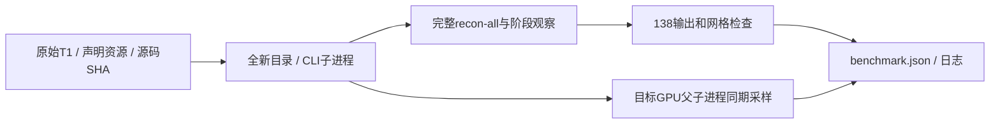

# recon-all Torch候选整例复现

## 1. 功能简介

`tools/benchmark_recon_torch_end_to_end.py`从一幅原始T1与全新目录运行FNIT CLI，
记录输入、源码、权重、资产及原生程序SHA，以及包含导入、校验、加载、传输、
计算和文件读写的墙钟与目标GPU同期父子进程占用。它不产生官方参考，不读官方结果。



## 2. 输入、输出和Python接口

这是整例benchmark命令脚本，没有新增公共Python重建API。
实际Python调用仍为 [run_recon_all_python](README.md)，新增后端原样传给单例、批量及CLI。
原始T1须为单幅3D NIfTI；不扩展多T1、T2/FLAIR或纵向流程。

| 参数 | 默认值 | 格式和含义 |
|---|---|---|
| `--t1` | 必填 | 原始3D T1w文件路径，保留其原始几何 |
| `--output-root` | 必填 | 必须不存在；下建subject、run.log、benchmark.json |
| `--weights-dir` | 必填 | 声明并校验的权重目录；递归记录SHA |
| `--assets-dir` | 必填 | 声明的模板/图谱目录；递归记录SHA，不记录许可证内容 |
| `--native-bin-dir` | 必填 | 必要固定源码Conda独立构建程序目录，记录可执行文件SHA |
| `--device` | `cuda:0` | 明确逻辑设备，遵循CUDA_VISIBLE_DEVICES；显存记录其UUID |
| `--threads` | `4` | 每被试CPU预算；双侧并行时平分 |
| `--hemisphere-workers` | `2` | 1串行，2独立双侧worker；共享缺陷体积仍顺序累积 |
| `--defects-backend` | `torch` | 此实验脚本默认Torch投射；生产入口默认仍native |
| `--wm-backend` | `native` | torch为已有混合分割，torch-optimized复用直方图与缓存几何；反馈仍为CPU |
| `--gca-inverse-backend` | `cpu` | torch复用同公式的批量求逆；仅CUDA Torch评分 |
| `--gca-candidate-chunk` | `64` | 完整候选分块的正整数，较大块增加显存 |
| `--gca-execution` | `in-process` | isolated将已有Torch GCA放入缓存开启的新exec，父低显存策略保持 |
| `--fill-backend` | `python` | numba为有序CPU堆；torch-numba另用CUDA初始边界 |
| `--wm-edit-backend` | `native` | torch-hybrid选择静态GPU与Numba有序核心，要求CUDA |
| `--sphere-normals-backend` | `numba` | torch选择有序GPU法向；标准finish由独立选项控制 |
| `--sphere-finish-backend` | `cpu` | torch复用完整dense GPU收尾；显式cuda:N与两个surface worker |
| `--inflate-backend` | `native` | torch复用完整标准inflated/sulc，nofix保持native；仅surface worker启用缓存 |
| `--mni-execution` | `in-process` | parallel-late将完整非线性与末尾CPU网格检查并行，join后验收138输出 |
| `--n4-backend` / `--n4-execution` | `native` / `in-process` | torch为完整固定N4候选；isolated仅允许torch与cuda:N，在fresh worker开启缓存 |
| `--wm-execution` | `in-process` | isolated仅允许torch-optimized，复用完整分割的缓存worker |
| `--normalization-controls-backend` | `cpu` | torch复用两轮GPU邻域，其他控制点顺序保持 |
| `--normalization-initial-bias-backend` | `cpu` | torch复用第二轮初始Voronoi/平滑，距离及排序保持CPU |
| `--native-optimizations` | `auto` | 复用现有已验证评分/原生加速；original为控制；torch强制评分 |
| `--code-version` | 必填 | 实际提交与候选身份；另逐模块记录SHA，不能伪称main版本 |

标准输出空间不变：体积分割为对应conform网格的整数标签，rawavg保留自身网格；
表面为surface RAS/mm，有序顶点/面，厚度mm、面积mm²、体积mm³。
完整输出及结构以 [138项清单](../../src/fnit/recon_all/expected_outputs.py)为准。

`benchmark.json`含源码/资源身份、主机/CPU/线程、执行返回码、API墙钟、CLI墙钟、
哈希验证秒数、外层总墙钟、目标GPU进程树样本、阶段报告及分离的验收状态。
采样计划0.5秒；实际最大间隔和失败采样必须一并读，零/不可用不代表零显存。
PyTorch allocated/reserved仍由阶段报告记录，不代替进程树占用。
前置路径错误抛异常；运行失败保留日志和部分输出并返回非零，不自动重试、
补跑或从检查点恢复。只有两个完整CLI返回0才能开展整例结果比较。

## 3. 命令行

```bash
# 个人许可证由私有环境配置；本脚本不读取或发布其内容。
# 每次output-root必须是新的路径，控制和候选固定相同影像、GPU及线程预算。
python tools/benchmark_recon_torch_end_to_end.py \
  --t1 /data/sub01_T1w.nii.gz \
  --output-root /data/recon-benchmark-new \
  --weights-dir /data/fnit-weights \
  --assets-dir /data/fnit-assets \
  --native-bin-dir /opt/fnit-conda/bin \
  --device cuda:0 \
  --threads 4 \
  --hemisphere-workers 2 \
  --defects-backend torch \
  --wm-edit-backend torch-hybrid \
  --sphere-normals-backend torch \
  --native-optimizations auto \
  --code-version ACTUAL_COMMIT_AND_SOURCE_SHA
```

参数逐项见上表。控制使用相同冻结源码，后三个后端分别为native、native、numba；
候选为torch、torch-hybrid、torch。`--profile-stages`由脚本统一开启，两边计时
同条件；阶段CUDA同步只用于剖析，不据此宣布默认无同步生产速度。

## 4. 原软件对照

官方参考在独立环境执行：

```bash
recon-all -i /data/sub01_T1w.nii.gz -s sub01 -sd /data/reference -all -openmp 4
```

此脚本自身没有对应独立官方CLI，属于benchmark外层包装；原软件对应完整recon-all。
参考产物只送入事后比较，不能用作FNIT重建输入。

## 5. 最新实测及范围

最新已发布完整评分为 589e2749 的两例原始 T1、新空目录 A100/四线程运行。CLI **2141.872/2110.975 秒**，相对 0cd9 的观察缩短 **0.464%/0.859%**；含外层哈希校验和全部加载/传输/读写的 harness 为 **2150.563/2119.676 秒**。两例完成 138/138 输出与生产网格检查，16 张有序表面坐标/面、七张标签及 68 区统计保持，零容差顶点图差异仍保留。新评分未判整体指标等效，十分钟目标尚未达到。

官方严格复现仍为 6/138、7/138；68 区厚度 MAE **0.04482/0.05068 mm**、面积 **31.397/35.868 mm²**、GM 体积 **151.147/153.956 mm³**。本次直接评分与上一冻结版本的五组官方指标一致。官方参考由另一主机生成，历史时间不构成本轮同机性能比；white/pial 穿越和 sphere 局部负向面未隐去。全部阶段、精度、源/程序 SHA 与脑图见[589 完整报告](../../validation/recon_all/optimizations/20261009_whole_inflate_a100_589e2749/README.md)。

父子树 NVML 归属为未知，不能把 null 写成 0；目标卡快照峰约 12.3 GB，另列计算进程快照上界，两类查询时间不同。名义间隔 0.5 秒，最大实际间隔 7.943/5.215 秒；不能据此宣布连续 20 GB 预算已证明。已有独立 wheel 安装及入口验证另有范围，不等于全新 Conda 或物理隔离整例。

### 最近其他完整版本

- 0cd9cbd5 GPU 归一化：CLI 2151.856/2129.266 秒，新旧表面、标签及脑区统计保持，见[原始 T1 回归](../../validation/recon_all/optimizations/20261009_whole_normalization_a100_0cd9cbd5/README.md)。
- 803aec50 GCA 缓存/求逆/fill：完整控制/候选 6137.234→2255.064 秒和 6040.677→2281.571 秒，见[完整配对](../../validation/recon_all/optimizations/20261009_whole_pair_a100_803aec50/README.md)。不是相对官方的提速。
- 765 MNI/mesh 与 e34 dense GPU finish 使用独立冻结源码和新空目录评测，未在本页用局部收益推算总时间。

### 保留的中断诊断

旧 v2 控制保存 42 阶段后 SSH 不可达，未取得 CLI 返回码；候选未启动。原[失败记录](../../validation/recon_all/optimizations/20261009_torch_integration/README.md)保持原身份，不当作最新结果。更后的 a756fffb 两例控制分别在 914.044/913.811 秒收到 SIGBUS（−7），最后完成 SynthSeg，GCA 没有完成记录；没有完整指标，也没有确定为 OOM。后续已完成的版本单独记录，不抹去失败。

Python pial 旧 GPU regularizer 的完整配对曾慢 6.22%；后续 GPU 候选索引、编译更新和清理的完整结果见[当前 pial 说明](PYTHON_PIAL_PLACEMENT.md)。不同源码/配方的阶段时间不累加为整例收益，默认生产放置仍由已声明独立构建程序执行。

## 6. 更新记录

589/e34：发布两例完整标准inflation回归，接入既有完整dense GPU sphere收尾及late MNI选项；各自完整阶段、整例、安装和入口契约保留独立证据。

2026-10-09增加后端接线、原始T1整例包装及同设备进程树采样。
新增显式候选接线复用已有GCA批量求逆、WM缓存几何和Numba fill，默认未切换；
增加显式GCA阶段隔离，不全局移除低显存措施；父CUDA已初始化时也使用exec。
新增CLI无缓冲日志、faulthandler、终止信号与完整命令记录，用于硬信号故障定位。
没有新增依赖；PyTorch、NumPy、Numba、nibabel均在主页Conda路径声明。
基础环境曾因缺少tifffile接线失败，不把修复环境中的回归当作原环境成功。
冻结源码运行期间不修改；历史报告保留自身版本，新结果完成后另列。
包装新增每30秒原子报告检查点与SIGHUP/SIGTERM中断收据，避免只在结束时保存
整例墙钟及进程树显存。突然断电/SIGKILL仍可能丢最后检查点后的采样，不能称零占用。

## 7. 参考

- [FNIT源码](https://github.com/weikanggong1/Fudan-Neuroimaging-toolkit)
- [FreeSurfer固定源码](https://github.com/freesurfer/freesurfer/tree/d932c45b7941662ea380a05efef580568b98d41a)
- Fischl B. FreeSurfer. *NeuroImage* 62:774–781, 2012.
