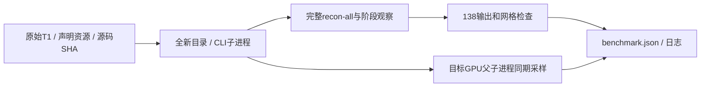

# recon-all Torch候选整例复现

## 1. 功能简介

`tools/benchmark_recon_torch_end_to_end.py`从一幅原始T1与全新目录运行FNIT CLI，
记录输入、源码、权重、资产及原生程序SHA，以及包含导入、校验、加载、传输、
计算和文件读写的墙钟与目标GPU同期父子进程占用。它不产生官方参考，不读官方结果。



## 2. 输入、输出和Python接口

这是整例benchmark命令脚本，没有新增公共Python重建API。
实际Python调用仍为 [run_recon_all_python](README.md)，新增后端原样传给单例、批量及CLI。
原始T1须为单幅3D NIfTI；不扩展多T1、T2/FLAIR或纵向流程。

| 参数 | 默认值 | 格式和含义 |
|---|---|---|
| `--t1` | 必填 | 原始3D T1w文件路径，保留其原始几何 |
| `--output-root` | 必填 | 必须不存在；下建subject、run.log、benchmark.json |
| `--weights-dir` | 必填 | 声明并校验的权重目录；递归记录SHA |
| `--assets-dir` | 必填 | 声明的模板/图谱目录；递归记录SHA，不记录许可证内容 |
| `--native-bin-dir` | 必填 | 必要固定源码Conda独立构建程序目录，记录可执行文件SHA |
| `--device` | `cuda:0` | 明确逻辑设备，遵循CUDA_VISIBLE_DEVICES；显存记录其UUID |
| `--threads` | `4` | 每被试CPU预算；双侧并行时平分 |
| `--hemisphere-workers` | `2` | 1串行，2独立双侧worker；共享缺陷体积仍顺序累积 |
| `--defects-backend` | `torch` | 此实验脚本默认Torch投射；生产入口默认仍native |
| `--wm-backend` | `native` | torch为已有混合分割，torch-optimized复用直方图与缓存几何；反馈仍为CPU |
| `--gca-inverse-backend` | `cpu` | torch复用同公式的批量求逆；仅CUDA Torch评分 |
| `--gca-candidate-chunk` | `64` | 完整候选分块的正整数，较大块增加显存 |
| `--gca-execution` | `in-process` | isolated将已有Torch GCA放入缓存开启的新exec，父低显存策略保持 |
| `--fill-backend` | `python` | numba为有序CPU堆；torch-numba另用CUDA初始边界 |
| `--wm-edit-backend` | `native` | torch-hybrid选择静态GPU与Numba有序核心，要求CUDA |
| `--sphere-normals-backend` | `numba` | torch选择有序GPU法向；其余sphere优化及finish保持 |
| `--native-optimizations` | `auto` | 复用现有已验证评分/原生加速；original为控制；torch强制评分 |
| `--code-version` | 必填 | 实际提交与候选身份；另逐模块记录SHA，不能伪称main版本 |

标准输出空间不变：体积分割为对应conform网格的整数标签，rawavg保留自身网格；
表面为surface RAS/mm，有序顶点/面，厚度mm、面积mm²、体积mm³。
完整输出及结构以 [138项清单](../../src/fnit/recon_all/expected_outputs.py)为准。

`benchmark.json`含源码/资源身份、主机/CPU/线程、执行返回码、API墙钟、CLI墙钟、
哈希验证秒数、外层总墙钟、目标GPU进程树样本、阶段报告及分离的验收状态。
采样计划0.5秒；实际最大间隔和失败采样必须一并读，零/不可用不代表零显存。
PyTorch allocated/reserved仍由阶段报告记录，不代替进程树占用。
前置路径错误抛异常；运行失败保留日志和部分输出并返回非零，不自动重试、
补跑或从检查点恢复。只有两个完整CLI返回0才能开展整例结果比较。

## 3. 命令行

```bash
# 个人许可证由私有环境配置；本脚本不读取或发布其内容。
# 每次output-root必须是新的路径，控制和候选固定相同影像、GPU及线程预算。
python tools/benchmark_recon_torch_end_to_end.py \
  --t1 /data/sub01_T1w.nii.gz \
  --output-root /data/recon-benchmark-new \
  --weights-dir /data/fnit-weights \
  --assets-dir /data/fnit-assets \
  --native-bin-dir /opt/fnit-conda/bin \
  --device cuda:0 \
  --threads 4 \
  --hemisphere-workers 2 \
  --defects-backend torch \
  --wm-edit-backend torch-hybrid \
  --sphere-normals-backend torch \
  --native-optimizations auto \
  --code-version ACTUAL_COMMIT_AND_SOURCE_SHA
```

参数逐项见上表。控制使用相同冻结源码，后三个后端分别为native、native、numba；
候选为torch、torch-hybrid、torch。`--profile-stages`由脚本统一开启，两边计时
同条件；阶段CUDA同步只用于剖析，不据此宣布默认无同步生产速度。

## 4. 原软件对照

官方参考在独立环境执行：

```bash
recon-all -i /data/sub01_T1w.nii.gz -s sub01 -sd /data/reference -all -openmp 4
```

此脚本自身没有对应独立官方CLI，属于benchmark外层包装；原软件对应完整recon-all。
参考产物只送入事后比较，不能用作FNIT重建输入。

## 5. 最新实测及范围

2026-10-09冻结v2启动一例原始T1、空目录、控制后候选串行配对，源代码模块SHA
在各报告记录。完整recon环境接线9/9通过。控制保存42个完成阶段后，GPU节点SSH
不可达，原持久会话已结束，无CLI退出码；候选未启动。
原因未确定，不归因OOM，没有新整例耗时与严格138结果。
[原记录及中断收据](../../validation/recon_all/optimizations/20261009_torch_integration/README.md)保留原始状态。
当前阶段证据为WM/aseg两例34.408→8.187秒与34.581→7.946秒、零体素差异；
单左侧standard sphere170.63→133.57秒、完整文件SHA相同；完整缺陷投射两例约3秒，
GPU未显示稳定收益。详见各子功能页，不能累加阶段收益推断整例已经少于600秒。

Python pial完整阶段1396.651→1483.542秒，GPU正则项单次配对慢6.22%，
此选项未纳入生产默认或本次整例候选。完整pial仍存在官方差异，单列排错。
新优化的严格复现、是否引入退化、整体指标等效分别记录，后者保持未判定。
当前已有环境包含原生组件；无预装软件隔离整例和全新主页安装尚未验证。

本次控制的GCA为444.146秒，其中400.532秒在线性搜索；N4为122.778秒。
两者是继续优化的实际依据。初版先控制后候选，存在Numba磁盘缓存及共享负载偏差，
即使完成也不能把单次差值当作稳定提速。后续均衡配对须使用新空目录与独立缓存。

### 本轮 A100 整例控制

两例 ds000114 sub-06/sub-07 使用冻结 `a756fffb`、各四线程和独立可见 GPU，
从原始T1与空目录启动。两次CLI分别在914.044、913.811秒收到SIGBUS（返回−7），
最后已完成阶段为SynthSeg，下一GCA没有完成记录。执行失败，没有完整138项、
最终指标或整例提速结论。正在以完整同输入GCA与原生white重复运行定位；
当前不将原因写成显存OOM或随机性。旧显存采样无法归属宿主PID，进程峰值未知。

本轮迁移使用的是既有Conda环境和固定源码构建产物的私有安装副本，
已核对资源、程序哈希及动态库，不等同于全新主页安装或物理隔离验收。

## 6. 更新记录

2026-10-09增加后端接线、原始T1整例包装及同设备进程树采样。
新增显式候选接线复用已有GCA批量求逆、WM缓存几何和Numba fill，默认未切换；
增加显式GCA阶段隔离，不全局移除低显存措施；父CUDA已初始化时也使用exec。
新增CLI无缓冲日志、faulthandler、终止信号与完整命令记录，用于硬信号故障定位。
没有新增依赖；PyTorch、NumPy、Numba、nibabel均在主页Conda路径声明。
基础环境曾因缺少tifffile接线失败，不把修复环境中的回归当作原环境成功。
冻结源码运行期间不修改；历史报告保留自身版本，新结果完成后另列。
包装新增每30秒原子报告检查点与SIGHUP/SIGTERM中断收据，避免只在结束时保存
整例墙钟及进程树显存。突然断电/SIGKILL仍可能丢最后检查点后的采样，不能称零占用。

## 7. 参考

- [FNIT源码](https://github.com/weikanggong1/Fudan-Neuroimaging-toolkit)
- [FreeSurfer固定源码](https://github.com/freesurfer/freesurfer/tree/d932c45b7941662ea380a05efef580568b98d41a)
- Fischl B. FreeSurfer. *NeuroImage* 62:774–781, 2012.
