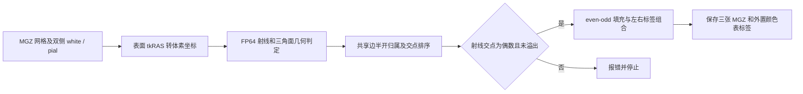
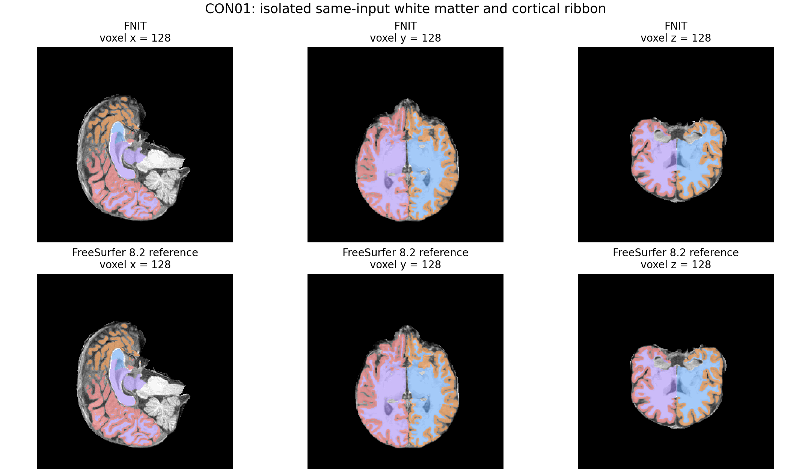

# 双侧 white 与皮层 ribbon 体积掩膜

## 1. 功能与流程

`fnit.recon_all.volmask_python.write_ribbon` 将双侧 white、pial 表面转换为与指定 MGZ 相同网格的白质和皮层标签，写出 `ribbon.mgz`、`lh.ribbon.mgz`、`rh.ribbon.mgz`。它复用现有 NiBabel、NumPy 和 CPU Numba，实现中没有 FreeSurfer 程序调用，也没有新增 Conda 依赖。



现有取样保持为沿 x 方向的射线，射线经过 `(y + 1e-5, z + 1e-5)`，在整数 x 体素位置判定内外。交点计算使用 FP64；原表面坐标和网络推理精度不变。共享边按全局顶点编号建立一致边函数，归一化投影绕序后使用半开边归属。它保留 even-odd 填充，切向接触不通过同 x 交点去重来处理。每条射线的缓存容量为 128；奇数交点或达到容量时，公开函数仍抛出 `ValueError`。

## 2. Python 调用、输入与输出

```python
from pathlib import Path
from fnit.recon_all.volmask_python import write_ribbon

subject_directory = Path("/data/subjects/sub01")
reconstruction_assets_directory = Path("/data/fnit/recon_all_assets")
ribbon_output_directory = Path("/data/derivatives/sub01/ribbon")

write_ribbon(
    template_file=subject_directory / "mri/aseg.presurf.mgz",  # 仅提供输出网格和 MGZ 头
    surface_dir=subject_directory / "surf",                 # 双侧 white、pial 输入
    output_dir=ribbon_output_directory,                     # 三张 MGZ 的输出目录
    color_lut_file=reconstruction_assets_directory / "FreeSurferColorLUT.txt",  # 外置颜色表
)
# 函数返回 None；结果在 ribbon_output_directory 中。
```

| 参数 | 输入及要求 |
| --- | --- |
| `template_file` | 路径。三维 MGH/MGZ，例如 `aseg.presurf.mgz`；从头信息读取 shape、scanner affine 和 `vox2ras_tkr`。模板体素的标签值不用于表面内外判定。 |
| `surface_dir` | 路径。包含 `lh.white`、`lh.pial`、`rh.white`、`rh.pial`，均为 FreeSurfer 三角面文件。坐标单位为 mm，处于模板的 surface tkRAS；每张表面须为闭合网格。 |
| `output_dir` | 路径。自动建立输出目录，写入下面三张图；已有同名结果会被覆盖。 |
| `color_lut_file` | 路径。FreeSurfer 文本颜色表，记录整数 ID、名称和 RGBA；用于 MGH 颜色表尾部。资源从项目固定外置资源清单解析并校验，使用调用方实际提供的文件。 |

```text
surface_dir/
├── lh.white
├── lh.pial
├── rh.white
└── rh.pial
output_dir/
├── ribbon.mgz       # uint8：背景 0，左白质 2 / 左皮层 3，右白质 41 / 右皮层 42
├── lh.ribbon.mgz    # uint8：左皮层 1，其余 0
└── rh.ribbon.mgz    # uint8：右皮层 1，其余 0
```

三张输出的 shape 和 affine 与模板一致。合并标签先选择 white 内部，再选择 pial 内部；双侧重叠时左侧优先。输出保留模板头信息，改为 uint8，并附上外置颜色表的 MGH 标签。

需要直接取得数组时可用：

```python
import nibabel as nib
from nibabel.freesurfer import io as freesurfer_io
from fnit.recon_all.volmask_python import ribbon_arrays

template_image = nib.load(subject_directory / "mri/aseg.presurf.mgz")
surface_geometry = {
    hemisphere: {
        surface_name: freesurfer_io.read_geometry(
            subject_directory / "surf" / f"{hemisphere}.{surface_name}"
        )
        for surface_name in ("white", "pial")
    }
    for hemisphere in ("lh", "rh")
}
combined_labels, left_cortical_ribbon, right_cortical_ribbon = ribbon_arrays(
    shape=template_image.shape,                          # 三个体素维度
    vox2ras_tkr=template_image.header.get_vox2ras_tkr(),   # 4×4 体素到 tkRAS 矩阵
    surfaces=surface_geometry,                          # 每侧 white/pial 的 (vertices, faces)
)
```

`surfaces` 必须具有恰好 `lh`、`rh` 两个键，每侧具有 `white`、`pial` 两个键；顶点为 `N×3` 坐标，有序三角面为 `F×3`、从零开始的整数顶点编号。返回三个 uint8 数组，顺序与三个 MGZ 文件一致。

## 3. 命令行调用

```bash
python -m fnit.recon_all.volmask_python \
  /data/subjects/sub01/mri/aseg.presurf.mgz \
  /data/subjects/sub01/surf \
  /data/derivatives/sub01/ribbon \
  /data/fnit/recon_all_assets/FreeSurferColorLUT.txt
```

四个位置参数依次为 `template_file`、`surface_dir`、`output_dir`、`color_lut_file`，含义与 Python 入口一致。本步骤在 CPU 上执行，没有 GPU 或半精度参数。

## 4. 对应原软件调用

FreeSurfer 8.2 官方重建中的对应步骤为：

```bash
mris_volmask \
  --sd /data/subjects \
  --aseg_name aseg.presurf \
  --label_left_white 2 --label_left_ribbon 3 \
  --label_right_white 41 --label_right_ribbon 42 \
  --save_ribbon --parallel sub01
```

`--sd` 指定被试父目录，末尾 `sub01` 指定被试；`--aseg_name` 选择 MGZ 网格，四个 label 参数与 FNIT 标签对应，`--save_ribbon` 另存双侧皮层图，`--parallel` 运行双侧处理。官方程序通过表面 signed-distance 判定内外，FNIT 使用上述射线 even-odd 判定。原软件命令用于独立参考验证，FNIT 生产入口直接执行本项目函数。

## 5. 最新真实数据比较

2026-10-03 的公开真实 CON01 整链在 `candidate_v2` 的 ribbon 步骤停止，报告 `lh.pial has 1 odd and 0 overflowing rays`。只读同一保存表面定位到体素射线 `(y,z)=(78,175)`：旧实现记录 5 个交点，一致 FP64 的独立计算得到 4 个。face 46801 与 59436 共享一条边；前者的混合精度 `u+v=0.9999999710578398`，一致 FP64 值为 `1.0000000042753647`，旧实现将边外邻面重复计入。

本例 bounding-box 单项修正仍得到 1 条奇数射线；统一 FP64 单项控制得到 0 条。四张真实表面的非零投影行列式均大于旧阈值 `1e-8`，本例没有因该阈值丢弃的面。完整记录见[匿名同输入报告](../../validation/fmri/public_ten_20261003/volmask_same_input.json)。整例原失败记录保留，单步骤修复复跑不计入正式十例整链时间。

| 四张真实表面的内部掩膜 | 旧版 odd / overflow | 修复版 odd / overflow | 修复版与旧版不同体素 |
| --- | ---: | ---: | ---: |
| 左 white | 0 / 0 | 0 / 0 | 0 |
| 左 pial | 1 / 0 | 0 / 0 | 112 |
| 右 white | 0 / 0 | 0 / 0 | 0 |
| 右 pial | 0 / 0 | 0 / 0 | 1 |

修复版与仅提高三角面算术精度、仍用 FP32 交点缓存的控制版各有一个 pial 体素差。独立全三角 FP64 计算表明：左侧交点 `133.00000503026104` 被旧缓存舍入为 `133.0`，右侧 `86.00000208156918` 被舍入为 `86.0`；旧缓存将整数体素 133、86 错判在内。修复版与独立计算在这两条完整射线上一致。

| 修复版输出与官方 FreeSurfer 8.2 同输入输出 | 不同体素 / 总体素 | 前景标签 Dice | affine 最大差 |
| --- | ---: | ---: | ---: |
| `ribbon.mgz` | 3 / 16,777,216 | 左白质 0.999998352；左皮层 0.999997914；右白质 1；右皮层 0.999995897 | 0 |
| `lh.ribbon.mgz` | 1 / 16,777,216 | 0.999997914 | 0 |
| `rh.ribbon.mgz` | 2 / 16,777,216 | 0.999995899 | 0 |

| 同主机隔离步骤 | 墙钟时间 | 计时范围 |
| --- | ---: | --- |
| FNIT `write_ribbon` | 3.430 s | 同四张表面和网格，含读取、计算和三图保存；Numba 已在前面的独立掩膜检查中预热，不含包导入和首次 JIT。 |
| FreeSurfer 8.2 `mris_volmask` | 146.401 s | 新独立目录、同输入，含原程序进程启动、计算和保存；双侧各 2 个 OpenMP 线程，总预算 4。 |

六个原输入文件（四张表面、网格、颜色表）的前后 SHA-256 一致，两份实际运行模块的源码 SHA-256 一致；官方退出码为 0，三张输出均有限、网格为 `256³`。此单例保留了实际的 3 个合并标签差异，验证范围是该隔离步骤的精度和时间；两个入口的启动及 JIT 范围不同，不将其时间比值称为完整重建提速。



上排为修复版，下排为官方同输入输出，背景为同一自产 `brain.mgz`；蓝/橙为左白质/皮层，紫/红为右白质/皮层。三个切面使用同一体素索引，颜色叠加范围由实际标签数组决定。该图来自公开 [OpenNeuro ds001226 v5.0.1](https://openneuro.org/datasets/ds001226/versions/5.0.1) 的健康控制 CON01，官方数据说明的许可为 CC0；原始 T1 的 SHA 与数据清单、v2 重建请求一致。背景、输出与绘图脚本 SHA 保存在[脑图来源记录](../../validation/fmri/public_ten_20261003/volmask_same_input_figure.json)。它展示本次隔离步骤，不属于正式 v3 十例脑图。

## 6. 更新与 benchmark 记录

| 版本 / 记录 | 修改及证据 |
| --- | --- |
| `19c8e0a3`，2026-10-03 几何判定修复 | 一致 FP64、顶点编号规范化的半开共享边、与实际采样一致的 bbox、仅跳过严格零投影。9 项回归包含准确的 64 体素闭合立方体、bbox 解析棱柱、共享边反向逐位符号、切向顶点、细棱柱，以及 open / overflow 拒绝。小几何是契约测试，不是 benchmark。 |
| `01de7f30`，CON01 `candidate_v2` | 真实整链在 ribbon 步骤因 1 条奇数射线停止；成熟 CPU 子函数的数值边界 bug 在这次 pipeline 接入中暴露。 |
| 2026-09 固定 `fs_sub01` 历史记录 | 旧算法的三张图与该例原输出全体素一致；包含启动和 I/O 的 CPU CLI 时间分别为 FNIT 3.46 s、FreeSurfer 72.36 s。输入哈希及范围保留在[历史同输入记录](../../validation/recon_all/python_gpu_port/VOLMASK.md)。这项旧记录不验证当前修复版。 |

修复保持保存的表面、采样位置、even-odd 模型、标签值和输出格式。新增 FP64 仅用于几何 predicate；网络及 GPU 精度设置不变。旧闭区间算法即使无奇数射线，也会在立方体共享对角线上漏掉 16/64 内部样点；旧 `1e-8` 阈值还会将非零投影的细棱柱静默判为空。因此本轮修复是成熟子函数的功能修复，不能仅凭 odd=0 宣称几何判定正确。

## 7. 参考文献与原实现

- [FreeSurfer 固定版 `mris_volmask` 源码](https://github.com/freesurfer/freesurfer/blob/d932c45b7941662ea380a05efef580568b98d41a/mris_volmask/mris_volmask.cpp)。
- Fischl B. FreeSurfer. *NeuroImage*. 2012;62:774–781. [doi:10.1016/j.neuroimage.2012.01.021](https://doi.org/10.1016/j.neuroimage.2012.01.021)。
- Woop S, Benthin C, Wald I. Watertight Ray/Triangle Intersection. *Journal of Computer Graphics Techniques*. 2013;2(1):65–82. [原文](https://jcgt.org/published/0002/01/05/)。作为共享边一致计算的几何背景；本函数是固定 x 射线的独立实现。
- [Microsoft 官方三角形半开边归属规则](https://learn.microsoft.com/en-us/windows/win32/direct3d11/d3d10-graphics-programming-guide-rasterizer-stage-rules)。用于说明边界由相邻三角形中的一侧归属的约定。
