# WM/aseg 的 PyTorch 子阶段与混合编辑

## 1. 功能与支持范围

`edit_wm_aseg_torch.py` 把输入标签决定的 MTL 补白质及后编辑改为
PyTorch CUDA。原有 Numba/NumPy 函数保留作回归参考。有序核心扫描仍由 Numba CPU 执行。新增完整同输入混合诊断接口，将
`-fill-seg-wm` 放在原生首遍 WM 分支，GPU 预计算静态候选、执行固定
filled 的邻域传播及后编辑。`remove_paths_to_cortex` 仍只接受几何证明
其原生 byte-access 分支为 no-op 的输入；其余输入报错。默认生产后端
保持原样，混合接口不表示完整通用命令或整例 recon-all 已迁移。

```mermaid
flowchart LR
    A[WM brain aseg EntoWM 同网格] --> B[remove_paths 几何证明]
    B --> C[GPU 静态 fill 候选]
    C --> D[Numba 首遍有序 WM 分支消费候选]
    D --> E[GPU 固定 filled 邻域传播]
    E --> K[Numba 后续有序扫描]
    K --> L[GPU 海马下方 WM 与 MTL spackle]
    L --> F[GPU SCM-HA 清理]
    F --> G[keep-in]
    G --> H[EntoWM]
    H --> I[ACJ]
    I --> J[保留输入 MGZ 头与尾写出]
```



spackle 保留完整距离搜索、无断点时 `-1` 返回值和 lateral/diagonal
目标。海马下方规则只查询固定 aseg；两者写入值均为 250，写入次序
不会改变最终体素。SCM、fill 和 ACJ 使用二值 max-pool；0/1 在 float32
中精确表示，不使用半精度。ACJ 复用既有 `wm_edits_gpu.py` 内核，保留
边缘种子排除及左右标签同邻域的最后邻居规则。其公开 CUDA 接口不变。

N4 保留现有 ITK 实现。`n4_gpu.py` 的平滑残差算法并非 ITK N4，本次
没有把它接成生产默认，也没有用 WM 子阶段结果代替 N4 精度验证。

## 2. Python 调用、输入与输出

张量接口使用 `(x, y, z)` 的个体 conformed 体素网格，维度为 `(X,Y,Z)`。
WM 是 `torch.uint8`，aseg/EntoWM 是整数张量；必须同 device、同 shape。
没有坐标重采样或毫米距离换算。返回新 WM，dtype/device/shape 不变，
不修改输入。标签的整数值是语义，不能按连续强度做插值。

| 函数 | 全部参数 | 输出与限制 |
| --- | --- | --- |
| `spackle_wm_superior_to_mtl_torch` | `wm`：待编辑 WM；`aseg`：标签；`point_chunk=512`：距离搜索批量 | uint8 WM。批量不截断候选。原 CPU 读 lateral 或 `y+1` 会越界的候选显式拒绝 |
| `add_aseg_wm_below_hippocampus_torch` | `wm`；`aseg` | uint8 WM；保留原扫描范围；原 CPU `z+1` 无定义的末层候选拒绝 |
| `fix_subcortical_mass_ha_torch` | `wm`；`aseg`；`ndilate=1`：非负整数，26邻域膨胀次数 | uint8 WM；清除 ILV、杏仁核及不在膨胀掩膜内的海马 WM |
| `fill_seg_wm_seed_torch` | `aseg`：3D整数标签 | 同网格bool候选；排除首遍不扫描的x/y边缘，保留z边缘。只在有序WM分支消费，不可预先整卷填充 |
| `propagate_wm_from_filled_torch` | `wm`；`aseg`；`filled`：同网格bool/uint8固定标志 | 新uint8 WM；26邻域，IS_WM包含186/187，不递归扩展filled |
| `fill_seg_wm_from_core_torch` | `core`：已有核心输出；`aseg` | uint8 WM。仅复现仓库后置表达式；完整原生命令任意输入等价性未建立 |
| `apply_late_wm_edits_torch` | `core`；`aseg`；`entowm`；`original_wm`：keep-in 原始值；`fill_seg_wm=False` | uint8 WM，依次 fill/SCM/keep-in/EntoWM/ACJ；fill 限制同上 |

所有接口网格、dtype、device、参数错误抛 `ValueError`；CUDA 故障原样
传播，不自动回退 CPU。CPU 张量模式仅用于单算子诊断。

```python
import torch
from fnit.recon_all.edit_wm_aseg_torch import apply_late_wm_edits_torch

edited_wm_tensor = apply_late_wm_edits_torch(
    core=core_wm_tensor,           # uint8，已有有序核心输出，CUDA 上的 X/Y/Z 网格
    aseg=aseg_tensor,              # 整数标签，与 core 同网格、同 device
    entowm=entowm_tensor,          # 整数 EntoWM 标签，与 core 同网格、同 device
    original_wm=original_tensor,   # uint8，keep-in 使用的原始 WM
    fill_seg_wm=False,             # 不启用尚未验证通用完整命令等价性的后置 fill
)
```

文件 API 使用 nibabel；MGH/MGZ 的 WM 输入是 uint8，标签文件允许整数
存储或 float32 存储的**精确整数**。浮点标签只在数值完全可转 int32
时转换；NaN、非整数或超范围值报错。四个输入的 affine 单位为 mm，
绝对差必须不超过 `1e-4`；不改变 scanner RAS 或 surface RAS。

```python
from fnit.recon_all.edit_wm_aseg_torch import write_late_wm_edits_torch

late_edit_report = write_late_wm_edits_torch(
    core_file="subject/mri/core.mgz",             # 已有核心输出，3D uint8
    aseg_file="subject/mri/aseg.presurf.mgz",      # 同网格整数语义标签
    entowm_file="subject/mri/entowm.mgz",          # 同网格 EntoWM 标签
    original_wm_file="subject/mri/wm.seg.mgz",     # keep-in 原始 WM
    output_file="subject/mri/wm.late.mgz",        # 输出，保留 core 的 dtype、头及尾
    device="cuda:0",                            # 显式目标 GPU，默认 cuda:0
    fill_seg_wm=False,                           # 默认关闭后置 fill
)
```

返回字典包含 `implementation`、`device`、`output`、`total_seconds`、
`fill_seg_wm`、`full_native_core_replaced=False`。时间包含读取、上传、
计算、下载、压缩与写出；CUDA 下载完成后才保存。失败抛异常，不返回
虚假的完成标记。

完整诊断接口 `edit_wm_aseg_hybrid_diagnostic(wm, brain, aseg, entowm, *,
device="cuda:0", fill_seg_wm=False)` 返回 `(新uint8数组, 报告字典)`。四个
NumPy输入为同网格，WM/brain必须uint8，aseg/entowm必须int32。有序
Numba保留反馈依赖的有序扫描。GPU先计算aseg决定的fill候选，首遍
WM分支逐点消费，随后GPU执行固定filled的传播；再回到Numba后续
扫描，最后连接GPU海马下方、spackle和late编辑。后编辑不再次fill。
`remove_paths_to_cortex` 的几何no-op证明不成立时抛 `NotImplementedError`；
旧的固定被试公共入口及其SHA限制保留。完整混合接口没有按被试SHA
绕过几何证明；本轮同输入原生命令回归单独报告，尚未替换生产默认。

文件版本 `write_wm_asegedit_hybrid_diagnostic` 包含加载、传输和写出。
额外要求aseg原存储为4字节int32或float32精确整数；原生MRIclone保留
该dtype，byte-access范围依赖itemsize，int16/uint8不能先转int32再证明。
EntoWM及late-only文件API不受此存储限制。


```python
from fnit.recon_all.edit_wm_aseg_torch import write_wm_asegedit_hybrid_diagnostic

diagnostic_report = write_wm_asegedit_hybrid_diagnostic(
    wm_file="subject/mri/wm.seg.mgz",             # 3D uint8，分割后待编辑 WM
    brain_file="subject/mri/brain.mgz",           # 同网格 uint8 强度图
    aseg_file="subject/mri/aseg.presurf.mgz",      # 同网格整数语义标签
    entowm_file="subject/mri/entowm.mgz",          # 同网格 EntoWM 标签
    output_file="diagnostic/wm.asegedit.mgz",     # 独立诊断输出，不覆盖生产结果
    device="cuda:0",                            # 显式目标 GPU
    fill_seg_wm=True,                            # 在首遍有序WM分支执行原生fill配方
)
```

报告含有序CPU时间、包含搬运的Torch时间、数组阶段时间、包含读写的
总时间、`timing_parts_seconds`细项、路径证明结果、fill位置和输出路径。
GPU细项含同步及搬运；CPU字段不混入GPU耗时。输入、空间、失败行为同
上；不读取参考输出或调用原生程序。

## 3. 命令行

```bash
python -m fnit.recon_all.edit_wm_aseg_torch \
  --core-file subject/mri/core.mgz \
  --aseg-file subject/mri/aseg.presurf.mgz \
  --entowm-file subject/mri/entowm.mgz \
  --original-wm-file subject/mri/wm.seg.mgz \
  --output-file subject/mri/wm.late.mgz \
  --device cuda:0
```

这些参数分别对应上表文件 API。`--fill-seg-wm` 对应显式实验后置
表达式；不提供时关闭。接口不依赖 FSL/FreeSurfer 系统程序，不新增
依赖；PyTorch、NumPy、nibabel 已属于主页 Conda 环境。

## 4. 原软件调用

以下是独立 benchmark 中的完整参考调用：

```bash
mri_edit_wm_with_aseg -keep-in \
  -fix-ento-wm entowm.mgz 3 255 255 \
  -fix-acj aseg.presurf.mgz 255 255 \
  -fill-seg-wm -fix-scm-ha 1 \
  wm.seg.mgz brain.mgz aseg.presurf.mgz wm.asegedit.mgz
```

spackle 与海马下方补 WM 是这个命令的内部步骤，没有独立官方 CLI。
同输入子阶段比较使用仓库按固定源码顺序移植的 CPU 函数；另列完整
诊断相对已有原生输出的误差，不将两种比较合并。

## 5. 本次真实数据验证

2026-10-09 的公开 sub-07、sub-06，使用已授权服务器上的 FNIT 自产检查点，
H100、4线程、显式 `cuda:1`、TF32 开启、无 FP16/BF16。报告绑定基线
`937263e04eb1` 与实际模块 SHA-256；候选算法不读取参考 WM 输出。
真实结果与复现脚本见 `validation/recon_all/optimizations/20261009_wm_torch/`。

本轮分别记录常驻数组子阶段、包含读写的 late API、混合完整命令诊断。
所有子阶段的修改后输出与既有 CPU 函数比较，并保留整数值Dice、最大
及 P99 误差；完整 recon-all 墙钟、最终脑区指标和隔离部署未在本子任务
重跑，不能从子阶段速度推导整例速度。

完整WM编辑的ABBA使用相同四个输入、4线程和同一H100，包含读取、
整数检查、H2D/D2H、计算、MGZ压缩及写出；文件缓存和Numba JIT已热。
这些是共享节点本轮观察；不与不同负载的历史秒数混合计算提速。

| 输入 | Conda原生中位数 | Numba+Torch中位数 | 同输入阶段速度比 | 体素差/最大/P99 | 几何/dtype | 原生重复体素差 |
| --- | ---: | ---: | ---: | --- | --- | ---: |
| sub-07 | 34.408 s | 8.187 s | 4.20× | 0 / 0 / 0 | 精确一致 | 0 |
| sub-06 | 34.581 s | 7.946 s | 4.35× | 0 / 0 / 0 | 精确一致 | 0 |

两例输出每个整数值的Dice均为1。WM文件保存整数强度与编辑值，这个
逐值检查不是完整aseg/aparc脑区Dice。GPU allocated峰值738,197,504
字节、reserved峰值826,277,888字节；nvidia-smi对显式UUID/PID捕获的
进程最大值为1,377,828,864字节（1.378GB，约1.283GiB）。请求采样
间隔0.25秒，实际最大间隔sub-07为4.481秒、sub-06为3.138秒；驱动
查询延迟可能漏过短峰值，不能据此保证连续峰值。

原生参考来自固定FreeSurfer源码Conda构建，程序SHA为
`b38f118c8f30bd49f95853c5c427ff8b98d667559cdc08a68a0405425fe88563`。
ABBA绑定执行前的Torch模块SHA `3cf6368da9ff…`；随后只增加原存储
dtype guard，不改变这两例已接受输入的算子，guard的当前版本及回归
另见报告。raw report中的旧`cuda_process_sampling`占位字段没有覆盖
本次采样，正式实测字段为`process_memory`及同目录process_memory.json。
完整原始T1整例、最终脑区厚度/面积/体积、安装和无预装软件隔离运行
由总任务另行验收，本页没有整例10分钟或整体等效结论。

## 6. 更新与验证记录

- 2026-10-09：新增确定性 Torch 子阶段和文件 API；CPU/reference 保留。
- 2026-10-09：修正既有Numba核心遗漏的cerebellar exterior标签6/45与
  IS_WM temporal白质186/187，保持其他功能及固定输入公共入口限制。
- 2026-10-09：fill由诊断后置表达式移回原生首遍WM分支；固定filled
  标志不增长，GPU一次26邻域汇总保持原生重复扫描语义。
- 2026-10-09：实际 `aseg.presurf.mgz` 是 float32 存储的整数标签，文件
  边界增加精确转换检查，未修改标签语义。
- 2026-10-09：legacy及主页声明环境曾在context查询或首次1–12字节上传时
  间歇报OOM，当时物理卡仍有充足空闲。显式初始化context后本轮测试
  可以运行；不引入生产自动重试，失败记录保留。两环境均PyTorch
  2.5.1/CUDA11.8，不能将现象解释为算法超20GB或宣布根因已解决。

## 7. 原代码与参考

原规则来自 [固定 FreeSurfer WM 编辑源码](https://github.com/freesurfer/freesurfer/blob/d932c45b7941662ea380a05efef580568b98d41a/mri_edit_wm_with_aseg/mri_edit_wm_with_aseg.cpp)。
FNIT CPU 对照为 `edit_wm_aseg_core_python.py`、`edit_wm_aseg_late_python.py`；
ACJ CUDA 内核为 `wm_edits_gpu.py`。皮层重建背景文献：Dale AM, Fischl B,
Sereno MI. *Cortical surface-based analysis. I. Segmentation and surface
reconstruction*. NeuroImage, 1999, 9:179–194。
