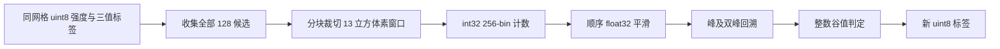
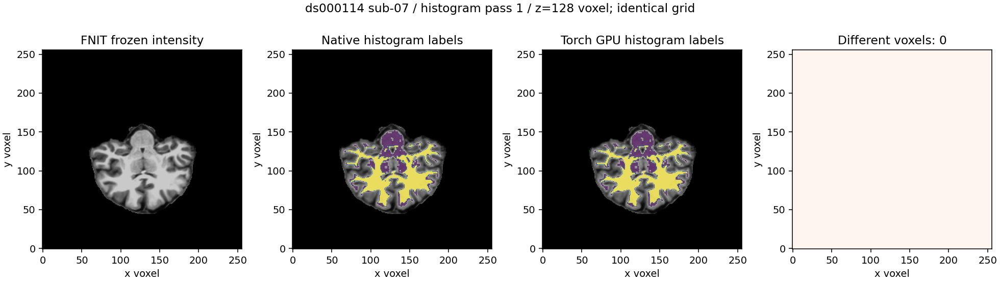

# WM 局部直方图的 PyTorch 分块实现

## 1. 功能与范围

`mri_segment_histogram_torch.histogram_segmentation_torch` 复用现有 WM
分割的局部直方图配方，处理所有 `AMBIGUOUS=128` 体素。它将候选分块，
在目标设备上生成 256-bin 整数直方图，按固定 float32 顺序平滑，再执行
灰质/白质峰、双峰回溯和谷值判定。没有逐候选 Python 循环、CPU 下载，
也没有截断候选或改写输入。双峰回溯以单调父索引的倍增查询实现，保留
完整下降链；五层查询覆盖 uint8 灰度范围内的所有可能下降步骤。

这是 `MRIhistoSegment` 子阶段；已有完整 `segment_white_matter` 和文件
API 增加显式 `histogram_backend="torch"`，默认仍为 `"cpu"`。strand、
diagonal 等有序反馈扫描由原实现执行。原生 WM 默认、已验证的 WM/aseg
混合编辑，以及整例调度保持本轮冻结版本。



默认 TF32 策略保持开启；该算子不使用矩阵乘法或 cuDNN 卷积。局部
计数为 int32，平滑为 float32，源码的 double 常数比较单独保留；不使用
FP16/BF16。直方图在边界处裁切，不把边缘体素重复填入窗口。

## 2. Python 调用、输入与输出

输入张量坐标是 `(x,y,z)` 的体素索引。两者必须同三维网格、同 device，
没有 scanner RAS/surface RAS 变换或毫米单位插值。

| 参数 | 类型、默认值与含义 |
| --- | --- |
| `image` | 非空三维 `torch.uint8`，WM 分割使用的 0–255 强度图 |
| `labels` | 与 image 同 shape/device 的 uint8 标签；1=非 WM、128=未决定、255=WM；只有 128 会被处理，其他值原样保留 |
| `wm_low` | 必填有限灰度阈值，范围 0–255；白质下界，按原生 int 参数向零截断 |
| `wm_hi` | 必填有限灰度阈值，0–255，须不小于 wm_low；白质上界 |
| `gray_hi` | 必填有限灰度阈值，0–255；灰质上界 |
| `window` | 默认 13，正奇数；局部窗口的边长，单位为体素 |
| `batch_size` | 默认 2048，正整数；每批候选数，只调节内存与吞吐，不改变候选集合 |

返回新的三维 `torch.uint8` 标签，shape/device 与输入相同。输入图像和
标签不修改；没有候选时返回标签副本。不读取或写入文件。参数、网格、
dtype 或 device 不符时抛 `ValueError`；CUDA 失败原样传播，不自动切换
CPU。CPU 模式供同算子诊断，在 CPU 上不推荐取代成熟原路径。

```python
from fnit.recon_all.mri_segment_histogram_torch import histogram_segmentation_torch

classified_labels_tensor = histogram_segmentation_torch(
    image=wm_intensity_tensor,        # 三维 uint8 强度，目标 CUDA 上的 x/y/z 网格
    labels=trinary_labels_tensor,     # 同网格 uint8；1/128/255 的整数标签语义
    wm_low=79.0,                     # 首遍白质强度下界
    wm_hi=125.0,                     # 首遍白质强度上界
    gray_hi=99.0,                    # 首遍灰质强度上界
    window=13,                       # 窗口边长，以体素计，必须为正奇数
    batch_size=2048,                 # 临时内存批量，不截断候选
)
```

私有函数 `_batch_histograms` 返回 B×256 int32 计数与 B 个最小/最大灰度；
`_smooth_source_order` 返回 B×256 float32 平滑值和有效 bin 掩膜；
`_classify_histograms` 返回 B 个 uint8 分类。它们由公开入口检查参数，不
作为独立生产 API。所有临时张量都保持输入 device。

完整 WM 的张量 API `segment_white_matter(image, *, device=None,
histogram_backend="cpu", histogram_batch_size=2048, planar_backend="python",
planar_batch_size=256)` 返回新 uint8 WM。
`device=None` 保留输入设备；两个新增选项分别选择 histogram 实现和
批量，不改变后续扫描、标签或空间。无效后端、批量或空图像在计算前
报错。平面后端默认`python`；显式`cached`复用静态Torch几何与有序Numba扫描，批量默认256，详见[平面功能页](WM_PLANAR_TORCH.md)。默认行为与旧版相同。

文件 API 参数与返回值如下；读取、传输和压缩写出均在调用内。

```python
from fnit.recon_all.mri_segment import segment_white_matter_mgz

wm_segmentation_report = segment_white_matter_mgz(
    source_path="subject/mri/antsdn.brain.mgz",  # 三维 uint8，固定 WM 分割强度图
    output_path="candidate/wm.seg.mgz",         # uint8 WM，新文件，保持输入 MGH 头及 mm affine
    device="cuda:0",                           # 默认 cpu；这里明确目标 GPU
    histogram_backend="torch",                # 默认 cpu；这里复用新增 GPU 分块算子
    histogram_batch_size=2048,                 # 默认 2048；全部候选按此批量处理
    planar_backend="python",                 # 默认旧平面；cached为已回归的有序缓存候选
    planar_batch_size=256,                    # 缓存平面几何候选批量，不删减候选
)
```

返回字典含 `implementation`、`device`、`histogram_backend`、
`histogram_batch_size`、`planar_backend`、`planar_batch_size`、`ordered_cpu_rules=True` 和 `output`。不执行额外
生产同步，不修改调用者的全局精度设置。读取/写出失败抛相应异常；错误
输入 dtype 或维度抛 `ValueError`，CUDA 失败传播。

## 3. 命令行与复现

不新增生产 CLI。`benchmark/recon_wm_histogram_torch.py` 只在隔离诊断
目录运行两遍 histogram 的 CPU/GPU ABBA 配对。参数全部显式；输出
目录必须不存在。`--source` 为真实 FNIT 强度输入，`--diagnostic-dir`
含同输入原生 `wmseg.int.*` 和 `wmseg.histo.*` 参考；它们仅用于阶段
输入和比较，不进入生产。参考程序和三份固定源码均记录 SHA-256。

```bash
OMP_NUM_THREADS=4 MKL_NUM_THREADS=4 OPENBLAS_NUM_THREADS=4 \
PYTHONPATH=src python benchmark/recon_wm_histogram_torch.py \
  --source diagnostic/antsdn.brain.mgz \
  --diagnostic-dir diagnostic/native_diag \
  --output-dir diagnostic/histogram_pair \
  --device cuda:0 \
  --threads 4 \
  --code-commit ACTUAL_BASELINE_COMMIT \
  --reference-binary /declared/conda/bin/mri_segment \
  --reference-sha256 DECLARED_PROGRAM_SHA256 \
  --reference-source-root /declared/fixed/source
```

`--device` 必须为显式 CUDA 设备，默认 cuda:0；`--threads` 默认 4。
`--code-commit` 绑定基线，实际执行模块另记哈希。`--reference-sha256`
不匹配则拒绝测试。真实输出只保存在服务器；JSON 报告包含逐标签 Dice、
不同体素数、最大/P99误差、输入几何、线程、设备 UUID、实际 TF32、
同步时间、显存采样间隔及 allocated/reserved。整例等效性记为未判定。

完整 WM 文件 API 三方脚本是 `benchmark/recon_wm_segment_histogram_backend.py`。
它没有 `--diagnostic-dir`，其余参数相同，并必填 `--reference-assets`
指向已声明的原生 benchmark 资产。顺序为 native→旧 CPU histogram→新
Torch→新 Torch→旧 CPU→native；第一次冷 Python API 单列，之后配对
中位数包含校验、读取、上传、全部 WM 阶段、下载与压缩写出。阶段同步
只由 benchmark 包装器执行，生产函数不增加同步。脚本另记录分配器
环境、CPU亲和性、冷/暖范围和无诊断写出的原生命令。
这里的冷调用指进程内第一次完整 API，没有清空文件系统缓存；解释器
启动、顶层导入和 CUDA 上下文初始化不在该 API 时间内，不称冷进程或
原始 T1 整例时间。

脑图脚本 `benchmark/plot_wm_histogram_torch.py` 使用主页已有的
Matplotlib/nibabel；`--source` 为 uint8强度，`--native`/`--candidate`
为同网格1/128/255标签，`--output` 为不存在的PNG，`--case-label` 为
显式公开数据标题，`--histogram-pass` 默认1且限1/2，`--slice-z` 默认
128体素。输入网格、dtype、切片不符或输出存在会报错。PNG旁的JSON
记录实际输入、候选、脚本和图像SHA；图中坐标是体素，无RAS变换。

## 4. 对应原软件

`MRIhistoSegment` 是 `mri_segment` 内部函数，没有独立官方 CLI。
本次参考由允许的固定 FreeSurfer 源码 Conda 构建程序执行：

```bash
mri_segment -wsizemm 13 -mprage -diag-write -diag-verbose \
  antsdn.brain.mgz wm.seg.mgz
```

两次强度分类后的输入分别为 `wmseg.int.1.mgz` 和 `wmseg.int.2.mgz`；
对应参考是 `wmseg.histo.1.mgz` 和 `wmseg.histo.2.mgz`。诊断命令产生
许多文件且与其他任务同期运行，其完整时间只作参考生成记录，不能用来
计算单个 GPU histogram 的提速比。生产候选不执行该命令。

## 5. 真实数据验证和耗时

2026-10-09，在同一 Xeon Gold 6430 / H100 节点、Torch 2.5.1、四线程
预算下，使用 OpenNeuro ds000114 的 sub-07/sub-06 既有 FNIT
`antsdn.brain.mgz` 冻结强度输入。固定源码原生诊断输入和输出绑定哈希，
CPU/GPU 各两次，顺序 ABBA。两次强度分类也核对原生输入，均为 0 差异。

| 真实例 / 遍次 | 全部候选 | 旧 Python 中位秒 | GPU 中位秒 | 相对旧 Python | 对原生不同体素 / 标签 Dice |
| --- | ---: | ---: | ---: | ---: | --- |
| sub-07 / 第一遍 | 209803 | 37.3980 | 0.36340 | 102.91× | 0 / 1、128、255 均 1 |
| sub-07 / 第二遍 | 89397 | 16.1604 | 0.13218 | 122.26× | 0 / 均 1 |
| sub-06 / 第一遍 | 232058 | 44.3566 | 0.38950 | 113.88× | 0 / 均 1 |
| sub-06 / 第二遍 | 130258 | 25.0434 | 0.20080 | 124.72× | 0 / 均 1 |

每次旧 Python 和 GPU 输出与原生都逐体素一致，最大/P99误差为 0；
输入/输出 shape、uint8、affine 完全一致。数据范围内本次优化没有
引入标签退化。没有以 Pearson 相关性代替标签比较。

两例独立进程的已采样占用峰值为 801,112,064 / 796,917,760 字节；
PyTorch allocated 峰值为 217,635,840 / 218,211,840，reserved 为
249,561,088 / 245,366,784 字节。申请 0.25 秒采样，实测最大间隔
0.728 / 0.411 秒；这是采样峰值，不保证捕获连续峰值。节点另有
connectome 任务，实际共享负载单列，不作为稳定吞吐结论。

### A100 完整WM文件API三方配对

同一A100节点、四线程、相同输入下，完整API/原生命令包含校验、读取、上传、全部WM步骤、下载与压缩写出；不含解释器、顶层导入和CUDA初始化。这里“旧CPU”仅指CPU histogram，其余既有Torch阶段仍选择相同GPU。冷API单列，不混入暖配对。

| 例 | 原生命令中位秒 | 旧CPU histogram完整API秒 | GPU histogram完整API秒 | 相对旧API | 新旧WM新增差异 | 对原生既有差异 |
| --- | ---: | ---: | ---: | ---: | ---: | ---: |
| sub-07 V1完整 | 43.9876 | 116.6999 | 67.0017 | 1.742× | 0 | 64体素 |
| sub-06 V2完整 | 51.6003 | 161.0779 | 95.8278 | 1.681× | 0 | 235体素 |

原生命令均重复两次且完全重现；旧/新Python输出文件SHA相同，最大/P99新增误差0，affine、MGH头和dtype相同。原生差异保留为原有WM算法问题，不归因于随机性，也不把数值标签相关性当分割Dice。完整GPU histogram仍比原生命令慢，暂不替换原生默认。新增[平面补洞缓存](WM_PLANAR_TORCH.md)继续处理完整剖析的46–70秒热点，单独验证。

sub-06 V1在3/6次测量后会话消失，缺退出码和traceback，原因未确定；不能称ABBA完成或推断OOM。独立V2带faulthandler、退出收据和1秒cgroup记录正常结束，累计failcnt在起止均548656，没有本次新增限额失败证据。

A100共享节点存在其他项目和FNIT任务，不将这些配对观测称独占稳定吞吐。allocated峰值为211,688,448/213,785,600字节，V1进程采样没有匹配PID，实际进程占用为None；不能写0或据此宣称低于20GB。V2明确目标设备的整卡采样上界为23,480,303,616字节，包含其他进程及驱动，不是FNIT自身峰值。原始完整JSON、已去私有路径的公开副本及原始SHA保存在[本轮报告](../../validation/recon_all/optimizations/20261009_wm_histogram_torch/cfff_a100)。

原生诊断命令的时间包含大量诊断写出，未用作本表单个算子的速度基线。
固定原生两遍输出可重复性与完整 WM 三方配对由后续完整文件 API 报告
单列。原始 T1 整例提速尚未测量，整体指标等效保持 `not_assessed`。
完整报告见
[本轮 JSON 与复现记录](../../validation/recon_all/optimizations/20261009_wm_histogram_torch/README.md)。

下图为公开 sub-07 第一遍的 z=128 体素切片。紫色为128未决定标签，
黄色为255白质，标签1不覆盖强度图；最右栏显示全体积不同体素为0。
这是 histogram 标签与强度的叠加，尚不代表最终 WM 或皮层表面。



冻结子阶段、完整 WM 和原始 T1 整例分别评价。
局部算子计时在前后同步显式目标 GPU，覆盖全部候选，包含张量克隆与
临时张量；预加载数组的计时不含磁盘读写和 H2D/D2H，不称整例提速。

## 6. 更新与 benchmark 记录

2026-10-09：新增独立 PyTorch 模块；复用既有 sigma=3 核及 WM 配方，
保留原 CPU 路径作回归，不更改调度或默认。标准库 unittest 覆盖边界
裁切、整数计数、float32 顺序、批量无关性、双峰下降链及失败参数。
模拟输入只用于算子回归，真实 benchmark 另列。

## 7. 原代码与参考文献

- [固定源码 MRIhistoSegment](https://github.com/freesurfer/freesurfer/blob/d932c45b7941662ea380a05efef580568b98d41a/utils/mrihisto.cpp)
- [固定源码 histogram 平滑、峰与谷](https://github.com/freesurfer/freesurfer/blob/d932c45b7941662ea380a05efef580568b98d41a/utils/histo.cpp)
- [固定源码 mri_segment 调度](https://github.com/freesurfer/freesurfer/blob/d932c45b7941662ea380a05efef580568b98d41a/mri_segment/mri_segment.cpp)
- Dale AM, Fischl B, Sereno MI. Cortical surface-based analysis. I. Segmentation and surface reconstruction. NeuroImage 1999;9:179–194.
