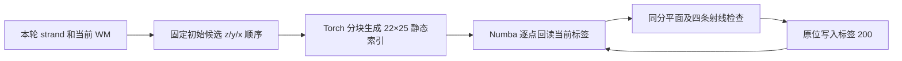
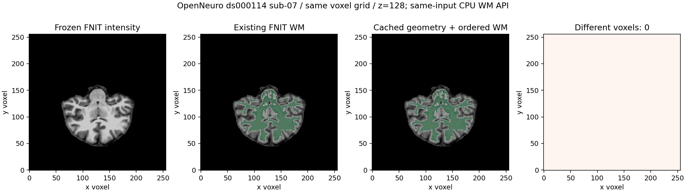

# WM 平面补洞的静态几何缓存与有序更新

## 1. 功能与范围

`fill_planar_holes_cached` 复用既有 WM 分割的 22 个平面、5×5 采样和四向射线配方。PyTorch 一次生成当前 strand 版本的候选采样索引，Numba 编译逐点扫描，读取每次已更新的标签。相同计数的平面仍取最后一个；每条射线检查全部 0.75、1.5 体素位置，阈值为 0.5。

它替代的对象是 `mri_segment._fill_planar_holes` 内部子阶段。完整 WM 的其他步骤、阈值、标签和空间不改变。动态部分仍是有序 CPU 更新，不能称为完整 GPU WM。默认生产后端暂未切换，真实冻结回归结果在第五节单列。完整 WM 文件 API 可显式选择 `planar_backend="cached"`，默认仍为 `"python"`。



两轮 3 邻域膨胀的影响半径恰好为 2，可在 strand 包围盒外扩 2 的区域内计算，物理边界仍用 nearest；框外初始值均为 0。初始 `result>5` 的坐标在所有轮次均被跳过，只省去这些坐标的几何。固定几何可以缓存，标签状态和被选择的平面不能缓存。不同 strand、white.preaparc 或最终表面之间没有共享本缓存。没有候选截断、同时更新或低精度运算。该算子没有矩阵乘法，调用者的默认 TF32 保持原样。

## 2. Python 调用、输入和输出

所有坐标都是强度图 `(x,y,z)` 网格的整数体素索引，距离单位为体素。不会改变 scanner RAS、surface RAS 或 affine。

| 参数 | 类型、默认值、含义 |
| --- | --- |
| `result` | 必填，三维 `numpy.uint8` 当前 WM，原位修改；既有非白质、强度标签和特殊 200/210/230 标签保留原语义 |
| `strand` | 必填，与 result 同 shape 的 uint8 单连通组件；`>=5` 是该组件的初始二值掩膜，输入不修改 |
| `device` | 默认 `"cpu"`；也可明确 `"cuda:1"`，仅选择静态索引生成设备，CUDA 不可用时抛错，不隐式回退 |
| `batch_size` | 默认 256，正整数，每批几何候选数；只影响临时空间和传输次数，不删减候选 |

返回字典：`candidates` 为完整初始边界候选数；`geometry_candidates` 为初始 `result<=5`、需要索引的坐标数；`passes` 为执行轮数，包含终止时无新增的一轮；`added_voxels` 为写入 200 的总数；`geometry_device`、`dynamic_update_device` 和 `batch_size` 记录实际策略。返回的动态设备固定为 CPU。

```python
from fnit.recon_all.mri_segment_planar_torch import fill_planar_holes_cached

planar_report = fill_planar_holes_cached(
    result=current_wm_uint8,        # 当前三维 XYZ 白质图；此数组会原位更新
    strand=component_wm_uint8,      # 同网格的单组件图；此数组保持不变
    device="cuda:1",              # 明确目标 GPU，仅生成静态邻域索引
    batch_size=256,                # 每批候选数，不改变候选集合
)
```

完整文件接口复用同一后端，完整默认行为保持兼容：

```python
from fnit.recon_all.mri_segment import segment_white_matter_mgz

wm_report = segment_white_matter_mgz(
    source_path="mri/antsdn.brain.mgz",  # 三维uint8自产强度图，保留原XYZ网格
    output_path="mri/wm.seg.mgz",       # 新uint8 WM文件；保留MGH头和毫米affine
    device="cuda:1",                  # 明确目标GPU；动态顺序扫描仍为CPU
    histogram_backend="torch",        # 已有分块PyTorch局部直方图
    histogram_batch_size=2048,         # 直方图每批候选，不截断候选集合
    planar_backend="cached",          # 复用静态几何缓存和有序Numba补洞
    planar_batch_size=256,             # 静态几何每批候选数
)
```

文件接口返回 `implementation`、`device`、`histogram_backend`、`histogram_batch_size`、`planar_backend`、`planar_batch_size`、`ordered_cpu_rules=True` 和 `output` 路径。张量接口 `segment_white_matter` 参数相同，首参数为三维uint8 `image`，`device=None` 保留输入设备，返回同网格新uint8张量。两个后端默认分别为 `cpu` 和 `python`；批量默认分别为 2048、256。读取、传输和写出包含在文件调用中，异常传播，不调用原生程序。

`plane_indices_torch(points, offsets, shape, *, device="cpu", batch_size=256)` 接收网格内 N×3 int64 坐标、22×5×5×3 有限 float32 偏移和三个正整数网格尺寸，返回 CPU 上 N×22×25 int32 C-order 线性索引。它使用既有 `_plane_bases`、`_plane_positions`，保持 float32 相加、float64 `floor(value+0.5)` 和边界裁切。shape 乘积必须不超过 int32 上限。返回数据不是新坐标空间，也不包含标签判断。

输入 dtype、网格、偏移或批量错误抛 `ValueError`。原配方会读取正边缘之外的活跃候选时显式抛 `IndexError`，避免编译版本越界读取。输入读写和 CUDA 异常传播。首次 Numba 编译单列，`fastmath=False`，没有 FP16/BF16。

## 3. 命令行与复现

该内部子阶段没有生产独立 CLI。真实同输入脚本 `benchmark/recon_wm_planar_stage.py` 先捕获 FNIT 自产 thicken 输入，再按旧→缓存→缓存→旧运行完整 thicken；候选计算不读取原生中间结果。最后运行完整 WM 文件 API，比较新旧输出与冻结原生分割。

```bash
OMP_NUM_THREADS=4 MKL_NUM_THREADS=4 OPENBLAS_NUM_THREADS=4 \
PYTHONPATH=src python -X faulthandler benchmark/recon_wm_planar_stage.py \
  --source diagnostic/antsdn.brain.mgz \
  --native-output diagnostic/wm.seg.mgz \
  --output-dir diagnostic/new_planar_pair \
  --module-dir src/fnit/recon_all \
  --device cuda:1 \
  --threads 4 \
  --batch-size 256 \
  --code-commit ACTUAL_TESTED_COMMIT
```

`--source` 是三维 uint8 FNIT 强度图，`--native-output` 仅在输出比较时读取；`--output-dir` 必须不存在；`--module-dir` 是已声明的自有模块目录；设备默认 cuda:1，也允许 CPU；线程默认 4；批量默认 256；提交号必填，执行模块还记录 SHA-256。脚本使用 nibabel 读写 MGZ，保存同输入检查点、完整组件图比较、最大/P99差异、逐标签 Dice、目标 GPU 同步时间以及 allocated/reserved。检查点和真实影像留在授权计算环境，不提交 Git。

正式完整三方配对复用已存在的benchmark入口：

```bash
OMP_NUM_THREADS=4 MKL_NUM_THREADS=4 OPENBLAS_NUM_THREADS=4 \
PYTHONPATH=src python -X faulthandler benchmark/recon_wm_segment_histogram_backend.py \
  --source diagnostic/antsdn.brain.mgz \
  --output-dir diagnostic/complete_WM_pair \
  --comparison planar \
  --module-dir src/fnit/recon_all \
  --device cuda:1 \
  --threads 4 \
  --code-commit ACTUAL_TESTED_COMMIT \
  --reference-binary native/bin/mri_segment \
  --reference-sha256 ACTUAL_PROGRAM_SHA256 \
  --reference-source-root benchmark_sources/freesurfer_fixed \
  --reference-assets assets
```

`--comparison`默认`histogram`，本配对明确`planar`；`--reference-binary`是独立Conda源码编译的benchmark程序，哈希必须匹配；`--reference-source-root`只记录固定源码SHA；`--reference-assets`仅供参考程序。其余必填参数含义与上例相同，设备默认cuda:0，线程4，模块目录可不传而使用当前包。不读取这些参考资产或输出来修补生产候选。`--checkpoint-dir`只在前一个阶段捕获脚本可选使用，默认不复用；复用时核对源图、旧模块、捕获数组和组件SHA，不能称为空目录整例。

计时完成后，`benchmark/recon_wm_mask_diagnostic.py --output-root diagnostic --case sub-07`读取该例`full_wm_planar_a100_v4`的`0-native.mgz`、`1-python.mgz`、`2-cached.mgz`。输出同目录`wm_mask_post_timing.json`，含全部文件/脚本SHA、`>=5`掩膜Dice、不同体素、完整uint8最大/P99误差；不修改影像、不重新计时。两个参数必填，`--case`只接受已声明公开例sub-07/sub-06。三份输入必须是同网格三维uint8、affine完全相同，否则抛`ValueError`；读取错误传播。该诊断没有官方CLI，不是候选算法或整体等效标准。

剖析额外同步只用于 benchmark，生产算子没有逐点 GPU 同步。整卡 `total-free` 为含其他进程及驱动的上界，不能作为 FNIT 自身占用。缺少父子进程采样时标为未测，不写成零。捕获完整 API 含诊断输入复制，只用于回归；正式完整文件API三方配对使用`benchmark/recon_wm_segment_histogram_backend.py --comparison planar`，不含捕获复制。原始 T1 整例耗时另测。

## 4. 对应原软件

这是 `mri_segment` 的 strand/planar 内部步骤，没有独立官方命令。完整参考命令为：

```bash
mri_segment -wsizemm 13 -mprage antsdn.brain.mgz wm.seg.mgz
```

固定 FreeSurfer 提交 `d932c45b7941662ea380a05efef580568b98d41a` 的源码只在 Conda 内独立构建；生产 Torch 路径不调用预装 FreeSurfer，也不读取官方文件作为输入。

## 5. 本版真实验证与耗时

完整 WM 的 A100 冻结 sub-07 三方配对定位到 `_thicken_strands_core` 约 46.49 秒；sub-06 未完成配对中的一次观测约 70.02 秒。这是现有路径的剖析，不是本缓存实现的提速结果。旧 CPU histogram 与 GPU histogram 的完整 WM 输出分别对原生有既有 64/235 体素差异，本子阶段需要核对新旧输出，而不能用原有差异冒充新退化。

在 Xeon Gold 6418H、四线程和相同CPU亲和性上，公开 sub-07/sub-06 冻结 thicken 输入的 V3（局部范围与有序反馈）ABBA 已完成：

| 真实例 | 旧完整thicken中位秒 | V3中位秒 | 同机阶段速度比 | 完整WM/20组件图不同体素 |
| --- | ---: | ---: | ---: | --- |
| sub-07 | 33.8910 | 3.8312 | 8.846× | 0 / 全部0 |
| sub-06 | 48.7431 | 3.9078 | 12.473× | 0 / 全部0 |

最大/P99误差为0，逐标签Dice为1，affine和dtype相同。完整缓存WM CPU文件调用单次观测为27.5419/34.1733秒，包含读取、传输和压缩写出；它不是完整API配对中位数，更不是原始T1整例时间。初版全幅缓存 V2 的同输入thicken提速为2.930/4.078×，是独立先前配对，不能直接把两轮墙钟相减。该CPU节点与H100/A100不同，不跨机器计算速度比。此版本没有读原生结果修补候选。

五项模拟 CPU 测试已通过，GPU一项在CPU机器跳过；覆盖全部几何/边界、400点插值、三个不规则掩膜、物理边界与不连通组件、非法输入。A100 / Xeon Platinum 8369B、四线程的GPU静态索引6/6和直方图接口8/8测试已通过。两例完整GPU thicken ABBA及公共缓存WM回归也已完成：

| 例 | 旧完整thicken秒 | Torch缓存几何+Numba秒 | 同机阶段速度比 | 公共WM单次API秒 | 新旧完整WM不同体素 |
| --- | ---: | ---: | ---: | ---: | ---: |
| sub-07 | 46.2170 | 4.1230 | 11.210× | 24.8703 | 0 |
| sub-06 | 68.4448 | 3.9024 | 17.539× | 28.9925 | 0 |

全部20组件图、完整WM、MGH头、affine和dtype均相同。此处完整API仍是单次观测，完整API三方配对另报，不将它与别的时段中位数相除。相对既有Python算子没有新增误差；从生产native WM切换到自有完整WM会带入既有64/235体素差异，最终脑区指标仍须随原始T1整例评价，不能直接标成生产流程无退化。

随后同一A100、四线程和亲和性进行了完整WM三方配对：原生→旧平面→缓存→缓存→旧平面→原生。两个自有路径均使用相同GPU直方图，只替换平面子阶段。文件接口和原生命令的墙钟包括读取、H2D/D2H、全部有序规则及压缩写出；解释器、顶层导入和CUDA上下文初始化另列，不计入表中。

| 例 | 固定源码Conda原生秒 | 旧GPU直方图+旧平面秒 | 缓存完整WM秒 | 对旧自有路径速度比 | 对原生速度比 | 原生不同体素 / WM掩膜Dice |
| --- | ---: | ---: | ---: | ---: | ---: | --- |
| sub-07 | 43.3871 | 65.8592 | 23.6881 | 2.780× | 1.832× | 64 / 0.999940 |
| sub-06 | 50.5808 | 94.7317 | 29.0407 | 3.262× | 1.742× | 235 / 0.999808 |

两例旧新完整文件SHA相同，所有标签逐体素一致，最大/P99误差0，逐标签Dice1；两次原生输出也分别逐字节重现。与原生已有64/235体素差异不由本优化产生，完整uint8最大差为230、P99为0；按既有`WM>=5`语义，掩膜不同体素为55/197。WM掩膜Dice不能代替后续表面与脑区指标验收。第一次旧自有完整API分别66.5671/94.5431秒，文件系统缓存未清空，不称冷启动整例。

完整配对GPU managed allocated峰值211,383,296/213,785,600字节，reserved257,949,696/253,755,392字节；目标卡采样上界781,189,120/10,916,265,984字节包含其他任务和驱动。目标GPU明确为cuda:1，采样请求0.25秒，最大实际间隔0.455/0.587秒。父子进程PID显存采样仍未匹配，记录为None，不是0；这里只能说明本次采样上界，不能证明连续峰值或整例20GB要求。先前子阶段窗口的整卡上界约24.75GB，由共享任务污染，独立保留，不混合成候选自身显存。

完整配对退出码为0；共享容器主机内存限额214,748,364,800字节，周期采样峰值193,556,492,288字节，failcnt起止均548656、增量0。历史max_usage达到限额不能当成本次峰值。当前默认未切换，整体指标等效`not_assessed`、原始T1整例速度`not_measured`，干净隔离安装未验证。模拟测试不代替真实benchmark。

[完整JSON、源码/输入SHA及复现记录](../../validation/recon_all/optimizations/20261009_wm_planar_torch/README.md)。

下图使用同网格真实强度、旧WM和V3缓存WM。绿色显示`>=5`的WM掩膜，最右侧仍比较完整uint8标签，全体积不同体素为0，未仅比较掩膜。



绘图复用`benchmark/plot_fill_boundary_torch.py`：`--label-kind wm`选择WM掩膜显示，默认filled检查0/127/255；`--runtime-label`明确实际计算范围。`--source`为同网格uint8强度，`--reference`仅供比较，`--candidate`为新输出，`--output`为不存在的PNG，`--case-label`为公开被试标题，`--slice-z`默认128且为合法z体素。网格/dtype/输出路径错误抛错，JSON记录全部输入和PNG/脚本SHA。不做独立算法计算，没有原软件对应绘图命令。

## 6. 更新与 benchmark 记录

2026-10-09：依据完整 WM 剖析增加静态几何缓存与编译有序扫描，完成两例CPU/GPU阶段回归和A100完整文件接口三方配对；保留现有 Python 参考作回归，暂不改变默认后端。所有真实报告绑定执行源码、输入、参考和设备；不完整会话独立保存，不能补跑后称为一次连续测量。

## 7. 原源码与参考文献

- [固定 mri_segment 调度](https://github.com/freesurfer/freesurfer/blob/d932c45b7941662ea380a05efef580568b98d41a/mri_segment/mri_segment.cpp)
- [固定 MRI 形态与平面内部实现](https://github.com/freesurfer/freesurfer/blob/d932c45b7941662ea380a05efef580568b98d41a/utils/mripolv.cpp)
- Dale AM, Fischl B, Sereno MI. Cortical surface-based analysis. I. Segmentation and surface reconstruction. NeuroImage 1999;9:179–194.
