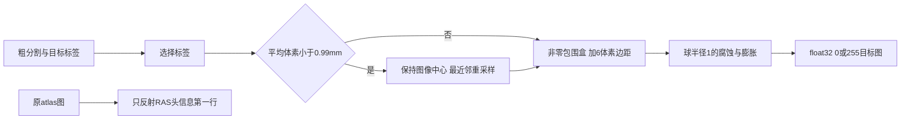
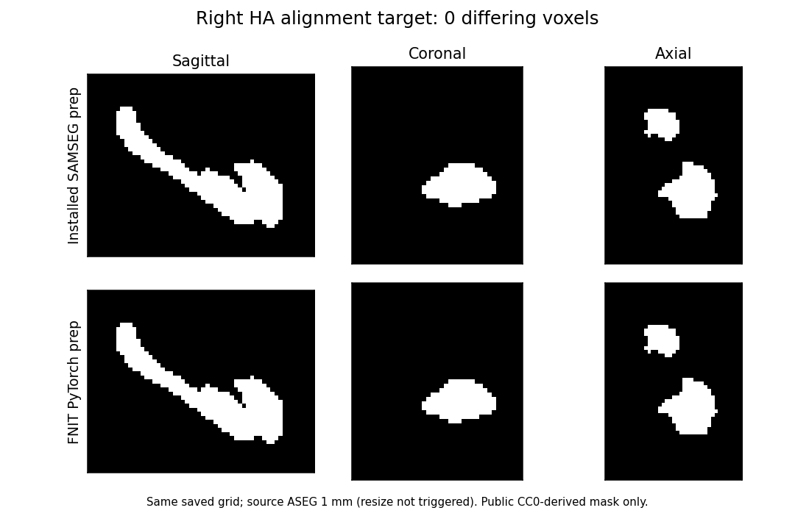

# Robust 配准前的目标掩膜和右侧 atlas 头信息

## 1. 功能简介

这是一个独立的前处理模块，用于匹配 FreeSurfer 8.2 SAMSEG 核团分割在 `mri_robust_register` 前准备的目标图像。生产模块提供目标准备和 atlas 头信息处理；完整刚体／仿射已有[独立 CPU 实验入口](../../validation/robust_register/full_cpu_arithmetic_20261007/README.md)，尚未接入 GEMS 默认 pipeline。当前默认 CPU/GPU 分割路径不变。



高分辨率输入的目标尺寸是 `ceil(原体素大小 × 原尺寸 / 目标体素大小)`，保留 `shape/2` 对应的世界中心。最近邻使用 float32 坐标，先检查 `[0, 原尺寸)`，再按半值向远取整，并处理最后半个体素。这个规则与通用 `grid_sample` 最近邻不同，故没有修改通用重采样函数。MGH 字段先转 float64 再构造几何，输出存储字段仍是 MGH 的 float32。

## 2. Python 调用、输入与输出

```python
from pathlib import Path
import nibabel as nib
from fnit.robust_register import (
    prepare_subregion_alignment_target,
    reflect_atlas_header,
)

coarse_segmentation_path = Path("subject/mri/aseg.mgz")  # 3D粗分割，值为整数标签
atlas_image_path = Path("external_atlas/AtlasDump.mgz")  # 原始左侧atlas图；模板由用户配置
output_directory = Path("alignment_preparation")
output_directory.mkdir(parents=True, exist_ok=True)

prepared_target = prepare_subregion_alignment_target(
    coarse_segmentation=coarse_segmentation_path,
    target_label_ids=(53, 54),       # 右侧海马和杏仁核；左侧用(17,18)
    target_voxel_mm=1.0,            # 高分辨率输入降至1mm
    bbox_margin_voxels=6,           # 以重采样后的体素为单位
    smoothing="backward",          # 先腐蚀，再膨胀
    device="cpu",                  # 本例CPU前处理门已过；CUDA尚未验收
    spatial_chunk_size=262144,      # 最近邻查询分块，限制坐标缓冲
    memory_budget_gb=20.0,          # 读入/工作缓冲的预检预算，单位十进制GB
)
nib.save(prepared_target.image, output_directory / "targetMask.mgz")
preparation_report = prepared_target.report  # 裁剪范围、dtype、计数、几何与分步耗时

right_atlas_image = reflect_atlas_header(atlas_image=atlas_image_path)
nib.save(right_atlas_image, output_directory / "flippedAtlasDump.mgz")
```

**输入**

| 参数 | 格式、默认值与含义 |
| --- | --- |
| `coarse_segmentation` | 单个 3D MGH/MGZ 或 NIfTI 路径，或 nibabel 图像。NIfTI 坐标应为 mm；未标单位按 mm 处理，其他空间单位明确拒绝。 |
| `target_label_ids` | 非空整数序列。选择这些标签形成布尔掩膜；没有选中体素时保留全图包围盒。 |
| `target_voxel_mm` | 正数，默认 `1.0`。只有原平均体素 `<0.99 mm` 时调用 resize；与原尺寸已相同则返回拷贝。 |
| `bbox_margin_voxels` | 非负整数或三元整数，默认 `6`，不越过图像边界。 |
| `smoothing` | `"backward"`：腐蚀再膨胀；`"forward"`：膨胀再腐蚀；`None`：跳过。腐蚀图外值为1，膨胀图外值为0。结构是半径1体素的球，包含中心和六个面邻居。 |
| `device` | 默认 `"cpu"`，也接受显式 CUDA 设备；CUDA 不可用时报错。没有静默回退，不修改 TF32、cuDNN 或 autocast 设置。 |
| `spatial_chunk_size` | 正整数，默认 `262144`。只改变查询缓冲，不改变结果。 |
| `memory_budget_gb` | 正数，默认 `20.0`。超过工作缓冲估计时在设备分配前报错；这不是整个 Python 进程 RSS 的硬限制。 |
| `atlas_image` | `reflect_atlas_header` 的 3D MGH/MGZ 或 mm NIfTI 路径/图像。应为原始 atlas；不要再次反射已经反射过的图。输出数据类型须可由 MGH 存储。 |

**输出**

- `AlignmentTargetPreparation.image`：nibabel `MGHImage`，空间为 RAS mm，体素为 float32 的0或255。`image.affine` 是计算几何；保存/重读采用 MGH float32 几何字段。
- `AlignmentTargetPreparation.report`：输入/输出尺寸和体素大小、标签ID、resize触发/实际执行、裁剪下界和不含上界、平滑方式、三种前景计数、实际设备/dtype、缓冲估计，以及读入选择、resize、裁剪、形态学和 API 墙钟。不包含影像或顶点数组。
- `reflect_atlas_header`：nibabel `MGHImage`；RAS 变换第一行乘以−1，体素值与顺序保持，保存后的 MGH 字段遵守其格式精度。不进行图像重采样。

标签选择和形态学在 PyTorch 上计算；形态学复用 FNIT 已有的布尔六邻域函数，通过补集实现图外为1的腐蚀。模板和权重沿用 FNIT 外置资产设置，模块不下载模型、不调用原软件，也不推断粗分割。

## 3. 命令行调用

本前处理阶段没有新增独立 CLI。使用上述 Python API。现有 `fnit subregions` 不调用该候选模块，完整 robust 注册入口尚未提供。

## 4. 原软件调用

这是 SAMSEG `MeshModel.align_atlas_to_seg` 内部准备步骤，没有单独的原软件命令。海马/杏仁核右侧在 `HippoAmygdalaSubfields.preprocess_images` 中先反射 atlas 头信息，然后在准备的0/255目标上执行：

```bash
mri_robust_register --mov alignedAtlasImage.mgz --dst targetMask.mgz \
  --lta rigid.lta --mapmovhdr alignedAtlasImage.mgz --sat 50 -verbose 0
mri_robust_register --mov alignedAtlasImage.mgz --dst targetMask.mgz \
  --lta affine.lta --mapmovhdr alignedAtlasImage.mgz --affine --sat 50 -verbose 0
```

上面两个注册命令尚未由本模块实现或在此次前处理测试中运行。`--mapmovhdr` 的头信息更新和 robust 优化器将单独移植、验收。

## 5. 精度、耗时与可视化

同一公开真实 T1 派生的 ASEG（1 mm，256³）上，原安装版 SAMSEG 前处理前缀与 FNIT 使用相同8物理核、输入和 atlas。目标标签53/54、6体素边距、先腐蚀后膨胀。**保存后的正式数据/几何门全部通过**：

| 输出 | shape | 前景体素（官方/FNIT） | 不同体素 | dtype、13个MGH字段、存储affine |
| --- | --- | ---: | ---: | --- |
| 目标掩膜 | 39×45×56 | 5835 / 5835 | 0 | 全部一致，affine最大差0 |
| 右侧atlas头信息反射 | 131×241×99 | 512815 / 512815 | 0 | 全部一致，affine最大差0 |

MGH比较包含几何与扫描字段；gzip压缩字节和可选MGH标签不作为数值门。该例没有触发高分辨率resize。它证明这一个前处理定义，不能代替rigid/affine或最终ROI验收。

| 持久化的时间记录 | 秒 | 范围 |
| --- | ---: | --- |
| 官方准备、保存、两次保存后重读 | 0.868449 | 含AST前缀编译；完整原报告 |
| FNIT两个API、不含保存 | 0.638673 | 原不完整报告中已完整写出的标量 |
| FNIT两个API加保存 | 0.662887 | 原不完整报告中已完整写出的标量 |
| FNIT内部各步骤时钟/RSS | NA | 序列化失败时尚未完整写出，未重做计时 |

双方计时范围不同且只有一对观察，不据此宣称稳定加速。原FNIT图像生成成功后，报告的NumPy裁剪整数不能JSON序列化，原进程exit1；首次只读评分随后也因MGH尺寸的NumPy整数exit1。这两次记录和原partial字节均保留。固定四个保存图像的SHA后，只读恢复标量得到完整正式评分：恢复exit0，等锁54.038秒、标量/头信息评分0.202秒、总54.505秒。**恢复时钟不属于前处理时间。** 没有重算官方或FNIT影像，也没有运行注册或GEMS。

后续修复只把report裁剪坐标/评分尺寸转为Python整数，并在报告原子发布前验证JSON。影像、几何计算的AST保持。35项不同模块合同来自原34项批次加1项新JSON合同；另有1项评分/原子发布合同和5项仅stub的进程边界合同，没有声称一次重跑35项或把小合同当MRI benchmark。完整来源和时间证据见[验证记录](../../validation/robust_register/target_preparation_20261006/README.md)。



| 尚未验收范围 | 状态 |
| --- | --- |
| 高分辨率resize安装版编译实现 | 仅源定义合同；本例不触发，尚未对真实高分辨率数据验收 |
| GPU真数据精度/速度 | 未执行；默认GPU链没有接线 |
| robust rigid/affine、最终ROI | 独立候选17/20原门通过；尚未接入本模块或最终ROI验收 |

此前一次GEMS CPU候选完整右侧recipe已完成但最终核团门未过，见[负结果与脑图](../../validation/smri_cpu/gems_native_cpu_rha_failure_20261006/README.md)。本模块不读取其细分结果或原配准矩阵来提高匹配。

## 6. 更新与 benchmark 记录

- 2026-10-06：独立目标准备/右侧头信息模块；没有修改生产 GEMS、默认 CPU/GPU 数学或通用重采样。34项合同通过。首批合同的一个预期值误写为标签值乘255，已更正为布尔选择乘255；代码结果未因该测试修订而改变。
- 2026-10-06真实对照：目标与反射atlas的数据/几何exact门通过；保留两次报告写出exit1，metadata-only修复及只读补录后得到完整评分，未重算前处理。源版本与SHA见验证记录。
- 后续独立候选已完成刚性/仿射对照，原门17/20通过；尚未接入GEMS。[局部Conda构建](../../validation/robust_register/prepared_m0_sdk_build_20261006/README.md)后，真实[准备态/M0对照](../../validation/robust_register/prepared_m0_capture_20261006/README.md)已完成：两幅准备图像与全部几何字段逐位同，Rsrc/Rtrg矩阵逐位同；质心最大差约2.20e−13，M0最大差4.12e−13。原生只捕获到初始化，完整Schur/QR求解尚未验收；下一步核质心求和与求解首差，再核最终ROI。
- 随后[CPU保序质心候选](../../validation/robust_register/centroid_serial_cpu_probe_20261006/README.md)先在保存的两幅准备图像上使6个Double返回值逐位相同。[完整初始化接入对照](../../validation/robust_register/centroid_m0_cpu_prefix_20261006/README.md)已沿同一真实输入重算准备态和M0：两幅图各107,055个Float32值、6个质心值、M0及Rsrc/Rtrg共54个Double值全部逐位同SDK参考。只覆盖该初始化边界，正式完整配准仍17/20；后续A/b、Schur/QR、最终ROI、未知输入和GPU仍待验收。
- 2026-10-07：[连续首轮 A/b 对照](../../validation/robust_register/first_ab_cpu_prefix_20261007/README.md)进一步通过18个记录边界：准备态、两层金字塔、半空间变换与图像、9196×6的A及9196项b均逐位同固定SDK参考。原生一次四阶Schur成功；尚未执行注册QR、IRLS或更新，完整17/20门保持。下一步从相同A/b核对鲁棒尺度、权重和求解，随后接入核团验证。冷子进程含身份检查和导入，不作为完整配准速度。
- 2026-10-07：[同A/b的完整IRLS对照](../../validation/robust_register/same_ab_irls_cpu_20261007/README.md)沿用已保存真实方程与原生输出：第一轮中心/MAD/尺度/归一化/权重/加权A/b逐位同，首差出现在QR的6个Float32参数，最大8.22544e−6。双方均4轮停止并回退到第3轮，但最终参数最大差3.29018e−5，2473项权重不同；相同权重输入的累计权重和另差0.027832。随后CPU Float LINPACK候选在相同保存加权A/b上使6个返回值全部逐位匹配，核函数0.595毫秒、首次类型编译0.919秒。候选尚未采用；残差、归约和完整配准仍待验证，正式17/20以及GEMS与GPU验收状态不变。

- 随后同一真实A/b的CPU三处修正已组合完成自然IRLS：4轮、选第3轮并回退，与SDK参考的40个逐轮记录和4个最终记录全部逐位一致；最终6个参数与9196个权重均无差异。分别修正Float LINPACK QR、按行残差计算和Float保序误差累计，原MAD、Tukey权重及停止条件保持。该阶段仅覆盖这一6列方程，当时完整刚性/仿射、未知输入和GPU仍待验收，保留此前实验17/20结果。

- 最新[完整CPU刚性/仿射候选](../../validation/robust_register/full_cpu_arithmetic_20261007/README.md)已在同一真实案例上通过原20项检查，较旧实验版本17/20改善为20/20。两阶段133点误差为0，13个保存MGH字段均一致，共享FNIT评分采样器的warp和非零支持集差均为0；两份增量LTA仍有约5e−14以内的Double尾差。首次评分沿用旧冻结评分器，遗漏了main已有的大端读取修复；复用该修复后只评分保存输出，没有重复配准或原软件。此结果仅验收一个CPU实验候选，生产模块仍只有前处理；核团、未知输入、GPU回归及同边界速度对照仍待完成。

- 已提供可复用的 CPU 实验适配器和独立 CLI。真实单例的首次调用、同实例缓存调用及新官方结果各通过原20项门，共60/60；先前两份 API 结果和新官方结果保存后，只补评分，没有重算配准。首次 pair API 为2.147秒，同实例缓存后0.790秒；本次官方两条CLI合计1.031秒。冷导入1.713秒、factory0.087秒另计，不把热API与冷CLI混称端到端提速。同实例缓存和关闭契约已验证，旧GPU模块、调用方线程与精度标志保持；GPU计算没有新增回归。核团接入、其它输入及同边界速度仍待验证。

## 7. 来源、许可与参考文献

- [FreeSurfer 源提交 d932c45](https://github.com/freesurfer/freesurfer/tree/d932c45b7941662ea380a05efef580568b98d41a)，安装版 8.2.0 build `freesurfer-linux-centos7_x86_64-8.2.0-20260314-d932c45`。相关 SAMSEG `subregions/core.py` 和 `hippocampus.py` 的安装版源 SHA 单独绑定；不复制整个原程序。改编工作流适用[FreeSurfer许可](../../licenses/FreeSurfer.txt)。
- [Surfa](https://github.com/freesurfer/surfa) 安装版0.6.3的 crop/resize/geometry 定义；[同版本源分发](https://pypi.org/project/surfa/0.6.3/) SHA `fbf687487bd7ea3a9fc924cd4bfc620960d6bf3e277d3680faf25e67bf6eca27`。安装版 bbox 与源分发有实现写法差异，依照现场安装版核对；源分发 `.pyx` 不等于已证明与安装 `.so` 二进制同源。改编几何/采样保留[Surfa MIT许可](../../licenses/surfa-MIT.txt)。FNIT 运行不导入 Surfa。
- Reuter M, Rosas HD, Fischl B. Highly accurate inverse consistent registration: a robust approach. *NeuroImage* (2010), [doi:10.1016/j.neuroimage.2010.07.020](https://doi.org/10.1016/j.neuroimage.2010.07.020)。
- Iglesias JE et al. A computational atlas of the hippocampal formation using ex vivo, ultra-high resolution MRI. *NeuroImage* (2015), [doi:10.1016/j.neuroimage.2015.04.042](https://doi.org/10.1016/j.neuroimage.2015.04.042)。
- Saygin ZM et al. High-resolution magnetic resonance imaging reveals nuclei of the human amygdala. *NeuroImage* (2017), [doi:10.1016/j.neuroimage.2017.04.046](https://doi.org/10.1016/j.neuroimage.2017.04.046)。
