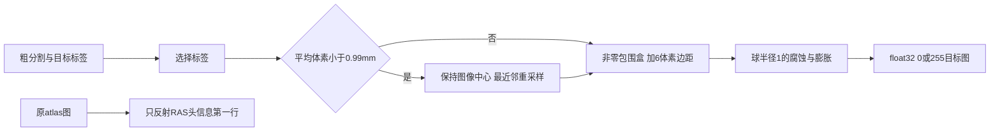

# Robust 配准前的目标掩膜和右侧 atlas 头信息

## 1. 功能简介

这是一个独立的前处理模块，用于匹配 FreeSurfer 8.2 SAMSEG 核团分割在 `mri_robust_register` 前准备的目标图像。它尚未接入 GEMS pipeline，也没有实现 rigid/affine 注册。当前默认 CPU/GPU 分割路径不变。



高分辨率输入的目标尺寸是 `ceil(原体素大小 × 原尺寸 / 目标体素大小)`，保留 `shape/2` 对应的世界中心。最近邻使用 float32 坐标，先检查 `[0, 原尺寸)`，再按半值向远取整，并处理最后半个体素。这个规则与通用 `grid_sample` 最近邻不同，故没有修改通用重采样函数。MGH 字段先转 float64 再构造几何，输出存储字段仍是 MGH 的 float32。

## 2. Python 调用、输入与输出

```python
from pathlib import Path
import nibabel as nib
from fnit.robust_register import (
    prepare_subregion_alignment_target,
    reflect_atlas_header,
)

coarse_segmentation_path = Path("subject/mri/aseg.mgz")  # 3D粗分割，值为整数标签
atlas_image_path = Path("external_atlas/AtlasDump.mgz")  # 原始左侧atlas图；模板由用户配置
output_directory = Path("alignment_preparation")
output_directory.mkdir(parents=True, exist_ok=True)

prepared_target = prepare_subregion_alignment_target(
    coarse_segmentation=coarse_segmentation_path,
    target_label_ids=(53, 54),       # 右侧海马和杏仁核；左侧用(17,18)
    target_voxel_mm=1.0,            # 高分辨率输入降至1mm
    bbox_margin_voxels=6,           # 以重采样后的体素为单位
    smoothing="backward",          # 先腐蚀，再膨胀
    device="cpu",                  # 独立阶段的设备；当前真实CPU门待执行
    spatial_chunk_size=262144,      # 最近邻查询分块，限制坐标缓冲
    memory_budget_gb=20.0,          # 读入/工作缓冲的预检预算，单位十进制GB
)
nib.save(prepared_target.image, output_directory / "targetMask.mgz")
preparation_report = prepared_target.report  # 裁剪范围、dtype、计数、几何与分步耗时

right_atlas_image = reflect_atlas_header(atlas_image=atlas_image_path)
nib.save(right_atlas_image, output_directory / "flippedAtlasDump.mgz")
```

**输入**

| 参数 | 格式、默认值与含义 |
| --- | --- |
| `coarse_segmentation` | 单个 3D MGH/MGZ 或 NIfTI 路径，或 nibabel 图像。NIfTI 坐标应为 mm；未标单位按 mm 处理，其他空间单位明确拒绝。 |
| `target_label_ids` | 非空整数序列。选择这些标签形成布尔掩膜；没有选中体素时保留全图包围盒。 |
| `target_voxel_mm` | 正数，默认 `1.0`。只有原平均体素 `<0.99 mm` 时调用 resize；与原尺寸已相同则返回拷贝。 |
| `bbox_margin_voxels` | 非负整数或三元整数，默认 `6`，不越过图像边界。 |
| `smoothing` | `"backward"`：腐蚀再膨胀；`"forward"`：膨胀再腐蚀；`None`：跳过。腐蚀图外值为1，膨胀图外值为0。结构是半径1体素的球，包含中心和六个面邻居。 |
| `device` | 默认 `"cpu"`，也接受显式 CUDA 设备；CUDA 不可用时报错。没有静默回退，不修改 TF32、cuDNN 或 autocast 设置。 |
| `spatial_chunk_size` | 正整数，默认 `262144`。只改变查询缓冲，不改变结果。 |
| `memory_budget_gb` | 正数，默认 `20.0`。超过工作缓冲估计时在设备分配前报错；这不是整个 Python 进程 RSS 的硬限制。 |
| `atlas_image` | `reflect_atlas_header` 的 3D MGH/MGZ 或 mm NIfTI 路径/图像。应为原始 atlas；不要再次反射已经反射过的图。输出数据类型须可由 MGH 存储。 |

**输出**

- `AlignmentTargetPreparation.image`：nibabel `MGHImage`，空间为 RAS mm，体素为 float32 的0或255。`image.affine` 是计算几何；保存/重读采用 MGH float32 几何字段。
- `AlignmentTargetPreparation.report`：输入/输出尺寸和体素大小、标签ID、resize触发/实际执行、裁剪下界和不含上界、平滑方式、三种前景计数、实际设备/dtype、缓冲估计，以及读入选择、resize、裁剪、形态学和 API 墙钟。不包含影像或顶点数组。
- `reflect_atlas_header`：nibabel `MGHImage`；RAS 变换第一行乘以−1，体素值与顺序保持，保存后的 MGH 字段遵守其格式精度。不进行图像重采样。

标签选择和形态学在 PyTorch 上计算；形态学复用 FNIT 已有的布尔六邻域函数，通过补集实现图外为1的腐蚀。模板和权重沿用 FNIT 外置资产设置，模块不下载模型、不调用原软件，也不推断粗分割。

## 3. 命令行调用

本前处理阶段没有新增独立 CLI。使用上述 Python API。现有 `fnit subregions` 不调用该候选模块，完整 robust 注册入口尚未提供。

## 4. 原软件调用

这是 SAMSEG `MeshModel.align_atlas_to_seg` 内部准备步骤，没有单独的原软件命令。海马/杏仁核右侧在 `HippoAmygdalaSubfields.preprocess_images` 中先反射 atlas 头信息，然后在准备的0/255目标上执行：

```bash
mri_robust_register --mov alignedAtlasImage.mgz --dst targetMask.mgz \
  --lta rigid.lta --mapmovhdr alignedAtlasImage.mgz --sat 50 -verbose 0
mri_robust_register --mov alignedAtlasImage.mgz --dst targetMask.mgz \
  --lta affine.lta --mapmovhdr alignedAtlasImage.mgz --affine --sat 50 -verbose 0
```

上面两个注册命令尚未由本模块实现或在此次前处理测试中运行。`--mapmovhdr` 的头信息更新和 robust 优化器将单独移植、验收。

## 5. 精度、耗时与可视化

当前34项局部合同通过，覆盖离散边界、半体素舍入、分块不变性、中心相位、MGH存储、形态学和反射。它们是接口/算法合同，不是模拟 MRI benchmark。

同一公开真实影像派生的 `aseg` 和原 atlas 已有固定 SHA。一次官方前处理与 FNIT 的独立 CPU 对照 worker 已准备，但**尚未运行**。目标门固定为0个不同掩膜体素、相同 shape、dtype、MGH 几何/扫描字段和反射后的 atlas 体素顺序；未通过前不进行 affine benchmark。此次不跑整例 GEMS。

| 范围 | 官方对照 | 状态 |
| --- | --- | --- |
| 同例目标掩膜、裁剪、头信息 | 原安装版 SAMSEG 准备前缀 + Surfa/SciPy | 待执行；没有精度/耗时数字 |
| 高分辨率 resize 的安装版编译实现 | 固定 Surfa 0.6.3 `.so` | 当前真实case不触发resize；仅源定义合同已测，不能称编译实现已验收 |
| GPU 真数据精度和速度 | 共享GPU同设备配对 | 未执行；默认GPU链没有接线 |
| robust rigid/affine、最终ROI | 同例官方注册/核团结果 | 未实现/未重跑 |

此前一次 GEMS CPU 候选完整右侧 recipe 已完成但最终核团门未过，见[负结果与脑图](../../validation/smri_cpu/gems_native_cpu_rha_failure_20261006/README.md)。该记录不能代替本模块的真实验收，模块也不读取其细分结果提高匹配。

## 6. 更新与 benchmark 记录

- 2026-10-06：独立目标准备/右侧头信息模块；没有修改生产 GEMS、默认 CPU/GPU 数学或通用重采样。34项合同通过。首批合同的一个预期值误写为标签值乘255，已更正为布尔选择乘255；代码结果未因该测试修订而改变。
- 下一阶段：一次受锁保护、相同8物理核的真实 target-prep 对照。未启动注册或第二次整体拟合。

## 7. 来源、许可与参考文献

- [FreeSurfer 源提交 d932c45](https://github.com/freesurfer/freesurfer/tree/d932c45b7941662ea380a05efef580568b98d41a)，安装版 8.2.0 build `freesurfer-linux-centos7_x86_64-8.2.0-20260314-d932c45`。相关 SAMSEG `subregions/core.py` 和 `hippocampus.py` 的安装版源 SHA 单独绑定；不复制整个原程序。改编工作流适用[FreeSurfer许可](../../licenses/FreeSurfer.txt)。
- [Surfa](https://github.com/freesurfer/surfa) 安装版0.6.3的 crop/resize/geometry 定义；[同版本源分发](https://pypi.org/project/surfa/0.6.3/) SHA `fbf687487bd7ea3a9fc924cd4bfc620960d6bf3e277d3680faf25e67bf6eca27`。安装版 bbox 与源分发有实现写法差异，依照现场安装版核对；源分发 `.pyx` 不等于已证明与安装 `.so` 二进制同源。改编几何/采样保留[Surfa MIT许可](../../licenses/surfa-MIT.txt)。FNIT 运行不导入 Surfa。
- Reuter M, Rosas HD, Fischl B. Highly accurate inverse consistent registration: a robust approach. *NeuroImage* (2010), [doi:10.1016/j.neuroimage.2010.07.020](https://doi.org/10.1016/j.neuroimage.2010.07.020)。
- Iglesias JE et al. A computational atlas of the hippocampal formation using ex vivo, ultra-high resolution MRI. *NeuroImage* (2015), [doi:10.1016/j.neuroimage.2015.04.042](https://doi.org/10.1016/j.neuroimage.2015.04.042)。
- Saygin ZM et al. High-resolution magnetic resonance imaging reveals nuclei of the human amygdala. *NeuroImage* (2017), [doi:10.1016/j.neuroimage.2017.04.046](https://doi.org/10.1016/j.neuroimage.2017.04.046)。
