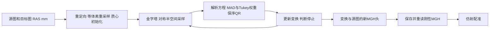

# CPU robust 刚性／仿射配准

## 1. 功能简介

`CPURegistration` 在 CPU 上完成对称 robust 刚性或仿射配准。它使用 PyTorch 处理图像和金字塔，使用 Numba 保留原版 Float QR、残差和误差累计的运算顺序，使用 Double 处理质心及小矩阵。运行不需要 FreeSurfer、Surfa 或系统影像程序，不需要模型权重；依赖均已包含在主页 Conda 环境中。

这是独立配准接口。GEMS 默认分割仍使用原有路径。已测的单例匹配范围为 `--sat 50` 的刚性6参数→仿射12参数；强度缩放、任意初始矩阵和随机抽样参数没有实现。更多输入和完整核团分割尚待验收。



## 2. Python 调用、输入与输出

```python
from pathlib import Path
from fnit.robust_register import load_cpu_registration

source_image_path = Path("atlas/AtlasDump.mgz")  # moving：非负3D源图
target_image_path = Path("alignment/targetMask.mgz")  # fixed：非负3D目标图
stage_directory = Path("robust_registration")  # 必须是尚不存在的目录

with load_cpu_registration() as registration:
    registration_result = registration.cpu_robust_rigid_affine(
        source=source_image_path,
        target=target_image_path,
        stage_directory=stage_directory,
        device="cpu",                 # 此入口只接受CPU
        saturation=50.0,              # Tukey权重阈值，与已测原命令相同
        iterations_per_level=5,        # 每层的配准更新上限
        stop_distance=0.01,            # 原版变换距离的停止阈值
        initialize_translation=True,   # 按质心差初始化
        pyramid_min_size=16,           # 最小金字塔尺寸
        pyramid_max_size=-1,           # 不限制初始金字塔尺寸
        highres_iterations=-1,         # 最高分辨率沿用每层迭代上限
        spatial_chunk_size=131072,     # 图像采样坐标分块
        memory_budget_gb=20.0,         # 十进制GB，保守缓冲预检
        tf32=True,                     # 保留通用参数，CPU不使用TF32
    )
    combined_RAS_matrix = registration_result["combined_RAS_matrix"]
    affine_report = registration_result["affine"].report

    # 若只需要单阶段，可在with内用下面调用替代两阶段调用。
    # single_result = registration.cpu_robust_register(
    #     source=source_image_path, target=target_image_path, mode="rigid")

# 上面的with结束后实例已关闭；再次调用会报错。需要时建立新实例。
```

同一实例可顺序处理多对影像；每一对使用不同的 `stage_directory`。`close()` 阻止后续调用，但不卸载进程内模块和 Numba JIT 缓存。新实例也可复用这些模块。实例锁只串行化该实例；多个实例首次 JIT 应由调用者串行安排。Python API 不修改调用者的线程数或 CUDA 精度标志。

### 输入与所有参数

| 参数 | 格式、默认值与含义 |
| --- | --- |
| `source` | 单帧3D MGH/MGZ、NIfTI 路径或 nibabel 图像。moving 输入；体素值有限、非负，各轴至少2。 |
| `target` | 与 `source` 格式相同的 fixed 输入；两图不必同网格。坐标为 scanner RAS mm。NIfTI 未标单位按mm处理，其它空间单位拒绝。 |
| 输入存储dtype | `uint8`、`int16`、`int32` 或 `float32`；读取后图像计算采用float32。需有效、有限、正体素大小及正交体素轴；非法几何、负强度或零质心质量明确报错。 |
| `mode` | 单阶段方法参数，默认 `"rigid"`；还支持 `"affine"`。两阶段方法固定先rigid再affine，不接受此参数。 |
| `stage_directory` | 两阶段方法必填的新目录；存在时拒绝，避免覆盖。包含阶段MGH和LTA。 |
| `device` | 默认 `"cpu"`，只接受CPU；CUDA请求在读图前报错。 |
| `saturation` | 默认 `50.0`，有限正数。控制Tukey权重；6/12列且50时使用已验证的CPU保序求解，其它值保留原PyTorch求解，尚未做官方效果验收。 |
| `iterations_per_level` | 默认 `5`，正整数，各金字塔层的更新上限。 |
| `stop_distance` | 默认 `0.01`，有限正数；使用原版变换距离定义，不能直接解释为所有点的最大mm误差。 |
| `initialize_translation` | 默认 `True`；质心差初始化。`False` 用图像头几何初始化。 |
| `pyramid_min_size` | 默认 `16`，正整数；重采样图最小轴尺寸不能更小。 |
| `pyramid_max_size` | 默认 `-1`，无限制；正整数可跳过更高分辨率层。 |
| `highres_iterations` | 默认 `-1`，沿用每层上限；`0` 跳过最高分辨率更新；正整数单独设置该层上限。 |
| `spatial_chunk_size` | 默认 `131072`，正整数；控制查询缓冲，不改变采样定义。 |
| `memory_budget_gb` | 默认 `20.0`，有限正数；按图像、金字塔和方程缓冲做保守预检，CPU预检上限32GB。这不是整个进程RSS的硬限制。 |
| `tf32` | 默认 `True`，布尔值；CPU不使用TF32，也不设置CUDA全局标志。 |

### 输出结构

单阶段返回 `RobustRegistrationResult`：

- `transform`：FNIT `AffineTransform`，4×4 Double、source→target 的 scanner RAS world 变换，附两侧网格几何。`transform.save("transform.lta")` 保存LTA。
- `header_image`：nibabel `MGHImage`。源体素未重采样，只按变换更新MGH头信息；它不是目标网格上的重采样图。保存后的MGH几何遵循Float字段精度。
- `report`：输入尺寸、参数、实际设备与dtype、内存估计、重定向、初始化/最终矩阵、各层步骤与IRLS停止、加载/准备/采样/构造/求解/API耗时。`experimental_native_equivalence="not_assessed"` 表示当前未知输入没有自动获得官方验收。

两阶段返回字典：`rigid`、`affine` 为上述对象；`combined_RAS_matrix` 为仿射增量×刚性增量；`header_image` 为最终仿射MGH；`seconds` 为两阶段API及保存/重读墙钟。目录中保存 `rigid.header.mgz`、`affine.header.mgz`、`rigid.lta`、`affine.lta`。方法不自动写报告，可由调用者JSON保存；CLI另写 `report.json`。

保序CPU helper不支持的张量沿原PyTorch表达式计算，不伪装为已验收结果。秩亏、所有行被Tukey剔除或不合法半空间平方根均明确失败，不加ridge、SVD或原软件回退。

## 3. 命令行调用

```bash
OMP_NUM_THREADS=8 MKL_NUM_THREADS=8 OPENBLAS_NUM_THREADS=8 \
fnit-robust-register \
  --source atlas/AtlasDump.mgz \
  --target alignment/targetMask.mgz \
  --output-directory robust_registration \
  --mode rigid-affine --saturation 50 --threads 8
```

也可使用 `python -m fnit.robust_register`。CLI为单被试；批量调用使用Python。参数与上表一致，使用连字符名称；`--no-initialize-translation` 对应 `False`。CLI没有 `device`/`tf32` 选项，固定CPU；`--threads` 只设置Torch intra-op，省略时保持原设置。BLAS/OpenMP预算通过运行前的环境变量设置。单阶段目录含 `transform.lta`、`mapped.header.mgz` 和 `report.json`；两阶段目录另含上述四阶段文件和 `report.json`。

## 4. 原软件调用

```bash
mri_robust_register --mov source.mgz --dst target.mgz \
  --lta rigid.lta --mapmovhdr rigid.header.mgz --sat 50 -verbose 0
mri_robust_register --mov rigid.header.mgz --dst target.mgz \
  --lta affine.lta --mapmovhdr affine.header.mgz --affine --sat 50 -verbose 0
```

官方比较使用FreeSurfer 8.2安装版。`--mapmovhdr`仅更新头信息。GEMS核团流程的掩膜和右侧atlas准备见[前处理说明](PREPARATION.md)。这些原软件命令只用于独立benchmark，不由FNIT接口执行。

## 5. 最新精度、耗时与脑图

正式wheel在已有Conda环境的独立目录安装后，已完成同一真实公开T1案例、同8物理核的刚性→保存重读→仿射对照。使用正常包内imports，沿用预先固定的20项门和既存官方输出；20/20通过。没有读取实验目录代码或在运行时改写AST。

| 同案例检查 | 最新结果 |
| --- | --- |
| 正式安装包首次API | 20/20；更多输入尚未验收 |
| 刚性和仿射阶段133点RMS/最大误差 | 均0 mm |
| 源→目标RAS变换和26个保存MGH字段 | 一致 |
| 共享FNIT评分采样器的warp/非零支持集 | 差0；不是独立官方warp实现验收 |
| 增量LTA文本的Double尾差 | 约5×10⁻¹⁴以内，单列报告 |

| 正式安装包时间范围 | 秒 |
| --- | ---: |
| 冷导入 | 1.594422 |
| 新建CPURegistration实例 | 0.000027 |
| 刚性API，包含本进程首次JIT | 1.829216 |
| 仿射API | 0.364360 |
| 两阶段API，包含阶段MGH保存/重读 | 2.253696 |
| 结果评分，另计 | 0.178845 |

这次没有重跑官方命令；同案例、同八核预算的既有官方两条冷CLI合计1.031014秒。启动范围不同，当前没有达到官方速度目标，也未测正式接口的热API或完整冷CLI。导入时间和验证用运行库检查均不计入上表两阶段API。准确的调用次数、输出检查和时间边界见[正式安装包实测](../../validation/robust_register/installed_cpu_api_20261007/README.md)。

接入前的独立适配器另完成冷／热／新官方三组各20/20：首次pair2.146999秒、热pair0.789533秒，冷导入1.713436秒与factory0.086839秒另计。它们属于旧实验入口，不能改标为正式安装包时间。详见[CPU算术与适配器记录](../../validation/robust_register/full_cpu_arithmetic_20261007/README.md)。旧评分器遗漏大端读取修复后，只补评分已保存结果，没有重复配准。

GEMS初始对齐桥同例另通过20/20、133点及20,100个Double网格点0误差，有序122,333个四面体不变。桥API2.905737秒，其中准备/保存0.738513、rigid/affine2.158899、坐标转换0.008169秒。它使用原最终MGH几何的源定义网格参考，尚不是安装版C++初始化trace，也没有验收完整GEMS拟合。原运行在输出保存后被未登记依赖库门阻断；完成现有Conda库来源核验后，只读取保存结果补评分和网格检查，未重做配准。


图展示同网格目标掩膜。完整wheel构建、独立安装和本例CPU接口实测均已完成；更多真实输入、完整分割、全新Conda环境及同启动边界速度仍待验证。既有GPU数学代码未改，本次没有新增GPU性能benchmark。

## 6. 最近版本与 benchmark

- 2026-10-06：前处理数据/几何逐位匹配；早期完整配准17/20，保留负结果。
- 2026-10-07：保序Double质心、Float LINPACK QR、逐行残差和Float误差累计修正；同真实A/b的自然4轮IRLS全部记录逐位同；完整刚性/仿射20/20。
- 2026-10-07：独立可复用适配器完成冷/热/新官方三组60/60；补评分沿保存输出，没有重复科学计算。
- 2026-10-07：正式源码提供正常import、`CPURegistration`和单被试CLI，不读取validation文件、不做UUID/运行时AST改写。8项API/失败合同与既有36项前处理合同合计44项通过；完整wheel构建及独立安装成功，正常包内API的真实对照20/20，调用方线程及CUDA精度标志保持。GEMS初始对齐桥补验通过，完整核团仍未过。

## 7. 参考文献、源码与许可

- [FreeSurfer d932c45](https://github.com/freesurfer/freesurfer/tree/d932c45b7941662ea380a05efef580568b98d41a)：`mri_robust_register`、MRI几何/采样、SAMSEG亚区流程；改编保留[FreeSurfer许可](../../licenses/FreeSurfer.txt)，不是官方FreeSurfer发行版。
- [VXL/VNL](https://github.com/vxl/vxl)：保序LINPACK Float QR与小矩阵规则，保留[VXL许可](../../licenses/VXL.txt)。
- [Surfa 0.6.3](https://pypi.org/project/surfa/0.6.3/)的前处理几何定义，保留[MIT许可](../../licenses/surfa-MIT.txt)；运行不导入Surfa。
- Reuter M, Rosas HD, Fischl B. Highly accurate inverse consistent registration: a robust approach. *NeuroImage* (2010). [DOI](https://doi.org/10.1016/j.neuroimage.2010.07.020)。
- Thévenaz P, Blu T, Unser M. Interpolation revisited. *IEEE Transactions on Medical Imaging* (2000). [DOI](https://doi.org/10.1109/42.875199)。
