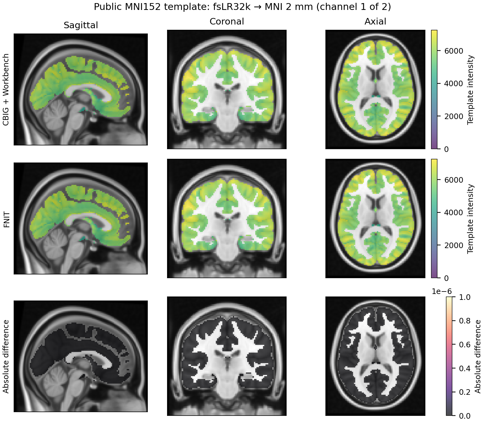

# MNI152、fsaverage与fsLR皮层图转换

| 项目 | 内容 |
|---|---|
| 输入 | 已在标准空间的NIfTI或双侧GIFTI及CBIG/HCP映射 |
| 输出 | 指定网格的皮层NIfTI或指定密度的双侧GIFTI |
| 对应原软件 | CBIG RegistrationFusion、Connectome Workbench |
| Python / CLI | convert_space / fnit-space-convert |
| CPU / GPU | 体积PyTorch/Numba；所有球面重采样用Workbench CPU |

## 1. 功能简介

`convert_space` 转换标准空间中的皮层标量图或整数标签图。MNI152 使用 NIfTI，fsaverage 和 fsLR 使用左右半球各一份 GIFTI。支持双半球单帧图和多帧图。

体积到 fsaverage 使用 Wu 等发布的 RF-ANTs 映射；fsaverage 与 fsLR 之间使用 HCP 2017 年修订的球面对应关系，并按两侧平均顶点面积运行 Workbench `ADAP_BARY_AREA`。fsaverage 回到体积时使用 CBIG 发布的 RF-ANTs 最近顶点映射与皮层掩膜。这个路径与官方映射的体素位置一致。体积转表面会压缩皮层深度，表面回体积只填充皮层掩膜；这些步骤不是数学上的可逆变换。

## 2. Python 调用

```python
from fnit import convert_space

mni_image_path = "/data/atlas_MNI152_1mm.nii.gz"  # 已配准到FSL MNI坐标的皮层图
conversion_assets_directory = "/data/fnit_space_assets"  # 已校验CBIG/HCP映射
surface_output_directory = "/data/out/fsLR32k"  # 左右GIFTI结果目录
left_surface_path, right_surface_path = convert_space(
    source=mni_image_path, source_space="MNI152", target_space="fsLR",
    target_density="32k", assets_dir=conversion_assets_directory,
    output_dir=surface_output_directory, device="cuda:0", label=False,
)
```

### 输入数据格式

- **MNI152 输入**：一个已经配准到 FSL MNI152 坐标的 NIfTI，形状为 `(X,Y,Z)` 或 `(X,Y,Z,T)`；使用文件仿射将映射坐标转换到该输入网格。
- **表面输入**：按 `(左, 右)` 排列的 GIFTI。每帧为一个一维数据数组，两侧帧数一致；连续值为 metric/shape，整数标签设 `label=True`。
- **支持密度**：fsaverage 的 `3k/10k/41k/164k` 分别为每侧 2,562/10,242/40,962/163,842 个顶点；fsLR 的 `32k/59k/164k` 分别为 32,492/59,292/163,842 个顶点。
- **表面输出**：返回两侧文件路径；每帧一个 GIFTI 数据数组，保留输入帧顺序。
- **体积输出**：返回一个 NIfTI 路径，形状为 `(*reference.shape[:3],T)`；单帧去掉最后一维。连续图存为 float32，标签图存为 int32，掩膜外为零，仿射和网格与参考图一致。
- **参考网格**：未指定时使用 CBIG 256³、1 mm 网格；指定时可接入下游所需的 2 mm、0.5 mm 等网格。更细的输出网格不会增加原映射的解剖细节；半体素边界的赋值规则见第 5 节。

| 输入空间 / 输出空间 | MNI152 | fsaverage | fsLR |
|---|---|---|---|
| MNI152 | 此函数不提供体积间重采样 | 3k/10k/41k/164k | 32k/59k/164k |
| fsaverage | 默认或指定参考网格 | 换密度；同密度直接复制 | 32k/59k/164k |
| fsLR | 默认或指定参考网格 | 3k/10k/41k/164k | 换密度；同密度直接复制 |

### 输入参数

| 参数 | 必需 | 类型 | 默认值 | 含义 |
|---|---|---|---|---|
| `source` | 是 | 路径 / 左右路径元组 | 无 | 原始FA参考图或待转换数据；各入口格式见下表。 |
| `source_space` | 是 | str | 无 | MNI152/fsaverage/fsLR。 |
| `target_space` | 是 | str | 无 | MNI152/fsaverage/fsLR，不能MNI152→MNI152。 |
| `output_dir` | 是 | 路径 | 无 | 本次调用的多文件输出目录。 |
| `assets_dir` | 是 | 路径 | 无 | 已校验HCP/CBIG映射目录。 |
| `source_density` | 否 | str / None | `None` | 源表面密度；MNI端为None。 |
| `target_density` | 否 | str / None | `None` | 目标表面密度；MNI端为None。 |
| `reference` | 否 | 路径 / NIfTI / None | `None` | 参考图；决定输出空间、shape、affine。 |
| `device` | 否 | str / torch.device / None | `'cpu'` | 计算设备；显式 CUDA 不可用时报错。 |
| `label` | 否 | bool | `False` | False连续值；True整数标签，使用最近邻。 |
| `wb_command` | 否 | str / 路径 | `'wb_command'` | Connectome Workbench命令或可执行文件路径。 |

### 输出

```text
fsLR32k/
├── L.fsLR.32k.func.gii
└── R.fsLR.32k.func.gii
# 目标MNI时：space-MNI152_cortex.nii.gz
```

NIfTI返回一个Path；GIFTI返回(L,R)路径元组。连续值float32、体积label=int32，单帧体积(X,Y,Z)，多帧(X,Y,Z,T)，网格/affine沿reference。表面每帧一个顶点数组，左右帧数和顶点密度匹配；MNI默认CBIG256³/1mm皮层掩膜，掩膜外0。表面空间由对应球面定义，不使用volume affine。label值不得超过float32精确整数范围2²⁴。

### 准备资源

```bash
fnit-setup-space-assets --output-dir /data/fnit_space_assets
```

目录含rf_ants/和hcp_2017/resample_fsaverage/。当前安装器从固定CBIG/HCP原站下载并校验SHA，未校验大小；许可与资源范围见第7节。体积输入须已在同一个FSL MNI模板坐标，函数不估计个体配准。

## 3. 命令行调用

```bash
fnit-space-convert \
  --volume /data/atlas_MNI152_1mm.nii.gz \
  --source-space MNI152 --target-space fsaverage --target-density 41k \
  --assets-dir /data/fnit_space_assets --output-dir /data/out/fsaverage41k \
  --device cpu

fnit-space-convert \
  --left /data/L.fsaverage.41k.func.gii --right /data/R.fsaverage.41k.func.gii \
  --source-space fsaverage --source-density 41k --target-space MNI152 \
  --reference /data/MNI152_ref_2mm.nii.gz \
  --assets-dir /data/fnit_space_assets --output-dir /data/out/mni2mm \
  --device cpu
```

纯 CPU 表面转换可显式设置总线程预算：

```bash
OMP_NUM_THREADS=8 fnit-space-convert \
  --left /data/L.fsaverage.41k.func.gii --right /data/R.fsaverage.41k.func.gii \
  --source-space fsaverage --source-density 41k --target-space fsLR --target-density 32k \
  --assets-dir /data/fnit_space_assets --output-dir /data/out/fsLR32k --device cpu
```

总预算为 1 时依次处理左、右半球；预算大于 1 时分给左右两个 Workbench 子进程，8 线程为 4+4。若调用进程已加载 PyTorch，同时遵循其较小的线程上限。未设置 `OMP_NUM_THREADS` 时沿用顺序调用及原环境。该并行分支仅用于两端都是表面的 `device="cpu"` 调用。

| CLI 参数 | Python 参数 | 含义 |
|---|---|---|
| `--volume / --left / --right` | `source` | NIfTI或(L,R)GIFTI |
| `--source-space / --target-space` | `source_space / target_space` | 空间名称 |
| `--source-density / --target-density` | `source_density / target_density` | 表面顶点密度 |
| `--reference` | `reference` | MNI目标网格 |
| `--assets-dir / --output-dir` | `assets_dir / output_dir` | 资源和输出目录 |
| `--device / --label` | `device / label` | 设备和整数标签 |

## 4. 原软件调用

CBIG 官方 MATLAB 正向投影使用 `CBIG_RF_projectMNI2fsaverage`，反向投影使用 `CBIG_RF_projectfsaverage2Vol_single`。示意命令如下；`lh_map`、`rh_map`、`reverse_map` 和 `mask` 均来自本功能安装的 CBIG 文件。

```matlab
[lh, rh] = CBIG_RF_projectMNI2fsaverage('/data/atlas_MNI152_1mm.nii.gz', 'linear', lh_map, rh_map);
[mni_cortex, mni_hemi] = CBIG_RF_projectfsaverage2Vol_single(lh, rh, 'nearest', reverse_map, mask);
```

HCP 2017 年的 fsaverage6 到 fsLR32k 左半球连续值命令为：

```bash
wb_command -metric-resample L.fsaverage6.func.gii \
  fsaverage6_std_sphere.L.41k_fsavg_L.surf.gii \
  fs_LR-deformed_to-fsaverage.L.sphere.32k_fs_LR.surf.gii \
  ADAP_BARY_AREA L.fsLR.32k.func.gii \
  -area-metrics fsaverage6.L.midthickness_va_avg.41k_fsavg_L.shape.gii \
                fs_LR.L.midthickness_va_avg.32k_fs_LR.shape.gii
```

右半球把 `L` 换为 `R`。反向交换源、目标球面及面积文件；标签图将 `-metric-resample` 换为 `-label-resample`。

## 5. 最新精度和运行时间

在 CPU评测节点 的 Intel Xeon Gold 6418H 上，使用同一组物理核和 1/8 线程上限串行交替运行官方与 FNIT。每例预热一次，再比较三次完整进程运行的中位数。参考版本为 CBIG 固定 tag `v0.18.1-Update_stable_project_unit_test`、MATLAB R2018b、FreeSurfer 7.1.1 的原始 MATLAB/网格依赖、Workbench 2.0.0；输入来自 FSL 6.0.7.22 的实际 MNI152 模板和 Harvard–Oxford 图谱、HCP 2017 年平均顶点面积图。

两通道由原始 T1 模板和同网格去脑外组织的 T1 模板组成，已逐值核对来源；不是两次独立扫描。0.5 mm 参考是官方 1 mm 模板经 Workbench 重采样得到的网格。全部输入和资源先后校验 SHA-256；本次只公开模板派生图及聚合指标。

### 完整进程配对

主表的 FNIT 列使用统一 benchmark worker，计入 Python 启动、Torch 预配置、函数首次导入及完整读写。原版列包含 MATLAB/Workbench 启动、原函数和格式桥接。该表对应不可变的 `candidate_all_v8`；最新源码另通过 21 个真实输入检查，输出与该冻结版逐值相同，并确认每次调用恢复 Numba 线程设置。

| 转换 | 官方 1 线程 | FNIT worker 1 线程 | 官方 8 线程 | FNIT worker 8 线程 | 精度 |
|---|---:|---:|---:|---:|---|
| MNI152 T1 2 mm → fsaverage164k | 8.625 s | 2.220 s | 5.000 s | 2.158 s | 连续图左/右 MAE 0.001212/0.000987 |
| HCP fsaverage164k 平均面积 → 默认 MNI | 36.909 s | 5.101 s | 34.414 s | 4.580 s | 双半球/整图逐值相同 |
| HCP fsaverage41k 平均面积 → fsLR32k | 2.431 s | 4.270 s | 1.086 s | 2.645 s | 双半球/整图逐值相同 |
| Harvard–Oxford 皮层标签 → fsLR32k | 14.912 s | 8.532 s | 10.519 s | 4.505 s | 双半球/整图逐值相同 |
| fsLR32k 两个真实模板通道 → MNI 2 mm | 75.594 s | 10.191 s | 57.236 s | 6.027 s | 双半球/整图逐值相同 |

正向连续图保持现有 float32 PyTorch 插值：左右最大绝对差为 0.017090/0.016113，relative L2 为 2.848×10⁻⁷/2.276×10⁻⁷。默认反向、2 mm 反向、标签及纯 Workbench 路径均逐值一致，体积仿射差为零，全部输出有限。8 线程是计算预算上限；原版 MEX k-d tree 等步骤仍主要使用一个核。MATLAB 启动和共享存储会影响完整进程时间，完整重复序列和实际 CPU 利用见[公开数值报告](../../validation/space_conversion/cpu_benchmark_20261004.public.json)。

### 分步骤 benchmark

| 转换 | FNIT worker 内 1/8 线程 | 原 CBIG 函数与 MAT 保存 1/8 线程 |
|---|---:|---:|
| MNI152 T1 2 mm → fsaverage164k | 0.405/0.455 s | 0.760/0.481 s |
| HCP fsaverage164k 平均面积 → 默认 MNI | 3.274/2.666 s | 26.340/21.698 s |
| HCP fsaverage41k 平均面积 → fsLR32k | 2.545/1.023 s | —（仅 Workbench） |
| Harvard–Oxford 皮层标签 → fsLR32k | 6.801/2.845 s | 0.667/0.820 s |
| fsLR32k 两个真实模板通道 → MNI 2 mm | 8.306/4.348 s | 52.005/44.141 s |

CPU数据绑定candidate_all_v8；本页当前源码SHA与candidate_all_v17/v28记录相同，完整检查见[来源清单](../../validation/multimodal_cpu_20261004/source_v28_20261004.public.json)。H100回归仅MNI↔fsaverage，TF32/FP32/20GB上限：正向peak6,232,576B，反向205,128,704B；旧/新版保存数组逐位相同。最新纯表面CPU CLI两侧并行：1线程2.731s仍慢于裸Workbench2.385s，8线程0.891/0.972s；[详细CPU报告](../../validation/space_conversion/cpu_benchmark_20261004.public.json)。

自定义0.5mm反向网格使用最近偶数舍入，与Workbench floor(voxel+0.5)有真实边界差异；没有宣称所有自定义网格逐位等价。

### 公开模板脑图



两通道均由公开 FSL 模板生成。本图展示第一个通道的三个切面；两套完整 `(91,109,91,2)` 输出逐值相同，仿射相同、全部有限，最大绝对差为零。差异行中的灰度为 T1 背景。可编辑矢量图见 [SVG](assets/public_space_comparison.svg)，绘图及输出 SHA-256 见[图像聚合报告](assets/public_space_comparison.json)和[绘图脚本](plot_public_comparison.py)。

## 6. 最近版本和 benchmark

| 日期 | 变更 | 验证 |
|---|---|---|
| 2026-10-04，本次 CLI 更新 | 纯 CPU 表面路径延迟加载 Torch/SciPy；在显式总预算下复用双半球并行 | 1/8 线程实际 CLI 预热+三次配对；双半球每次逐值一致；21 项真实输入输出门槛全部通过，Numba 设置恢复。1 线程 CLI 速度目标仍未达。 |
| 2026-10-04，CPU 融合版 | 回体积合并掩膜、顶点查表和赋值；修复整数参考图量化连续输出；添加原版 CBIG/Workbench 适配器 | 10 个主例预算组合和 20 个功能变体；默认与 2 mm 反向、标签、纯表面逐值相同；0.5 mm 扩展取整差异已完整定位。 |
| 2026-09-29 | RF-ANTs 正反向、HCP 面积校正、多密度 API | 当时的 WSL 实际模板/沟深图及内部计时保留于[历史验证记录](../../validation/space_conversion/README.md)。 |

## 7. 参考文献、原软件和资源

源码位置：[FNIT 公共接口与 CLI](../../src/fnit/space_conversion.py)、[CPU 数值实现](../../src/fnit/_space_conversion_cpu.py)。原 MATLAB 函数位于下列 CBIG `Wu2017_RegistrationFusion` 项目目录；表面转换使用 Workbench `-metric-resample/-label-resample`。

1. Wu J, et al. Accurate nonlinear mapping between MNI volumetric and FreeSurfer surface coordinate systems. *Human Brain Mapping* 39:3793–3808, 2018. [DOI](https://doi.org/10.1002/hbm.24213)；[CBIG RF-ANTs 原代码与映射](https://github.com/ThomasYeoLab/CBIG/tree/v0.18.1-Update_stable_project_unit_test/stable_projects/registration/Wu2017_RegistrationFusion)。
2. Coalson TS, Van Essen DC, Glasser MF. Resampling between FreeSurfer and HCP fsLR spaces, 2017. [HCP 官方操作说明](https://wiki.humanconnectome.org/docs/assets/Resampling-FreeSurfer-HCP_5_8.pdf)；[HCPpipelines 模板资产](https://github.com/Washington-University/HCPpipelines/tree/master/global/templates/standard_mesh_atlases/resample_fsaverage)。
3. Glasser MF, et al. The minimal preprocessing pipelines for the Human Connectome Project. *NeuroImage* 80:105–124, 2013. [DOI](https://doi.org/10.1016/j.neuroimage.2013.04.127)；[Connectome Workbench 原代码](https://github.com/Washington-University/workbench)。

| 资源 | 用途 | 官方来源 | 大小 | SHA-256 | 是否允许 FNIT 再分发 |
|---|---|---|---|---|---|
| CBIG RF-ANTs正反向映射和皮层mask（4文件） | MNI152↔fsaverage | [CBIG固定tag](https://github.com/ThomasYeoLab/CBIG/tree/v0.18.1-Update_stable_project_unit_test/stable_projects/registration/Wu2017_RegistrationFusion) | 安装器未记录 | [逐文件固定SHA](../../src/fnit/space_assets.py)；左正向3961b1e1f04621f8c1961ac8e4e5385813e47579214e0ccd5e62d685265205fd | 未取得映射文件级许可结论；从原站获取 |
| HCP2017球面和平均面积（34文件） | fsaverage↔fsLR/密度转换 | [固定HCP文件](https://github.com/Washington-University/HCPpipelines/tree/f8cac6892f88bdf889d644711ff038198eb81533/global/templates/standard_mesh_atlases) | 其中6文件见[资源清单](../RESOURCE_MANIFEST.md)；其余未记录 | [逐文件固定SHA](../../src/fnit/space_assets.py) | HCP许可按条款允许；本安装器当前走原站 |

本页安装器校验全部固定 SHA-256，目前不逐文件核验大小；上表有大小的 6 项与公开 Release 清单按内容 SHA 匹配。

[完整历史说明与调试证据](../../validation/space_conversion/readme_archive_20261005.md) · [返回主页](../../README.md)

<!-- 旧版文档锚点兼容 -->
<a id="1-安装和模板文件"></a> <a id="2-python-调用输入和输出"></a> <a id="输入和输出结构"></a> <a id="3-命令行调用"></a> <a id="4-原软件调用"></a> <a id="5-最新官方对照耗时和脑图2026-10-04"></a> <a id="完整进程配对"></a> <a id="本次优化后的实际表面-cli"></a> <a id="当前源码的-h100-检查"></a> <a id="内部调用和分步骤时间"></a> <a id="其余-20-个功能变体"></a> <a id="自定义-05-mm-网格的取整合同"></a> <a id="公开模板脑图"></a> <a id="功能范围和复现"></a> <a id="6-最近更新和-benchmark-记录"></a> <a id="7-参考文献和原实现代码库"></a>
