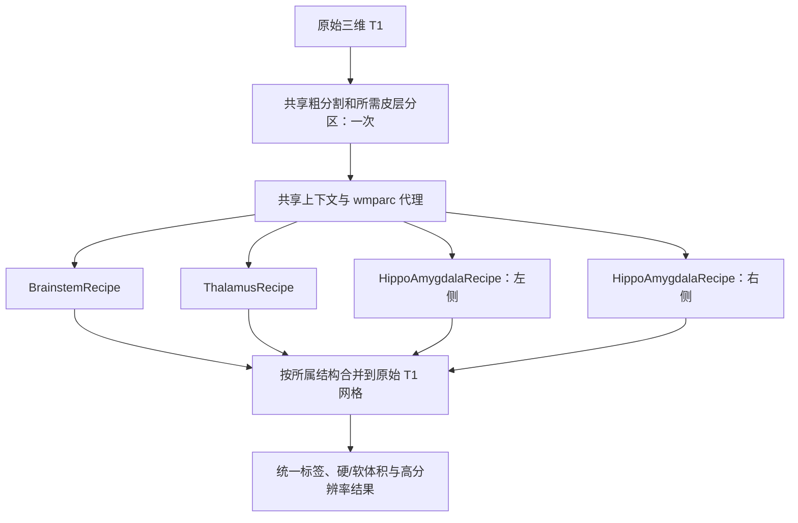

# 统一脑亚区分割：`segment_subregions`

[返回首页](../../README.md) · [统一真实数据验证](../../validation/subregions/unified.md) · [旧核团验证接口](nuclei.md)

输入一张三维 T1，输出与该 T1 **形状及 affine 相同**的 `int32` NIfTI：脑干四亚区、双侧丘脑核团、双侧海马亚区和杏仁核核团。默认使用 FNIT 图谱缓存；缺少图谱时按固定大小和 SHA-256 下载并准备。粗结构标签由 SynthSeg 生成；需要海马时由现有 SynthSeg+ 生成 Desikan–Killiany（DK）68 区皮层分区，再将颞叶皮层标签限制在同侧白质内传播，得到海马强度模型使用的 `wmparc` 代理。已有 `aseg`、皮层分区或 `wmparc` 可作为同网格输入。运行时不调用 FreeSurfer、FSL 或 C++/ITK legacy 核团接口。

首次运行缺少 SynthSeg 权重时，从 FNIT 固定 Release 或原作者地址下载并校验大小、SHA-256；用户也可以先运行 `fnit-setup-weights --model synthseg-plus`。在无网络服务器上，先准备权重和图谱缓存。



各结构共用一次粗分割。脑干沿用既有 TorchGEMS 配置；丘脑先以合成粗标签拟合网格，再在 0.5 mm T1 工作图像上拟合，强度阶段分为内侧偏暗和外侧偏亮两组；左右海马/杏仁核分别在约 0.333 mm 工作网格上拟合，并对 alveus、fissure 及高分辨率 T1 下单独成组的 molecular layer 用图谱先验、组织强度和模糊核模拟部分容积。工作网格标签和后验保存在 `structure_results`，主标签以最近邻重采样回原 T1 网格。跨图谱合并先按所属粗结构掩膜限定候选，仅在支持掩膜重叠处比较后验置信度。

丘脑和海马的合成标签阶段最多执行 300、150 次 L-BFGS 网格更新。图像阶段的日程是外层 EM/网格交替轮数：丘脑为 7、5、5、3，海马为 7、5、3；每轮 EM 最多 100 次、网格更新最多 30 次，按成本变化收敛，网格停止移动时结束迭代。滑动边界随图谱仿射投影到工作网格。默认 CUDA 使用 FP32 和 TF32；每项结构完成后将详细结果移到 CPU，释放显存，再拟合下一项。

丘脑和海马强度拟合只在有效体素上计算 EM 先验和网格数据成本，缓存固定参考网格的逆矩阵和体积，合并点批次及插值。CUDA FP32 使用主页环境已有的 Triton 四面体查找，梯度继续由 PyTorch 计算；CPU 或不支持该 kernel 的输入使用 PyTorch 查找。最终解剖先验和后验仍按完整工作网格输出，分辨率与拟合日程保持原配置。

图谱加载、裁剪、三次插值、图谱平滑中的 Gaussian 卷积、形态学处理、白质标签传播、海马部分容积超参数准备和最终 Nibabel 重采样仍在 CPU 上执行。SynthSeg、SynthSeg+、仿射优化、网格先验栅格化、Gaussian EM 和形变优化使用指定设备。运行时间包含这些 CPU 步骤；安装环境所需依赖已列在主页 Conda 环境中。

## 准备图谱

```bash
# --output-root：图谱根目录；省略时写入 FNIT 默认缓存
# --asset-dir：已配置的官方数据缓存，可省略
# --device：先验平滑所用 CPU/GPU
fnit-setup-subregion-atlases --output-root /absolute/path/subregion_atlases \
  --asset-dir /absolute/path/verified_assets --device cpu
```

该命令准备 `brainstem/`、`thalamus/`、`hippo-amygdala-left/`、`hippo-amygdala-right/`。HippoSF 左右侧的大文件优先用硬链接共享。`AtlasMesh.gz`、`AtlasDump.mgz` 和 `compressionLookupTable.txt` 均按 [固定资产清单](../../src/fnit/recon_all/assets.py)核对字节数及 SHA-256；下载使用 `.part` 后原子替换。`config.json` 记录图谱家族和迭代日程。脑干继续使用预先保存的平滑 alpha；丘脑、海马在每个被试变换后的参考网格上平滑，避免原图谱坐标缓存改变平滑宽度。安装器清理这两类图谱此前生成的 `seg-sigma*.npy` 和 `image-sigma*.npy`。未明确许可再分发的资源仍由原站下载。

## Python 输入和输出

```python
import nibabel as nib
from fnit import segment_subregions

result = segment_subregions(
    t1="/absolute/path/sub-01_T1w.nii.gz",       # 输入：原始三维 T1
    atlas_root=None,                              # 输入：图谱缓存；None 使用 FNIT 默认缓存
    structures="all",                            # 输入：全部四项；也可选单项或列表
    coarse_segmentation=None,                    # 输入：可选的同网格粗结构标签
    cortical_parcellation=None,                  # 输入：可选的同网格 DK 68 区皮层标签
    wmparc=None,                                 # 输入：可选的同网格 wmparc；提供时直接使用
    synthseg_weights=None,                       # 输入：可选的 SynthSeg 权重路径
    synthseg_parc_weights=None,                  # 输入：可选的 SynthSeg+ 皮层权重路径
    device="cuda:0",                             # 输入：计算设备；也支持 "cpu"
)
nib.save(result.labels, "/absolute/path/sub-01_subregions.nii.gz")  # 输出：原 T1 网格 int32 标签
pons_mask = result.mask("Pons")                 # 输出：与 T1 同形状的布尔掩膜
ca1_mask = result.mask("Left-CA1-head")         # 输出：左侧 CA1 头部掩膜
```

| 参数 | 含义 |
|---|---|
| `t1` | 原始 T1 路径或 Nibabel 三维图像。 |
| `atlas_root` | 统一图谱根目录；`None` 使用 FNIT 缓存并在缺失时准备。 |
| `structures` | `"all"`、`"brainstem"`、`"thalamus"`、`"hippo-amygdala"` 或这些名称的列表。海马别名展开左右侧。 |
| `coarse_segmentation` | 同 T1 网格的 `aseg`/SynthSeg 标签；省略时只运行一次 FNIT SynthSeg 或 SynthSeg+。 |
| `cortical_parcellation` | 同 T1 网格的皮层标签；白质代理需要左侧 1006、1007、1016 和右侧 2006、2007、2016 编码。默认 SynthSeg+ 提供 DK 68 区分区。 |
| `wmparc` | 同 T1 网格的官方白质分区；若提供，海马强度模型直接使用。 |
| `synthseg_weights`、`synthseg_parc_weights` | 对应模型权重文件或缓存；需要自动分割时才读取。 |
| `device` | `"cuda:0"` 默认，或 `"cpu"`；CUDA 使用 FP32 和 TF32。 |
| `auto_initialize` | 旧自定义 atlas pack 的仿射初始化开关；标准 recipe 自动配准。 |
| `em_iterations`、`deform_iterations` | 旧自定义 atlas pack 的默认迭代数；标准 recipe 固定日程。 |

`result.labels` 为原 T1 网格的合并标签。`result.label_table` 保持 `{ID: 名称}` 兼容形式，`result.label_metadata` 增加所属结构、图谱家族和半球；右侧 HippoSF 标签用原 ID 加 10000 避免与左侧碰撞。`result.volumes[ID]` 同时给出原网格硬体积与工作网格后验积分软体积（mm³）。`result.confidence` 为原网格已选标签的后验置信度；`result.initialization` 包含各结构配准、裁剪、耗时和 GPU 峰值。`result.structure_results[名称]` 保存高分辨率标签、后验、网格和工作网格 affine。

## 命令行

```bash
# --i：原始 T1；--o：原网格合并标签；--structure：可重复指定结构
# --output-dir：标签表、体积表和报告；--save-highres：工作网格标签及后验
fnit subregions --i /absolute/path/sub-01_T1w.nii.gz \
  --o /absolute/path/sub-01_subregions.nii.gz \
  --structure all --device cuda:0 \
  --output-dir /absolute/path/subregions --save-highres
```

`--coarse-segmentation`、`--cortical-parcellation`、`--wmparc`、`--atlas-root`、`--synthseg-weights`、`--synthseg-parc-weights` 和 `--report-json` 对应 Python 参数。输出目录含 `subregions_native.nii.gz`、`labels.tsv`、`volumes.tsv`、`report.json` 和可选 `highres/`。工作网格后验 NIfTI 的最后一维是图谱原始标签顺序；顺序可从相应图谱 `compressionLookupTable.txt` 读取。

## 官方对照与参考文献

官方命令需预先完成 `recon-all`，读取 subject 的 `norm.mgz`、`aseg.mgz` 和海马所需的 `wmparc.mgz`。严格阶段对照需将**同一组三个文件**传给 FNIT；原始 T1 全流程属于另一项独立验证。

```bash
segment_subregions brainstem --cross fs_sub01 --sd /absolute/path/subjects --threads 4
segment_subregions thalamus --cross fs_sub01 --sd /absolute/path/subjects --threads 4
segment_subregions hippo-amygdala --cross fs_sub01 --sd /absolute/path/subjects --threads 4
```

脑干历史结果见[逐区验证](../../validation/subregions/README.md)。[优化后的两个完整真实 T1 运行](../../validation/subregions/unified.md#2026-10-01优化后的两个完整运行)已完成：共享 H100 上，同阶段输入由 277.63 min 降至 45.02 min，原始 T1 全流程由 248.68 min 降至 41.33 min。阶段输入仍有脑干 4/4 区达标，全部亚区为 26/103 区达标；原始 T1 为 0/104。丘脑指标改善，同阶段输入的左海马、左杏仁核指标下降，尚未达到官方逐区精度目标。报告保留全部 110 项软体积、失败标签、显存和负载记录，以及六张轴位脑图。

### Reference

- 脑干：[Iglesias 等，2015，*NeuroImage*](https://doi.org/10.1016/j.neuroimage.2015.02.065)。
- 丘脑：[Iglesias 等，2018，*NeuroImage*](https://pmc.ncbi.nlm.nih.gov/articles/PMC6215335/)。
- 海马：[Iglesias 等，2015，*NeuroImage*](https://doi.org/10.1016/j.neuroimage.2015.04.042)。
- 杏仁核：[Saygin 等，2017，*NeuroImage*](https://doi.org/10.1016/j.neuroimage.2017.04.046)。
- 粗分割：[Billot 等，2023，*Medical Image Analysis*](https://doi.org/10.1016/j.media.2023.102789)。
- 皮层分区：[Billot 等，2023，*PNAS*](https://doi.org/10.1073/pnas.2216399120)。
- [FreeSurfer 原实现](https://github.com/freesurfer/freesurfer/tree/dev/attic/python/gems/subregions)及[官方使用说明](https://surfer.nmr.mgh.harvard.edu/fswiki/SubregionSegmentation)。
- [GEMS 滑动边界与形变先验实现](https://github.com/freesurfer/freesurfer/blob/dev/attic/gems/kvlAtlasMeshPositionCostAndGradientCalculator.cxx)。
