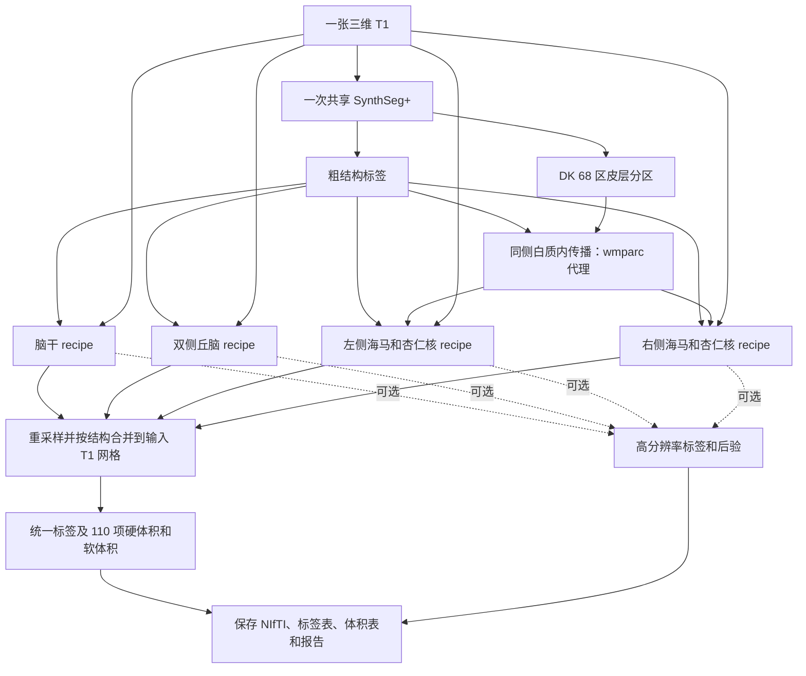

# 四类脑亚区分割：`segment_4_subregions`

[返回首页](../../README.md) · [真实数据验证](../../validation/subregions/README.md) · [完整 benchmark](../../validation/subregions/segment_4_subregions/README.md)

输入一张三维 T1，一次完成脑干、双侧丘脑、双侧海马和杏仁核分割。返回与输入 T1 **形状和 affine 相同**的 `int32` 标签图，以及标签表、硬体积、软体积和各结构的高分辨率结果；设置 `output_dir` 后自动保存。默认全部结构共有 **110 项亚区统计**，其中某些小亚区在原始 T1 网格上可能没有硬标签体素。

支持 CPU 和 GPU。CUDA 默认使用 FP32/TF32，计算与读写分别使用项目的 PyTorch 实现和 Nibabel，运行时不调用 FreeSurfer 或 FSL。

## 从一张 T1 到完整结果

默认 `structures="all"` 时，共享一次 SynthSeg+，取得粗结构标签和 Desikan–Killiany（DK）68 区皮层分区。将邻近的颞叶皮层标签限定在同侧白质内传播，生成海马强度模型需要的 `wmparc` 代理。随后依次拟合脑干、丘脑、左侧海马/杏仁核和右侧海马/杏仁核；每项完成后将详细结果移到 CPU，再处理下一项。



丘脑在 0.5 mm、海马/杏仁核在约 0.333 mm 工作网格上拟合。合并前先限制各图谱所属的粗结构范围，仅在支持区域重叠时比较后验置信度；主标签以最近邻重采样回输入 T1 网格。图中四个 recipe 表示数据流，实际依次运行。

已有同网格的粗标签、皮层分区或 `wmparc` 可直接传入，减少自动预处理。只选脑干或丘脑且未提供粗标签时，使用一次 SynthSeg；提供全部所需标签后不再运行模型。

## Python 示例

```python
from fnit import segment_4_subregions

subregion_result = segment_4_subregions(
    t1="/absolute/path/sub-01_T1w.nii.gz",       # 输入：一张原始三维 T1
    atlas_root=None,                            # 输入：None 使用 FNIT 图谱缓存
    structures="all",                          # 输入：默认全部结构，也可选择单项或列表
    coarse_segmentation=None,                  # 输入：可选的同网格粗结构标签
    cortical_parcellation=None,                # 输入：可选的同网格 DK 68 区皮层标签
    wmparc=None,                               # 输入：可选的同网格白质分区，提供时直接使用
    synthseg_weights=None,                     # 输入：可选的 SynthSeg 权重文件或目录
    synthseg_parc_weights=None,                # 输入：可选的 SynthSeg+ 皮层权重文件或目录
    device="cuda:0",                           # 输入：GPU 设备；也支持 "cpu"
    threads=4,                                 # 输入：PyTorch CPU 线程数
    optimization="fast",                       # 输入：速度优先配置；另一选项为 "balanced"
    output_dir="/absolute/path/sub-01_subregions",  # 输出：标签、体积表和报告目录
    save_highres=True,                         # 输出：保存各结构工作网格的标签
    save_posteriors=False,                     # 输出：后验图较大，按需设为 True
)

native_label_path = subregion_result.output_files["labels"]  # 输出：原 T1 网格标签路径
pons_mask = subregion_result.mask("Pons")                    # 输出：与 T1 同形状的脑桥布尔掩膜
left_ca1_head_mask = subregion_result.mask("Left-CA1-head")  # 输出：左侧 CA1 头部掩膜
print(native_label_path)
```

### 参数

| 参数 | 默认值 | 含义 |
|---|---|---|
| `t1` | 必填 | 原始三维 T1 路径或 Nibabel 图像。无需预先执行 `recon-all`。 |
| `atlas_root` | `None` | 图谱根目录。省略时使用 FNIT 缓存，缺失时按资源清单下载并准备。 |
| `structures` | `"all"` | 可选 `"brainstem"`、`"thalamus"`、`"hippo-amygdala-left"`、`"hippo-amygdala-right"`，或这些名称的列表；`"hippo-amygdala"` 同时选择左右两侧。默认运行全部四项。 |
| `coarse_segmentation` | `None` | 同 T1 网格的 `aseg` 或 SynthSeg 粗标签；可为路径、Nibabel 图像或三维数组。省略时自动生成。 |
| `cortical_parcellation` | `None` | 同 T1 网格的 DK 皮层标签，支持路径、Nibabel 图像或三维数组。白质代理使用左侧 1006、1007、1016 和右侧 2006、2007、2016 编码；省略且需要代理时由 SynthSeg+ 生成。 |
| `wmparc` | `None` | 同 T1 网格的白质分区，支持路径、Nibabel 图像或三维数组。提供时海马强度模型直接使用，不再生成白质代理。 |
| `synthseg_weights` | `None` | SynthSeg 模型权重文件或目录。省略时解析 FNIT 权重配置，并在需要时下载和校验。 |
| `synthseg_parc_weights` | `None` | SynthSeg+ 皮层分区权重文件或目录；仅在需要自动皮层分区时读取。 |
| `device` | `"cuda:0"` | PyTorch 计算设备，例如 `"cuda:1"` 或 `"cpu"`。CUDA 默认启用 TF32。 |
| `threads` | `4` | PyTorch CPU 线程数，必须至少为 1；GPU 运行中的 CPU 准备步骤也使用此设置。 |
| `optimization` | `"fast"` | `"fast"` 速度优先；`"balanced"` 使用更多网格更新和更严格的停止阈值。两者均保留工作网格和最终输出分辨率，详见下文。 |
| `output_dir` | `None` | 自动保存目录。省略时返回内存结果，也可稍后调用 `subregion_result.save(output_dir)`。 |
| `save_highres` | `True` | 保存每项结构的工作网格标签；仅在保存结果时生效。 |
| `save_posteriors` | `False` | 保存每项结构的后验 NIfTI；最后一维为标签通道，仅在保存结果时生效。 |

传入的标签图必须与 T1 形状和 affine 一致；数组没有 affine 信息，需由调用者确保来自相同网格。仅选部分结构时，只返回对应亚区的统计。

### 返回值与保存文件

`subregion_result.labels` 是原 T1 网格的 Nibabel 标签图。`label_table` 为 `{标签 ID: 名称}`；`label_metadata` 增加所属结构、图谱家族和半球。右侧海马/杏仁核标签采用原 ID 加 10000，避免左右冲突。

`subregion_result.volumes[标签 ID]` 包含 `hard_volume_mm3`（原 T1 网格硬标签体积）和 `soft_volume_mm3`（工作网格后验积分），单位均为 mm³。`confidence` 为原网格所选标签的后验置信度，`structure_results` 保存各结构的高分辨率标签、后验、网格及 affine。`initialization` 记录共享预处理来源、模型调用次数、结构拟合、耗时和 GPU 峰值。

设置 `output_dir` 后生成：

```text
sub-01_subregions/
├── subregions_native.nii.gz       # 原 T1 网格 int32 合并标签
├── labels.tsv                    # 标签 ID、名称、所属结构、半球和来源
├── volumes.tsv                   # 每项亚区的硬体积和软体积
├── report.json                   # 输入、几何、参数、耗时、显存和数值检查
└── highres/                      # 可选：四项工作网格标签和后验
    ├── brainstem.nii.gz
    ├── thalamus.nii.gz
    ├── hippo-amygdala-left.nii.gz
    └── hippo-amygdala-right.nii.gz
```

`save_posteriors=True` 时，`highres/` 另存各结构的 `*_posterior.nii.gz`，通道顺序对应该图谱的 `compressionLookupTable.txt`。`output_files` 给出所有已保存文件的绝对路径。`timings["compute_seconds"]` 包括预处理、拟合和合并；`timings["save_seconds"]` 包括影像和表格读写，报告 JSON 的最终序列化和落盘不计入此项。

## CPU、GPU 与速度配置

| 配置 | `fast`（默认） | `balanced` |
|---|---|---|
| 每轮网格更新上限 | 20 | 30 |
| 丘脑网格数据项 | 非零平滑阶段使用四分之一加权空间采样，最后阶段使用全部有效体素 | 各阶段使用全部有效体素 |
| 海马/杏仁核网格数据项 | 各阶段使用全部有效体素 | 各阶段使用全部有效体素 |
| Gaussian EM 与最终标签、后验 | 完整工作网格 | 完整工作网格 |
| 停止条件 | 速度优先 | 更严格 |

图谱先验平滑、部分容积模拟、Gaussian EM 和网格拟合支持 GPU，默认环境已包含所需依赖。图谱加载、裁剪、三次插值、部分形态学、白质标签传播和最终 Nibabel 重采样仍在 CPU；阶段控制和线搜索也包含 CPU 判断及 GPU 同步。整例时间包含这些步骤。实现与逐组件耗时见 [TorchGEMS](../../src/fnit/gems/core.py)及 [GPU 组件验证](../../validation/subregions/speed_v16/layout_components/README.md)。

海马部分容积准备修复了 NumPy 组织均值直接赋给 PyTorch 掩膜张量的兼容问题，均值与统计规则保留；测试覆盖薄结构分支。

## 图谱与权重准备

首次缺少 SynthSeg 权重或图谱时自动准备。资源优先从 [FNIT 固定 Release](https://github.com/weikanggong1/Fudan-Neuroimaging-toolkit/releases/tag/assets-v1)及其清单获取并校验大小、SHA-256；未获明确再分发许可的文件从原作者网站获取。离线运行前可执行：

```bash
# --model：下载并校验自动粗分割和皮层分区所需权重
fnit-setup-weights --model synthseg-plus

# --output-root：保存四类图谱的根目录；省略时使用 FNIT 缓存
# --device：图谱准备计算设备；--asset-dir 可另指定已经校验的资产目录
fnit-setup-subregion-atlases --output-root /absolute/path/subregion_atlases --device cpu
```

图谱目录为 `brainstem/`、`thalamus/`、`hippo-amygdala-left/` 和 `hippo-amygdala-right/`。原始图谱文件及校验值见 [资源清单](../../src/fnit/recon_all/assets.py)，模型下载与离线配置见 [权重说明](../WEIGHTS.md)。丘脑和海马先验在个体仿射变换后的参考网格上平滑。

## 命令行

```bash
# --i：原始 T1；--o：原网格合并标签；--structure：结构，可重复指定
# --device：CPU/GPU；--threads：CPU 线程数；--optimization：fast 或 balanced
# --output-dir：标签表、体积表和报告目录；--save-highres：保存工作网格标签
fnit segment-4-subregions --i /absolute/path/sub-01_T1w.nii.gz \
  --o /absolute/path/sub-01_subregions/subregions_native.nii.gz \
  --structure all --device cuda:0 --threads 4 --optimization fast \
  --output-dir /absolute/path/sub-01_subregions --save-highres
```

`--atlas-root`、`--coarse-segmentation`、`--cortical-parcellation`、`--wmparc`、`--synthseg-weights` 和 `--synthseg-parc-weights` 对应 Python 参数。`--save-posteriors` 另存工作网格后验，`--report-json` 可再指定报告路径。仅需原网格标签时可省略输出目录和保存开关。

## 真实数据 benchmark

2026-10-01，新入口在一例公开去面部 T1 上完成两次完整运行：共享 H100、4 个 CPU 线程、FP32/TF32、默认 `fast`，全部四项结构及 110 项硬/软体积。输入和源码均记录 SHA-256，详细结果及六层轴位脑图见[完整 benchmark](../../validation/subregions/segment_4_subregions/README.md)。

| 输入范围 | 计算 | API 含保存 | 监控进程总墙钟 | PyTorch 分配峰值 | 本进程显存采样峰值 |
|---|---:|---:|---:|---:|---:|
| 原始 T1 全流程 | 425.862 s（7.10 min） | 426.354 s | 452.074 s | 15.47 GiB | 18,906 MiB |
| 官方同阶段输入 | 489.905 s（8.17 min） | 490.499 s | 531.436 s | 4.91 GiB | 9,460 MiB |

首次资源下载、图谱安装和独立官方程序运行不计入；完整 CPU 整例尚未测量。

相对 [v16 C6 基线](../../validation/subregions/speed_v16/README.md)，原始 T1 的六类结构 Dice 为 0.9560–0.9995，家族体积变化最大 5.03%；同阶段输入为 0.9851–0.9996 和 0.384%。逐标签软体积变化在 5% 内的项数分别为 84/110、96/110。

细核结果分别报告：原始 T1 的丘脑官方体素加权 Dice 从 0.7650 变为 0.7767；同阶段输入从 0.9641 降为 0.9110，内部细标签仍有差异。全部可评估标签的加权 Dice 分别为 0.8337 和 0.9450。当前证据来自一例开发病例；完整逐标签对照、来源差异及脑图见验证页。

## 原软件命令

以下是 **FreeSurfer 的参考命令**。官方流程先完成 `recon-all`，再读取该 subject 的 `norm.mgz`、`aseg.mgz` 和海马所需的 `wmparc.mgz`：

```bash
segment_subregions brainstem --cross fs_sub01 --sd /absolute/path/subjects --threads 4
segment_subregions thalamus --cross fs_sub01 --sd /absolute/path/subjects --threads 4
segment_subregions hippo-amygdala --cross fs_sub01 --sd /absolute/path/subjects --threads 4
```

相同阶段的精度对照需向 FNIT 传入同一组 `norm/aseg/wmparc`；从原始 T1 自动预处理的整例验证另行报告。原实现见 [FreeSurfer 源码](https://github.com/freesurfer/freesurfer/tree/dev/attic/python/gems/subregions)和 [官方使用说明](https://surfer.nmr.mgh.harvard.edu/fswiki/SubregionSegmentation)。

## Reference

- 脑干：[Iglesias 等，2015，*NeuroImage*](https://doi.org/10.1016/j.neuroimage.2015.02.065)。
- 丘脑：[Iglesias 等，2018，*NeuroImage*](https://pmc.ncbi.nlm.nih.gov/articles/PMC6215335/)。
- 海马：[Iglesias 等，2015，*NeuroImage*](https://doi.org/10.1016/j.neuroimage.2015.04.042)。
- 杏仁核：[Saygin 等，2017，*NeuroImage*](https://doi.org/10.1016/j.neuroimage.2017.04.046)。
- 粗分割：[Billot 等，2023，*Medical Image Analysis*](https://doi.org/10.1016/j.media.2023.102789)。
- 皮层分区：[Billot 等，2023，*PNAS*](https://doi.org/10.1073/pnas.2216399120)。
- [FreeSurfer 亚区原实现](https://github.com/freesurfer/freesurfer/tree/dev/attic/python/gems/subregions)及 [GEMS 形变先验实现](https://github.com/freesurfer/freesurfer/blob/dev/attic/gems/kvlAtlasMeshPositionCostAndGradientCalculator.cxx)。
