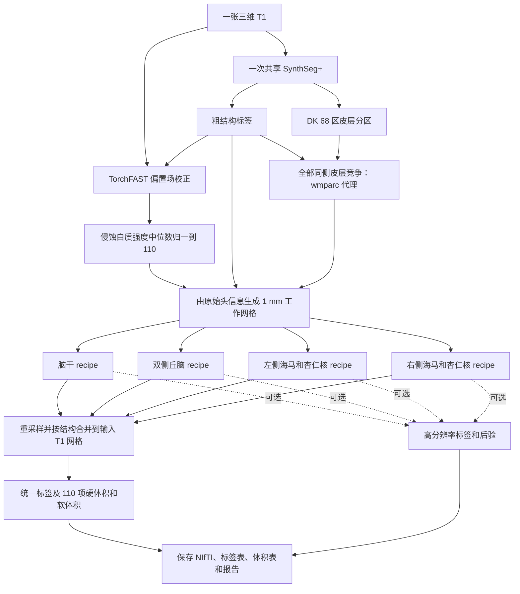
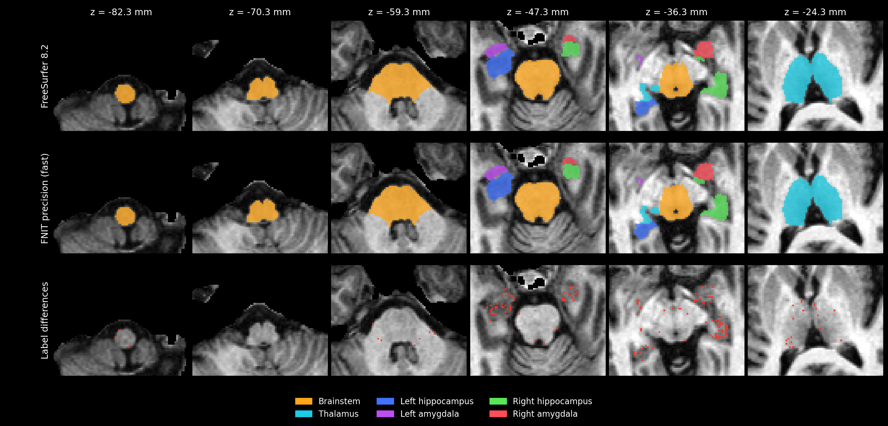
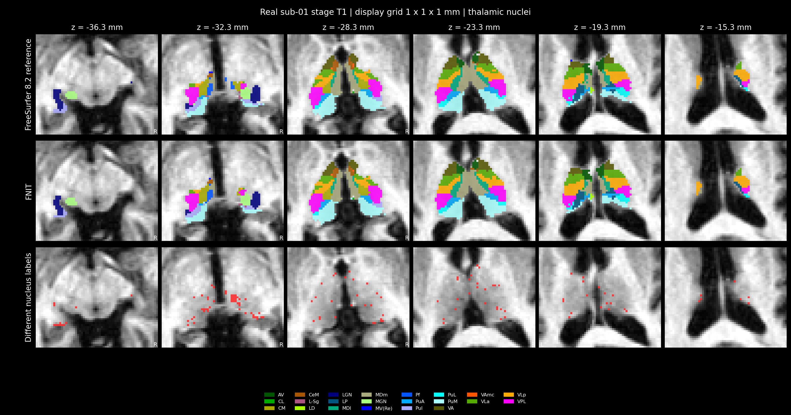
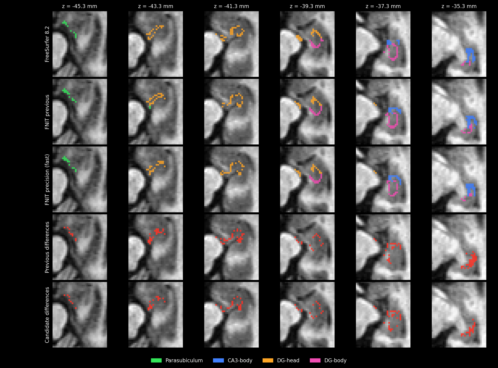
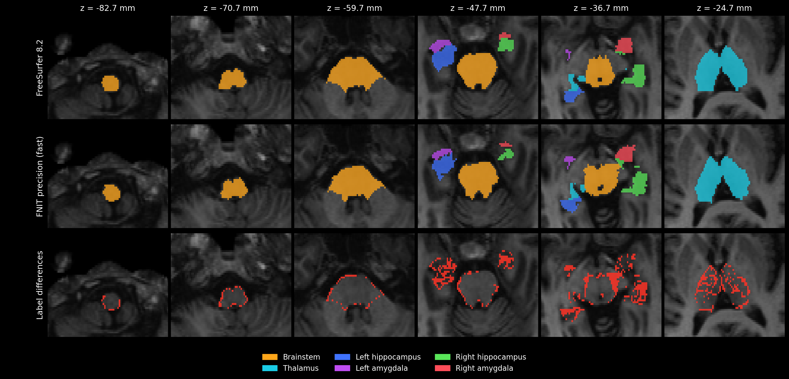
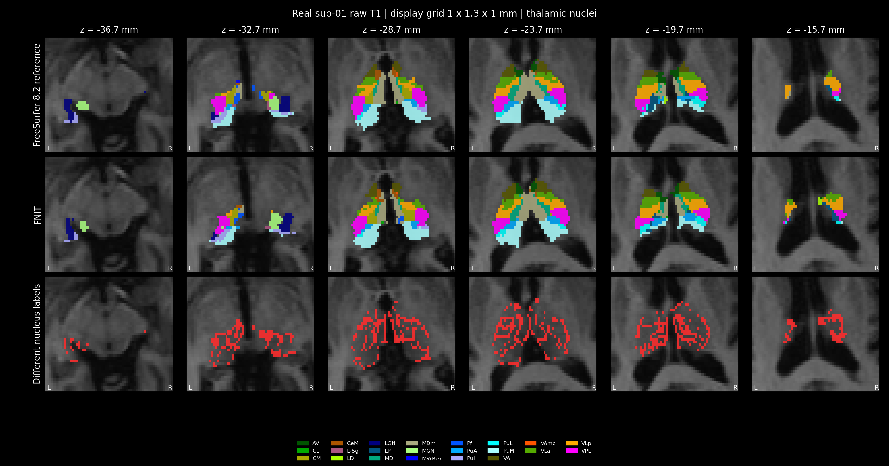
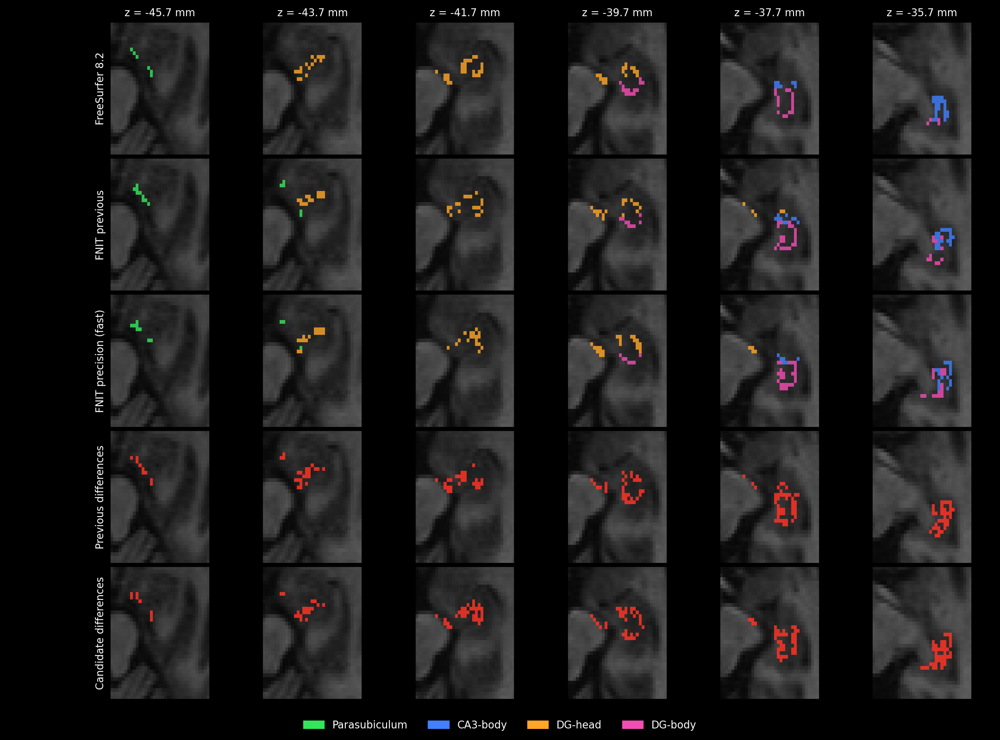

# 四类脑亚区分割：`segment_4_subregions`

[返回首页](../../README.md) · [真实数据验证](../../validation/subregions/README.md) · [完整 benchmark](../../validation/subregions/segment_4_subregions/raw_precision_analysis/README.md)

输入一张三维 T1，一次完成脑干、双侧丘脑、双侧海马和杏仁核分割。返回与输入 T1 **形状和 affine 相同**的 `int32` 标签图，以及标签表、硬体积、软体积和各结构的高分辨率结果；设置 `output_dir` 后自动保存。默认全部结构共有 **110 项亚区统计**，其中某些小亚区在原始 T1 网格上可能没有硬标签体素。

支持 CPU 和 GPU。CUDA 默认使用 FP32/TF32，计算与读写分别使用项目的 PyTorch 实现和 Nibabel，运行时不调用 FreeSurfer 或 FSL。

## 从一张 T1 到完整结果

默认 `structures="all"` 时，共享一次 SynthSeg+，取得粗结构标签和 Desikan–Killiany（DK）68 区皮层分区。全部同侧皮层分区在同侧白质内竞争最近邻，生成海马强度模型需要的 `wmparc` 代理。自动粗分割后复用 TorchFAST 校正偏置场，将侵蚀白质的强度中位数归一到 110，并从 T1 自身头信息生成 1 mm 冠状工作网格。随后依次拟合四项结构；每项完成后将详细结果移到 CPU，再处理下一项。



丘脑在 0.5 mm、海马/杏仁核在约 0.333 mm 网格上拟合。各结构先生成处理网格标签并执行支持范围筛选，再将标签、置信度和支持掩膜以最近邻共同映射到原始 T1，按重叠处的置信度合并；硬体积按原始 T1 的体素体积统计。这沿用官方标准标签输出的网格顺序。平均体素间距小于 0.99 mm 的输入保留高分辨率网格；侵蚀白质正样本不足 100 个时保留输入并在报告中记录原因。图中四个 recipe 表示数据流，实际依次运行。

已有同网格的粗标签、皮层分区或 `wmparc` 可直接传入。提供 `coarse_segmentation` 时按已准备的 T1 直接拟合，跳过自动强度校正和 1 mm 网格准备；官方同阶段对照传入 `norm/aseg/wmparc`。只选脑干或丘脑且未提供粗标签时，使用一次 SynthSeg；提供全部所需标签后不再运行模型。

## Python 调用、输入输出与参数

```python
from fnit import segment_4_subregions

subregion_result = segment_4_subregions(
    t1="/absolute/path/sub-01_T1w.nii.gz",       # 输入：一张原始三维 T1
    atlas_root=None,                            # 输入：None 使用 FNIT 图谱缓存
    structures="all",                          # 输入：默认全部结构，也可选择单项或列表
    coarse_segmentation=None,                  # 输入：可选的同网格粗结构标签
    cortical_parcellation=None,                # 输入：可选的同网格 DK 68 区皮层标签
    wmparc=None,                               # 输入：可选的同网格白质分区，提供时直接使用
    synthseg_weights=None,                     # 输入：可选的 SynthSeg 权重文件或目录
    synthseg_parc_weights=None,                # 输入：可选的 SynthSeg+ 皮层权重文件或目录
    device="cuda:0",                           # 输入：GPU 设备；也支持 "cpu"
    threads=4,                                 # 输入：PyTorch CPU 线程数
    optimization="fast",                       # 输入：速度优先配置；另一选项为 "balanced"
    output_dir="/absolute/path/sub-01_subregions",  # 输出：标签、体积表和报告目录
    save_highres=True,                         # 输出：保存各结构工作网格的标签
    save_posteriors=False,                     # 输出：后验图较大，按需设为 True
)

native_label_path = subregion_result.output_files["labels"]  # 输出：原 T1 网格标签路径
pons_mask = subregion_result.mask("Pons")                    # 输出：与 T1 同形状的脑桥布尔掩膜
left_ca1_head_mask = subregion_result.mask("Left-CA1-head")  # 输出：左侧 CA1 头部掩膜
print(native_label_path)
```

### 参数

| 参数 | 默认值 | 含义 |
|---|---|---|
| `t1` | 必填 | 原始三维 T1 路径或 Nibabel 图像。无需预先执行 `recon-all`。 |
| `atlas_root` | `None` | 图谱根目录。省略时使用 FNIT 缓存，缺失时按资源清单下载并准备。 |
| `structures` | `"all"` | 可选 `"brainstem"`、`"thalamus"`、`"hippo-amygdala-left"`、`"hippo-amygdala-right"`，或这些名称的列表；`"hippo-amygdala"` 同时选择左右两侧。默认运行全部四项。 |
| `coarse_segmentation` | `None` | 同 T1 网格的 `aseg` 或 SynthSeg 粗标签；可为路径、Nibabel 图像或三维数组。省略时自动生成并执行强度与工作网格准备；提供时直接使用已准备的 T1。 |
| `cortical_parcellation` | `None` | 同 T1 网格的 DK 皮层标签，支持路径、Nibabel 图像或三维数组。全部同侧 DK 标签竞争生成白质代理；海马强度模型从对应颞叶白质 3006/3007/3016 及右侧 4006/4007/4016 取样。省略且需要代理时由 SynthSeg+ 生成。 |
| `wmparc` | `None` | 同 T1 网格的白质分区，支持路径、Nibabel 图像或三维数组。提供时海马强度模型直接使用，不再生成白质代理。 |
| `synthseg_weights` | `None` | SynthSeg 模型权重文件或目录。省略时解析 FNIT 权重配置，并在需要时下载和校验。 |
| `synthseg_parc_weights` | `None` | SynthSeg+ 皮层分区权重文件或目录；仅在需要自动皮层分区时读取。 |
| `device` | `"cuda:0"` | PyTorch 计算设备，例如 `"cuda:1"` 或 `"cpu"`。CUDA 默认启用 TF32。 |
| `threads` | `4` | PyTorch CPU 线程数，必须至少为 1；GPU 运行中的 CPU 准备步骤也使用此设置。 |
| `optimization` | `"fast"` | `"fast"` 速度优先；`"balanced"` 使用更多网格更新和更严格的停止阈值。两者均保留工作网格和最终输出分辨率，详见下文。 |
| `output_dir` | `None` | 自动保存目录。省略时返回内存结果，也可稍后调用 `subregion_result.save(output_dir)`。 |
| `save_highres` | `True` | 保存每项结构的工作网格标签；仅在保存结果时生效。 |
| `save_posteriors` | `False` | 保存每项结构的后验 NIfTI；最后一维为标签通道，仅在保存结果时生效。 |

传入的标签图必须与 T1 形状和 affine 一致；数组没有 affine 信息，需由调用者确保来自相同网格。仅选部分结构时，只返回对应亚区的统计。

### 返回值与保存文件

`subregion_result.labels` 是原 T1 网格的 Nibabel 标签图。`label_table` 为 `{标签 ID: 名称}`；`label_metadata` 增加所属结构、图谱家族和半球。右侧海马/杏仁核标签采用原 ID 加 10000，避免左右冲突。

`subregion_result.volumes[标签 ID]` 包含 `hard_volume_mm3`（原 T1 网格硬标签体积）和 `soft_volume_mm3`（工作网格后验积分），单位均为 mm³。`confidence` 为拟合最大后验插值到处理网格后的置信度，再随标签以最近邻回到原始网格；它用于结构重叠处的选择。`structure_results` 保存各结构的高分辨率标签、后验、网格及 affine。`initialization` 记录共享预处理来源、模型调用次数、偏置与归一化参数、结构拟合、耗时和 GPU 峰值。

设置 `output_dir` 后生成：

```text
sub-01_subregions/
├── subregions_native.nii.gz       # 原 T1 网格 int32 合并标签
├── labels.tsv                    # 标签 ID、名称、所属结构、半球和来源
├── volumes.tsv                   # 每项亚区的硬体积和软体积
├── report.json                   # 输入、几何、参数、耗时、显存和数值检查
└── highres/                      # 可选：四项工作网格标签和后验
    ├── brainstem.nii.gz
    ├── thalamus.nii.gz
    ├── hippo-amygdala-left.nii.gz
    └── hippo-amygdala-right.nii.gz
```

`save_posteriors=True` 时，`highres/` 另存各结构的 `*_posterior.nii.gz`，通道顺序对应该图谱的 `compressionLookupTable.txt`。`output_files` 给出所有已保存文件的绝对路径。`timings["compute_seconds"]` 包括预处理、拟合和合并；`timings["save_seconds"]` 包括影像和表格读写，报告 JSON 的最终序列化和落盘不计入此项。

### CPU、GPU 与速度配置

| 配置 | `fast`（默认） | `balanced` |
|---|---|---|
| 丘脑、海马/杏仁核强度拟合：每个外层迭代的网格更新上限 | 20 | 30 |
| 丘脑网格数据项 | 非零平滑阶段使用四分之一加权空间采样，最后阶段使用全部有效体素 | 各阶段使用全部有效体素 |
| 海马/杏仁核网格数据项 | 各阶段使用全部有效体素 | 各阶段使用全部有效体素 |
| Gaussian EM 与最终标签、后验 | 完整工作网格 | 完整工作网格 |
| 停止条件 | 速度优先 | 更严格 |

图谱先验平滑、部分容积模拟、Gaussian EM 和网格拟合支持 GPU，默认环境已包含所需依赖。图谱加载、裁剪、三次插值、部分形态学、白质标签传播和最终 Nibabel 重采样仍在 CPU；阶段控制和线搜索也包含 CPU 判断及 GPU 同步。整例时间包含这些步骤。实现与逐组件耗时见 [TorchGEMS](../../src/fnit/gems/core.py)及 [GPU 组件验证](../../validation/subregions/speed_v16/layout_components/README.md)。

合成标签拟合按各结构的阶段预算运行，脑干采用其独立配置；上表的 20/30 上限对应丘脑和海马/杏仁核的强度拟合。

海马部分容积准备修复了 NumPy 组织均值直接赋给 PyTorch 掩膜张量的兼容问题，均值与统计规则保留；测试覆盖薄结构分支。

### 图谱与权重准备

首次缺少 SynthSeg 权重或图谱时自动准备。资源优先从 [FNIT 固定 Release](https://github.com/weikanggong1/Fudan-Neuroimaging-toolkit/releases/tag/assets-v1)及其清单获取并校验大小、SHA-256；未获明确再分发许可的文件从原作者网站获取。离线运行前可执行：

```bash
# --model：下载并校验自动粗分割和皮层分区所需权重
fnit-setup-weights --model synthseg-plus

# --output-root：保存四类图谱的根目录；省略时使用 FNIT 缓存
# --device：图谱准备计算设备；--asset-dir 可另指定已经校验的资产目录
fnit-setup-subregion-atlases --output-root /absolute/path/subregion_atlases --device cpu
```

图谱目录为 `brainstem/`、`thalamus/`、`hippo-amygdala-left/` 和 `hippo-amygdala-right/`。原始图谱文件及校验值见 [资源清单](../../src/fnit/recon_all/assets.py)，模型下载与离线配置见 [权重说明](../WEIGHTS.md)。丘脑和海马先验在个体仿射变换后的参考网格上平滑。

## 命令行

```bash
# --i：原始 T1；--o：原网格合并标签；--structure：结构，可重复指定
# --device：CPU/GPU；--threads：CPU 线程数；--optimization：fast 或 balanced
# --output-dir：标签表、体积表和报告目录；--save-highres：保存工作网格标签
fnit segment-4-subregions --i /absolute/path/sub-01_T1w.nii.gz \
  --o /absolute/path/sub-01_subregions/subregions_native.nii.gz \
  --structure all --device cuda:0 --threads 4 --optimization fast \
  --output-dir /absolute/path/sub-01_subregions --save-highres
```

`--atlas-root`、`--coarse-segmentation`、`--cortical-parcellation`、`--wmparc`、`--synthseg-weights` 和 `--synthseg-parc-weights` 对应 Python 参数。`--save-posteriors` 另存工作网格后验，`--report-json` 可再指定报告路径。仅需原网格标签时可省略输出目录和保存开关。

## 原软件调用

以下是 **FreeSurfer 的参考命令**。官方流程先完成 `recon-all`，再读取该 subject 的 `norm.mgz`、`aseg.mgz` 和海马所需的 `wmparc.mgz`：

```bash
segment_subregions brainstem --cross fs_sub01 --sd /absolute/path/subjects --threads 4
segment_subregions thalamus --cross fs_sub01 --sd /absolute/path/subjects --threads 4
segment_subregions hippo-amygdala --cross fs_sub01 --sd /absolute/path/subjects --threads 4
```

相同阶段的精度对照需向 FNIT 传入同一组 `norm/aseg/wmparc`；从原始 T1 自动预处理的整例验证另行报告。原实现见 [FreeSurfer 源码](https://github.com/freesurfer/freesurfer/tree/dev/attic/python/gems/subregions)和 [官方使用说明](https://surfer.nmr.mgh.harvard.edu/fswiki/SubregionSegmentation)。


## 最新精度、运行时间与脑图

2026-10-02，使用同一例公开去面部 T1 完成两次四结构整例验收：共享 H100、4 个 CPU 线程、FP32/TF32、默认 `optimization="fast"`。原始输入及五个模型按大小、SHA-256 核验；本进程显存上限为 19,073 MiB。该例来自 OpenNeuro ds000114，许可 CC0，见[数据来源](../../examples/data/SOURCES.json)。

**同阶段**输入为保存的官方 `norm/aseg/wmparc`；**原始 T1**由 FNIT 内部完成一次 SynthSeg+、TorchFAST、白质归一化、工作网格准备和全部拟合。两者均使用已保存的 FreeSurfer 8.2 细标签验证。raw 参考从官方标准 1 mm `FSvoxelSpace` 标签以最近邻映射到输入网格。

### 完整流程耗时

| 输入 | 计算 | API 含保存 | 进程 wall | PyTorch 峰值 / 本进程显存采样峰值 |
|---|---:|---:|---:|---:|
| 原始 T1 | 436.34 s（7.27 min） | 436.87 s | 461.45 s | 15.47 GiB / 16,468 MiB |
| 同阶段输入 | 473.20 s（7.89 min） | 473.78 s | 515.74 s | 5.01 GiB / 9,728 MiB |

计算包括共享预处理、全部拟合和合并；API 另含保存，进程 wall 还含 Python 导入、CUDA 初始化和验证记录。首次资源下载、图谱安装与独立官方程序运行不计入。共享 GPU 负载随记录保存。完整 FNIT CPU 整例及本轮官方 CPU 总流程未重新测量；历史官方细分割合计 30.70 分钟，不含 `recon-all`，见[固定历史记录](https://github.com/weikanggong1/Fudan-Neuroimaging-toolkit/blob/5250aa540bb6e3b1fda7d7a596c42b39006da14d/validation/subregions/unified.md#L212)。

### 细标签精度：更新前后

Dice 均值按可评价细标签计算；**加权 Dice**以每项官方体素数加权。双方硬标签均空记为 `both_empty`，不计 Dice 1、不计通过。严格通过要求 Dice ≥0.95 且硬体积相对误差 ≤5%。不同输入网格的标签数、参考体素数分别列出。

**同阶段输入**

| 家族 | 更新前加权 Dice | 最新 Dice 均值 | 最新加权 Dice | 严格通过 / 标签数 | 官方体素数 |
|---|---:|---:|---:|---:|---:|
| 脑干 | 0.991306 | 0.983071 | 0.991383 | 4/4 | 19,808 |
| 丘脑细核 | 0.960523 | 0.908711 | 0.960579 | 17/44 | 10,123 |
| 左海马 | 0.870763 | 0.875067 | 0.888019 | 2/19 | 3,067 |
| 右海马 | 0.813436 | 0.814221 | 0.844525 | 1/19 | 3,058 |
| 左杏仁核 | 0.941614 | 0.859103 | 0.948179 | 2/9 | 1,371 |
| 右杏仁核 | 0.917690 | 0.719640 | 0.934494 | 1/9 | 1,285 |
| 全部细标签 | 0.955452 | 0.867507 | 0.960119 | 27/104 | 38,712 |

**原始 T1 全流程**

| 家族 | 更新前加权 Dice | 最新 Dice 均值 | 最新加权 Dice | 严格通过 / 标签数 | 官方体素数 |
|---|---:|---:|---:|---:|---:|
| 脑干 | 0.924751 | 0.913015 | 0.945839 | 1/4 | 15,305 |
| 丘脑细核 | 0.775793 | 0.832364 | 0.915134 | 1/44 | 7,793 |
| 左海马 | 0.678531 | 0.815151 | 0.833178 | 0/19 | 2,362 |
| 右海马 | 0.634352 | 0.729646 | 0.742617 | 0/19 | 2,363 |
| 左杏仁核 | 0.790483 | 0.788915 | 0.914368 | 1/9 | 1,052 |
| 右杏仁核 | 0.760340 | 0.635829 | 0.872840 | 0/9 | 969 |
| 全部细标签 | 0.833303 | 0.792788 | 0.909335 | 3/104 | 29,844 |

逐标签硬/软体积及空标签记录见[同阶段表](../../validation/subregions/segment_4_subregions/raw_precision_analysis/final_full_stage/comparison.tsv)和[raw 表](../../validation/subregions/segment_4_subregions/raw_precision_analysis/final_full_raw/comparison.tsv)；[完整汇总](../../validation/subregions/segment_4_subregions/raw_precision_analysis/benchmark_summary.json)保留更新前后指标。两次输出与原 T1 的 shape/affine 一致，110 项软体积均有限且非负，硬体积与最终标签计数一致，四个最终最小 Jacobian 均为正。

### 低 Dice 脑区、原因与修复

1. **右 CA3-body、DG-head/body 和 parasubiculum**：差异在官方原始高分辨率网格上仍存在。旧海马拟合在非零梯度时出现零位移与过早停止；将已验证的丘脑稳定拟合复用到双侧海马，保留 FP32 影像与顶点，使用固定顺序归约、FP64 代价/优化器状态、精确小矩阵和有界 Armijo 回溯。
2. **原始 T1 的丘脑与海马**：仅替换 coarse 或全局缩放收益很小。自动流程增加原生 TorchFAST 偏置校正、侵蚀白质中位数 110 归一化及由自身头信息建立的 1 mm 网格，校准强度与拟合尺度。
3. **海马白质先验范围**：旧代理只让三个颞叶皮层标签传播，吸收了大量其他区域白质。改为全部同侧 DK 皮层竞争；目标白质掩膜与官方 Dice 从约 0.26 提升到 0.75–0.77。右侧匹配消融显示细分割收益较小，主要修复样本归属。
4. **小核输出采样**：直接从 HR 回 raw 会改变标准类别图的边界。CPU 核查发现同一份丘脑 HR 标签、六阶段轨迹完全相同，标准 1 mm 导出与直接导出在 raw 上相差 1774 体素。最终保留标准类别图的导出顺序，标签、置信度、支持范围共同最近邻回原图；脑干 HR 标签同步应用连通块、支持范围和正置信度过滤。
5. **Medial、AAA 等极小标签**：官方 Medial 在 1 mm 上仅有 3 体素，采样会显著影响 Dice。右 AAA 的官方硬标签接近空，但官方与 FNIT 软体积接近；保留硬标签差异及软体积，不人为清零来匹配。

在固定官方高分辨率轴向和网格相位的独立对照中，raw 丘脑加权 Dice 从 **0.816515 提升到 0.919802**；左、右海马从 **0.767438 / 0.726164 提升到 0.840265 / 0.771970**。同阶段右海马为 **0.820684→0.868862**。细网格也出现改善，但左 AAA、左 Medial 等标签仍有局部回退；[HR 前后对照](../../validation/subregions/segment_4_subregions/raw_precision_analysis/highres_before_after.json)保留共同分母及逐区结果。

下表使用最新**完整同阶段流程**，展示优化前低 Dice 区域：

| 右侧区域 | 官方体素数 | 更新前 Dice | 最新 Dice |
|---|---:|---:|---:|
| CA3-body | 81 | 0.51648 | 0.65116 |
| GC-ML-DG-head | 151 | 0.61745 | 0.68243 |
| parasubiculum | 35 | 0.59155 | 0.68571 |
| GC-ML-DG-body | 108 | 0.71681 | 0.75117 |
| Medial | 3 | 0.00000 | 0.50000 |
| Cortical | 15 | 0.71429 | 0.70968 |

同一人的单右侧同阶段 `balanced` 试验，海马加权 Dice 为 **0.888699**，计算 175.09 s；该配置改善多个低 Dice 区域，但 raw 上不保证逐区改善。单结构结果与完整流程分别报告，见[消融分析、HR 对照及采样审计](../../validation/subregions/segment_4_subregions/raw_precision_analysis/README.md)。默认配置仍为 `fast`。

### 软体积与官方对照

软体积为细网格后验积分。下面按每个标签计算绝对相对误差，再取平均；双方硬标签均空的标签仍参与软体积比较。

| 家族 | 同阶段平均误差 / ≤5% 项数 | raw 平均误差 / ≤5% 项数 |
|---|---:|---:|
| 脑干 | 0.99% / 4/4 | 6.28% / 2/4 |
| 丘脑细核 | 2.67% / 45/50 | 5.82% / 30/50 |
| 左海马 | 2.82% / 17/19 | 5.13% / 9/19 |
| 右海马 | 2.14% / 19/19 | 3.99% / 12/19 |
| 左杏仁核 | 2.41% / 8/9 | 10.86% / 3/9 |
| 右杏仁核 | 3.48% / 6/9 | 5.38% / 6/9 |

### 内部阶段时间

| 阶段 | 同阶段 | 原始 T1 |
|---|---:|---:|
| 共享预处理 | 0.729 s | 18.394 s |
| 脑干 | 33.568 s | 24.388 s |
| 丘脑 | 136.692 s | 115.426 s |
| 左海马与杏仁核 | 148.919 s | 132.051 s |
| 右海马与杏仁核 | 142.226 s | 129.891 s |

各结构时间含仿射、裁剪、合成标签拟合、强度拟合和后处理；合并、统计及结构外开销另含在总计算时间。

### 官方对照与低 Dice 区域脑图

每幅图包含六层 RAS 轴位，标签最近邻显示，保持真实毫米比例；红色表示细标签 ID 差异。显示重采样不改变原网格上的 Dice。低 Dice 图同时显示官方、更新前、最新结果和两版差异。

**同阶段输入：四结构。**



**同阶段输入：丘脑细核。**



**同阶段输入：右侧低 Dice 海马细区，更新前后。**



**原始 T1 全流程：四结构。**



**原始 T1 全流程：丘脑细核。**



**原始 T1 全流程：右侧低 Dice 海马细区，更新前后。**



## 最近版本 benchmark 记录

| 版本 | 同阶段 / raw 计算 | 同阶段 / raw 丘脑加权 Dice | 更新内容 |
|---|---:|---:|---|
| [v16 C6](../../validation/subregions/speed_v16/README.md) | 509.84 s / — | 0.964068 / — | 历史算法基线 |
| [入口整合](../../validation/subregions/segment_4_subregions/README.md) | 489.91 / 425.86 s | 0.910995 / 0.776716 | 统一公开入口后的精度回退 |
| [丘脑回溯修复](../../validation/subregions/segment_4_subregions/stability_fix/README.md) | 533.77 / 410.72 s | 0.960523 / 0.775793 | 恢复丘脑数值路径 |
| [本次低 Dice 优化](../../validation/subregions/segment_4_subregions/raw_precision_analysis/README.md) | 473.20 / 436.34 s | 0.960579 / 0.915134 | 双侧海马稳定拟合、原始强度/网格、白质代理与标准导出 |

本次冻结源码及其大小/SHA 校验见[清单](../../validation/subregions/segment_4_subregions/raw_precision_analysis/export_final_source/source_manifest.json)；[同阶段输出审计](../../validation/subregions/segment_4_subregions/raw_precision_analysis/final_full_stage/actual_source_and_output_audit.json)、[raw 输出审计](../../validation/subregions/segment_4_subregions/raw_precision_analysis/final_full_raw/actual_source_and_output_audit.json)核对实际源码、模型、图谱、几何、体积与显存。本地 [365 项 GEMS 测试](../../validation/subregions/segment_4_subregions/raw_precision_analysis/tests_gems_final.log)和 [50 项公开入口/CLI 测试](../../validation/subregions/segment_4_subregions/raw_precision_analysis/tests_public_cli_final.log)通过。结果来自一例开发病例。

## Reference

- 脑干：[Iglesias 等，2015，*NeuroImage*](https://doi.org/10.1016/j.neuroimage.2015.02.065)。
- 丘脑：[Iglesias 等，2018，*NeuroImage*](https://pmc.ncbi.nlm.nih.gov/articles/PMC6215335/)。
- 海马：[Iglesias 等，2015，*NeuroImage*](https://doi.org/10.1016/j.neuroimage.2015.04.042)。
- 杏仁核：[Saygin 等，2017，*NeuroImage*](https://doi.org/10.1016/j.neuroimage.2017.04.046)。
- 粗分割：[Billot 等，2023，*Medical Image Analysis*](https://doi.org/10.1016/j.media.2023.102789)。
- 皮层分区：[Billot 等，2023，*PNAS*](https://doi.org/10.1073/pnas.2216399120)。
- [FreeSurfer 亚区原实现](https://github.com/freesurfer/freesurfer/tree/dev/attic/python/gems/subregions)及 [GEMS 形变先验实现](https://github.com/freesurfer/freesurfer/blob/dev/attic/gems/kvlAtlasMeshPositionCostAndGradientCalculator.cxx)。
