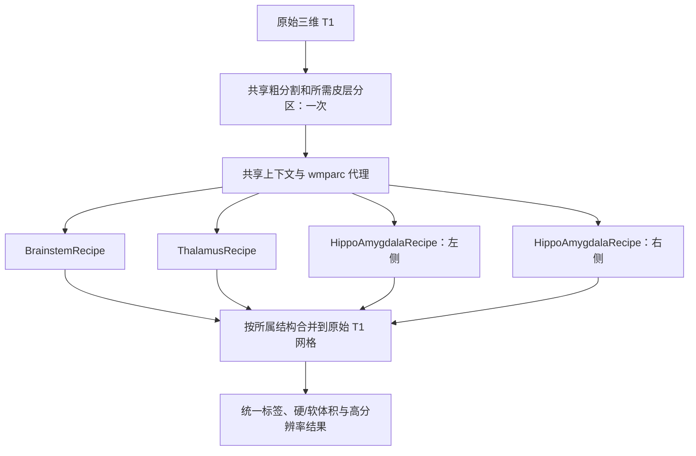

# 统一脑亚区分割：`segment_subregions`

[返回首页](../../README.md) · [统一真实数据验证](../../validation/subregions/unified.md) · [旧接口迁移](nuclei.md)

输入一张三维 T1，输出与该 T1 **形状及 affine 相同**的 `int32` NIfTI：脑干四亚区、双侧丘脑核团、双侧海马亚区和杏仁核核团。默认使用 FNIT 图谱缓存；缺少图谱时按固定大小和 SHA-256 下载并准备。

原始 T1 默认全部结构只调用一次 SynthSeg+，同时取得粗结构标签和 Desikan–Killiany（DK）68 区皮层分区；只需要粗标签时调用 SynthSeg。颞叶皮层标签限制在同侧白质内传播，得到海马强度模型使用的 `wmparc` 代理。各结构复用这些结果。已有 `aseg`、皮层分区或 `wmparc` 可作为同网格输入。运行时不调用 FreeSurfer、FSL 或 C++/ITK legacy 核团接口。

首次运行缺少 SynthSeg 权重时，从 FNIT 固定 Release 或原作者地址下载并校验大小、SHA-256；用户也可以先运行 `fnit-setup-weights --model synthseg-plus`。在无网络服务器上，先准备权重和图谱缓存。



各结构共用一次粗分割。脑干沿用既有 TorchGEMS 配置；丘脑先以合成粗标签拟合网格，再在 0.5 mm T1 工作图像上拟合，强度阶段分为内侧偏暗和外侧偏亮两组；左右海马/杏仁核分别在约 0.333 mm 工作网格上拟合，并对 alveus、fissure 及高分辨率 T1 下单独成组的 molecular layer 用图谱先验、组织强度和模糊核模拟部分容积。工作网格标签和后验保存在 `structure_results`，主标签以最近邻重采样回原 T1 网格。跨图谱合并先按所属粗结构掩膜限定候选，仅在支持掩膜重叠处比较后验置信度。

默认 `optimization="fast"`：丘脑和海马保留原工作网格、全部平滑级别和外层日程，每轮最多更新网格 20 次。丘脑非零 sigma 阶段的网格数据项使用固定四分之一空间采样，并按有效体素总数加权；最后阶段恢复全部有效体素。海马/杏仁核所有阶段均使用全部有效体素。Gaussian EM、超先验、固定掩膜和最终标签/后验始终使用原细网格。`"balanced"` 全阶段使用全部有效体素，每轮最多更新 30 次，停止阈值更严格。两者均使用 Gaussian EM 和带 strong-Wolfe 线搜索的 L-BFGS；合成标签拟合保留两级及 300、150 次更新上限。CUDA 几何、图像和梯度保持 FP32/TF32；`fast` 的网格数据成本仅在最后求和时用 float64，减少总成本量化对线搜索的影响。每项结构完成后将详细结果移到 CPU，再拟合下一项。

网格候选索引按四面体包围盒批量生成并稳定排序，保持每个块内的候选顺序；生成坐标的临时数组分块，极大索引回退逐块遍历。单通道拟合只在有效体素上计算 EM 先验和网格数据成本，缓存固定参考网格的逆矩阵和体积，合并点批次及插值。每次成本评估中，栅格化和形变先验共用当前四面体几何；形变先验使用解析梯度。CUDA FP32 使用主页环境已有的 Triton 处理四面体查找及数据项解析顶点梯度，形变先验用 PyTorch 解析梯度；CPU 或不支持该 kernel 的输入回退 PyTorch。最终解剖先验和后验仍按完整工作网格输出。

有效体素路径和完整网格路径都先在 CPU 打包点坐标、候选索引、候选掩膜及所需行索引，每类缓冲区一次传到 GPU，再建立批次视图；完整网格的浮点采样坐标和整数写入坐标分别打包。候选顺序、分组及坐标布局保留，减少逐批小数据传输和 CUDA 张量创建。固定掩膜的侵蚀、块内点归类、稳定排序和坐标生成仍在 CPU；新索引或新掩膜需要重新准备这些布局。

L-BFGS 缓存线搜索实际接受点的成本和已投影梯度，用于下一次网格更新的起始评估，省去重复栅格化与反向传播。缓存随外层 EM、Gaussian 模型或 alpha 变化失效；停止判断读取接受点成本。该缓存保留同一目标和线搜索，`fast` 的较短网格更新预算与停止阈值改变拟合预算，标签与体积差异通过真实数据 benchmark 检查。实现见 [优化器](../../src/fnit/gems/optim.py)、[TorchGEMS](../../src/fnit/gems/core.py)、[结构日程](../../src/fnit/gems/recipes/base.py)和 [PyTorch L-BFGS](https://github.com/pytorch/pytorch/blob/v2.5.1/torch/optim/lbfgs.py)。

CUDA FP32 的网格数据成本使用 Triton 合并先验插值、Gaussian 混合似然及解析顶点梯度；CPU 和不支持该 kernel 的输入自动使用 PyTorch autograd。`fast` 在严格内部点复用旧四面体归属，先验证当前重心坐标；边界点重新完整搜索，每八次闭包强制完整搜索，候选索引或有效体素布局改变时缓存失效。该复用假设网格没有全局交叠，Jacobian 和真实分割对照另行记录。EM 和最终输出仍完整搜索。脑干粗网格也复用有效体素计算、参考几何、解析形变梯度和优化器缓存。合成标签阶段和中间强度阶段只返回网格、Gaussian 参数及数值报告，最后一个强度阶段生成完整标签、先验和后验。

图谱平滑的分离卷积、十轮顶点 alpha EM，以及海马部分容积的先验栅格化、合成强度和 Gaussian 模糊在指定 GPU 上完成。平滑保留原离散核和边界模式，部分容积保留原 Gaussian 的截断半径与反射边界；不同 sigma 复用同一参考网格的栅格化结果，类别或参考图谱变化时缓存失效。薄结构的小样本 median/KDE、图谱加载、裁剪、三次插值、形态学、白质标签传播和最终 Nibabel 重采样仍在 CPU。运行时间包含这些步骤，依赖沿用主页 Conda 环境。

仍会影响 GPU 连续计算的部分包括 CPU 上的 L-BFGS 线搜索与阶段循环，以及收敛、网格移动和索引刷新判断所需的 GPU 标量同步。组织强度取样和连通域后处理也在 CPU。上述准备与控制开销和网格成本评估分别记录，整例耗时包含全部步骤。

海马部分容积准备同时修复 NumPy 标量向 PyTorch 掩膜张量赋值的兼容问题：组织均值转换为 Python 标量再赋值，原均值、计数和 KDE 规则保留。对应测试实际覆盖 alveus 薄结构分支。

## 速度配置

| 设置 | `fast`（默认） | `balanced` |
|---|---|---|
| 强度拟合网格 | 全部级别在丘脑 0.5 mm、海马/杏仁核约 0.333 mm 网格 | 全部级别使用各结构原有工作网格 |
| 丘脑外层 EM/网格轮数上限 | 7、5、5、3 | 7、5、5、3 |
| 每侧海马/杏仁核外层轮数上限 | 7、5、3 | 7、5、3 |
| 每轮网格更新上限 | 20 | 30 |
| 网格数据项体素 | 丘脑非零 sigma 阶段固定四分之一加权采样，最后阶段全部体素；海马/杏仁核全阶段全部体素 | 全阶段使用全部有效体素 |
| 数据成本求和 | float64；图像、几何和梯度仍 FP32 | FP32 |
| 网格归属查找 | 验证内部旧归属；边界和周期刷新完整搜索 | 完整搜索 |
| 每轮 Gaussian EM 上限及相对成本阈值 | 100 次；`1e-5` | 100 次；`1e-5` |
| 合成标签网格相对成本阈值 | `1e-6`，连续 3 次满足后停止 | `1e-10`，满足一次后停止 |
| 每次更新的最大顶点位移阈值 | 工作网格 `0.005` 体素，连续 3 次满足后停止 | 工作网格 `1e-10` 体素，满足一次后停止 |
| 强度拟合外层相对成本阈值 | `1e-5` | `1e-6` |
| 最终标签、先验及后验网格 | 各结构原有完整工作网格 | 各结构原有完整工作网格 |

完全没有位移的网格更新立即结束。位移和合成标签成本的连续次数只用于内层网格更新；外层成本阈值按相邻两轮判断。精修使用合成标签拟合后的网格直接生成固定掩膜；Gaussian 超先验计数、alpha 平滑宽度和精修图像不经过粗网格转换。丘脑第二级仍切换到内侧/外侧两组强度模型。脑干继续使用既有日程，不随 `optimization` 切换粗网格或迭代预算。

`result.initialization[结构名称]` 记录选择的 `optimization`。丘脑和海马的 `mesh_solver` 包含 `stages`、真实 `mesh_evaluations`、网格更新 `mesh_steps`、`accepted_cache_hits`、索引重建次数及准备、拟合、后处理耗时；合成标签拟合的统计位于 `segmentation_fit.mesh_solver`。子阶段耗时已包含在父阶段耗时中，汇总整例时不重复相加。`shared_preprocessing` 记录粗标签、皮层分区及白质代理的来源，`model_calls` 给出实际 SynthSeg/SynthSegPlus 调用次数；原始 T1 默认全部结构只调用一次 SynthSegPlus。

## 准备图谱

```bash
# --output-root：图谱根目录；省略时写入 FNIT 默认缓存
# --asset-dir：已配置的官方数据缓存，可省略
# --device：先验平滑所用 CPU/GPU
fnit-setup-subregion-atlases --output-root /absolute/path/subregion_atlases \
  --asset-dir /absolute/path/verified_assets --device cpu
```

该命令准备 `brainstem/`、`thalamus/`、`hippo-amygdala-left/`、`hippo-amygdala-right/`。HippoSF 左右侧的大文件优先用硬链接共享。`AtlasMesh.gz`、`AtlasDump.mgz` 和 `compressionLookupTable.txt` 均按 [固定资产清单](../../src/fnit/recon_all/assets.py)核对字节数及 SHA-256；下载使用 `.part` 后原子替换。`config.json` 记录图谱家族和迭代日程。脑干继续使用预先保存的平滑 alpha；丘脑、海马在每个被试变换后的参考网格上平滑，避免原图谱坐标缓存改变平滑宽度。安装器清理这两类图谱此前生成的 `seg-sigma*.npy` 和 `image-sigma*.npy`。未明确许可再分发的资源仍由原站下载。

## Python 输入和输出

```python
from fnit import segment_subregions

subregion_result = segment_subregions(
    t1="/absolute/path/sub-01_T1w.nii.gz",       # 输入：原始三维 T1
    atlas_root=None,                              # 输入：图谱缓存；None 使用 FNIT 默认缓存
    structures="all",                            # 输入：全部四项；也可选单项或列表
    coarse_segmentation=None,                    # 输入：可选的同网格粗结构标签
    cortical_parcellation=None,                  # 输入：可选的同网格 DK 68 区皮层标签
    wmparc=None,                                 # 输入：可选的同网格 wmparc；提供时直接使用
    synthseg_weights=None,                       # 输入：可选的 SynthSeg 权重路径
    synthseg_parc_weights=None,                  # 输入：可选的 SynthSeg+ 皮层权重路径
    device="cuda:0",                             # 输入：计算设备；也支持 "cpu"
    optimization="fast",                         # 输入：丘脑早期加权采样，海马完整积分；balanced 使用全部体素
    output_dir="/absolute/path/subregions",       # 输出：自动保存标签、体积、元数据和报告
    save_highres=True,                           # 输出：保存每个结构的高分辨率标签
    save_posteriors=False,                       # 输出：后验体积较大，需要时才保存
    auto_initialize=True,                        # 输入：旧自定义图谱的仿射初始化开关
    em_iterations=8,                             # 输入：旧自定义图谱的 EM 默认迭代数
    deform_iterations=0,                         # 输入：旧自定义图谱的网格默认迭代数
)
print(subregion_result.output_files["labels"])            # 输出：原 T1 网格 int32 标签路径
pons_mask = subregion_result.mask("Pons")                 # 输出：与 T1 同形状的布尔掩膜
ca1_mask = subregion_result.mask("Left-CA1-head")         # 输出：左侧 CA1 头部掩膜
```

| 参数 | 含义 |
|---|---|
| `t1` | 原始 T1 路径或 Nibabel 三维图像。 |
| `atlas_root` | 统一图谱根目录；`None` 使用 FNIT 缓存并在缺失时准备。 |
| `structures` | `"all"`、`"brainstem"`、`"thalamus"`、`"hippo-amygdala-left"`、`"hippo-amygdala-right"`、`"hippo-amygdala"` 或这些名称的列表。`"hippo-amygdala"` 展开左右侧。 |
| `coarse_segmentation` | 同 T1 网格的 `aseg`/SynthSeg 标签；省略时只运行一次 FNIT SynthSeg 或 SynthSeg+。 |
| `cortical_parcellation` | 同 T1 网格的皮层标签；白质代理需要左侧 1006、1007、1016 和右侧 2006、2007、2016 编码。默认 SynthSeg+ 提供 DK 68 区分区。 |
| `wmparc` | 同 T1 网格的官方白质分区；若提供，海马强度模型直接使用。 |
| `synthseg_weights`、`synthseg_parc_weights` | 对应模型权重文件或缓存；需要自动分割时才读取。 |
| `device` | `"cuda:0"` 默认，或 `"cpu"`；CUDA 使用 FP32 和 TF32。 |
| `optimization` | `"fast"` 默认：每轮最多 20 次更新；丘脑非零 sigma 阶段的网格项使用四分之一加权空间采样，最终阶段与海马各阶段使用全部体素；Gaussian EM 和最终输出均使用全部有效体素。`"balanced"` 保留同一网格及外层日程，每轮最多 30 次更新、全阶段使用全部体素，停止阈值更严格。用于标准丘脑、海马/杏仁核 recipe。 |
| `output_dir` | 自动保存全部输出的目录；`None` 只返回内存结果。也可稍后调用 `result.save(output_dir)`。 |
| `save_highres` | `True`：设置输出目录时保存各结构的高分辨率标签。 |
| `save_posteriors` | `False`：后验图较大，显式设为 `True` 才保存，最后一维为标签通道。 |
| `auto_initialize` | 旧自定义 atlas pack 的仿射初始化开关；标准 recipe 自动配准。 |
| `em_iterations`、`deform_iterations` | 旧自定义 atlas pack 的默认迭代数；标准 recipe 固定日程。 |

`segment_nuclei` 保留旧参数和嵌套路径返回值，由薄兼容层调用同一个分割流程；新代码只需 `segment_subregions`，旧接口说明见[迁移页](nuclei.md)。`result.output_files` 为输出名称到绝对路径的字典。`result.timings["compute_seconds"]` 包括共享预处理、拟合和合并；`"save_seconds"` 包括目录、影像和 TSV 保存，排除报告 JSON 序列化及最终落盘，磁盘报告与内存记录一致。`result.labels` 为原 T1 网格的合并标签。`result.label_table` 保持 `{ID: 名称}` 兼容形式，`result.label_metadata` 增加所属结构、图谱家族和半球；右侧 HippoSF 标签用原 ID 加 10000 避免与左侧碰撞。`result.volumes[ID]` 同时给出原网格硬体积与工作网格后验积分软体积（mm³）。`result.confidence` 为原网格已选标签的后验置信度；`result.initialization` 包含各结构配准、裁剪、耗时和 GPU 峰值。`result.structure_results[名称]` 保存高分辨率标签、后验、网格和工作网格 affine。

直接调用 `TorchGEMS(atlas)(image, ...)` 时，还可设置以下计算选项；它们不作为 `segment_subregions` 或 CLI 的独立参数暴露。

| 参数 | 默认值与含义 |
|---|---|
| `compact` | `None`：三维单通道图像仅计算非零、有限的有效体素；`False` 使用完整网格计算；`True` 要求单通道三维输入。最终输出仍为完整网格。 |
| `reuse_geometry` | `True`：每次 closure 共用当前四面体几何。 |
| `analytic_prior` | `True`：形变先验使用解析梯度；`False` 使用 PyTorch autograd。 |
| `cache_mesh_evaluations` | `True`：L-BFGS 复用接受点成本与投影梯度；`False` 调用原 PyTorch L-BFGS。对 Adam 无效。 |
| `fused_data_cost_enabled` | `True`：支持的 CUDA FP32 输入使用融合的混合似然成本和一阶顶点梯度；`False` 用原 autograd 路径。 |
| `materialize_outputs` | `True`：生成完整标签、先验和后验。`False` 仅用于中间网格阶段，这三个字段为 `None`，其余拟合结果保留。主入口始终返回完整最终输出。 |
| `mesh_sampling_stride` | `1`：网格数据项包含全部有效体素。大于 1 时按固定空间余数均匀采样，并以有效体素总数与采样数之比加权；Gaussian EM 和最终输出使用全部有效体素。 |
| `owner_hint_enabled` | `False`：完整四面体搜索。`True`：网格成本评估验证并复用严格内部归属，边界点仍完整搜索；EM 和最终输出不使用该近似。 |
| `owner_hint_refresh_interval` | `8`：启用归属复用时，每八次闭包强制完整搜索，必须为正整数。 |
| `owner_hint_tolerance` | `2e-4`：四个重心坐标均大于此值才复用旧归属，必须为有限正数。 |
| `double_data_cost_accumulation` | `False`：FP32 数据成本求和；`True` 只将单通道 compact 网格数据成本的最终求和改为 float64，梯度仍为 FP32。 |
| `deformation_stop` | `1e-10`：每次更新最大顶点位移的停止阈值，单位为当前工作网格体素；须为有限非负数。 |
| `cost_stop_patience` | `1`：位移或内层相对成本条件须连续满足的次数；须为正整数。 |

以下低层示例读取已经变换到输入工作网格坐标的 NPZ 图谱，用于单独检查计算选项。完整脑亚区流程使用上面的 `segment_subregions`，由 recipe 准备类分组、超先验和阶段日程。

```python
import nibabel as nib
import numpy as np
import torch
from fnit.gems import GEMSAtlas, TorchGEMS

working_image = nib.load("/absolute/path/working_T1.nii.gz")  # 输入：预先裁剪的工作图像
aligned_atlas = GEMSAtlas.load_npz("/absolute/path/aligned_atlas.npz")  # 输入：同体素坐标的网格
torch.backends.cuda.matmul.allow_tf32 = True
torch.backends.cudnn.allow_tf32 = True
mesh_fit = TorchGEMS(aligned_atlas, device="cuda:0")(
    np.asarray(working_image.dataobj, dtype=np.float32),
    deform_optimizer="lbfgs", deform_lr=1.0, deform_iterations=12,
    compact=True,                   # 仅计算有效体素，保留完整输出网格
    reuse_geometry=True,            # 同次评估共用四面体几何
    analytic_prior=True,            # 使用形变先验解析梯度
    cache_mesh_evaluations=True,     # 复用线搜索接受点成本和梯度
    deformation_stop=0.005,         # 最大顶点位移阈值，单位为工作网格体素
    cost_stop_patience=3,            # 连续三次满足位移停止条件
)
print(mesh_fit.optimization_stats)  # 输出：真实 closure 次数、更新次数和缓存命中
working_labels = mesh_fit.labels.detach().cpu().numpy().astype(np.int32)
nib.save(nib.Nifti1Image(working_labels, working_image.affine),
         "/absolute/path/working_labels.nii.gz")
```

## 命令行

```bash
# --i：原始 T1；--o：原网格合并标签；--structure：可重复指定结构
# --optimization：fast 速度优先，balanced 允许更多更新并采用更严格的停止阈值
# --output-dir：标签表、体积表和报告；--save-highres：工作网格标签
# --save-posteriors：按需另存工作网格后验
fnit subregions --i /absolute/path/sub-01_T1w.nii.gz \
  --o /absolute/path/sub-01_subregions.nii.gz \
  --structure all --device cuda:0 --optimization fast \
  --output-dir /absolute/path/subregions --save-highres
```

`--coarse-segmentation`、`--cortical-parcellation`、`--wmparc`、`--atlas-root`、`--synthseg-weights`、`--synthseg-parc-weights`、`--device`、`--optimization`、`--em-iterations` 和 `--deform-iterations` 对应 Python 参数；`--no-auto-initialize` 对应 `auto_initialize=False`。`--report-json` 指定独立报告路径，`--save-posteriors` 保存后验图。输出目录含 `subregions_native.nii.gz`、`labels.tsv`、`volumes.tsv`、`report.json` 和可选 `highres/`。工作网格后验 NIfTI 的最后一维是图谱原始标签顺序；顺序可从相应图谱 `compressionLookupTable.txt` 读取。

## 官方对照与参考文献

官方命令需预先完成 `recon-all`，读取 subject 的 `norm.mgz`、`aseg.mgz` 和海马所需的 `wmparc.mgz`。严格阶段对照需将**同一组三个文件**传给 FNIT；原始 T1 全流程属于另一项独立验证。

```bash
segment_subregions brainstem --cross fs_sub01 --sd /absolute/path/subjects --threads 4
segment_subregions thalamus --cross fs_sub01 --sd /absolute/path/subjects --threads 4
segment_subregions hippo-amygdala --cross fs_sub01 --sd /absolute/path/subjects --threads 4
```

当前默认 `fast` 已完成[两个 v16 整例 benchmark](../../validation/subregions/speed_v16/README.md)，采用同一个公开 T1 开发病例、共享 H100、四个 CPU 线程、FP32/TF32。原始 T1 全流程计算 **7.18 min**，含自动保存的 API 总时间为 **431.356 s**；相同 `norm/aseg/wmparc` 输入计算 **8.50 min**。两项从 Python 进程启动到退出分别为 **7.60/9.25 min**。两种输入均一次运行全部四项结构，保存统一标签、110 项硬/软体积和四份高分辨率标签。原始 T1 的 PyTorch 分配峰值为 **15.47 GiB**，本进程显存采样峰值为 **18,930 MiB**；阶段输入分别为 **4.91 GiB / 9,736 MiB**。不含首次下载与一次性图谱安装；官方对照计算在 API 计时之外。

原始 T1 相对 v15 的六类结构 Dice 为 **0.9716–0.9985**，家族硬/软体积变化最大 **1.45%**；阶段输入为 **0.9772–0.9993 / 2.42%**。110 项软体积完整且有限，最终 Jacobian 均为正，输入/输出网格及源码核验通过。细亚区保留差异：原始 T1 的 **80/110** 项软体积变化在 5% 内，超过 5% 的标签均属于丘脑；Left-PuM 增加 114.80 mm³（15.33%），其软体积与 Dice 更接近官方，其他细核也有下降。阶段输入为 **108/110**，右杏仁核官方 Dice 比 v15 低 0.01554。完整逐标签指标、细核官方对照、未采用候选和六层轴位图见[当前验证页](../../validation/subregions/speed_v16/README.md)。当前结果来自一例开发病例，逐区官方等价尚未达到。

此前 [v15 整例基线](../../validation/subregions/speed_v15/README.md)分别为 21.56/25.02 min，[v12](../../validation/subregions/unified.md#2026-10-01优化后的两个完整运行)为 41.33/45.02 min。共享 GPU 负载不同，时间比为整例实测观测。[GPU 组件对照](../../validation/subregions/speed_v16/layout_components/README.md)分别记录冷布局准备、预热 kernel、数值检查、显存和负载。完整 PyTorch CPU 亚区耗时本轮未测。

### Reference

- 脑干：[Iglesias 等，2015，*NeuroImage*](https://doi.org/10.1016/j.neuroimage.2015.02.065)。
- 丘脑：[Iglesias 等，2018，*NeuroImage*](https://pmc.ncbi.nlm.nih.gov/articles/PMC6215335/)。
- 海马：[Iglesias 等，2015，*NeuroImage*](https://doi.org/10.1016/j.neuroimage.2015.04.042)。
- 杏仁核：[Saygin 等，2017，*NeuroImage*](https://doi.org/10.1016/j.neuroimage.2017.04.046)。
- 粗分割：[Billot 等，2023，*Medical Image Analysis*](https://doi.org/10.1016/j.media.2023.102789)。
- 皮层分区：[Billot 等，2023，*PNAS*](https://doi.org/10.1073/pnas.2216399120)。
- [FreeSurfer 原实现](https://github.com/freesurfer/freesurfer/tree/dev/attic/python/gems/subregions)及[官方使用说明](https://surfer.nmr.mgh.harvard.edu/fswiki/SubregionSegmentation)。
- [GEMS 滑动边界与形变先验实现](https://github.com/freesurfer/freesurfer/blob/dev/attic/gems/kvlAtlasMeshPositionCostAndGradientCalculator.cxx)。
