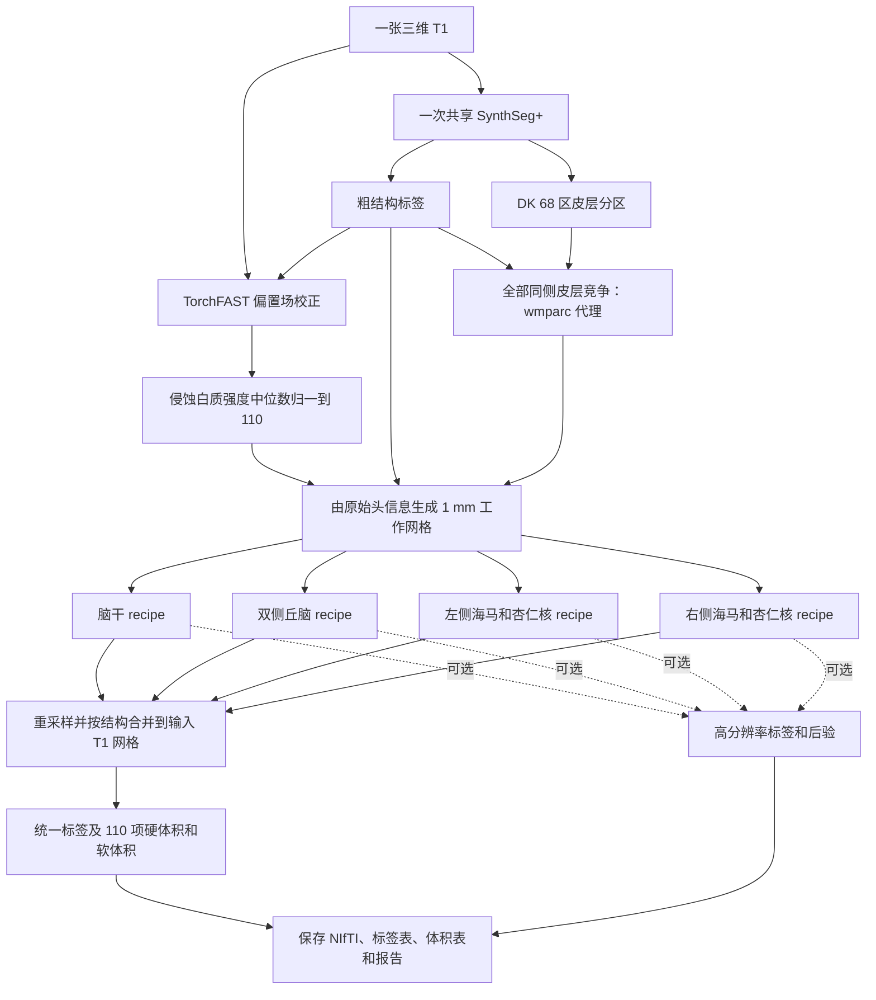
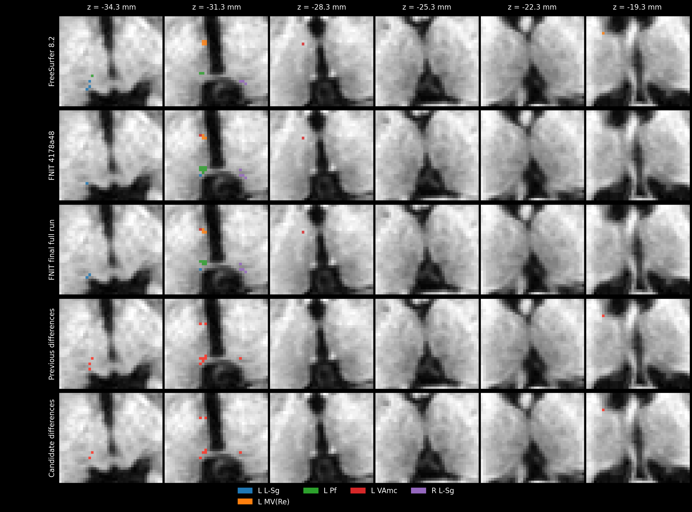
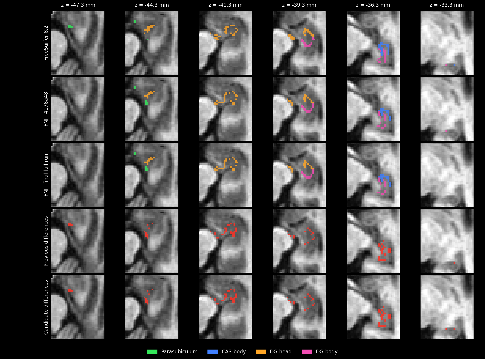
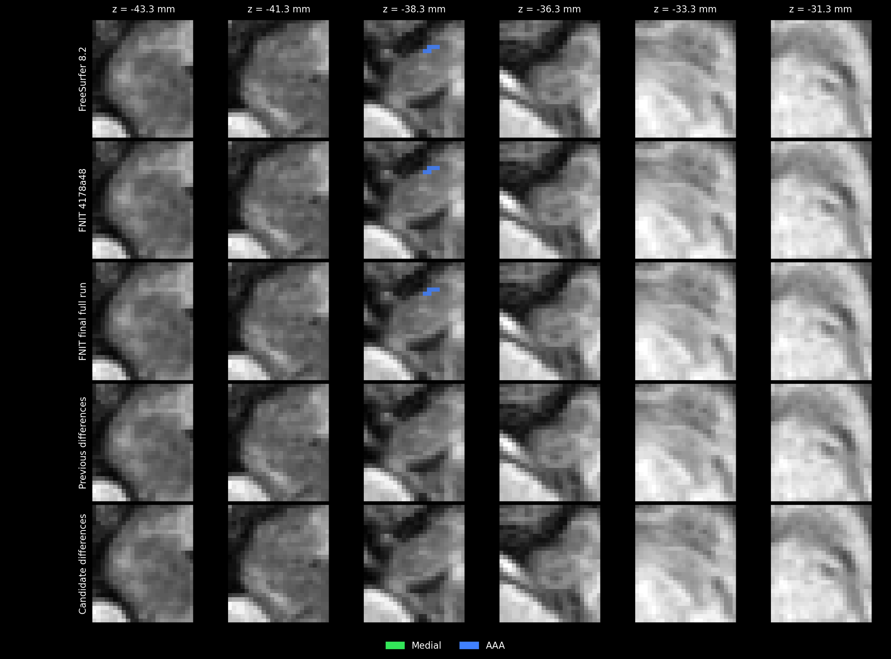
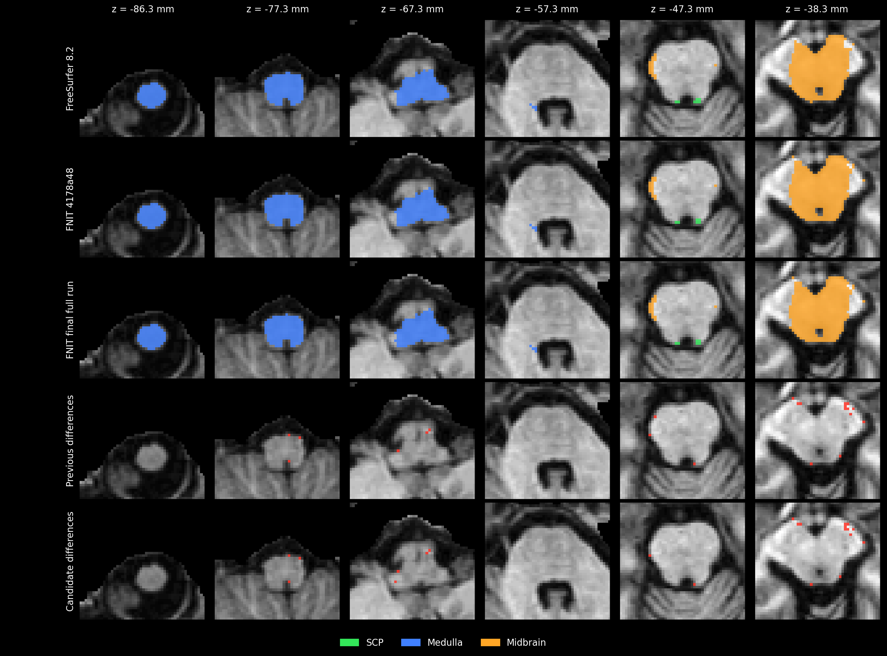
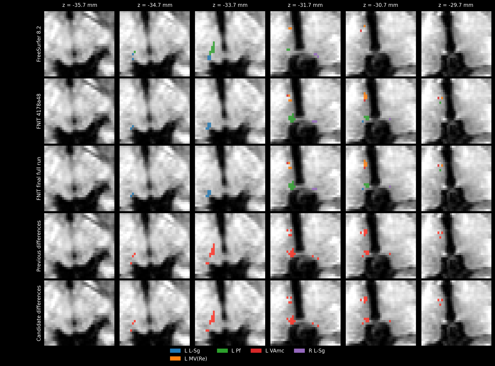
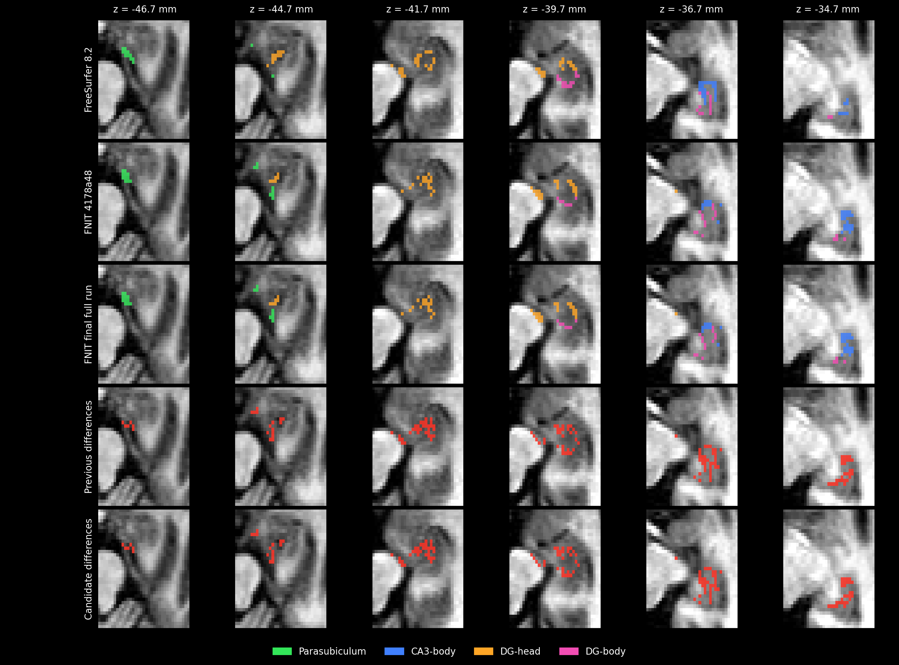
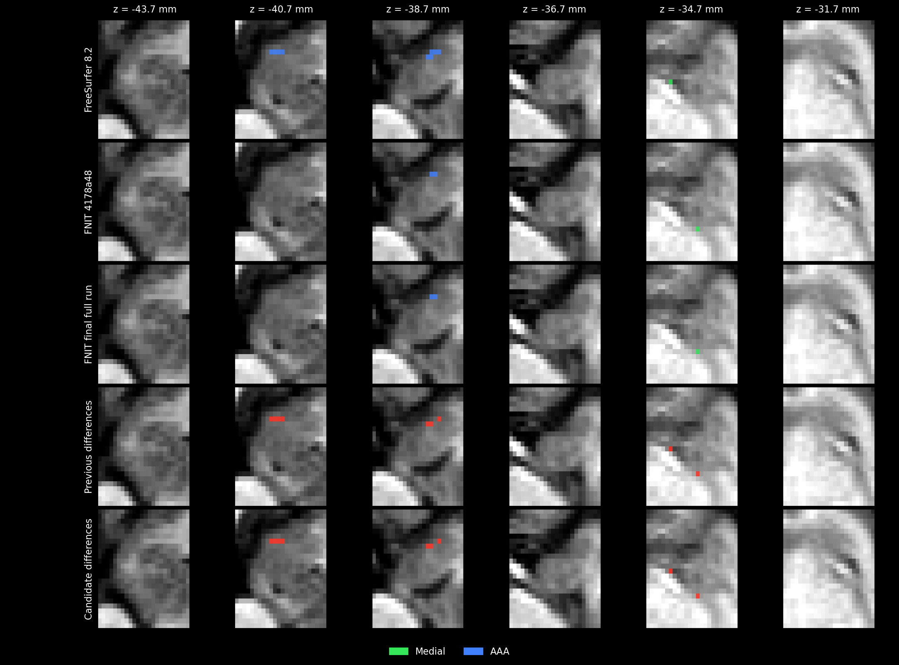
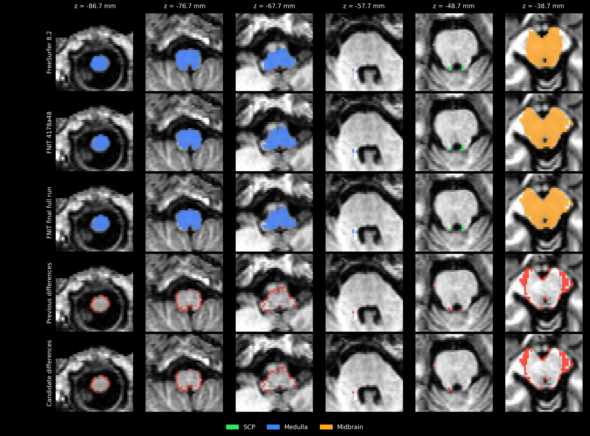

# 四类脑亚区分割：`segment_4_subregions`

[返回首页](../../README.md) · [真实数据验证](../../validation/subregions/README.md) · [完整 benchmark](../../validation/subregions/reproducibility_20261002/README.md)

输入一张三维 T1，一次完成脑干、双侧丘脑、双侧海马和杏仁核分割。返回与输入 T1 **形状和 affine 相同**的 `int32` 标签图，以及标签表、硬体积、软体积和各结构的高分辨率结果；设置 `output_dir` 后自动保存。默认全部结构共有 **110 项亚区统计**，其中某些小亚区在原始 T1 网格上可能没有硬标签体素。

支持 CPU 和 GPU。CUDA 默认使用 FP32/TF32；脑干的小矩阵运算局部使用准确 FP32，梯度归约、标量累计和优化器状态使用 FP64，不使用 FP16。计算与读写分别使用项目的 PyTorch 实现和 Nibabel，运行时不调用 FreeSurfer 或 FSL。

## 从一张 T1 到完整结果

默认 `structures="all"` 时，共享一次 SynthSeg+，取得粗结构标签和 Desikan–Killiany（DK）68 区皮层分区。全部同侧皮层分区在同侧白质内竞争最近邻，生成海马强度模型需要的 `wmparc` 代理。自动粗分割后复用 TorchFAST 校正偏置场，将侵蚀白质的强度中位数归一到 110，并从 T1 自身头信息生成 1 mm 冠状工作网格。随后依次拟合四项结构；每项完成后将详细结果移到 CPU，再处理下一项。



丘脑在 0.5 mm、海马/杏仁核在约 0.333 mm 网格上拟合。各结构先生成处理网格标签并执行支持范围筛选，再将标签、置信度和支持掩膜以最近邻共同映射到原始 T1，按重叠处的置信度合并；硬体积按原始 T1 的体素体积统计。这沿用官方标准标签输出的网格顺序。平均体素间距小于 0.99 mm 的输入保留高分辨率网格；侵蚀白质正样本不足 100 个时保留输入并在报告中记录原因。图中四个 recipe 表示数据流，实际依次运行。

已有同网格的粗标签、皮层分区或 `wmparc` 可直接传入。提供 `coarse_segmentation` 时按已准备的 T1 直接拟合，跳过自动强度校正和 1 mm 网格准备；官方同阶段对照传入 `norm/aseg/wmparc`。只选脑干或丘脑且未提供粗标签时，使用一次 SynthSeg；提供全部所需标签后不再运行模型。

## Python 调用、输入输出与参数

```python
from fnit import segment_4_subregions

subregion_result = segment_4_subregions(
    t1="/absolute/path/sub-01_T1w.nii.gz",       # 输入：一张原始三维 T1
    atlas_root=None,                            # 输入：None 使用 FNIT 图谱缓存
    structures="all",                          # 输入：默认全部结构，也可选择单项或列表
    coarse_segmentation=None,                  # 输入：可选的同网格粗结构标签
    cortical_parcellation=None,                # 输入：可选的同网格 DK 68 区皮层标签
    wmparc=None,                               # 输入：可选的同网格白质分区，提供时直接使用
    synthseg_weights=None,                     # 输入：可选的 SynthSeg 权重文件或目录
    synthseg_parc_weights=None,                # 输入：可选的 SynthSeg+ 皮层权重文件或目录
    device="cuda:0",                           # 输入：GPU 设备；也支持 "cpu"
    threads=4,                                 # 输入：PyTorch CPU 线程数
    optimization="fast",                       # 输入：速度优先配置；另一选项为 "balanced"
    output_dir="/absolute/path/sub-01_subregions",  # 输出：标签、体积表和报告目录
    save_highres=True,                         # 输出：保存各结构工作网格的标签
    save_posteriors=False,                     # 输出：后验图较大，按需设为 True
)

native_label_path = subregion_result.output_files["labels"]  # 输出：原 T1 网格标签路径
pons_mask = subregion_result.mask("Pons")                    # 输出：与 T1 同形状的脑桥布尔掩膜
left_ca1_head_mask = subregion_result.mask("Left-CA1-head")  # 输出：左侧 CA1 头部掩膜
print(native_label_path)
```

### 参数

| 参数 | 默认值 | 含义 |
|---|---|---|
| `t1` | 必填 | 原始三维 T1 路径或 Nibabel 图像。无需预先执行 `recon-all`。 |
| `atlas_root` | `None` | 图谱根目录。省略时使用 FNIT 缓存，缺失时按资源清单下载并准备。 |
| `structures` | `"all"` | 可选 `"brainstem"`、`"thalamus"`、`"hippo-amygdala-left"`、`"hippo-amygdala-right"`，或这些名称的列表；`"hippo-amygdala"` 同时选择左右两侧。默认运行全部四项。 |
| `coarse_segmentation` | `None` | 同 T1 网格的 `aseg` 或 SynthSeg 粗标签；可为路径、Nibabel 图像或三维数组。省略时自动生成并执行强度与工作网格准备；提供时直接使用已准备的 T1。 |
| `cortical_parcellation` | `None` | 同 T1 网格的 DK 皮层标签，支持路径、Nibabel 图像或三维数组。全部同侧 DK 标签竞争生成白质代理；海马强度模型从对应颞叶白质 3006/3007/3016 及右侧 4006/4007/4016 取样。省略且需要代理时由 SynthSeg+ 生成。 |
| `wmparc` | `None` | 同 T1 网格的白质分区，支持路径、Nibabel 图像或三维数组。提供时海马强度模型直接使用，不再生成白质代理。 |
| `synthseg_weights` | `None` | SynthSeg 模型权重文件或目录。省略时解析 FNIT 权重配置，并在需要时下载和校验。 |
| `synthseg_parc_weights` | `None` | SynthSeg+ 皮层分区权重文件或目录；仅在需要自动皮层分区时读取。 |
| `device` | `"cuda:0"` | PyTorch 计算设备，例如 `"cuda:1"` 或 `"cpu"`。CUDA 默认启用 TF32。 |
| `threads` | `4` | PyTorch CPU 线程数，必须至少为 1；GPU 运行中的 CPU 准备步骤也使用此设置。 |
| `optimization` | `"fast"` | `"fast"` 速度优先；`"balanced"` 使用更多网格更新和更严格的停止阈值。两者均保留工作网格和最终输出分辨率；更多迭代不保证每个区域的精度提高，详见下文。 |
| `output_dir` | `None` | 自动保存目录。省略时返回内存结果，也可稍后调用 `subregion_result.save(output_dir)`。 |
| `save_highres` | `True` | 保存每项结构的工作网格标签；仅在保存结果时生效。 |
| `save_posteriors` | `False` | 保存每项结构的后验 NIfTI；最后一维为标签通道，仅在保存结果时生效。 |

传入的标签图必须与 T1 形状和 affine 一致；数组没有 affine 信息，需由调用者确保来自相同网格。仅选部分结构时，只返回对应亚区的统计。

### 返回值与保存文件

`subregion_result.labels` 是原 T1 网格的 Nibabel 标签图。`label_table` 为 `{标签 ID: 名称}`；`label_metadata` 增加所属结构、图谱家族和半球。右侧海马/杏仁核标签采用原 ID 加 10000，避免左右冲突。

`subregion_result.volumes[标签 ID]` 包含 `hard_volume_mm3`（原 T1 网格硬标签体积）和 `soft_volume_mm3`（工作网格后验积分），单位均为 mm³。`confidence` 为拟合最大后验插值到处理网格后的置信度，再随标签以最近邻回到原始网格；它用于结构重叠处的选择。`structure_results` 保存各结构的高分辨率标签、后验、网格及 affine。`initialization` 记录共享预处理来源、模型调用次数、偏置与归一化参数、结构拟合、耗时和 GPU 峰值。

设置 `output_dir` 后生成：

```text
sub-01_subregions/
├── subregions_native.nii.gz       # 原 T1 网格 int32 合并标签
├── labels.tsv                    # 标签 ID、名称、所属结构、半球和来源
├── volumes.tsv                   # 每项亚区的硬体积和软体积
├── report.json                   # 输入、几何、参数、耗时、显存和数值检查
└── highres/                      # 可选：四项工作网格标签和后验
    ├── brainstem.nii.gz
    ├── thalamus.nii.gz
    ├── hippo-amygdala-left.nii.gz
    └── hippo-amygdala-right.nii.gz
```

`save_posteriors=True` 时，`highres/` 另存各结构的 `*_posterior.nii.gz`，通道顺序对应该图谱的 `compressionLookupTable.txt`。`output_files` 给出所有已保存文件的绝对路径。`timings["compute_seconds"]` 包括预处理、拟合和合并；`timings["save_seconds"]` 包括影像和表格读写，报告 JSON 的最终序列化和落盘不计入此项。

### CPU、GPU 与速度配置

| 配置 | `fast`（默认） | `balanced` |
|---|---|---|
| 丘脑、海马/杏仁核强度拟合：每个外层迭代的网格更新上限 | 20 | 30 |
| 丘脑网格数据项 | 各阶段使用全部有效体素 | 各阶段使用全部有效体素 |
| 海马/杏仁核网格数据项 | 各阶段使用全部有效体素 | 各阶段使用全部有效体素 |
| Gaussian EM 与最终标签、后验 | 完整工作网格 | 完整工作网格 |
| 停止条件 | 速度优先 | 更严格 |

图谱先验平滑、部分容积模拟、Gaussian EM 和网格拟合支持 GPU，默认环境已包含所需依赖。图谱加载、裁剪、三次插值、部分形态学、白质标签传播和最终 Nibabel 重采样仍在 CPU；阶段控制和线搜索也包含 CPU 判断及 GPU 同步。整例时间包含这些步骤。实现与逐组件耗时见 [TorchGEMS](../../src/fnit/gems/core.py)及 [GPU 组件验证](../../validation/subregions/speed_v16/layout_components/README.md)。

合成标签拟合按各结构的阶段预算运行，脑干采用其独立配置；上表的 20/30 上限对应丘脑和海马/杏仁核的强度拟合。

海马部分容积准备修复了 NumPy 组织均值直接赋给 PyTorch 掩膜张量的兼容问题，均值与统计规则保留；测试覆盖薄结构分支。

### 图谱与权重准备

首次缺少 SynthSeg 权重或图谱时自动准备。资源优先从 [FNIT 固定 Release](https://github.com/weikanggong1/Fudan-Neuroimaging-toolkit/releases/tag/assets-v1)及其清单获取并校验大小、SHA-256；未获明确再分发许可的文件从原作者网站获取。离线运行前可执行：

```bash
# --model：下载并校验自动粗分割和皮层分区所需权重
fnit-setup-weights --model synthseg-plus

# --output-root：保存四类图谱的根目录；省略时使用 FNIT 缓存
# --device：图谱准备计算设备；--asset-dir 可另指定已经校验的资产目录
fnit-setup-subregion-atlases --output-root /absolute/path/subregion_atlases --device cpu
```

图谱目录为 `brainstem/`、`thalamus/`、`hippo-amygdala-left/` 和 `hippo-amygdala-right/`。原始图谱文件及校验值见 [资源清单](../../src/fnit/recon_all/assets.py)，模型下载与离线配置见 [权重说明](../WEIGHTS.md)。丘脑和海马先验在个体仿射变换后的参考网格上平滑。

## 命令行

```bash
# --i：原始 T1；--o：原网格合并标签；--structure：结构，可重复指定
# --device：CPU/GPU；--threads：CPU 线程数；--optimization：fast 或 balanced
# --output-dir：标签表、体积表和报告目录；--save-highres：保存工作网格标签
fnit segment-4-subregions --i /absolute/path/sub-01_T1w.nii.gz \
  --o /absolute/path/sub-01_subregions/subregions_native.nii.gz \
  --structure all --device cuda:0 --threads 4 --optimization fast \
  --output-dir /absolute/path/sub-01_subregions --save-highres
```

`--atlas-root`、`--coarse-segmentation`、`--cortical-parcellation`、`--wmparc`、`--synthseg-weights` 和 `--synthseg-parc-weights` 对应 Python 参数。`--save-posteriors` 另存工作网格后验，`--report-json` 可再指定报告路径。仅需原网格标签时可省略输出目录和保存开关。

## 原软件调用

以下是 **FreeSurfer 的参考命令**。官方流程先完成 `recon-all`，再读取该 subject 的 `norm.mgz`、`aseg.mgz` 和海马所需的 `wmparc.mgz`：

```bash
segment_subregions brainstem --cross fs_sub01 --sd /absolute/path/subjects --threads 4
segment_subregions thalamus --cross fs_sub01 --sd /absolute/path/subjects --threads 4
segment_subregions hippo-amygdala --cross fs_sub01 --sd /absolute/path/subjects --threads 4
```

相同阶段的精度对照需向 FNIT 传入同一组 `norm/aseg/wmparc`；从原始 T1 自动预处理的整例验证另行报告。原实现见 [FreeSurfer 源码](https://github.com/freesurfer/samseg/tree/2ce2b6be69f2954ea704e593a5be79c284a3a8c3/samseg/subregions)和 [官方使用说明](https://surfer.nmr.mgh.harvard.edu/fswiki/SubregionSegmentation)。


## 最新精度、运行时间与脑图

2026-10-02，使用同一例公开去面部 T1（OpenNeuro ds000114，CC0）核查重复性，并重新运行官方细分割。输入、运行源码、图谱和模型均核对大小与 SHA-256；数据许可见[来源](../../examples/data/SOURCES.json)。FNIT 使用共享 H100、4 线程、FP32/TF32，自身进程显存限制为 19,073 MiB。

**同阶段输入**使用相同的官方 `norm/aseg/wmparc`。**原始 T1**由 FNIT 内部完成 SynthSeg+、TorchFAST、白质归一化、工作网格准备和四类分割。官方使用已安装的 FreeSurfer 8.2.0-1 / SAMSEG `0.5a0+17.g2ce2b6b`，固定 4 线程，三个独立进程重复运行脑干、丘脑和双侧海马/杏仁核。

本轮三次官方结果逐体素一致，却与旧存档参考不同。旧文件缺少闭环的生成时输入与源码哈希；新旧 shape/affine 完全相同，也不能把差异解释为网格相位。[旧参考来源核查](../../validation/subregions/reproducibility_20261002/old_vs_fresh_reference_audit.md)保留证据。下面全部使用本轮已核验的官方结果，历史记录分别标明参考来源。

### 官方与 FNIT 重复性

官方使用固定 `norm/aseg/wmparc`，重复运行三次细分割。FNIT 优化前实现 `4178a48` 与最终实现，各对同阶段和原始 T1 运行三个独立进程，每次均为 `structures="all"`；不混用完整流程和单独结构调用。最终 FNIT 的原网格及固定官方高分辨率网格共 440 项逐标签统计：421 项非空标签的最低重复 Dice 为 1，19 项空标签记为 NA。最终全部硬标签零体素差异，软体积三次逐值相同、最大 CV 为 0。

| 家族 | 官方重复最低 Dice | 最终 FNIT 同阶段重复 Dice | 最终 FNIT 原始 T1 重复 Dice | 最多不同体素 |
|---|---:|---:|---:|---:|
| 脑干 | 1.000000 | 1.000000 | 1.000000 | 0 |
| 丘脑细核 | 1.000000 | 1.000000 | 1.000000 | 0 |
| 左/右海马 | 1.000000 | 1.000000 | 1.000000 | 0 |
| 左/右杏仁核 | 1.000000 | 1.000000 | 1.000000 | 0 |

表中原网格结果与高分辨率结果一致。优化前脑干同阶段最多相差 14 / 102 个原网格 / 高分辨率体素，原始输入最多 10 / 104 个；最终全部为零。**自身硬标签波动达到本轮官方观察范围。** 按照允许部分体素差异的验收要求，稳定但跨软件 Dice 较低的区域可以保留；这种固定差异不称为官方随机波动。19 项空标签中，原始 T1 的高分辨率左 VM 为官方 1 个体素、FNIT 0 个，跨实现 Dice 为 0；其软体积为官方 14.4602、FNIT 14.2063 mm³，不将空标签记成 Dice 1。三次重复代表这例数据、固定版本和参数下的观察范围。

官方 GEMS 按固定线程数分配 tetrahedra 并按固定顺序归约；更改线程数可能改变浮点计算路径，不能把参数变化当作同条件随机范围。本次官方 Python 拟合没有随机初始化或 seed 选项；默认 `mri_robust_register` 不启用随机子采样。见[固定版本源码审计](../../validation/subregions/reproducibility_20261002/official_source_review.md)及[最终逐标签统计](../../validation/subregions/reproducibility_20261002/final_all_analysis/final_roi_metrics.tsv)。

### 最终完整流程精度

以下为官方体积加权的细标签 Dice，三次完整运行的结果相同；高分辨率统计使用固定官方轴向、间距和整数网格相位。原始 T1 对照包含 FNIT 与官方预处理的差异。

| 家族 | 同阶段原网格 | 同阶段高分辨率 | 原始 T1 原网格 | 原始 T1 高分辨率 |
|---|---:|---:|---:|---:|
| 脑干 | 0.991459 | 0.991916 | 0.945630 | 0.944731 |
| 丘脑细核 | 0.970813 | 0.972354 | 0.913447 | 0.917687 |
| 左海马 | 0.894809 | 0.910508 | 0.821955 | 0.833139 |
| 右海马 | 0.828099 | 0.848762 | 0.731954 | 0.760335 |
| 左杏仁核 | 0.953639 | 0.955204 | 0.908820 | 0.913728 |
| 右杏仁核 | 0.929114 | 0.933789 | 0.868434 | 0.891597 |

### 本轮精度修复

丘脑 fast 原先在三个平滑层只取固定四分之一体素计算 mesh 数据项。现改为全部有效体素，保留原有细网格、EM、停止条件与拟合预算。最终完整四结构运行的同阶段原网格加权 Dice 为 **0.953076→0.970813**，固定官方高分辨率网格为 **0.955107→0.972354**；左 L-Sg 为 **0.400→0.667**，左 VAmc 为 **0.600→0.889**。原网格包含四结构重叠处的合并选择，不能将单独丘脑调用的指标作为完整流程指标。

脑干的 CUDA 梯度原先通过原子加法累加，同条件重复存在少量体素波动。现对合成阶段的点和顶点梯度使用固定顺序归约，累计及优化器状态使用 FP64，并在需要时局部关闭 TF32。保持 Adam 40 步预算及全局 GPU 配置。

海马/杏仁核拟合参数保持 fast 默认。低 Dice 候选中，右 AAA 的原始细标签仍存在，但最大连通域筛选因约 0.47 mm 的一格间隙将其删除。现用半径一格的闭运算稳定**连通域选择掩膜**，再与原始细标签前景相交；不补入桥接体素，不改标签 ID。右侧更长拟合配合这个修复可恢复 AAA，但相同 balanced 配置使左侧海马 Dice 明显回退，因此未改变全局默认拟合预算。见[拓扑诊断](../../validation/subregions/reproducibility_20261002/hippo_topology_review.md)。

保留小幅回退：最终全流程同阶段右 AAA 原网格 Dice 保持 0.956522，高分辨率由 0.870890 降至 0.868800；原始 T1 分别保持 0.947368、由 0.847627 降至 0.839934。右 Medial 同阶段为 0.400，原始 T1 高分辨率为 0.186667，属于稳定的跨实现差异。旧“官方 AAA 硬标签接近空”的解释已撤回：本轮官方三次均为原网格 24 / 高分辨率 626 个体素。

### 完整流程 benchmark

| 流程 | 计算（含共享预处理、全部拟合与合并） | API（含保存） | 进程 wall |
|---|---:|---:|---:|
| FNIT 同阶段，三次完整运行 | 352.86–361.63 s（5.88–6.03 min） | 353.44–362.21 s | 399.02–410.61 s |
| FNIT 原始 T1，三次完整运行 | 259.99–348.20 s（4.33–5.80 min） | 260.65–348.87 s | 289.13–375.95 s |
| 官方同阶段，脑干＋丘脑＋双侧海马/杏仁核子流程合计 | 未单独记录 | 未单独记录 | 1474.19–1496.97 s（24.57–24.95 min） |

FNIT 使用共享 H100：两种输入分别固定同一张物理 GPU，4 线程，进程显存限制 19,073 MiB，采样自身显存峰值 9,726–16,468 MiB。官方三个重复各 4 线程、同时运行于共享 CPU。进程 wall 包括 Python 导入、CUDA 初始化、保存及评分；源码检查和 GPU 预算等待另记。计算/API 保留验证 context 回调开销，不减去局部子计时推算生产耗时。共享资源上的时间不作为独占硬件加速比。

历史完整 `recon-all -all -openmp 4` 耗时 4,727 s，保留输入与当前 T1 的体素逐值相同；加上本轮官方细分割得到分段时间合计 103.35–103.73 min。该合计不是本轮单次原始 T1 全流程重跑时间，见[来源核对](../../validation/subregions/reproducibility_20261002/reconall_historical_lineage_audit.json)。

#### 分步骤对照

分步时间来自实际 API 报告与官方日志；官方合成/强度时间包含该阶段准备，FNIT 分别记录准备和拟合。未独立计时的步骤保持缺测，不将总时间任意分配。完整字段见[分步骤计时表](../../validation/subregions/reproducibility_20261002/final_all_analysis/final_steps.tsv)。各结构结束时的原网格/高分辨率精度见上表；中间优化阶段没有共同保存的标签，阶段 Dice 记为未测。

| 结构 | 官方合成准备＋拟合 | FNIT 同阶段合成 | FNIT 原始 T1 合成 | 官方强度准备＋拟合 | FNIT 同阶段强度 | FNIT 原始 T1 强度 |
|---|---:|---:|---:|---:|---:|---:|
| 脑干 | 17 | 13.36–14.90 | 5.15–5.64 | 201–210 | 9.41–11.04 | 8.46–11.06 |
| 丘脑 | 85–89 | 30.98–45.26 | 24.97–27.45 | 298–311 | 62.43–67.37 | 41.90–56.95 |
| 左海马/杏仁核 | 75–77 | 52.57–57.56 | 35.06–74.88 | 251–257 | 43.78–47.83 | 34.90–49.19 |
| 右海马/杏仁核 | 69–72 | 49.56–50.92 | 29.75–35.94 | 219–229 | 39.97–45.95 | 31.78–37.82 |

单位为秒，FNIT 强度列为工作图准备与多层拟合之和。每项 recipe 总时间另含图谱读取、初始对齐和后处理：同阶段脑干 27.12–30.32、丘脑 102.15–111.51、左/右海马及杏仁核 107.36–108.50 / 95.26–101.59；原始 T1 分别为 16.46–19.97、70.17–85.62、74.99–134.07 / 66.85–78.11。recipe 总时间不能再与阶段列相加。官方初始化/对齐显式计时见[协议](../../validation/subregions/reproducibility_20261002/final_validation_protocol.md)，后处理无独立计时。

### 官方对照脑图

每幅图显示六层 RAS 轴位，保持真实毫米比例；标签使用最近邻，红色标出所示细标签 ID 差异。原始 T1 脑图在固定裁切及六个显示切片内，以正、有限 T1 的 2/98 百分位设定灰度窗，所有比较行共窗。显示重采样不改变原网格和固定官方高分辨率网格上的统计。

**同阶段：丘脑低 Dice 细核。**



**同阶段：右海马 CA3、DG、parasubiculum。**



**同阶段：右 AAA 与 Medial，使用全新官方参考。**



**同阶段：脑干 SCP、Medulla、Midbrain。**



**原始 T1：丘脑、右海马及右 AAA/Medial。**









## 最近版本 benchmark 记录

| 版本 | 官方参考 | 主要变化 |
|---|---|---|
| [v16 C6](../../validation/subregions/speed_v16/README.md) | 历史存档，生成来源未闭环核验 | 历史速度基线 |
| [入口整合与丘脑回溯修复](../../validation/subregions/segment_4_subregions/stability_fix/README.md) | 历史存档 | 统一公开入口，恢复稳定拟合 |
| [4178a48](../../validation/subregions/segment_4_subregions/raw_precision_analysis/README.md) | 旧指标保留在历史记录；本轮重新计算 | 双侧海马稳定拟合、TorchFAST、白质代理、标准类别图导出 |
| [本轮重复性与完整积分](../../validation/subregions/reproducibility_20261002/README.md) | 三次全新官方，输入/源码/图谱哈希已核验 | 同参数全流程重复验证、丘脑完整积分、脑干固定梯度归约、稳定连通域选择 |

历史 Dice 与本轮新参考的 Dice 不直接相减；共同参考下的前后比较使用本轮配对结果。该 benchmark 来自一例开发病例。

## Reference

- 脑干：[Iglesias 等，2015，*NeuroImage*](https://doi.org/10.1016/j.neuroimage.2015.02.065)。
- 丘脑：[Iglesias 等，2018，*NeuroImage*](https://pmc.ncbi.nlm.nih.gov/articles/PMC6215335/)。
- 海马：[Iglesias 等，2015，*NeuroImage*](https://doi.org/10.1016/j.neuroimage.2015.04.042)。
- 杏仁核：[Saygin 等，2017，*NeuroImage*](https://doi.org/10.1016/j.neuroimage.2017.04.046)。
- 粗分割：[Billot 等，2023，*Medical Image Analysis*](https://doi.org/10.1016/j.media.2023.102789)。
- 皮层分区：[Billot 等，2023，*PNAS*](https://doi.org/10.1073/pnas.2216399120)。
- [FreeSurfer 亚区原实现](https://github.com/freesurfer/samseg/tree/2ce2b6be69f2954ea704e593a5be79c284a3a8c3/samseg/subregions)及 [GEMS 形变先验实现](https://github.com/freesurfer/samseg/blob/2ce2b6be69f2954ea704e593a5be79c284a3a8c3/gems/kvlAtlasMeshPositionCostAndGradientCalculator.cxx)。
