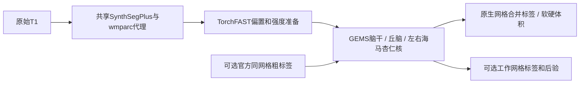

# 四类脑亚区分割：`segment_4_subregions`

[返回首页](../../README.md) · [完整旧文档与更早证据](../../validation/subregions/readme_archive_20261005.md)

| 项目 | 内容 |
|---|---|
| 输入 | 单幅原生3D T1w；可选同网格粗标签/皮层/wmparc |
| 输出 | 原生int32合并标签、110项软硬体积、可选HR/后验 |
| 对应原软件 | FreeSurfer recon-all＋segment_subregions三命令 |
| Python / CLI | fnit.segment_4_subregions；fnit segment-4-subregions |
| CPU / GPU | CPU/CUDA；PyTorch、Numba、nibabel，recipe顺序执行 |

<a id="2026-10-02-gpu-完整流程-benchmark"></a>

## 1. 功能简介

输入一张三维 T1，一次完成脑干、双侧丘脑、双侧海马和杏仁核分割。返回与输入 T1 **形状和 affine 相同**的 `int32` 标签图，以及标签表、硬体积、软体积和各结构的高分辨率结果；设置 `output_dir` 后自动保存。默认全部结构共有 **110 项亚区统计**，其中某些小亚区在原始 T1 网格上可能没有硬标签体素。

支持 CPU 和 GPU。CUDA 默认使用 FP32/TF32；脑干的小矩阵运算局部使用准确 FP32，部分梯度归约、标量累计和优化器状态使用 FP64，不使用 FP16。脑干 Adam 状态仍为 FP32；具体 recipe 的实际策略以报告为准。`precise_mesh_matrices` 字段目前仅记录请求，不能作为实际 FP64 矩阵计算的证据。计算与读写分别使用项目的 PyTorch 实现和 Nibabel，运行时不调用 FreeSurfer 或 FSL。

原始T1默认共享一次SynthSeg+，生成粗标签、DK68和白质代理，再用TorchFAST校正/归一化及图谱拟合。已有粗标签时按已准备T1直接拟合，跳过自动强度与1mm网格准备；同阶段对照用独立官方norm/aseg/wmparc。两种输入范围不可混为同一个benchmark。



<a id="python-调用输入输出与参数"></a>
<a id="参数"></a>
<a id="返回值与保存文件"></a>

## 2. Python 调用

```python
from fnit import segment_4_subregions

subregion_result = segment_4_subregions(
    t1="/absolute/path/sub-01_T1w.nii.gz",       # 输入：一张原始三维 T1
    atlas_root=None,                            # 输入：None 使用 FNIT 图谱缓存
    structures="all",                          # 输入：默认全部结构，也可选择单项或列表
    coarse_segmentation=None,                  # 输入：可选的同网格粗结构标签
    cortical_parcellation=None,                # 输入：可选的同网格 DK 68 区皮层标签
    wmparc=None,                               # 输入：可选的同网格白质分区，提供时直接使用
    synthseg_weights=None,                     # 输入：可选的 SynthSeg 权重文件或目录
    synthseg_parc_weights=None,                # 输入：可选的 SynthSeg+ 皮层权重文件或目录
    device="cuda:0",                           # 输入：GPU 设备；也支持 "cpu"
    threads=4,                                 # 输入：PyTorch CPU 线程数
    optimization="fast",                       # 输入：速度优先配置；另一选项为 "balanced"
    output_dir="/absolute/path/sub-01_subregions",  # 输出：标签、体积表和报告目录
    save_highres=True,                         # 输出：保存各结构工作网格的标签
    save_posteriors=False,                     # 输出：后验图较大，按需设为 True
)

native_label_path = subregion_result.output_files["labels"]  # 输出：原 T1 网格标签路径
pons_mask = subregion_result.mask("Pons")                    # 输出：与 T1 同形状的脑桥布尔掩膜
left_ca1_head_mask = subregion_result.mask("Left-CA1-head")  # 输出：左侧 CA1 头部掩膜
print(native_label_path)
```

### 输入数据格式

- `t1`：原始3D `(X,Y,Z)` `.nii`、`.nii.gz`、MGH/MGZ路径或nibabel SpatialImage；有效affine、orientation和体素间距，强度无固定单位，不需先recon-all。
- `coarse_segmentation`、`cortical_parcellation`、`wmparc`：路径、nibabel图或3D数组，shape/affine须同T1；数组无几何由调用者保证来源。分别为aseg/SynthSeg粗标签、DK68皮层编码、海马所需白质分区，均用整数编号。
- `atlas_root`：预先准备的BrainstemSS、ThalamicNuclei和HippoSF图谱目录；缺失时从原站校验下载。离线先运行fnit-setup-subregion-atlases并备齐SynthSeg权重。
- 自动前段由T1头信息生成1mm工作网格并按侵蚀白质中位数归一到110；平均间距<0.99mm保留高分辨率网格，样本不足100正值保留输入并记录。

### 完整公开参数

| 参数 | 必需 | 类型 | 默认值 | 含义 |
|---|---|---|---|---|
| `t1` | 是 | `str 或 Path 或 nib.spatialimages.SpatialImage` | `—` | 一幅原始 3D T1w；格式见输入数据格式 |
| `atlas_root` | 否 | `str 或 Path 或 None` | `None` | 准备好的亚区图谱根目录；None 使用 FNIT 缓存，缺失时下载准备 |
| `structures` | 否 | `str 或 list[str] 或 tuple[str, ...]` | `'all'` | all 或脑干、丘脑、左/右海马杏仁核名称及其列表；hippo-amygdala 选双侧 |
| `coarse_segmentation` | 否 | `str 或 Path 或 nib.spatialimages.SpatialImage 或 np.ndarray 或 None` | `None` | 同 T1 网格粗标签；有值时按已准备 T1 拟合，跳过自动强度/1mm准备 |
| `cortical_parcellation` | 否 | `str 或 Path 或 nib.spatialimages.SpatialImage 或 np.ndarray 或 None` | `None` | 同网格 DK68 皮层标签，用于生成白质代理 |
| `wmparc` | 否 | `str 或 Path 或 nib.spatialimages.SpatialImage 或 np.ndarray 或 None` | `None` | 同网格白质分区；提供时海马强度模型直接使用 |
| `synthseg_weights` | 否 | `str 或 Path 或 None` | `None` | 自动初始化的 SynthSeg 主分割模型文件或目录 |
| `synthseg_parc_weights` | 否 | `str 或 Path 或 None` | `None` | 自动初始化的 SynthSeg 皮层分区模型文件或目录 |
| `device` | 否 | `str 或 torch.device` | `'cuda:0'` | 计算设备，cpu 或 cuda:N；编号遵循 CUDA_VISIBLE_DEVICES |
| `threads` | 否 | `int 或 None` | `4` | 正整数CPU线程预算；具体每阶段并行度及恢复见输入说明 |
| `optimization` | 否 | `str` | `'fast'` | fast 速度优先；balanced 增加拟合迭代预算 |
| `output_dir` | 否 | `str 或 Path 或 None` | `None` | 结果或调试文件的目录；具体自动保存范围见输出 |
| `save_highres` | 否 | `bool` | `True` | 保存结构工作网格标签；Python 默认 True，CLI 需显式开启 |
| `save_posteriors` | 否 | `bool` | `False` | 保存末维为标签通道的工作网格后验 |

### 输出

```text
sub-01_subregions/
├── subregions_native.nii.gz       # 原 T1 网格 int32 合并标签
├── labels.tsv                    # 标签 ID、名称、所属结构、半球和来源
├── volumes.tsv                   # 每项亚区的硬体积和软体积
├── report.json                   # 输入、几何、参数、耗时、显存和数值检查
└── highres/                      # 可选：四项工作网格标签和后验
    ├── brainstem.nii.gz
    ├── thalamus.nii.gz
    ├── hippo-amygdala-left.nii.gz
    └── hippo-amygdala-right.nii.gz
```

`save_posteriors=True` 时，`highres/` 另存各结构的 `*_posterior.nii.gz`，通道顺序对应该图谱的 `compressionLookupTable.txt`。`output_files` 给出所有已保存文件的绝对路径。`timings["compute_seconds"]` 包括预处理、拟合和合并；`timings["save_seconds"]` 包括影像和表格读写，报告 JSON 的最终序列化和落盘不计入此项。

`subregion_result.labels` 是原 T1 网格的 Nibabel 标签图。`label_table` 为 `{标签 ID: 名称}`；`label_metadata` 增加所属结构、图谱家族和半球。右侧海马/杏仁核标签采用原 ID 加 10000，避免左右冲突。

`subregion_result.volumes[标签 ID]` 包含 `hard_volume_mm3`（原 T1 网格硬标签体积）和 `soft_volume_mm3`（工作网格后验积分），单位均为 mm³。`confidence` 为拟合最大后验插值到处理网格后的置信度，再随标签以最近邻回到原始网格；它用于结构重叠处的选择。`structure_results` 保存各结构的高分辨率标签、后验、网格及 affine。`initialization` 记录共享预处理来源、模型调用次数、偏置与归一化参数、结构拟合、耗时和 GPU 峰值。

各工作网格与affine独立，丘脑0.5mm、海马/杏仁核约0.333mm；后验形状(X,Y,Z,C)、float32概率，通道顺序为图谱compressionLookupTable，save_posteriors=True才保存。原生标签int32、shape/affine同T1，背景0；右海马/杏仁核官方ID+10000避免左右冲突。各label ID和名称、家族/半球由labels.tsv给出。

高分辨率后验积分为soft_volume_mm3；原生硬体素×体素体积为hard_volume_mm3，二者单位mm³但定义不同。`output_files`记录保存路径，`mask(编号或名称)`返回原生shape的布尔数组；未传output_dir时内存返回，可`result.save(output_dir,save_highres=True,save_posteriors=False)`。

### 结果表格与单结构选择

| 文件 / 返回键 | 内容与读取方式 |
|---|---|
| `labels.tsv` / `label_table` | 标签ID、名称、parent、family、hemisphere、source；不输出背景行 |
| `volumes.tsv` / `volumes` | 标签ID与名称、结构/半球、硬体积和软体积，均为mm³ |
| `report.json` / `initialization` | 共享预处理、各recipe、模型来源、网格、时间和检查信息 |
| `report.json` / `fit_min_jacobians` | 各工作网格最小Jacobian；非有限值记null |
| `output_files` | 字符串键到绝对`Path`；highres/和posterior/键仅在保存时出现 |
| `input_source` | 输入路径字符串；内存影像可能没有来源路径 |

只处理部分结构时，参数使用固定名称。相同列表重复名称会去重，空列表或未知名称报错；`hippo-amygdala`展开为左右两项。

```python
selected_structures = ["brainstem", "thalamus"]  # 只拟合脑干和双侧丘脑
partial_subregion_result = segment_4_subregions(
    t1="/data/sub01_T1w.nii.gz",  # 一幅原始3D T1w
    atlas_root="/data/subregion_atlases",  # 已准备并校验的图谱根目录
    structures=selected_structures,  # 固定结构名称列表
    device="cpu",  # CPU设备，不设置CUDA策略
    threads=4,  # Torch预算；CPU调用同时限制并恢复Numba线程掩码
    output_dir="/data/sub01_partial",  # 标签、表格和报告保存目录
    save_highres=False,  # 只保存原生标签和表格
    save_posteriors=False,  # 不写较大的工作网格概率图
)
```

对已准备检查点做stage对照时，T1、coarse_segmentation、cortical_parcellation和wmparc必须来自同一被试、同一网格；传入粗标签会跳过自动前段。只提供wmparc不能自动切换为stage范围。

<a id="命令行"></a>

## 3. 命令行调用

```bash
fnit segment-4-subregions --i subject_T1w.nii.gz --o results/subregions_native.nii.gz \
  --output-dir results/subregions --device cuda:0 --threads 4 --save-highres
```

### fnit segment-4-subregions

| CLI 参数 | Python 参数 / 输出 | 含义 |
|---|---|---|
| `--i` / `-i` | `t1` | 输入影像路径 |
| `--o` / `-o` | `labels.save` | 原T1网格合并标签保存路径 |
| `--atlas-root` | `atlas_root` | 准备好的亚区图谱根目录；None 使用 FNIT 缓存，缺失时下载准备 |
| `--structure` | `structures` | all 或脑干、丘脑、左/右海马杏仁核名称及其列表；hippo-amygdala 选双侧 |
| `--coarse-segmentation` | `coarse_segmentation` | 同 T1 网格粗标签；有值时按已准备 T1 拟合，跳过自动强度/1mm准备 |
| `--cortical-parcellation` | `cortical_parcellation` | 同网格 DK68 皮层标签，用于生成白质代理 |
| `--wmparc` | `wmparc` | 同网格白质分区；提供时海马强度模型直接使用 |
| `--synthseg-weights` | `synthseg_weights` | 自动初始化的 SynthSeg 主分割模型文件或目录 |
| `--synthseg-parc-weights` | `synthseg_parc_weights` | 自动初始化的 SynthSeg 皮层分区模型文件或目录 |
| `--output-dir` | `output_dir` | 结果或调试文件的目录；具体自动保存范围见输出 |
| `--save-highres` | `save_highres` | 保存结构工作网格标签；Python 默认 True，CLI 需显式开启 |
| `--save-posteriors` | `save_posteriors` | 保存末维为标签通道的工作网格后验 |
| `--report-json` | `报告保存路径` | 另存处理报告JSON |
| `--device` | `device` | 计算设备，cpu 或 cuda:N；编号遵循 CUDA_VISIBLE_DEVICES |
| `--threads` | `threads` | 正整数CPU线程预算，默认4；CPU调用恢复Torch/Numba设置 |
| `--optimization` | `optimization` | fast 速度优先；balanced 增加拟合迭代预算 |

CLI与Python默认差异：Python save_highres=True，CLI默认False；两者device=cuda:0，threads=4。

<a id="原软件调用"></a>

## 4. 原软件调用

以下命令用于独立原软件参考环境；FNIT生产入口不执行它。

```bash
recon-all -i subject_T1w.nii.gz -s sub01 -sd reference/subjects -all -openmp 4
segment_subregions brainstem --cross sub01 --sd reference/subjects --threads 4
segment_subregions thalamus --cross sub01 --sd reference/subjects --threads 4
segment_subregions hippo-amygdala --cross sub01 --sd reference/subjects --threads 4
```

| FNIT参数 / 产物 | 原软件参数 / 产物 |
|---|---|
| structures=all | 三条segment_subregions命令（hippo-amygdala双侧） |
| t1 raw | 原软件recon-all的输入T1 |
| coarse_segmentation / wmparc | 官方aseg.mgz / wmparc.mgz；t1使用norm.mgz作stage对照 |
| threads | --threads；原始前段-openmp |
| optimization / output_dir / save_* | FNIT流程预算与结果保存，无一对一原开关 |

对应四结构、110亚区统计；Python自动前段与官方recon-all前段不同，粗标签/白质代理不是官方aseg/wmparc。图谱拟合按固定官方先验移植，整体结构靠近不能替代逐核团精度。参数对齐、对照来源和完整步骤见[官方协议](../../validation/subregions/ten_public_t1_20261002/official_protocol.md)。

<a id="从一张-t1-到完整结果"></a>
<a id="cpugpu-与速度配置"></a>
<a id="--output-root保存四类图谱的根目录省略时使用-fnit-缓存"></a>
<a id="--device图谱准备计算设备--asset-dir-可另指定已经校验的资产目录"></a>
<a id="--i原始-t1--o原网格合并标签--structure结构可重复指定"></a>
<a id="--devicecpugpu--threadscpu-线程数--optimizationfast-或-balanced"></a>
<a id="--output-dir标签表体积表和报告目录--save-highres保存工作网格标签"></a>
<a id="-i同一公开-t1-ssubject-名-sd独立-subjects-目录"></a>
<a id="-all完整官方预处理-openmp每例-cpu-线程数"></a>
<a id="精度运行时间与脑图"></a>
<a id="2026-10-04同节点-cpu-与受影响-gpu-回归"></a>
<a id="2026-10-02十例-gpu-与官方对照"></a>
<a id="六区域原网格精度"></a>
<a id="全部十例"></a>
<a id="新九例排除开发用-sub-01"></a>
<a id="实际分步骤时间"></a>
<a id="官方对照脑图"></a>

<a id="最新精度运行时间与脑图"></a>

## 5. 最新精度和运行时间

2026-10-05 的[CPU 网格数据项诊断](../../validation/smri_cpu/gems_cpu_objective_20261005/README.md)确认，平滑阶段的零质量 alpha 会使额外 prior 归一化改变梯度。验证性 raw 闭包在真实阶段 initial/1/3/37 的同点评分通过，但 37 步轨迹仍与官方不同，未进入默认实现或完整亚区分割。它还依赖 CPU epsilon、FP64 几何和私有线搜索等共同前提；当前主版本不能通过单改归一化获得该结果。下面的最终分割指标仍属于其注明的历史源码，没有以同点梯度门替代逐区 Dice/体积验收。

最新2026-10-04 raw CPU全结构正式测量使用公开CC0 ds000114 snapshot1.0.2一例原始T1，冻结00fedf3544/v5，参考FreeSurfer8.2.0-1保存亚区输出；其norm/aseg/wmparc已与本轮同T1官方CPU recon核验数组/几何同。CPU评测节点 Xeon Gold6418H同8物理核、Torch/Numba8线程、CPUfloat32并保留既有FP64累加；源码1257文件和图谱权重SHA见[身份及结果](../../validation/smri_cpu/task5/raw_all_cpu_v5/README.md)。

新增[首次目标函数同状态诊断](../../validation/smri_cpu/gems_first_state_20261004/README.md)：官方在 `Σ prior × likelihood` 后加 `1e-15`，生产 compact objective 原来缺少该项。相同 FP32 输入上，左/右 HA 原完整梯度相对差为 0.377/0.252；加入 epsilon 后约为 6.27e−6/1.37e−4。剩余小 prior 的误差会放大，CPU 混合内部几何探针将梯度差降到约 4e−8。该报告仅含隔离诊断；CPU 混合内部精度完整候选已跑完但未通过逐区验收，未接入默认，详见[全部 recipe 报告](../../validation/smri_cpu/gems_cpu_epsilon_20261004/README.md)，原 GPU fallback/Triton 的同项差异也尚未修复。

### 端到端 benchmark

| 指标 | FNIT | 原软件 | 差异 |
|---|---|---|---|
| raw全进程wall | 6241.435 s | 未测单次同范围raw全链 | 不相加不同官方命令计时 |
| raw API / 采样RSS | 6238.458 s /21.647GB | 保存参考用于评分 | 13项约定输出齐全 |
| 原网格110区门 | 4通过 /101未通过 /5双方空NA | Dice≥0.95及硬体积差≤5% | raw未通过逐区等价 |
| HR110区门 | 5通过 /102未通过 /3NA | 同固定门 | 不剔除小区 |
| 官方检查点stage脑干 / 丘脑 /海马完整wall | 764.691 /2464.294 /3455.410 s | 205.553 /275.893 /442.305 s | stage另范围；均未达到速度目标 |

### 分步骤 benchmark

| 阶段 | FNIT | 原软件 |
|---|---|---|
| raw共享预处理 | 162.214 s | 未记录同边界 |
| raw脑干 /丘脑 | 643.776 /2245.035 s | stage计时不能替代raw |
| raw左 /右海马杏仁核 | 1583.290 /1563.757 s | 未记录同边界 |
| raw保存 | 29.235 s | 未记录同边界 |

父阶段包含子步骤，不能重复累加。stage脑干4/4区通过，丘脑29/45非空区、左右海马杏仁核3/28及1/28区通过；raw差异包含自动预处理及拟合。GPU完整旧新回归峰值allocated/reserved5.649/6.954GB属于冻结v2，不能代替v5全结构GPU正式验收。旧十例GPU结果仅按f436de5/ac692bb保留第6节链接。


<a id="最近版本-benchmark-记录"></a>

## 6. 最近版本和 benchmark

成熟 GEMS Gaussian 子函数曾在未提供超参数时错误广播 `[C,M] / [C]`；已改为各类、各模态除以对应样本质量，返回 `[C,M]` 均值。现有四个亚区 recipe 的强度拟合提供超参数，合成拟合使用固定 Gaussian，因此不进入该错误分支。CPU 固定 EM 数据缓存无速度或内存收益，裁剪插值候选使部分 GPU 亚区退步，两者未接入默认；实际状态和被撤回补丁见[本轮 GEMS 记录](../../validation/smri_cpu/gems_fixes_20261004/README.md)。

| 日期 | commit / version | 变化 | benchmark |
|---|---|---|---|
| 2026-10-04 | 00fedf3544/v5 | 大T1投影修复后raw完整CPU执行及评分 | 上节13产物、110区门与脑图 |
| 2026-10-04 | task5 v2/compact冻结 | CPU线程恢复及离散owner lookup/log-prior缓存 | [stage及GPU实测](../../validation/smri_cpu/task5/README.md) |
| 2026-10-02 | f436de5 raw /ac692bb stage | 固定十例独立raw回归与官方fresh对照 | [十例全区与新九例](../../validation/subregions/ten_public_t1_20261002/README.md) |
| 2026-10-02 | reproducibility冻结 | 丘脑完整积分、脑干归约与稳定连通域 | [单例重复性及精度修复](../../validation/subregions/reproducibility_20261002/README.md) |

每条记录保留真实冻结源码、输入与时间边界；逐例、debug/profiling和更早脑图见[完整归档](../../validation/subregions/readme_archive_20261005.md)。文档整理不重跑MRI，不把执行成功或--help核验作为精度benchmark。

<a id="图谱与权重准备"></a>
<a id="--model下载并校验自动粗分割和皮层分区所需权重"></a>
<a id="reference"></a>

## 7. 参考文献、原软件和资源

- 脑干：[Iglesias 等，2015，*NeuroImage*](https://doi.org/10.1016/j.neuroimage.2015.02.065)。
- 丘脑：[Iglesias 等，2018，*NeuroImage*](https://pmc.ncbi.nlm.nih.gov/articles/PMC6215335/)。
- 海马：[Iglesias 等，2015，*NeuroImage*](https://doi.org/10.1016/j.neuroimage.2015.04.042)。
- 杏仁核：[Saygin 等，2017，*NeuroImage*](https://doi.org/10.1016/j.neuroimage.2017.04.046)。
- 粗分割：[Billot 等，2023，*Medical Image Analysis*](https://doi.org/10.1016/j.media.2023.102789)。
- 皮层分区：[Billot 等，2023，*PNAS*](https://doi.org/10.1073/pnas.2216399120)。
- [FreeSurfer 亚区原实现](https://github.com/freesurfer/samseg/tree/2ce2b6be69f2954ea704e593a5be79c284a3a8c3/samseg/subregions)及 [GEMS 形变先验实现](https://github.com/freesurfer/samseg/blob/2ce2b6be69f2954ea704e593a5be79c284a3a8c3/gems/kvlAtlasMeshPositionCostAndGradientCalculator.cxx)。

模型使用下列官方原始文件，Git/wheel不包含。固定[assets-v1 Release](https://github.com/weikanggong1/Fudan-Neuroimaging-toolkit/releases/tag/assets-v1)及公开asset-manifest与当前weights.py逐项大小/SHA记录一致；本轮未重新下载所有大文件。安装器先Release再原站；完整清单见[资源文件清单](../RESOURCE_MANIFEST.md)。

```bash
fnit-setup-weights --model synthseg-plus --dest /data/fnit-weights
fnit-setup-weights --model synthseg-plus --dest /data/fnit-weights --verify-only
```

| 资源 | 用途 | 官方来源 | 大小 | SHA-256 | 是否允许 FNIT 再分发 |
|---|---|---|---|---|---|
| `synthseg_2.0.h5` | 官方推理权重 / 标签数组 | [原站](https://surfer.nmr.mgh.harvard.edu/pub/dist/freesurfer/repo/annex.git/annex/objects/bee/241/SHA256E-s53079152--f190bfd742f450ef3ca2c9df9ed4d2e0232b3a74471da5e51b7770bacdf80c3e.0.h5/SHA256E-s53079152--f190bfd742f450ef3ca2c9df9ed4d2e0232b3a74471da5e51b7770bacdf80c3e.0.h5) | 53,079,152 B | `f190bfd742f450ef3ca2c9df9ed4d2e0232b3a74471da5e51b7770bacdf80c3e` | 允许；FreeSurfer许可，保留条款与归属 |
| `synthseg_parc_2.0.h5` | 官方推理权重 / 标签数组 | [原站](https://surfer.nmr.mgh.harvard.edu/pub/dist/freesurfer/repo/annex.git/annex/objects/c04/403/SHA256E-s53090840--83bb1de76fb6f173c6dacacd433f81209fc6abb1dbc179a930ec06ecabbeb684.0.h5/SHA256E-s53090840--83bb1de76fb6f173c6dacacd433f81209fc6abb1dbc179a930ec06ecabbeb684.0.h5) | 53,090,840 B | `83bb1de76fb6f173c6dacacd433f81209fc6abb1dbc179a930ec06ecabbeb684` | 允许；FreeSurfer许可，保留条款与归属 |
| `synthseg_segmentation_labels_2.0.npy` | 官方推理权重 / 标签数组 | [原站](https://raw.githubusercontent.com/freesurfer/freesurfer/v8.2.0/mri_synthseg/synthseg_segmentation_labels_2.0.npy) | 348 B | `5ef25ec33fe917ac99f30b8f2185b2d77121136ee411b9c4970c0b59be615ed8` | 允许；FreeSurfer许可，保留条款与归属 |
| `synthseg_segmentation_names_2.0.npy` | 官方推理权重 / 标签数组 | [原站](https://raw.githubusercontent.com/freesurfer/freesurfer/v8.2.0/mri_synthseg/synthseg_segmentation_names_2.0.npy) | 7,168 B | `234eb6d514e10d6ebd748a8b30a1d12d9426fd874c607e37852406fae8f290fc` | 允许；FreeSurfer许可，保留条款与归属 |
| `synthseg_topological_classes_2.0.npy` | 官方推理权重 / 标签数组 | [原站](https://raw.githubusercontent.com/freesurfer/freesurfer/v8.2.0/mri_synthseg/synthseg_topological_classes_2.0.npy) | 348 B | `650b4b96834485c1e6d7421de4af74da80d861e6b2a39ef1164389bde3a5e14a` | 允许；FreeSurfer许可，保留条款与归属 |

本页列出的模型/数组共5个，106,177,856 B。原始文件许可及归属见[统一资源规则](../WEIGHTS.md#权重许可与归属)。模型推理从本地加载已准备资源。

皮层权重的Release清单official_url仍写annex p0/0f，当前源码使用c04/403；大小与SHA一致。此页采用当前源码原站地址，清单URL差异不当作模型字节变化。

亚区图谱先准备为atlas_root；默认首次运行缺失时自动下载主分割权重/图谱并校验。离线预先执行：

```bash
fnit-setup-subregion-atlases --output-root /data/subregion_atlases --device cpu
```

| 资源 | 用途 | 官方来源 | 大小 | SHA-256 | 是否允许 FNIT 再分发 |
|---|---|---|---|---|---|
| `average/BrainstemSS/atlas/AtlasMesh.gz` | 形变先验/参考网格/标签表 | [原站](https://surfer.nmr.mgh.harvard.edu/pub/dist/freesurfer/repo/annex.git/annex/objects/0e1/ab4/SHA256E-s1726705--90b0c6a6ade8aa388ef7c682b652ffc6bbd602271fd6b6068f47197514b2df3f.gz/SHA256E-s1726705--90b0c6a6ade8aa388ef7c682b652ffc6bbd602271fd6b6068f47197514b2df3f.gz) | 1,726,705 B | `90b0c6a6ade8aa388ef7c682b652ffc6bbd602271fd6b6068f47197514b2df3f` | 图谱未逐文件确认；仅原站，不镜像 |
| `average/BrainstemSS/atlas/AtlasDump.mgz` | 形变先验/参考网格/标签表 | [原站](https://surfer.nmr.mgh.harvard.edu/pub/dist/freesurfer/repo/annex.git/annex/objects/348/313/SHA256E-s48827--14523eaf5e7f596be68d251a50f98ef277f5b7ef8904cca786a3efef8e9e3e7f.mgz/SHA256E-s48827--14523eaf5e7f596be68d251a50f98ef277f5b7ef8904cca786a3efef8e9e3e7f.mgz) | 48,827 B | `14523eaf5e7f596be68d251a50f98ef277f5b7ef8904cca786a3efef8e9e3e7f` | 图谱未逐文件确认；仅原站，不镜像 |
| `average/BrainstemSS/atlas/compressionLookupTable.txt` | 形变先验/参考网格/标签表 | [原站](https://github.com/freesurfer/freesurfer/tree/d932c45b7941662ea380a05efef580568b98d41a/distribution/average/BrainstemSS/atlas) | 1,291 B | `8c343757d9ee13ed2d02daeb5f5f5fc764a6adb850b19b9d1b0ad352c96ca15b` | 随包LUT；保留FreeSurfer条款 |
| `average/ThalamicNuclei/atlas/AtlasMesh.gz` | 形变先验/参考网格/标签表 | [原站](https://surfer.nmr.mgh.harvard.edu/pub/dist/freesurfer/repo/annex.git/annex/objects/b45/20f/SHA256E-s6844185--7bb5954c43885ddace887fe5fa8e0c0cdcd3bea41beb6185f48a1784e451bd08.gz/SHA256E-s6844185--7bb5954c43885ddace887fe5fa8e0c0cdcd3bea41beb6185f48a1784e451bd08.gz) | 6,844,185 B | `7bb5954c43885ddace887fe5fa8e0c0cdcd3bea41beb6185f48a1784e451bd08` | 图谱未逐文件确认；仅原站，不镜像 |
| `average/ThalamicNuclei/atlas/AtlasDump.mgz` | 形变先验/参考网格/标签表 | [原站](https://surfer.nmr.mgh.harvard.edu/pub/dist/freesurfer/repo/annex.git/annex/objects/91d/ce3/SHA256E-s839824--c6bb408e519ebd5fc520dd98da044493f34cb14747f7229fbed224598d129758.mgz/SHA256E-s839824--c6bb408e519ebd5fc520dd98da044493f34cb14747f7229fbed224598d129758.mgz) | 839,824 B | `c6bb408e519ebd5fc520dd98da044493f34cb14747f7229fbed224598d129758` | 图谱未逐文件确认；仅原站，不镜像 |
| `average/ThalamicNuclei/atlas/compressionLookupTable.txt` | 形变先验/参考网格/标签表 | [原站](https://github.com/freesurfer/freesurfer/tree/d932c45b7941662ea380a05efef580568b98d41a/distribution/average/ThalamicNuclei/atlas) | 2,130 B | `9f480319b803a2c44606c6595c46a26fbb74726bdc800e88b443011fedb175ff` | 随包LUT；保留FreeSurfer条款 |
| `average/HippoSF/atlas/AtlasMesh.gz` | 形变先验/参考网格/标签表 | [原站](https://surfer.nmr.mgh.harvard.edu/pub/dist/freesurfer/repo/annex.git/annex/objects/690/843/SHA256E-s19911600--fafd5b5a005df3a6dcacf544b164ac6692132f1a1c078d66f8d0484d1022225c.gz/SHA256E-s19911600--fafd5b5a005df3a6dcacf544b164ac6692132f1a1c078d66f8d0484d1022225c.gz) | 19,911,600 B | `fafd5b5a005df3a6dcacf544b164ac6692132f1a1c078d66f8d0484d1022225c` | 图谱未逐文件确认；仅原站，不镜像 |
| `average/HippoSF/atlas/AtlasDump.mgz` | 形变先验/参考网格/标签表 | [原站](https://surfer.nmr.mgh.harvard.edu/pub/dist/freesurfer/repo/annex.git/annex/objects/bc6/434/SHA256E-s366711--a46221d8efcd5dc5f6488bc4fe9e8a2435cf42ec21ce1f85bbd1e3947f793e2d.mgz/SHA256E-s366711--a46221d8efcd5dc5f6488bc4fe9e8a2435cf42ec21ce1f85bbd1e3947f793e2d.mgz) | 366,711 B | `a46221d8efcd5dc5f6488bc4fe9e8a2435cf42ec21ce1f85bbd1e3947f793e2d` | 图谱未逐文件确认；仅原站，不镜像 |
| `average/HippoSF/atlas/compressionLookupTable.txt` | 形变先验/参考网格/标签表 | [原站](https://github.com/freesurfer/freesurfer/tree/d932c45b7941662ea380a05efef580568b98d41a/distribution/average/HippoSF/atlas) | 2,595 B | `5962518cb188de252a03796cf04ea8991cd444907b7733b14fc501cd898da362` | 随包LUT；保留FreeSurfer条款 |

右侧HippoSF复用同一官方图谱并按右侧recipe生成；平滑数组为FNIT准备产物。AtlasMesh/AtlasDump仅原站；三个标签查找表已随包按原文件大小/SHA校验。逐文件清单见[assets.py](../../src/fnit/recon_all/assets.py)，不将LUT许可推广为第三方图谱镜像许可。
