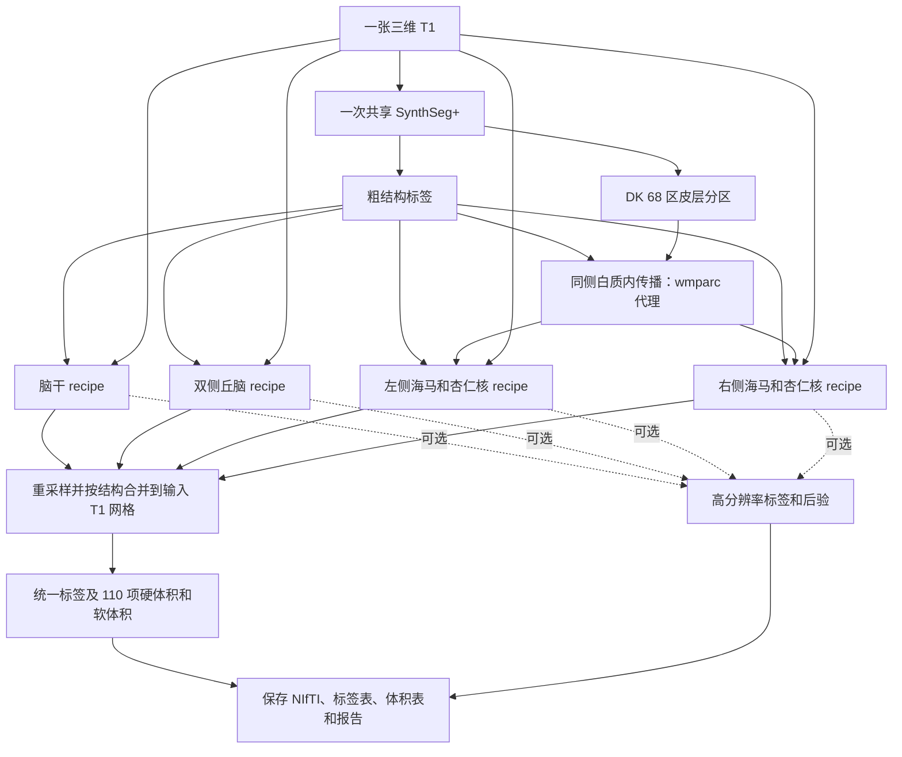
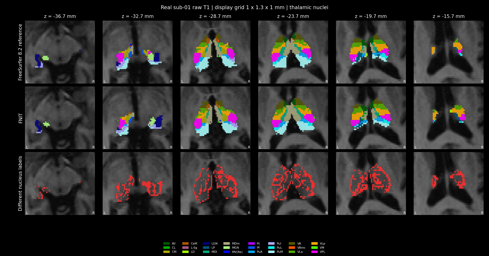
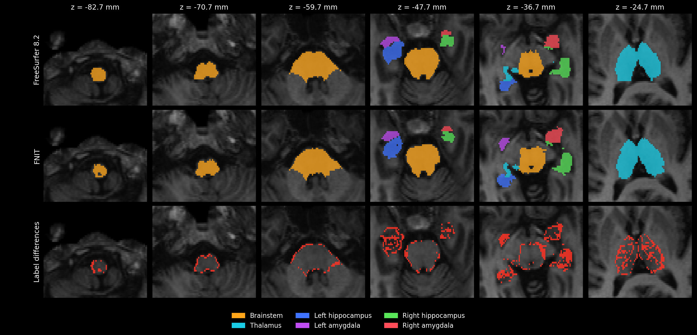

# 四类脑亚区分割：`segment_4_subregions`

[返回首页](../../README.md) · [真实数据验证](../../validation/subregions/README.md) · [完整 benchmark](../../validation/subregions/segment_4_subregions/README.md)

输入一张三维 T1，一次完成脑干、双侧丘脑、双侧海马和杏仁核分割。返回与输入 T1 **形状和 affine 相同**的 `int32` 标签图，以及标签表、硬体积、软体积和各结构的高分辨率结果；设置 `output_dir` 后自动保存。默认全部结构共有 **110 项亚区统计**，其中某些小亚区在原始 T1 网格上可能没有硬标签体素。

支持 CPU 和 GPU。CUDA 默认使用 FP32/TF32，计算与读写分别使用项目的 PyTorch 实现和 Nibabel，运行时不调用 FreeSurfer 或 FSL。

## 从一张 T1 到完整结果

默认 `structures="all"` 时，共享一次 SynthSeg+，取得粗结构标签和 Desikan–Killiany（DK）68 区皮层分区。将邻近的颞叶皮层标签限定在同侧白质内传播，生成海马强度模型需要的 `wmparc` 代理。随后依次拟合脑干、丘脑、左侧海马/杏仁核和右侧海马/杏仁核；每项完成后将详细结果移到 CPU，再处理下一项。



丘脑在 0.5 mm、海马/杏仁核在约 0.333 mm 工作网格上拟合。合并前先限制各图谱所属的粗结构范围，仅在支持区域重叠时比较后验置信度；主标签以最近邻重采样回输入 T1 网格。图中四个 recipe 表示数据流，实际依次运行。

已有同网格的粗标签、皮层分区或 `wmparc` 可直接传入，减少自动预处理。只选脑干或丘脑且未提供粗标签时，使用一次 SynthSeg；提供全部所需标签后不再运行模型。

## Python 调用、输入输出与参数

```python
from fnit import segment_4_subregions

subregion_result = segment_4_subregions(
    t1="/absolute/path/sub-01_T1w.nii.gz",       # 输入：一张原始三维 T1
    atlas_root=None,                            # 输入：None 使用 FNIT 图谱缓存
    structures="all",                          # 输入：默认全部结构，也可选择单项或列表
    coarse_segmentation=None,                  # 输入：可选的同网格粗结构标签
    cortical_parcellation=None,                # 输入：可选的同网格 DK 68 区皮层标签
    wmparc=None,                               # 输入：可选的同网格白质分区，提供时直接使用
    synthseg_weights=None,                     # 输入：可选的 SynthSeg 权重文件或目录
    synthseg_parc_weights=None,                # 输入：可选的 SynthSeg+ 皮层权重文件或目录
    device="cuda:0",                           # 输入：GPU 设备；也支持 "cpu"
    threads=4,                                 # 输入：PyTorch CPU 线程数
    optimization="fast",                       # 输入：速度优先配置；另一选项为 "balanced"
    output_dir="/absolute/path/sub-01_subregions",  # 输出：标签、体积表和报告目录
    save_highres=True,                         # 输出：保存各结构工作网格的标签
    save_posteriors=False,                     # 输出：后验图较大，按需设为 True
)

native_label_path = subregion_result.output_files["labels"]  # 输出：原 T1 网格标签路径
pons_mask = subregion_result.mask("Pons")                    # 输出：与 T1 同形状的脑桥布尔掩膜
left_ca1_head_mask = subregion_result.mask("Left-CA1-head")  # 输出：左侧 CA1 头部掩膜
print(native_label_path)
```

### 参数

| 参数 | 默认值 | 含义 |
|---|---|---|
| `t1` | 必填 | 原始三维 T1 路径或 Nibabel 图像。无需预先执行 `recon-all`。 |
| `atlas_root` | `None` | 图谱根目录。省略时使用 FNIT 缓存，缺失时按资源清单下载并准备。 |
| `structures` | `"all"` | 可选 `"brainstem"`、`"thalamus"`、`"hippo-amygdala-left"`、`"hippo-amygdala-right"`，或这些名称的列表；`"hippo-amygdala"` 同时选择左右两侧。默认运行全部四项。 |
| `coarse_segmentation` | `None` | 同 T1 网格的 `aseg` 或 SynthSeg 粗标签；可为路径、Nibabel 图像或三维数组。省略时自动生成。 |
| `cortical_parcellation` | `None` | 同 T1 网格的 DK 皮层标签，支持路径、Nibabel 图像或三维数组。白质代理使用左侧 1006、1007、1016 和右侧 2006、2007、2016 编码；省略且需要代理时由 SynthSeg+ 生成。 |
| `wmparc` | `None` | 同 T1 网格的白质分区，支持路径、Nibabel 图像或三维数组。提供时海马强度模型直接使用，不再生成白质代理。 |
| `synthseg_weights` | `None` | SynthSeg 模型权重文件或目录。省略时解析 FNIT 权重配置，并在需要时下载和校验。 |
| `synthseg_parc_weights` | `None` | SynthSeg+ 皮层分区权重文件或目录；仅在需要自动皮层分区时读取。 |
| `device` | `"cuda:0"` | PyTorch 计算设备，例如 `"cuda:1"` 或 `"cpu"`。CUDA 默认启用 TF32。 |
| `threads` | `4` | PyTorch CPU 线程数，必须至少为 1；GPU 运行中的 CPU 准备步骤也使用此设置。 |
| `optimization` | `"fast"` | `"fast"` 速度优先；`"balanced"` 使用更多网格更新和更严格的停止阈值。两者均保留工作网格和最终输出分辨率，详见下文。 |
| `output_dir` | `None` | 自动保存目录。省略时返回内存结果，也可稍后调用 `subregion_result.save(output_dir)`。 |
| `save_highres` | `True` | 保存每项结构的工作网格标签；仅在保存结果时生效。 |
| `save_posteriors` | `False` | 保存每项结构的后验 NIfTI；最后一维为标签通道，仅在保存结果时生效。 |

传入的标签图必须与 T1 形状和 affine 一致；数组没有 affine 信息，需由调用者确保来自相同网格。仅选部分结构时，只返回对应亚区的统计。

### 返回值与保存文件

`subregion_result.labels` 是原 T1 网格的 Nibabel 标签图。`label_table` 为 `{标签 ID: 名称}`；`label_metadata` 增加所属结构、图谱家族和半球。右侧海马/杏仁核标签采用原 ID 加 10000，避免左右冲突。

`subregion_result.volumes[标签 ID]` 包含 `hard_volume_mm3`（原 T1 网格硬标签体积）和 `soft_volume_mm3`（工作网格后验积分），单位均为 mm³。`confidence` 为原网格所选标签的后验置信度，`structure_results` 保存各结构的高分辨率标签、后验、网格及 affine。`initialization` 记录共享预处理来源、模型调用次数、结构拟合、耗时和 GPU 峰值。

设置 `output_dir` 后生成：

```text
sub-01_subregions/
├── subregions_native.nii.gz       # 原 T1 网格 int32 合并标签
├── labels.tsv                    # 标签 ID、名称、所属结构、半球和来源
├── volumes.tsv                   # 每项亚区的硬体积和软体积
├── report.json                   # 输入、几何、参数、耗时、显存和数值检查
└── highres/                      # 可选：四项工作网格标签和后验
    ├── brainstem.nii.gz
    ├── thalamus.nii.gz
    ├── hippo-amygdala-left.nii.gz
    └── hippo-amygdala-right.nii.gz
```

`save_posteriors=True` 时，`highres/` 另存各结构的 `*_posterior.nii.gz`，通道顺序对应该图谱的 `compressionLookupTable.txt`。`output_files` 给出所有已保存文件的绝对路径。`timings["compute_seconds"]` 包括预处理、拟合和合并；`timings["save_seconds"]` 包括影像和表格读写，报告 JSON 的最终序列化和落盘不计入此项。

### CPU、GPU 与速度配置

| 配置 | `fast`（默认） | `balanced` |
|---|---|---|
| 每轮网格更新上限 | 20 | 30 |
| 丘脑网格数据项 | 非零平滑阶段使用四分之一加权空间采样，最后阶段使用全部有效体素 | 各阶段使用全部有效体素 |
| 海马/杏仁核网格数据项 | 各阶段使用全部有效体素 | 各阶段使用全部有效体素 |
| Gaussian EM 与最终标签、后验 | 完整工作网格 | 完整工作网格 |
| 停止条件 | 速度优先 | 更严格 |

图谱先验平滑、部分容积模拟、Gaussian EM 和网格拟合支持 GPU，默认环境已包含所需依赖。图谱加载、裁剪、三次插值、部分形态学、白质标签传播和最终 Nibabel 重采样仍在 CPU；阶段控制和线搜索也包含 CPU 判断及 GPU 同步。整例时间包含这些步骤。实现与逐组件耗时见 [TorchGEMS](../../src/fnit/gems/core.py)及 [GPU 组件验证](../../validation/subregions/speed_v16/layout_components/README.md)。

海马部分容积准备修复了 NumPy 组织均值直接赋给 PyTorch 掩膜张量的兼容问题，均值与统计规则保留；测试覆盖薄结构分支。

### 图谱与权重准备

首次缺少 SynthSeg 权重或图谱时自动准备。资源优先从 [FNIT 固定 Release](https://github.com/weikanggong1/Fudan-Neuroimaging-toolkit/releases/tag/assets-v1)及其清单获取并校验大小、SHA-256；未获明确再分发许可的文件从原作者网站获取。离线运行前可执行：

```bash
# --model：下载并校验自动粗分割和皮层分区所需权重
fnit-setup-weights --model synthseg-plus

# --output-root：保存四类图谱的根目录；省略时使用 FNIT 缓存
# --device：图谱准备计算设备；--asset-dir 可另指定已经校验的资产目录
fnit-setup-subregion-atlases --output-root /absolute/path/subregion_atlases --device cpu
```

图谱目录为 `brainstem/`、`thalamus/`、`hippo-amygdala-left/` 和 `hippo-amygdala-right/`。原始图谱文件及校验值见 [资源清单](../../src/fnit/recon_all/assets.py)，模型下载与离线配置见 [权重说明](../WEIGHTS.md)。丘脑和海马先验在个体仿射变换后的参考网格上平滑。

## 命令行

```bash
# --i：原始 T1；--o：原网格合并标签；--structure：结构，可重复指定
# --device：CPU/GPU；--threads：CPU 线程数；--optimization：fast 或 balanced
# --output-dir：标签表、体积表和报告目录；--save-highres：保存工作网格标签
fnit segment-4-subregions --i /absolute/path/sub-01_T1w.nii.gz \
  --o /absolute/path/sub-01_subregions/subregions_native.nii.gz \
  --structure all --device cuda:0 --threads 4 --optimization fast \
  --output-dir /absolute/path/sub-01_subregions --save-highres
```

`--atlas-root`、`--coarse-segmentation`、`--cortical-parcellation`、`--wmparc`、`--synthseg-weights` 和 `--synthseg-parc-weights` 对应 Python 参数。`--save-posteriors` 另存工作网格后验，`--report-json` 可再指定报告路径。仅需原网格标签时可省略输出目录和保存开关。

## 原软件调用

以下是 **FreeSurfer 的参考命令**。官方流程先完成 `recon-all`，再读取该 subject 的 `norm.mgz`、`aseg.mgz` 和海马所需的 `wmparc.mgz`：

```bash
segment_subregions brainstem --cross fs_sub01 --sd /absolute/path/subjects --threads 4
segment_subregions thalamus --cross fs_sub01 --sd /absolute/path/subjects --threads 4
segment_subregions hippo-amygdala --cross fs_sub01 --sd /absolute/path/subjects --threads 4
```

相同阶段的精度对照需向 FNIT 传入同一组 `norm/aseg/wmparc`；从原始 T1 自动预处理的整例验证另行报告。原实现见 [FreeSurfer 源码](https://github.com/freesurfer/freesurfer/tree/dev/attic/python/gems/subregions)和 [官方使用说明](https://surfer.nmr.mgh.harvard.edu/fswiki/SubregionSegmentation)。


## 最新精度、运行时间与脑图

2026-10-01，使用一例公开去面部 T1 验证：共享 H100、4 个 CPU 线程、FP32/TF32、默认 `fast`。整例运行包括全部四项结构及 110 项硬/软体积；相同阶段验证读取官方流程的 `norm/aseg/wmparc`。输入和源码均记录 SHA-256，详细记录见[完整 benchmark](../../validation/subregions/segment_4_subregions/README.md)。

### 指标与计时范围

官方标签先以最近邻重采样到 FNIT 输出网格，再按**细标签 ID**比较。两张图至少一方有体素的非零标签参与硬标签评价；双方均为空的标签不记为通过，仍保留软体积统计。

| 指标 | 定义 |
|---|---|
| 单标签 Dice | `2 × 交集体素数 / (官方体素数 + FNIT 体素数)`。 |
| 细标签 Dice 均值 | 各可评估细标签 Dice 的算术平均，每个标签权重相同。 |
| 官方参考体素加权 Dice | `sum(官方标签体素数 × 标签 Dice) / sum(官方标签体素数)`。大标签权重更高；按六个家族和全部标签分别报告。 |
| 严格通过数 / 分母 | 分母为可评估细标签数；通过需同时满足 `Dice ≥ 0.95` 和硬体积相对官方误差 `≤ 5%`。官方该标签为空、FNIT 非空时计入分母但不通过。 |
| 家族前景 Dice | 将某一家族全部细标签合并为一个掩膜后计算，只描述外部轮廓；不用于替代细标签指标。 |

计算时间含读入、共享预处理、拟合和合并；API 时间另含自动保存，进程总墙钟再包括导入、CUDA 初始化与 API 外对照。PyTorch 峰值为分配器统计，本进程显存峰值来自定期采样；共享 GPU 的其他任务记录在负载日志中。主表只采用通过完整原始 T1、同阶段四结构验收的候选结果，局部试验记入下方更新记录。

### 丘脑数值稳定与回溯线搜索

入口整合后，同阶段丘脑细核的官方体素加权 Dice 曾从 v16 C6 的 0.964068 降为 0.910995。最早差异出现在 GEMS 合成标签拟合：窄 Gaussian 模型产生较大的总代价，FP32 汇总会舍入微小下降量，使 L-BFGS 线搜索和停止位置对数值扰动敏感。

本次修复同时控制**丘脑合成标签与强度拟合**的数值归约和线搜索：

- 图谱平滑的顶点统计按固定顺序用 FP64 汇总，再转回 FP32；按参考网格复用归约布局。
- 数据项和形变先验的总代价用 FP64 汇总；L-BFGS 内部方向、历史和线搜索运算使用 FP64。
- 融合数据项与网格几何的顶点贡献按固定顺序用 FP64 归约，再写入 FP32 顶点梯度。
- 在丘脑目标函数与梯度计算期间暂用完整 FP32 矩阵精度，结束或报错后恢复原 TF32 设置。CUDA 小网格契约检查发现，TF32 可使近恒等形变的解析梯度与高精度目标函数导数产生差异；该检查用于核对数学实现，不计作真实数据 benchmark。
- 原生 Armijo L-BFGS 每个顶点一次最多移动 0.5 个工作体素，以实际 FP32 位移计算下降判据和曲率。不满足下降、非有限代价或梯度、非正 Jacobian 的试探被拒绝，步长减半，最多 20 次；无有效步时恢复接受位置、梯度与缓存。非下降方向清除历史后使用负梯度。

这些修复仅在丘脑拟合中启用；影像、网格顶点和 Gaussian 参数保持 FP32，网络预处理、图谱平滑和其他 recipe 保留默认 TF32。体素采样、owner hint、工作网格、平滑与迭代上限保留，没有新增依赖，`segment_4_subregions` 的参数和输出结构一致。验收依据实际原生 CUDA 融合路径的重复结果及完整流程对照，分别报告重复性与官方细标签指标。

同阶段单丘脑验证覆盖 **44 个细标签、10,123 个官方参考体素**。[回溯修复版两次运行](../../validation/subregions/segment_4_subregions/stability_fix/c6_runs/summary.json)均得到细标签 Dice 均值 **0.910199**、官方参考体素加权 Dice **0.961959**；原网格标签相差 **0 个体素**。六个拟合阶段的先验概率、初始/最终顶点、Gaussian 参数、拓扑与代价历史也逐比特一致。相对入口回退，加权 Dice 提高 **0.050964**；相对 v16 C6 仍低 **0.002109**。该重复结果描述本例丘脑的稳定性，与官方仍有细标签差异。

完整验收使用冻结源码 `source_thalamus_backtracking_final_20261001`，443 个源码文件及实际加载模块均与清单匹配。原网格输出保持输入 shape/affine，标签为 `int32`；四项结构的工作网格、110 项硬/软体积及正 Jacobian 检查均通过。来源和逐标签结果见[最终修复 benchmark](../../validation/subregions/segment_4_subregions/stability_fix/README.md)。

### 完整运行耗时与显存

| 输入范围 | 计算 | API 含保存 | 进程总墙钟 | PyTorch 分配峰值 | 本进程显存采样峰值 |
|---|---:|---:|---:|---:|---:|
| 官方同阶段输入 | 533.773 s（8.90 min） | 534.373 s | 578.304 s | 4.91 GiB | 9,718 MiB |
| 原始 T1 全流程 | 410.721 s（6.85 min） | 411.237 s | 435.155 s | 15.47 GiB | 18,930 MiB |

两种输入的完整计算、API 与本次进程总墙钟均在 10 分钟内。首次资源下载、图谱安装和独立官方程序运行不计入。完整 FNIT CPU 整例尚未测量；官方完整 CPU 阶段本次尚未重测，目前直接核验的[官方计时证据](../../validation/subregions/segment_4_subregions/stability_fix/official_timing_evidence/audit.json)为脑干 240.10 s，未据此推算整例速度比。

### 官方细标签精度：同阶段输入

FNIT 读取官方的同一组 `norm/aseg/wmparc`，对应[同阶段完整结果](../../validation/subregions/segment_4_subregions/stability_fix/full_stage/summary.json)。丘脑加权 Dice 从入口整合的 **0.910995** 提高到 **0.960523**，接近 v16 C6 的 **0.964068**；严格通过由 **2/44** 变为 **17/44**，v16 C6 为 **19/44**。全部六族均按细标签 ID 比较：

| 家族 | 参与细标签数 | Dice 均值 | 官方体素加权 Dice | 严格通过数 / 分母 | 官方参考体素数 |
|---|---:|---:|---:|---:|---:|
| 脑干 | 4 | 0.983000 | 0.991306 | 4/4 | 19,808 |
| 丘脑细核 | 44 | 0.908637 | 0.960523 | 17/44 | 10,123 |
| 左海马 | 19 | 0.848035 | 0.870763 | 1/19 | 3,067 |
| 右海马 | 19 | 0.773765 | 0.813436 | 0/19 | 3,058 |
| 左杏仁核 | 9 | 0.862876 | 0.941614 | 3/9 | 1,371 |
| 右杏仁核 | 9 | 0.646729 | 0.917690 | 1/9 | 1,285 |
| 全部可评估细标签 | 104 | 0.849160 | 0.955452 | 26/104 | 38,712 |

丘脑 50 项软体积中，45 项相对官方误差在 5% 内。上述完整流程的丘脑输出与单丘脑重复结果相差 29 个标签体素；完整流程采用自己的精度指标，不将单丘脑重复一致性扩展为所有结构的逐比特一致性。与官方仍有逐核差异。

### 官方细标签精度：原始 T1 全流程

FNIT 从原始 T1 自动准备粗标签与皮层分区，对应[原始 T1 完整结果](../../validation/subregions/segment_4_subregions/stability_fix/full_raw/summary.json)。它包含 FNIT 自动预处理与官方 `recon-all` 预处理的差异，细标签一致性低于同阶段输入。原始 T1 的丘脑加权 Dice 为 **0.775793**，修复前为 **0.776716**；本次修复主要恢复了同阶段丘脑拟合。

| 家族 | 参与细标签数 | Dice 均值 | 官方体素加权 Dice | 严格通过数 / 分母 | 官方参考体素数 |
|---|---:|---:|---:|---:|---:|
| 脑干 | 4 | 0.882705 | 0.924751 | 0/4 | 15,305 |
| 丘脑细核 | 46 | 0.630122 | 0.775793 | 0/46 | 7,793 |
| 左海马 | 19 | 0.639700 | 0.678531 | 0/19 | 2,362 |
| 右海马 | 19 | 0.595625 | 0.634352 | 0/19 | 2,363 |
| 左杏仁核 | 9 | 0.582631 | 0.790483 | 0/9 | 1,052 |
| 右杏仁核 | 9 | 0.413409 | 0.760340 | 0/9 | 969 |
| 全部可评估细标签 | 106 | 0.612754 | 0.833303 | 0/106 | 29,844 |

原始 T1 的丘脑实际可评估标签为 **46 个**，与旧结果共同可评估的标签为 45 个；均值与严格通过分母使用当前的 46 个，参考体素为 7,793。丘脑 50 项软体积中，14 项相对官方误差在 5% 内。两种输入分别使用各自输出网格，最近邻重采样后的参考体素数不同。

### 软体积与官方对照

软体积为工作网格后验积分。下面按标签报告 `abs(FNIT − 官方) / 官方` 的平均值及误差在 5% 内的项数；即使原网格硬标签为空，仍可评价其软体积。逐标签硬体积、软体积及相对误差见 [同阶段表](../../validation/subregions/segment_4_subregions/stability_fix/full_stage/comparison.tsv)与[原始 T1 表](../../validation/subregions/segment_4_subregions/stability_fix/full_raw/comparison.tsv)。

| 家族 | 同阶段平均绝对相对误差 | 同阶段误差 ≤5% | 原始 T1 平均绝对相对误差 | 原始 T1 误差 ≤5% |
|---|---:|---:|---:|---:|
| 脑干 | 1.00% | 4/4 | 6.95% | 2/4 |
| 丘脑细核 | 2.67% | 45/50 | 11.83% | 14/50 |
| 左海马 | 3.84% | 14/19 | 7.66% | 9/19 |
| 右海马 | 4.54% | 10/19 | 6.74% | 6/19 |
| 左杏仁核 | 2.70% | 8/9 | 18.36% | 3/9 |
| 右杏仁核 | 4.73% | 6/9 | 14.30% | 2/9 |

### 内部阶段时间

| 内部阶段 | 同阶段输入 | 原始 T1 |
|---|---:|---:|
| 脑干 | 33.694 s | 26.406 s |
| 丘脑 | 138.605 s | 123.094 s |
| 左海马与杏仁核 | 207.614 s | 109.922 s |
| 右海马与杏仁核 | 141.733 s | 130.476 s |
| 结构外读入、共享预处理、合并等 | 12.127 s | 20.823 s |

每项结构时间包括配准、图像准备、合成标签拟合、强度拟合和后处理。丘脑合成标签拟合分别为 67.650 s / 62.746 s（同阶段 / 原始 T1）；详细步骤见[同阶段计时](../../validation/subregions/segment_4_subregions/stability_fix/full_stage/timing_summary.json)和[原始 T1 计时](../../validation/subregions/segment_4_subregions/stability_fix/full_raw/timing_summary.json)。共享 H100 的这些时间为本次观测值。

### 官方与 FNIT 的六层轴位脑图

下图使用 RAS 轴位显示网格，按实际毫米间距保持横纵比例。官方标签与 FNIT 标签以最近邻采样到同一显示网格，差异行显示原细标签 ID 不同的体素。细核图使用图谱颜色；四结构图按六个家族着色，便于同时观察轮廓与内部标签差异。

**同阶段输入：丘脑细核。**


**同阶段输入：脑干、丘脑、双侧海马与杏仁核。**


**原始 T1 全流程：丘脑细核。**



**原始 T1 全流程：脑干、丘脑、双侧海马与杏仁核。**




## 最近版本 benchmark 记录

以下同阶段记录均使用相同官方参考的 44 个丘脑细标签、10,123 个参考体素。计算时间包含四项结构；单丘脑重复试验的时间不混入此表。失败试验保留用于核查修复过程。

| 记录 | 四结构计算时间 | 丘脑细核官方体素加权 Dice | 结果与用途 |
|---|---:|---:|---|
| [v16 C6](../../validation/subregions/speed_v16/README.md) | 509.840 s | 0.964068 | 历史基线 |
| [入口整合](../../validation/subregions/segment_4_subregions/stage/summary.json) | 489.905 s | 0.910995 | 已发布版本，记录本次回退 |
| [C1 通用标量试验](../../validation/subregions/segment_4_subregions/stability_fix/c1_scope_evaluation/full_stage/summary.json) | 453.047 s | 0.965569 | 丘脑恢复，右海马加权 Dice 降至 0.772371，未采用 |
| [C2 丘脑标量试验](../../validation/subregions/segment_4_subregions/stability_fix/c2_scope_evaluation/full_stage/summary.json) | 491.286 s | 0.902469 | 丘脑精度未恢复，未采用 |
| C3 固定顺序归约试验 | — | 0.906687（单丘脑首次） | 合成拟合重复一致，精度未恢复，未采用 |
| C4 小矩阵精度试验 | — | 0.885167 / 0.958684（单丘脑两次） | 合成轨迹相同，最终结果仍不同，未采用 |
| [C5 全丘脑数值控制](../../validation/subregions/segment_4_subregions/stability_fix/c5_scope_evaluation/full_stage/summary.json) | 634.443 s | 0.949945 | 单丘脑重复一致；完整同阶段超过 10 分钟，继续优化线搜索 |
| [回溯修复版](../../validation/subregions/segment_4_subregions/stability_fix/full_stage/summary.json) | 533.773 s | 0.960523 | 完整同阶段低于 10 分钟，近 v16 C6；单丘脑两次加权 Dice 0.961959、0 个体素差异 |

### 数值修复过程

C1/C2 仅提高数据总代价的汇总精度，完整运行仍有细核回退。C3 加入固定顺序归约，C4 隔离小矩阵 TF32 运算；C4 两次合成拟合轨迹相同，最终细核结果仍不同。C5 将数值控制扩展至全部丘脑拟合，并在非零梯度零步时最多清除一次历史重试；回溯修复版再采用有界 Armijo 线搜索。

C1 的单丘脑两次加权 Dice 为 0.958382 / 0.963259，相互加权 Dice 为 0.989980，相差 129 个标签体素。C5 单丘脑两次加权 Dice 均为 0.951236，但完整同阶段为 0.949945；其中左右海马/杏仁核计算合计约 409 s，丘脑约 170 s。C5 完整原始 T1 计算 552.424 s、丘脑加权 Dice 0.775745，见 [C5 原始 T1 记录](../../validation/subregions/segment_4_subregions/stability_fix/c5_scope_evaluation/full_raw/summary.json)。单结构和完整流程的结果分别保留。

### 已发布版本的完整运行记录（修复前）

| 输入范围 | 计算 | API 含保存 | 监控进程总墙钟 | PyTorch 分配峰值 | 本进程显存采样峰值 |
|---|---:|---:|---:|---:|---:|
| 原始 T1 全流程 | 425.862 s（7.10 min） | 426.354 s | 452.074 s | 15.47 GiB | 18,906 MiB |
| 官方同阶段输入 | 489.905 s（8.17 min） | 490.499 s | 531.436 s | 4.91 GiB | 9,460 MiB |

首次资源下载、图谱安装和独立官方程序运行不计入；完整 CPU 整例尚未测量。官方 CPU 完整阶段本次尚未重测；[固定 Git 历史记录](https://github.com/weikanggong1/Fudan-Neuroimaging-toolkit/blob/5250aa540bb6e3b1fda7d7a596c42b39006da14d/validation/subregions/unified.md#L212)记载合计 30.70 min，不含 `recon-all`，完整计时来源待复核，未作为当前速度基准。

相对 [v16 C6 基线](../../validation/subregions/speed_v16/README.md)的家族前景 Dice，原始 T1 为 0.9560–0.9995，家族体积变化最大 5.03%；同阶段输入为 0.9851–0.9996 和 0.384%。逐标签软体积变化在 5% 内的项数分别为 84/110、96/110。

修复前，原始 T1 的丘脑官方体素加权 Dice 为 0.7767；同阶段为 0.9110。全部可评估标签的加权 Dice 分别为 0.8337 和 0.9450。当前证据来自一例开发病例；完整逐标签对照、来源差异及脑图见验证页。


## Reference

- 脑干：[Iglesias 等，2015，*NeuroImage*](https://doi.org/10.1016/j.neuroimage.2015.02.065)。
- 丘脑：[Iglesias 等，2018，*NeuroImage*](https://pmc.ncbi.nlm.nih.gov/articles/PMC6215335/)。
- 海马：[Iglesias 等，2015，*NeuroImage*](https://doi.org/10.1016/j.neuroimage.2015.04.042)。
- 杏仁核：[Saygin 等，2017，*NeuroImage*](https://doi.org/10.1016/j.neuroimage.2017.04.046)。
- 粗分割：[Billot 等，2023，*Medical Image Analysis*](https://doi.org/10.1016/j.media.2023.102789)。
- 皮层分区：[Billot 等，2023，*PNAS*](https://doi.org/10.1073/pnas.2216399120)。
- [FreeSurfer 亚区原实现](https://github.com/freesurfer/freesurfer/tree/dev/attic/python/gems/subregions)及 [GEMS 形变先验实现](https://github.com/freesurfer/freesurfer/blob/dev/attic/gems/kvlAtlasMeshPositionCostAndGradientCalculator.cxx)。
