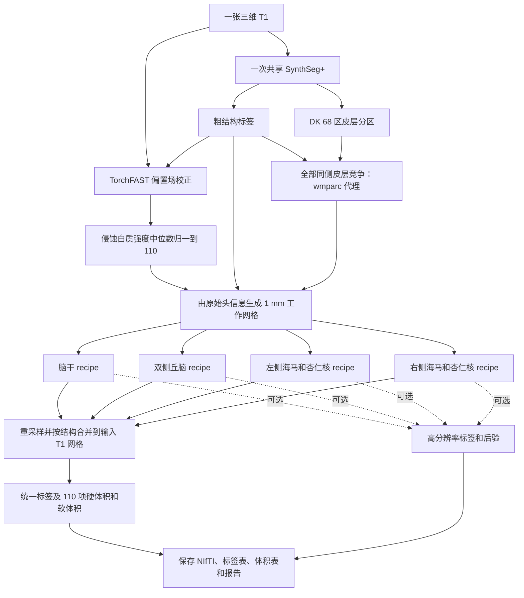
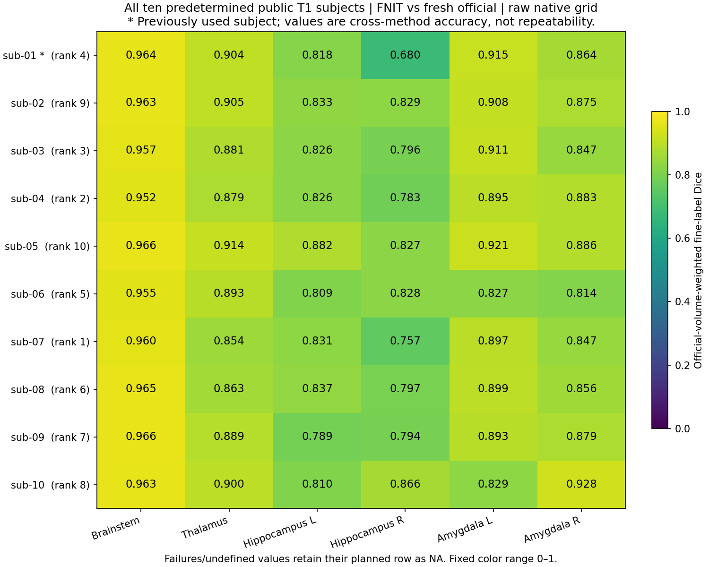
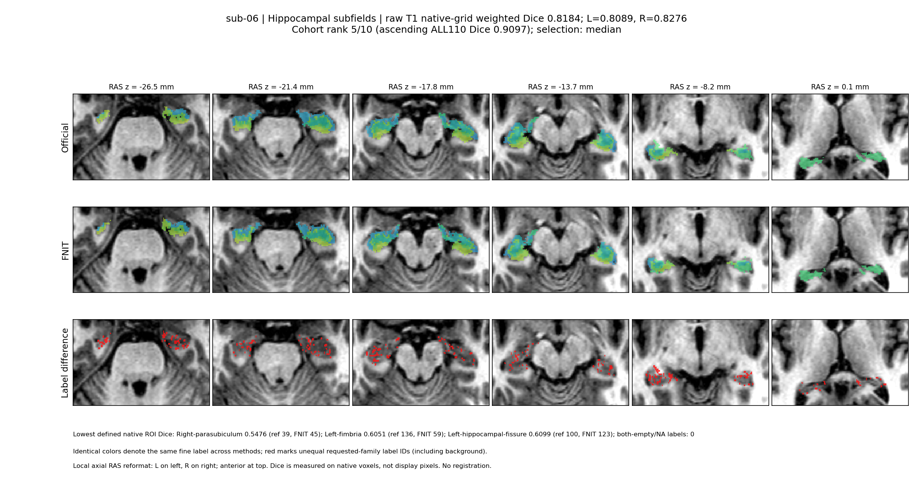
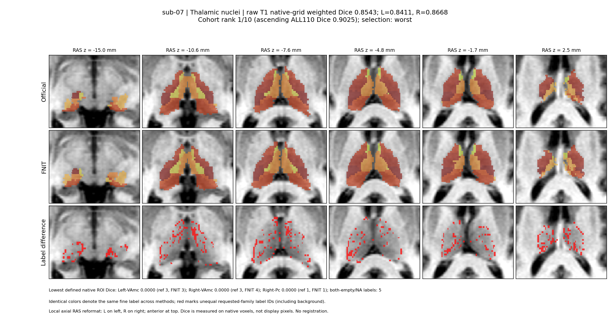
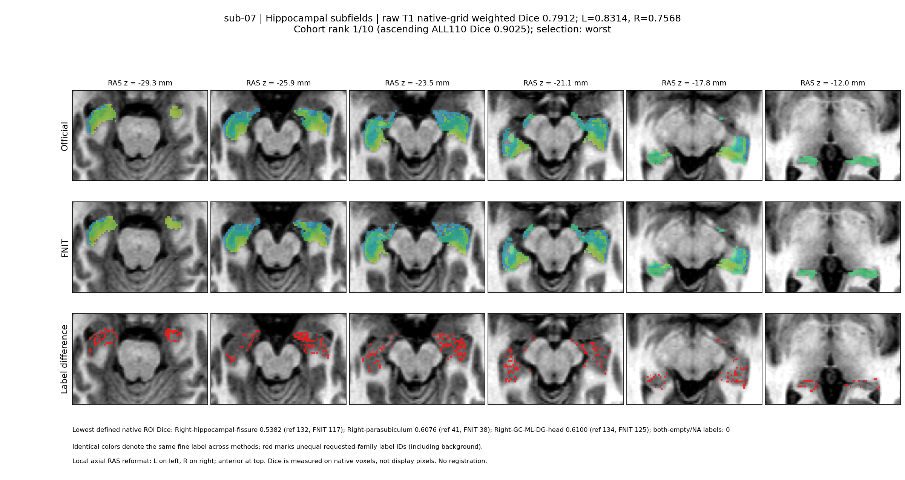

# 四类脑亚区分割：`segment_4_subregions`

[返回首页](../../README.md) · [真实数据验证](../../validation/subregions/README.md) · [十例完整 benchmark](../../validation/subregions/ten_public_t1_20261002/README.md) · [2026-10-02 GPU 配对](../../validation/subregions/ten_public_t1_20261002/latest_main_regression/official_comparison.md)

输入一张三维 T1，一次完成脑干、双侧丘脑、双侧海马和杏仁核分割。返回与输入 T1 **形状和 affine 相同**的 `int32` 标签图，以及标签表、硬体积、软体积和各结构的高分辨率结果；设置 `output_dir` 后自动保存。默认全部结构共有 **110 项亚区统计**，其中某些小亚区在原始 T1 网格上可能没有硬标签体素。

支持 CPU 和 GPU。CUDA 默认使用 FP32/TF32；脑干的小矩阵运算局部使用准确 FP32，部分梯度归约、标量累计和优化器状态使用 FP64，不使用 FP16。脑干 Adam 状态仍为 FP32；具体 recipe 的实际策略以报告为准。`precise_mesh_matrices` 字段目前仅记录请求，不能作为实际 FP64 矩阵计算的证据。计算与读写分别使用项目的 PyTorch 实现和 Nibabel，运行时不调用 FreeSurfer 或 FSL。

## 从一张 T1 到完整结果

默认 `structures="all"` 时，共享一次 SynthSeg+，取得粗结构标签和 Desikan–Killiany（DK）68 区皮层分区。全部同侧皮层分区在同侧白质内竞争最近邻，生成海马强度模型需要的 `wmparc` 代理。自动粗分割后复用 TorchFAST 校正偏置场，将侵蚀白质的强度中位数归一到 110，并从 T1 自身头信息生成 1 mm 冠状工作网格。随后依次拟合四项结构；每项完成后将详细结果移到 CPU，再处理下一项。



丘脑在 0.5 mm、海马/杏仁核在约 0.333 mm 网格上拟合。各结构先生成处理网格标签并执行支持范围筛选，再将标签、置信度和支持掩膜以最近邻共同映射到原始 T1，按重叠处的置信度合并；硬体积按原始 T1 的体素体积统计。这沿用官方标准标签输出的网格顺序。平均体素间距小于 0.99 mm 的输入保留高分辨率网格；侵蚀白质正样本不足 100 个时保留输入并在报告中记录原因。图中四个 recipe 表示数据流，实际依次运行。

已有同网格的粗标签、皮层分区或 `wmparc` 可直接传入。提供 `coarse_segmentation` 时按已准备的 T1 直接拟合，跳过自动强度校正和 1 mm 网格准备；官方同阶段对照传入 `norm/aseg/wmparc`。只选脑干或丘脑且未提供粗标签时，使用一次 SynthSeg；提供全部所需标签后不再运行模型。

## Python 调用、输入输出与参数

```python
from fnit import segment_4_subregions

subregion_result = segment_4_subregions(
    t1="/absolute/path/sub-01_T1w.nii.gz",       # 输入：一张原始三维 T1
    atlas_root=None,                            # 输入：None 使用 FNIT 图谱缓存
    structures="all",                          # 输入：默认全部结构，也可选择单项或列表
    coarse_segmentation=None,                  # 输入：可选的同网格粗结构标签
    cortical_parcellation=None,                # 输入：可选的同网格 DK 68 区皮层标签
    wmparc=None,                               # 输入：可选的同网格白质分区，提供时直接使用
    synthseg_weights=None,                     # 输入：可选的 SynthSeg 权重文件或目录
    synthseg_parc_weights=None,                # 输入：可选的 SynthSeg+ 皮层权重文件或目录
    device="cuda:0",                           # 输入：GPU 设备；也支持 "cpu"
    threads=4,                                 # 输入：PyTorch CPU 线程数
    optimization="fast",                       # 输入：速度优先配置；另一选项为 "balanced"
    output_dir="/absolute/path/sub-01_subregions",  # 输出：标签、体积表和报告目录
    save_highres=True,                         # 输出：保存各结构工作网格的标签
    save_posteriors=False,                     # 输出：后验图较大，按需设为 True
)

native_label_path = subregion_result.output_files["labels"]  # 输出：原 T1 网格标签路径
pons_mask = subregion_result.mask("Pons")                    # 输出：与 T1 同形状的脑桥布尔掩膜
left_ca1_head_mask = subregion_result.mask("Left-CA1-head")  # 输出：左侧 CA1 头部掩膜
print(native_label_path)
```

### 参数

| 参数 | 默认值 | 含义 |
|---|---|---|
| `t1` | 必填 | 原始三维 T1 路径或 Nibabel 图像。无需预先执行 `recon-all`。 |
| `atlas_root` | `None` | 图谱根目录。省略时使用 FNIT 缓存，缺失时按资源清单下载并准备。 |
| `structures` | `"all"` | 可选 `"brainstem"`、`"thalamus"`、`"hippo-amygdala-left"`、`"hippo-amygdala-right"`，或这些名称的列表；`"hippo-amygdala"` 同时选择左右两侧。默认运行全部四项。 |
| `coarse_segmentation` | `None` | 同 T1 网格的 `aseg` 或 SynthSeg 粗标签；可为路径、Nibabel 图像或三维数组。省略时自动生成并执行强度与工作网格准备；提供时直接使用已准备的 T1。 |
| `cortical_parcellation` | `None` | 同 T1 网格的 DK 皮层标签，支持路径、Nibabel 图像或三维数组。全部同侧 DK 标签竞争生成白质代理；海马强度模型从对应颞叶白质 3006/3007/3016 及右侧 4006/4007/4016 取样。省略且需要代理时由 SynthSeg+ 生成。 |
| `wmparc` | `None` | 同 T1 网格的白质分区，支持路径、Nibabel 图像或三维数组。提供时海马强度模型直接使用，不再生成白质代理。 |
| `synthseg_weights` | `None` | SynthSeg 模型权重文件或目录。省略时解析 FNIT 权重配置，并在需要时下载和校验。 |
| `synthseg_parc_weights` | `None` | SynthSeg+ 皮层分区权重文件或目录；仅在需要自动皮层分区时读取。 |
| `device` | `"cuda:0"` | PyTorch 计算设备，例如 `"cuda:1"` 或 `"cpu"`。CUDA 默认启用 TF32。 |
| `threads` | `4` | PyTorch CPU 线程数，必须至少为 1。CPU 调用还临时设置当前调用线程的 Numba 掩码，正常返回或失败均恢复调用者的两项设置；GPU 保留原有线程设置方式。BLAS、外部库线程和 CPU 亲和性由启动环境控制。 |
| `optimization` | `"fast"` | `"fast"` 速度优先；`"balanced"` 使用更多网格更新和更严格的停止阈值。两者均保留工作网格和最终输出分辨率；更多迭代不保证每个区域的精度提高，详见下文。 |
| `output_dir` | `None` | 自动保存目录。省略时返回内存结果，也可稍后调用 `subregion_result.save(output_dir)`。 |
| `save_highres` | `True` | 保存每项结构的工作网格标签；仅在保存结果时生效。 |
| `save_posteriors` | `False` | 保存每项结构的后验 NIfTI；最后一维为标签通道，仅在保存结果时生效。 |

传入的标签图必须与 T1 形状和 affine 一致；数组没有 affine 信息，需由调用者确保来自相同网格。仅选部分结构时，只返回对应亚区的统计。

### 返回值与保存文件

`subregion_result.labels` 是原 T1 网格的 Nibabel 标签图。`label_table` 为 `{标签 ID: 名称}`；`label_metadata` 增加所属结构、图谱家族和半球。右侧海马/杏仁核标签采用原 ID 加 10000，避免左右冲突。

`subregion_result.volumes[标签 ID]` 包含 `hard_volume_mm3`（原 T1 网格硬标签体积）和 `soft_volume_mm3`（工作网格后验积分），单位均为 mm³。`confidence` 为拟合最大后验插值到处理网格后的置信度，再随标签以最近邻回到原始网格；它用于结构重叠处的选择。`structure_results` 保存各结构的高分辨率标签、后验、网格及 affine。`initialization` 记录共享预处理来源、模型调用次数、偏置与归一化参数、结构拟合、耗时和 GPU 峰值。

设置 `output_dir` 后生成：

```text
sub-01_subregions/
├── subregions_native.nii.gz       # 原 T1 网格 int32 合并标签
├── labels.tsv                    # 标签 ID、名称、所属结构、半球和来源
├── volumes.tsv                   # 每项亚区的硬体积和软体积
├── report.json                   # 输入、几何、参数、耗时、显存和数值检查
└── highres/                      # 可选：四项工作网格标签和后验
    ├── brainstem.nii.gz
    ├── thalamus.nii.gz
    ├── hippo-amygdala-left.nii.gz
    └── hippo-amygdala-right.nii.gz
```

`save_posteriors=True` 时，`highres/` 另存各结构的 `*_posterior.nii.gz`，通道顺序对应该图谱的 `compressionLookupTable.txt`。`output_files` 给出所有已保存文件的绝对路径。`timings["compute_seconds"]` 包括预处理、拟合和合并；`timings["save_seconds"]` 包括影像和表格读写，报告 JSON 的最终序列化和落盘不计入此项。

### CPU、GPU 与速度配置

| 配置 | `fast`（默认） | `balanced` |
|---|---|---|
| 丘脑、海马/杏仁核强度拟合：每个外层迭代的网格更新上限 | 20 | 30 |
| 丘脑网格数据项 | 各阶段使用全部有效体素 | 各阶段使用全部有效体素 |
| 海马/杏仁核网格数据项 | 各阶段使用全部有效体素 | 各阶段使用全部有效体素 |
| Gaussian EM 与最终标签、后验 | 完整工作网格 | 完整工作网格 |
| 停止条件 | 速度优先 | 更严格 |

图谱先验平滑、部分容积模拟、Gaussian EM 和网格拟合支持 GPU，默认环境已包含所需依赖。图谱加载、裁剪、三次插值、部分形态学、白质标签传播和最终 Nibabel 重采样仍在 CPU；阶段控制和线搜索也包含 CPU 判断及 GPU 同步。整例时间包含这些步骤。实现与逐组件耗时见 [TorchGEMS](../../src/fnit/gems/core.py)及 [GPU 组件验证](../../validation/subregions/speed_v16/layout_components/README.md)。

CPU 入口使用临时线程作用域，修复以前只设置 Torch、未约束 Numba且调用后不恢复线程设置的问题。它保持拟合规则、精度、标签和返回结构；Torch 使用请求的线程数；Numba 使用请求数与导入时线程池容量中的较小值。要让两者都达到请求数，请在新进程启动前设置 `NUMBA_NUM_THREADS`。CPU/GPU 不应在同一进程的多个调用线程中并发修改全局 Torch 设置。`timings["compute_seconds"]` 为内部计算范围；公开 API 和进程墙钟另包含 CPU 线程设置及恢复。当前 CPU 同节点实测状态见[CPU 对照协议](../../validation/smri_cpu/task5/README.md)，GPU 历史时间不改标为 CPU 结果。

合成标签拟合按各结构的阶段预算运行，脑干采用其独立配置；上表的 20/30 上限对应丘脑和海马/杏仁核的强度拟合。

海马部分容积准备修复了 NumPy 组织均值直接赋给 PyTorch 掩膜张量的兼容问题，均值与统计规则保留；测试覆盖薄结构分支。

### 图谱与权重准备

首次缺少 SynthSeg 权重或图谱时自动准备。资源优先从 [FNIT 固定 Release](https://github.com/weikanggong1/Fudan-Neuroimaging-toolkit/releases/tag/assets-v1)及其清单获取并校验大小、SHA-256；未获明确再分发许可的文件从原作者网站获取。离线运行前可执行：

```bash
# --model：下载并校验自动粗分割和皮层分区所需权重
fnit-setup-weights --model synthseg-plus

# --output-root：保存四类图谱的根目录；省略时使用 FNIT 缓存
# --device：图谱准备计算设备；--asset-dir 可另指定已经校验的资产目录
fnit-setup-subregion-atlases --output-root /absolute/path/subregion_atlases --device cpu
```

图谱目录为 `brainstem/`、`thalamus/`、`hippo-amygdala-left/` 和 `hippo-amygdala-right/`。原始图谱文件及校验值见 [资源清单](../../src/fnit/recon_all/assets.py)，模型下载与离线配置见 [权重说明](../WEIGHTS.md)。丘脑和海马先验在个体仿射变换后的参考网格上平滑。

## 命令行

```bash
# --i：原始 T1；--o：原网格合并标签；--structure：结构，可重复指定
# --device：CPU/GPU；--threads：CPU 线程数；--optimization：fast 或 balanced
# --output-dir：标签表、体积表和报告目录；--save-highres：保存工作网格标签
fnit segment-4-subregions --i /absolute/path/sub-01_T1w.nii.gz \
  --o /absolute/path/sub-01_subregions/subregions_native.nii.gz \
  --structure all --device cuda:0 --threads 4 --optimization fast \
  --output-dir /absolute/path/sub-01_subregions --save-highres
```

`--atlas-root`、`--coarse-segmentation`、`--cortical-parcellation`、`--wmparc`、`--synthseg-weights` 和 `--synthseg-parc-weights` 对应 Python 参数。`--save-posteriors` 另存工作网格后验，`--report-json` 可再指定报告路径。仅需原网格标签时可省略输出目录和保存开关。

## 原软件调用

以下是 **FreeSurfer 的参考命令**。官方流程先完成 `recon-all`，再读取该 subject 的 `norm.mgz`、`aseg.mgz` 和海马所需的 `wmparc.mgz`：

```bash
# -i：同一公开 T1；-s：subject 名；-sd：独立 subjects 目录
# -all：完整官方预处理；-openmp：每例 CPU 线程数
recon-all -i /absolute/path/sub-01_ses-test_T1w.nii.gz \
  -s fs_sub01 -sd /absolute/path/subjects -all -openmp 4

segment_subregions brainstem --cross fs_sub01 --sd /absolute/path/subjects --threads 4
segment_subregions thalamus --cross fs_sub01 --sd /absolute/path/subjects --threads 4
segment_subregions hippo-amygdala --cross fs_sub01 --sd /absolute/path/subjects --threads 4
```

官方参考在 CPU 上独立运行；本轮每例均从同一公开 T1 新建 subject，没有复用旧预处理。相同阶段对照向 FNIT 传入本例 fresh `norm/aseg/wmparc`；raw 则从公开 T1 自动预处理。[实际官方协议](../../validation/subregions/ten_public_t1_20261002/official_protocol.md)记录版本、环境、准备阶段与输出身份。原实现见 [FreeSurfer 源码](https://github.com/freesurfer/samseg/tree/2ce2b6be69f2954ea704e593a5be79c284a3a8c3/samseg/subregions)和 [官方使用说明](https://surfer.nmr.mgh.harvard.edu/fswiki/SubregionSegmentation)。


<a id="最新精度运行时间与脑图"></a>

## 精度、运行时间与脑图

### 2026-10-04：同节点 CPU 与受影响 GPU 回归

nodecw10 的相同八核预算下，脑干逐区门通过；丘脑及海马/杏仁核仍未全部通过，CPU 拟合明显较慢。脑干联合优化在另一固定核组完整旧新配对中将 API 时间从 733.021 降至 668.801 秒，全部后验和拟合状态相同，GPU 脑干回归也通过。原始 T1 的 CPU 全结构流程及完整 recon-all 已执行并评分；下列十例 GPU 结果绑定 2026-10-02 的源码，不能作为本轮最终整合源码的全结构 GPU 验收。详见[本轮完整记录](../../validation/smri_cpu/task5/README.md)。

原始 T1 的 CPU v5 整例为 **6241.435 秒（104.024 分钟）**，API 6238.458 秒；共享预处理、脑干、丘脑及左右海马/杏仁核约为 162.214 / 643.776 / 2245.035 / 1583.290 / 1563.757 秒。这些为父阶段，内部计时不再累加。原网格 4/105、HR 5/107 非空区通过既定逐区门，另外 5/3 区双方为空记 NA，输出仍不等价。13 项约定输出齐全，全部后验和脑图见[完整 raw CPU 报告](../../validation/smri_cpu/task5/raw_all_cpu_v5/README.md)。本例未传入官方拟合检查点，官方 norm/aseg/wmparc 的保存参考已与本轮同 T1 官方 CPU recon 核验数组及几何恒等；无单次官方 raw 整链时钟或速度比。

### 2026-10-02：十例 GPU 与官方对照

2026-10-02，使用 OpenNeuro ds000114 **snapshot 1.0.2、ses-test 的 sub-01–sub-10 十例公开 T1**。选择在测试前固定，同时单列排除开发用 sub-01 的新九例。公开快照已做去脸，本次未追加处理；这批公开 T1 与此前单例开发派生 T1 分别记录。[数据与许可记录](../../validation/subregions/ten_public_t1_20261002/data_selection.md)保留选择、文件大小和 SHA-256。

**raw** 从公开 T1 自动完成共享预处理和全部四项分割，原网格为公开 T1 网格。**stage** 从同一病例本轮全新官方 `norm/aseg/wmparc` 开始，原网格为其 norm 网格；用于比较亚区拟合，官方预处理耗时不计入 FNIT stage。两个输入分组报告。

`f436de5` 于 2026-10-02 对十例分别完成一次独立 `structures="all", optimization="fast"` raw 运行。与原计量版本 `ac692bb` 比较，50 张原网格/高分辨率标签图的体素、shape、affine、dtype 完全相同，1,100 条硬/软体积字典及 160 条上下文记录相同；raw Dice 与脑图因此继承原计量结果。[历史版本实际审计](../../validation/subregions/ten_public_t1_20261002/latest_main_regression/audit/summary.json)保留逐例证据。stage 结果及耗时来自 `ac692bb` 的实际运行，两版 24 个 GEMS 代码与查找表文件逐字节相同。

### 六区域原网格精度

每例先按官方细标签体素数加权得到家族 Dice，再对病例等权汇总。下表为**均值 ± 样本 SD [最小值, 最大值]；有效/计划数，NA 数**，SD 使用 ddof=1，描述病例间差异，不是重复运行波动。

#### 全部十例

| 家族 | raw：公开 T1 原网格 | stage：fresh norm 网格 |
|---|---|---|
| 脑干 | 0.9612 ± 0.0050 [0.9519, 0.9664]；10/10，NA 0 | 0.9911 ± 0.0088 [0.9667, 0.9966]；10/10，NA 0 |
| 双侧丘脑细核 | 0.8881 ± 0.0189 [0.8543, 0.9135]；10/10，NA 0 | 0.9400 ± 0.0312 [0.8602, 0.9700]；10/10，NA 0 |
| 左海马 | 0.8262 ± 0.0242 [0.7895, 0.8821]；10/10，NA 0 | 0.8720 ± 0.0429 [0.7903, 0.9294]；10/10，NA 0 |
| 右海马 | 0.7957 ± 0.0506 [0.6799, 0.8656]；10/10，NA 0 | 0.8563 ± 0.0428 [0.7838, 0.9039]；10/10，NA 0 |
| 左杏仁核 | 0.8894 ± 0.0336 [0.8268, 0.9208]；10/10，NA 0 | 0.9272 ± 0.0266 [0.8809, 0.9631]；10/10，NA 0 |
| 右杏仁核 | 0.8679 ± 0.0303 [0.8139, 0.9280]；10/10，NA 0 | 0.9066 ± 0.0294 [0.8514, 0.9446]；10/10，NA 0 |

#### 新九例（排除开发用 sub-01）

| 家族 | raw：公开 T1 原网格 | stage：fresh norm 网格 |
|---|---|---|
| 脑干 | 0.9609 ± 0.0052 [0.9519, 0.9664]；9/9，NA 0 | 0.9911 ± 0.0094 [0.9667, 0.9966]；9/9，NA 0 |
| 双侧丘脑细核 | 0.8863 ± 0.0192 [0.8543, 0.9135]；9/9，NA 0 | 0.9366 ± 0.0312 [0.8602, 0.9637]；9/9，NA 0 |
| 左海马 | 0.8271 ± 0.0255 [0.7895, 0.8821]；9/9，NA 0 | 0.8690 ± 0.0443 [0.7903, 0.9294]；9/9，NA 0 |
| 右海马 | 0.8085 ± 0.0320 [0.7568, 0.8656]；9/9，NA 0 | 0.8597 ± 0.0439 [0.7838, 0.9039]；9/9，NA 0 |
| 左杏仁核 | 0.8866 ± 0.0343 [0.8268, 0.9208]；9/9，NA 0 | 0.9240 ± 0.0260 [0.8809, 0.9631]；9/9，NA 0 |
| 右杏仁核 | 0.8683 ± 0.0322 [0.8139, 0.9280]；9/9，NA 0 | 0.9029 ± 0.0286 [0.8514, 0.9446]；9/9，NA 0 |

全部 **110 个分区**各自的均值、样本 SD、有效数与 NA 见[逐分区 Dice 表](../../validation/subregions/ten_public_t1_20261002/analysis/per_region_dice.md)；[880 行 ROI 汇总](../../validation/subregions/ten_public_t1_20261002/analysis/cohort_roi_summary.tsv)包含十例/新九例 × raw/stage × 原网格/高分辨率，另有[4,400 行逐例 ROI](../../validation/subregions/ten_public_t1_20261002/analysis/cohort_roi.tsv)及[逐例家族结果](../../validation/subregions/ten_public_t1_20261002/analysis/cohort_family.tsv)。单方缺失保留 0 Dice；双方硬标签均空和失败为 NA。raw-native 的 Left-Pc（8117）与 Right-Pt（8219）在十例均为双方空，有效 0/10、NA 10；新九例为有效 0/9、NA 9，这两个分区保留在完整表中。

高分辨率统计在固定官方轴向、间距和整数网格相位的共同评价网格上进行。独立 [v2 HR 体素计数守恒审计](../../validation/subregions/ten_public_t1_20261002/official_hr_grid_conservation_v2.json)完成十例 40 张官方 HR 图、1,100 条标签记录：raw_hr 与 stage_hr 计数均保持原值，独立最近邻复查无分歧，原分析元数据未改。首轮报告写入遇到 NumPy 标量 JSON 兼容问题；v2 仅修复报告序列化，计数、网格和指标规则保留。

### 2026-10-02 GPU 完整流程 benchmark

FNIT 使用共享 **NVIDIA H100 PCIe，4 线程，FP32/默认 TF32**，自身进程显存限制 19,073 MiB；当前 raw 采样自身峰值为 **14,748–18,428 MiB**。官方使用 FreeSurfer 8.2.0-1，CPU 每例 4 线程，从同一公开 T1 全新执行 `recon-all -all` 及三个细分割命令。时间均来自本例本轮实际进程，不拼接旧 recon-all 记录。

下表为均值 ± 样本 SD [最小值, 最大值]；有效/计划数，NA 数。除官方整例一行使用分钟外，其余使用秒。

| 实际计时 | 全部十例 | 新九例 |
|---|---|---|
| f436de5 raw：API compute（秒） | 253.66 ± 6.31 [245.68, 261.89]；10/10，NA 0 | 254.46 ± 6.13 [245.68, 261.89]；9/9，NA 0 |
| f436de5 raw：API total（秒） | 254.26 ± 6.34 [246.25, 262.55]；10/10，NA 0 | 255.06 ± 6.17 [246.25, 262.55]；9/9，NA 0 |
| f436de5 raw：进程 wall（秒） | 259.37 ± 6.45 [251.26, 267.76]；10/10，NA 0 | 260.21 ± 6.22 [251.26, 267.76]；9/9，NA 0 |
| f436de5 raw：保存（秒） | 0.55 ± 0.05 [0.48, 0.64]；10/10，NA 0 | 0.55 ± 0.05 [0.48, 0.64]；9/9，NA 0 |
| ac692bb stage：API compute（秒） | 289.63 ± 11.14 [272.47, 311.13]；10/10，NA 0 | 290.06 ± 11.73 [272.47, 311.13]；9/9，NA 0 |
| ac692bb stage：API total（秒） | 290.26 ± 11.15 [273.11, 311.85]；10/10，NA 0 | 290.70 ± 11.73 [273.11, 311.85]；9/9，NA 0 |
| ac692bb stage：进程 wall（秒） | 296.52 ± 11.00 [278.21, 317.26]；10/10，NA 0 | 296.44 ± 11.66 [278.21, 317.26]；9/9，NA 0 |
| 官方 fresh：recon-all＋三个细分割完整 wall（分钟） | 125.45 ± 12.28 [102.13, 138.90]；10/10，NA 0 | 126.79 ± 12.22 [102.13, 138.90]；9/9，NA 0 |

API compute 含共享预处理、拟合和合并；API total 与保存单独记录。进程 wall 从实际启动至独立 wait 完成，含导入、CUDA 初始化、保存和观察器开销；输入及 GPU 预算等待另记，不计入该 wall。[同病例官方/main 配对](../../validation/subregions/ten_public_t1_20261002/latest_main_regression/official_comparison.md)先逐例计算官方 wall/FNIT wall，再汇总比值，保留 raw 的完整流程与 stage 的三项官方细分割范围。共享资源上分时测得的版本速度变化不归因于单项代码优化。

同病例实际进程 wall 比值如下：先在每例内计算官方/FNIT，再对病例等权汇总，未按精度筛选病例。列出均值 ± 样本 SD、中位数、范围和有效/计划数、NA 数。

| 同病例 wall 比值 | 全部十例 | 新九例 |
|---|---|---|
| 官方 fresh 完整流程 / f436de5 raw | 29.010 ± 2.643；中位 29.702；[24.106, 32.966]；10/10，NA 0 | 29.231 ± 2.704；中位 30.331；[24.106, 32.966]；9/9，NA 0 |
| 官方三项细分割 / ac692bb stage | 5.212 ± 0.457；中位 5.282；[4.476, 5.786]；10/10，NA 0 | 5.293 ± 0.399；中位 5.306；[4.757, 5.786]；9/9，NA 0 |

#### 实际分步骤时间

f436de5 raw 的共享预处理及四项 recipe 总计如下，单位为秒；字段分别为 `shared_preprocessing/seconds`、`brainstem/timing_seconds/total` 和其余三项的 `seconds`。

| f436de5 raw 步骤 | 全部十例 | 新九例 |
|---|---|---|
| 共享预处理 | 13.11 ± 0.85 [11.95, 14.74]；10/10，NA 0 | 13.01 ± 0.85 [11.95, 14.74]；9/9，NA 0 |
| 脑干 recipe | 17.78 ± 0.71 [16.88, 19.24]；10/10，NA 0 | 17.75 ± 0.74 [16.88, 19.24]；9/9，NA 0 |
| 双侧丘脑 recipe | 74.88 ± 4.76 [67.86, 81.64]；10/10，NA 0 | 75.67 ± 4.32 [68.44, 81.64]；9/9，NA 0 |
| 左海马/杏仁核 recipe | 64.92 ± 4.18 [57.60, 71.20]；10/10，NA 0 | 65.52 ± 3.95 [57.60, 71.20]；9/9，NA 0 |
| 右海马/杏仁核 recipe | 64.93 ± 4.03 [55.73, 69.27]；10/10，NA 0 | 64.45 ± 3.96 [55.73, 67.60]；9/9，NA 0 |

ac692bb stage 的实际四项 recipe 总计如下，单位为秒；来自同病例本轮 fresh norm 输入。

| ac692bb stage 步骤 | 全部十例 | 新九例 |
|---|---|---|
| 脑干 recipe | 27.39 ± 1.11 [26.34, 29.95]；10/10，NA 0 | 27.51 ± 1.12 [26.34, 29.95]；9/9，NA 0 |
| 双侧丘脑 recipe | 94.67 ± 4.18 [89.18, 103.65]；10/10，NA 0 | 95.27 ± 3.97 [89.18, 103.65]；9/9，NA 0 |
| 左海马/杏仁核 recipe | 78.21 ± 4.84 [68.71, 84.31]；10/10，NA 0 | 77.53 ± 4.60 [68.71, 82.57]；9/9，NA 0 |
| 右海马/杏仁核 recipe | 74.16 ± 8.57 [62.11, 83.05]；10/10，NA 0 | 74.64 ± 8.94 [62.11, 83.05]；9/9，NA 0 |

| 官方实际 command wall（秒） | 全部十例 | 新九例 |
|---|---|---|
| recon-all -all | 5981.72 ± 664.15 [4701.85, 6904.68]；10/10，NA 0 | 6038.28 ± 678.41 [4701.85, 6904.68]；9/9，NA 0 |
| 脑干 | 326.40 ± 39.56 [240.55, 371.25]；10/10，NA 0 | 335.93 ± 27.15 [291.65, 371.25]；9/9，NA 0 |
| 双侧丘脑 | 455.39 ± 45.26 [400.94, 543.19]；10/10，NA 0 | 461.27 ± 43.77 [400.94, 543.19]；9/9，NA 0 |
| 双侧海马/杏仁核（一个命令） | 763.30 ± 74.78 [677.19, 898.26]；10/10，NA 0 | 771.72 ± 74.11 [677.19, 898.26]；9/9，NA 0 |

main raw 的全部实际 timer 路径与值见[机器可读对照](../../validation/subregions/ten_public_t1_20261002/latest_main_regression/official_comparison.json)。stage 与官方的对齐、合成准备/拟合、强度准备/拟合及 solver 子步骤来自本轮[分步骤明细](../../validation/subregions/ten_public_t1_20261002/analysis/steps/cohort_steps.tsv)和[汇总](../../validation/subregions/ten_public_t1_20261002/analysis/steps/cohort_steps_summary.tsv)；recon-all 的实际 FSTIME 来源见[日志计时表](../../validation/subregions/ten_public_t1_20261002/analysis/steps/cohort_reconall_fstime.tsv)。未独立记录的步骤耗时为 NA，内部阶段没有双方可比的已保存标签，步骤 Dice 为 NA。recipe 总计包含子步骤，不能重复相加；官方双侧海马/杏仁核 command wall 只计一次。

### 官方对照脑图

本轮 raw-native 脑图按预先定义的全 110 分区加权 Dice 排名，展示开发用 sub-01、中位例 sub-06 和最低例 sub-07。每幅图使用六个 axial slice，官方、FNIT 和标签差异三行共切面、共裁剪与灰度窗；标签显示使用最近邻。显示重采样不改变原评分网格。完整图与切片坐标、文件 SHA 见[实际脑图清单](../../validation/subregions/ten_public_t1_20261002/brain_figures/plot_manifest.json)和[中文结果页](../../validation/subregions/ten_public_t1_20261002/benchmark_results.md#真实-t1-脑图)。



**按全 110 分区加权 Dice 选择的中位病例 sub-06：海马。**



**最低病例 sub-07：丘脑和海马。**






## 最近版本 benchmark 记录

| 版本与范围 | 官方参考 | 主要记录 |
|---|---|---|
| [2026-10-04 同节点 CPU](../../validation/smri_cpu/task5/README.md) | 相同 norm/aseg/wmparc，8 线程配置与 8 物理核预算 | 脑干两个网格均 4/4 区通过，764.691 对 205.553 秒；丘脑原网格 29/45 非空区通过，2464.294 对 275.893 秒；左右海马/杏仁核原网格 3/28、1/28 区通过，3455.410 对 442.305 秒。速度均未通过，全部逐区及脑图保留。[CPU raw v5 整例](../../validation/smri_cpu/task5/raw_all_cpu_v5/README.md)完成，6241.435 秒；原网格 4/105、HR 5/107 非空区通过，仍不等价。全部结构 GPU 旧新标签、后验和表格一致，绑定对应冻结源码。 |
| [2026-10-02 f436de5 十例 raw 回归](../../validation/subregions/ten_public_t1_20261002/latest_main_regression/official_comparison.md) | 同病例本轮 fresh recon-all＋细分割 | f436de5 独立 raw 实测；与 ac692bb 的标签/几何逐值相同，另列新九例 |
| [十例公开 T1 benchmark](../../validation/subregions/ten_public_t1_20261002/README.md) | 每例完整官方流程，输入/源码/资产哈希已核验 | 固定十例与新九例；110 分区、两类输入、两种评价网格；ac692bb stage 为实际条件测试 |
| [单例开发重复性与精度修复](../../validation/subregions/reproducibility_20261002/README.md) | 开发病例三次全新官方细分割 | 同参数 all 流程重复性、丘脑完整积分、脑干固定梯度归约、稳定连通域选择；原单例指标、步骤与脑图保留在记录中 |
| [4178a48](../../validation/subregions/segment_4_subregions/raw_precision_analysis/README.md) | 历史存档；后续重新核对参考来源 | 双侧海马稳定拟合、TorchFAST、白质代理、标准类别图导出 |
| [入口整合与丘脑回溯修复](../../validation/subregions/segment_4_subregions/stability_fix/README.md) | 历史存档 | 统一公开入口，恢复稳定拟合 |
| [v16 C6](../../validation/subregions/speed_v16/README.md) | 历史存档，生成来源未闭环核验 | 历史速度基线 |

旧单例结果与十例跨病例统计分开。历史完整 recon-all 与后续细分割的分段时间不当作本轮整例重跑；旧官方存档来源核查及单例前后比较继续保留在原记录中。本轮全部使用同病例 fresh 官方结果，病例间 SD 不用于估计算法随机范围。

## Reference

- 脑干：[Iglesias 等，2015，*NeuroImage*](https://doi.org/10.1016/j.neuroimage.2015.02.065)。
- 丘脑：[Iglesias 等，2018，*NeuroImage*](https://pmc.ncbi.nlm.nih.gov/articles/PMC6215335/)。
- 海马：[Iglesias 等，2015，*NeuroImage*](https://doi.org/10.1016/j.neuroimage.2015.04.042)。
- 杏仁核：[Saygin 等，2017，*NeuroImage*](https://doi.org/10.1016/j.neuroimage.2017.04.046)。
- 粗分割：[Billot 等，2023，*Medical Image Analysis*](https://doi.org/10.1016/j.media.2023.102789)。
- 皮层分区：[Billot 等，2023，*PNAS*](https://doi.org/10.1073/pnas.2216399120)。
- [FreeSurfer 亚区原实现](https://github.com/freesurfer/samseg/tree/2ce2b6be69f2954ea704e593a5be79c284a3a8c3/samseg/subregions)及 [GEMS 形变先验实现](https://github.com/freesurfer/samseg/blob/2ce2b6be69f2954ea704e593a5be79c284a3a8c3/gems/kvlAtlasMeshPositionCostAndGradientCalculator.cxx)。
