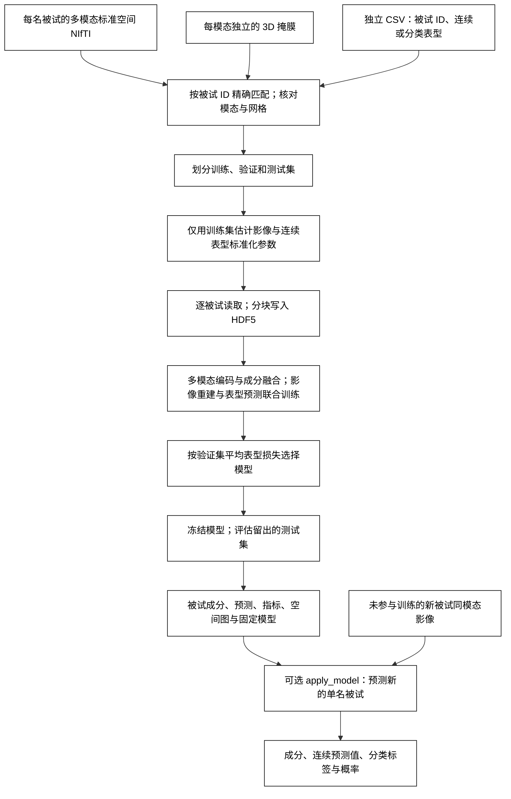

# SuperBigFLICA：监督多模态成分与表型预测

`run_superbigflica` 在多模态标准空间影像中学习共享成分，并同时预测指定的连续或分类表型。影像输入与 [BigFLICA](../bigflica/README.md) 完全相同：每名被试一个目录，每个模态指定影像相对路径和自己的标准空间掩膜。表型保存在独立 CSV，通过被试 ID 与目录名匹配。`apply_model` 使用保存的模型和训练集标准化参数，为一名新被试输出成分、连续表型预测值，以及分类标签和各类别概率。

FNIT 依据 SuperBigFLICA 方法独立实现线性自编码器、共享成分和监督预测。每个模态经线性编码后，由按成分归一化的模态权重融合，再经过 BatchNorm；解码器与编码器共享权重。训练联合优化影像重建、空间载荷稀疏项与表型预测。连续表型使用均方误差，分类表型使用交叉熵。计算使用 PyTorch；NIfTI 与分块缓存读写使用 nibabel 和 h5py，不调用原软件或工作流封装包。

## 流程



## 安装与输入

从仓库根目录创建并激活主页的 Conda 环境：

```bash
conda env create -f environment.yml
conda activate fnit
```

本功能使用环境中已有的 PyTorch、nibabel、NumPy、h5py、SciPy、scikit-learn 和 matplotlib，不需要预训练权重。CUDA 默认允许 TF32；训练、预测、影像缓存与输出使用 float32，不自动改用 float16 或 bfloat16。空间回归与 t→z 统计使用 float64：CUDA 复用 BigFLICA 的 PyTorch GPU 统计路径，CPU 使用 NumPy/SciPy。

影像目录例如：

```text
ukb_multimodal_new/
  SUBJECT_A/
    VBM_2mm.nii.gz
    dti_FA_2mm_mmorf.nii.gz
    dti_MD_2mm_mmorf.nii.gz
  SUBJECT_B/
    VBM_2mm.nii.gz
    dti_FA_2mm_mmorf.nii.gz
    dti_MD_2mm_mmorf.nii.gz
phenotypes.csv
modalities.json
```

每张影像须为 3D NIfTI，并已配准到对应模态的标准空间。模态之间可有不同网格；同一模态的全部被试影像须与该模态掩膜的形状和仿射一致。函数不执行配准。

配置格式沿用 BigFLICA 的 `modalities`，另加 `targets` 明确指定每个表型类型。影像路径相对于被试目录，掩膜路径为绝对路径：

```json
{
  "modalities": {
    "vbm": {"image": "VBM_2mm.nii.gz", "mask": "/absolute/masks/vbm.nii.gz"},
    "fa": {"image": "dti_FA_2mm_mmorf.nii.gz", "mask": "/absolute/masks/fa.nii.gz"},
    "md": {"image": "dti_MD_2mm_mmorf.nii.gz", "mask": "/absolute/masks/md.nii.gz"}
  },
  "targets": {
    "fluid_intelligence": "continuous",
    "disease": "categorical"
  }
}
```

表型 CSV 的一行对应一名被试，例如：

```csv
subject_id,fluid_intelligence,disease,split
SUBJECT_A,8,control,train
SUBJECT_B,6,case,validation
SUBJECT_C,,control,test
```

此片段仅说明文件格式；表型列名须换成实际 CSV 中的列名。ID 按字符串精确匹配，保留前导零，例如目录 `00123/` 对应 CSV 的 `00123`。重复 ID 会报错。分类表型可使用文字标签或离散编码，须显式声明为 `categorical`；不能把类别编号当作连续量训练。空值、`NA`、`N/A`、`NaN` 或 `null` 按目标分别屏蔽损失，该被试仍可参与其他表型训练与影像重建。

若 CSV 包含划分列，指定 `split_column="split"`，列值使用 `train`、`validation`、`test`。模型仅由训练集拟合，验证集用于选模，测试集留到选模完成后评估。未指定划分列时，按 `random_state` 自动划分；默认训练/验证/测试比例为 60%/20%/20%，并按第一个分类目标分层。相关被试应由使用者在 CSV 中放入同一集合，避免家系或重复扫描跨集合。训练被试数须大于 `n_components + 1`，并至少有 2 名验证和 2 名测试被试；连续目标须有至少两个数值不同的训练标签及两个有效验证标签，分类目标须有至少两个训练类别、每类至少两个训练标签和至少一个有效验证标签。自动分层时，缺失分类标签也作为独立层；某层人数不足时，应提供明确划分。

## Python 示例

以下示例同时预测一个连续表型和一个疾病分类。`selected_subject_ids` 规定候选被试范围，CSV 的划分列规定其中每人的用途。被试列表应包含训练、验证和测试被试；新被试预测使用同一套模态路径。

```python
import json
from pathlib import Path

from fnit.superbigflica import apply_model, run_superbigflica

subjects_root = Path("/absolute/path/ukb_multimodal_new")  # 每名被试一个目录
phenotypes_csv = Path("/absolute/path/phenotypes.csv")  # 独立表型 CSV
configuration_file = Path("/absolute/path/modalities.json")
configuration = json.loads(configuration_file.read_text(encoding="utf-8"))
modalities = configuration["modalities"]  # 各模态影像相对路径与绝对掩膜路径
phenotype_targets = configuration["targets"]  # CSV 列名 -> continuous/categorical
selected_subject_ids = [
    subject_id.strip()
    for subject_id in Path("/absolute/path/subjects.txt").read_text().splitlines()
    if subject_id.strip()
]  # 每行一个目录名；保留字符串 ID

model_dir = run_superbigflica(
    subjects_root=subjects_root,
    modalities=modalities,
    phenotypes_csv=phenotypes_csv,
    targets=phenotype_targets,
    output_dir=Path("/absolute/path/superbigflica_output"),
    n_components=20,  # 共享成分数；应依据训练规模和验证结果选择
    id_column="subject_id",  # CSV 中用于匹配目录名的列
    split_column="split",  # 按 CSV 使用 train/validation/test；无该列时设为 None
    subjects=selected_subject_ids,
    validation_fraction=0.2,  # 仅自动划分时使用
    test_fraction=0.2,  # 仅自动划分时使用
    max_epochs=50,
    batch_size=64,
    learning_rate=0.001,
    dropout=0.2,  # 训练时影像输入 dropout 概率
    relative_weight=0.5,  # 越大越强调影像重建和空间稀疏性
    random_state=0,
    device="cuda:0",
    max_gpu_gb=19.0,  # 显存预算；大掩膜或多成分仍需检查实际显存
    feature_block=2048,  # 空间回归的目标体素分块大小
    top_voxels=1000,  # 每张成分图保留绝对 z 值最高的体素数
)

new_subject_dir = subjects_root / "NEW_SUBJECT"  # 未参与训练、验证或测试的被试
new_subject_prediction = apply_model(
    model_dir=model_dir,
    subject_dir=new_subject_dir,
    device="cuda:0",
    output_file=Path("/absolute/path/new_subject_prediction.json"),
)
print(new_subject_prediction["subject_id"])
print(new_subject_prediction["components"])
print(new_subject_prediction["predictions"])
```

单独预测连续表型时，设 `targets={"fluid_intelligence": "continuous"}`；单独预测疾病时，设 `targets={"disease": "categorical"}`。省略 `subjects` 时从影像根目录识别候选被试。每次更换表型、被试集合、模态或掩膜，都应使用新的输出目录重新拟合。

## 命令行示例

`--config` 读取前述同时含 `modalities` 和 `targets` 的 JSON；`--subjects-file` 每行一个被试目录名。以下调用与 Python 示例使用同一组输入：

```bash
fnit-superbigflica fit \
  --subjects-root /absolute/path/ukb_multimodal_new \
  --config /absolute/path/modalities.json \
  --phenotypes-csv /absolute/path/phenotypes.csv \
  --id-column subject_id --split-column split \
  --subjects-file /absolute/path/subjects.txt \
  --output-dir /absolute/path/superbigflica_output \
  --n-components 20 --max-epochs 50 --batch-size 64 \
  --learning-rate 0.001 --dropout 0.2 --relative-weight 0.5 \
  --random-state 0 --device cuda:0 --max-gpu-gb 19 \
  --feature-block 2048 --top-voxels 1000

# 使用保存的模型与训练集标准化参数，输出新被试的预测 JSON。
fnit-superbigflica apply \
  --model-dir /absolute/path/superbigflica_output \
  --subject-dir /absolute/path/ukb_multimodal_new/NEW_SUBJECT \
  --device cuda:0 \
  --output-file /absolute/path/new_subject_prediction.json
```

不指定 `--split-column` 时按比例自动划分，可用 `--validation-fraction 0.2 --test-fraction 0.2` 调整；不指定 `--subjects-file` 时使用目录与 CSV 的匹配交集。其余选项对应下表的同名 Python 参数。完整帮助见 `fnit-superbigflica fit --help` 和 `fnit-superbigflica apply --help`。

## 参数

`run_superbigflica` 返回保存模型的 `Path`。

| 参数 | 默认值 | 含义 |
|---|---|---|
| `subjects_root` | 必填 | 每名被试一个目录的影像根目录。 |
| `modalities` | 必填 | 模态名到 `{"image": 相对影像路径, "mask": 绝对掩膜路径}` 的映射，与 BigFLICA 相同。 |
| `phenotypes_csv` | 必填 | 独立的表型 CSV 路径。 |
| `targets` | 必填 | CSV 表型列名到 `continuous` 或 `categorical` 的映射。可混合多个连续和分类目标。 |
| `output_dir` | 必填 | 输出与模型保存目录，须为新目录或空目录。 |
| `n_components` | 必填 | 多模态共享成分数；须不超过全部模态掩膜体素数之和。空间图输出前还检查训练成分的有效秩，秩不足时须减小此参数。 |
| `id_column` | `"subject_id"` | CSV 中的被试 ID 列，与影像目录名精确匹配。 |
| `split_column` | `None` | 可选 CSV 划分列；指定后使用 `train`、`validation`、`test`。 |
| `subjects` | `None` | 可选被试 ID 序列；限制候选被试范围与顺序。 |
| `validation_fraction` | `0.2` | 自动划分的验证集比例；使用 `split_column` 时不参与划分。 |
| `test_fraction` | `0.2` | 自动划分的测试集比例；训练集比例为剩余部分。 |
| `max_epochs` | `50` | 训练轮数；恰好执行此数目的轮次，再保留验证损失最低的模型。 |
| `batch_size` | `64` | 每个训练批次的目标被试数，至少为 2；CUDA 按显存预算降低实际批次，实际值写入模型。 |
| `learning_rate` | `0.001` | 模型 RMSprop 与自动损失权重 Adam 的初始学习率，后续使用余弦调度。 |
| `dropout` | `0.2` | 训练时影像输入与共享成分的 dropout 概率；评估与新被试预测时关闭。 |
| `relative_weight` | `0.5` | 影像重建与稀疏项相对权重，取值 `(0, 1)`；越大，影像项越强、监督预测项越弱。 |
| `random_state` | `0` | 自动划分和模型初始化的随机种子。 |
| `device` | `"auto"` | `auto` 优先可用 CUDA，否则 CPU；也可指定 `cpu` 或 `cuda:0`。 |
| `max_gpu_gb` | `19.0` | CUDA 显存预算，单位 GiB；用于检查模型、训练批次及空间统计的可用空间，并缩小实际批次和体素块。 |
| `feature_block` | `2048` | 空间回归的目标体素分块大小；CUDA 按显存预算降低实际块大小，记录在模型元数据中。 |
| `top_voxels` | `1000` | 各成分阈值图保留的最大体素数，按绝对 z 值选择。 |

`apply_model` 的参数为：

| 参数 | 默认值 | 含义 |
|---|---|---|
| `model_dir` | 必填 | `run_superbigflica` 返回的模型目录。 |
| `subject_dir` | 必填 | 一名新被试的影像目录，须具有训练时约定的模态和网格。 |
| `device` | `"auto"` | 新被试推理设备。 |
| `output_file` | `None` | 可选 JSON 输出路径；省略时只返回 Python 字典。 |

返回字典的 `subject_id` 为目录名，`components` 为按成分顺序排列的值，`predictions` 按 CSV 表型列名组织。连续目标含 `value`，已经还原到原表型单位；分类目标含 `label` 和 `probabilities`，后者为类别标签到概率的映射。

## 训练与输出

影像逐体素均值和标准差、连续表型均值和标准差，仅由训练集估计并保存。验证集、测试集和新被试共用这些参数。分类标签表由训练集建立，验证或测试集中出现训练未见类别时会报错。表型缺失不作标签填补；每个目标只对有效标签计算损失。

四项损失的相对权重按原实现设为 `(r, r, 1-r, 1-r)` 并按总和归一化，其中 `r=relative_weight`；前两项对应影像重建与空间稀疏项，后两项对应预测项与预测权重约束。这组比例固定，可学习的是各项中的五组损失尺度。模型使用 RMSprop，损失尺度使用 Adam，学习率分别作余弦调度；损失尺度前 10 轮冻结，从第 11 轮更新。最佳模型按验证集各目标的平均监督损失选择：连续目标使用标准化后的均方误差，分类目标使用交叉熵。测试集不用于选择训练轮数。

保存文件包括：

```text
model_dir/
  model.json                         # 参数、划分数量、表型类型与类别、阶段记录
  model.pt                           # 验证集选出的 PyTorch 模型参数
  vbm_mask.nii.gz, fa_mask.nii.gz, ... # 固定的模态掩膜
  vbm_mean.npy, vbm_std.npy, ...      # 每模态训练集的逐体素均值/标准差
  match_report.json                 # 匹配数量、缺失表型/影像与忽略的 ID
  input_store/
    vbm.h5, fa.h5, ...               # 分块影像缓存：[被试, 掩膜体素]
  subj_course.npy                    # [被试, 成分]
  subj_course.tsv                    # subject_id、split、component_001 等列
  predictions.csv                    # 被试 ID、划分、真实表型及模型预测
  metrics.json                       # 各划分、各表型的样本数与预测指标
  history.csv                        # 每轮训练/验证损失与选模记录
  modality_weights.npy               # [成分, 模态]
  prediction_weights.npy             # [成分, 连续输出数+分类类别数]
  vbm_zstat.npy, fa_zstat.npy, ...    # [掩膜体素, 成分]
  maps/
    vbm/
      component-001_zstat.nii.gz       # 模态原网格上的成分 z 图
      component-001_top-1000.nii.gz    # 绝对 z 值最高的体素
      component-001_top-1000.png       # 阈值脑图
    fa/, md/, ...
```

`predictions.csv` 含 `subject_id`、`split`，每个目标的 `目标名__observed`、`目标名__prediction`；分类目标另有 `目标名__prob_000` 等列，类别顺序见模型元数据。`metrics.json` 按训练、验证和测试分别给出有效标签数；连续目标报告原单位 MAE、RMSE、R² 和 Pearson r，分类目标报告 accuracy、balanced accuracy、macro F1，二分类在两类标签均存在时报告 ROC AUC。

空间图由训练被试的成分分别回归到每个模态的影像，再把 t 统计量转换为 z；图像保留模态掩膜的网格，掩膜外为零。`modality_weights.npy` 表示各模态对成分的贡献，`prediction_weights.npy` 表示成分对各预测输出的权重。分类目标具有多个输出权重，须结合 `model.json` 保存的类别顺序解释。

## 与原实现的对应

[SuperBigFLICA 原仓库](https://github.com/weikanggong/SuperBigFLICA) 提供 `SupervisedFLICA` 训练和 `get_model_param` 投影接口，没有独立命令行程序。其输入是已经准备好的“被试 × 特征”模态矩阵列表和连续表型矩阵；原版调用形式如下，需在原作者代码的独立目录中运行：

```python
from SupBigFLICA_cpu import SupervisedFLICA, get_model_param

# 每个列表元素为一个模态的 [被试, 特征] 矩阵；数组须事先准备。
training_imaging_matrices = imaging_train
validation_imaging_matrices = imaging_validation
training_phenotype_matrix = phenotypes_train
validation_phenotype_matrix = phenotypes_validation
relative_weight = 0.5

validation_prediction, best_model, loss_history, best_score, final_model = SupervisedFLICA(
    x_train=training_imaging_matrices,
    y_train=training_phenotype_matrix,
    x_test=validation_imaging_matrices,  # 原函数名为 x_test，选模时实际传验证集
    y_test=validation_phenotype_matrix,
    dropout=0.2,
    device="cpu",
    auto_weight=[1, 1, 1, 1],
    lambdas=[relative_weight, relative_weight, 1-relative_weight, 1-relative_weight],
    nlat=20,
    lr=0.001,
    random_seed=0,
    maxiter=50,
    batch_size=64,
    init_method="random",
)
original_model_outputs = get_model_param(
    x_train=training_imaging_matrices,
    x_test=imaging_test,  # 留出测试集
    y_train=training_phenotype_matrix,
    best_model=best_model,
)
```

源码核对固定到 [`6695b638802aab50f43f889e97af223f8191018e`](https://github.com/weikanggong/SuperBigFLICA/tree/6695b638802aab50f43f889e97af223f8191018e)。该版本未提供明确再分发许可，FNIT 不包含其源码。FNIT 增加了影像目录与 CSV 的 ID 匹配、连续/分类混合多目标、固定的数据划分、缺失标签处理及新被试推理。缺失标签按每个目标实际观察数求均值，混合目标按平均验证监督损失选模；原版连续目标按 Pearson 相关选模。FNIT 的 `max_epochs` 表示恰好执行的轮数，原版 `maxiter` 执行 `maxiter + 1` 轮。原版空间载荷提取循环重复回归第一模态，且把 t 统计量命名为 z；FNIT 对各模态独立回归并完成 t→z 转换。

## 真实数据验证

使用 **500 名真实 UKB 被试、VBM/FA/MD 完整掩膜**，训练/验证/测试为 300/100/100 人，三个共享成分、20 个 epoch、批次 32。连续目标为 `p20023_i0`（[匹配反应时间，毫秒](https://biobank.ndph.ox.ac.uk/ukb/field.cgi?id=20023)），分类目标为 `Incident_I9_HYPTENS`。示例中的 `fluid_intelligence` 仅说明 CSV 格式，不是这次核验的表型。

| 测试项目 | 当前 CPU 实测 |
|---|---|
| 反应时间预测（100 人测试集） | MAE 75.50 ms，RMSE 98.59 ms，Pearson r 0.1595 |
| 高血压分类（100 人测试集） | ROC AUC 0.6492，balanced accuracy 0.5000 |
| 公开 API 全流程，含影像读写 | 338.47 s；共享 CPU 主机、8 线程、单次观测 |
| 输出检查 | 500×3 成分；18 张 float32 NIfTI 均有限、掩膜外为零；冻结推理成分最大差 2.1e-07 |

同一真实训练集的 8 人完整模态输入另与原版连续模型比较：共享成分与连续预测一致，重建最大绝对差 5.96e-08，四项损失最大差 2.38e-07，全部检查的梯度最大差 8.73e-10。对照固定相同参数、关闭 dropout，验证前向/损失/梯度计算；分类头与混合目标选模是 FNIT 扩展。

当前分类设置的测试 balanced accuracy 为 0.5；概率排序指标与默认标签分类效果应分别解释。完整精度、阶段时间、峰值 RSS、输入及源码 SHA-256 见 [真实验证报告](../../validation/superbigflica/README.md)。GPU 真实队列全流程尚未测量。

## 参考文献与原实现

1. Gong W, Bai S, Zheng Y-Q, Smith SM, Beckmann CF. Supervised phenotype discovery from multimodal brain imaging. *IEEE Transactions on Medical Imaging*. 2023;42(3):834–849. [DOI: 10.1109/TMI.2022.3218720](https://doi.org/10.1109/TMI.2022.3218720).
2. [SuperBigFLICA 原实现](https://github.com/weikanggong/SuperBigFLICA)，[固定版本源文件](https://github.com/weikanggong/SuperBigFLICA/blob/6695b638802aab50f43f889e97af223f8191018e/SupBigFLICA_cpu.py)。
