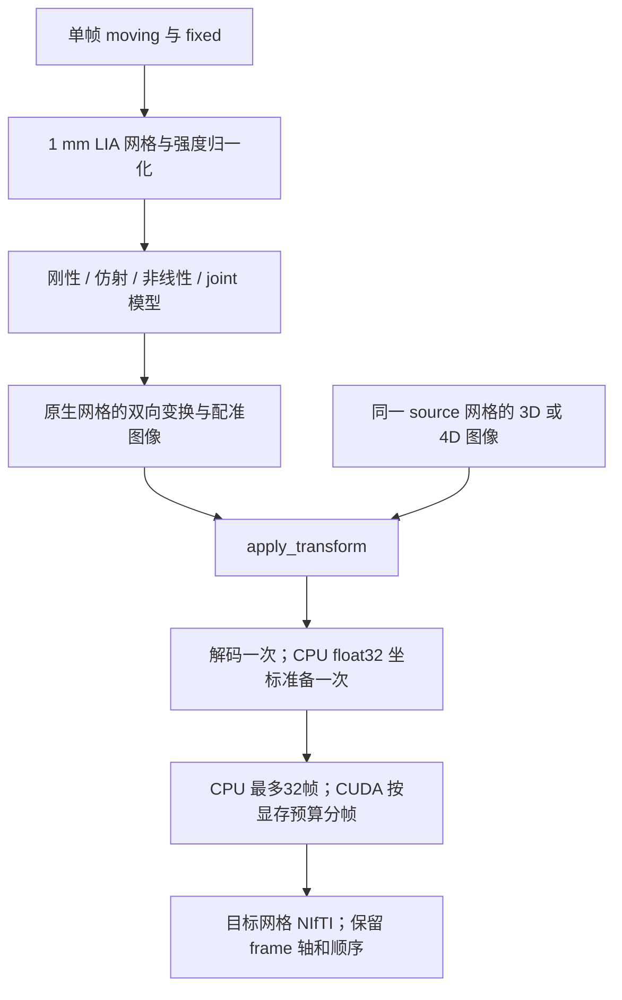
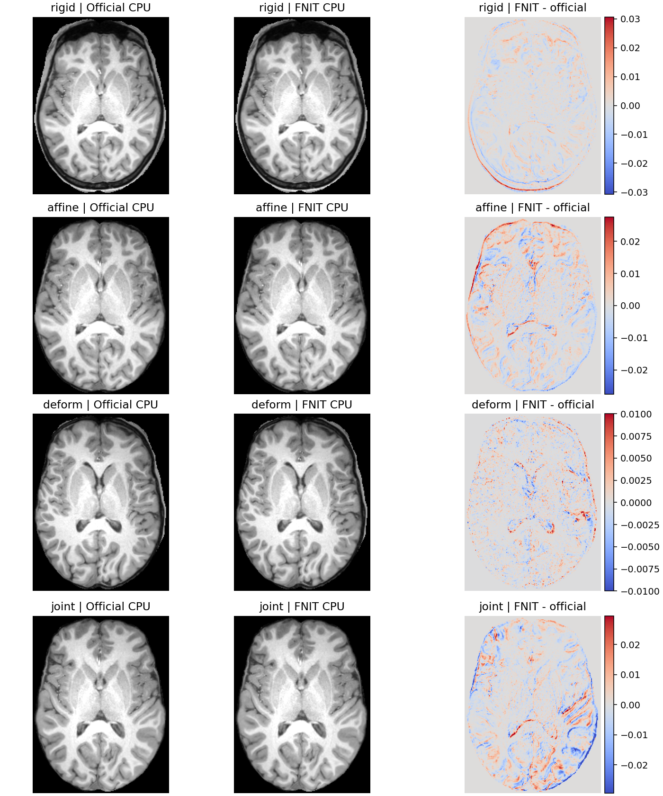

# SynthMorph：配准与 3D/4D 变换应用

## 1. 功能简介

[返回首页](../../README.md) · [源码目录](../../src/fnit/synthmorph/) · [权重](../WEIGHTS.md)

本模块将指定 FreeSurfer 8.2.0 构建中的 TensorFlow/Keras SynthMorph 移植为 PyTorch，支持刚性、仿射、非线性和联合配准，直接读取官方 HDF5 权重。推理不导入 TensorFlow、VoxelMorph、Neurite，也不调用 FreeSurfer。

参考 build 为 `freesurfer-linux-centos7_x86_64-8.2.0-20260314-d932c45`，并非随时变化的开发分支。准确源文件和权重哈希见 [provenance.json](../provenance.json)。



2026-10-02 的独立 apply 优化复用解码后的 float32 数据、坐标与采样索引，并按 frame 限制 CUDA 缓冲。2026-10-04 修复 CPU 最终 linear 的有效域和 nearest 半体素舍入；续修统一 CPU 的 NIfTI 缩放解码，让 rigid/affine 配准图像按返回的仿射重采样，并修正 CPU joint 的置信 mass 与 barycenter 两种归约形状。随后 CPU joint 续修原始坐标插值、显式 oneDNN 小网格卷积与仿射算术顺序，extent192/256 的完整固定门均通过。配准模型仍只接受单帧 3D 输入，CUDA 沿用已验收的解码与采样路径。

## 2. Python 调用、输入与输出

文件输入支持 NIfTI（`.nii` / `.nii.gz`）和 MGH/MGZ；Python 也接受 nibabel spatial image。配准输入为有限值的单帧 `(X,Y,Z)`；apply 输入为 `(X,Y,Z)` 或 `(X,Y,Z,T)`，最后一轴为 frame。位移场的三分量不能作为时间序列输入。

完全载入内存的对象可直接传入 `SynthMorph` 实例。CPU 路径先按 ArrayProxy 默认类型解码，再转为模型 float32；这与原版读图及 `np.asanyarray(source_image.dataobj)` 物化的顺序相同。CUDA 保留直接请求 float32 的既有路线。对用户已经计算好的内存图像，数据数组本身就是输入，不从 header 再附加一次缩放。带 slope/intercept 的 NIfTI 若先按不同 dtype 缩放，物化后的数组可能已有尾数差，不能仅靠相同 header 消除。历史首次分歧见[内存对象核验](../../validation/synthmorph/cpu_20261004/in_memory_affine_20261004/README.md)，本次修复与真实双向验收见[续修报告](../../validation/synthmorph/cpu_fixes_20261004/README.md)。

CPU rigid/affine 的 `result.moved` 与 `apply_transform(moving, result.transform, device="cpu")` 使用同一采样契约；`fixed_moved` 对应 fixed 和 inverse。双向网络预测在 float32 中不一定精确互逆，最终图像应按其关联的返回仿射取逆计算 pull，不能直接改用另一方向的预测矩阵。

```python
from pathlib import Path
from fnit import SynthMorph, TorchApplyWarp, apply_transform, convert_warp_to_fsl

output_dir = Path("results")  # 输出目录：保存本例配准图像和变换
output_dir.mkdir(parents=True, exist_ok=True)

register = SynthMorph(
    weights="/path/to/weights",  # 权重输入：包含官方 SynthMorph HDF5 权重的目录
    device="cuda:0",  # 计算设备；可改为 "cpu"
    model="joint",  # 配准模型：joint 同时估计仿射和非线性变换
    extent=256,  # 网络空间每轴体素数；支持 192 或 256
    hyper=0.5,  # 非线性正则化参数，范围 0–1
    steps=7,  # stationary velocity scaling-and-squaring 次数
)
result = register(
    moving="moving_T1w.nii.gz",  # 输入：待变换的单帧 3D 图像
    fixed="fixed_T1w.nii.gz",  # 输入：目标图像；决定 moved 输出网格
    init=None,  # 可选输入：带几何信息的初始 LTA 仿射
    mid_space=False,  # 是否以初始仿射的中间空间初始化；True 时必须提供 init
    header_only=False,  # affine/rigid 时可只改头信息；joint 应为 False
    output_dir=None,  # 可选调试目录；此处不写网络空间中间文件
)
result.moved.save(path=output_dir / "moving_in_fixed.nii.gz")  # 输出路径：moving 在 fixed 网格的图像
result.fixed_moved.save(path=output_dir / "fixed_in_moving.nii.gz")  # 输出路径：fixed 在 moving 网格的图像
result.transform.save(path=output_dir / "moving_to_fixed.mgz")  # 输出路径：moving→fixed 变换
result.inverse.save(path=output_dir / "fixed_to_moving.mgz")  # 输出路径：fixed→moving 变换

fsl_warp = convert_warp_to_fsl(
    warp=result.transform,  # 输入：joint/deform 返回的 fixed 网格 RAS 位移场
    moving="moving_T1w.nii.gz",  # 输入：配准时的 moving；决定 FSL source 坐标
    fixed="fixed_T1w.nii.gz",  # 输入：配准时的 fixed；决定 warp 和输出网格
)
fsl_warp.save(path=output_dir / "moving_to_fixed_fsl_warp.nii.gz")  # 输出：FSL 相对位移场
warped = TorchApplyWarp(device="cuda:0").run(
    input="moving_T1w.nii.gz",  # 输入：与配准 moving 具有相同网格的待变换图像
    reference="fixed_T1w.nii.gz",  # 输入：目标网格；与转换时 fixed 一致
    output=output_dir / "moving_in_fixed_by_fsl_warp.nii.gz",  # 输出：空间变换后的图像
    warp=output_dir / "moving_to_fixed_fsl_warp.nii.gz",  # 输入：刚转换的 FSL warp
    interpolation="trilinear",  # 连续图像用三线性；标签图用 nearest
    warp_convention="auto",  # intent 2006 自动按 FSL relative 解释
    output_dtype="float",  # 输出 float32
)

labels = apply_transform(
    image="moving_labels.nii.gz",  # 输入：与 moving 几何一致的离散标签图
    transformation=result.transform,  # 输入：moving→fixed 的带几何变换
    method="nearest",  # 标签使用最近邻，避免产生新标签值
    fill=0,  # 视野外填充值
    dtype="int16",  # 输出体素类型
    header_only=False,  # False 表示真正重采样数据
    device="cpu",  # 默认CPU，沿用原采样设备
    frame_chunk_size=None,  # CPU默认每次最多32个frame
)
labels.save(path=output_dir / "labels_in_fixed.nii.gz")  # 输出路径：重采样后的标签图
```

`from fnit.synthmorph import SynthMorph, RegistrationResult, WorldTransformChain, apply_transform, convert_warp_to_fsl` 是功能模块入口。模型实例可重复用于后续影像对。

### 模型构造

`SynthMorph(weights=None, device="cpu", model="joint", extent=256, hyper=0.5, steps=7, configure_precision=True)`：

| 参数 | 含义 |
|---|---|
| `weights` | 权重目录，或将 `affine`、`rigid`、`deform` 映射到权重文件的字典；省略时使用统一查找顺序 |
| `device` | `"cpu"` 或 `"cuda:N"` |
| `model="joint"` | 默认，联合仿射与非线性配准 |
| `model="deform"` | 非线性阶段；输入应已具有适当的仿射对齐 |
| `model="affine"` / `"rigid"` | 仿射 / 刚性配准 |
| `extent` | 192 或 256，每轴网络网格大小，分辨率 1 mm，默认 256 |
| `hyper` | 非线性正则化参数，`0 < hyper < 1`，默认 0.5；实例构造时固定 |
| `steps` | scaling-and-squaring 次数，至少 5，默认 7 |
| `configure_precision` | 默认 `True`：CUDA 构造允许 TF32 matmul/cuDNN；CPU 构造不改变 CUDA 的进程全局配置。`False` 保留调用方策略。recon-all 构造后应用其阶段 FP32 配置；不启用半精度。 |

模型使用 float32 张量；CUDA 构造默认允许 TF32 matmul 和 cuDNN 内核，不使用 float16 或 bfloat16。CPU joint 的正式 eval 推理使用有序原始坐标插值、临时 channels_last_3d 及显式 oneDNN 卷积；训练、梯度、CPU autocast、禁用 oneDNN、自定义卷积或 leaf/global hooks 保留既有 CPU 调用路线。detector 本身的 forward/pre hooks 仍正常执行一次。不同 `hyper` 需构造另一实例；底层 `DeformNetwork.set_hyper()` 是显式重新计算特化权重的入口。改变实例的普通属性不会自动更新这些权重。Python 的 CPU 线程数可用 `torch.set_num_threads()` 设置；统一 CLI 提供 `-j` 参数。

### 配准调用与结果

`register(moving, fixed, init=None, mid_space=False, header_only=False, output_dir=None, transform_only=False, compute_inverse=True, precision_report=None)`：

| 参数 | 含义 |
|---|---|
| `moving`, `fixed` | 文件路径或 `nibabel.spatialimages.SpatialImage`，必须为单帧 3D 图像；网格和方向可不同 |
| `init` | 可选初始仿射：`.lta` 路径、带源/目标几何的 `AffineTransform`，或 4×4 world-RAS 矩阵 |
| `mid_space` | 使用初始仿射的中间空间；为 `True` 时必须提供 `init` |
| `header_only` | 仅改变影像头信息，限 affine / rigid |
| `output_dir` | 调试输出目录：`inp_1.nii.gz`、`inp_2.nii.gz` 和 `network_transforms.npz`。CPU 指定 `init` 时两幅预处理输入采用 fixed 网络网格；CUDA 保留此前 preview 几何。官方另写中间场/输出图，本接口文件列表如上。 |
| `transform_only` | 默认 `False`；`True`不重采样两幅影像，`moved`/`fixed_moved`为`None`，与`header_only`不能同时开启。 |
| `compute_inverse` | 默认 `True`；`False`仅允许非线性模型、`transform_only=True`且无调试目录，`inverse=None`。两次反对称velocity前向保留，只省去未消费的反向积分/合成；不代替recon-all的原生数值求逆。非法组合抛`ValueError`。 |
| `precision_report` | 默认 `None`；列表收集真实前向设备、输入/模型dtype、TF32和autocast，不插入额外同步。 |

返回 `RegistrationResult`：

| 字段 | 含义 |
|---|---|
| `moved` | moving 在 fixed 空间的 `FNITNifti1Image` |
| `fixed_moved` | fixed 在 moving 空间的 `FNITNifti1Image` |
| `transform` | moving → fixed 的带几何变换 |
| `inverse` | fixed → moving 的带几何变换 |

重采样时图像采用目标网格；`header_only=True` 保留数据并更新 affine。默认计算双向结果；显式关闭未消费逆变换的接口见上表。affine / rigid 返回 world-space `AffineTransform`，保存为 `.lta`；joint / deform 返回 target-grid、target→source 的 world-RAS 毫米位移 `DenseWarp`，可保存为 `.mgz`、`.mgh` 或 NIfTI。普通三通道数组不携带足够的源/目标几何，不能直接替代内存中的变换对象。直接在 Python 中保存时，由调用者准备输出父目录。

### 应用已有变换

`apply_transform(image, transformation, method="linear", fill=0, dtype="float32", header_only=False, *, device="cpu", frame_chunk_size=None, boundary="grid-constant", output_mask=None, spatial_chunk_size=262144)`：

| 参数 | 含义 |
|---|---|
| `image` | 路径或 `nibabel.spatialimages.SpatialImage`；接受 3D 和末维为 frame 的 4D |
| `transformation` | `.lta` 路径、warp 文件路径、`AffineTransform`、`DenseWarp` 或 `WorldTransformChain` |
| `method` | `linear` 或 `nearest`，标签使用 `nearest`；`WorldTransformChain` 另支持 `spline` 三次B-spline影像插值 |
| `fill` | 普通Affine/DenseWarp默认0，Python可用 `None` 选择边界扩展；World链固定 `fill=0`，非零及 `None` 报错 |
| `dtype` | 输出NumPy dtype，默认float32；修改输出类型不改变采样计算精度。普通Affine/DenseWarp使用float32插值；World链使用公共volume采样器的既有精度，grid-constant spline的系数和坐标为float64，输出仍float32 |
| `header_only` | 只更新头信息，限Affine；World链不支持，`dtype` 转换仍生效 |
| `device` | keyword-only；默认 `"cpu"`，CUDA显式选择。普通Affine/DenseWarp按原CPU float32顺序建立坐标再搬到所选设备；World链依其 `coordinate_precision` 在公共采样器中组合坐标 |
| `frame_chunk_size` | 普通Affine/DenseWarp：keyword-only；正整数为每次 frame 上限，并先限制到实际 frame 数；None 时 CPU 每次最多32帧，CUDA 在坐标计划驻留后，按最多8 GiB的变化缓冲预算与 `20,000,000,000 − 当前CUDA allocated − 512 MiB` 两者较小值自动选择；每帧按一个输入加两个 float32 输出缓冲计费。显式CUDA分块也检查剩余20 GB预算；无法容纳一帧或指定分块超预算时报错 |
| `frame_chunk_size`（World链） | 公共volume sampler的 `batch_size`；默认None→8，正整数指定每批帧数；沿用现有volume采样的数据流 |
| `boundary` | 仅World链生效：`grid-constant` 为默认零扩展；`periodic` 使用既有 clean volume 的周期样条系数，并只将 `[−1e−6,N−1+1e−6]` 内的边缘舍入夹回，源 FOV 更远位置为零，不能作为无限循环取样。普通Affine/DenseWarp传入非默认值时报错 |
| `output_mask` | 仅World链：可选3D路径或nibabel image，必须与reference shape/affine一致；输出mask外清零。默认None |
| `spatial_chunk_size` | 仅World链：每次空间采样点上限，正整数，默认262144；普通Affine/DenseWarp仅接受默认值 |

普通Affine/DenseWarp返回 `FNITNifti1Image`，空间网格来自变换target；World链默认float32直接返回公共采样器的 `nibabel.Nifti1Image`，不重建其header。4D 输入保留 frame 轴、顺序和时间头信息，包括 `(X,Y,Z,1)`。warp 的 source geometry 必须与输入图像一致；普通文件不保存 FNIT source 几何，调用者需保证输入为原变换的 source 网格。其他模态若与 moving 不同网格，应先正确组合变换。

#### 4D 影像示例

```python
from fnit import apply_transform

moving_timeseries_path = "moving_4d.nii.gz"  # (X,Y,Z,T)，已在原 moving 网格
saved_ras_warp_path = "results/moving_to_fixed.mgz"  # FNIT RAS位移场
warped_timeseries = apply_transform(
    image=moving_timeseries_path,
    transformation=saved_ras_warp_path,
    method="linear",  # 连续影像使用三线性插值
    fill=0,
    dtype="float32",
    device="cuda:0",  # 显式GPU采样；省略时仍为CPU
    frame_chunk_size=None,  # CPU最多32帧；GPU在8 GiB缓冲上限与剩余20 GB预算内自动选择
)
warped_timeseries.save("results/timeseries_in_fixed.nii.gz")
```

CPU默认在frame数≤32时仍一次采样，返回张量的NumPy视图以避免输出拷贝；更多frame使用现有分块输出缓冲。CUDA的8 GiB仅指变化帧缓冲上限，坐标与已有分配计入剩余20 GB额度，512 MiB用于留出采样器和运行时空间。

nearest 按半体素舍入，有效域为 `[0,n)`；CPU 先取 floor 再比较小数部分是否 ≥0.5，避免 FP32 加法将临界坐标推过边界。当前 CPU linear 对齐官方 `[0,n)` 有效域并限制边缘邻点索引；CUDA 保留此前 `[0,n-1]` 路径。frame 切块不改变各设备既定的插值权重或图像范围。CPU 与 CUDA linear 内核可能因边界和舍入产生不同结果；本轮完整 490 帧的跨设备误差见第5节，新 CPU 边界回归见本轮 CPU 对照。

### 固定场、BBR与逐帧运动的一次采样

`WorldTransformChain(reference, reference_to_source_world, pre_affine_pull_ras=None, motion_pull_world=None, coordinate_precision="float64")` 是不可重新赋值的变换链对象，由 `fnit.synthmorph` 导出：

| 字段 | 输入与含义 |
|---|---|
| `reference` | 3D路径或nibabel image；定义输出网格 |
| `reference_to_source_world` | 有限可逆4×4 RAS-mm pull affine；将加上固定位移后的world坐标映射到源参考空间；例如inverse(EPI→T1 BBR)。不是FLIRT scaled-mm矩阵 |
| `pre_affine_pull_ras` | 可选reference网格的 `(X,Y,Z,3)` RAS-mm位移场路径或image；在world affine之前相加，例如 `T1_world − MNI_world` |
| `motion_pull_world` | 可选 `(T,4,4)` RAS-mm矩阵数组；源参考world→每个原始frame的world。None为逐帧identity |
| `coordinate_precision` | `"float64"` 为既有clean组合顺序；`"fmriprep"` 为既有preproc的float32坐标舍入、dense-field查询及源voxel空间HMC顺序 |

公共底层直接复用已实现的volume采样器。采样顺序为reference world → 固定RAS pull → world affine → 每帧motion pull → source voxel → 一次影像插值；时间轴不做空间样条滤波。输出保留全部frame和TR，源为4D单帧时保留 `(X,Y,Z,1)`。

2026-10-04 的 CPU 优化修复了该成熟公共采样器的两处行为：显式 `fmriprep`、`grid-constant` 的 nearest/linear 查询直接保留 FP64 体素坐标，避免归一化到 float32 后改变半体素取整；三维 `fmriprep` 输出保留 reference 的完整时间单位标志。CPU 的匹配协议使用环境已有的 SciPy，三次样条每帧滤波一次再分块查询，帧池以调用方的 Torch 线程数为上限。完整 3D 的三种插值和掩膜样条与官方逐位一致；完整 490 帧的 CPU 对照及官方多线程参照异常见 [World 专项](../applywarp/WORLD_CPU_BENCHMARK_20261004.md)。H100 上完整 490 帧的保存字节与优化前相同，见 [GPU 报告](../../validation/multimodal_cpu_20261004/gpu_world_v20_20261004.public.json)。这些是固定变换的采样检查，不是 SynthMorph 模型配准计时。

```python
import numpy as np
from fnit.synthmorph import WorldTransformChain, apply_transform

source_bold_path = "minimal_bold.nii.gz"  # 原始BOLD或只做过STC的(X,Y,Z,T)影像
mni_reference_path = "MNI152_T1_2mm.nii.gz"  # 输出3D网格
mni_to_t1_pull_path = "MNI152_2mm_to_T1_pull_ras.nii.gz"  # 固定网格RAS-mm位移
# 此处文件是已经转换好的world-RAS BBR，不能直接传FLIRT scaled-mm .mat。
epi_to_t1_world_affine = np.load("EPI_to_T1_world.npy")  # (4,4)，EPI→T1
reference_to_epi_world_affine = np.linalg.inv(epi_to_t1_world_affine)
frame_motion_pull_world = np.load("motion_pull_world.npy")  # (T,4,4)，参考EPI→原frame
world_transform_chain = WorldTransformChain(
    reference=mni_reference_path,
    reference_to_source_world=reference_to_epi_world_affine,
    pre_affine_pull_ras=mni_to_t1_pull_path,
    motion_pull_world=frame_motion_pull_world,
    coordinate_precision="fmriprep",  # 匹配既有preproc坐标顺序
)
preproc_mni_image = apply_transform(
    image=source_bold_path,
    transformation=world_transform_chain,
    method="spline",  # 三次B-spline影像插值
    boundary="grid-constant",  # 12体素零prepad对应的既有preproc边界
    output_mask=None,  # 可选与MNI网格完全一致的3D输出mask
    fill=0,
    dtype="float32",  # 直接返回公共采样器的图像与完整header
    frame_chunk_size=8,  # 每批8帧；None同样使用8帧
    spatial_chunk_size=262144,  # 每批空间查询点上限
    device="cuda:0",  # 采样和大型坐标组合使用该设备
)
preproc_mni_image.to_filename("results/preproc_MNI.nii.gz")
```

clean volume使用已经运动校正的clean原生EPI作为源，World链设置 `motion_pull_world=None`、`coordinate_precision="float64"`，应用时设置 `method="spline"`、`boundary="periodic"` 及MNI输出mask。普通LTA/DenseWarp的nearest/linear默认值与边界行为保持原样，`spline`仅用于World链。

### 转成 FSL warp 并应用

`convert_warp_to_fsl(warp, *, moving, fixed)` 返回 fixed 网格、末维为 3 的 float32 NIfTI，intent 为 2006（FSL relative displacement）。`warp` 可为本次 `result.transform`，也可为之前保存的 RAS 位移场路径。`moving` 和 `fixed` 必须是**生成这个 warp 时使用的两张 3D 图像**，可以给路径或 nibabel image。转换会核对 warp 网格；内存中的 `DenseWarp` 还会核对源和目标几何。保存后的普通 warp 文件不保存源几何，因此使用文件路径时必须正确传入原 moving。

SynthMorph 在每个 fixed 体素上保存 world-RAS 位移 `d`。转换先求源图像中的 FSL scaled-mm 坐标，再减去 fixed 的 FSL scaled-mm 坐标：`F_moving A_moving⁻¹ (A_fixed v + d(v)) − F_fixed v`。这里 `A` 是 NIfTI voxel→RAS，`F` 是 voxel→FSL scaled-mm。方向仍是 fixed→moving 的 pull mapping；文件名中的 moving→fixed 指的是图像重采样方向。它不是 FNIRT B-spline coefficient，也不能把 RAS 位移数组直接改 NIfTI intent 当成 FSL warp。

`TorchApplyWarp(input=..., reference=..., warp=...)` 把图像重采样到 `reference` 网格，返回 `ApplyWarpResult`：`image` 是输出图像，`valid_mask` 是有效采样区，`qc` 记录实际位移约定等信息。`run(input=..., reference=..., output=..., warp=...)` 同时写盘。复用这个 warp 处理其他模态或标签时，输入应与原 moving 具有相同的采样几何；若不同，需另行提供符合 FLIRT scaled-mm 定义的 `premat`。详见 [TorchApplyWarp](../applywarp/README.md)。

### 权重与执行位置

| 权重 | 使用模式 |
|---|---|
| `synthmorph.affine.2.h5` | affine；joint 的仿射阶段 |
| `synthmorph.rigid.1.h5` | rigid |
| `synthmorph.deform.3.h5` | deform；joint 的非线性阶段 |

优先核查 FNIT 固定 Release / 清单与 [WEIGHTS.md](../WEIGHTS.md)，验证文件大小、SHA-256 和许可证；没有明确再分发许可的文件从原作者渠道获取。独立推理只需本地权重；HDF5 加载器只支持这里记录的架构，不是任意 Keras 网络转换器。

网络空间采样、网络、速度场积分、坐标组合和配准结果重采样在所选 PyTorch 设备执行。HDF5 读取、超网络权重特化、初始仿射的矩阵平方根及 nibabel 影像 I/O 在 CPU 执行；独立 `apply_transform` 解码一次，在 CPU 建立原 float32 坐标；采样可选择 CPU 或 CUDA。对于固定 `hyper`，构造时把大型超网络特化为普通卷积权重，随后可复用。这一初始化与重复调用的时间分配不同于原实现，比较性能时需区分完整 CLI 进程和已加载 API。

## 3. 命令行调用

```bash
fnit synthmorph moving_T1w.nii.gz fixed_T1w.nii.gz \
  --model joint --device cuda:0 --weights /path/to/weights \
  -o results/moving_in_fixed.nii.gz -O results/fixed_in_moving.nii.gz \
  -t results/moving_to_fixed.mgz -T results/fixed_to_moving.mgz \
  --fsl-warp results/moving_to_fixed_fsl_warp.nii.gz

fnit applywarp --in moving_T1w.nii.gz --ref fixed_T1w.nii.gz \
  --warp results/moving_to_fixed_fsl_warp.nii.gz --interp trilinear \
  --datatype float --device cuda:0 \
  --out results/moving_in_fixed_by_fsl_warp.nii.gz

fnit apply results/moving_to_fixed.mgz moving_labels.nii.gz \
  results/labels_in_fixed.nii.gz --method nearest --dtype int16
```

```bash
# moving_4d需与原moving具有相同采样几何。
# 省略--frame-chunk-size：变化帧缓冲最多8 GiB，并检查已驻留坐标后的剩余20 GB预算。
# 若显式指定--frame-chunk-size 8，每次最多8帧，同样检查剩余额度。
fnit apply results/moving_to_fixed.mgz moving_4d.nii.gz \
  results/timeseries_in_fixed.nii.gz --method linear --dtype float32 \
  --device cuda:0
```

| 配准参数 | 含义 |
|---|---|
| `moving fixed` | 两个必需位置参数 |
| `-m`, `--model` | joint / deform / affine / rigid，默认 joint |
| `--weights`, `--device` | 权重目录、设备 |
| `-o`, `--out-moving` / `-O`, `--out-fixed` | 正向 / 反向图像 |
| `-t`, `--trans` / `-T`, `--inverse` | 正向 / 反向变换 |
| `--fsl-warp` | joint/deform 正向变换转换为 FSL intent-2006 相对位移场 |
| `-i`, `--init` / `-M`, `--mid-space` | 初始仿射 / 中间空间初始化 |
| `-H`, `--header-only` | 仅更新头信息 |
| `-e`, `--extent` / `-r`, `--hyper` / `-n`, `--steps` | 网络网格、正则化和积分步数，与 API 默认值一致 |
| `-j`, `--threads` | Torch 线程数，CLI 默认 4 |
| `-d`, `--output-dir` | 调试目录 |

配准至少请求一个影像、变换、FSL warp 或调试输出。统一 CLI 会创建输出父目录。`fnit apply` 的位置参数依次是变换、影像、输出；支持 `--method`、`--fill`、`--dtype`、`--header-only`、`--device` 和 `--frame-chunk-size`，含义和默认值同 API。CLI dtype 选择为 `uint8`、`uint16`、`int16`、`int32`、`float32`，默认 `float32`。apply 默认使用 CPU；`--device cuda:0` 显式选择 GPU sampler，`--frame-chunk-size` 限制每次 frame 数量；省略时CPU最多32帧，CUDA按上述8 GiB缓冲与剩余20 GB额度自动选择。当前 apply CLI 与 Python 每次均处理一对 image/output。`WorldTransformChain` 目前通过Python构建；此处CLI仍接收LTA或RAS warp文件。

## 4. 原软件调用

```bash
mri_synthmorph register -m joint \
  -o reference/moving_in_fixed.nii.gz -O reference/fixed_in_moving.nii.gz \
  -t reference/moving_to_fixed.mgz -T reference/fixed_to_moving.mgz \
  moving_T1w.nii.gz fixed_T1w.nii.gz

mri_synthmorph apply -m nearest -t int16 \
  reference/moving_to_fixed.mgz moving_labels.nii.gz \
  reference/labels_in_fixed.nii.gz

applywarp --in=moving_T1w.nii.gz --ref=fixed_T1w.nii.gz \
  --warp=results/moving_to_fixed_fsl_warp.nii.gz --rel \
  --interp=trilinear --datatype=float \
  --out=reference/moving_in_fixed_by_fsl_warp.nii.gz
```

两版的第一个输入均为 moving、第二个为 fixed；`-o/-O` 保存两个方向的影像，`-t/-T` 保存对应变换。`--fsl-warp` 是 FNIT 新增输出，FreeSurfer 的 `mri_synthmorph register` 没有同名参数；它只支持 `joint`/`deform`。`fnit applywarp` 与独立 FSL `applywarp` 使用同一转换后的 warp 对 moving 重采样。`apply` 的原版 `-m/-t` 分别对应本包的 `--method/--dtype`。离散标签使用最近邻插值，以免引入新标签值。

官方变换同样可以应用到同一source网格的完整4D影像：

```bash
mri_synthmorph apply -m linear -t float32 -f 0 \
  reference/moving_to_fixed.mgz moving_4d.nii.gz \
  reference/timeseries_in_fixed.nii.gz
```

官方 apply 没有 FNIT 新增的 `--device`、`--frame-chunk-size`。FreeSurfer 8.2 的 apply 使用 Surfa 多frame sampler，对应实现见[官方 CLI](https://github.com/freesurfer/freesurfer/blob/dev/mri_synthmorph/mri_synthmorph)。上述外部命令只用于独立参考验证，FNIT runtime不调用它们。

FNIT 的 NIfTI RAS场为 `(X,Y,Z,3)`、intent vector 1007，不包含 FreeSurfer source/target extension。官方NIfTI warp为 `(X,Y,Z,1,3)`、intent displacement-vector 1006，并保存source/target几何。官方同场benchmark需用 `sf.Warp(..., source=..., target=..., format=sf.Warp.Format.disp_ras)` 重保存同一数组，核查数组逐值不变及两份几何；只改intent无法补全source信息。具体步骤见[本轮验证说明](../../validation/registration_lossless_20261002/README.md)。

## 5. 精度、运行时间与脑图

### 5.1 最新 CPU joint 续修及其他模式回归：2026-10-04

最新实现修复 CPU joint 的首次分歧：NIfTI 默认缩放后转 float32；初始网络输入按原始体素坐标有序八角插值；仿射特征显式采用 oneDNN 卷积；置信、XYZ moments、4×4 LU/solve、平方根与中心组合保留明确的 FP32 次序。既有 rigid/affine 返回变换与最终图像的 pull 契约保留。最终采样、权重、deform 网络、速度积分、standalone affine/rigid 以及全部 CUDA 公式保持。各入口、局部 hook、训练和 autocast 的保护条件另有回归。

真实输入为 OpenNeuro `ds003138` v1.0.1 的两幅完整 `224×288×288` T1w（CC0）。当前所有 CLI 在 **nodecw7**，8 线程、同八物理核及同组锁；没有使用 nodecw10 时间。页面缓存未清空，节点有大量外部内存任务与存储等待，以下是实际观测。

| 默认 extent256 | 当前完整 CLI（秒） | 固定双向精度门 |
|---|---:|---|
| rigid | 22.791 | 完整两图/LTA 与已验收输出一致；原版完整 source 网格世界误差最大 `0.000142410 / 0.000961941 mm`，所有影像区域通过 |
| affine | 21.536 | 完整两图/LTA 与已验收输出一致；世界误差最大 `0.000237338 / 0.000126700 mm`，inverse 上边界 NRMSE `1.11984e−5`，全部通过 |
| deform | 162.754 | 两图两场与已验收输出逐值相同；场 RMSE `1.02277e−5 / 1.01477e−5 mm`，全部通过 |
| joint | 184.288 | 场 RMSE `1.31021e−5 / 1.68163e−5 mm`，正向 27,653 个参考零边界点误差全为零，inverse 上边界 NRMSE `3.42879e−6`，全部通过 |

`joint extent192 / hyper0.75 / steps5` 的完整 CLI `100.162 s`、RSS `6.312 GB`；两向场 RMSE `9.85699e−6 / 1.05717e−5 mm`，32,866 个正向参考零边界点误差全为零，inverse 上边界 NRMSE `1.59068e−6`。extent256 RSS `11.763 GB`。两配置均通过完整全 FOV、官方脑 mask、上边界、图像和场的原门。仿射全 source 网格世界误差最大≤`0.001 mm`，dense 分量最大≤`0.001 mm`/RMSE≤`0.0001 mm`；连续图像 NRMSE≤`0.001`，零动态范围区域要求严格零误差。没有改容差或补零。

当前相邻 A-C-R-C-A 顺序中，已发布 v7 CLI `182.312 / 170.276 s`，v29 `194.054 / 176.282 s`，中位数 `176.294 / 185.168 s`；新 CPU 约慢 `5.0%`。同节点原版完整 CLI 为 `691.550 s`，共享负载与 I/O 干扰显著，不宣称稳定加速倍数。分步骤、GNU time user/sys、上下文切换、缺页和 I/O 及实际时序保存在[最新 JSON](../../validation/synthmorph/cpu_fixes_20261004/joint_precision_v29.public.json)。历史 v7 四模式 main/原版对照和 v10–v23 未过候选分别归档，不作为新计时。

完整物化 joint API 与路径 CLI 的两图、两场、完整 header/extensions/affine 相同，输入未修改：输入读取/物化 `1.003 s`、模型加载 `4.039 s`、API `146.031 s`、保存 `23.837 s`，完整 observer worker `194.019 s`。rigid/affine 保存 LTA 后由最终源码双向回放，图像与完整头再次一致。共享 World 源码未改，既有真实两帧 DWI 三入口×三插值回归保留。

当前 H100 GPU1（实际 UUID 及公共锁记录见 JSON）完整 joint v7/v29 pair 的两图两场 SHA 和完整图像元数据相同，reserved 均 `17,836,277,760 bytes`，19 GB quota。旧/新 API `6.90588 / 6.83554 s`，完整 worker `45.1056 / 40.1046 s`；两入口均未加载 CPU helper。存在外部 GPU 任务，只列同场观测。最终 inference policy 的新增 guard 对这条 CUDA 路线直接返回，数学正文另经 AST 审计；同保存真实 CPU 输入的最终 guard 源码与 v29 features/矩阵逐值相同。

CPU joint 的 Eigen 适配器是 FNIT 自有小段 C++，不调用原软件。主页 Conda 环境固定 `eigen=3.4.0`、GCC/GXX `11`；wheel/sdist 包含 `.cpp`。首次 CPU joint 推理懒编译，默认缓存 `~/.cache/fnit/synthmorph/cpu_eigen`；`FNIT_SYNTHMORPH_BUILD_CACHE` 可指定缓存，`CXX`/`FNIT_EIGEN_INCLUDE` 可指定独立 Conda compiler/headers。缺少依赖会报清晰错误。cache identity 绑定源码、Eigen headers、compiler/flags 和 binary SHA；编译无 native/fast-math/FMA contraction。首次含构建的阶段 `18.191 s`、完整 stage worker `20.526 s`，已有缓存阶段进程 `2.255 s`；上面 CLI 已有编译缓存。其他模式、CUDA、训练不加载该适配器。


显示前应用独立原版脑 mask 并裁出脑部显示框；数值验收始终使用完整 FOV。差图色标为脑内绝对误差 P99，最低0.01；完整误差、版本、源码/权重/输出指纹、所有失败历史和复现命令见[续修说明](../../validation/synthmorph/cpu_fixes_20261004/README.md)。

### 5.1.1 已归档 CPU 初轮官方对照：2026-10-04

真实输入为公开 CC0 的 OpenNeuro `ds003138` v1.0.1 两幅原始 T1w，moving/fixed 固定，完整网格 `224×288×288`。nodecw10 双方配置 8 线程并绑定同一组 8 个物理核；节点有其他任务。每次完整 CLI 都启动新进程，包含模型加载、解压、双向网络计算、双向场与双向影像保存；操作系统缓存未清空。formal v1 执行 `官方、FNIT、FNIT、官方`，实际 OS helper/idle 线程池数量也保留在报告，不能写成进程只有 8 条 OS 线程。

CPU 构造不更改 CUDA 全局 TF32；CPU 最终 linear 接受官方 `[0,n)` 有效域，nearest 对半体素附近的 float32 坐标按原版舍入。预处理和积分的 Neurite 边界规则保留。CPU 积分只复用不变网格，采样与加法的次序不变；CUDA 使用此前路径。本轮没有启用通道布局候选：joint 约快 8%，但场输出没有通过提前固定的 `allclose` 门槛。

完整参数、分步骤时间、全 FOV/官方脑 mask/坐标上边界的 MAE、RMSE、P99、max，及 CPU/GPU 各测量源码哈希见[验收说明](../../validation/synthmorph/cpu_20261004/README.md)与[逐项报告](../../validation/synthmorph/cpu_20261004/report.public.json)。连续图像使用参考区域 `P99−P1` 归一化；零动态范围区域单列误差。仿射以完整输入网格上的世界位移验收，dense 场以毫米分量最大误差与 RMSE 验收；不能只比较矩阵系数或相关性。

| 初轮默认模式（extent 256） | 原版完整 CLI 两次（秒） | FNIT v1 完整 CLI 两次（秒） | 初轮 v3 完整 CLI 单次（秒） | 当时精度验收 |
|---|---:|---:|---:|---|
| rigid | 89.14 / 44.57 | 22.29 / 21.54 | 22.54 | 世界位移、全 FOV、脑内通过；正向零动态范围上边界有 3 个非零误差点，NRMSE 无定义 |
| affine | 35.81 / 104.90 | 23.79 / 20.53 | 23.54 | 世界位移、全 FOV、脑内通过；逆向上边界 NRMSE 0.002444，超过 0.001 |
| deform | 213.11 / 163.73 | 156.21 / 155.69 | 核心 dense 路径与 v1 相同 | 两向场和全部定义的影像区域通过；零动态范围正向边界逐值相同 |
| joint | 220.79 / 261.35 | 164.24 / 169.25 | 核心 dense 路径与 v1 相同 | 全 FOV、脑内通过；逆向场 RMSE 0.000112653 mm、逆向边界 NRMSE 0.001528 未过门槛 |

以上是同核预算下实际观测，节点负载和页面缓存会影响范围；v3 单次观测与 v1 R-C-C-R 分开。v3 改善最终 affine 坐标求值，v4 只修复有初始变换时的 CPU debug 图几何。四模式脑内 NRMSE 为 `1.60e−6–9.18e−6`；少量全 FOV 边界点的最大误差仍可达 715.07 个原始强度单位，因此不能称四模式已经全面匹配。官方 `affine -i -M` 在本输入上因 TensorFlow 混合 dtype 失败，修补参考仅列作诊断。

同一真实物理变换下，8 项 affine apply 与 6 项 dense apply 通过本轮影像门槛，官方脑 mask 的 nearest 输出逐体素相同；真实两帧 DWI 的 chunk 1/2/auto 结果和 TR 相同。FSL intent-2006 warp 消费验证用同场对比原版 `applywarp` 与 `TorchApplyWarp`，完整 T1 NRMSE `1.21e−6`，完整命令 48.84 / 14.27 秒；它与配准模型精度是两个验收项。World 链的 5 项验证使用独立 NumPy/SciPy oracle，范围和元数据差异在报告单列。

四种 GPU 模式的新旧输出数组 SHA-256 与完整 NIfTI 元数据一致，v3 已加载 API 单次时间为 3.41 / 3.39 / 5.94 / 5.55 秒，reserved 峰值为 5.91 / 5.91 / 17.74 / 17.84 GB，均低于 20 GB。该组证明初轮 CPU 修改没有改变当时 GPU 输出；旧版 GPU 与原软件的精度仍按历史对照单列。



显示前应用官方脑 mask，图像只裁出脑部显示框；输入和数值比较仍使用完整 FOV。rigid/affine 来自 v3，deform/joint 来自核心计算相同的 v1；每行差图色标为脑内绝对误差 P99，最低为 0.01，色标外数值截断，完整最大误差见报告。

### 公共world变换链的验证范围

新World链入口复用原volume算法，不添加另一套样条实现。专项测试核对完整参数转发、默认float32图像/header原样返回、frame轴与TR、dtype转换及不支持的参数；真实完整 volume 的逐位对照与计时见[公共入口验证](../../validation/fmri/public_resamplers_20261002/README.md)。完整新旧 SynthMorph volume API 为 499.55→461.54 s；7 幅影像逐位相同，包括全部 490 帧、正负零、完整 header/扩展，实际四个节点均通过 `apply_transform()`。allocated / reserved 峰值 13.31 / 15.06 GB，包含非线性配准。单次共享服务器观测没有稳定提速证据。下面的 490 帧 linear 计时属于此前普通 DenseWarp 入口，不作为新 World 链 spline 的性能测量。

### 5.2 已归档 4D 数据流优化：2026-10-02

完整真实 BOLD 为 `88×88×64×490`，固定实际配准生成的非零 RAS pull，输出 `91×109×91×490`。最终 CPU 默认32帧，与冻结 `7473452` 的 CPU 输出逐位相同；CUDA 默认490帧，与同设备全通道 oracle 逐位相同。门禁覆盖全部 442,288,210 个值、正负零、完整 header、affine、dtype、TR 和 gzip 保存重读。

| 完整490帧 API，已加载输入，不含保存 | 基线 | 最终默认 | 峰值 allocated / reserved |
|---|---:|---:|---:|
| CPU→CPU，两次正式时间中位数 | 27.836 s | 14.943 s | CPU |
| 新增显式 CUDA，两次正式时间中位数 | — | 2.274 s | 4.557 / 4.561 GB |
| 文件路径 API，含输入解压，不含保存；CPU | 38.215 s | 20.007 s | CPU |
| 文件路径 API，CUDA | — | 6.738 s | 4.557 / 4.561 GB |

CPU 默认约1.86倍；CUDA是显式设备选项，CPU/GPU间最大差值为0.005859375、全网格 RMSE为0.0001980113，因此跨设备不称逐位相同。gzip 保存另测约72–76 s；完整 CLI 含启动、读写的时间、分步 profile、参数消融、源码哈希及独立官方对照见[本轮报告](../../validation/registration_lossless_20261002/README.md)。

| 比较 | 验收内容 |
|---|---|
| 冻结旧CPU版 → 新CPU版 | 同一真实输入、变换、dtype、fill；体素逐位比较，检查shape、affine、header，验证默认输出未改变 |
| 新CUDA全frame oracle → 新CUDA多chunk | 同一设备、同一坐标，体素逐位比较，检查frame轴与顺序 |
| 新CPU → 新CUDA | nearest检查标签逐值一致；linear报告最大误差、MAE、RMSE、相关性，不声称跨设备逐位一致 |
| 同一RAS场 → 官方FreeSurfer apply | 使用核查后的官方warp metadata，对照完整4D输出与时间，区分旧→新变化和既有sampler差异 |

第一帧诊断确认，旧 FNIT linear 的 `[0,n−1]` 有效域与 Surfa 的 `[0,n)` 不同：14,467 个末层中心外体素覆盖本帧全部绝对误差 >1 的位置，模板脑 mask 与该带无交集，见[匿名边界诊断](../../validation/registration_lossless_20261002/synthmorph_boundary.public.json)。2026-10-02 的测量版保留这项边界行为；2026-10-04 CPU 最终 linear 已接受 `[0,n)`，因此旧版逐位一致结论和该组 CPU 时间不用于当前边界修复版。CUDA 的既有路径保留。第一帧的误差贡献不推广到 490 帧，旧版完整输出对照与计时见[统一报告](../../validation/registration_lossless_20261002/README.md)。

`tests/synthmorph` 提供边界、半体素tie、混合网格、一次解码、frame切块、单例frame及CPU/CUDA定向回归；单元测试验证接口和数值边界，真实benchmark使用真实影像。

### 5.3 已归档 joint 配准：2026-09-27

[GPU报告](../../validation/synthmorph/report.real.current.gpu.json)和[CPU报告](../../validation/synthmorph/report.real.current.cpu.json)将12例真实临床T1w配准到MNI152 T1 2 mm，并与FreeSurfer 8.2.0 joint逐例比较。结果覆盖各报告记录的测量源码；历史[源码关系说明](../../validation/runtime_dependencies/synthmorph_linear_source_equivalence.public.json)不能替代本轮新源码实测。病例按固定排序选取，未按输出质量筛选；报告保存去标识别名和SHA-256。每例完整CLI包含启动、HDF5加载、权重特化、读图、推理、重采样和两份NIfTI写出。GPU候选使用float32/TF32；CPU双方固定8线程。

| 项目 | 12 例结果 |
|---|---:|
| moved shape / affine / dtype | 12/12 一致 |
| moved Pearson 最低值 | `0.994337` |
| moved NRMSE 最大值 | `0.081249` |
| 位移向量平均误差（12 例均值） | `0.079139 mm` |
| 位移向量最大误差 | `1.104136 mm` |
| FNIT GPU 完整命令中位数 | `15.780 s` |
| FreeSurfer GPU 完整命令中位数 | `116.594 s` |
| FNIT / FreeSurfer GPU 中位时间比 | `0.1353` |
| FNIT 峰值 CUDA allocation | `13.426 GB` |
| FNIT CPU 完整命令中位数 | `140.185 s` |
| FreeSurfer CPU 完整命令中位数 | `164.549 s` |
| FNIT / FreeSurfer CPU 中位时间比 | `0.8519` |
| CPU moved Pearson 最低值 | `0.994810` |
| CPU 位移向量平均误差（12 例均值） | `0.0000677 mm` |

形变文件的语义一致：两者均表示 target 网格上 target→source 的 world-RAS 毫米位移。FreeSurfer 文件 shape 为 `[X,Y,Z,1,3]`，FNIT 使用标准 NIfTI vector shape `[X,Y,Z,3]`；比较时只压缩原版的单例 frame 轴。这组历史 joint 配准的坐标和 moved 输出仍有非零误差；对官方结果属于数值近似，不能写成逐元素等价。

下图使用仓库内公开的 OpenNeuro ds000114 去面部 T1w：`sub-02` 为 moving，`sub-01` 为 fixed。图中原版和 FNIT 均为当时 joint 模式的测量输出；两者 shape、affine 和 float32 dtype 一致，非零并集内 Pearson 为 `0.998347`。输入、输出和图片哈希见 [`public_example.current.json`](../../validation/synthmorph/public_example.current.json)。


<a id="fsl-warp-转换真实-t1w"></a>

### 5.4 已归档 FSL warp 转换：真实 T1w

原报告未记录测量日期；以下单例结果不是本轮4D优化结果。

使用仓库内 OpenNeuro ds000114 去面部 `sub-02` moving 和 `sub-01` fixed，先在 gpucw1 H100 上运行本包 joint 配准，再将 `result.transform` 转为 FSL intent-2006 relative warp。分别以本包 `TorchApplyWarp`（GPU）和 FSL 6.0.7.4 `applywarp`（CPU）应用**同一个转换后的 warp**。对比指标在非零并集内计算，输出网格为 `256×156×256`；三者 shape 相同，Torch 与 FSL 的 affine 最大差为 0。完整数值、输入和转换源码 SHA-256 见[报告](../../validation/synthmorph/report.fsl_warp.real.json)，复现命令见[验证说明](../../validation/synthmorph/README.md)。

| 对比 | Pearson r | MAE | 最大绝对差 |
|---|---:|---:|---:|
| SynthMorph 直接重采样 vs TorchApplyWarp | 0.999999999966 | 0.001545 | 0.07910 |
| FSL applywarp vs TorchApplyWarp | 0.999999999967 | 0.001570 | 0.07483 |
| SynthMorph 直接重采样 vs FSL applywarp | 0.999999999950 | 0.001933 | 0.10962 |

| 计时边界 | 实测时间 |
|---|---:|
| SynthMorph joint：模型已加载，含配准推理，不含结果写盘 | 3.990 s |
| RAS→FSL 转换：含输入 header 读取，不含 warp 写盘 | 0.624 s |
| TorchApplyWarp：GPU，含 NIfTI 读写 | 2.795 s |
| FSL applywarp：CPU 外部命令，含 NIfTI 读写 | 40.892 s |

这是一对真实 T1w 的单次计时；Torch 与 FSL 使用不同计算设备，不据此推断同设备加速比。H100 峰值 CUDA allocation：配准 12.50 GiB，单独应用 warp 2.29 GiB。转换与两个 applywarp 输出仍有小幅插值数值差异，不能称为逐体素相等。


适用范围：网络配准仅接受单帧3D图像，独立apply支持3D/4D。上面的12例历史测量覆盖linear joint配准，不覆盖本轮4D切块；真实病例没有配准地标真值。这些指标用于比较原实现复现程度。官方 `-i` 和 `-i -M` 的混合dtype错误与patched reference在历史验证中分别记录，不能写成未修改原命令成功。

复核入口：

```bash
python -m pytest tests/synthmorph tests/test_public_api.py
python validation/synthmorph/current_regression.py --help
python validation/synthmorph/validate_fsl_warp.py --help
```

具体移植依据为已记录哈希的 FreeSurfer 8.2.0 安装版本。
## 6. 最近更新与 benchmark 记录

| 日期 | 更新 | 验证记录 |
|---|---|---|
| 2026-10-04 joint 续修 | 原始坐标输入、oneDNN 小网格卷积、有序仿射算术、Eigen3.4.0；保护训练/hooks/autocast，CUDA 保留 | [192/256 全门、物化 API、三模式输出保持、GPU joint pair、当前 CPU 约慢5%](../../validation/synthmorph/cpu_fixes_20261004/README.md) |
| 2026-10-04 已归档 v7 | CPU NIfTI 解码、rigid/affine 返回仿射契约、joint 两种归约形状；GPU 原公式保留 | [nodecw7 四模式全部固定门、物化对象/192明确未过项、H100 affine 当前源码和 shared World](../../validation/synthmorph/cpu_fixes_20261004/README.md) |
| 2026-10-04 | CPU 构造精度隔离、最终 linear 有效域/affine 坐标、nearest 半体素舍入、积分 grid 复用与 init debug 几何；GPU 原路径保留 | [四模式、参数、独立 apply、GPU 回归与明确未过项](../../validation/synthmorph/cpu_20261004/README.md)；历史 4D 的 CPU 逐位结论不作为本次边界修复版结论 |
| 2026-10-02 | `WorldTransformChain` 接入公共volume采样器，支持同一次插值中的固定场、BBR与逐帧HMC，新增spline/边界/mask参数 | `tests/synthmorph/test_world_transform.py` 契约测试；[完整 490 帧 API、矩阵/调用门与脑图](../../validation/fmri/public_resamplers_20261002/README.md)通过 |
| 2026-10-02 | 独立apply一次解码、float32输入复用、坐标复用、可选CUDA与frame chunk，仿射准备复用voxel grid | [本轮真实影像报告](../../validation/registration_lossless_20261002/README.md)；完整490帧同设备位模式、header与保存重读均通过 |
| 2026-10-02 | 修复既有 `(X,Y,Z,1)` 输入重采样后折叠为3D的bug；现在保留单例frame轴，registration的3D返回不变 | `test_apply_preserves_singleton_frame_dimension` |
| 2026-09-28 | 归档公开去面部T1w图例及固定测量源码关系 | [公开例子](../../validation/synthmorph/public_example.current.json)、[历史说明](../../validation/synthmorph/README.md) |
| 2026-09-27 | 12例真实T1w joint与官方CPU/GPU配准基准 | 上节两份历史JSON，不是本轮4D计时 |

## 7. 参考文献与原实现

- 参考文献：Hoffmann et al., *Anatomy-aware and acquisition-agnostic joint registration with SynthMorph*, Imaging Neuroscience (2024), [doi:10.1162/imag_a_00197](https://doi.org/10.1162/imag_a_00197)。
- 原实现代码库：[FreeSurfer `mri_synthmorph`](https://github.com/freesurfer/freesurfer/tree/dev/mri_synthmorph)；[VoxelMorph TensorFlow 分支](https://github.com/voxelmorph/voxelmorph/tree/dev-tensorflow)。

- [SynthMorph论文全文](https://pmc.ncbi.nlm.nih.gov/articles/PMC11247402/)；[官方CLI源码](https://github.com/freesurfer/freesurfer/blob/dev/mri_synthmorph/mri_synthmorph)、[官方registration wrapper](https://github.com/freesurfer/freesurfer/blob/dev/mri_synthmorph/synthmorph/registration.py)。开发分支用于浏览，复现依据为本页固定构建和provenance哈希。
- [PyTorch 2.5.1 卷积选择源码](https://github.com/pytorch/pytorch/blob/v2.5.1/aten/src/ATen/native/Convolution.cpp#L492-L516)；[Eigen 3.4 MatrixFunctions](https://eigen.tuxfamily.org/dox-3.4/unsupported/group__MatrixFunctions__Module.html)：CPU joint 小网格 primitive 及独立矩阵函数。
- [Surfa原代码库](https://github.com/freesurfer/surfa)：官方apply的几何、warp格式与多frame插值；独立参考为FreeSurfer 8.2附带的Surfa 0.6.3。
- World链的preproc/clean原软件参照、坐标和样条依据沿用[volume原实现说明](../fmri/normalization.md#参考文献与原实现)；原软件运行命令见[volume对照](../fmri/README.md#原软件调用)。

### FNIT源码组织

| 文件 | 责任 |
|---|---|
| [models.py](../../src/fnit/synthmorph/models.py) | affine/rigid 特征网络、HyperVxmJoint、HDF5 读取与权重特化 |
| [pipeline.py](../../src/fnit/synthmorph/pipeline.py) | 图像几何、预后处理、双向结果与 apply |
| [spatial.py](../../src/fnit/synthmorph/spatial.py) | 复用坐标的采样计划、仿射/位移组合和积分 |
| [fsl_warp.py](../../src/fnit/synthmorph/fsl_warp.py) | RAS 位移转换为 fixed 网格 FSL relative warp |
| [_transforms.py](../../src/fnit/_transforms.py) | 带 source/target geometry 的 `AffineTransform`、`DenseWarp` 及 LTA 读写 |
| [_world_resampling.py](../../src/fnit/_world_resampling.py) | 从成熟volume实现抽取的world坐标链及共享linear/nearest/cubic采样器 |
| [__init__.py](../../src/fnit/synthmorph/__init__.py) | 功能公开导出 |
